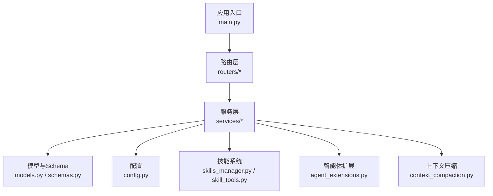
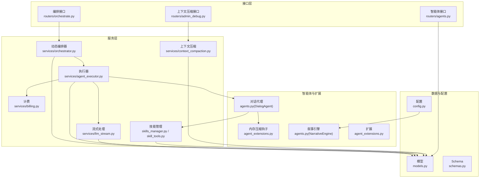
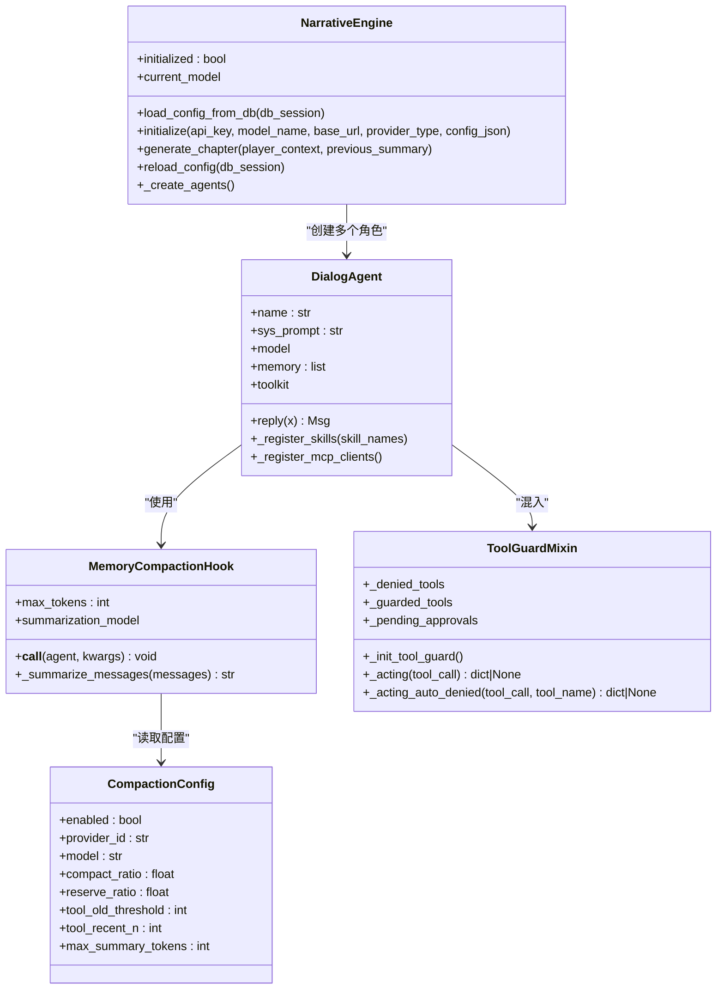
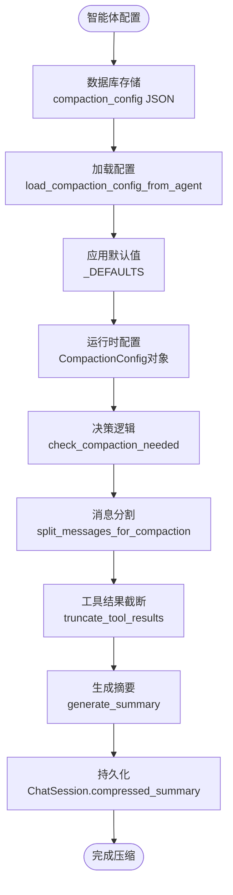
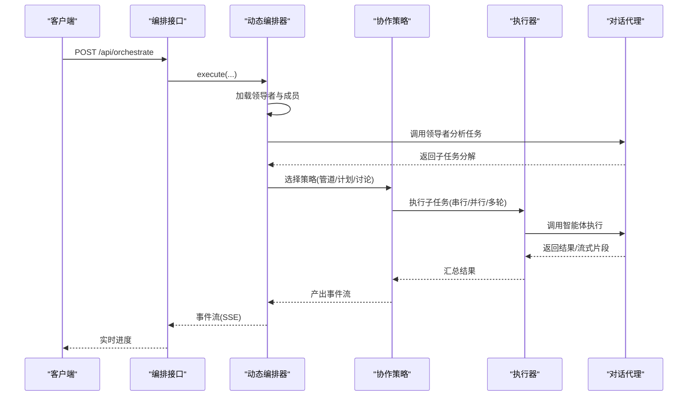
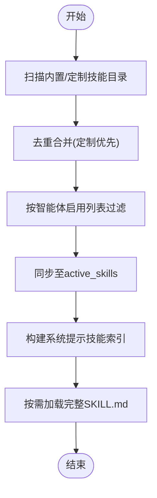
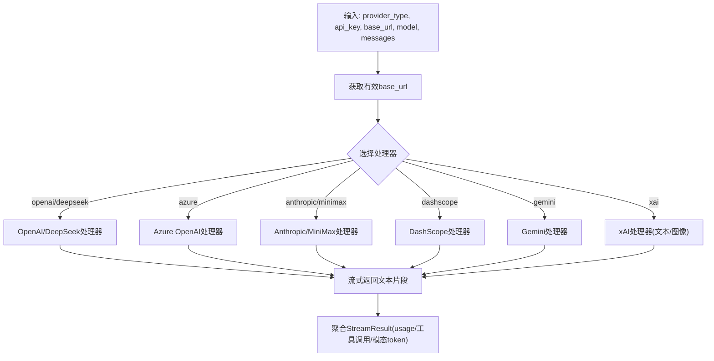
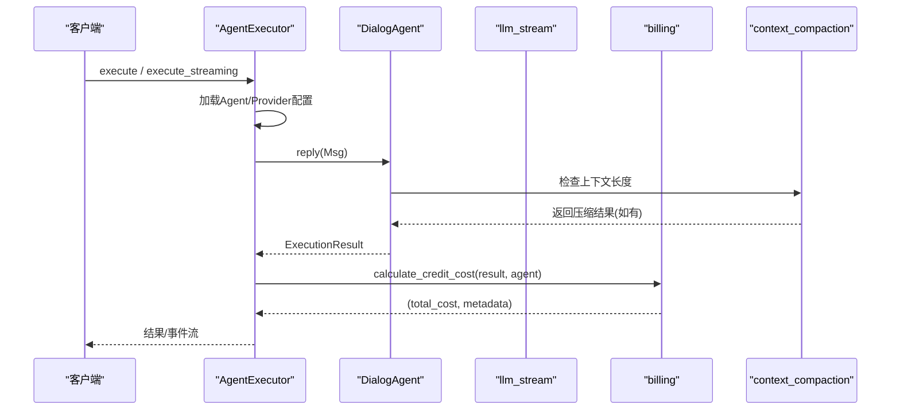
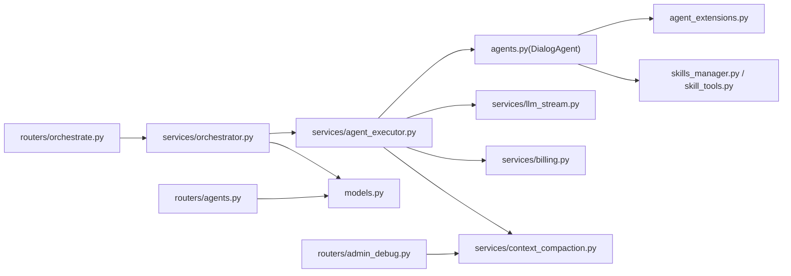

# AI智能体系统

<cite>
**本文档引用的文件**
- [backend/main.py](file://backend/main.py)
- [backend/agents.py](file://backend/agents.py)
- [backend/services/agent_executor.py](file://backend/services/agent_executor.py)
- [backend/services/orchestrator.py](file://backend/services/orchestrator.py)
- [backend/services/llm_stream.py](file://backend/services/llm_stream.py)
- [backend/skills_manager.py](file://backend/skills_manager.py)
- [backend/services/skill_tools.py](file://backend/services/skill_tools.py)
- [backend/models.py](file://backend/models.py)
- [backend/schemas.py](file://backend/schemas.py)
- [backend/routers/orchestrate.py](file://backend/routers/orchestrate.py)
- [backend/routers/agents.py](file://backend/routers/agents.py)
- [backend/agent_extensions.py](file://backend/agent_extensions.py)
- [backend/config.py](file://backend/config.py)
- [backend/services/billing.py](file://backend/services/billing.py)
- [backend/services/context_compaction.py](file://backend/services/context_compaction.py)
- [backend/migrations/versions/909762287e70_add_compaction_config_to_agent.py](file://backend/migrations/versions/909762287e70_add_compaction_config_to_agent.py)
- [backend/admin/src/components/admin/agents/AgentForm/Parameters.tsx](file://backend/admin/src/components/admin/agents/AgentForm/Parameters.tsx)
- [backend/admin/src/types/index.ts](file://backend/admin/src/types/index.ts)
- [backend/services/chat_generation.py](file://backend/services/chat_generation.py)
- [backend/routers/admin_debug.py](file://backend/routers/admin_debug.py)
</cite>

## 目录
1. [简介](#简介)
2. [项目结构](#项目结构)
3. [核心组件](#核心组件)
4. [架构总览](#架构总览)
5. [详细组件分析](#详细组件分析)
6. [依赖关系分析](#依赖关系分析)
7. [性能考虑](#性能考虑)
8. [故障排除指南](#故障排除指南)
9. [结论](#结论)
10. [附录](#附录)

## 简介
本项目是一个基于FastAPI的AI智能体系统，支持多智能体协作、技能系统、多供应商大模型接入（OpenAI、Google Gemini、xAI、Azure、DashScope、Anthropic等）、实时流式输出、计费与配额管理、以及可扩展的工具与技能加载机制。系统通过对话式智能体（DialogAgent）封装AgentScope框架，结合动态编排器（DynamicOrchestrator）实现管道式、计划式与讨论式协作模式，提供从配置加载到结果输出的完整执行链路。

**新增功能**：系统现已集成智能上下文压缩功能，通过compaction_config配置字段实现自动化的对话历史压缩，有效控制上下文长度并提升长对话场景下的性能表现。

## 项目结构
后端采用分层架构：
- 应用入口与生命周期管理：FastAPI应用、数据库迁移与启动事件
- 路由层：提供REST接口，如多智能体编排、智能体管理、聊天会话等
- 服务层：编排器、执行器、流式处理、计费、技能管理、上下文压缩等
- 模型与Schema：ORM模型与Pydantic输入输出模型
- 配置与扩展：全局配置、智能体扩展（工具守卫、记忆压缩）

图示来源
- [backend/main.py:110-174](file://backend/main.py#L110-L174)
- [backend/routers/orchestrate.py:19-71](file://backend/routers/orchestrate.py#L19-L71)
- [backend/services/orchestrator.py:560-673](file://backend/services/orchestrator.py#L560-L673)
- [backend/services/context_compaction.py:1-305](file://backend/services/context_compaction.py#L1-L305)

章节来源
- [backend/main.py:110-174](file://backend/main.py#L110-L174)
- [backend/routers/orchestrate.py:19-71](file://backend/routers/orchestrate.py#L19-L71)

## 核心组件
- 智能体引擎与对话代理
  - DialogAgent：封装AgentScope智能体，负责消息格式化、工具注册、内存压缩、令牌统计与回复生成
  - MemoryCompactionHook：智能上下文压缩钩子，基于配置自动压缩过长的对话历史
  - NarrativeEngine：故事叙述引擎，按需从数据库加载LLM配置，初始化多个角色智能体（导演、叙述者、NPC管理者）
- 编排与协作
  - DynamicOrchestrator：动态编排器，根据领导者智能体的分析结果选择协作策略（管道、计划、讨论），并管理子任务与进度事件
  - 协作策略：PipelineStrategy（串行/并行）、PlanStrategy（依赖图）、DiscussionStrategy（多轮讨论）
- 执行与流式
  - AgentExecutor：统一执行器，封装对话代理调用，支持非流式与流式两种执行路径，自动缓存模型与代理实例
  - LLM流式模块：注册表模式适配多家供应商，支持工具调用、推理模式、多模态内容与分模态token统计
- 技能系统
  - skills_manager：技能同步、版本与合并、工作区管理
  - skill_tools：技能索引构建、load_skill元工具定义
- 计费与配额
  - billing：映射表驱动的计费计算，支持文本/图像/搜索/图片生成/视频等多维度计费，原子化扣费与退款
- 配置与模型
  - config：全局配置（数据库、Redis、密钥、默认模型等）
  - models/schemas：智能体、LLM提供商、任务执行、子任务、聊天会话、计费交易等数据模型与输入输出模型
  - **新增**：compaction_config配置字段，支持精细化的上下文压缩控制

章节来源
- [backend/agents.py:40-175](file://backend/agents.py#L40-L175)
- [backend/agents.py:176-383](file://backend/agents.py#L176-L383)
- [backend/services/orchestrator.py:560-800](file://backend/services/orchestrator.py#L560-L800)
- [backend/services/agent_executor.py:63-287](file://backend/services/agent_executor.py#L63-L287)
- [backend/services/llm_stream.py:58-800](file://backend/services/llm_stream.py#L58-L800)
- [backend/skills_manager.py:15-408](file://backend/skills_manager.py#L15-L408)
- [backend/services/skill_tools.py:36-142](file://backend/services/skill_tools.py#L36-L142)
- [backend/services/billing.py:12-388](file://backend/services/billing.py#L12-L388)
- [backend/config.py:7-43](file://backend/config.py#L7-L43)
- [backend/models.py:146-253](file://backend/models.py#L146-L253)
- [backend/schemas.py:126-350](file://backend/schemas.py#L126-L350)

## 架构总览
系统采用"路由-服务-模型"三层结构，配合注册表与策略模式实现多供应商与多协作模式的解耦扩展。**新增**上下文压缩服务作为独立模块集成到服务层中。

图示来源
- [backend/routers/orchestrate.py:26-71](file://backend/routers/orchestrate.py#L26-L71)
- [backend/services/orchestrator.py:560-673](file://backend/services/orchestrator.py#L560-L673)
- [backend/services/agent_executor.py:63-287](file://backend/services/agent_executor.py#L63-L287)
- [backend/services/llm_stream.py:58-800](file://backend/services/llm_stream.py#L58-L800)
- [backend/services/billing.py:12-388](file://backend/services/billing.py#L12-L388)
- [backend/skills_manager.py:15-408](file://backend/skills_manager.py#L15-L408)
- [backend/agent_extensions.py:7-163](file://backend/agent_extensions.py#L7-L163)
- [backend/agents.py:40-383](file://backend/agents.py#L40-L383)
- [backend/models.py:146-447](file://backend/models.py#L146-L447)
- [backend/schemas.py:126-800](file://backend/schemas.py#L126-L800)
- [backend/config.py:7-43](file://backend/config.py#L7-L43)
- [backend/services/context_compaction.py:1-305](file://backend/services/context_compaction.py#L1-L305)
- [backend/routers/admin_debug.py:362-363](file://backend/routers/admin_debug.py#L362-L363)

## 详细组件分析

### 智能体配置与生命周期
- 配置加载
  - 应用启动时尝试运行数据库迁移与清理残留临时表，随后从数据库加载活动LLM提供商配置，初始化NarrativeEngine与对话代理
  - 若数据库为空，回退到配置中的默认密钥与模型
- 生命周期控制
  - DialogAgent：构造时注册工具、初始化工具守卫与记忆压缩钩子；reply时进行消息格式化、调用模型、聚合流式响应、提取令牌统计
  - **新增** MemoryCompactionHook：基于compaction_config配置智能压缩对话历史，当估算token超过阈值时，保留系统提示与最近消息，对中间对话进行摘要压缩
  - ToolGuardMixin：对受限工具进行拦截与拒绝，预留审批流程扩展点
- 参数管理
  - Agent模型包含温度、上下文窗口、系统提示、工具列表、思维模式、多模态与图像生成配置、目标节点类型等
  - **新增**：compaction_config字段支持精细化的上下文压缩控制
  - LLMProvider模型支持多种供应商类型、基础URL、模型列表、成本配置与默认标记

图示来源
- [backend/agents.py:40-175](file://backend/agents.py#L40-L175)
- [backend/agents.py:176-383](file://backend/agents.py#L176-L383)
- [backend/agent_extensions.py:7-163](file://backend/agent_extensions.py#L7-L163)
- [backend/services/context_compaction.py:45-57](file://backend/services/context_compaction.py#L45-L57)

章节来源
- [backend/main.py:49-109](file://backend/main.py#L49-L109)
- [backend/agents.py:40-175](file://backend/agents.py#L40-L175)
- [backend/agent_extensions.py:7-163](file://backend/agent_extensions.py#L7-L163)
- [backend/models.py:196-253](file://backend/models.py#L196-L253)
- [backend/schemas.py:239-350](file://backend/schemas.py#L239-L350)

### 上下文压缩配置与管理
- **新增** compaction_config配置字段
  - 数据库层面：通过迁移脚本添加JSON类型的compaction_config列
  - 模型定义：AgentBase和Agent模型均包含compaction_config字段
  - Schema定义：支持可选的字典配置，包含所有压缩相关参数
- 配置参数详解
  - enabled：启用/禁用上下文压缩功能
  - provider_id/model：自定义摘要生成的LLM提供商和模型
  - compact_ratio：压缩触发阈值（默认0.75，即75%）
  - reserve_ratio：保留比例（默认0.15，即15%）
  - tool_old_threshold：旧工具结果截断字符数（默认500）
  - tool_recent_n：最近完整保留的工具结果数量（默认5）
  - max_summary_tokens：摘要生成的最大token数（默认1024）
- 配置界面
  - 管理后台提供完整的配置界面，支持实时参数调整和可视化展示
  - 包含压缩触发阈值、保留比例、工具结果截断等参数的滑块和输入框

图示来源
- [backend/services/context_compaction.py:58-62](file://backend/services/context_compaction.py#L58-L62)
- [backend/services/context_compaction.py:208-305](file://backend/services/context_compaction.py#L208-L305)
- [backend/admin/src/components/admin/agents/AgentForm/Parameters.tsx:262-368](file://backend/admin/src/components/admin/agents/AgentForm/Parameters.tsx#L262-L368)

章节来源
- [backend/services/context_compaction.py:1-305](file://backend/services/context_compaction.py#L1-L305)
- [backend/migrations/versions/909762287e70_add_compaction_config_to_agent.py:1-35](file://backend/migrations/versions/909762287e70_add_compaction_config_to_agent.py#L1-L35)
- [backend/admin/src/components/admin/agents/AgentForm/Parameters.tsx:262-368](file://backend/admin/src/components/admin/agents/AgentForm/Parameters.tsx#L262-L368)
- [backend/admin/src/types/index.ts:29-40](file://backend/admin/src/types/index.ts#L29-L40)

### 多智能体协作机制
- 领导者模式
  - DynamicOrchestrator加载领导者与成员智能体，调用领导者分析任务并输出子任务分解方案（包含协调模式、执行模式、子任务与审查标准）
- 协作策略
  - 管道式（Pipeline）：支持串行与并行两种执行方式，适合线性任务链
  - 计划式（Plan）：构建依赖图，按依赖顺序逐步执行，支持同层并行
  - 讨论式（Discussion）：领导者主持多轮讨论，评估是否继续
- 任务分配与追踪
  - 子任务记录包含描述、顺序索引、状态、令牌用量、计费成本与错误信息
  - 支持事件流（Server-Sent Events）实时反馈执行进度

图示来源
- [backend/routers/orchestrate.py:26-71](file://backend/routers/orchestrate.py#L26-L71)
- [backend/services/orchestrator.py:560-673](file://backend/services/orchestrator.py#L560-L673)
- [backend/services/agent_executor.py:74-126](file://backend/services/agent_executor.py#L74-L126)

章节来源
- [backend/services/orchestrator.py:254-531](file://backend/services/orchestrator.py#L254-L531)
- [backend/routers/orchestrate.py:26-71](file://backend/routers/orchestrate.py#L26-L71)

### 技能系统实现
- 技能定义与动态加载
  - 技能目录结构：builtin_skills/customized_skills/active_skills，通过同步函数将定制覆盖内置技能并写入active_skills
  - 技能元数据：SKILL.md的frontmatter包含名称、描述、脚本与引用目录树
  - 版本管理：内置技能版本号从SKILL.md元数据读取，定制覆盖时比较SKILL.md差异决定是否更新
- 技能提示构建
  - 系统提示中仅包含技能索引（名称与简述），通过load_skill元工具按需加载完整技能内容
  - 元工具定义限制枚举范围，确保仅能加载当前智能体启用的技能

图示来源
- [backend/skills_manager.py:180-226](file://backend/skills_manager.py#L180-L226)
- [backend/skills_manager.py:107-143](file://backend/skills_manager.py#L107-L143)
- [backend/services/skill_tools.py:36-142](file://backend/services/skill_tools.py#L36-L142)

章节来源
- [backend/skills_manager.py:15-408](file://backend/skills_manager.py#L15-L408)
- [backend/services/skill_tools.py:36-142](file://backend/services/skill_tools.py#L36-L142)

### AI服务集成（多供应商适配器）
- 注册表模式
  - 通过装饰器注册不同供应商的流式处理函数，按provider_type分发到对应处理器
- 支持的供应商
  - OpenAI/DeepSeek：文本模型流式、工具调用、推理模式（thinking mode）
  - Azure OpenAI：兼容OpenAI接口
  - Anthropic/MiniMax：流式消息、工具调用、扩展思考模式
  - DashScope：通义千问流式
  - Gemini：多模态、图片生成、思考模式、搜索工具、分模态token统计
  - xAI/Grok：文本与图像模型，推理模式与图像生成端点
- 统一上下文
  - StreamContext封装provider_type、api_key、base_url、模型、消息、温度、上下文窗口、思维模式与工具定义
  - StreamResult聚合全文本、推理内容、文本/图像输出token、搜索次数、生成图片数量与工具调用

图示来源
- [backend/services/llm_stream.py:58-800](file://backend/services/llm_stream.py#L58-L800)

章节来源
- [backend/services/llm_stream.py:58-800](file://backend/services/llm_stream.py#L58-L800)

### 执行流程：从配置到输出
- 非流式执行
  - AgentExecutor.execute：加载智能体与提供商配置，构建对话代理，调用DialogAgent.reply，返回标准化执行结果（内容、令牌统计、字符统计）
- 流式执行
  - AgentExecutor.execute_streaming：绕过DialogAgent.reply，直接调用stream_completion，逐块返回文本与运行时结果
- 计费与审计
  - calculate_credit_cost：按维度映射表计算总费用，支持文本/图像/搜索/图片生成等多维统计
  - deduct_credits_atomic/refund_credits_atomic：原子化扣费与退款，记录CreditTransaction
- **新增** 上下文压缩执行流程
  - 在对话生成过程中自动检查上下文长度
  - 当超过配置阈值时，执行消息压缩和摘要生成
  - 支持管理员调试模式下的手动压缩

图示来源
- [backend/services/agent_executor.py:74-208](file://backend/services/agent_executor.py#L74-L208)
- [backend/services/llm_stream.py:76-800](file://backend/services/llm_stream.py#L76-L800)
- [backend/services/billing.py:310-351](file://backend/services/billing.py#L310-L351)
- [backend/services/context_compaction.py:208-305](file://backend/services/context_compaction.py#L208-L305)

章节来源
- [backend/services/agent_executor.py:63-287](file://backend/services/agent_executor.py#L63-L287)
- [backend/services/billing.py:12-388](file://backend/services/billing.py#L12-L388)
- [backend/services/context_compaction.py:1-305](file://backend/services/context_compaction.py#L1-L305)

## 依赖关系分析
- 组件耦合
  - DynamicOrchestrator依赖AgentExecutor与数据库模型，策略类通过注册表解耦
  - AgentExecutor依赖Agent模型、LLMProvider模型与流式模块
  - DialogAgent依赖工具包、MCP客户端管理器与扩展（工具守卫、记忆压缩）
  - **新增**：上下文压缩服务独立于其他组件，通过接口调用集成
- 外部依赖
  - AgentScope：智能体框架与模型封装
  - OpenAI/Anthropic/DashScope/Gemini SDK：供应商SDK
  - SQLAlchemy：异步ORM与事务
  - FastAPI/Uvicorn：Web框架与ASGI服务器

图示来源
- [backend/services/orchestrator.py:560-673](file://backend/services/orchestrator.py#L560-L673)
- [backend/services/agent_executor.py:63-287](file://backend/services/agent_executor.py#L63-L287)
- [backend/agents.py:40-383](file://backend/agents.py#L40-L383)
- [backend/agent_extensions.py:7-163](file://backend/agent_extensions.py#L7-L163)
- [backend/skills_manager.py:15-408](file://backend/skills_manager.py#L15-L408)
- [backend/services/skill_tools.py:36-142](file://backend/services/skill_tools.py#L36-L142)
- [backend/services/billing.py:12-388](file://backend/services/billing.py#L12-L388)
- [backend/routers/orchestrate.py:26-71](file://backend/routers/orchestrate.py#L26-L71)
- [backend/routers/agents.py:16-151](file://backend/routers/agents.py#L16-L151)
- [backend/routers/admin_debug.py:362-363](file://backend/routers/admin_debug.py#L362-L363)

章节来源
- [backend/services/orchestrator.py:560-800](file://backend/services/orchestrator.py#L560-L800)
- [backend/services/agent_executor.py:63-287](file://backend/services/agent_executor.py#L63-L287)
- [backend/agents.py:40-383](file://backend/agents.py#L40-L383)

## 性能考虑
- 并发执行
  - 管道并行：使用asyncio.gather并行执行所有子任务，提升吞吐
  - 计划并行：同一层级内按依赖满足度并行执行
- 缓存机制
  - AgentExecutor缓存模型与对话代理实例，避免重复初始化
  - 技能同步时按差异更新，减少I/O
  - **新增**：上下文压缩结果缓存到ChatSession.compressed_summary，避免重复计算
- 资源管理
  - **新增** MemoryCompactionHook在对话增长时自动摘要压缩，控制上下文大小
  - **新增**：工具结果截断功能减少不必要的token消耗
  - 统一的流式处理与事件流，降低内存峰值
- 计费与配额
  - 映射表驱动的计费计算，避免条件分支开销
  - 原子化扣费与退款，保证并发一致性

## 故障排除指南
- 数据库连接失败与迁移
  - 启动阶段具备重试与残留表清理逻辑，若仍失败检查数据库URL与权限
- LLM提供商配置
  - 若无活动提供商，系统回退到配置中的默认密钥与模型；检查配置项与provider_type映射
- 流式调用异常
  - 检查供应商SDK可用性、网络连通性与API密钥；查看流式处理器日志
- 计费失败
  - 余额不足或账户冻结会抛出相应异常；检查用户余额与冻结状态
- 工具守卫拦截
  - 被拦截工具会返回系统消息提示；确认工具白名单与审批流程
- **新增** 上下文压缩问题
  - 检查compaction_config配置是否正确；验证摘要生成模型可用性
  - 查看压缩日志，确认消息分割和摘要生成过程是否正常

章节来源
- [backend/main.py:49-109](file://backend/main.py#L49-L109)
- [backend/agents.py:176-233](file://backend/agents.py#L176-L233)
- [backend/services/llm_stream.py:76-800](file://backend/services/llm_stream.py#L76-L800)
- [backend/services/billing.py:37-84](file://backend/services/billing.py#L37-L84)
- [backend/agent_extensions.py:19-79](file://backend/agent_extensions.py#L19-L79)
- [backend/services/context_compaction.py:1-305](file://backend/services/context_compaction.py#L1-L305)

## 结论
本系统通过清晰的分层架构与注册表/策略模式实现了多供应商与多协作模式的高扩展性；借助对话代理、编排器与流式处理，提供了从配置加载到实时输出的完整链路；技能系统与工具守卫保障了安全性与可维护性；计费模块确保了资源使用的可控与可观测。

**新增功能价值**：智能上下文压缩功能显著提升了系统在长对话场景下的性能表现，通过可配置的压缩策略平衡了对话质量与资源消耗，为大规模AI应用场景提供了可靠的技术支撑。

建议在生产环境中进一步完善审批流程、监控与告警体系，并持续优化上下文压缩与缓存策略以提升性能。

## 附录
- 关键配置项
  - 数据库URL、Redis地址、默认模型、JWT密钥与过期时间
  - **新增**：compaction_config配置字段及其所有子参数
- 常用模型字段
  - Agent：名称、描述、提供商、模型、温度、上下文窗口、系统提示、工具、思维模式、图像/视频计费、领导者配置、目标节点类型、**上下文压缩配置**
  - LLMProvider：名称、供应商类型、API密钥、基础URL、模型列表、标签、是否激活/默认、配置JSON、模型成本

章节来源
- [backend/config.py:7-43](file://backend/config.py#L7-L43)
- [backend/models.py:146-253](file://backend/models.py#L146-L253)
- [backend/schemas.py:126-350](file://backend/schemas.py#L126-L350)
- [backend/services/context_compaction.py:25-35](file://backend/services/context_compaction.py#L25-L35)