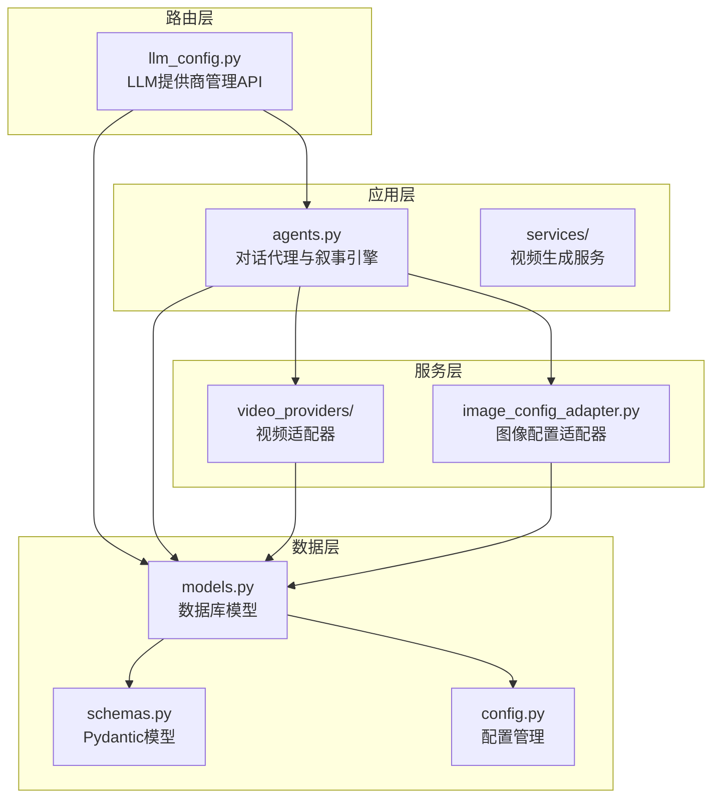
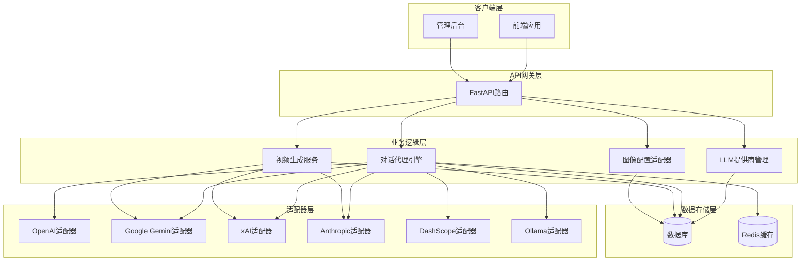
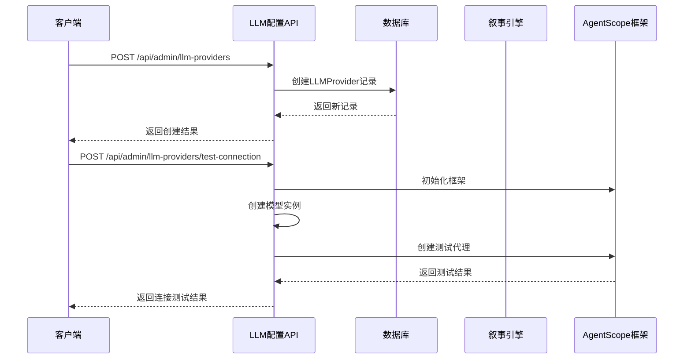
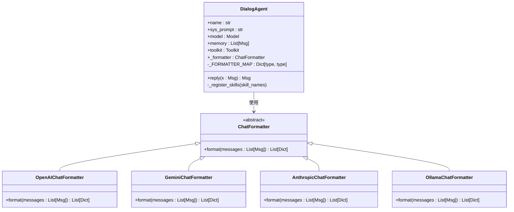
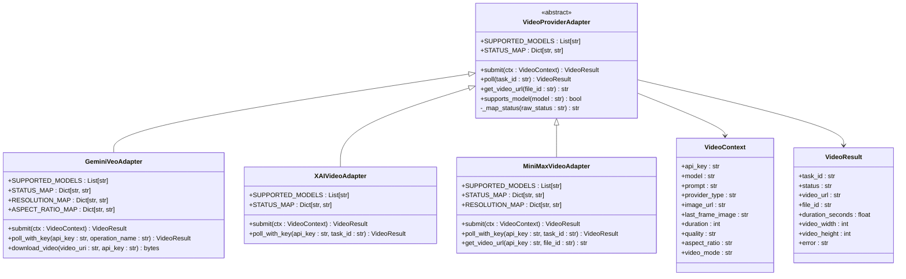
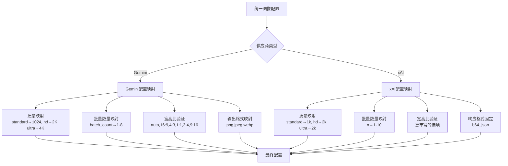
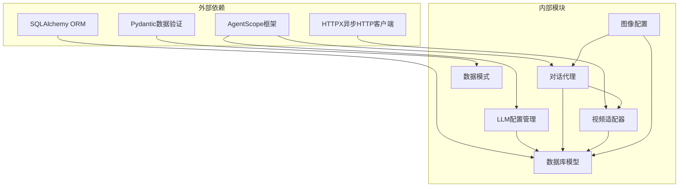

# AI服务提供商集成

<cite>
**本文档引用的文件**
- [llm_config.py](file://backend/routers/llm_config.py)
- [agents.py](file://backend/agents.py)
- [models.py](file://backend/models.py)
- [schemas.py](file://backend/schemas.py)
- [config.py](file://backend/config.py)
- [base.py](file://backend/services/video_providers/base.py)
- [gemini_provider.py](file://backend/services/video_providers/gemini_provider.py)
- [xai_provider.py](file://backend/services/video_providers/xai_provider.py)
- [minimax_provider.py](file://backend/services/video_providers/minimax_provider.py)
- [image_config_adapter.py](file://backend/services/image_config_adapter.py)
</cite>

## 目录
1. [简介](#简介)
2. [项目结构](#项目结构)
3. [核心组件](#核心组件)
4. [架构概览](#架构概览)
5. [详细组件分析](#详细组件分析)
6. [依赖分析](#依赖分析)
7. [性能考虑](#性能考虑)
8. [故障排除指南](#故障排除指南)
9. [结论](#结论)
10. [附录](#附录)

## 简介
本文件详细阐述了基于AgentScope框架的AI服务提供商集成方案。系统通过统一的适配器设计，实现了多家AI服务提供商（OpenAI、Google Gemini、xAI、Anthropic、DashScope、Ollama等）的无缝集成。文档重点涵盖：

- 适配器设计：模型类映射、格式化器选择和客户端配置
- 多家AI服务提供商支持：OpenAI、Google Gemini、xAI、Anthropic、DashScope、Ollama
- 模型初始化流程：API密钥验证、基础URL配置和模型参数设置
- 格式化器适配机制：消息格式转换、角色映射和特殊字段处理
- 配置管理最佳实践：环境变量、数据库配置和运行时切换
- 错误处理、重试机制和性能监控
- 本地模型（Ollama）与云端服务的统一抽象设计

## 项目结构
后端采用模块化设计，主要分为以下几个层次：

**图表来源**
- [llm_config.py:1-233](file://backend/routers/llm_config.py#L1-L233)
- [agents.py:1-388](file://backend/agents.py#L1-L388)
- [models.py:146-260](file://backend/models.py#L146-L260)
- [schemas.py:124-170](file://backend/schemas.py#L124-L170)
- [config.py:1-43](file://backend/config.py#L1-L43)

**章节来源**
- [llm_config.py:1-233](file://backend/routers/llm_config.py#L1-L233)
- [agents.py:1-388](file://backend/agents.py#L1-L388)
- [models.py:146-260](file://backend/models.py#L146-L260)
- [schemas.py:124-170](file://backend/schemas.py#L124-L170)
- [config.py:1-43](file://backend/config.py#L1-L43)

## 核心组件
系统的核心组件包括：

### 1. LLM提供商管理
- 提供完整的CRUD操作
- 连接测试功能
- 默认/激活状态管理
- 配置JSON存储

### 2. 对话代理系统
- 基于AgentScope的统一代理框架
- 动态格式化器选择
- 工具集与技能管理
- 内存压缩钩子

### 3. 视频生成服务
- 统一的视频适配器接口
- 多供应商支持（Gemini、xAI、MiniMax）
- 异步任务管理和状态轮询

### 4. 图像配置适配器
- 供应商无关的统一配置
- 自动映射到具体供应商格式
- 批量生成参数优化

**章节来源**
- [llm_config.py:137-233](file://backend/routers/llm_config.py#L137-L233)
- [agents.py:40-175](file://backend/agents.py#L40-L175)
- [base.py:49-114](file://backend/services/video_providers/base.py#L49-L114)
- [image_config_adapter.py:115-163](file://backend/services/image_config_adapter.py#L115-L163)

## 架构概览
系统采用分层架构，通过适配器模式实现供应商解耦：

**图表来源**
- [llm_config.py:20-24](file://backend/routers/llm_config.py#L20-L24)
- [agents.py:274-297](file://backend/agents.py#L274-L297)
- [gemini_provider.py:31-44](file://backend/services/video_providers/gemini_provider.py#L31-L44)
- [xai_provider.py:22-38](file://backend/services/video_providers/xai_provider.py#L22-L38)
- [minimax_provider.py:30-51](file://backend/services/video_providers/minimax_provider.py#L30-L51)

## 详细组件分析

### LLM提供商管理组件
负责AI服务提供商的全生命周期管理：

#### 模型初始化流程

**图表来源**
- [llm_config.py:101-136](file://backend/routers/llm_config.py#L101-L136)
- [agents.py:234-297](file://backend/agents.py#L234-L297)

#### 连接测试机制
系统支持多种测试策略：
- **标准模型测试**：通过发送测试消息验证连接
- **视频模型测试**：直接调用`/v1/models`端点验证API Key
- **Azure特殊处理**：使用专用客户端类型

**章节来源**
- [llm_config.py:49-136](file://backend/routers/llm_config.py#L49-L136)

### 对话代理组件
基于AgentScope的统一代理框架，支持动态格式化器选择：

#### 格式化器适配机制

**图表来源**
- [agents.py:40-69](file://backend/agents.py#L40-L69)
- [agents.py:42-47](file://backend/agents.py#L42-L47)

#### 模型类映射
系统支持的模型类型及对应格式化器：

| 模型类型 | 模型类 | 格式化器 | 客户端类型 |
|---------|--------|----------|-----------|
| OpenAI | OpenAIChatModel | OpenAIChatFormatter | openai |
| Google Gemini | GeminiChatModel | GeminiChatFormatter | openai |
| xAI | OpenAIChatModel | OpenAIChatFormatter | xai |
| Anthropic | AnthropicChatModel | AnthropicChatFormatter | anthropic |
| DashScope | DashScopeChatModel | DashScopeChatFormatter | openai |
| Ollama | OllamaChatModel | OllamaChatFormatter | openai |

**章节来源**
- [agents.py:4-11](file://backend/agents.py#L4-L11)
- [agents.py:245-288](file://backend/agents.py#L245-L288)

### 视频生成服务组件
统一的视频生成适配器接口，支持多家供应商：

#### 视频适配器基类设计

**图表来源**
- [base.py:49-114](file://backend/services/video_providers/base.py#L49-L114)
- [gemini_provider.py:31-79](file://backend/services/video_providers/gemini_provider.py#L31-L79)
- [xai_provider.py:22-46](file://backend/services/video_providers/xai_provider.py#L22-L46)
- [minimax_provider.py:30-89](file://backend/services/video_providers/minimax_provider.py#L30-L89)

#### 供应商特定实现
每个供应商都有专门的适配器实现：

**Google Gemini适配器特点：**
- 支持Veo 3.1和2.0系列模型
- 原生音频支持
- 首尾帧图片支持
- 操作名称轮询机制

**xAI适配器特点：**
- 支持Grok视频模型
- 内容审核机制
- 状态映射表
- 直接URL获取

**MiniMax适配器特点：**
- 支持Hailuo系列模型
- 文件ID下载机制
- 快速预处理选项
- 主题参考功能

**章节来源**
- [base.py:15-47](file://backend/services/video_providers/base.py#L15-L47)
- [gemini_provider.py:80-161](file://backend/services/video_providers/gemini_provider.py#L80-L161)
- [xai_provider.py:47-104](file://backend/services/video_providers/xai_provider.py#L47-L104)
- [minimax_provider.py:90-134](file://backend/services/video_providers/minimax_provider.py#L90-L134)

### 图像配置适配器
实现供应商无关的统一图像配置：

#### 配置映射机制

**图表来源**
- [image_config_adapter.py:12-46](file://backend/services/image_config_adapter.py#L12-L46)
- [image_config_adapter.py:51-104](file://backend/services/image_config_adapter.py#L51-L104)

**章节来源**
- [image_config_adapter.py:115-163](file://backend/services/image_config_adapter.py#L115-L163)

## 依赖分析
系统的关键依赖关系如下：

**图表来源**
- [agents.py:1-24](file://backend/agents.py#L1-L24)
- [llm_config.py:1-18](file://backend/routers/llm_config.py#L1-L18)
- [models.py:1-10](file://backend/models.py#L1-L10)

**章节来源**
- [agents.py:1-24](file://backend/agents.py#L1-L24)
- [llm_config.py:1-18](file://backend/routers/llm_config.py#L1-L18)
- [models.py:1-10](file://backend/models.py#L1-L10)

## 性能考虑
系统在性能方面采用了多项优化措施：

### 1. 异步处理
- 所有网络请求使用异步HTTP客户端
- 视频生成任务采用异步轮询
- 数据库操作使用异步会话

### 2. 缓存策略
- Redis缓存用于会话状态管理
- 内存压缩减少历史消息占用
- 批量处理优化图像生成

### 3. 连接池管理
- HTTP客户端连接池复用
- 数据库连接池配置
- 供应商API连接池管理

### 4. 超时配置
- HTTP请求超时时间可配置
- 数据库操作超时控制
- 供应商API超时处理

## 故障排除指南

### 常见问题及解决方案

#### 1. API密钥验证失败
**症状：** 连接测试返回认证错误
**解决步骤：**
1. 检查API密钥格式是否正确
2. 验证供应商类型映射
3. 确认基础URL配置
4. 查看供应商端点可用性

#### 2. 模型初始化异常
**症状：** 代理创建失败或响应为空
**解决步骤：**
1. 验证模型名称有效性
2. 检查供应商支持的模型列表
3. 确认配置JSON格式正确
4. 查看AgentScope初始化日志

#### 3. 视频生成任务失败
**症状：** 任务状态长时间为pending
**解决步骤：**
1. 检查供应商API配额限制
2. 验证输入参数格式
3. 确认轮询间隔设置
4. 查看供应商错误响应

#### 4. 图像配置映射错误
**症状：** 图像生成参数不生效
**解决步骤：**
1. 验证统一配置格式
2. 检查供应商支持的参数范围
3. 确认批量数量限制
4. 查看配置适配日志

**章节来源**
- [llm_config.py:132-136](file://backend/routers/llm_config.py#L132-L136)
- [agents.py:291-293](file://backend/agents.py#L291-L293)
- [gemini_provider.py:158-161](file://backend/services/video_providers/gemini_provider.py#L158-L161)
- [xai_provider.py:161-164](file://backend/services/video_providers/xai_provider.py#L161-L164)

## 结论
本AI服务提供商集成方案通过AgentScope框架实现了高度模块化的供应商抽象，具有以下优势：

1. **统一抽象**：通过适配器模式实现多家供应商的统一接口
2. **灵活配置**：支持运行时切换和动态配置管理
3. **性能优化**：异步处理和缓存策略提升系统性能
4. **错误处理**：完善的异常处理和重试机制
5. **扩展性强**：易于添加新的AI服务提供商

该方案为构建企业级AI应用提供了坚实的技术基础，支持从本地部署到云端服务的多种部署场景。

## 附录

### 配置管理最佳实践

#### 环境变量配置
- 使用`.env`文件管理敏感配置
- 支持多环境配置切换
- 环境变量优先级管理

#### 数据库配置
- 支持SQLite和PostgreSQL
- 异步数据库连接
- 迁移脚本自动化

#### 运行时切换
- 动态加载供应商配置
- 平滑切换机制
- 配置热更新支持

### 错误处理和重试机制
- 指数退避重试策略
- 超时异常处理
- 供应商特定错误映射
- 降级策略实现

### 性能监控
- 请求延迟监控
- 错误率统计
- 资源使用情况
- 性能指标导出