# 多智能体协作系统

<cite>
**本文档引用的文件**
- [agents.py](file://backend/agents.py)
- [orchestrator.py](file://backend/services/orchestrator.py)
- [agent_executor.py](file://backend/services/agent_executor.py)
- [models.py](file://backend/models.py)
- [orchestrate.py](file://backend/routers/orchestrate.py)
- [billing.py](file://backend/services/billing.py)
- [skills_manager.py](file://backend/skills_manager.py)
</cite>

## 目录
1. [简介](#简介)
2. [项目结构](#项目结构)
3. [核心组件](#核心组件)
4. [架构概览](#架构概览)
5. [详细组件分析](#详细组件分析)
6. [依赖分析](#依赖分析)
7. [性能考虑](#性能考虑)
8. [故障排除指南](#故障排除指南)
9. [结论](#结论)

## 简介

本项目是一个基于AgentScope框架构建的多智能体协作系统，专注于叙事创作和故事生成。系统实现了三个核心智能体：Director导演智能体、Narrator叙述智能体和NPC_Manager管理智能体，通过动态编排策略实现高效的协作流程。

系统采用领导者模式（Leader Mode）进行任务分配和协调，支持管道式（Pipeline）、计划式（Plan）和讨论式（Discussion）三种协作策略。每个智能体都具备工具调用能力，可以访问内置技能和自定义技能，实现丰富的功能扩展。

## 项目结构

系统采用分层架构设计，主要分为以下几个层次：

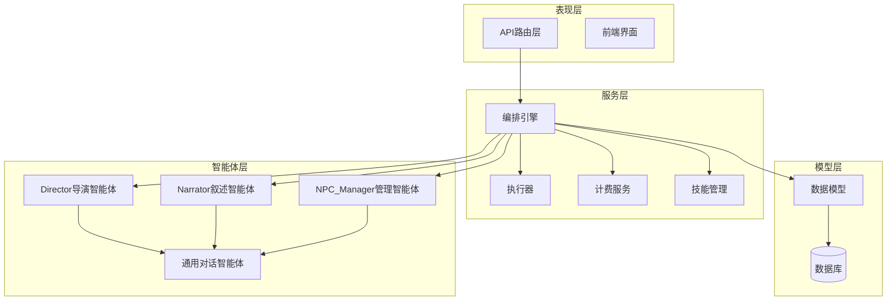

**图表来源**
- [orchestrate.py:26-71](file://backend/routers/orchestrate.py#L26-L71)
- [orchestrator.py:560-673](file://backend/services/orchestrator.py#L560-L673)
- [agents.py:176-383](file://backend/agents.py#L176-L383)

**章节来源**
- [orchestrate.py:1-184](file://backend/routers/orchestrate.py#L1-L184)
- [models.py:146-330](file://backend/models.py#L146-L330)

## 核心组件

### 智能体引擎（NarrativeEngine）

NarrativeEngine是系统的核心协调器，负责管理三个专业智能体：

- **Director导演智能体**：负责故事大纲制定和情节指导
- **Narrator叙述智能体**：负责将大纲转化为生动的故事内容
- **NPC_Manager管理智能体**：负责NPC状态管理和关系维护

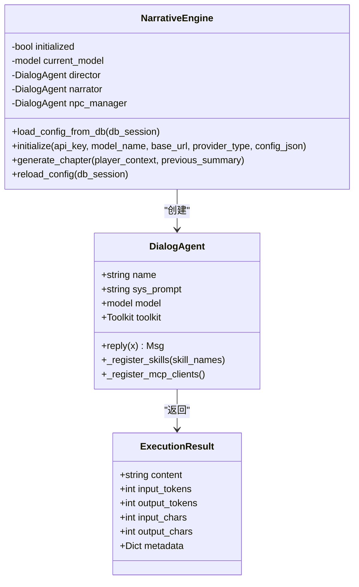

**图表来源**
- [agents.py:176-383](file://backend/agents.py#L176-L383)
- [agents.py:40-174](file://backend/agents.py#L40-L174)
- [agent_executor.py:32-44](file://backend/services/agent_executor.py#L32-L44)

### 编排引擎（DynamicOrchestrator）

DynamicOrchestrator实现了领导者模式，负责任务分解、成员管理和协作策略执行：

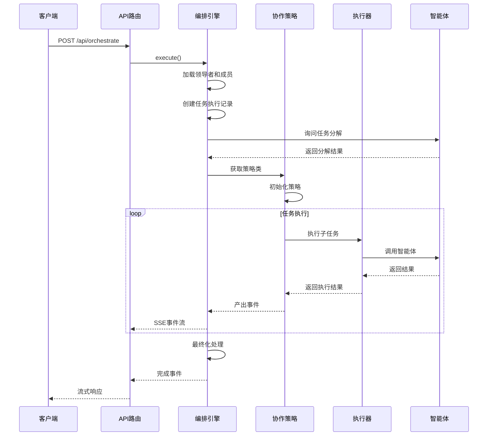

**图表来源**
- [orchestrate.py:46-71](file://backend/routers/orchestrate.py#L46-L71)
- [orchestrator.py:580-673](file://backend/services/orchestrator.py#L580-L673)

**章节来源**
- [orchestrator.py:560-807](file://backend/services/orchestrator.py#L560-L807)

## 架构概览

系统采用事件驱动的异步架构，支持实时流式响应：

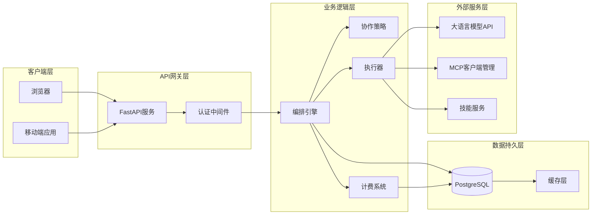

**图表来源**
- [orchestrate.py:19-71](file://backend/routers/orchestrate.py#L19-L71)
- [orchestrator.py:82-108](file://backend/services/orchestrator.py#L82-L108)

## 详细组件分析

### 协作策略体系

系统实现了三种核心协作策略，通过注册表模式实现动态选择：

#### 管道式策略（Pipeline Strategy）

管道式策略支持串行和并行两种执行模式：

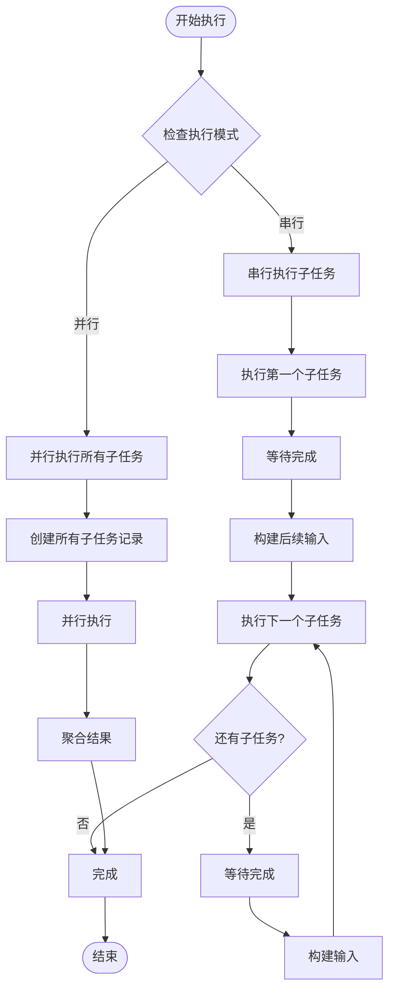

**图表来源**
- [orchestrator.py:254-318](file://backend/services/orchestrator.py#L254-L318)

#### 计划式策略（Plan Strategy）

计划式策略支持任务依赖关系和动态调整：

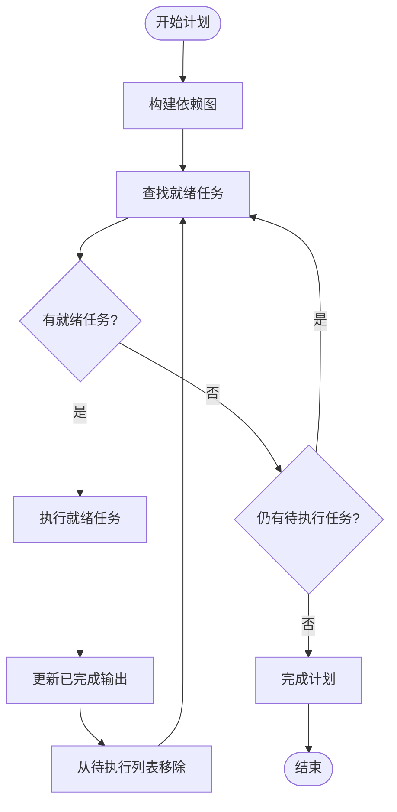

**图表来源**
- [orchestrator.py:325-406](file://backend/services/orchestrator.py#L325-L406)

#### 讨论式策略（Discussion Strategy）

讨论式策略模拟多轮讨论过程：

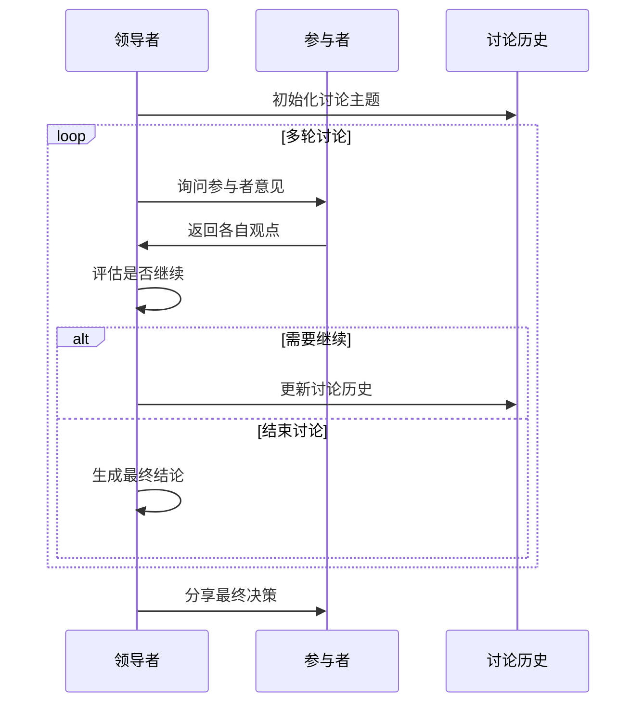

**图表来源**
- [orchestrator.py:413-530](file://backend/services/orchestrator.py#L413-L530)

### 智能体执行器

AgentExecutor提供了统一的智能体执行接口，支持同步和流式两种模式：

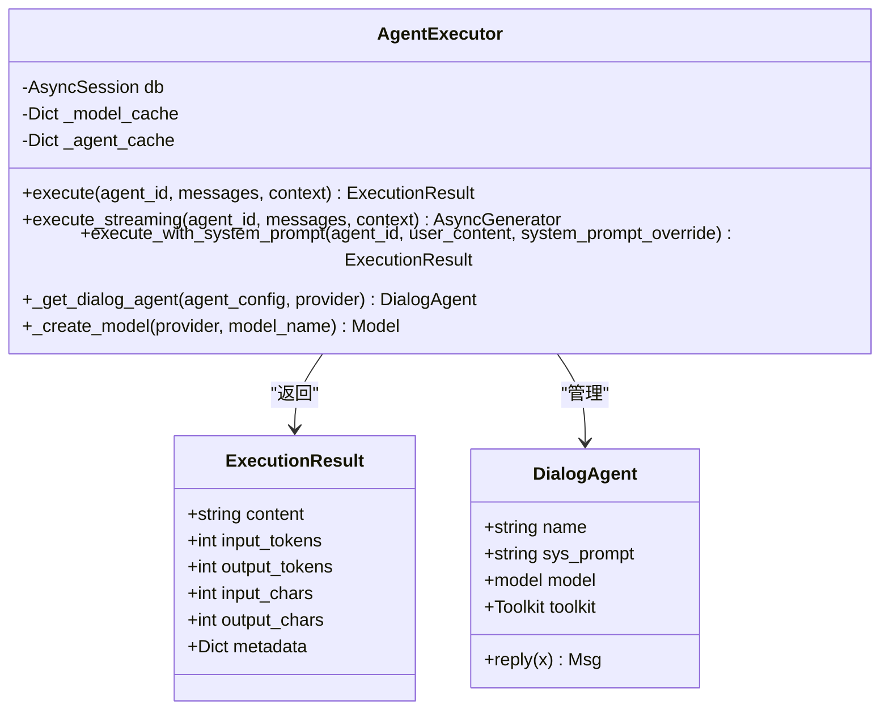

**图表来源**
- [agent_executor.py:63-277](file://backend/services/agent_executor.py#L63-L277)
- [agent_executor.py:32-44](file://backend/services/agent_executor.py#L32-L44)

**章节来源**
- [agent_executor.py:1-287](file://backend/services/agent_executor.py#L1-L287)

### 数据模型

系统使用SQLAlchemy ORM定义了完整的数据模型：

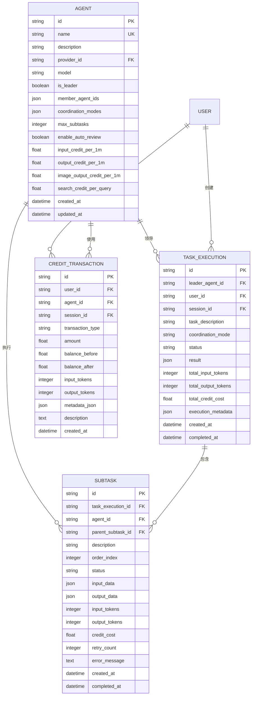

**图表来源**
- [models.py:196-330](file://backend/models.py#L196-L330)

**章节来源**
- [models.py:146-447](file://backend/models.py#L146-L447)

### 技能管理系统

系统实现了灵活的技能管理机制：

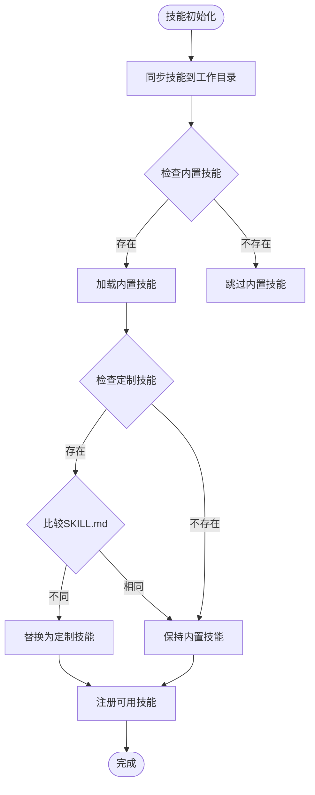

**图表来源**
- [skills_manager.py:180-225](file://backend/skills_manager.py#L180-L225)

**章节来源**
- [skills_manager.py:1-408](file://backend/skills_manager.py#L1-L408)

## 依赖分析

系统采用模块化设计，各组件间依赖关系清晰：

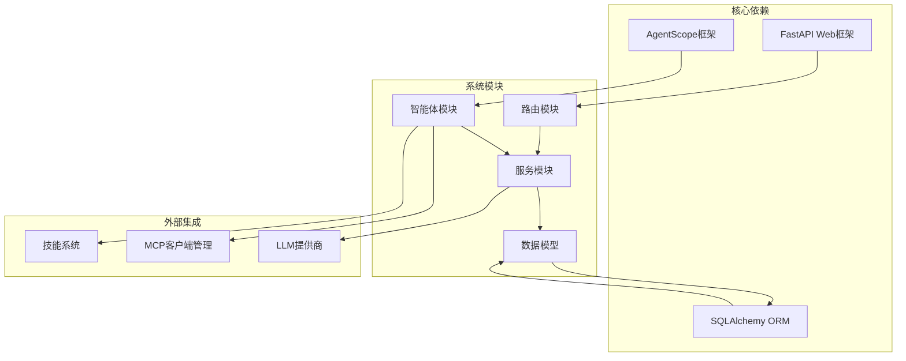

**图表来源**
- [agents.py:1-25](file://backend/agents.py#L1-L25)
- [orchestrator.py:7-22](file://backend/services/orchestrator.py#L7-L22)

### 组件耦合度分析

系统在设计上遵循高内聚、低耦合的原则：

- **智能体层**：与执行器解耦，通过统一接口交互
- **编排层**：与具体策略解耦，通过注册表模式动态选择
- **数据层**：通过ORM抽象屏蔽数据库差异
- **外部服务**：通过适配器模式集成第三方服务

**章节来源**
- [orchestrator.py:62-76](file://backend/services/orchestrator.py#L62-L76)
- [agent_executor.py:63-73](file://backend/services/agent_executor.py#L63-L73)

## 性能考虑

### 并发执行优化

系统采用异步编程模型，支持高并发执行：

- **并行执行**：使用`asyncio.gather()`并行执行多个子任务
- **流式响应**：通过Server-Sent Events实现实时进度反馈
- **内存管理**：智能体缓存机制减少重复初始化开销

### 资源管理策略

- **令牌限制**：通过上下文窗口限制防止内存溢出
- **缓存机制**：模型和智能体实例缓存提升响应速度
- **连接池**：数据库连接池优化数据库访问性能

### 计费优化

系统实现了精细化的计费机制：

```mermaid
flowchart LR
subgraph "计费维度"
Input[输入令牌]
Output[输出令牌]
Image[图像输出]
Search[搜索查询]
ImageGen[图像生成]
end
subgraph "计算公式"
Formula[总量 = Σ(数量/规模 × 费率)]
end
Input --> Formula
Output --> Formula
Image --> Formula
Search --> Formula
ImageGen --> Formula
```

**图表来源**
- [billing.py:12-30](file://backend/services/billing.py#L12-L30)

**章节来源**
- [billing.py:279-350](file://backend/services/billing.py#L279-L350)

## 故障排除指南

### 常见问题及解决方案

#### 智能体初始化失败

**症状**：智能体无法正常工作，返回空响应

**原因分析**：
- LLM提供商配置缺失
- API密钥无效
- 模型名称不正确

**解决方案**：
1. 检查LLM提供商配置
2. 验证API密钥有效性
3. 确认模型名称正确性

#### 编排执行异常

**症状**：多智能体协作过程中断

**原因分析**：
- 成员智能体配置错误
- 任务分解结果无效
- 策略执行超时

**解决方案**：
1. 验证领导者配置
2. 检查任务分解逻辑
3. 设置合理的超时时间

#### 计费异常

**症状**：积分扣费不准确

**原因分析**：
- 计费维度识别错误
- 费率配置不正确
- 令牌统计异常

**解决方案**：
1. 检查计费维度映射
2. 验证费率配置
3. 核对令牌统计

**章节来源**
- [orchestrator.py:660-673](file://backend/services/orchestrator.py#L660-L673)
- [billing.py:37-43](file://backend/services/billing.py#L37-L43)

## 结论

本多智能体协作系统通过精心设计的架构实现了高效的故事创作和管理功能。系统的主要优势包括：

1. **模块化设计**：清晰的分层架构便于维护和扩展
2. **灵活的协作策略**：支持多种协作模式适应不同场景
3. **强大的智能体能力**：具备工具调用和记忆管理功能
4. **完善的计费系统**：精确的计费机制确保成本控制
5. **实时响应能力**：流式响应提供良好的用户体验

系统在实际应用中展现了优秀的可扩展性和稳定性，为复杂的人工智能协作场景提供了可靠的基础设施。