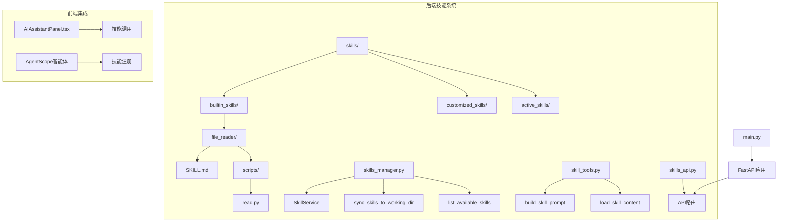
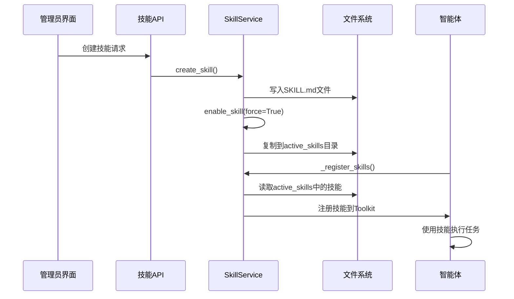
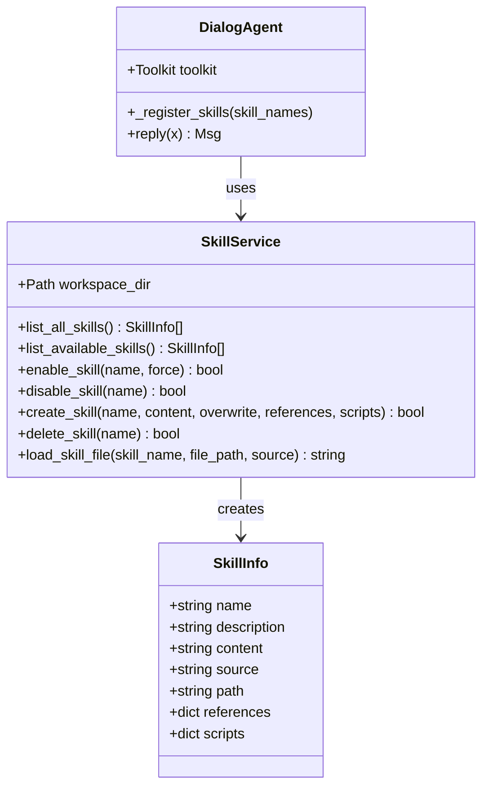
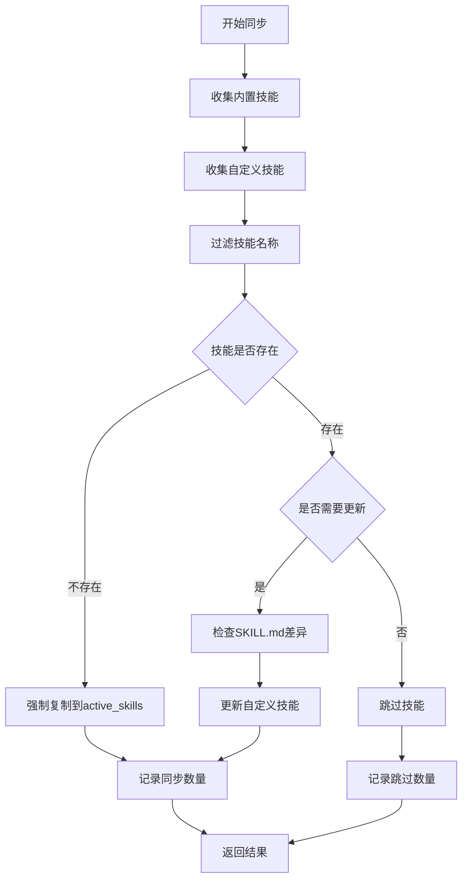
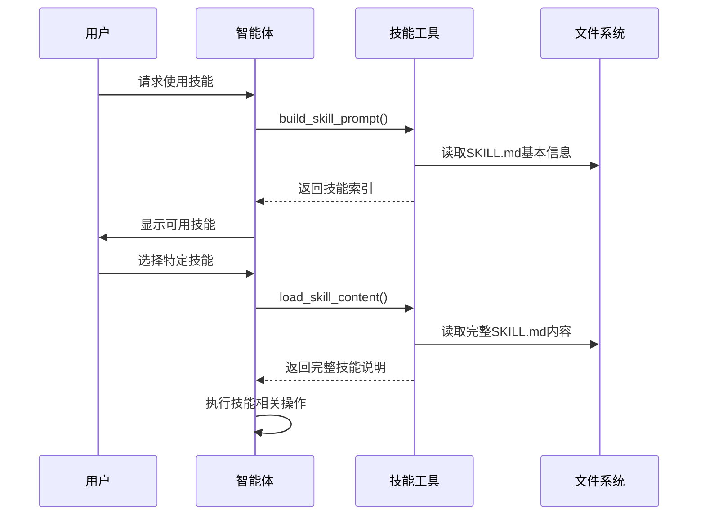
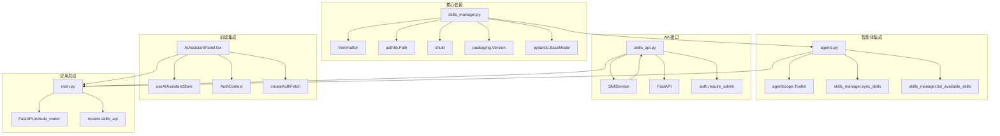

# 技能系统

<cite>
**本文档引用的文件**
- [skills_manager.py](file://backend/skills_manager.py)
- [skill_tools.py](file://backend/services/skill_tools.py)
- [skills_api.py](file://backend/routers/skills_api.py)
- [agents.py](file://backend/agents.py)
- [main.py](file://backend/main.py)
- [file_reader/SKILL.md](file://backend/skills/builtin_skills/file_reader/SKILL.md)
- [file_reader/scripts/read.py](file://backend/skills/builtin_skills/file_reader/scripts/read.py)
- [AIAssistantPanel.tsx](file://frontend/src/components/canvas/AIAssistantPanel.tsx)
- [README.md](file://README.md)
</cite>

## 目录
1. [简介](#简介)
2. [项目结构](#项目结构)
3. [核心组件](#核心组件)
4. [架构概览](#架构概览)
5. [详细组件分析](#详细组件分析)
6. [依赖关系分析](#依赖关系分析)
7. [性能考虑](#性能考虑)
8. [故障排除指南](#故障排除指南)
9. [结论](#结论)

## 简介

技能系统是基于 AgentScope 多智能体框架构建的可扩展功能模块架构，支持智能体在运行时动态加载和使用各种技能插件。该系统提供了完整的技能生命周期管理，包括技能的创建、启用、禁用、删除以及与智能体的集成。

技能系统的核心设计理念是"按需加载"和"热插拔"机制，通过轻量级的技能索引在系统提示中提供技能信息，而完整的技能内容仅在需要时才被加载，从而优化了性能和内存使用。

## 项目结构

技能系统主要分布在以下目录结构中：

**图表来源**
- [skills_manager.py:1-408](file://backend/skills_manager.py#L1-L408)
- [skill_tools.py:1-130](file://backend/services/skill_tools.py#L1-L130)
- [skills_api.py:1-207](file://backend/routers/skills_api.py#L1-L207)

**章节来源**
- [README.md:70-127](file://README.md#L70-L127)
- [skills_manager.py:43-63](file://backend/skills_manager.py#L43-L63)

## 核心组件

技能系统由三个核心组件构成：

### 1. 技能管理器 (SkillService)
负责技能的完整生命周期管理，包括：
- 技能的创建、读取、更新、删除
- 技能的启用和禁用
- 技能内容的加载和验证
- 路径安全检查和文件操作

### 2. 技能工具构建器
提供技能相关的工具函数：
- 构建轻量级技能索引用于系统提示
- 加载完整的技能内容供智能体使用
- 生成 `load_skill` 工具的OpenAI格式定义

### 3. 技能API接口
提供RESTful API用于管理技能：
- 列出所有可用技能
- 获取单个技能详情
- 创建、更新、删除技能
- 启用/禁用技能切换

**章节来源**
- [skills_manager.py:263-408](file://backend/skills_manager.py#L263-L408)
- [skill_tools.py:40-130](file://backend/services/skill_tools.py#L40-L130)
- [skills_api.py:26-207](file://backend/routers/skills_api.py#L26-L207)

## 架构概览

技能系统采用分层架构设计，实现了技能的模块化管理和智能体的动态集成：

**图表来源**
- [skills_api.py:140-153](file://backend/routers/skills_api.py#L140-L153)
- [skills_manager.py:284-287](file://backend/skills_manager.py#L284-L287)
- [agents.py:85-113](file://backend/agents.py#L85-L113)

## 详细组件分析

### 技能数据模型

技能系统使用统一的数据模型来表示技能信息：

**图表来源**
- [skills_manager.py:19-28](file://backend/skills_manager.py#L19-L28)
- [skills_manager.py:263-408](file://backend/skills_manager.py#L263-L408)
- [agents.py:40-113](file://backend/agents.py#L40-L113)

### 技能同步机制

技能系统实现了智能的同步机制，确保技能在不同状态间的正确转换：

**图表来源**
- [skills_manager.py:180-225](file://backend/skills_manager.py#L180-L225)

### 技能内容加载流程

技能内容的加载采用了延迟加载策略，只在需要时才读取完整内容：

**图表来源**
- [skill_tools.py:40-97](file://backend/services/skill_tools.py#L40-L97)
- [skill_tools.py:103-130](file://backend/services/skill_tools.py#L103-L130)

**章节来源**
- [skills_manager.py:107-142](file://backend/skills_manager.py#L107-L142)
- [skill_tools.py:40-97](file://backend/services/skill_tools.py#L40-L97)

### 内置技能示例

系统提供了内置的文件读取技能作为示例：

#### SKILL.md 结构
内置技能使用标准的Frontmatter格式定义元数据：
- `name`: 技能唯一标识符
- `description`: 技能简要描述
- `metadata.builtin_skill_version`: 技能版本号

#### 脚本实现
每个技能可以包含相关的Python脚本文件，提供具体的功能实现。例如文件读取技能包含一个简单的文件读取函数。

**章节来源**
- [file_reader/SKILL.md:1-48](file://backend/skills/builtin_skills/file_reader/SKILL.md#L1-L48)
- [file_reader/scripts/read.py:1-21](file://backend/skills/builtin_skills/file_reader/scripts/read.py#L1-L21)

## 依赖关系分析

技能系统与其他组件的依赖关系如下：

**图表来源**
- [skills_manager.py:3-12](file://backend/skills_manager.py#L3-L12)
- [agents.py:18-24](file://backend/agents.py#L18-L24)
- [skills_api.py:4-11](file://backend/routers/skills_api.py#L4-L11)
- [main.py:41-45](file://backend/main.py#L41-L45)

**章节来源**
- [agents.py:18-24](file://backend/agents.py#L18-L24)
- [skills_api.py:4-11](file://backend/routers/skills_api.py#L4-L11)
- [main.py:41-45](file://backend/main.py#L41-L45)

## 性能考虑

技能系统在设计时充分考虑了性能优化：

### 1. 延迟加载策略
- 系统提示中仅包含技能的基本信息（名称和描述）
- 完整的技能内容仅在用户明确请求时才加载
- 减少了初始启动时间和内存占用

### 2. 文件系统优化
- 使用路径规范化防止路径遍历攻击
- 实现了高效的文件树构建和递归创建
- 支持大文件的分块读取和处理

### 3. 缓存机制
- 智能的技能状态跟踪和缓存
- 避免重复的文件系统操作
- 支持增量更新和差异检测

### 4. 并发处理
- 异步文件操作减少阻塞
- 支持多技能并发加载
- 优化的内存使用策略

## 故障排除指南

### 常见问题及解决方案

#### 1. 技能无法加载
**症状**: 智能体无法识别已启用的技能
**可能原因**:
- SKILL.md文件格式错误
- 技能目录权限问题
- 文件编码问题

**解决方法**:
- 检查SKILL.md的Frontmatter格式
- 验证文件编码为UTF-8
- 确认文件权限设置正确

#### 2. 技能API调用失败
**症状**: 管理后台无法创建或更新技能
**可能原因**:
- 权限不足
- 技能名称不符合规范
- 文件系统空间不足

**解决方法**:
- 确认管理员权限
- 检查技能名称格式（仅允许字母数字、下划线、连字符）
- 清理磁盘空间

#### 3. 智能体技能注册失败
**症状**: 新创建的技能在智能体中不可用
**可能原因**:
- 技能同步未完成
- AgentScope集成问题
- 缓存未更新

**解决方法**:
- 等待技能同步完成
- 重启智能体服务
- 清除相关缓存

**章节来源**
- [skills_manager.py:313-321](file://backend/skills_manager.py#L313-L321)
- [skills_api.py:140-146](file://backend/routers/skills_api.py#L140-L146)
- [agents.py:93-113](file://backend/agents.py#L93-L113)

## 结论

技能系统通过其模块化的设计和灵活的架构，为AgentScope多智能体框架提供了强大的扩展能力。系统的核心优势包括：

1. **高度可扩展性**: 支持内置技能、自定义技能和第三方技能的统一管理
2. **性能优化**: 采用延迟加载和智能缓存策略，确保高效运行
3. **安全性**: 实现了严格的文件路径验证和权限控制
4. **易用性**: 提供了完整的API接口和管理界面
5. **可靠性**: 具备完善的错误处理和故障恢复机制

该系统为AI内容创作平台提供了坚实的技术基础，支持复杂的多智能体协作场景，并为未来的功能扩展预留了充足的空间。