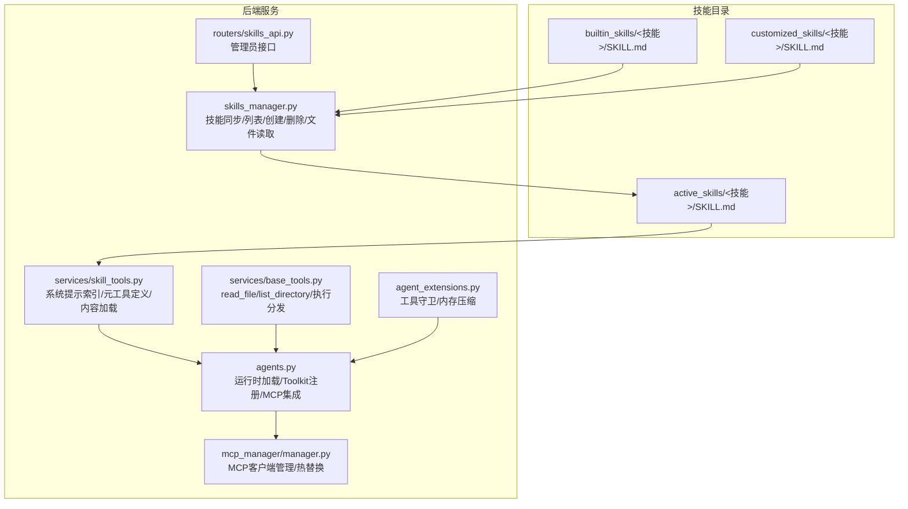
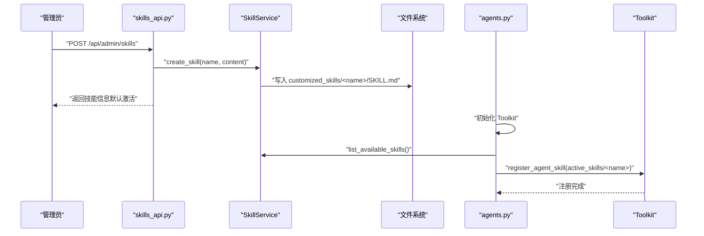
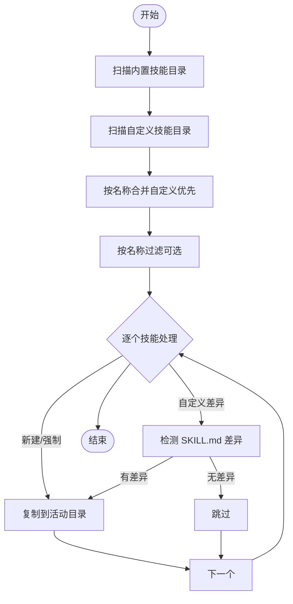
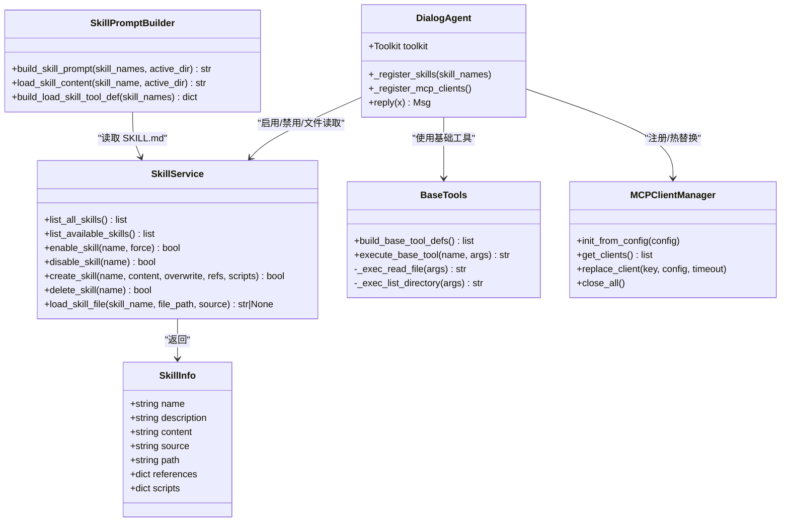
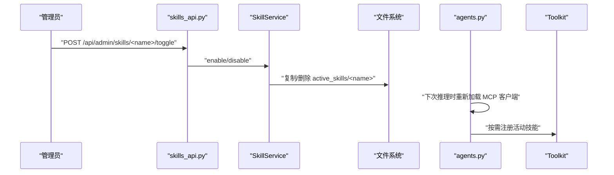
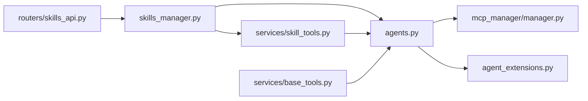

# 技能系统

<cite>
**本文引用的文件**
- [skills_manager.py](file://backend/skills_manager.py)
- [skill_tools.py](file://backend/services/skill_tools.py)
- [base_tools.py](file://backend/services/base_tools.py)
- [skills_api.py](file://backend/routers/skills_api.py)
- [agents.py](file://backend/agents.py)
- [manager.py](file://backend/mcp_manager/manager.py)
- [agent_extensions.py](file://backend/agent_extensions.py)
- [file_reader SKILL.md（内置）](file://backend/skills/builtin_skills/file_reader/SKILL.md)
- [file_reader SKILL.md（活动）](file://backend/skills/active_skills/file_reader/SKILL.md)
- [main.py](file://backend/main.py)
</cite>

## 目录
1. [简介](#简介)
2. [项目结构](#项目结构)
3. [核心组件](#核心组件)
4. [架构总览](#架构总览)
5. [详细组件分析](#详细组件分析)
6. [依赖关系分析](#依赖关系分析)
7. [性能考量](#性能考量)
8. [故障排查指南](#故障排查指南)
9. [结论](#结论)
10. [附录](#附录)

## 简介
本文件系统化梳理“技能系统”的设计与实现，覆盖以下主题：
- 技能定义格式与注册机制：SKILL.md 前言块与正文的解析规则、技能目录结构与来源分类（内置/自定义/活动）
- 技能加载流程：从代码仓库内置技能到工作区活动技能的同步策略、按需加载与禁用
- 技能工具包（Toolkit）：元工具 load_skill 的构建、系统提示中的轻量索引、基础工具与执行分发
- 动态加载与热重载：活动技能的启用/禁用与强制同步、MCP 客户端的热替换
- 开发指南：开发规范、测试方法与部署流程
- 安全机制：路径校验、工具守卫、输入与执行限制
- 与 MCP 客户端的集成：注册时机、热重载支持与最佳实践

## 项目结构
技能系统围绕“技能目录树 + 同步服务 + 工具注册 + API 管理 + 运行时加载”展开，核心目录与模块如下：
- 技能目录
  - 内置技能：backend/skills/builtin_skills/<技能名>/SKILL.md
  - 自定义技能：backend/skills/customized_skills/<技能名>/SKILL.md
  - 活动技能：backend/skills/active_skills/<技能名>/SKILL.md
- 后端核心
  - 技能管理与同步：skills_manager.py
  - 技能提示与元工具：services/skill_tools.py
  - 基础工具与执行分发：services/base_tools.py
  - 技能管理 API：routers/skills_api.py
  - 运行时加载与工具包：agents.py
  - MCP 客户端管理：mcp_manager/manager.py
  - 工具守卫与内存压缩：agent_extensions.py
  - 应用入口与路由注册：main.py

**图表来源**
- [skills_manager.py:18-408](file://backend/skills_manager.py#L18-L408)
- [skill_tools.py:36-142](file://backend/services/skill_tools.py#L36-L142)
- [base_tools.py:173-270](file://backend/services/base_tools.py#L173-L270)
- [skills_api.py:123-207](file://backend/routers/skills_api.py#L123-L207)
- [agents.py:85-113](file://backend/agents.py#L85-L113)
- [manager.py:28-139](file://backend/mcp_manager/manager.py#L28-L139)
- [agent_extensions.py:7-163](file://backend/agent_extensions.py#L7-L163)

**章节来源**
- [skills_manager.py:43-63](file://backend/skills_manager.py#L43-L63)
- [main.py:138-152](file://backend/main.py#L138-L152)

## 核心组件
- 技能信息模型与同步服务
  - SkillInfo：封装技能名称、描述、来源、路径、引用与脚本树
  - 路径助手：内置/自定义/活动技能目录定位
  - 同步函数：合并内置与自定义技能，按名称去重，支持强制同步与差异检测
  - 列表与初始化：列出可用技能、检查活动技能是否存在
- 技能服务（SkillService）
  - 列出全部/可用技能
  - 启用/禁用技能（同步到活动目录或删除）
  - 创建/删除技能（自定义目录），含 SKILL.md 前言块校验
  - 文件读取（受源与路径前缀限制，防路径穿越）
- 元工具与系统提示
  - 构建轻量技能索引（仅名称与描述）
  - 加载完整 SKILL.md 内容（含 references 列表）
  - 构建 load_skill 元工具定义（枚举约束为当前代理可用技能）
- 基础工具与执行分发
  - read_file：行范围读取、字节截断、行号编号、剩余提示
  - list_directory：目录枚举、大小格式化、溢出提示
  - 执行分发：基于名称查找执行器
- 运行时加载与工具包
  - 初始化 Toolkit，按需注册活动技能
  - 懒加载 MCP 客户端并支持热替换
- MCP 客户端管理
  - 支持 HTTP 与 STDIO 两种传输
  - 双阶段锁定替换，最小化阻塞
- 工具守卫与内存压缩
  - 工具黑名单/白名单拦截
  - 记忆压缩钩子，基于令牌估算进行摘要与裁剪

**章节来源**
- [skills_manager.py:19-142](file://backend/skills_manager.py#L19-L142)
- [skills_manager.py:263-408](file://backend/skills_manager.py#L263-L408)
- [skill_tools.py:36-142](file://backend/services/skill_tools.py#L36-L142)
- [base_tools.py:173-270](file://backend/services/base_tools.py#L173-L270)
- [agents.py:85-113](file://backend/agents.py#L85-L113)
- [manager.py:28-139](file://backend/mcp_manager/manager.py#L28-L139)
- [agent_extensions.py:7-163](file://backend/agent_extensions.py#L7-L163)

## 架构总览
技能系统采用“声明式技能 + 元工具 + 基础工具 + 运行时注册”的架构：
- 声明式技能：以 SKILL.md 作为技能契约，前言块包含 name、description、metadata（含内置版本）
- 元工具：load_skill 返回完整技能说明；系统提示仅包含轻量索引
- 基础工具：read_file、list_directory 等，提供安全的文件操作能力
- 运行时注册：Agent 初始化 Toolkit 并按需注册活动技能；懒加载 MCP 客户端

**图表来源**
- [skills_api.py:140-152](file://backend/routers/skills_api.py#L140-L152)
- [skills_manager.py:304-352](file://backend/skills_manager.py#L304-L352)
- [agents.py:85-113](file://backend/agents.py#L85-L113)

## 详细组件分析

### 技能定义格式与解析规则（SKILL.md）
- 必填字段
  - name：技能唯一标识
  - description：技能简述
- 可选字段
  - metadata.builtin_skill_version：内置技能版本号（用于版本比较与兼容性）
- 解析流程
  - 使用 frontmatter 解析前言块，提取 name、description、metadata
  - 正文作为技能说明内容，供系统提示与元工具加载
- 示例参考
  - 内置 file_reader：包含支持的文件类型、读取步骤、大文件处理建议与安全注意事项

**章节来源**
- [file_reader SKILL.md（内置）:1-48](file://backend/skills/builtin_skills/file_reader/SKILL.md#L1-L48)
- [file_reader SKILL.md（活动）:1-48](file://backend/skills/active_skills/file_reader/SKILL.md#L1-L48)
- [skills_manager.py:119-142](file://backend/skills_manager.py#L119-L142)

### 技能加载流程（内置/自定义/活动）
- 目录结构
  - builtin_skills：随代码分发的只读技能
  - customized_skills：管理员可创建/编辑的自定义技能
  - active_skills：运行时生效的技能集合
- 同步策略
  - 合并内置与自定义技能，按名称去重（自定义优先）
  - 新增或强制同步时直接复制；自定义覆盖内置时，若 SKILL.md 发生差异则更新
- 列表与初始化
  - 列出 active_skills 下的技能名称
  - 初始化时确保活动技能存在并记录日志

**图表来源**
- [skills_manager.py:180-225](file://backend/skills_manager.py#L180-L225)

**章节来源**
- [skills_manager.py:180-257](file://backend/skills_manager.py#L180-L257)

### 技能工具包（Toolkit）设计
- 元工具 load_skill
  - 在系统提示中提供轻量索引（名称+描述）
  - 当用户调用 load_skill 时，返回完整 SKILL.md 内容及 references 列表
  - 工具定义使用枚举约束为当前代理可用技能
- 基础工具
  - read_file：支持 start_line/end_line 行范围读取、超限截断、行号编号、剩余提示
  - list_directory：目录枚举、大小格式化、溢出提示
  - 执行分发：通过名称映射到执行器，避免 if 分支链
- 运行时注册
  - Agent 初始化 Toolkit，并在每次推理前懒加载 MCP 客户端
  - 按需注册活动技能，减少不必要的开销

**图表来源**
- [skills_manager.py:263-408](file://backend/skills_manager.py#L263-L408)
- [skill_tools.py:36-142](file://backend/services/skill_tools.py#L36-L142)
- [base_tools.py:173-270](file://backend/services/base_tools.py#L173-L270)
- [agents.py:85-113](file://backend/agents.py#L85-L113)
- [manager.py:28-139](file://backend/mcp_manager/manager.py#L28-L139)

**章节来源**
- [skill_tools.py:36-142](file://backend/services/skill_tools.py#L36-L142)
- [base_tools.py:173-270](file://backend/services/base_tools.py#L173-L270)
- [agents.py:85-113](file://backend/agents.py#L85-L113)

### 动态加载与热重载机制
- 活动技能启用/禁用
  - 启用：同步到 active_skills；强制模式下覆盖已有内容
  - 禁用：删除 active_skills 对应目录
- MCP 客户端热替换
  - 双阶段锁定：先在锁外连接新客户端，再在锁内交换并关闭旧客户端
  - 支持 HTTP 与 STDIO 两种传输方式
- 运行时注册
  - 每次推理前懒加载 MCP 客户端，便于热重载生效

**图表来源**
- [skills_api.py:190-206](file://backend/routers/skills_api.py#L190-L206)
- [skills_manager.py:284-301](file://backend/skills_manager.py#L284-L301)
- [agents.py:115-116](file://backend/agents.py#L115-L116)
- [manager.py:57-86](file://backend/mcp_manager/manager.py#L57-L86)

**章节来源**
- [skills_api.py:190-206](file://backend/routers/skills_api.py#L190-L206)
- [skills_manager.py:284-301](file://backend/skills_manager.py#L284-L301)
- [manager.py:57-86](file://backend/mcp_manager/manager.py#L57-L86)

### 技能开发指南
- 开发规范
  - 使用 frontmatter 声明 name、description、metadata（含内置版本）
  - 正文清晰描述任务场景、步骤、边界与安全注意事项
  - references 目录用于存放示例/模板等辅助材料
- 测试方法
  - 单元测试：验证 SKILL.md 解析、路径校验、工具执行结果
  - 集成测试：通过 API 创建/更新/删除技能，验证同步到 active_skills
  - 安全测试：构造路径穿越与越权访问尝试
- 部署流程
  - 在后台创建/更新技能，必要时自动启用
  - Agent 启动后按需加载活动技能；MCP 客户端支持热替换

**章节来源**
- [skills_api.py:41-53](file://backend/routers/skills_api.py#L41-L53)
- [skills_manager.py:304-352](file://backend/skills_manager.py#L304-L352)

### 安全机制
- 路径校验
  - 基础工具：拒绝包含 “..” 的路径段，防止路径穿越
  - 文件读取：严格限定来源（builtin/customized），禁止非法前缀与绝对路径
- 工具守卫
  - 黑名单：如 execute_shell_command 等高危工具直接拒绝
  - 审批：write_file/edit_file 等受控工具可扩展审批流程
- 执行限制
  - 大文件截断：行数与字节数上限，提供分段读取建议
  - 目录枚举限制：条目数量上限，避免信息泄露

**章节来源**
- [base_tools.py:25-139](file://backend/services/base_tools.py#L25-L139)
- [skills_manager.py:370-408](file://backend/skills_manager.py#L370-L408)
- [agent_extensions.py:13-79](file://backend/agent_extensions.py#L13-L79)

### 与 MCP 客户端的集成与最佳实践
- 集成方式
  - Agent 在每次推理前懒加载 MCP 客户端，确保热重载生效
  - 使用 register_mcp_client 注册客户端，支持 HTTP/STDIO
- 最佳实践
  - 使用 MCPClientManager 的 replace_client 实现平滑热替换
  - 在高并发场景下利用双阶段锁定降低阻塞时间
  - 对客户端连接设置超时，失败时优雅回退

**章节来源**
- [agents.py:70-84](file://backend/agents.py#L70-L84)
- [manager.py:57-86](file://backend/mcp_manager/manager.py#L57-L86)

## 依赖关系分析
- 组件耦合
  - SkillService 与文件系统交互，提供统一的技能 CRUD 与文件读取
  - SkillPromptBuilder 依赖 SkillService 的 SKILL.md 内容
  - DialogAgent 依赖 SkillService（启用/禁用）、MCPClientManager（热替换）、BaseTools（执行）
- 外部依赖
  - frontmatter：SKILL.md 前言块解析
  - packaging.Version：内置技能版本比较
  - Agentscope Toolkit/MCP：工具包与 MCP 客户端集成

**图表来源**
- [skills_manager.py:18-408](file://backend/skills_manager.py#L18-L408)
- [skill_tools.py:36-142](file://backend/services/skill_tools.py#L36-L142)
- [base_tools.py:173-270](file://backend/services/base_tools.py#L173-L270)
- [skills_api.py:123-207](file://backend/routers/skills_api.py#L123-L207)
- [agents.py:85-113](file://backend/agents.py#L85-L113)
- [manager.py:28-139](file://backend/mcp_manager/manager.py#L28-L139)
- [agent_extensions.py:7-163](file://backend/agent_extensions.py#L7-L163)

**章节来源**
- [skills_manager.py:18-408](file://backend/skills_manager.py#L18-L408)
- [skill_tools.py:36-142](file://backend/services/skill_tools.py#L36-L142)
- [base_tools.py:173-270](file://backend/services/base_tools.py#L173-L270)
- [skills_api.py:123-207](file://backend/routers/skills_api.py#L123-L207)
- [agents.py:85-113](file://backend/agents.py#L85-L113)
- [manager.py:28-139](file://backend/mcp_manager/manager.py#L28-L139)
- [agent_extensions.py:7-163](file://backend/agent_extensions.py#L7-L163)

## 性能考量
- 轻量索引与按需加载
  - 系统提示仅包含技能名称与描述，完整内容由 load_skill 按需加载，降低 token 成本
- 截断与分页
  - read_file 对长文件进行行数与字节双重截断，并提供分段读取建议
  - list_directory 限制枚举条目数量，避免信息泄露与性能问题
- 执行分发
  - 基于名称的执行器映射，避免条件分支膨胀，提升可维护性

**章节来源**
- [skill_tools.py:36-70](file://backend/services/skill_tools.py#L36-L70)
- [base_tools.py:49-98](file://backend/services/base_tools.py#L49-L98)
- [base_tools.py:106-130](file://backend/services/base_tools.py#L106-L130)
- [base_tools.py:255-270](file://backend/services/base_tools.py#L255-L270)

## 故障排查指南
- 技能未出现在系统提示
  - 检查 active_skills 下是否存在对应目录与 SKILL.md
  - 确认 Agent 是否正确调用 list_available_skills 并注册技能
- load_skill 返回错误
  - 确认技能名称是否在可用技能枚举中
  - 检查 SKILL.md 是否存在且可读
- 基础工具报错
  - 路径包含 “..” 或非法前缀会被拒绝
  - 大文件被截断，建议使用 start_line/end_line 分段读取
- MCP 客户端无法连接
  - 检查配置（HTTP URL 或 STDIO 命令/参数）
  - 查看热替换日志，确认新客户端连接成功后才关闭旧客户端

**章节来源**
- [agents.py:94-113](file://backend/agents.py#L94-L113)
- [skill_tools.py:72-107](file://backend/services/skill_tools.py#L72-L107)
- [base_tools.py:25-47](file://backend/services/base_tools.py#L25-L47)
- [manager.py:63-86](file://backend/mcp_manager/manager.py#L63-L86)

## 结论
技能系统通过“声明式技能 + 元工具 + 基础工具 + 运行时注册 + MCP 集成”的架构，实现了可扩展、可审计、可热重载的能力体系。其核心优势在于：
- 明确的技能契约（SKILL.md）与严格的解析规则
- 轻量索引与按需加载，兼顾成本与功能
- 严格的路径校验与工具守卫，保障运行安全
- 支持活动技能的启用/禁用与 MCP 客户端的热替换，满足生产环境的动态需求

## 附录
- API 端点概览（管理员）
  - GET /api/admin/skills：列出所有技能及其状态
  - GET /api/admin/skills/{skill_name}：获取技能详情（含正文）
  - POST /api/admin/skills：创建自定义技能（可自动启用）
  - PUT /api/admin/skills/{skill_name}：更新技能内容
  - DELETE /api/admin/skills/{skill_name}：删除自定义技能
  - POST /api/admin/skills/{skill_name}/toggle：切换启用/禁用状态

**章节来源**
- [skills_api.py:123-207](file://backend/routers/skills_api.py#L123-L207)