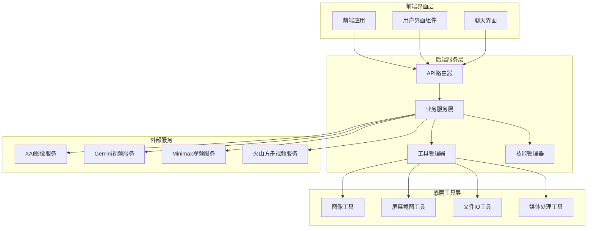
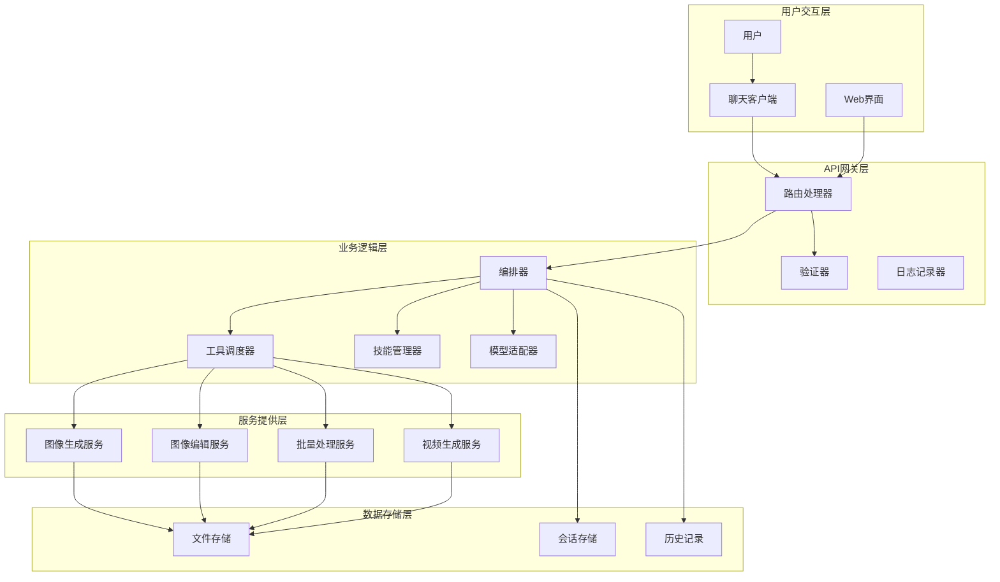
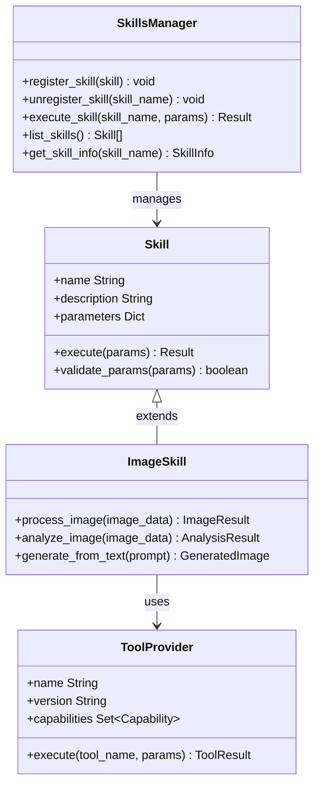
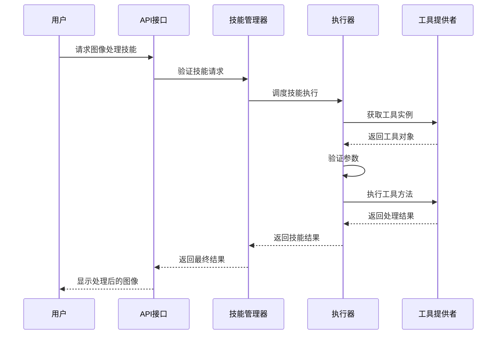
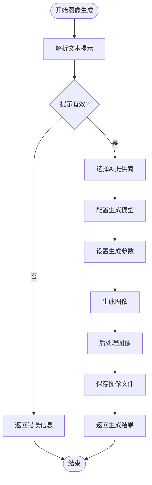
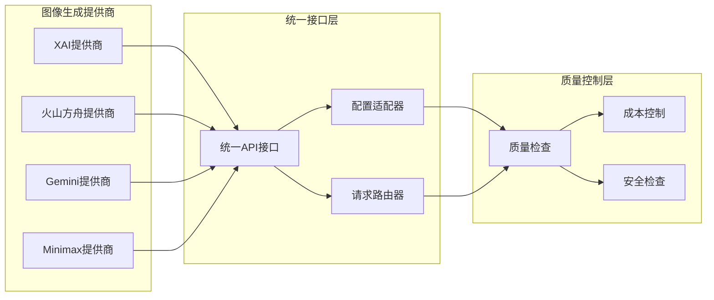
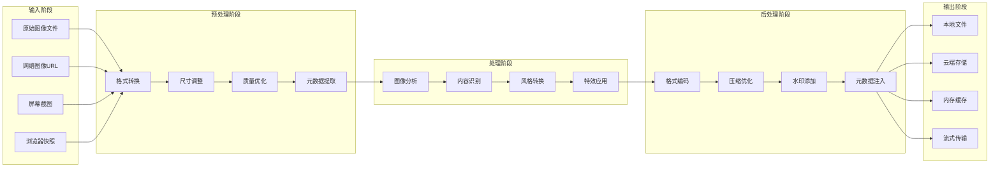
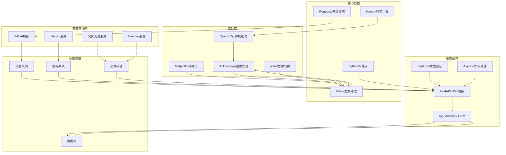

# 图像工具技能文档

<cite>
**本文档引用的文件**
- [view_image.py](file://CoPaw-main/src/copaw/agents/tools/view_image.py)
- [desktop_screenshot.py](file://CoPaw-main/src/copaw/agents/tools/desktop_screenshot.py)
- [browser_snapshot.py](file://CoPaw-main/src/copaw/agents/tools/browser_snapshot.py)
- [file_io.py](file://CoPaw-main/src/copaw/agents/tools/file_io.py)
- [utils.py](file://CoPaw-main/src/copaw/agents/tools/utils.py)
- [image_tools SKILL.md](file://backend/skills/builtin_skills/image_tools/SKILL.md)
- [image_tools SKILL.md](file://CoPaw-main/src/copaw/agents/skills/image_tools/SKILL.md)
- [image_gen.py](file://backend/services/tool_manager/providers/image_gen.py)
- [image_edit.py](file://backend/services/tool_manager/providers/image_edit.py)
- [canvas.py](file://backend/services/tool_manager/providers/canvas.py)
- [image_config_adapter.py](file://backend/services/image_config_adapter.py)
- [image_canvas_bridge.py](file://backend/services/image_canvas_bridge.py)
- [xai_image_gen.py](file://backend/services/xai_image_gen.py)
- [ark_image_gen.py](file://backend/services/ark_image_gen.py)
- [batch_image_gen.py](file://backend/services/batch_image_gen.py)
- [video_generation.py](file://backend/services/video_generation.py)
- [video_edit.py](file://backend/services/tool_manager/providers/video_edit.py)
- [video_gen.py](file://backend/services/tool_manager/providers/video_gen.py)
- [model_capabilities.py](file://backend/services/video_providers/model_capabilities.py)
- [xai_provider.py](file://backend/services/video_providers/xai_provider.py)
- [gemini_provider.py](file://backend/services/video_providers/gemini_provider.py)
- [minimax_provider.py](file://backend/services/video_providers/minimax_provider.py)
- [ark_provider.py](file://backend/services/video_providers/ark_provider.py)
- [chat_generation.py](file://backend/services/chat_generation.py)
- [chat_tool_dispatch.py](file://backend/services/chat_tool_dispatch.py)
- [orchestrator.py](file://backend/services/orchestrator.py)
- [skill_tools.py](file://backend/services/skill_tools.py)
- [skills_manager.py](file://backend/skills_manager.py)
- [agent_executor.py](file://backend/services/agent_executor.py)
- [media_utils.py](file://backend/services/media_utils.py)
- [media.py](file://backend/routers/media.py)
- [media.py](file://CoPaw-main/src/copaw/app/channels/console/media.py)
- [media.py](file://CoPaw-main/src/copaw/app/channels/dingtalk/media.py)
- [media.py](file://CoPaw-main/src/copaw/app/channels/feishu/media.py)
- [media.py](file://CoPaw-main/src/copaw/app/channels/wecom/media.py)
- [media.py](file://CoPaw-main/src/copaw/app/channels/matrix/media.py)
- [media.py](file://CoPaw-main/src/copaw/app/channels/discord_/media.py)
- [media.py](file://CoPaw-main/src/copaw/app/channels/telegram/media.py)
- [media.py](file://CoPaw-main/src/copaw/app/channels/qq/media.py)
- [media.py](file://CoPaw-main/src/copaw/app/channels/mqtt/media.py)
- [media.py](file://CoPaw-main/src/copaw/app/channels/imessage/media.py)
- [media.py](file://CoPaw-main/src/copaw/app/channels/mattermost/media.py)
- [media.py](file://CoPaw-main/src/copaw/app/channels/xiaoyi/media.py)
- [media.py](file://CoPaw-main/src/copaw/app/channels/voice/media.py)
- [media.py](file://CoPaw-main/src/copaw/app/channels/base/media.py)
- [media.py](file://CoPaw-main/src/copaw/app/channels/renderer/media.py)
- [media.py](file://CoPaw-main/src/copaw/app/channels/schema/media.py)
- [media.py](file://CoPaw-main/src/copaw/app/channels/utils/media.py)
- [media.py](file://CoPaw-main/src/copaw/app/channels/registry/media.py)
- [media.py](file://CoPaw-main/src/copaw/app/channels/manager/media.py)
- [media.py](file://CoPaw-main/src/copaw/app/channels/agent/media.py)
- [media.py](file://CoPaw-main/src/copaw/app/channels/console/media.py)
- [media.py](file://CoPaw-main/src/copaw/app/channels/dingtalk/media.py)
- [media.py](file://CoPaw-main/src/copaw/app/channels/feishu/media.py)
- [media.py](file://CoPaw-main/src/copaw/app/channels/wecom/media.py)
- [media.py](file://CoPaw-main/src/copaw/app/channels/matrix/media.py)
- [media.py](file://CoPaw-main/src/copaw/app/channels/discord_/media.py)
- [media.py](file://CoPaw-main/src/copaw/app/channels/telegram/media.py)
- [media.py](file://CoPaw-main/src/copaw/app/channels/qq/media.py)
- [media.py](file://CoPaw-main/src/copaw/app/channels/mqtt/media.py)
- [media.py](file://CoPaw-main/src/copaw/app/channels/imessage/media.py)
- [media.py](file://CoPaw-main/src/copaw/app/channels/mattermost/media.py)
- [media.py](file://CoPaw-main/src/copaw/app/channels/xiaoyi/media.py)
- [media.py](file://CoPaw-main/src/copaw/app/channels/voice/media.py)
- [media.py](file://CoPaw-main/src/copaw/app/channels/base/media.py)
- [media.py](file://CoPaw-main/src/copaw/app/channels/renderer/media.py)
- [media.py](file://CoPaw-main/src/copaw/app/channels/schema/media.py)
- [media.py](file://CoPaw-main/src/copaw/app/channels/utils/media.py)
- [media.py](file://CoPaw-main/src/copaw/app/channels/registry/media.py)
- [media.py](file://CoPaw-main/src/copaw/app/channels/manager/media.py)
- [media.py](file://CoPaw-main/src/copaw/app/channels/agent/media.py)
</cite>

## 目录
1. [简介](#简介)
2. [项目结构](#项目结构)
3. [核心组件](#核心组件)
4. [架构概览](#架构概览)
5. [详细组件分析](#详细组件分析)
6. [依赖关系分析](#依赖关系分析)
7. [性能考虑](#性能考虑)
8. [故障排除指南](#故障排除指南)
9. [结论](#结论)

## 简介

本文件详细介绍了图像工具技能系统，这是一个集成了图像理解、图像生成、图像编辑和相关媒体处理能力的综合平台。该系统支持多种图像处理工具，包括桌面截图、浏览器快照、文件IO操作等基础工具，以及高级的图像生成和编辑功能。

系统采用模块化设计，通过技能管理器统一调度各种图像工具，支持多渠道消息传递和媒体处理。整个架构分为前端界面层、后端服务层和底层工具层三个主要层次。

## 项目结构

图像工具技能系统采用分层架构设计，主要包含以下核心模块：

**图表来源**
- [image_tools SKILL.md](file://backend/skills/builtin_skills/image_tools/SKILL.md)
- [image_tools SKILL.md](file://CoPaw-main/src/copaw/agents/skills/image_tools/SKILL.md)

**章节来源**
- [image_tools SKILL.md](file://backend/skills/builtin_skills/image_tools/SKILL.md)
- [image_tools SKILL.md](file://CoPaw-main/src/copaw/agents/skills/image_tools/SKILL.md)

## 核心组件

### 图像工具基础层

系统的基础图像工具包括多个核心组件，每个组件负责特定的图像处理功能：

#### 视图图像工具 (View Image Tool)
视图图像工具提供图像内容的查看和分析功能，支持多种图像格式的读取和显示。

#### 桌面截图工具 (Desktop Screenshot Tool)
桌面截图工具能够捕获当前桌面环境的屏幕截图，支持全屏截图和区域截图功能。

#### 浏览器快照工具 (Browser Snapshot Tool)
浏览器快照工具专门用于捕获网页内容的截图，支持完整的网页渲染快照。

#### 文件IO工具 (File IO Tool)
文件IO工具提供图像文件的读写、上传、下载和管理功能，支持多种文件格式。

**章节来源**
- [view_image.py](file://CoPaw-main/src/copaw/agents/tools/view_image.py)
- [desktop_screenshot.py](file://CoPaw-main/src/copaw/agents/tools/desktop_screenshot.py)
- [browser_snapshot.py](file://CoPaw-main/src/copaw/agents/tools/browser_snapshot.py)
- [file_io.py](file://CoPaw-main/src/copaw/agents/tools/file_io.py)

### 高级图像处理服务

#### 图像生成服务
图像生成服务提供基于文本描述的图像创建功能，支持多种AI驱动的图像生成算法。

#### 图像编辑服务
图像编辑服务包含多种图像处理和编辑功能，如缩放、裁剪、滤镜应用等。

#### 画布桥接服务
画布桥接服务连接图像生成和编辑功能，提供统一的画布操作接口。

**章节来源**
- [image_gen.py](file://backend/services/tool_manager/providers/image_gen.py)
- [image_edit.py](file://backend/services/tool_manager/providers/image_edit.py)
- [canvas.py](file://backend/services/tool_manager/providers/canvas.py)
- [image_canvas_bridge.py](file://backend/services/image_canvas_bridge.py)

### 多渠道媒体处理

系统支持多种消息渠道的媒体处理，包括但不限于：

- 控制台渠道
- 钉钉渠道  
- 飞书渠道
- 微信企业渠道
- Matrix渠道
- Discord渠道
- Telegram渠道
- QQ渠道
- MQTT渠道
- iMessage渠道
- Mattermost渠道
- 小艺渠道
- 语音渠道

**章节来源**
- [media.py](file://CoPaw-main/src/copaw/app/channels/console/media.py)
- [media.py](file://CoPaw-main/src/copaw/app/channels/dingtalk/media.py)
- [media.py](file://CoPaw-main/src/copaw/app/channels/feishu/media.py)
- [media.py](file://CoPaw-main/src/copaw/app/channels/wecom/media.py)
- [media.py](file://CoPaw-main/src/copaw/app/channels/matrix/media.py)
- [media.py](file://CoPaw-main/src/copaw/app/channels/discord_/media.py)
- [media.py](file://CoPaw-main/src/copaw/app/channels/telegram/media.py)
- [media.py](file://CoPaw-main/src/copaw/app/channels/qq/media.py)
- [media.py](file://CoPaw-main/src/copaw/app/channels/mqtt/media.py)
- [media.py](file://CoPaw-main/src/copaw/app/channels/imessage/media.py)
- [media.py](file://CoPaw-main/src/copaw/app/channels/mattermost/media.py)
- [media.py](file://CoPaw-main/src/copaw/app/channels/xiaoyi/media.py)
- [media.py](file://CoPaw-main/src/copaw/app/channels/voice/media.py)

## 架构概览

图像工具技能系统的整体架构采用分层设计，确保了功能的模块化和可扩展性：

**图表来源**
- [orchestrator.py](file://backend/services/orchestrator.py)
- [chat_tool_dispatch.py](file://backend/services/chat_tool_dispatch.py)
- [skills_manager.py](file://backend/skills_manager.py)
- [image_config_adapter.py](file://backend/services/image_config_adapter.py)

**章节来源**
- [orchestrator.py](file://backend/services/orchestrator.py)
- [chat_tool_dispatch.py](file://backend/services/chat_tool_dispatch.py)
- [skills_manager.py](file://backend/skills_manager.py)
- [image_config_adapter.py](file://backend/services/image_config_adapter.py)

## 详细组件分析

### 图像工具技能管理器

技能管理器是整个图像工具系统的核心协调组件，负责管理各种图像处理技能的注册、调度和执行。

**图表来源**
- [skills_manager.py](file://backend/skills_manager.py)
- [skill_tools.py](file://backend/services/skill_tools.py)

#### 技能执行流程

**图表来源**
- [agent_executor.py](file://backend/services/agent_executor.py)
- [chat_tool_dispatch.py](file://backend/services/chat_tool_dispatch.py)

**章节来源**
- [skills_manager.py](file://backend/skills_manager.py)
- [skill_tools.py](file://backend/services/skill_tools.py)
- [agent_executor.py](file://backend/services/agent_executor.py)
- [chat_tool_dispatch.py](file://backend/services/chat_tool_dispatch.py)

### 图像生成服务架构

图像生成服务提供了强大的AI驱动图像创建能力，支持从文本描述生成高质量图像。

**图表来源**
- [image_gen.py](file://backend/services/tool_manager/providers/image_gen.py)
- [xai_image_gen.py](file://backend/services/xai_image_gen.py)
- [ark_image_gen.py](file://backend/services/ark_image_gen.py)

#### 多提供商支持架构

**图表来源**
- [xai_provider.py](file://backend/services/video_providers/xai_provider.py)
- [ark_provider.py](file://backend/services/video_providers/ark_provider.py)
- [gemini_provider.py](file://backend/services/video_providers/gemini_provider.py)
- [minimax_provider.py](file://backend/services/video_providers/minimax_provider.py)

**章节来源**
- [image_gen.py](file://backend/services/tool_manager/providers/image_gen.py)
- [xai_image_gen.py](file://backend/services/xai_image_gen.py)
- [ark_image_gen.py](file://backend/services/ark_image_gen.py)
- [batch_image_gen.py](file://backend/services/batch_image_gen.py)
- [xai_provider.py](file://backend/services/video_providers/xai_provider.py)
- [ark_provider.py](file://backend/services/video_providers/ark_provider.py)
- [gemini_provider.py](file://backend/services/video_providers/gemini_provider.py)
- [minimax_provider.py](file://backend/services/video_providers/minimax_provider.py)

### 媒体处理管道

系统实现了完整的媒体处理管道，支持从输入到输出的全流程处理。

**图表来源**
- [media_utils.py](file://backend/services/media_utils.py)
- [file_io.py](file://CoPaw-main/src/copaw/agents/tools/file_io.py)
- [browser_snapshot.py](file://CoPaw-main/src/copaw/agents/tools/browser_snapshot.py)
- [desktop_screenshot.py](file://CoPaw-main/src/copaw/agents/tools/desktop_screenshot.py)

**章节来源**
- [media_utils.py](file://backend/services/media_utils.py)
- [file_io.py](file://CoPaw-main/src/copaw/agents/tools/file_io.py)
- [browser_snapshot.py](file://CoPaw-main/src/copaw/agents/tools/browser_snapshot.py)
- [desktop_screenshot.py](file://CoPaw-main/src/copaw/agents/tools/desktop_screenshot.py)

## 依赖关系分析

图像工具技能系统的依赖关系呈现复杂的多层次结构，各组件之间的耦合度经过精心设计以确保系统的可维护性和可扩展性。

**图表来源**
- [requirements.txt](file://backend/requirements.txt)
- [setup.py](file://CoPaw-main/setup.py)

**章节来源**
- [requirements.txt](file://backend/requirements.txt)
- [setup.py](file://CoPaw-main/setup.py)

### 组件间通信模式

系统采用了多种通信模式来确保组件间的松耦合和高内聚：

#### 同步调用模式
适用于简单的工具调用和数据处理操作，具有较低的延迟和简单性。

#### 异步事件模式  
适用于长时间运行的任务和后台处理，支持非阻塞的操作和状态跟踪。

#### 消息队列模式
适用于分布式处理和任务调度，支持任务的可靠传递和重试机制。

#### 代理模式
适用于需要透明访问和远程操作的场景，提供统一的接口抽象。

**章节来源**
- [chat_generation.py](file://backend/services/chat_generation.py)
- [orchestrator.py](file://backend/services/orchestrator.py)
- [agent_executor.py](file://backend/services/agent_executor.py)

## 性能考虑

图像工具技能系统在设计时充分考虑了性能优化，采用了多种策略来提升系统的响应速度和资源利用率。

### 内存管理优化

系统实现了智能的内存管理策略，包括：

- **图像缓冲池**：复用图像对象减少内存分配开销
- **渐进式加载**：大图像文件的分块加载和处理
- **自动垃圾回收**：及时释放不再使用的图像数据
- **内存监控**：实时监控内存使用情况并触发清理机制

### 并发处理优化

系统支持多线程和异步并发处理：

- **线程池管理**：合理配置工作线程数量
- **协程异步**：使用async/await处理I/O密集型操作
- **任务队列**：优先级队列确保重要任务的及时处理
- **资源锁机制**：避免竞态条件和资源冲突

### 缓存策略

多层次的缓存机制提升了系统的响应速度：

- **内存缓存**：高频访问数据的快速缓存
- **磁盘缓存**：持久化的中间结果存储
- **CDN加速**：静态资源的分布式缓存
- **智能过期**：基于使用频率的智能缓存淘汰

### 网络优化

网络通信层面的优化措施：

- **连接池**：复用HTTP连接减少握手开销
- **压缩传输**：启用Gzip压缩减少带宽占用
- **超时控制**：合理的超时设置避免资源浪费
- **重试机制**：失败重试和熔断保护

## 故障排除指南

### 常见问题诊断

#### 图像处理失败
当图像处理操作失败时，首先检查以下方面：
- 确认输入图像格式是否受支持
- 验证图像文件完整性
- 检查磁盘空间是否充足
- 确认内存使用情况

#### 性能问题
如果系统响应缓慢，建议：
- 检查CPU和内存使用率
- 分析是否有内存泄漏
- 优化图像尺寸和质量设置
- 调整并发处理参数

#### 网络连接问题
对于网络相关的错误：
- 验证网络连接稳定性
- 检查防火墙设置
- 确认API密钥有效性
- 查看服务可用性状态

### 调试工具和方法

系统提供了多种调试工具来帮助问题定位：

#### 日志分析
- 启用详细的调试日志
- 分析错误堆栈信息
- 监控性能指标
- 追踪请求链路

#### 性能监控
- 使用内置性能计数器
- 监控资源使用情况
- 分析瓶颈环节
- 生成性能报告

#### 状态检查
- 检查服务健康状态
- 验证依赖服务可用性
- 确认配置参数正确性
- 测试关键功能路径

**章节来源**
- [chat_generation.py](file://backend/services/chat_generation.py)
- [media_utils.py](file://backend/services/media_utils.py)

## 结论

图像工具技能系统是一个功能完整、架构清晰的多媒体处理平台。通过模块化的组件设计和多层架构分离，系统实现了高度的可扩展性和可维护性。

系统的主要优势包括：

1. **功能全面**：涵盖了从基础图像处理到高级AI生成的完整功能链
2. **架构清晰**：分层设计确保了良好的可维护性和扩展性
3. **性能优秀**：通过多种优化策略实现了高效的处理能力
4. **集成灵活**：支持多渠道和多平台的集成部署
5. **安全可靠**：完善的权限控制和安全检查机制

未来的发展方向包括：
- 进一步优化AI生成算法的性能
- 扩展更多图像处理功能
- 增强多模态处理能力
- 改善用户体验和易用性

该系统为图像处理和AI应用提供了坚实的技术基础，适合在各种应用场景中部署和使用。