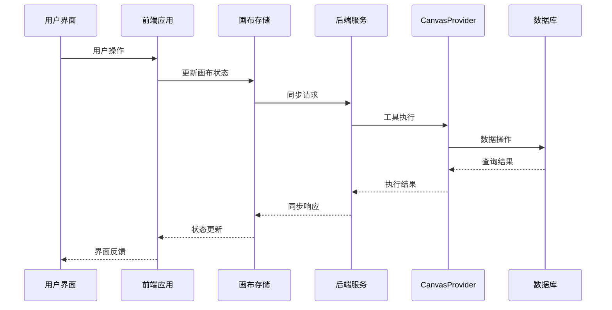
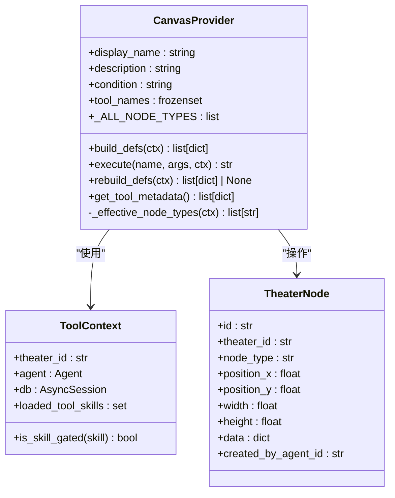
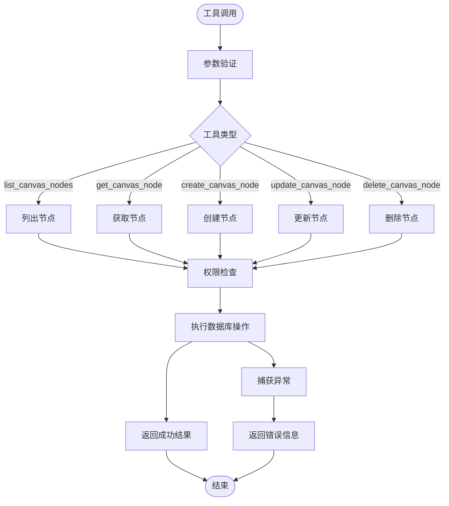
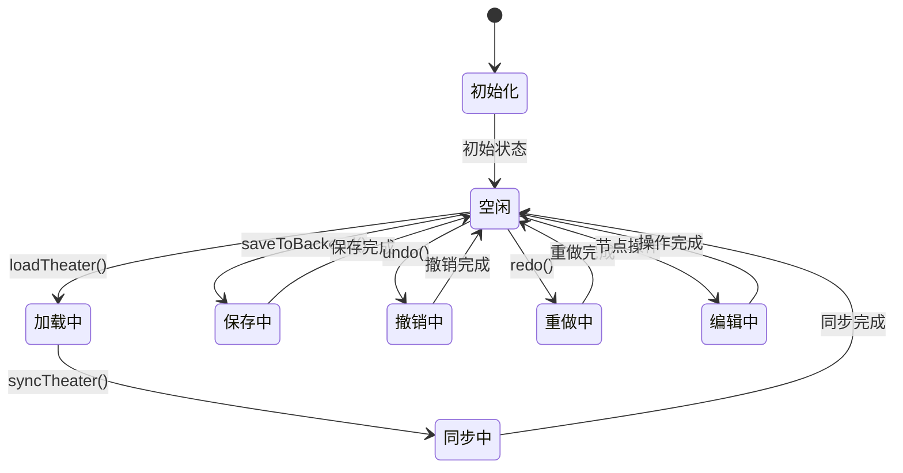
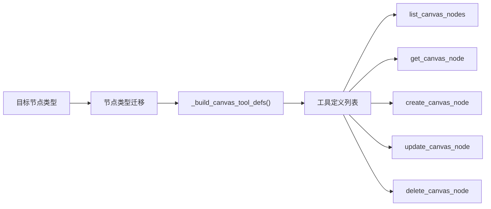

# 画布工具技能文档

<cite>
**本文档引用的文件**
- [canvas.py](file://backend/services/tool_manager/providers/canvas.py)
- [models.py](file://backend/models.py)
- [useCanvasStore.ts](file://frontend/src/store/useCanvasStore.ts)
- [graphUtils.ts](file://frontend/src/lib/graphUtils.ts)
- [ScriptEditor.tsx](file://frontend/src/components/canvas/ScriptEditor.tsx)
- [use-tiptap-editor.ts](file://frontend/src/hooks/use-tiptap-editor.ts)
- [chat_generation.py](file://backend/services/chat_generation.py)
- [theater.py](file://backend/services/theater.py)
</cite>

## 目录
1. [简介](#简介)
2. [项目结构](#项目结构)
3. [核心组件](#核心组件)
4. [架构概览](#架构概览)
5. [详细组件分析](#详细组件分析)
6. [依赖关系分析](#依赖关系分析)
7. [性能考虑](#性能考虑)
8. [故障排除指南](#故障排除指南)
9. [结论](#结论)

## 简介

画布工具技能是 Infinite Game 项目中的核心功能模块，负责管理剧场（Theater）画布上的节点操作。该系统提供了完整的 CRUD 操作能力，支持多种节点类型（文本、图像、视频、分镜），并通过智能代理系统实现自动化内容创作和编辑。

系统采用前后端分离架构，后端使用 Python 和 SQLAlchemy 进行数据持久化，前端使用 React 和 TypeScript 构建交互式画布编辑器。通过工具管理器和技能系统，实现了灵活的工具注册、权限控制和动态加载机制。

## 项目结构

项目采用模块化组织结构，主要分为三个核心部分：

```mermaid
graph TB
subgraph "后端服务"
A[CanvasProvider<br/>画布工具提供者]
B[数据库模型<br/>TheaterNode/Edge]
C[工具管理器<br/>技能系统]
D[聊天服务<br/>工具执行]
end
subgraph "前端应用"
E[画布存储<br/>useCanvasStore]
F[图形工具<br/>graphUtils]
G[编辑器组件<br/>ScriptEditor]
H[Tiptap编辑器<br/>use-tiptap-editor]
end
subgraph "数据层"
I[(SQLAlchemy)<br/>数据库]
J[(本地存储)<br/>localStorage]
end
A --> I
C --> A
D --> A
E --> J
F --> E
G --> E
H --> G
```

**图表来源**
- [canvas.py:513-563](file://backend/services/tool_manager/providers/canvas.py#L513-L563)
- [models.py:93-129](file://backend/models.py#L93-L129)
- [useCanvasStore.ts:185-540](file://frontend/src/store/useCanvasStore.ts#L185-L540)

**章节来源**
- [canvas.py:1-563](file://backend/services/tool_manager/providers/canvas.py#L1-L563)
- [models.py:1-200](file://backend/models.py#L1-L200)
- [useCanvasStore.ts:1-540](file://frontend/src/store/useCanvasStore.ts#L1-L540)

## 核心组件

### 后端核心组件

#### CanvasProvider 类
CanvasProvider 是画布工具的核心提供者，实现了完整的 CRUD 操作接口：

- **工具定义构建**：根据节点类型动态生成 OpenAI 格式的函数定义
- **权限控制**：基于技能加载状态和代理配置进行访问控制
- **异步执行**：提供完整的异步工具执行框架

#### 数据模型
系统使用三层数据模型支持画布功能：

- **TheaterNode**：画布节点实体，支持多种节点类型
- **TheaterEdge**：节点间连接关系
- **Theater**：剧场容器，管理画布视口和设置

### 前端核心组件

#### 画布存储管理
useCanvasStore 提供了完整的画布状态管理：

- **节点操作**：添加、删除、更新节点
- **连接管理**：边的创建、删除和验证
- **历史记录**：撤销重做功能
- **同步机制**：与后端的实时同步

#### 图形工具
graphUtils 提供了图论算法支持：

- **环检测**：防止循环依赖
- **拓扑验证**：确保图结构的有效性

**章节来源**
- [canvas.py:513-563](file://backend/services/tool_manager/providers/canvas.py#L513-L563)
- [models.py:93-129](file://backend/models.py#L93-L129)
- [useCanvasStore.ts:185-540](file://frontend/src/store/useCanvasStore.ts#L185-L540)
- [graphUtils.ts:1-39](file://frontend/src/lib/graphUtils.ts#L1-L39)

## 架构概览

系统采用分层架构设计，实现了清晰的关注点分离：



**图表来源**
- [useCanvasStore.ts:478-505](file://frontend/src/store/useCanvasStore.ts#L478-L505)
- [canvas.py:541-546](file://backend/services/tool_manager/providers/canvas.py#L541-L546)

系统架构特点：

1. **响应式设计**：前端状态变化自动触发后端同步
2. **权限控制**：基于技能加载状态的动态权限管理
3. **错误处理**：统一的异常捕获和错误响应机制
4. **历史追踪**：完整的操作历史记录和恢复能力

## 详细组件分析

### CanvasProvider 组件分析

#### 类关系图


**图表来源**
- [canvas.py:513-563](file://backend/services/tool_manager/providers/canvas.py#L513-L563)
- [models.py:93-112](file://backend/models.py#L93-L112)

#### 工具执行流程


**图表来源**
- [canvas.py:490-507](file://backend/services/tool_manager/providers/canvas.py#L490-L507)
- [canvas.py:300-475](file://backend/services/tool_manager/providers/canvas.py#L300-L475)

### 前端画布存储组件分析

#### 状态管理模式


**图表来源**
- [useCanvasStore.ts:350-376](file://frontend/src/store/useCanvasStore.ts#L350-L376)
- [useCanvasStore.ts:478-505](file://frontend/src/store/useCanvasStore.ts#L478-L505)

#### 节点类型定义
前端定义了四种节点类型的数据结构：

| 节点类型 | 数据结构 | 主要字段 |
|---------|----------|----------|
| 文本节点 | ScriptNodeData | title, content, tags, characters, scenes |
| 角色节点 | CharacterNodeData | name, description, avatar, imageUrl, fitMode |
| 分镜节点 | StoryboardNodeData | shotNumber, description, duration, pivotConfig |
| 视频节点 | VideoNodeData | name, description, videoUrl, fitMode |

**章节来源**
- [canvas.py:42-86](file://backend/services/tool_manager/providers/canvas.py#L42-L86)
- [useCanvasStore.ts:27-59](file://frontend/src/store/useCanvasStore.ts#L27-L59)

### 技能系统集成

#### 工具定义构建
CanvasProvider 根据节点类型动态构建工具定义：



**图表来源**
- [canvas.py:126-246](file://backend/services/tool_manager/providers/canvas.py#L126-L246)
- [canvas.py:532-539](file://backend/services/tool_manager/providers/canvas.py#L532-L539)

**章节来源**
- [canvas.py:25-28](file://backend/services/tool_manager/providers/canvas.py#L25-L28)
- [canvas.py:126-246](file://backend/services/tool_manager/providers/canvas.py#L126-L246)

## 依赖关系分析

### 数据模型依赖
```mermaid
erDiagram
THEATER {
string id PK
string user_id FK
string title
string description
string thumbnail_url
string status
json canvas_viewport
json settings
int node_count
datetime created_at
datetime updated_at
}
THEATER_NODE {
string id PK
string theater_id FK
string node_type
float position_x
float position_y
float width
float height
int z_index
json data
string created_by_agent_id FK
datetime created_at
datetime updated_at
}
THEATER_EDGE {
string id PK
string theater_id FK
string source_node_id FK
string target_node_id FK
string source_handle
string target_handle
string edge_type
boolean animated
json style
datetime created_at
}
THEATER ||--o{ THEATER_NODE : contains
THEATER ||--o{ THEATER_EDGE : connects
THEATER_NODE ||--o{ THEATER_EDGE : source/target
```

**图表来源**
- [models.py:75-129](file://backend/models.py#L75-L129)

### 前端依赖关系
```mermaid
graph TB
subgraph "画布编辑器"
A[useCanvasStore] --> B[graphUtils]
A --> C[theaterApi]
A --> D[localStorage]
end
subgraph "编辑器组件"
E[ScriptEditor] --> F[use-tiptap-editor]
F --> G[Tiptap扩展]
end
subgraph "UI框架"
H[@xyflow/react] --> I[React Flow]
J[Zustand] --> K[状态管理]
end
A --> H
A --> J
E --> I
E --> J
```

**图表来源**
- [useCanvasStore.ts:18-24](file://frontend/src/store/useCanvasStore.ts#L18-L24)
- [graphUtils.ts:1-39](file://frontend/src/lib/graphUtils.ts#L1-L39)

**章节来源**
- [models.py:75-129](file://backend/models.py#L75-L129)
- [useCanvasStore.ts:18-24](file://frontend/src/store/useCanvasStore.ts#L18-L24)

## 性能考虑

### 数据库优化策略
1. **索引设计**：节点和边表都建立了适当的索引以提高查询性能
2. **批量操作**：支持批量节点和边的创建、更新和删除
3. **缓存机制**：利用 SQLAlchemy 的查询缓存减少重复查询

### 前端性能优化
1. **虚拟化渲染**：大型画布使用虚拟化技术提升渲染性能
2. **增量同步**：只同步发生变化的节点和边
3. **内存管理**：及时清理不再使用的节点引用

### 并发控制
1. **事务管理**：数据库操作使用异步事务确保数据一致性
2. **锁机制**：对同一剧场的并发操作进行适当的锁控制
3. **重试机制**：网络异常时自动重试机制

## 故障排除指南

### 常见问题及解决方案

#### 工具执行失败
**症状**：工具调用返回错误信息
**可能原因**：
- 权限不足（技能未加载）
- 参数验证失败
- 数据库连接异常

**解决步骤**：
1. 检查技能加载状态
2. 验证输入参数格式
3. 查看后端日志获取详细错误信息

#### 画布同步问题
**症状**：前端显示与后端不一致
**可能原因**：
- 网络连接中断
- 冲突检测失败
- 历史记录不同步

**解决步骤**：
1. 重新加载剧场数据
2. 检查网络连接状态
3. 清除本地存储缓存

#### 性能问题
**症状**：画布操作响应缓慢
**可能原因**：
- 节点数量过多
- 复杂的连接关系
- 浏览器性能限制

**优化建议**：
1. 减少同时显示的节点数量
2. 简化连接关系
3. 升级浏览器版本

**章节来源**
- [canvas.py:504-506](file://backend/services/tool_manager/providers/canvas.py#L504-L506)
- [useCanvasStore.ts:394-397](file://frontend/src/store/useCanvasStore.ts#L394-L397)

## 结论

画布工具技能系统是一个功能完整、架构清晰的可视化内容创作平台。系统通过以下关键特性实现了高效的内容管理和协作：

1. **模块化设计**：前后端分离，职责明确，便于维护和扩展
2. **灵活的权限控制**：基于技能系统的动态权限管理
3. **强大的数据模型**：支持多种节点类型和复杂的连接关系
4. **优秀的用户体验**：响应式界面和丰富的交互功能
5. **完善的错误处理**：全面的异常捕获和恢复机制

该系统为 Infinite Game 项目提供了坚实的技术基础，支持从简单的文本编辑到复杂的故事板制作等各种创作需求。通过持续的优化和扩展，该系统将继续为用户提供更好的创作体验。