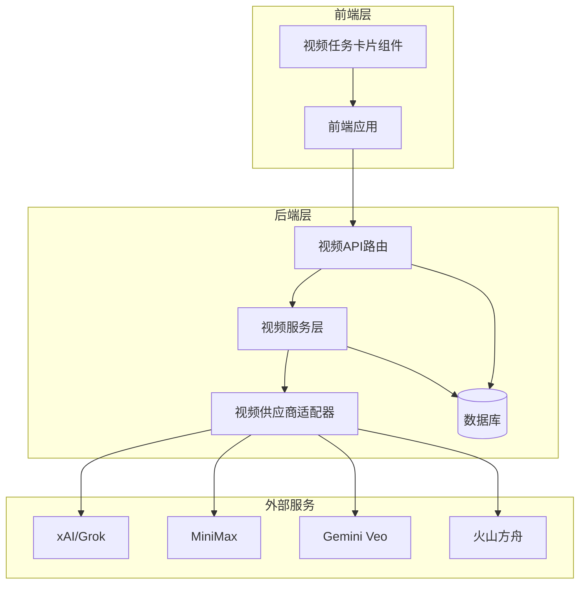
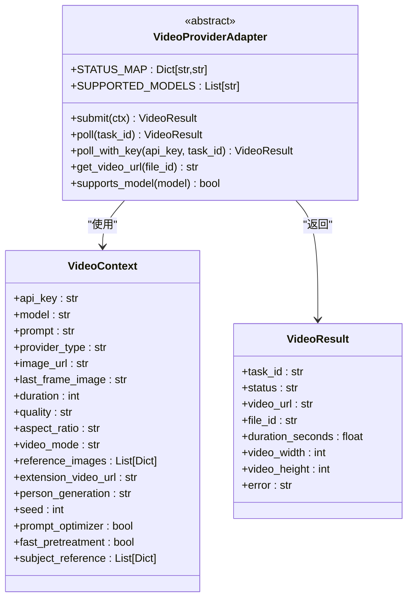
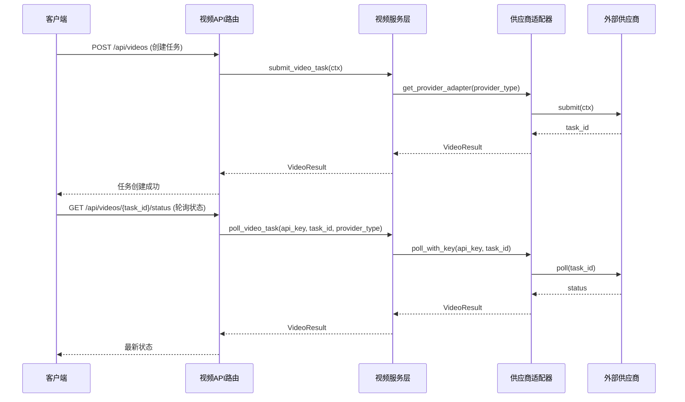
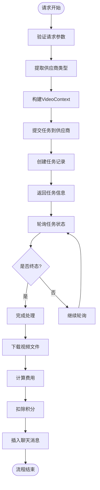
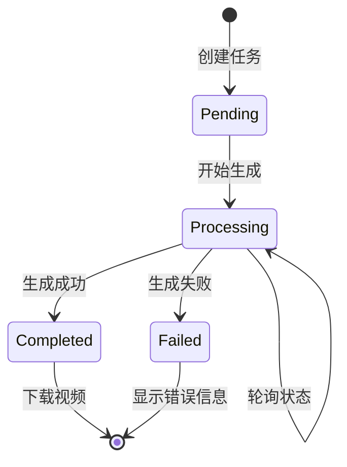
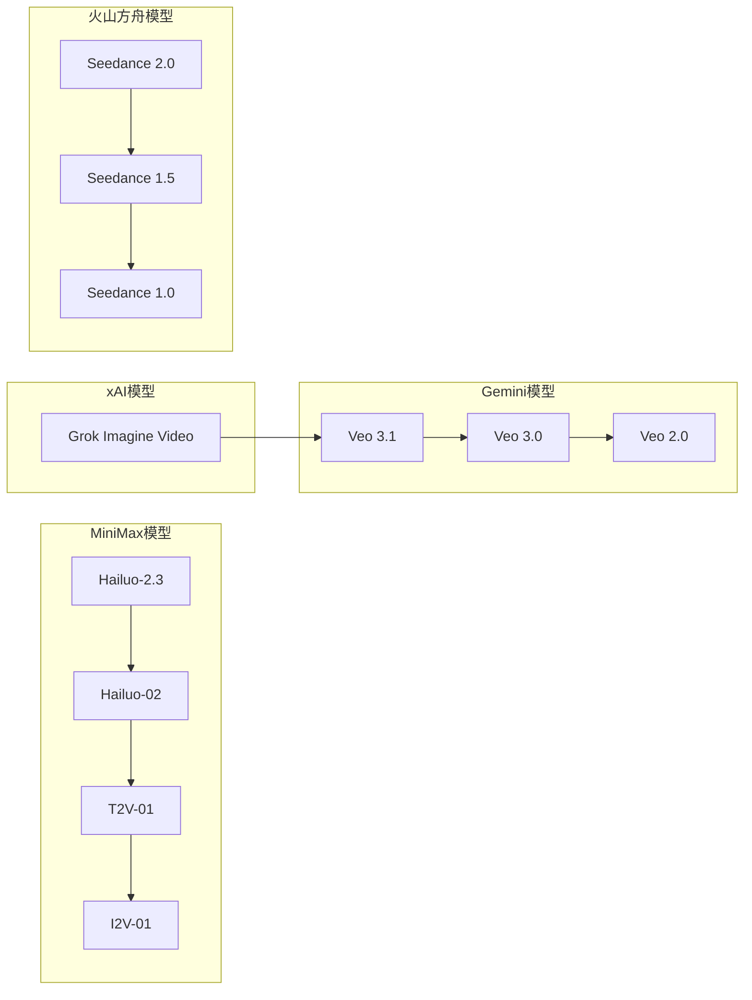
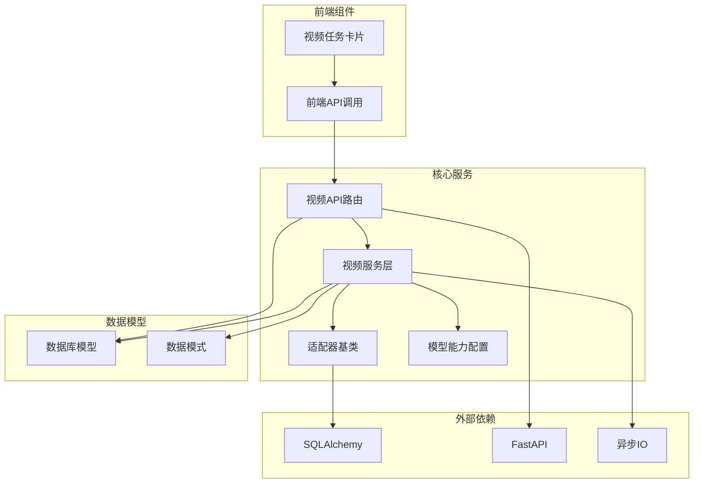
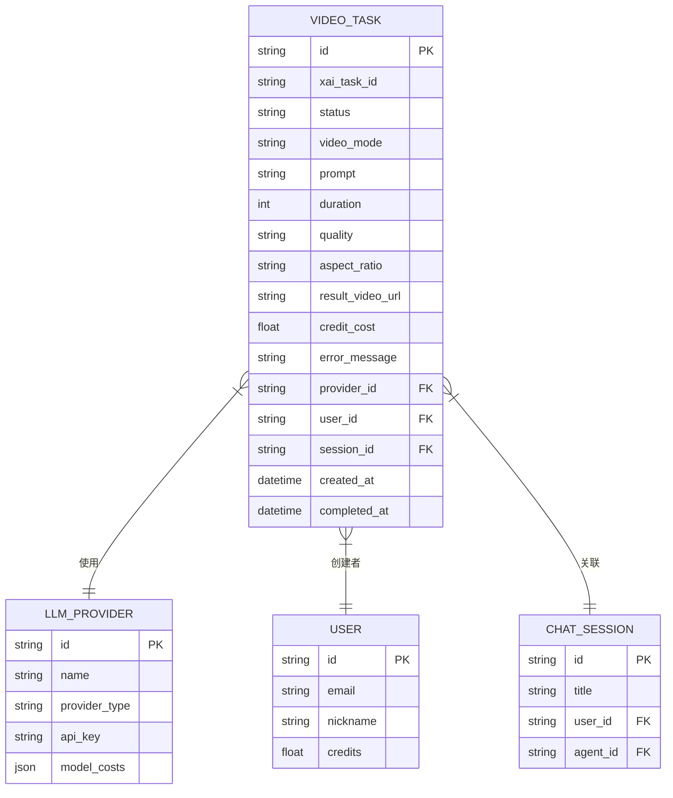
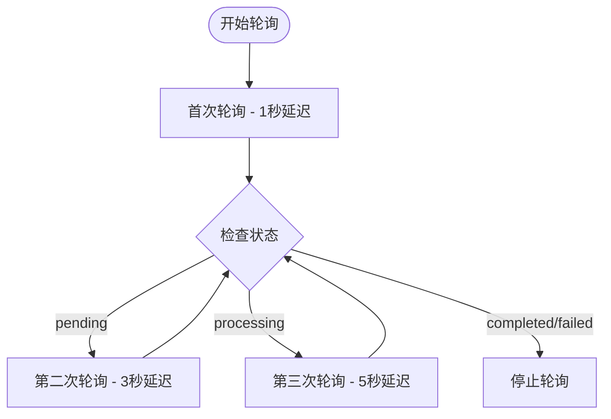

# 视频工具技能文档

<cite>
**本文档引用的文件**
- [backend/services/video_providers/base.py](file://backend/services/video_providers/base.py)
- [backend/services/video_generation.py](file://backend/services/video_generation.py)
- [backend/routers/videos.py](file://backend/routers/videos.py)
- [backend/models.py](file://backend/models.py)
- [backend/schemas.py](file://backend/schemas.py)
- [backend/services/video_providers/model_capabilities.py](file://backend/services/video_providers/model_capabilities.py)
- [frontend/src/components/ai-assistant/VideoTaskCard.tsx](file://frontend/src/components/ai-assistant/VideoTaskCard.tsx)
</cite>

## 目录
1. [简介](#简介)
2. [项目结构](#项目结构)
3. [核心组件](#核心组件)
4. [架构概览](#架构概览)
5. [详细组件分析](#详细组件分析)
6. [依赖关系分析](#依赖关系分析)
7. [性能考虑](#性能考虑)
8. [故障排除指南](#故障排除指南)
9. [结论](#结论)

## 简介

本项目是一个基于多供应商视频生成系统的完整解决方案，支持多种视频生成模型和供应商。系统采用统一的抽象接口设计，通过适配器模式支持xAI、MiniMax、Gemini Veo和火山方舟等不同供应商的视频生成服务。

系统主要功能包括：
- 多供应商视频生成统一入口
- 实时任务状态轮询
- 智能计费系统
- 前后端一体化的视频生成工作流
- 支持多种视频生成模式（文生视频、图生视频、视频编辑等）

## 项目结构

项目采用前后端分离的架构设计，主要分为三个核心部分：

**图表来源**
- [backend/routers/videos.py:1-344](file://backend/routers/videos.py#L1-L344)
- [backend/services/video_generation.py:1-180](file://backend/services/video_generation.py#L1-L180)

**章节来源**
- [backend/routers/videos.py:1-344](file://backend/routers/videos.py#L1-L344)
- [backend/services/video_generation.py:1-180](file://backend/services/video_generation.py#L1-L180)

## 核心组件

### 视频生成适配器基类

系统的核心是抽象的视频生成适配器基类，定义了统一的接口规范：

**图表来源**
- [backend/services/video_providers/base.py:15-121](file://backend/services/video_providers/base.py#L15-L121)

### 供应商适配器注册表

系统支持四种主要供应商，每种供应商都有专门的适配器实现：

| 供应商 | 模型前缀 | 支持功能 | 适配器类 |
|--------|----------|----------|----------|
| xAI (Grok) | grok-imagine-video | 文生视频、图生视频、参考图片、视频编辑 | XAIVideoAdapter |
| MiniMax | hailuo, minimax, t2v-01, i2v-01, s2v-01 | 文生视频、图生视频、首尾帧 | MiniMaxVideoAdapter |
| Gemini Veo | veo-3.1, veo-3.0 | 文生视频、图生视频、音频支持 | GeminiVeoAdapter |
| 火山方舟 | seedance, doubao-seedance | 文生视频、图生视频、多模态参考 | ArkSeedanceAdapter |

**章节来源**
- [backend/services/video_providers/base.py:56-121](file://backend/services/video_providers/base.py#L56-L121)
- [backend/services/video_generation.py:50-82](file://backend/services/video_generation.py#L50-L82)

## 架构概览

系统采用分层架构设计，确保了良好的可扩展性和维护性：

**图表来源**
- [backend/routers/videos.py:75-148](file://backend/routers/videos.py#L75-L148)
- [backend/services/video_generation.py:90-126](file://backend/services/video_generation.py#L90-L126)

## 详细组件分析

### 视频API路由层

视频API路由层负责处理客户端请求，提供完整的视频生成生命周期管理：

**图表来源**
- [backend/routers/videos.py:75-234](file://backend/routers/videos.py#L75-L234)

#### 任务状态管理

系统实现了完整的任务状态管理机制，支持四种状态转换：

| 状态 | 描述 | 转换条件 |
|------|------|----------|
| pending | 等待生成 | 任务刚创建 |
| processing | 正在生成 | 供应商处理中 |
| completed | 生成完成 | 视频下载成功 |
| failed | 生成失败 | 错误超时或供应商错误 |

**章节来源**
- [backend/routers/videos.py:150-234](file://backend/routers/videos.py#L150-L234)

### 前端视频任务组件

前端提供了直观的视频任务管理界面，支持实时状态显示和交互操作：

**图表来源**
- [frontend/src/components/ai-assistant/VideoTaskCard.tsx:37-47](file://frontend/src/components/ai-assistant/VideoTaskCard.tsx#L37-L47)

#### 组件功能特性

前端组件具备以下核心功能：

1. **实时状态轮询**：自动轮询任务状态，间隔5秒
2. **拖拽预览**：支持将生成的视频拖拽到画布
3. **状态可视化**：不同状态显示不同的颜色和图标
4. **错误处理**：友好的错误信息展示
5. **下载支持**：提供直接下载链接

**章节来源**
- [frontend/src/components/ai-assistant/VideoTaskCard.tsx:1-290](file://frontend/src/components/ai-assistant/VideoTaskCard.tsx#L1-L290)

### 模型能力配置系统

系统内置了详细的模型能力配置，支持不同供应商的差异化功能：

**图表来源**
- [backend/services/video_providers/model_capabilities.py:27-458](file://backend/services/video_providers/model_capabilities.py#L27-L458)

#### 支持的功能特性对比

| 功能特性 | MiniMax | xAI | Gemini | 火山方舟 |
|----------|---------|-----|--------|----------|
| 文生视频 | ✓ | ✓ | ✓ | ✓ |
| 图生视频 | ✓ | ✓ | ✓ | ✓ |
| 首尾帧支持 | 部分 | ✗ | ✓ | ✓ |
| 参考图片 | 部分 | ✓ | ✓ | ✓ |
| 视频编辑 | ✗ | ✓ | ✗ | ✓ |
| 视频扩展 | ✗ | ✓ | ✓ | ✓ |
| 音频支持 | ✗ | ✗ | ✓ | ✓ |
| 4K分辨率 | ✗ | ✗ | ✓ | ✗ |

**章节来源**
- [backend/services/video_providers/model_capabilities.py:1-477](file://backend/services/video_providers/model_capabilities.py#L1-L477)

## 依赖关系分析

系统采用了清晰的依赖层次结构，确保了模块间的松耦合：

**图表来源**
- [backend/routers/videos.py:1-344](file://backend/routers/videos.py#L1-L344)
- [backend/services/video_generation.py:1-180](file://backend/services/video_generation.py#L1-L180)

### 数据库模型关系

系统使用SQLAlchemy ORM定义了完整的数据模型关系：

**图表来源**
- [backend/models.py:152-203](file://backend/models.py#L152-L203)

**章节来源**
- [backend/models.py:1-491](file://backend/models.py#L1-L491)

## 性能考虑

### 并发处理优化

系统采用异步编程模型，确保高并发场景下的性能表现：

1. **异步任务处理**：所有视频生成任务都采用异步处理
2. **连接池管理**：数据库连接使用连接池优化
3. **缓存策略**：常用配置和模型能力信息进行缓存
4. **批量操作**：支持批量查询和更新操作

### 轮询策略优化

### 内存管理

系统实现了完善的内存管理策略：
- 及时清理临时文件和缓存
- 控制轮询频率避免过度占用资源
- 优化数据库查询减少内存占用

## 故障排除指南

### 常见问题及解决方案

#### 1. 供应商API调用失败

**症状**：任务状态长时间停留在pending或出现网络错误

**排查步骤**：
1. 检查API密钥是否正确配置
2. 验证网络连接和防火墙设置
3. 查看供应商服务状态
4. 检查请求频率限制

**解决方案**：
- 更新正确的API密钥
- 实现重试机制和指数退避算法
- 监控供应商服务可用性

#### 2. 视频下载失败

**症状**：任务状态显示completed但无法下载视频文件

**排查步骤**：
1. 检查视频URL的有效性
2. 验证文件权限设置
3. 确认磁盘空间充足
4. 检查文件完整性

**解决方案**：
- 实现断点续传功能
- 添加文件完整性校验
- 提供手动重试机制

#### 3. 积分扣费异常

**症状**：视频生成成功但积分未正确扣除

**排查步骤**：
1. 检查计费配置是否正确
2. 验证用户余额状态
3. 确认事务一致性
4. 查看日志中的错误信息

**解决方案**：
- 实现补偿机制
- 添加审计日志
- 提供人工干预接口

**章节来源**
- [backend/routers/videos.py:180-234](file://backend/routers/videos.py#L180-L234)

### 调试工具和监控

系统提供了完善的调试和监控功能：

1. **日志记录**：详细的请求和响应日志
2. **性能监控**：任务执行时间和资源使用情况
3. **错误追踪**：异常堆栈和错误详情
4. **状态监控**：实时的任务状态面板

## 结论

本视频工具技能系统通过精心设计的架构和完善的组件实现，为用户提供了一个强大而灵活的视频生成解决方案。系统的主要优势包括：

1. **高度可扩展性**：通过适配器模式支持新增供应商
2. **统一接口设计**：简化了多供应商集成的复杂度
3. **完整的生命周期管理**：从任务创建到结果交付的全流程支持
4. **强大的前端体验**：直观的状态显示和交互功能
5. **完善的错误处理**：robust的异常处理和恢复机制

未来可以考虑的功能增强：
- 支持更多视频生成供应商
- 实现视频质量自动优化
- 添加批量视频生成功能
- 增强视频编辑工具集
- 优化移动端用户体验