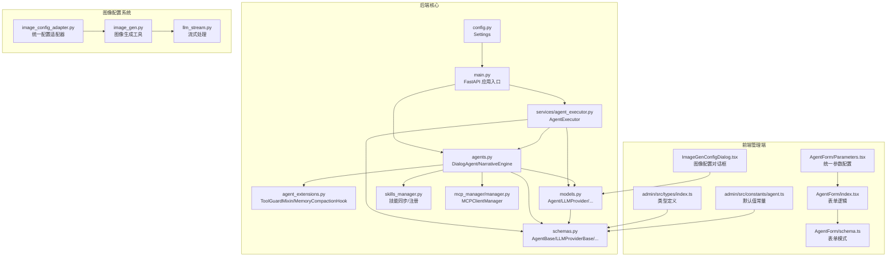
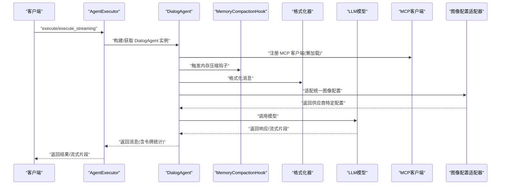
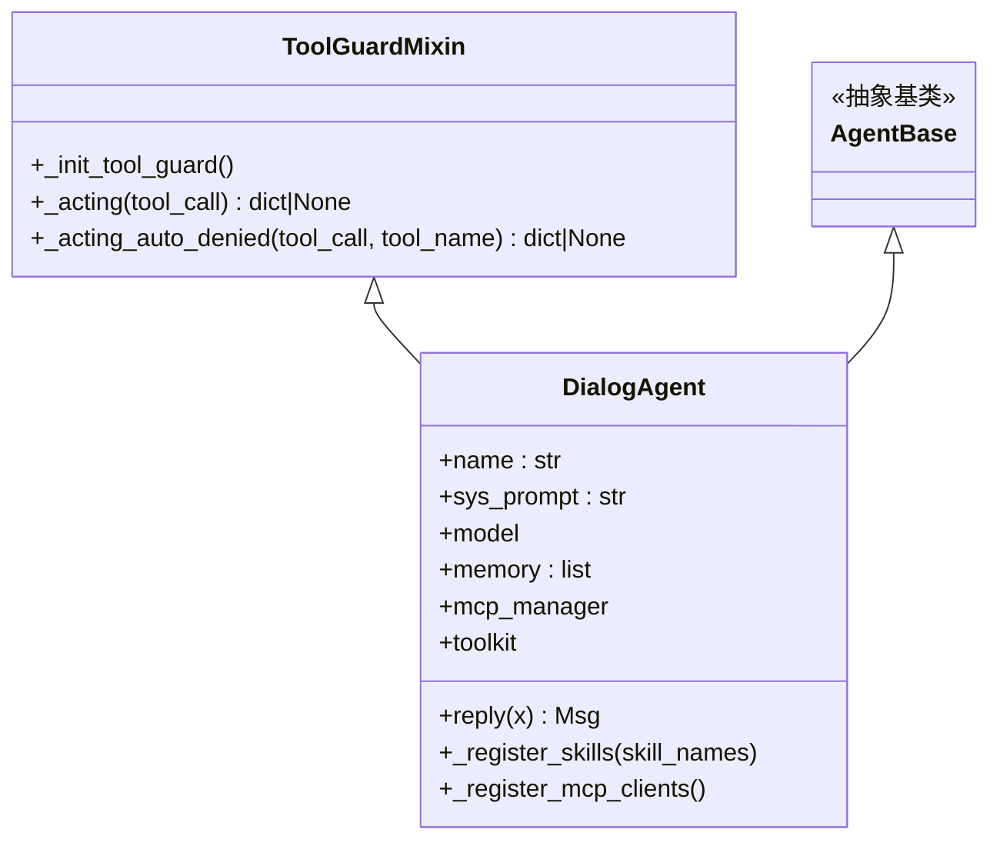
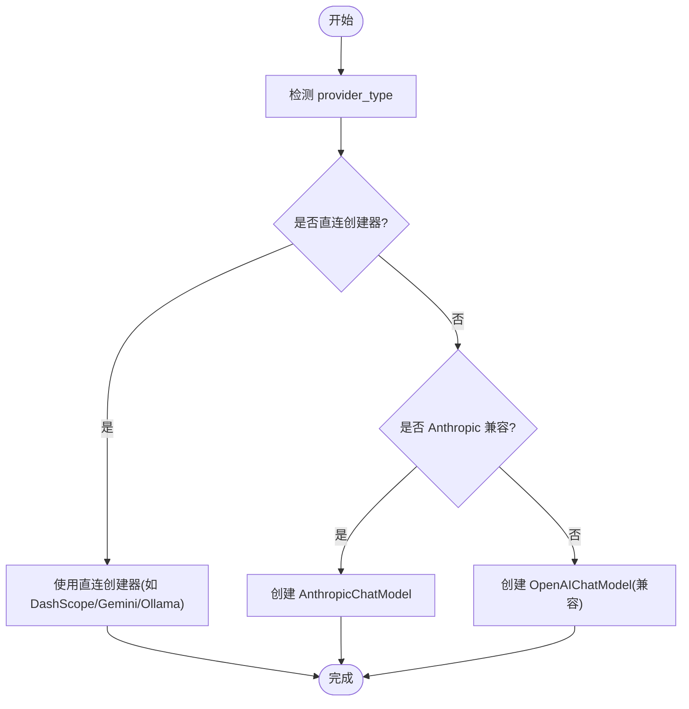
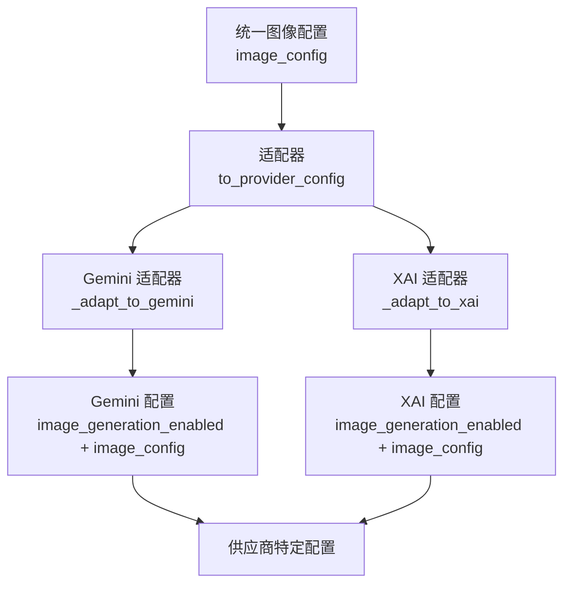
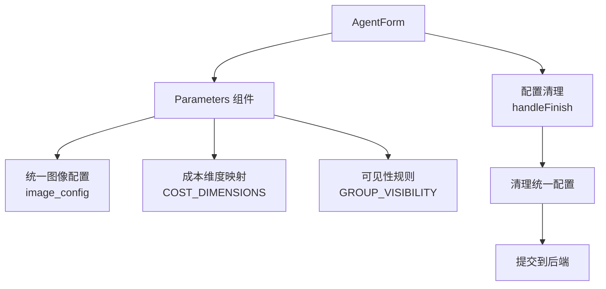
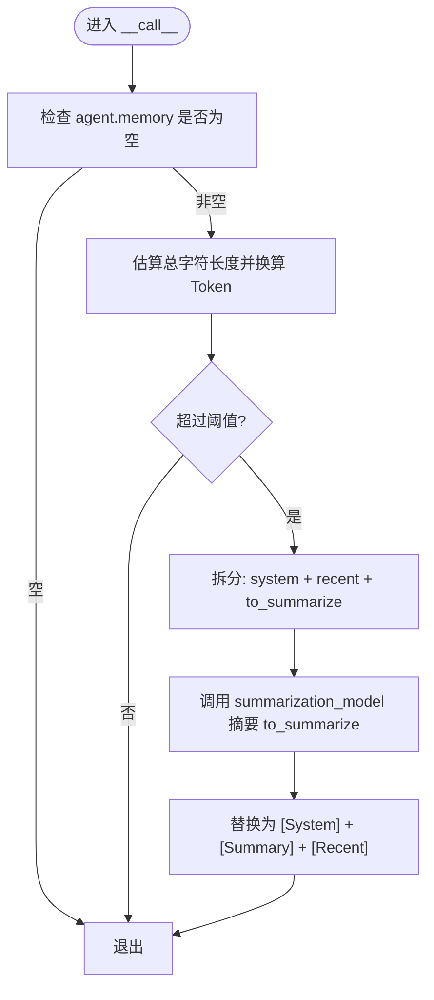
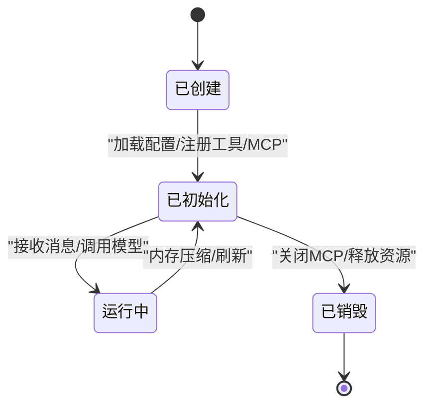
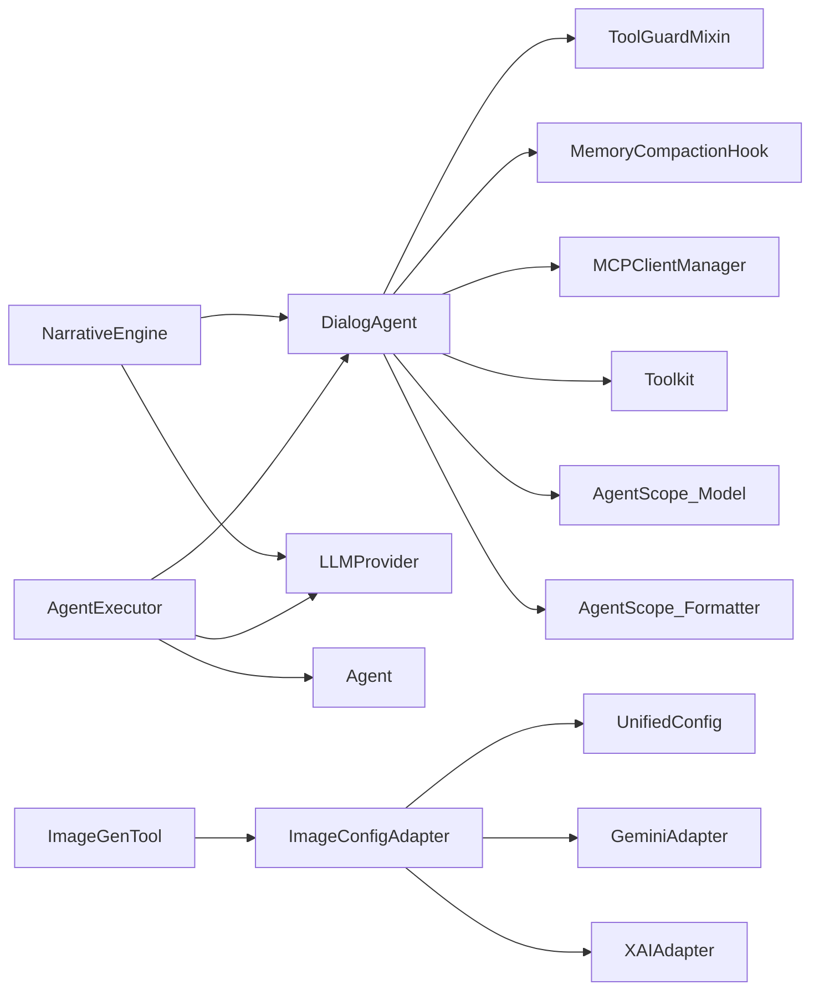

# 智能体配置管理

<cite>
**本文引用的文件**
- [agents.py](file://backend/agents.py)
- [agent_extensions.py](file://backend/agent_extensions.py)
- [services/agent_executor.py](file://backend/services/agent_executor.py)
- [models.py](file://backend/models.py)
- [schemas.py](file://backend/schemas.py)
- [config.py](file://backend/config.py)
- [skills_manager.py](file://backend/skills_manager.py)
- [mcp_manager/manager.py](file://backend/mcp_manager/manager.py)
- [main.py](file://backend/main.py)
- [admin/src/types/index.ts](file://backend/admin/src/types/index.ts)
- [admin/src/constants/agent.ts](file://backend/admin/src/constants/agent.ts)
- [admin/src/components/admin/agents/AgentForm/Parameters.tsx](file://backend/admin/src/components/admin/agents/AgentForm/Parameters.tsx)
- [admin/src/components/admin/agents/AgentForm/index.tsx](file://backend/admin/src/components/admin/agents/AgentForm/index.tsx)
- [admin/src/components/admin/agents/AgentForm/schema.ts](file://backend/admin/src/components/admin/agents/AgentForm/schema.ts)
- [admin/src/components/admin/tools/ImageGenConfigDialog.tsx](file://backend/admin/src/components/admin/tools/ImageGenConfigDialog.tsx)
- [services/tool_manager/providers/image_gen.py](file://backend/services/tool_manager/providers/image_gen.py)
- [services/image_config_adapter.py](file://backend/services/image_config_adapter.py)
- [services/llm_stream.py](file://backend/services/llm_stream.py)
- [migrations/versions/b2c3d4e5f6g7_add_unified_image_config_to_agents.py](file://backend/migrations/versions/b2c3d4e5f6g7_add_unified_image_config_to_agents.py)
- [migrations/versions/a1b2c3d4e5f6_add_xai_image_config_to_agents.py](file://backend/migrations/versions/a1b2c3d4e5f6_add_xai_image_config_to_agents.py)
- [migrations/versions/e1f2a3b4c5d6_add_gemini_config.py](file://backend/migrations/versions/e1f2a3b4c5d6_add_gemini_config.py)
</cite>

## 目录
1. [简介](#简介)
2. [项目结构](#项目结构)
3. [核心组件](#核心组件)
4. [架构总览](#架构总览)
5. [详细组件分析](#详细组件分析)
6. [依赖分析](#依赖分析)
7. [性能考量](#性能考量)
8. [故障排查指南](#故障排查指南)
9. [结论](#结论)
10. [附录](#附录)

## 简介
本文件面向"智能体配置管理"的完整技术文档，聚焦于 DialogAgent 类的设计与实现、系统提示词（sys_prompt）的作用机制、模型配置与适配器设计、内存管理与压缩钩子、以及智能体生命周期管理。同时提供配置验证、错误处理与性能优化的最佳实践，帮助开发者与运维人员高效地构建、部署与维护基于多供应商模型的智能体系统。

**更新** 本版本新增了统一图像生成配置系统的详细说明，反映了 AgentForm 参数组件重构后的变化，移除了 Gemini 和 XAI 特定配置，采用统一的图像生成配置方案。

## 项目结构
后端采用模块化组织：
- 后端核心：agents.py 定义 DialogAgent 与叙事引擎；agent_extensions.py 提供工具守卫与内存压缩钩子；services/agent_executor.py 提供统一执行器；models.py 定义数据库模型；schemas.py 定义 Pydantic 模型；config.py 提供运行时配置；skills_manager.py 管理技能；mcp_manager/manager.py 管理 MCP 客户端；main.py 作为应用入口。
- 管理端前端：admin/src/types/index.ts 与 admin/src/constants/agent.ts 定义智能体与供应商的类型与默认值，支撑管理界面的配置校验与表单渲染。
- 统一图像配置系统：通过 image_config_adapter.py 实现供应商无关的图像生成配置，支持 Gemini 和 XAI 的适配转换。

**图表来源**
- [agents.py:1-388](file://backend/agents.py#L1-L388)
- [agent_extensions.py:1-163](file://backend/agent_extensions.py#L1-L163)
- [services/agent_executor.py:1-287](file://backend/services/agent_executor.py#L1-L287)
- [models.py:1-447](file://backend/models.py#L1-L447)
- [schemas.py:1-800](file://backend/schemas.py#L1-L800)
- [config.py:1-43](file://backend/config.py#L1-L43)
- [skills_manager.py:1-408](file://backend/skills_manager.py#L1-L408)
- [mcp_manager/manager.py:1-139](file://backend/mcp_manager/manager.py#L1-L139)
- [main.py:1-174](file://backend/main.py#L1-L174)
- [admin/src/types/index.ts:1-282](file://backend/admin/src/types/index.ts#L1-L282)
- [admin/src/constants/agent.ts:1-29](file://backend/admin/src/constants/agent.ts#L1-L29)
- [admin/src/components/admin/agents/AgentForm/Parameters.tsx:1-324](file://backend/admin/src/components/admin/agents/AgentForm/Parameters.tsx#L1-L324)
- [admin/src/components/admin/agents/AgentForm/index.tsx:1-320](file://backend/admin/src/components/admin/agents/AgentForm/index.tsx#L1-L320)
- [admin/src/components/admin/agents/AgentForm/schema.ts:1-79](file://backend/admin/src/components/admin/agents/AgentForm/schema.ts#L1-L79)
- [admin/src/components/admin/tools/ImageGenConfigDialog.tsx:1-154](file://backend/admin/src/components/admin/tools/ImageGenConfigDialog.tsx#L1-L154)
- [services/tool_manager/providers/image_gen.py:1-262](file://backend/services/tool_manager/providers/image_gen.py#L1-L262)
- [services/image_config_adapter.py:1-182](file://backend/services/image_config_adapter.py#L1-L182)
- [services/llm_stream.py:726-757](file://backend/services/llm_stream.py#L726-L757)

**章节来源**
- [main.py:49-108](file://backend/main.py#L49-L108)
- [agents.py:40-175](file://backend/agents.py#L40-L175)
- [services/agent_executor.py:63-277](file://backend/services/agent_executor.py#L63-L277)

## 核心组件
- DialogAgent：对话型智能体的核心类，负责系统提示词注入、消息格式化、模型调用、工具注册、MCP 客户端集成、内存管理与压缩钩子。
- ToolGuardMixin：工具调用拦截与审批流的混合类，提供安全策略（禁止/受限工具）。
- MemoryCompactionHook：内存压缩钩子，按阈值自动汇总历史消息，控制上下文长度。
- AgentExecutor：统一执行器，封装 DialogAgent 的调用与流式输出，提供缓存与令牌统计。
- NarrativeEngine：叙事引擎，负责从数据库加载 LLM 提供商配置，动态初始化 AgentScope 模型实例，并创建多个角色智能体。
- 统一图像配置系统：通过 image_config_adapter.py 实现供应商无关的图像生成配置，支持 Gemini 和 XAI 的适配转换。
- AgentForm 参数组件：重构后的表单组件，移除了 Gemini 和 XAI 特定配置，采用统一图像生成配置系统。
- 技能系统：通过 skills_manager.py 同步内置/定制技能至活动目录，并注册到 Toolkit。
- MCP 管理：通过 MCPClientManager 管理 HTTP/STDIO 传输的 MCP 客户端，支持热替换与连接恢复。
- 数据模型与模式：models.py 定义 Agent/LLMProvider 等；schemas.py 定义 Pydantic 模型用于 API 校验与序列化。

**章节来源**
- [agents.py:40-175](file://backend/agents.py#L40-L175)
- [agent_extensions.py:7-163](file://backend/agent_extensions.py#L7-L163)
- [services/agent_executor.py:63-277](file://backend/services/agent_executor.py#L63-L277)
- [models.py:146-253](file://backend/models.py#L146-L253)
- [schemas.py:126-350](file://backend/schemas.py#L126-L350)
- [skills_manager.py:228-244](file://backend/skills_manager.py#L228-L244)
- [mcp_manager/manager.py:28-139](file://backend/mcp_manager/manager.py#L28-L139)
- [services/image_config_adapter.py:1-182](file://backend/services/image_config_adapter.py#L1-L182)
- [admin/src/components/admin/agents/AgentForm/Parameters.tsx:1-324](file://backend/admin/src/components/admin/agents/AgentForm/Parameters.tsx#L1-L324)

## 架构总览
DialogAgent 作为核心执行单元，串联以下能力：
- 系统提示词注入：在每次推理前将 sys_prompt 以 system 角色加入消息列表。
- 模型适配器：根据模型类型选择对应格式化器，确保消息格式符合各供应商要求。
- 工具与 MCP：通过 Toolkit 注册技能与 MCP 客户端，支持工具调用与外部服务集成。
- 内存与压缩：在推理前触发 MemoryCompactionHook，按阈值进行摘要与裁剪。
- 流式输出：AgentExecutor 支持直接流式调用，绕过 DialogAgent 的内部缓存与格式化步骤。
- 统一图像配置：通过 image_config_adapter.py 实现供应商无关的图像生成配置，支持 Gemini 和 XAI 的适配转换。

**图表来源**
- [services/agent_executor.py:74-208](file://backend/services/agent_executor.py#L74-L208)
- [agents.py:114-174](file://backend/agents.py#L114-L174)
- [agent_extensions.py:81-163](file://backend/agent_extensions.py#L81-L163)
- [services/image_config_adapter.py:134-146](file://backend/services/image_config_adapter.py#L134-L146)

## 详细组件分析

### DialogAgent 类设计与继承体系
- 继承关系：DialogAgent 继承自 ToolGuardMixin 与 AgentBase，具备工具拦截与智能体基础能力。
- 初始化参数：
  - name：智能体名称
  - sys_prompt：系统提示词
  - model：AgentScope 模型实例（如 OpenAIChatModel、DashScopeChatModel 等）
  - max_tokens：内存压缩阈值（Token 估算）
  - mcp_manager：MCP 客户端管理器
  - skill_names：启用的技能列表（可选）
- 关键职责：
  - 构建消息列表，注入 system 角色的 sys_prompt
  - 选择格式化器，将消息转换为供应商期望的格式
  - 调用模型并处理流式响应
  - 提取令牌统计与字符统计，写入消息元数据
  - 追加响应到内存，供后续推理使用

**图表来源**
- [agents.py:40-175](file://backend/agents.py#L40-L175)
- [agent_extensions.py:7-79](file://backend/agent_extensions.py#L7-L79)

**章节来源**
- [agents.py:49-113](file://backend/agents.py#L49-L113)
- [agents.py:114-174](file://backend/agents.py#L114-L174)

### 系统提示词（sys_prompt）的作用机制
- 角色设定：sys_prompt 以 system 角色注入消息列表，作为智能体的全局指令与上下文边界。
- 行为约束：通过 ToolGuardMixin 对工具调用进行拦截与审批，结合 sys_prompt 的角色定位，确保智能体遵循安全策略。
- 输出格式控制：格式化器根据模型类型调整消息结构（例如去除非用户消息中的 name 字段），避免某些供应商的限制。

**章节来源**
- [agents.py:124-141](file://backend/agents.py#L124-L141)
- [agent_extensions.py:19-56](file://backend/agent_extensions.py#L19-L56)

### 模型配置管理与适配器设计
- 适配器映射：根据模型类型选择对应格式化器，确保消息格式符合供应商要求。
- 供应商类型识别：支持 openai/azure/deepseek/vllm/xai、anthropic/minimax、dashscope、gemini、ollama 等。
- 模型创建：根据 provider_type 与 base_url 动态创建模型实例，支持默认 base_url 映射与 client_kwargs 注入。
- 统一接口：AgentExecutor 与 NarrativeEngine 提供统一的模型创建与缓存策略，减少重复初始化开销。

**图表来源**
- [agents.py:244-293](file://backend/agents.py#L244-L293)
- [services/agent_executor.py:245-271](file://backend/services/agent_executor.py#L245-L271)

**章节来源**
- [agents.py:41-47](file://backend/agents.py#L41-L47)
- [agents.py:244-293](file://backend/agents.py#L244-L293)
- [services/agent_executor.py:46-61](file://backend/services/agent_executor.py#L46-L61)

### 统一图像生成配置系统
**更新** 本系统通过统一图像配置适配器实现供应商无关的图像生成配置管理，移除了 Gemini 和 XAI 特定配置，采用统一的配置格式。

- 统一配置结构：image_config 字段包含 image_generation_enabled、image_provider_id、image_model 和 image_config（统一参数）。
- 适配器设计：image_config_adapter.py 提供 to_provider_config 函数，将统一配置转换为供应商特定格式。
- 支持的供应商：Gemini 和 XAI 通过适配器转换，其他供应商可通过扩展适配器支持。
- 参数映射：
  - quality → resolution/image_size（供应商特定映射）
  - batch_count → n/batch_count（供应商特定字段名）
  - aspect_ratio → aspect_ratio（供应商支持集验证）
  - output_format → output_format（供应商支持验证）

**图表来源**
- [services/image_config_adapter.py:134-146](file://backend/services/image_config_adapter.py#L134-L146)
- [services/image_config_adapter.py:70-95](file://backend/services/image_config_adapter.py#L70-L95)
- [services/image_config_adapter.py:98-122](file://backend/services/image_config_adapter.py#L98-L122)

**章节来源**
- [models.py:254-255](file://backend/models.py#L254-L255)
- [schemas.py:220-234](file://backend/schemas.py#L220-L234)
- [services/image_config_adapter.py:1-182](file://backend/services/image_config_adapter.py#L1-L182)
- [services/tool_manager/providers/image_gen.py:171-200](file://backend/services/tool_manager/providers/image_gen.py#L171-L200)

### AgentForm 参数组件重构
**更新** AgentForm 参数组件已完成重构，移除了 Gemini 和 XAI 特定配置，采用统一图像生成配置系统。

- 统一参数配置：Parameters.tsx 组件移除了 gemini_config 和 xai_image_config 的特定字段，采用统一的 image_config 配置。
- 成本维度映射：使用 COST_DIMENSIONS 映射表统一管理各种成本维度，避免复杂的 if-else 分支。
- 可见性规则：GROUP_VISIBILITY 映射表控制不同配置维度的显示逻辑。
- 表单清理：AgentForm/index.tsx 在提交时清理配置，确保只保留必要的字段。

**图表来源**
- [admin/src/components/admin/agents/AgentForm/index.tsx:203-251](file://backend/admin/src/components/admin/agents/AgentForm/index.tsx#L203-L251)
- [admin/src/components/admin/agents/AgentForm/Parameters.tsx:17-37](file://backend/admin/src/components/admin/agents/AgentForm/Parameters.tsx#L17-37)
- [admin/src/components/admin/agents/AgentForm/Parameters.tsx:68-72](file://backend/admin/src/components/admin/agents/AgentForm/Parameters.tsx#L68-72)

**章节来源**
- [admin/src/components/admin/agents/AgentForm/Parameters.tsx:1-324](file://backend/admin/src/components/admin/agents/AgentForm/Parameters.tsx#L1-L324)
- [admin/src/components/admin/agents/AgentForm/index.tsx:1-320](file://backend/admin/src/components/admin/agents/AgentForm/index.tsx#L1-L320)
- [admin/src/components/admin/agents/AgentForm/schema.ts:16-29](file://backend/admin/src/components/admin/agents/AgentForm/schema.ts#L16-L29)

### 内存管理机制与压缩钩子
- 存储结构：DialogAgent.memory 保存 Msg 列表，包含角色、内容与元数据。
- 压缩阈值：MemoryCompactionHook 基于字符长度估算 Token 数（1 Token ≈ 4 字符），超过阈值时进行压缩。
- 压缩策略：保留 system 消息与最近 N 条消息，对中间历史进行摘要，生成新的 system 摘要消息替代旧历史。
- 摘要模型：使用传入的 summarization_model 对消息进行摘要，失败时回退为占位文本。

**图表来源**
- [agent_extensions.py:89-131](file://backend/agent_extensions.py#L89-L131)
- [agent_extensions.py:132-163](file://backend/agent_extensions.py#L132-L163)

**章节来源**
- [agent_extensions.py:81-163](file://backend/agent_extensions.py#L81-L163)

### 智能体生命周期管理
- 创建：AgentExecutor 从数据库加载 Agent 与 LLMProvider 配置，构建 DialogAgent 实例；NarrativeEngine 从数据库加载配置并初始化模型与多个角色智能体。
- 初始化：DialogAgent 在构造时注册工具与 MCP 客户端，初始化 MemoryCompactionHook；AgentExecutor 缓存模型与智能体实例。
- 运行：AgentExecutor.execute 接收消息，调用 DialogAgent.reply 获取响应；execute_streaming 直接调用底层流式接口。
- 销毁：MCPClientManager 提供 close_all 方法关闭所有客户端；应用生命周期结束时释放资源。

**图表来源**
- [services/agent_executor.py:226-243](file://backend/services/agent_executor.py#L226-L243)
- [agents.py:49-69](file://backend/agents.py#L49-L69)
- [mcp_manager/manager.py:93-104](file://backend/mcp_manager/manager.py#L93-L104)

**章节来源**
- [services/agent_executor.py:69-73](file://backend/services/agent_executor.py#L69-L73)
- [agents.py:49-69](file://backend/agents.py#L49-L69)
- [mcp_manager/manager.py:28-104](file://backend/mcp_manager/manager.py#L28-L104)

### 配置验证与错误处理
- 配置验证：
  - Pydantic 模型（AgentBase、LLMProviderBase 等）对字段范围与类型进行严格校验。
  - 前端类型定义与默认值（admin/src/types/index.ts、admin/src/constants/agent.ts）辅助表单校验与默认值填充。
  - 统一图像配置通过 to_provider_config 进行供应商特定验证。
- 错误处理：
  - MCP 客户端初始化/替换过程捕获异常并记录日志，避免阻断主流程。
  - MemoryCompactionHook 摘要失败时回退为占位文本，保证稳定性。
  - AgentExecutor 在找不到 Agent/Provider 时抛出明确异常，便于上层处理。
  - 图像生成工具通过适配器转换失败时返回错误信息。

**章节来源**
- [schemas.py:126-350](file://backend/schemas.py#L126-L350)
- [admin/src/types/index.ts:55-93](file://backend/admin/src/types/index.ts#L55-L93)
- [admin/src/constants/agent.ts:7-28](file://backend/admin/src/constants/agent.ts#L7-L28)
- [mcp_manager/manager.py:40-51](file://backend/mcp_manager/manager.py#L40-L51)
- [agent_extensions.py:159-162](file://backend/agent_extensions.py#L159-L162)
- [services/agent_executor.py:210-217](file://backend/services/agent_executor.py#L210-L217)
- [services/image_config_adapter.py:134-146](file://backend/services/image_config_adapter.py#L134-L146)

### 性能优化最佳实践
- 缓存策略：AgentExecutor 维护模型与智能体实例缓存，避免重复初始化。
- Token 控制：MemoryCompactionHook 通过阈值与摘要降低上下文长度，提升推理效率。
- 流式输出：AgentExecutor.execute_streaming 绕过 DialogAgent 的内部缓存，减少中间对象创建。
- 基础设施：统一的模型创建与 base_url 映射减少网络往返与配置错误。
- 统一配置：通过适配器转换减少重复配置解析，提升图像生成性能。

**章节来源**
- [services/agent_executor.py:69-73](file://backend/services/agent_executor.py#L69-L73)
- [agent_extensions.py:85-87](file://backend/agent_extensions.py#L85-L87)
- [services/agent_executor.py:127-162](file://backend/services/agent_executor.py#L127-L162)
- [services/image_config_adapter.py:134-146](file://backend/services/image_config_adapter.py#L134-L146)

## 依赖分析
- 组件耦合：
  - DialogAgent 依赖 ToolGuardMixin、Toolkit、MCPClientManager、MemoryCompactionHook。
  - AgentExecutor 依赖数据库模型与模式、AgentScope 模型与格式化器。
  - NarrativeEngine 依赖数据库与配置，动态初始化模型与多个 DialogAgent。
  - 统一图像配置系统依赖 image_config_adapter.py 和各种供应商适配器。
- 外部依赖：
  - AgentScope：提供模型、格式化器、消息类型与工具包。
  - FastAPI：应用入口与路由组织。
  - SQLAlchemy：ORM 模型与数据库访问。
  - Pydantic：配置与请求/响应模型校验。

**图表来源**
- [agents.py:40-175](file://backend/agents.py#L40-L175)
- [services/agent_executor.py:63-277](file://backend/services/agent_executor.py#L63-L277)
- [models.py:146-253](file://backend/models.py#L146-L253)
- [services/image_config_adapter.py:1-182](file://backend/services/image_config_adapter.py#L1-L182)
- [services/tool_manager/providers/image_gen.py:1-262](file://backend/services/tool_manager/providers/image_gen.py#L1-L262)

**章节来源**
- [agents.py:1-24](file://backend/agents.py#L1-L24)
- [services/agent_executor.py:10-16](file://backend/services/agent_executor.py#L10-L16)
- [models.py:146-253](file://backend/models.py#L146-L253)

## 性能考量
- 上下文长度控制：通过 MemoryCompactionHook 与 context_window 参数共同控制上下文长度，避免超出模型上下文窗口。
- 缓存复用：AgentExecutor 的模型与智能体缓存显著降低初始化成本。
- 流式处理：execute_streaming 减少中间对象与内存占用，适合长对话与实时交互。
- 模型选择：根据 provider_type 与 base_url 选择最优模型与传输方式，减少延迟。
- 统一配置优化：通过适配器转换减少重复配置解析，提升图像生成性能。

## 故障排查指南
- MCP 客户端无法连接：检查配置项（transport/url/command/args）与网络权限；查看日志中的连接超时与关闭错误。
- 工具调用被拦截：确认 ToolGuardMixin 的拒绝/受限工具清单；必要时在审批流程中补充策略。
- 内存压缩失败：检查 summarization_model 是否可用；若失败，确认回退文本是否影响对话质量。
- Agent/Provider 不存在：在 AgentExecutor 中捕获并处理找不到实体的异常，检查数据库连接与 ID 一致性。
- 配置不生效：核对前端类型定义与后端 Pydantic 校验规则，确保字段类型与范围正确。
- 统一图像配置适配失败：检查 to_provider_config 的返回值，确认供应商类型和配置参数的有效性。
- Gemini/XAI 配置冲突：确认统一配置优先级高于遗留配置，检查 resolve_image_configs 的转换逻辑。

**章节来源**
- [mcp_manager/manager.py:40-51](file://backend/mcp_manager/manager.py#L40-L51)
- [agent_extensions.py:36-56](file://backend/agent_extensions.py#L36-L56)
- [agent_extensions.py:159-162](file://backend/agent_extensions.py#L159-L162)
- [services/agent_executor.py:210-217](file://backend/services/agent_executor.py#L210-L217)
- [schemas.py:126-350](file://backend/schemas.py#L126-L350)
- [services/image_config_adapter.py:134-146](file://backend/services/image_config_adapter.py#L134-L146)
- [services/tool_manager/providers/image_gen.py:171-200](file://backend/services/tool_manager/providers/image_gen.py#L171-L200)

## 结论
本系统通过 DialogAgent 为核心，结合工具守卫、内存压缩钩子、统一执行器与多供应商适配器，实现了灵活、安全且高效的智能体配置管理。配合数据库驱动的配置加载与前端类型校验，能够稳定支撑多角色叙事与多智能体协作场景。

**更新** 最新版本引入了统一图像生成配置系统，通过适配器模式消除了 Gemini 和 XAI 的特定配置差异，提供了更加一致和可扩展的图像生成能力。AgentForm 参数组件的重构进一步简化了配置界面，提升了用户体验。

建议在生产环境中启用缓存、合理设置上下文阈值，并完善 MCP 客户端的健康检查与热替换策略。对于图像生成功能，建议充分利用统一配置系统的优势，通过适配器支持更多供应商。

## 附录
- API 与配置要点
  - 模型创建：根据 provider_type 与 base_url 选择模型类型与 client_kwargs。
  - 系统提示词：sys_prompt 以 system 角色注入，确保角色边界清晰。
  - 工具与 MCP：通过 Toolkit 注册技能与 MCP 客户端，支持热替换与连接恢复。
  - 内存压缩：按阈值进行摘要与裁剪，保留关键上下文。
  - 执行器：统一接口支持同步与流式输出，内置缓存与令牌统计。
  - 统一图像配置：通过适配器转换供应商无关的图像生成配置，支持 Gemini 和 XAI。
  - AgentForm 重构：移除特定供应商配置，采用统一参数界面。

**章节来源**
- [agents.py:244-293](file://backend/agents.py#L244-L293)
- [services/agent_executor.py:127-162](file://backend/services/agent_executor.py#L127-L162)
- [agent_extensions.py:81-163](file://backend/agent_extensions.py#L81-L163)
- [mcp_manager/manager.py:28-104](file://backend/mcp_manager/manager.py#L28-L104)
- [services/image_config_adapter.py:134-146](file://backend/services/image_config_adapter.py#L134-L146)
- [admin/src/components/admin/agents/AgentForm/Parameters.tsx:1-324](file://backend/admin/src/components/admin/agents/AgentForm/Parameters.tsx#L1-L324)