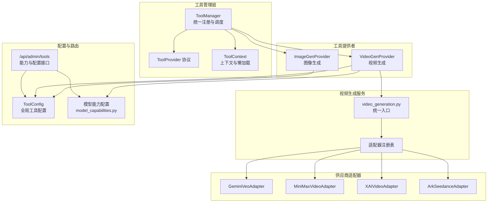
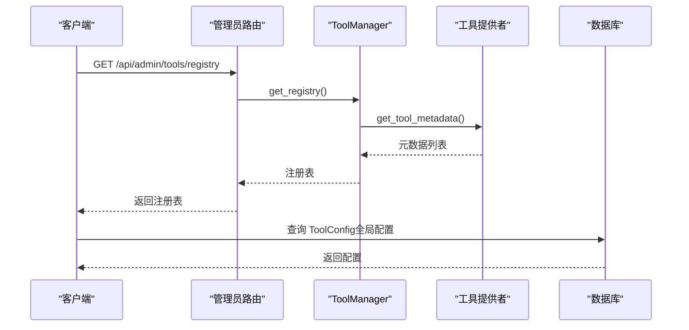
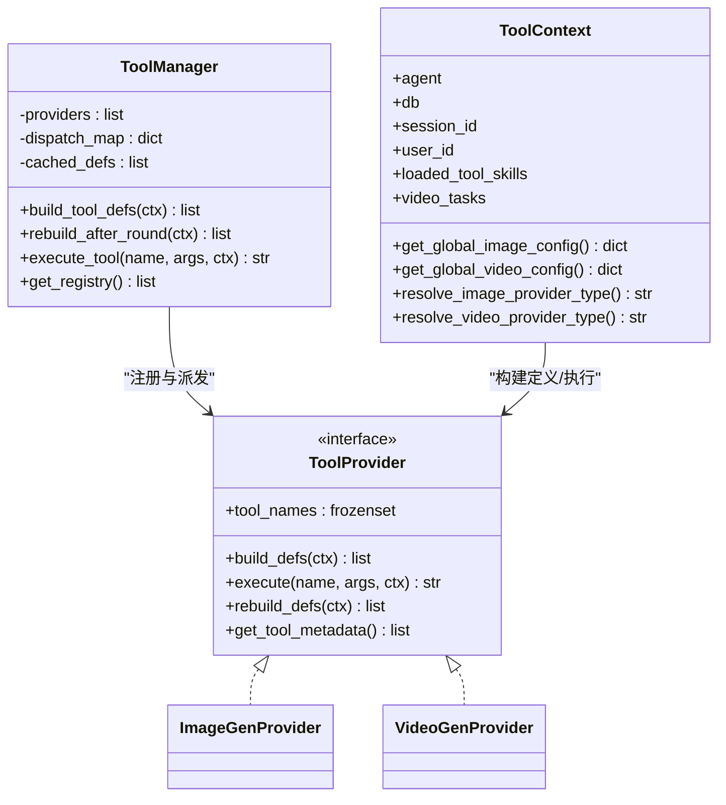
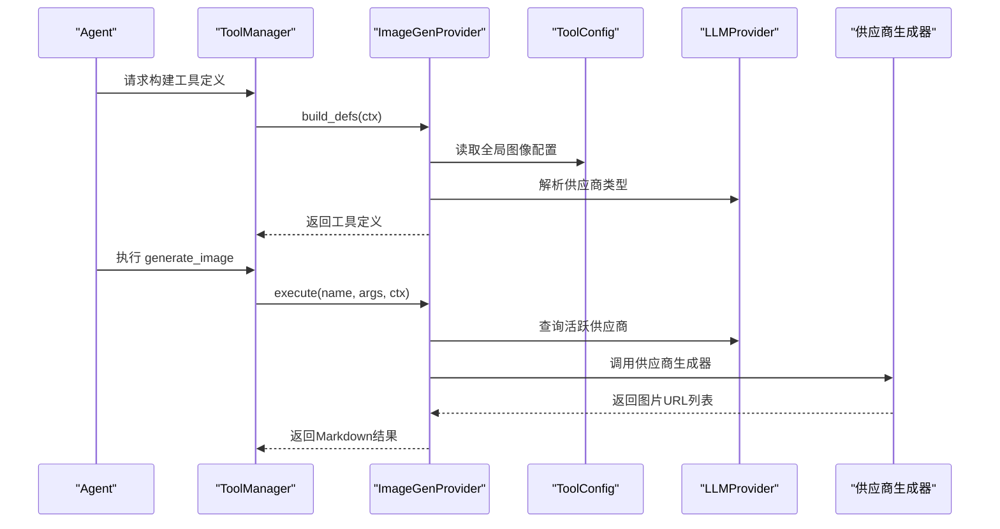
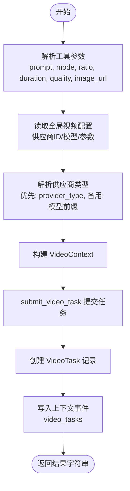
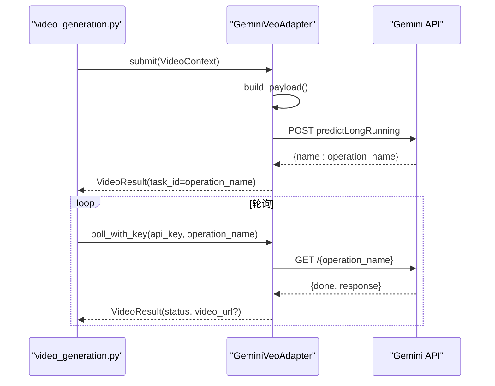
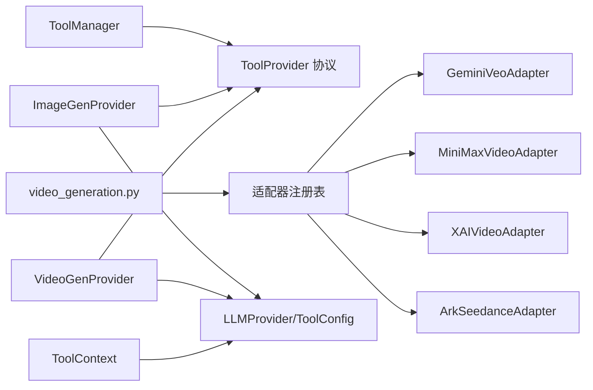

# AI服务集成

<cite>
**本文引用的文件**
- [backend/services/tool_manager/manager.py](file://backend/services/tool_manager/manager.py)
- [backend/services/tool_manager/context.py](file://backend/services/tool_manager/context.py)
- [backend/services/tool_manager/protocol.py](file://backend/services/tool_manager/protocol.py)
- [backend/services/tool_manager/providers/__init__.py](file://backend/services/tool_manager/providers/__init__.py)
- [backend/services/tool_manager/providers/image_gen.py](file://backend/services/tool_manager/providers/image_gen.py)
- [backend/services/tool_manager/providers/video_gen.py](file://backend/services/tool_manager/providers/video_gen.py)
- [backend/services/video_providers/base.py](file://backend/services/video_providers/base.py)
- [backend/services/video_providers/model_capabilities.py](file://backend/services/video_providers/model_capabilities.py)
- [backend/services/video_providers/gemini_provider.py](file://backend/services/video_providers/gemini_provider.py)
- [backend/services/video_generation.py](file://backend/services/video_generation.py)
- [backend/routers/admin_tools.py](file://backend/routers/admin_tools.py)
- [backend/models.py](file://backend/models.py)
</cite>

## 目录
1. [简介](#简介)
2. [项目结构](#项目结构)
3. [核心组件](#核心组件)
4. [架构总览](#架构总览)
5. [详细组件分析](#详细组件分析)
6. [依赖分析](#依赖分析)
7. [性能考虑](#性能考虑)
8. [故障排查指南](#故障排查指南)
9. [结论](#结论)
10. [附录](#附录)

## 简介
本文件面向KunFlix的AI服务集成，系统性阐述多模态AI服务提供商的集成架构与实现细节，涵盖：
- LLM服务提供商（OpenAI、Claude、Gemini、xAI）在工具调用中的角色与适配
- 图像生成、视频生成服务的统一适配与执行流程
- 工具调用机制与ToolManager的管理机制
- 配置管理（全局工具配置、模型能力适配）
- 错误处理策略与性能优化建议
- 如何扩展新的AI服务提供商与配置不同模型参数
- 多模态数据转换与最佳实践

## 项目结构
KunFlix后端采用“服务层 + 适配器 + 统一路由”的分层设计：
- 工具管理层：集中注册与调度工具提供者，按上下文动态生成工具定义
- 视频生成服务：统一入口，按供应商类型选择适配器，完成提交、轮询与下载
- 供应商适配器：封装各平台API差异，屏蔽供应商细节
- 配置与路由：通过数据库与FastAPI路由暴露全局配置与能力查询接口

图表来源
- [backend/services/tool_manager/manager.py:23-108](file://backend/services/tool_manager/manager.py#L23-L108)
- [backend/services/tool_manager/providers/image_gen.py:276-328](file://backend/services/tool_manager/providers/image_gen.py#L276-L328)
- [backend/services/tool_manager/providers/video_gen.py:284-342](file://backend/services/tool_manager/providers/video_gen.py#L284-L342)
- [backend/services/video_generation.py:50-82](file://backend/services/video_generation.py#L50-L82)
- [backend/services/video_providers/model_capabilities.py:28-477](file://backend/services/video_providers/model_capabilities.py#L28-L477)
- [backend/routers/admin_tools.py:29-36](file://backend/routers/admin_tools.py#L29-L36)

章节来源
- [backend/services/tool_manager/manager.py:1-108](file://backend/services/tool_manager/manager.py#L1-L108)
- [backend/services/tool_manager/providers/__init__.py:1-26](file://backend/services/tool_manager/providers/__init__.py#L1-L26)
- [backend/services/video_generation.py:1-180](file://backend/services/video_generation.py#L1-L180)
- [backend/services/video_providers/model_capabilities.py:1-477](file://backend/services/video_providers/model_capabilities.py#L1-L477)
- [backend/routers/admin_tools.py:1-273](file://backend/routers/admin_tools.py#L1-L273)

## 核心组件
- ToolManager：集中注册与调度工具提供者，构建/重建工具定义，按名称派发执行
- ToolProvider协议：定义工具提供者的统一接口（工具名集合、构建定义、执行、重建定义、元数据）
- ToolContext：携带Agent、DB会话、技能状态与懒加载的全局配置解析
- VideoGeneration统一入口：根据供应商类型选择适配器，提交/轮询任务
- VideoProviderAdapter基类：定义视频生成适配器的抽象接口与通用上下文/结果
- 模型能力配置：按模型维度定义支持的参数与能力，驱动工具参数枚举
- 管理员路由：暴露工具注册表、使用统计、执行日志、能力查询与全局配置管理

章节来源
- [backend/services/tool_manager/manager.py:23-108](file://backend/services/tool_manager/manager.py#L23-L108)
- [backend/services/tool_manager/protocol.py:11-44](file://backend/services/tool_manager/protocol.py#L11-L44)
- [backend/services/tool_manager/context.py:35-146](file://backend/services/tool_manager/context.py#L35-L146)
- [backend/services/video_generation.py:90-126](file://backend/services/video_generation.py#L90-L126)
- [backend/services/video_providers/base.py:15-121](file://backend/services/video_providers/base.py#L15-L121)
- [backend/services/video_providers/model_capabilities.py:28-477](file://backend/services/video_providers/model_capabilities.py#L28-L477)
- [backend/routers/admin_tools.py:29-273](file://backend/routers/admin_tools.py#L29-L273)

## 架构总览
KunFlix的AI服务集成采用“协议 + 适配器 + 统一入口”的架构：
- 工具层：ToolManager负责工具提供者的生命周期与派发；ToolProvider协议约束实现；ToolContext贯穿执行期上下文
- 供应商层：VideoProviderAdapter抽象统一视频生成接口；具体适配器封装供应商API差异
- 服务层：video_generation.py作为统一入口，按供应商类型路由至对应适配器
- 配置层：ToolConfig表承载全局工具配置；模型能力配置驱动工具参数枚举
- 管理层：FastAPI路由提供能力查询、配置管理与执行统计

图表来源
- [backend/routers/admin_tools.py:29-36](file://backend/routers/admin_tools.py#L29-L36)
- [backend/services/tool_manager/manager.py:96-108](file://backend/services/tool_manager/manager.py#L96-L108)
- [backend/services/tool_manager/providers/image_gen.py:318-328](file://backend/services/tool_manager/providers/image_gen.py#L318-L328)
- [backend/services/tool_manager/providers/video_gen.py:332-342](file://backend/services/tool_manager/providers/video_gen.py#L332-L342)

## 详细组件分析

### 工具管理与执行（ToolManager）
- 注册与派发：ToolManager在初始化时从注册表加载所有工具提供者，构建名称到提供者的映射，实现O(1)派发
- 定义构建：按上下文动态构建工具定义，支持在一轮工具调用后按需重建
- 执行流程：按工具名查找提供者并执行，返回字符串结果；未知工具返回错误提示

图表来源
- [backend/services/tool_manager/manager.py:23-108](file://backend/services/tool_manager/manager.py#L23-L108)
- [backend/services/tool_manager/protocol.py:11-44](file://backend/services/tool_manager/protocol.py#L11-L44)
- [backend/services/tool_manager/context.py:35-146](file://backend/services/tool_manager/context.py#L35-L146)
- [backend/services/tool_manager/providers/image_gen.py:276-328](file://backend/services/tool_manager/providers/image_gen.py#L276-L328)
- [backend/services/tool_manager/providers/video_gen.py:284-342](file://backend/services/tool_manager/providers/video_gen.py#L284-L342)

章节来源
- [backend/services/tool_manager/manager.py:23-108](file://backend/services/tool_manager/manager.py#L23-L108)
- [backend/services/tool_manager/protocol.py:11-44](file://backend/services/tool_manager/protocol.py#L11-L44)
- [backend/services/tool_manager/context.py:35-146](file://backend/services/tool_manager/context.py#L35-L146)

### 图像生成工具（ImageGenProvider）
- 工具定义：根据当前供应商能力动态生成参数枚举（如宽高比、数量范围等）
- 供应商适配：通过配置映射到不同供应商的批量生成接口（xAI、Gemini、Ark）
- 执行流程：解析全局配置与工具参数，选择供应商与模型，调用对应生成器，返回Markdown图片链接

图表来源
- [backend/services/tool_manager/providers/image_gen.py:276-328](file://backend/services/tool_manager/providers/image_gen.py#L276-L328)
- [backend/services/tool_manager/providers/image_gen.py:203-270](file://backend/services/tool_manager/providers/image_gen.py#L203-L270)
- [backend/routers/admin_tools.py:228-273](file://backend/routers/admin_tools.py#L228-L273)

章节来源
- [backend/services/tool_manager/providers/image_gen.py:58-105](file://backend/services/tool_manager/providers/image_gen.py#L58-L105)
- [backend/services/tool_manager/providers/image_gen.py:129-196](file://backend/services/tool_manager/providers/image_gen.py#L129-L196)
- [backend/services/tool_manager/providers/image_gen.py:203-270](file://backend/services/tool_manager/providers/image_gen.py#L203-L270)

### 视频生成工具（VideoGenProvider）
- 工具定义：基于模型能力配置动态生成参数枚举（模式、时长、分辨率、宽高比等）
- 执行流程：解析全局配置与工具参数，构造VideoContext，提交任务，持久化VideoTask，返回任务ID与提示信息
- 本地媒体处理：将本地相对路径转换为data URI，满足供应商API要求

图表来源
- [backend/services/tool_manager/providers/video_gen.py:174-278](file://backend/services/tool_manager/providers/video_gen.py#L174-L278)
- [backend/services/video_generation.py:90-126](file://backend/services/video_generation.py#L90-L126)
- [backend/services/video_providers/base.py:15-54](file://backend/services/video_providers/base.py#L15-L54)

章节来源
- [backend/services/tool_manager/providers/video_gen.py:77-155](file://backend/services/tool_manager/providers/video_gen.py#L77-L155)
- [backend/services/tool_manager/providers/video_gen.py:174-278](file://backend/services/tool_manager/providers/video_gen.py#L174-L278)
- [backend/services/video_generation.py:90-126](file://backend/services/video_generation.py#L90-L126)

### 视频生成适配器（以Gemini为例）
- 提交任务：构建payload，调用供应商API提交长耗时任务，返回operation_name作为任务ID
- 轮询状态：通过operation_name轮询任务状态，完成后提取视频URL
- 数据URI处理：自动识别data URI与HTTP URL，避免不兼容格式
- 错误处理：捕获异常并返回失败状态，记录日志

图表来源
- [backend/services/video_generation.py:90-126](file://backend/services/video_generation.py#L90-L126)
- [backend/services/video_providers/gemini_provider.py:100-167](file://backend/services/video_providers/gemini_provider.py#L100-L167)
- [backend/services/video_providers/gemini_provider.py:277-321](file://backend/services/video_providers/gemini_provider.py#L277-L321)

章节来源
- [backend/services/video_providers/gemini_provider.py:42-357](file://backend/services/video_providers/gemini_provider.py#L42-L357)
- [backend/services/video_providers/base.py:56-121](file://backend/services/video_providers/base.py#L56-L121)

### 模型能力配置与参数枚举
- 能力表：按模型维度定义支持的模式、时长、分辨率、宽高比、参考图片/扩展/编辑等能力
- 工具参数：工具定义的枚举值根据模型能力动态生成，确保参数合法
- 供应商能力：图像生成与视频生成分别维护能力字典，驱动前端与后端参数校验

章节来源
- [backend/services/video_providers/model_capabilities.py:28-477](file://backend/services/video_providers/model_capabilities.py#L28-L477)
- [backend/services/tool_manager/providers/image_gen.py:58-105](file://backend/services/tool_manager/providers/image_gen.py#L58-L105)
- [backend/services/tool_manager/providers/video_gen.py:77-155](file://backend/services/tool_manager/providers/video_gen.py#L77-L155)

### 配置管理与全局工具配置
- ToolConfig：存储工具级别的全局配置（如启用开关、默认供应商ID、模型与参数）
- 管理路由：提供查询、更新工具配置的接口；同时暴露图像/视频供应商能力查询
- 上下文解析：ToolContext懒加载解析全局配置，减少重复查询

章节来源
- [backend/routers/admin_tools.py:218-273](file://backend/routers/admin_tools.py#L218-L273)
- [backend/services/tool_manager/context.py:87-145](file://backend/services/tool_manager/context.py#L87-L145)
- [backend/models.py:152-176](file://backend/models.py#L152-L176)

## 依赖分析
- 组件耦合
  - ToolManager与ToolProvider：通过协议解耦，新增提供者只需实现协议
  - VideoGeneration与适配器：通过注册表解耦，新增供应商只需注册适配器类
  - ToolContext与数据库：懒加载解析全局配置，避免重复访问
- 外部依赖
  - httpx：异步HTTP客户端，用于供应商API调用
  - SQLAlchemy：ORM访问数据库，读取LLMProvider与ToolConfig

图表来源
- [backend/services/tool_manager/manager.py:23-108](file://backend/services/tool_manager/manager.py#L23-L108)
- [backend/services/tool_manager/providers/__init__.py:10-25](file://backend/services/tool_manager/providers/__init__.py#L10-L25)
- [backend/services/video_generation.py:50-82](file://backend/services/video_generation.py#L50-L82)

章节来源
- [backend/services/tool_manager/manager.py:23-108](file://backend/services/tool_manager/manager.py#L23-L108)
- [backend/services/video_generation.py:50-82](file://backend/services/video_generation.py#L50-L82)

## 性能考虑
- 工具定义缓存：ToolManager缓存工具定义，仅在必要时重建，降低重复构建开销
- 懒加载配置：ToolContext缓存全局配置与供应商类型解析结果，减少数据库访问
- 异步I/O：供应商API调用使用httpx异步客户端，提升并发性能
- 参数枚举裁剪：基于模型能力裁剪工具参数枚举，减少无效请求
- 本地媒体内联：将本地媒体转换为data URI，避免二次网络请求

## 故障排查指南
- 工具不可用
  - 检查全局配置：确认工具已启用且供应商ID有效
  - 检查技能门控：若相关技能未加载，工具定义可能为空
- 供应商调用失败
  - 查看执行日志：通过管理员路由查询工具执行日志，定位错误原因
  - 核对模型能力：确认所选模型支持相应参数与模式
- 视频生成长时间Pending
  - 检查轮询逻辑：确认轮询次数与失败阈值设置合理
  - 核对供应商限制：如分辨率与时长约束，确保参数符合供应商要求

章节来源
- [backend/routers/admin_tools.py:135-187](file://backend/routers/admin_tools.py#L135-L187)
- [backend/services/video_generation.py:87-126](file://backend/services/video_generation.py#L87-L126)
- [backend/services/video_providers/gemini_provider.py:277-321](file://backend/services/video_providers/gemini_provider.py#L277-L321)

## 结论
KunFlix的AI服务集成为多模态场景提供了清晰、可扩展的架构：
- 通过ToolManager与ToolProvider协议实现工具层的统一与解耦
- 通过VideoGeneration与适配器实现供应商层的统一与扩展
- 通过模型能力配置与全局配置管理实现参数与能力的动态适配
- 通过管理员路由与日志体系实现可观测性与运维能力

该架构便于新增供应商与工具，同时保证了工具调用的稳定性与可维护性。

## 附录
- 扩展新供应商
  - 新增适配器：实现VideoProviderAdapter抽象方法，注册到video_generation.py的适配器注册表
  - 新增工具提供者：实现ToolProvider协议，加入providers注册表
  - 配置能力：在模型能力配置中补充新模型的能力项
- 配置模型参数
  - 在ToolConfig中设置全局默认参数（如供应商ID、模型、质量与时长）
  - 在Agent级别开启相应工具开关
- 多模态数据转换
  - 图像/视频URL自动识别data URI与HTTP URL，确保供应商API兼容
  - 本地媒体路径转换为内联编码，避免远程访问问题