# AI服务集成

<cite>
**本文引用的文件**
- [backend/services/llm_stream.py](file://backend/services/llm_stream.py)
- [backend/services/image_config_adapter.py](file://backend/services/image_config_adapter.py)
- [backend/services/chat_generation.py](file://backend/services/chat_generation.py)
- [backend/admin/src/components/admin/agents/AgentForm/Tools/MCPClients.tsx](file://backend/admin/src/components/admin/agents/AgentForm/Tools/MCPClients.tsx)
- [backend/routers/admin_debug.py](file://backend/routers/admin_debug.py)
- [backend/services/tool_manager/manager.py](file://backend/services/tool_manager/manager.py)
- [backend/services/tool_manager/context.py](file://backend/services/tool_manager/context.py)
- [backend/services/tool_manager/protocol.py](file://backend/services/tool_manager/protocol.py)
- [backend/services/tool_manager/providers/__init__.py](file://backend/services/tool_manager/providers/__init__.py)
- [backend/services/tool_manager/providers/image_gen.py](file://backend/services/tool_manager/providers/image_gen.py)
- [backend/services/tool_manager/providers/image_edit.py](file://backend/services/tool_manager/providers/image_edit.py)
- [backend/services/tool_manager/providers/video_gen.py](file://backend/services/tool_manager/providers/video_gen.py)
- [backend/services/tool_manager/providers/video_edit.py](file://backend/services/tool_manager/providers/video_edit.py)
- [backend/services/tool_manager/providers/canvas.py](file://backend/services/tool_manager/providers/canvas.py)
- [backend/services/video_providers/base.py](file://backend/services/video_providers/base.py)
- [backend/services/video_providers/model_capabilities.py](file://backend/services/video_providers/model_capabilities.py)
- [backend/services/video_providers/gemini_provider.py](file://backend/services/video_providers/gemini_provider.py)
- [backend/services/video_generation.py](file://backend/services/video_generation.py)
- [backend/routers/admin_tools.py](file://backend/routers/admin_tools.py)
- [backend/models.py](file://backend/models.py)
</cite>

## 更新摘要
**变更内容**
- 增强LLM流式服务的思维模式检测算法，改进Gemini思考内容识别准确性
- 优化图像配置适配器，支持思维模式到thinking_level的自动映射
- 为聊天生成服务添加思维标签调试功能，便于问题排查
- 完善MCPClients管理机制，支持MCP客户端配置

## 目录
1. [简介](#简介)
2. [项目结构](#项目结构)
3. [核心组件](#核心组件)
4. [架构总览](#架构总览)
5. [详细组件分析](#详细组件分析)
6. [依赖分析](#依赖分析)
7. [性能考虑](#性能考虑)
8. [故障排查指南](#故障排查指南)
9. [结论](#结论)
10. [附录](#附录)

## 简介
本文件面向KunFlix的AI服务集成，系统性阐述多模态AI服务提供商的集成架构与实现细节，涵盖：
- LLM服务提供商（OpenAI、Claude、Gemini、xAI）在工具调用中的角色与适配
- 图像生成、图像编辑、视频生成、视频编辑、画布节点管理等工具的统一管理机制
- 工具调用机制与ToolManager的管理机制
- 配置管理（全局工具配置、模型能力适配）
- 错误处理策略与性能优化建议
- 如何扩展新的AI服务提供商与配置不同模型参数
- 多模态数据转换与最佳实践

**更新** 增强了思维模式检测算法和调试功能，优化了图像配置适配器的思维模式集成。

## 项目结构
KunFlix后端采用"服务层 + 适配器 + 统一路由"的分层设计：
- 工具管理层：集中注册与调度工具提供者，按上下文动态生成工具定义
- 视频生成服务：统一入口，按供应商类型选择适配器，完成提交、轮询与下载
- 供应商适配器：封装各平台API差异，屏蔽供应商细节
- 配置与路由：通过数据库与FastAPI路由暴露全局配置与能力查询接口

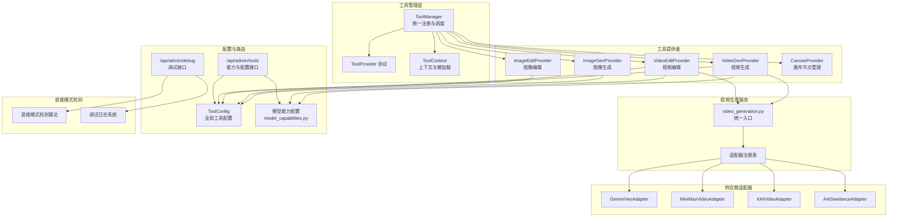

**图表来源**
- [backend/services/tool_manager/manager.py:23-108](file://backend/services/tool_manager/manager.py#L23-L108)
- [backend/services/tool_manager/providers/__init__.py:10-25](file://backend/services/tool_manager/providers/__init__.py#L10-L25)
- [backend/services/tool_manager/providers/image_gen.py:276-328](file://backend/services/tool_manager/providers/image_gen.py#L276-L328)
- [backend/services/tool_manager/providers/image_edit.py:524-581](file://backend/services/tool_manager/providers/image_edit.py#L524-L581)
- [backend/services/tool_manager/providers/video_gen.py:284-342](file://backend/services/tool_manager/providers/video_gen.py#L284-L342)
- [backend/services/tool_manager/providers/video_edit.py:228-286](file://backend/services/tool_manager/providers/video_edit.py#L228-L286)
- [backend/services/tool_manager/providers/canvas.py:513-563](file://backend/services/tool_manager/providers/canvas.py#L513-L563)
- [backend/services/video_generation.py:50-82](file://backend/services/video_generation.py#L50-L82)
- [backend/services/video_providers/model_capabilities.py:28-477](file://backend/services/video_providers/model_capabilities.py#L28-L477)
- [backend/routers/admin_tools.py:29-36](file://backend/routers/admin_tools.py#L29-L36)
- [backend/routers/admin_debug.py:43-47](file://backend/routers/admin_debug.py#L43-L47)

**章节来源**
- [backend/services/tool_manager/manager.py:1-108](file://backend/services/tool_manager/manager.py#L1-L108)
- [backend/services/tool_manager/providers/__init__.py:1-26](file://backend/services/tool_manager/providers/__init__.py#L1-L26)
- [backend/services/video_generation.py:1-180](file://backend/services/video_generation.py#L1-L180)
- [backend/services/video_providers/model_capabilities.py:1-477](file://backend/services/video_providers/model_capabilities.py#L1-L477)
- [backend/routers/admin_tools.py:1-273](file://backend/routers/admin_tools.py#L1-L273)
- [backend/routers/admin_debug.py:1-594](file://backend/routers/admin_debug.py#L1-L594)

## 核心组件
- ToolManager：集中注册与调度工具提供者，构建/重建工具定义，按名称派发执行
- ToolProvider协议：定义工具提供者的统一接口（工具名集合、构建定义、执行、重建定义、元数据）
- ToolContext：携带Agent、DB会话、技能状态与懒加载的全局配置解析
- VideoGeneration统一入口：根据供应商类型选择适配器，提交/轮询任务
- VideoProviderAdapter基类：定义视频生成适配器的抽象接口与通用上下文/结果
- 模型能力配置：按模型维度定义支持的参数与能力，驱动工具参数枚举
- 管理员路由：暴露工具注册表、使用统计、执行日志、能力查询与全局配置管理
- 思维模式检测：增强的思考内容识别算法，支持多供应商的思维模式
- 图像配置适配器：统一图像配置到各供应商特定配置的转换器

**更新** 新增思维模式检测和图像配置适配器功能。

**章节来源**
- [backend/services/tool_manager/manager.py:23-108](file://backend/services/tool_manager/manager.py#L23-L108)
- [backend/services/tool_manager/protocol.py:11-44](file://backend/services/tool_manager/protocol.py#L11-L44)
- [backend/services/tool_manager/context.py:35-146](file://backend/services/tool_manager/context.py#L35-L146)
- [backend/services/video_generation.py:90-126](file://backend/services/video_generation.py#L90-L126)
- [backend/services/video_providers/base.py:15-121](file://backend/services/video_providers/base.py#L15-L121)
- [backend/services/video_providers/model_capabilities.py:28-477](file://backend/services/video_providers/model_capabilities.py#L28-L477)
- [backend/routers/admin_tools.py:29-273](file://backend/routers/admin_tools.py#L29-L273)
- [backend/services/llm_stream.py:1016-1073](file://backend/services/llm_stream.py#L1016-L1073)
- [backend/services/image_config_adapter.py:187-279](file://backend/services/image_config_adapter.py#L187-L279)

## 架构总览
KunFlix的AI服务集成采用"协议 + 适配器 + 统一入口"的架构：
- 工具层：ToolManager负责工具提供者的生命周期与派发；ToolProvider协议约束实现；ToolContext贯穿执行期上下文
- 供应商层：VideoProviderAdapter抽象统一视频生成接口；具体适配器封装供应商API差异
- 服务层：video_generation.py作为统一入口，按供应商类型路由至对应适配器
- 配置层：ToolConfig表承载全局工具配置；模型能力配置驱动工具参数枚举
- 管理层：FastAPI路由提供能力查询、配置管理与执行统计
- 思维模式层：增强的思维模式检测算法，支持多供应商的思考内容识别

**更新** 新增思维模式检测架构。

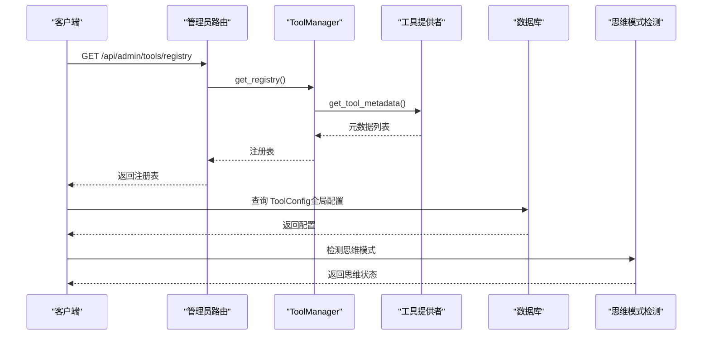

**图表来源**
- [backend/routers/admin_tools.py:29-36](file://backend/routers/admin_tools.py#L29-L36)
- [backend/services/tool_manager/manager.py:96-108](file://backend/services/tool_manager/manager.py#L96-L108)
- [backend/services/tool_manager/providers/image_gen.py:318-328](file://backend/services/tool_manager/providers/image_gen.py#L318-L328)
- [backend/services/tool_manager/providers/image_edit.py:571-581](file://backend/services/tool_manager/providers/image_edit.py#L571-L581)
- [backend/services/tool_manager/providers/video_gen.py:332-342](file://backend/services/tool_manager/providers/video_gen.py#L332-L342)
- [backend/services/tool_manager/providers/video_edit.py:276-286](file://backend/services/tool_manager/providers/video_edit.py#L276-L286)
- [backend/services/llm_stream.py:944-966](file://backend/services/llm_stream.py#L944-L966)

## 详细组件分析

### 工具管理与执行（ToolManager）
- 注册与派发：ToolManager在初始化时从注册表加载所有工具提供者，构建名称到提供者的映射，实现O(1)派发
- 定义构建：按上下文动态构建工具定义，支持在一轮工具调用后按需重建
- 执行流程：按工具名查找提供者并执行，返回字符串结果；未知工具返回错误提示

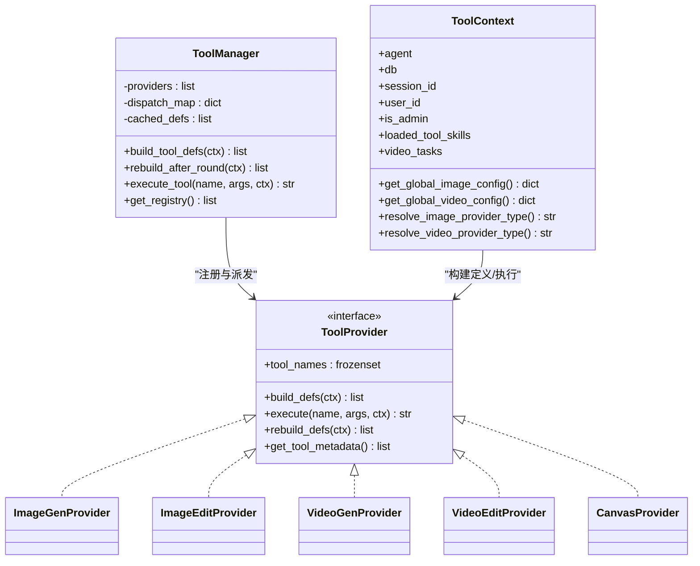

**图表来源**
- [backend/services/tool_manager/manager.py:23-108](file://backend/services/tool_manager/manager.py#L23-L108)
- [backend/services/tool_manager/protocol.py:11-44](file://backend/services/tool_manager/protocol.py#L11-L44)
- [backend/services/tool_manager/context.py:35-146](file://backend/services/tool_manager/context.py#L35-L146)
- [backend/services/tool_manager/providers/image_gen.py:276-328](file://backend/services/tool_manager/providers/image_gen.py#L276-L328)
- [backend/services/tool_manager/providers/image_edit.py:524-581](file://backend/services/tool_manager/providers/image_edit.py#L524-L581)
- [backend/services/tool_manager/providers/video_gen.py:284-342](file://backend/services/tool_manager/providers/video_gen.py#L284-L342)
- [backend/services/tool_manager/providers/video_edit.py:228-286](file://backend/services/tool_manager/providers/video_edit.py#L228-L286)
- [backend/services/tool_manager/providers/canvas.py:513-563](file://backend/services/tool_manager/providers/canvas.py#L513-L563)

**章节来源**
- [backend/services/tool_manager/manager.py:23-108](file://backend/services/tool_manager/manager.py#L23-L108)
- [backend/services/tool_manager/protocol.py:11-44](file://backend/services/tool_manager/protocol.py#L11-L44)
- [backend/services/tool_manager/context.py:35-146](file://backend/services/tool_manager/context.py#L35-L146)

### 图像生成工具（ImageGenProvider）
- 工具定义：根据当前供应商能力动态生成参数枚举（如宽高比、数量范围等）
- 供应商适配：通过配置映射到不同供应商的批量生成接口（xAI、Gemini、Ark）
- 执行流程：解析全局配置与工具参数，选择供应商与模型，调用对应生成器，返回Markdown图片链接

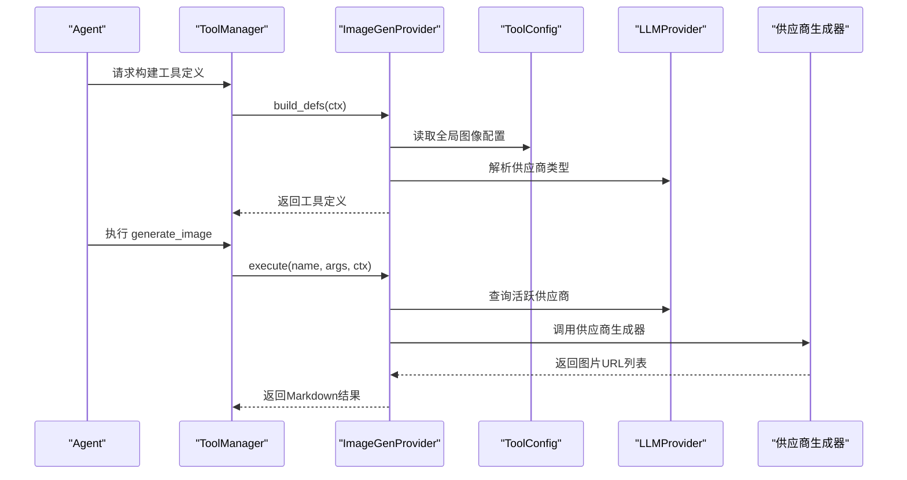

**图表来源**
- [backend/services/tool_manager/providers/image_gen.py:276-328](file://backend/services/tool_manager/providers/image_gen.py#L276-L328)
- [backend/services/tool_manager/providers/image_gen.py:203-270](file://backend/services/tool_manager/providers/image_gen.py#L203-L270)
- [backend/routers/admin_tools.py:228-273](file://backend/routers/admin_tools.py#L228-L273)

**章节来源**
- [backend/services/tool_manager/providers/image_gen.py:58-105](file://backend/services/tool_manager/providers/image_gen.py#L58-L105)
- [backend/services/tool_manager/providers/image_gen.py:129-196](file://backend/services/tool_manager/providers/image_gen.py#L129-L196)
- [backend/services/tool_manager/providers/image_gen.py:203-270](file://backend/services/tool_manager/providers/image_gen.py#L203-L270)

### 图像编辑工具（ImageEditProvider）
- 工具定义：基于图像生成能力配置动态生成参数枚举（支持的宽高比、质量等级等）
- 执行流程：解析全局配置与工具参数，处理多种图像URL格式（data URI、HTTP URL、本地路径），调用对应供应商编辑接口
- 画布集成：成功编辑后自动创建新节点并连接到源节点，保留原始图像不变

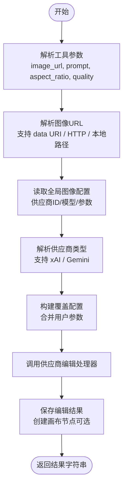

**图表来源**
- [backend/services/tool_manager/providers/image_edit.py:435-518](file://backend/services/tool_manager/providers/image_edit.py#L435-L518)
- [backend/services/tool_manager/providers/image_edit.py:167-178](file://backend/services/tool_manager/providers/image_edit.py#L167-L178)
- [backend/services/tool_manager/providers/image_edit.py:338-342](file://backend/services/tool_manager/providers/image_edit.py#L338-L342)

**章节来源**
- [backend/services/tool_manager/providers/image_edit.py:109-164](file://backend/services/tool_manager/providers/image_edit.py#L109-L164)
- [backend/services/tool_manager/providers/image_edit.py:171-187](file://backend/services/tool_manager/providers/image_edit.py#L171-L187)
- [backend/services/tool_manager/providers/image_edit.py:338-342](file://backend/services/tool_manager/providers/image_edit.py#L338-L342)

### 视频生成工具（VideoGenProvider）
- 工具定义：基于模型能力配置动态生成参数枚举（模式、时长、分辨率、宽高比等）
- 执行流程：解析全局配置与工具参数，构造VideoContext，提交任务，持久化VideoTask，返回任务ID与提示信息
- 本地媒体处理：将本地相对路径转换为data URI，满足供应商API要求

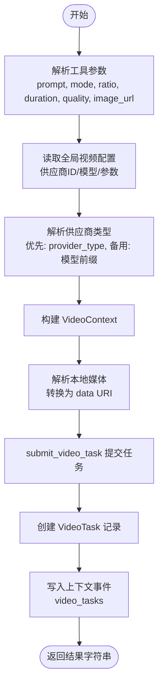

**图表来源**
- [backend/services/tool_manager/providers/video_gen.py:174-278](file://backend/services/tool_manager/providers/video_gen.py#L174-L278)
- [backend/services/video_generation.py:90-126](file://backend/services/video_generation.py#L90-L126)
- [backend/services/video_providers/base.py:15-54](file://backend/services/video_providers/base.py#L15-L54)

**章节来源**
- [backend/services/tool_manager/providers/video_gen.py:77-155](file://backend/services/tool_manager/providers/video_gen.py#L77-L155)
- [backend/services/tool_manager/providers/video_gen.py:174-278](file://backend/services/tool_manager/providers/video_gen.py#L174-L278)
- [backend/services/video_generation.py:90-126](file://backend/services/video_generation.py#L90-L126)

### 视频编辑工具（VideoEditProvider）
- 工具定义：基于模型能力配置动态生成参数枚举（支持编辑/扩展模式）
- 执行流程：解析全局配置与工具参数，构造VideoContext（编辑模式使用image_url，扩展模式使用extension_video_url），提交任务并持久化
- 模式映射：edit模式对应video_mode="edit"，extend模式对应video_mode="video_extension"

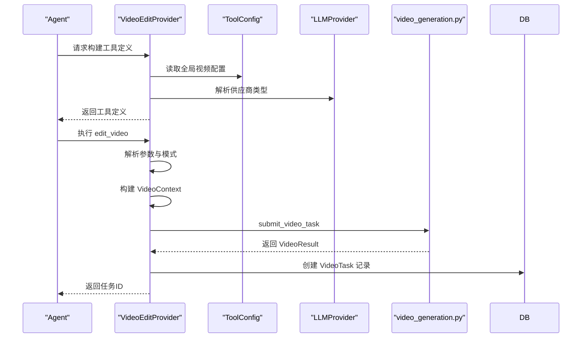

**图表来源**
- [backend/services/tool_manager/providers/video_edit.py:228-286](file://backend/services/tool_manager/providers/video_edit.py#L228-L286)
- [backend/services/tool_manager/providers/video_edit.py:128-222](file://backend/services/tool_manager/providers/video_edit.py#L128-L222)
- [backend/services/video_generation.py:90-126](file://backend/services/video_generation.py#L90-L126)

**章节来源**
- [backend/services/tool_manager/providers/video_edit.py:51-109](file://backend/services/tool_manager/providers/video_edit.py#L51-L109)
- [backend/services/tool_manager/providers/video_edit.py:128-222](file://backend/services/tool_manager/providers/video_edit.py#L128-L222)
- [backend/services/tool_manager/providers/video_edit.py:228-286](file://backend/services/tool_manager/providers/video_edit.py#L228-L286)

### 画布节点管理工具（CanvasProvider）
- 工具定义：基于目标节点类型动态生成参数枚举（支持text、image、video、storyboard四种类型）
- 执行流程：提供节点的增删改查操作，支持自动布局和尺寸估算
- 权限控制：根据技能加载状态和代理配置决定可用节点类型

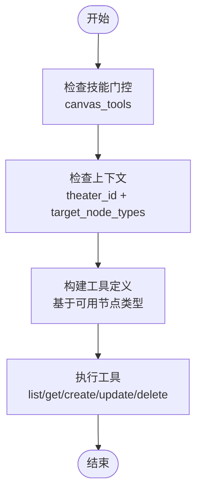

**图表来源**
- [backend/services/tool_manager/providers/canvas.py:513-563](file://backend/services/tool_manager/providers/canvas.py#L513-L563)
- [backend/services/tool_manager/providers/canvas.py:532-546](file://backend/services/tool_manager/providers/canvas.py#L532-L546)

**章节来源**
- [backend/services/tool_manager/providers/canvas.py:126-246](file://backend/services/tool_manager/providers/canvas.py#L126-L246)
- [backend/services/tool_manager/providers/canvas.py:532-546](file://backend/services/tool_manager/providers/canvas.py#L532-L546)

### 视频生成适配器（以Gemini为例）
- 提交任务：构建payload，调用供应商API提交长耗时任务，返回operation_name作为任务ID
- 轮询状态：通过operation_name轮询任务状态，完成后提取视频URL
- 数据URI处理：自动识别data URI与HTTP URL，避免不兼容格式
- 错误处理：捕获异常并返回失败状态，记录日志

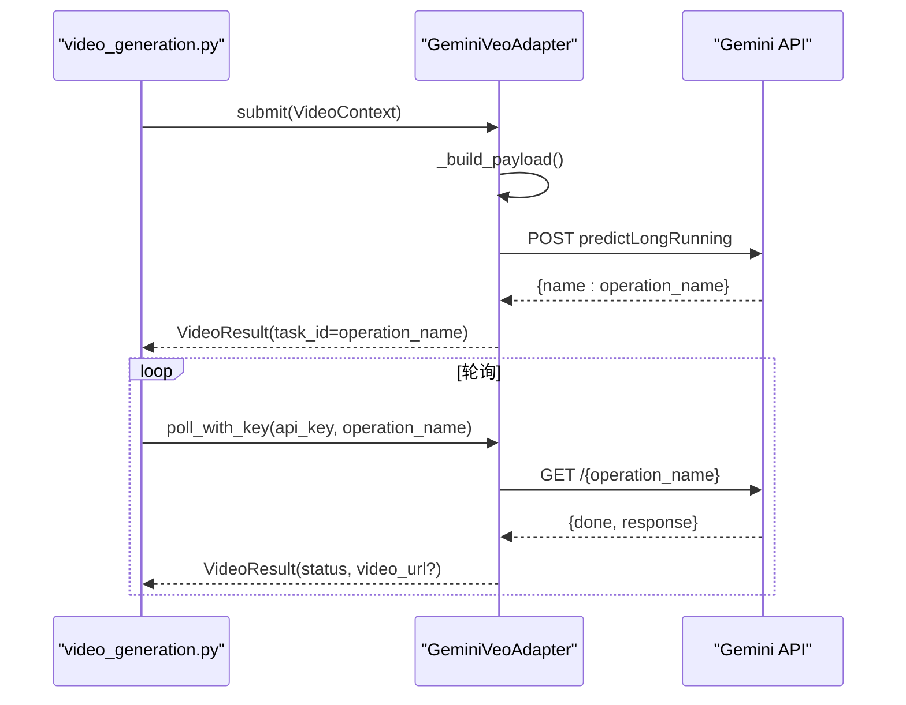

**图表来源**
- [backend/services/video_generation.py:90-126](file://backend/services/video_generation.py#L90-L126)
- [backend/services/video_providers/gemini_provider.py:100-167](file://backend/services/video_providers/gemini_provider.py#L100-L167)
- [backend/services/video_providers/gemini_provider.py:277-321](file://backend/services/video_providers/gemini_provider.py#L277-L321)

**章节来源**
- [backend/services/video_providers/gemini_provider.py:42-357](file://backend/services/video_providers/gemini_provider.py#L42-L357)
- [backend/services/video_providers/base.py:56-121](file://backend/services/video_providers/base.py#L56-L121)

### 模型能力配置与参数枚举
- 能力表：按模型维度定义支持的模式、时长、分辨率、宽高比、参考图片/扩展/编辑等能力
- 工具参数：工具定义的枚举值根据模型能力动态生成，确保参数合法
- 供应商能力：图像生成与视频生成分别维护能力字典，驱动前端与后端参数校验

**章节来源**
- [backend/services/video_providers/model_capabilities.py:28-477](file://backend/services/video_providers/model_capabilities.py#L28-L477)
- [backend/services/tool_manager/providers/image_gen.py:58-105](file://backend/services/tool_manager/providers/image_gen.py#L58-L105)
- [backend/services/tool_manager/providers/video_gen.py:77-155](file://backend/services/tool_manager/providers/video_gen.py#L77-L155)
- [backend/services/tool_manager/providers/video_edit.py:51-109](file://backend/services/tool_manager/providers/video_edit.py#L51-L109)

### 配置管理与全局工具配置
- ToolConfig：存储工具级别的全局配置（如启用开关、默认供应商ID、模型与参数）
- 管理路由：提供查询、更新工具配置的接口；同时暴露图像/视频供应商能力查询
- 上下文解析：ToolContext懒加载解析全局配置，减少重复查询

**章节来源**
- [backend/routers/admin_tools.py:218-273](file://backend/routers/admin_tools.py#L218-L273)
- [backend/services/tool_manager/context.py:87-145](file://backend/services/tool_manager/context.py#L87-L145)
- [backend/models.py:152-176](file://backend/models.py#L152-L176)

### 思维模式检测与调试增强

**更新** 新增思维模式检测算法改进和调试功能。

#### 增强的思维模式检测算法
- **Gemini思考内容识别**：改进了raw_thought状态检测逻辑，能够准确识别思考状态的开始和结束
- **状态转换映射**：使用THINK_TRANSITIONS映射表处理思考状态的转换，包括进入思考和退出思考的前缀
- **智能状态推断**：当raw_thought为None时，通过文本特征推断思考状态，如检查文本是否以Markdown标题开头
- **调试日志系统**：详细的日志记录每个part的思考状态转换，便于问题排查

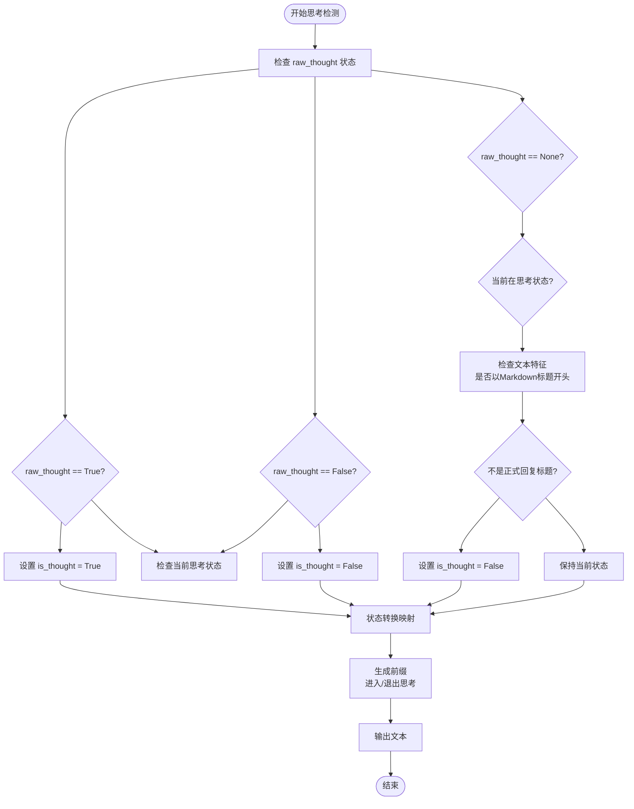

**图表来源**
- [backend/services/llm_stream.py:944-966](file://backend/services/llm_stream.py#L944-L966)
- [backend/services/llm_stream.py:930-933](file://backend/services/llm_stream.py#L930-L933)

#### 图像配置适配器的思维模式集成
- **思维模式到thinking_level映射**：在resolve_image_configs和resolve_global_image_configs中自动处理思维模式到thinking_level的转换
- **向后兼容处理**：当thinking_mode为True但没有设置thinking_level时，自动设置为"high"
- **配置合并策略**：将适配后的图像配置与现有配置合并，保留非图像字段

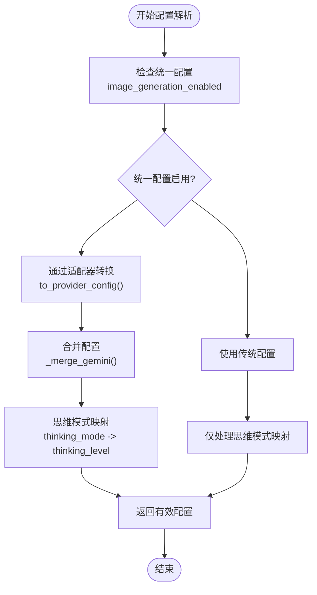

**图表来源**
- [backend/services/image_config_adapter.py:187-216](file://backend/services/image_config_adapter.py#L187-L216)
- [backend/services/image_config_adapter.py:219-257](file://backend/services/image_config_adapter.py#L219-L257)
- [backend/services/image_config_adapter.py:260-278](file://backend/services/image_config_adapter.py#L260-L278)

#### 聊天生成服务的思维标签调试功能
- **思维标签检查**：在聊天生成完成后检查响应内容是否包含思维标签
- **调试日志输出**：记录思维标签的存在状态，便于验证思维模式检测效果
- **完整响应调试**：记录完整的响应内容末尾，帮助排查思维标签问题

**章节来源**
- [backend/services/llm_stream.py:944-1007](file://backend/services/llm_stream.py#L944-L1007)
- [backend/services/image_config_adapter.py:187-279](file://backend/services/image_config_adapter.py#L187-L279)
- [backend/services/chat_generation.py:336-340](file://backend/services/chat_generation.py#L336-L340)

### MCPClients管理机制

**更新** 新增MCPClients管理功能。

#### MCP客户端配置管理
- **客户端选项**：支持本地SQLite数据库查询和远程天气数据查询等MCP客户端
- **动态加载**：模拟从API获取可用MCP客户端列表，支持未来集成真实API
- **工具集成**：通过React Hook Form管理MCP客户端的选择状态
- **禁用状态**：支持在特定情况下禁用MCP客户端配置

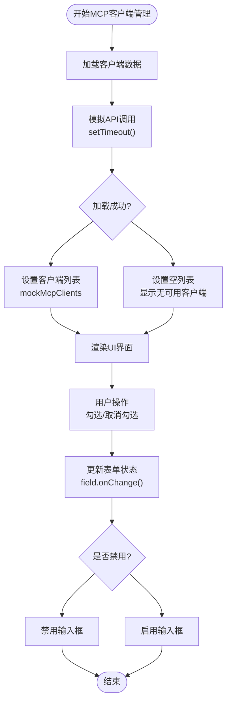

**图表来源**
- [backend/admin/src/components/admin/agents/AgentForm/Tools/MCPClients.tsx:23-41](file://backend/admin/src/components/admin/agents/AgentForm/Tools/MCPClients.tsx#L23-L41)
- [backend/admin/src/components/admin/agents/AgentForm/Tools/MCPClients.tsx:67-78](file://backend/admin/src/components/admin/agents/AgentForm/Tools/MCPClients.tsx#L67-L78)

**章节来源**
- [backend/admin/src/components/admin/agents/AgentForm/Tools/MCPClients.tsx:1-97](file://backend/admin/src/components/admin/agents/AgentForm/Tools/MCPClients.tsx#L1-L97)

## 依赖分析
- 组件耦合
  - ToolManager与ToolProvider：通过协议解耦，新增提供者只需实现协议
  - VideoGeneration与适配器：通过注册表解耦，新增供应商只需注册适配器类
  - ToolContext与数据库：懒加载解析全局配置，避免重复访问
  - 思维模式检测：独立于主业务逻辑，通过日志系统提供调试信息
- 外部依赖
  - httpx：异步HTTP客户端，用于供应商API调用
  - SQLAlchemy：ORM访问数据库，读取LLMProvider与ToolConfig
  - Google GenAI：Gemini AI服务SDK，支持思维模式和图像生成

**更新** 新增思维模式检测和MCPClients相关依赖。

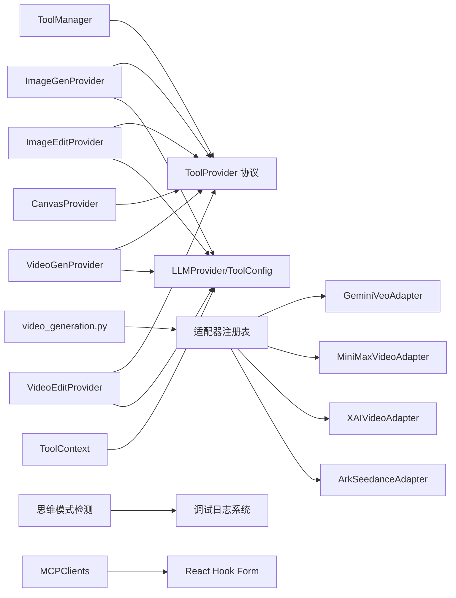

**图表来源**
- [backend/services/tool_manager/manager.py:23-108](file://backend/services/tool_manager/manager.py#L23-L108)
- [backend/services/tool_manager/providers/__init__.py:10-25](file://backend/services/tool_manager/providers/__init__.py#L10-L25)
- [backend/services/video_generation.py:50-82](file://backend/services/video_generation.py#L50-L82)
- [backend/services/llm_stream.py:967-971](file://backend/services/llm_stream.py#L967-L971)
- [backend/admin/src/components/admin/agents/AgentForm/Tools/MCPClients.tsx:18-97](file://backend/admin/src/components/admin/agents/AgentForm/Tools/MCPClients.tsx#L18-L97)

**章节来源**
- [backend/services/tool_manager/manager.py:23-108](file://backend/services/tool_manager/manager.py#L23-L108)
- [backend/services/video_generation.py:50-82](file://backend/services/video_generation.py#L50-L82)

## 性能考虑
- 工具定义缓存：ToolManager缓存工具定义，仅在必要时重建，降低重复构建开销
- 懒加载配置：ToolContext缓存全局配置与供应商类型解析结果，减少数据库访问
- 异步I/O：供应商API调用使用httpx异步客户端，提升并发性能
- 参数枚举裁剪：基于模型能力裁剪工具参数枚举，减少无效请求
- 本地媒体内联：将本地媒体转换为data URI，避免二次网络请求
- 画布节点复用：图像编辑后自动创建新节点并连接，避免重复上传
- 思维模式优化：Gemini思维模式检测算法优化，减少不必要的状态转换
- 调试日志控制：思维模式调试日志仅在需要时输出，避免影响性能

**更新** 新增思维模式检测和调试日志的性能考虑。

## 故障排查指南
- 工具不可用
  - 检查全局配置：确认工具已启用且供应商ID有效
  - 检查技能门控：若相关技能未加载，工具定义可能为空
  - 检查代理配置：确保代理的image_config或video_config正确设置
- 供应商调用失败
  - 查看执行日志：通过管理员路由查询工具执行日志，定位错误原因
  - 核对模型能力：确认所选模型支持相应参数与模式
  - 验证URL格式：确保图像/视频URL格式正确（data URI、HTTP URL、本地路径）
- 视频生成长时间Pending
  - 检查轮询逻辑：确认轮询次数与失败阈值设置合理
  - 核对供应商限制：如分辨率与时长约束，确保参数符合供应商要求
- 画布节点异常
  - 检查节点类型：确认目标节点类型在代理配置中允许
  - 验证权限：确保canvas_tools技能已加载或代理配置了目标节点类型
- 思维模式检测问题
  - 检查思维标签：通过聊天生成服务的日志检查思维标签的存在状态
  - 查看调试日志：检查Gemini思维模式检测的详细日志输出
  - 验证配置映射：确认思维模式到thinking_level的映射正确
- MCP客户端配置问题
  - 检查客户端状态：确认MCP客户端是否正确加载和配置
  - 验证API连接：检查MCP客户端的API连接状态
  - 查看表单状态：确认React Hook Form的状态同步正常

**更新** 新增思维模式检测和MCP客户端相关的故障排查指南。

**章节来源**
- [backend/routers/admin_tools.py:135-187](file://backend/routers/admin_tools.py#L135-L187)
- [backend/services/video_generation.py:87-126](file://backend/services/video_generation.py#L87-L126)
- [backend/services/video_providers/gemini_provider.py:277-321](file://backend/services/video_providers/gemini_provider.py#L277-L321)
- [backend/services/llm_stream.py:967-1007](file://backend/services/llm_stream.py#L967-L1007)
- [backend/admin/src/components/admin/agents/AgentForm/Tools/MCPClients.tsx:23-41](file://backend/admin/src/components/admin/agents/AgentForm/Tools/MCPClients.tsx#L23-L41)

## 结论
KunFlix的AI服务集成为多模态场景提供了清晰、可扩展的架构：
- 通过ToolManager与ToolProvider协议实现工具层的统一与解耦
- 通过VideoGeneration与适配器实现供应商层的统一与扩展
- 通过模型能力配置与全局配置管理实现参数与能力的动态适配
- 通过管理员路由与日志体系实现可观测性与运维能力
- 通过画布节点管理实现内容创作的完整工作流
- **更新** 通过增强的思维模式检测算法和调试功能，提升了多模态AI服务的可靠性和可维护性
- **更新** 通过MCPClients管理机制，支持MCP客户端的灵活配置和集成

该架构便于新增供应商与工具，同时保证了工具调用的稳定性与可维护性。新增的思维模式检测和调试功能进一步增强了系统的智能化水平和运维能力。

## 附录
- 扩展新供应商
  - 新增适配器：实现VideoProviderAdapter抽象方法，注册到video_generation.py的适配器注册表
  - 新增工具提供者：实现ToolProvider协议，加入providers注册表
  - 配置能力：在模型能力配置中补充新模型的能力项
  - **更新** 思维模式支持：在适配器中实现思维模式检测和配置映射
- 配置模型参数
  - 在ToolConfig中设置全局默认参数（如供应商ID、模型、质量与时长）
  - 在Agent级别开启相应工具开关
  - **更新** 思维模式配置：通过thinking_mode开关自动映射到thinking_level
- 多模态数据转换
  - 图像/视频URL自动识别data URI与HTTP URL，确保供应商API兼容
  - 本地媒体路径转换为内联编码，避免远程访问问题
- 工具扩展开发
  - 实现ToolProvider接口：提供tool_names、build_defs、execute、rebuild_defs、get_tool_metadata方法
  - 在providers/__init__.py中注册新提供者
  - 在管理员路由中添加相应的配置接口
- **更新** 思维模式集成
  - 实现思维模式检测算法：支持多供应商的思考内容识别
  - 配置调试日志：启用详细的思维模式检测日志输出
  - 集成图像配置适配：支持思维模式到thinking_level的自动映射
- **更新** MCP客户端管理
  - 实现MCP客户端配置界面：支持客户端的动态加载和状态管理
  - 集成React Hook Form：提供表单状态管理和验证
  - 支持禁用状态：在特定情况下禁用客户端配置功能