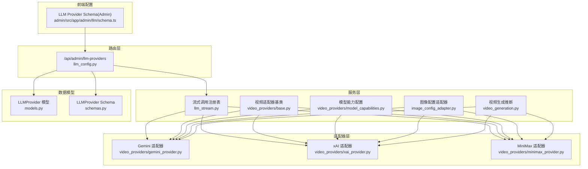
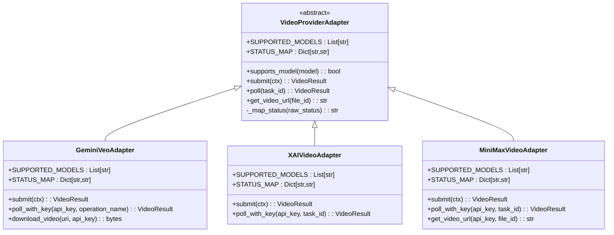
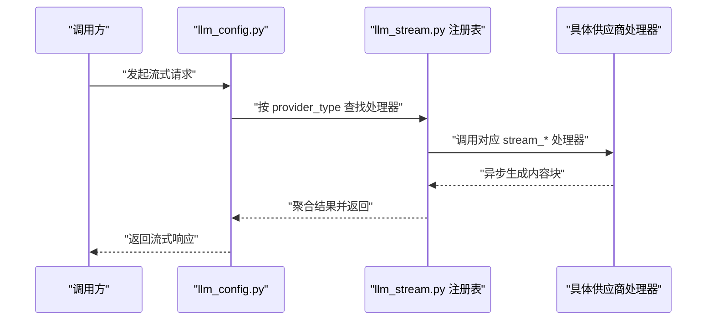
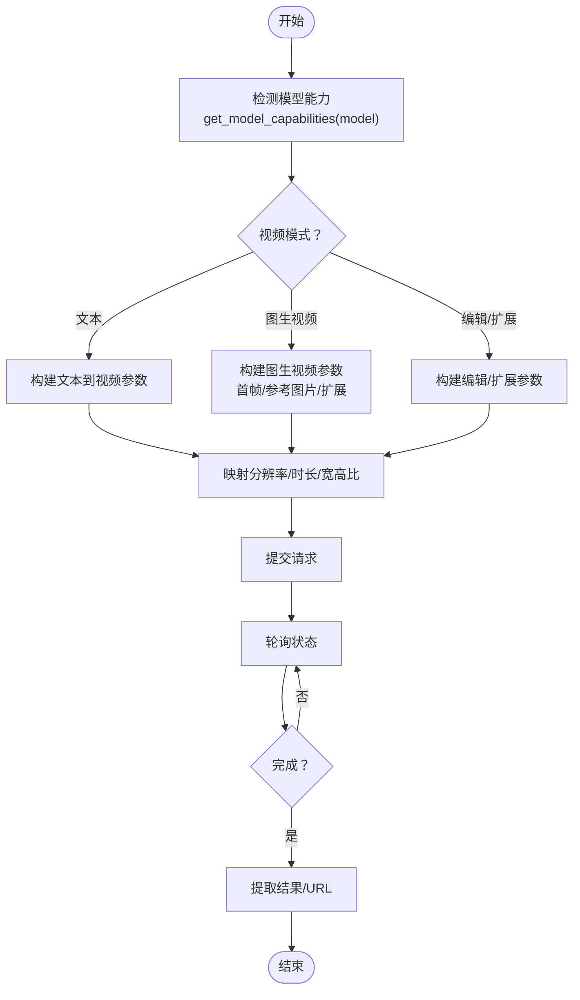
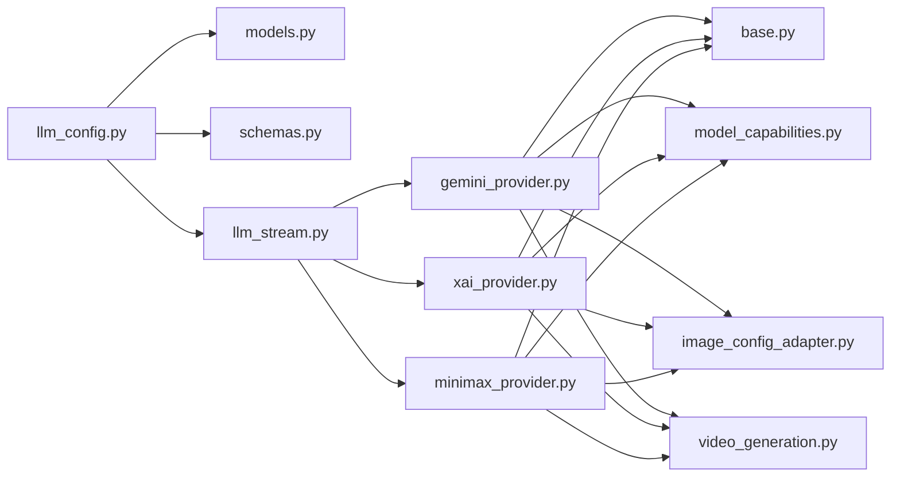

# LLM服务提供商

<cite>
**本文引用的文件**
- [llm_config.py](file://backend/routers/llm_config.py)
- [llm_stream.py](file://backend/services/llm_stream.py)
- [base.py](file://backend/services/video_providers/base.py)
- [model_capabilities.py](file://backend/services/video_providers/model_capabilities.py)
- [gemini_provider.py](file://backend/services/video_providers/gemini_provider.py)
- [xai_provider.py](file://backend/services/video_providers/xai_provider.py)
- [minimax_provider.py](file://backend/services/video_providers/minimax_provider.py)
- [models.py](file://backend/models.py)
- [schemas.py](file://backend/schemas.py)
- [schema.ts](file://backend/admin/src/app/admin/llm/schema.ts)
- [image_config_adapter.py](file://backend/services/image_config_adapter.py)
- [video_generation.py](file://backend/services/video_generation.py)
</cite>

## 目录
1. [简介](#简介)
2. [项目结构](#项目结构)
3. [核心组件](#核心组件)
4. [架构总览](#架构总览)
5. [详细组件分析](#详细组件分析)
6. [依赖关系分析](#依赖关系分析)
7. [性能考量](#性能考量)
8. [故障排查指南](#故障排查指南)
9. [结论](#结论)
10. [附录](#附录)

## 简介
本文件面向多模态大语言模型服务提供商的集成与扩展，系统性阐述统一适配器设计、模型能力检测机制、统一请求/响应处理流程，并给出针对 OpenAI、Claude（Anthropic）、Gemini、xAI（Grok）、MiniMax、火山方舟（Ark/Doubao）等主流 LLM/多模态服务的集成方案。文档涵盖：
- LLMProviderAdapter 基类与视频生成适配器的抽象设计
- 注册表模式的流式调用分发器
- 模型能力配置与参数适配
- 认证配置、错误处理策略与最佳实践
- 扩展新提供商的步骤与注意事项

## 项目结构
后端采用"路由层-服务层-适配器层"的分层组织：
- 路由层负责对外 API 与鉴权校验
- 服务层封装统一的流式调用与多模态处理逻辑
- 适配器层对接具体供应商（LLM/视频）

**图表来源**
- [llm_config.py:1-235](file://backend/routers/llm_config.py#L1-L235)
- [llm_stream.py:1-1041](file://backend/services/llm_stream.py#L1-L1041)
- [base.py:1-121](file://backend/services/video_providers/base.py#L1-L121)
- [model_capabilities.py:1-477](file://backend/services/video_providers/model_capabilities.py#L1-L477)
- [image_config_adapter.py:60-173](file://backend/services/image_config_adapter.py#L60-L173)
- [video_generation.py:156-179](file://backend/services/video_generation.py#L156-L179)
- [gemini_provider.py:1-357](file://backend/services/video_providers/gemini_provider.py#L1-L357)
- [xai_provider.py:1-199](file://backend/services/video_providers/xai_provider.py#L1-L199)
- [minimax_provider.py:1-318](file://backend/services/video_providers/minimax_provider.py#L1-L318)
- [models.py:152-176](file://backend/models.py#L152-L176)
- [schemas.py:124-200](file://backend/schemas.py#L124-L200)
- [schema.ts:1-97](file://backend/admin/src/app/admin/llm/schema.ts#L1-L97)

**章节来源**
- [llm_config.py:1-235](file://backend/routers/llm_config.py#L1-L235)
- [llm_stream.py:1-1041](file://backend/services/llm_stream.py#L1-L1041)
- [base.py:1-121](file://backend/services/video_providers/base.py#L1-L121)
- [model_capabilities.py:1-477](file://backend/services/video_providers/model_capabilities.py#L1-L477)
- [image_config_adapter.py:60-173](file://backend/services/image_config_adapter.py#L60-L173)
- [video_generation.py:156-179](file://backend/services/video_generation.py#L156-L179)
- [gemini_provider.py:1-357](file://backend/services/video_providers/gemini_provider.py#L1-L357)
- [xai_provider.py:1-199](file://backend/services/video_providers/xai_provider.py#L1-L199)
- [minimax_provider.py:1-318](file://backend/services/video_providers/minimax_provider.py#L1-L318)
- [models.py:152-176](file://backend/models.py#L152-L176)
- [schemas.py:124-200](file://backend/schemas.py#L124-L200)
- [schema.ts:1-97](file://backend/admin/src/app/admin/llm/schema.ts#L1-L97)

## 核心组件
- LLMProviderAdapter 基类与视频适配器基类
  - 统一抽象 submit/poll/get_video_url 等接口，支持状态映射与模型能力检测
- 流式调用注册表（Provider Registry）
  - 基于装饰器注册各供应商处理器，按 provider_type 分发
- 模型能力配置中心
  - 以字典形式集中声明各模型支持的模式、分辨率、时长、参考图片等能力
- 路由与模型工厂
  - 对外提供连接测试、增删改查；内部按 provider_type 选择对应客户端/适配器
- 统一图像配置适配器
  - 将供应商无关的统一配置转换为各供应商特定格式
- 视频生成模型推断
  - 根据模型名和供应商提示推断视频生成供应商类型

**章节来源**
- [base.py:56-121](file://backend/services/video_providers/base.py#L56-L121)
- [llm_stream.py:64-71](file://backend/services/llm_stream.py#L64-L71)
- [model_capabilities.py:27-477](file://backend/services/video_providers/model_capabilities.py#L27-L477)
- [llm_config.py:51-84](file://backend/routers/llm_config.py#L51-L84)
- [image_config_adapter.py:60-173](file://backend/services/image_config_adapter.py#L60-L173)
- [video_generation.py:156-179](file://backend/services/video_generation.py#L156-L179)

## 架构总览
统一适配器设计通过"抽象基类 + 具体适配器 + 注册表分发"实现对多家供应商的解耦与扩展。

**图表来源**
- [base.py:56-121](file://backend/services/video_providers/base.py#L56-L121)
- [gemini_provider.py:42-357](file://backend/services/video_providers/gemini_provider.py#L42-L357)
- [xai_provider.py:43-199](file://backend/services/video_providers/xai_provider.py#L43-L199)
- [minimax_provider.py:30-318](file://backend/services/video_providers/minimax_provider.py#L30-L318)

## 详细组件分析

### LLMProviderAdapter 基类与视频适配器基类
- 设计要点
  - 统一接口：submit/poll/get_video_url，便于轮询与下载解耦
  - 状态映射：STATUS_MAP 将供应商状态标准化为内部状态
  - 能力检测：supports_model 通过前缀/全名匹配判断
- 数据结构
  - VideoContext：封装 API Key、模型、提示词、输入媒体、质量、时长、宽高比、视频模式、参考图片、扩展视频等
  - VideoResult：封装任务 ID、状态、URL、文件 ID、尺寸、错误信息

**章节来源**
- [base.py:15-54](file://backend/services/video_providers/base.py#L15-L54)
- [base.py:56-121](file://backend/services/video_providers/base.py#L56-L121)

### 流式调用注册表与统一处理流程
- 注册表模式
  - register_provider 装饰器将 provider_type 与处理器绑定
  - _PROVIDER_REGISTRY 作为分发中心，按 provider_type 调用对应处理器
- 统一流程
  - 构造 StreamContext（包含 provider_type、api_key、base_url、model、messages、温度、上下文窗口、thinking_mode、多模态配置等）
  - 按供应商类型分别处理：OpenAI/Azure/DeepSeek、xAI（文本/图像）、Anthropic/MiniMax、DashScope、Gemini 等
  - 统一产出：full_response、reasoning_content、tokens 统计、tool_calls、生成图片数等

**图表来源**
- [llm_config.py:103-138](file://backend/routers/llm_config.py#L103-L138)
- [llm_stream.py:64-71](file://backend/services/llm_stream.py#L64-L71)
- [llm_stream.py:82-148](file://backend/services/llm_stream.py#L82-L148)

**章节来源**
- [llm_stream.py:64-71](file://backend/services/llm_stream.py#L64-L71)
- [llm_stream.py:82-148](file://backend/services/llm_stream.py#L82-L148)
- [llm_stream.py:166-245](file://backend/services/llm_stream.py#L166-L245)
- [llm_stream.py:414-420](file://backend/services/llm_stream.py#L414-L420)
- [llm_stream.py:476-482](file://backend/services/llm_stream.py#L476-L482)
- [llm_stream.py:517-586](file://backend/services/llm_stream.py#L517-L586)
- [llm_stream.py:591-619](file://backend/services/llm_stream.py#L591-L619)
- [llm_stream.py:768-800](file://backend/services/llm_stream.py#L768-L800)

### 模型能力检测与参数适配
- 能力配置中心
  - VIDEO_MODEL_CAPABILITIES：集中声明各模型支持的模式（文本/图生视频/参考图片/视频扩展/编辑）、分辨率、时长、宽高比、首尾帧、参考图片数量上限、优化开关等
  - 提供 get_model_capabilities、get_supported_models、get_models_by_provider 辅助查询
- 参数适配策略
  - Gemini：分辨率/时长/宽高比映射、首尾帧/参考图片/视频扩展/种子等特性按模型集合启用
  - xAI：根据 video_mode 动态拼装 payload；编辑/扩展模式禁用自定义分辨率与时长
  - MiniMax：按模型类别（T2V/I2V/S2V）自动切换模式；I2V 必须提供首帧图片；首尾帧仅部分模型支持

**图表来源**
- [model_capabilities.py:27-477](file://backend/services/video_providers/model_capabilities.py#L27-L477)
- [gemini_provider.py:105-166](file://backend/services/video_providers/gemini_provider.py#L105-L166)
- [xai_provider.py:70-104](file://backend/services/video_providers/xai_provider.py#L70-L104)
- [minimax_provider.py:135-180](file://backend/services/video_providers/minimax_provider.py#L135-L180)

**章节来源**
- [model_capabilities.py:27-477](file://backend/services/video_providers/model_capabilities.py#L27-L477)
- [gemini_provider.py:105-166](file://backend/services/video_providers/gemini_provider.py#L105-L166)
- [xai_provider.py:70-104](file://backend/services/video_providers/xai_provider.py#L70-L104)
- [minimax_provider.py:135-180](file://backend/services/video_providers/minimax_provider.py#L135-L180)

### 统一图像配置适配器
- 设计目标
  - 提供供应商无关的统一图像生成配置接口
  - 将统一配置转换为各供应商特定格式
- 适配策略
  - Gemini：aspect_ratio → aspectRatio, quality → imageSize, response_format → b64_json
  - xAI：aspect_ratio → aspect_ratio, quality → resolution, response_format → b64_json
  - Ark：aspect_ratio → aspectRatio, quality → size, response_format → url
- 适配器注册表
  - 基于供应商类型映射到相应的适配函数

**章节来源**
- [image_config_adapter.py:60-173](file://backend/services/image_config_adapter.py#L60-L173)

### 视频生成模型推断
- 推断逻辑
  - 优先使用 LLMProvider.provider_type 提示
  - 备用：根据模型名前缀自动推断（如 grok- → xai, veo- → gemini, MiniMax- → minimax）
- 应用场景
  - 视频生成任务路由
  - 供应商类型一致性保证

**章节来源**
- [video_generation.py:156-179](file://backend/services/video_generation.py#L156-L179)

### 具体适配器实现与差异点

#### Gemini 适配器
- 支持模型族：Veo 2.0/3.0/3.1 系列
- 特性
  - 首尾帧插值、参考图片、视频扩展、原生音频（部分版本）
  - 分辨率/时长/宽高比映射；种子参数（Veo 3+）
  - 轮询通过操作名；完成后提取视频 URI
- 错误处理
  - done 字段判定完成；失败时记录 error.message；下载需携带 API Key

**章节来源**
- [gemini_provider.py:42-99](file://backend/services/video_providers/gemini_provider.py#L42-L99)
- [gemini_provider.py:105-166](file://backend/services/video_providers/gemini_provider.py#L105-L166)
- [gemini_provider.py:277-321](file://backend/services/video_providers/gemini_provider.py#L277-L321)
- [gemini_provider.py:338-357](file://backend/services/video_providers/gemini_provider.py#L338-L357)

#### xAI 适配器
- 支持模型：grok-imagine-video
- 特性
  - 生成/编辑/扩展三端点；根据 video_mode 路由
  - 编辑/扩展模式不支持自定义分辨率与时长；生成模式支持
  - 内容审核：respect_moderation 控制
- 错误处理
  - 状态映射覆盖 queued/pending/in_progress/failed/expired 等

**章节来源**
- [xai_provider.py:43-60](file://backend/services/video_providers/xai_provider.py#L43-L60)
- [xai_provider.py:62-104](file://backend/services/video_providers/xai_provider.py#L62-L104)
- [xai_provider.py:148-199](file://backend/services/video_providers/xai_provider.py#L148-L199)

#### MiniMax 适配器
- 支持模型：Hailuo 系列、T2V/I2V/S2V 等
- 特性
  - I2V 模型必须提供首帧图片；T2V 模型可选
  - 首尾帧仅部分模型支持；时长限定为 6/10
  - 完成后需调用文件检索接口获取下载 URL
- 错误处理
  - 校验 base_resp 状态码；翻译常见错误消息

**章节来源**
- [minimax_provider.py:30-89](file://backend/services/video_providers/minimax_provider.py#L30-L89)
- [minimax_provider.py:90-134](file://backend/services/video_providers/minimax_provider.py#L90-L134)
- [minimax_provider.py:182-238](file://backend/services/video_providers/minimax_provider.py#L182-L238)
- [minimax_provider.py:239-287](file://backend/services/video_providers/minimax_provider.py#L239-L287)
- [minimax_provider.py:288-318](file://backend/services/video_providers/minimax_provider.py#L288-L318)

### 路由与模型工厂（连接测试与配置）
- 连接测试
  - 非视频模型：通过 Agentscope 初始化并构造对话代理进行连通性测试
  - 视频模型：直接调用 /v1/models 验证 API Key
- 模型工厂
  - 根据 provider_type 选择对应客户端（OpenAI/Azure/DashScope/Anthropic/Gemini/Ollama/Ark）
  - 支持自定义 base_url 与 extra_config（如 generate_kwargs）

**章节来源**
- [llm_config.py:87-138](file://backend/routers/llm_config.py#L87-L138)
- [llm_config.py:51-84](file://backend/routers/llm_config.py#L51-L84)
- [llm_config.py:26-48](file://backend/routers/llm_config.py#L26-L48)

### 前端配置与模型成本维度
- 前端提供 LLM Provider 表单 Schema，包含图标映射、模型标签、成本维度等
- 成本维度覆盖输入、文本输出、图片输出、搜索查询、视频输入/输出等

**章节来源**
- [schema.ts:4-13](file://backend/admin/src/app/admin/llm/schema.ts#L4-L13)
- [schema.ts:45-58](file://backend/admin/src/app/admin/llm/schema.ts#L45-L58)

## 依赖关系分析
- 路由层依赖数据库模型与 Schema，用于提供 CRUD 与连接测试
- 服务层依赖注册表与适配器，实现多供应商统一接入
- 适配器层依赖外部 SDK/HTTP 客户端，负责具体 API 调用与参数适配

**图表来源**
- [llm_config.py:1-235](file://backend/routers/llm_config.py#L1-L235)
- [models.py:152-176](file://backend/models.py#L152-L176)
- [schemas.py:124-200](file://backend/schemas.py#L124-L200)
- [llm_stream.py:1-1041](file://backend/services/llm_stream.py#L1-L1041)
- [base.py:1-121](file://backend/services/video_providers/base.py#L1-L121)
- [gemini_provider.py:1-357](file://backend/services/video_providers/gemini_provider.py#L1-L357)
- [xai_provider.py:1-199](file://backend/services/video_providers/xai_provider.py#L1-L199)
- [minimax_provider.py:1-318](file://backend/services/video_providers/minimax_provider.py#L1-L318)
- [model_capabilities.py:1-477](file://backend/services/video_providers/model_capabilities.py#L1-L477)
- [image_config_adapter.py:60-173](file://backend/services/image_config_adapter.py#L60-L173)
- [video_generation.py:156-179](file://backend/services/video_generation.py#L156-L179)

**章节来源**
- [llm_config.py:1-235](file://backend/routers/llm_config.py#L1-L235)
- [llm_stream.py:1-1041](file://backend/services/llm_stream.py#L1-L1041)
- [base.py:1-121](file://backend/services/video_providers/base.py#L1-L121)
- [model_capabilities.py:1-477](file://backend/services/video_providers/model_capabilities.py#L1-L477)
- [image_config_adapter.py:60-173](file://backend/services/image_config_adapter.py#L60-L173)
- [video_generation.py:156-179](file://backend/services/video_generation.py#L156-L179)
- [gemini_provider.py:1-357](file://backend/services/video_providers/gemini_provider.py#L1-L357)
- [xai_provider.py:1-199](file://backend/services/video_providers/xai_provider.py#L1-L199)
- [minimax_provider.py:1-318](file://backend/services/video_providers/minimax_provider.py#L1-L318)
- [models.py:152-176](file://backend/models.py#L152-L176)
- [schemas.py:124-200](file://backend/schemas.py#L124-L200)
- [schema.ts:1-97](file://backend/admin/src/app/admin/llm/schema.ts#L1-L97)

## 性能考量
- 流式传输
  - 优先使用流式接口（OpenAI/Anthropic/DashScope/Gemini）以降低首字节延迟
- 超时与重试
  - 为第三方 HTTP 调用设置合理超时；对可重试错误（网络异常）实施指数退避
- 日志脱敏
  - 在日志中移除敏感字段（图片/视频数据），仅保留必要上下文
- 模型能力预检
  - 在提交前依据能力表过滤不支持的参数组合，减少无效请求
- 并发与限流
  - 对供应商限流阈值进行配置化管理，避免触发速率限制
- 统一配置适配
  - 通过适配器减少供应商间配置差异带来的性能损耗

## 故障排查指南
- 连接测试失败
  - 非视频模型：确认 provider_type 与 base_url 是否正确；检查 extra_config 与模型名称
  - 视频模型：确认 /v1/models 可访问且返回 2xx
- 状态异常
  - Gemini：检查 done 字段与 error.message；必要时重新轮询
  - xAI：关注 status 映射与 content moderation 结果
  - MiniMax：检查 base_resp.status_code 与错误翻译后的消息
- 图片/视频下载失败
  - Gemini：确保携带 API Key 下载 video.uri
  - MiniMax：调用文件检索接口获取 download_url
- 参数不生效
  - 检查模型能力表与参数映射（分辨率/时长/宽高比/种子等）
- 供应商类型推断错误
  - 检查 LLMProvider.provider_type 配置
  - 验证模型名前缀是否符合预期

**章节来源**
- [llm_config.py:87-138](file://backend/routers/llm_config.py#L87-L138)
- [gemini_provider.py:277-321](file://backend/services/video_providers/gemini_provider.py#L277-L321)
- [xai_provider.py:148-199](file://backend/services/video_providers/xai_provider.py#L148-L199)
- [minimax_provider.py:239-287](file://backend/services/video_providers/minimax_provider.py#L239-L287)
- [minimax_provider.py:288-318](file://backend/services/video_providers/minimax_provider.py#L288-L318)
- [video_generation.py:156-179](file://backend/services/video_generation.py#L156-L179)

## 结论
该体系通过"适配器基类 + 注册表分发 + 能力配置中心 + 统一配置适配器"的架构，实现了对多家 LLM/多模态供应商的一致接入与扩展。统一的流式处理、参数适配与错误处理策略显著降低了集成复杂度；通过能力表与状态映射，进一步提升了跨供应商的稳定性与可维护性。新增的统一图像配置适配器和视频生成模型推断机制，使得供应商无关的配置管理和自动路由成为可能。建议在新增供应商时遵循现有模式，确保最小改动即可上线。

## 附录

### 扩展新 LLM 适配器步骤
- 新建适配器类，继承对应基类（LLM：OpenAI/Anthropic/Gemini/DashScope；视频：VideoProviderAdapter）
- 实现 submit/poll（必要时实现 get_video_url/download_video）
- 定义 SUPPORTED_MODELS 与 STATUS_MAP
- 在注册表中注册对应 provider_type（如适用）
- 若涉及多模态参数，完善能力检测与参数映射
- 在路由层增加连接测试与配置项（如需）

**章节来源**
- [base.py:56-121](file://backend/services/video_providers/base.py#L56-L121)
- [llm_stream.py:64-71](file://backend/services/llm_stream.py#L64-L71)

### API 集成示例（路径指引）
- 连接测试（非视频模型）
  - [llm_config.py:103-138](file://backend/routers/llm_config.py#L103-L138)
- 连接测试（视频模型）
  - [llm_config.py:87-94](file://backend/routers/llm_config.py#L87-L94)
- 流式调用（OpenAI/Azure/DeepSeek）
  - [llm_stream.py:82-148](file://backend/services/llm_stream.py#L82-L148)
- 流式调用（xAI 文本/图像）
  - [llm_stream.py:166-245](file://backend/services/llm_stream.py#L166-L245)
  - [llm_stream.py:414-420](file://backend/services/llm_stream.py#L414-L420)
- 流式调用（Anthropic/MiniMax）
  - [llm_stream.py:517-586](file://backend/services/llm_stream.py#L517-L586)
- 流式调用（DashScope）
  - [llm_stream.py:591-619](file://backend/services/llm_stream.py#L591-L619)
- 流式调用（Gemini）
  - [llm_stream.py:768-800](file://backend/services/llm_stream.py#L768-L800)
- Gemini 提交/轮询/下载
  - [gemini_provider.py:224-258](file://backend/services/video_providers/gemini_provider.py#L224-L258)
  - [gemini_provider.py:277-321](file://backend/services/video_providers/gemini_provider.py#L277-L321)
  - [gemini_provider.py:338-357](file://backend/services/video_providers/gemini_provider.py#L338-L357)
- xAI 提交/轮询
  - [xai_provider.py:106-135](file://backend/services/video_providers/xai_provider.py#L106-L135)
  - [xai_provider.py:148-199](file://backend/services/video_providers/xai_provider.py#L148-L199)
- MiniMax 提交/轮询/下载
  - [minimax_provider.py:182-238](file://backend/services/video_providers/minimax_provider.py#L182-L238)
  - [minimax_provider.py:239-287](file://backend/services/video_providers/minimax_provider.py#L239-L287)
  - [minimax_provider.py:288-318](file://backend/services/video_providers/minimax_provider.py#L288-L318)

### 认证配置与模型参数适配
- 认证
  - OpenAI/Azure/DeepSeek：API Key（或 base_url）
  - Anthropic/MiniMax：Bearer Token
  - xAI：Authorization Bearer
  - Gemini：x-goog-api-key
  - Ark/Doubao：OpenAI 兼容，使用自有 base_url
- 模型参数
  - 温度、上下文窗口、工具函数、多模态输入（文本/图片/视频）等
  - Gemini：thinking_level、media_resolution、image_config、google_search_enabled
  - xAI：aspect_ratio、resolution、n、response_format、extra_body
  - 统一图像配置：供应商无关的统一参数格式

**章节来源**
- [llm_stream.py:52-58](file://backend/services/llm_stream.py#L52-L58)
- [llm_stream.py:175-190](file://backend/services/llm_stream.py#L175-L190)
- [llm_stream.py:789-796](file://backend/services/llm_stream.py#L789-L796)
- [gemini_provider.py:226-229](file://backend/services/video_providers/gemini_provider.py#L226-L229)
- [xai_provider.py:108-111](file://backend/services/video_providers/xai_provider.py#L108-L111)
- [minimax_provider.py:184-187](file://backend/services/video_providers/minimax_provider.py#L184-L187)
- [image_config_adapter.py:60-173](file://backend/services/image_config_adapter.py#L60-L173)