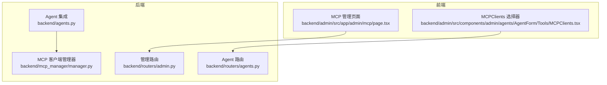
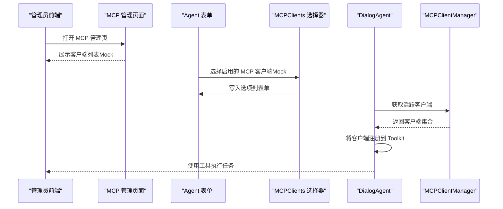
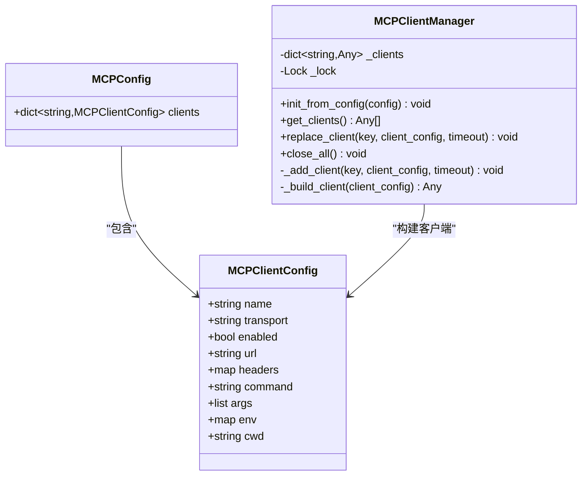
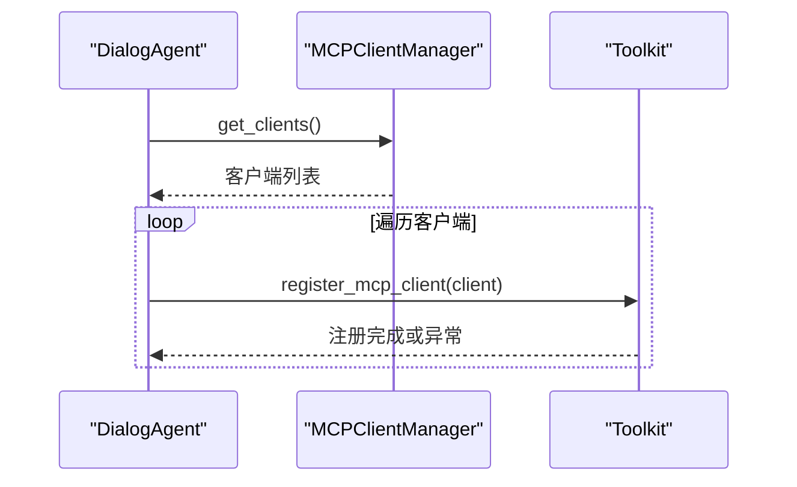
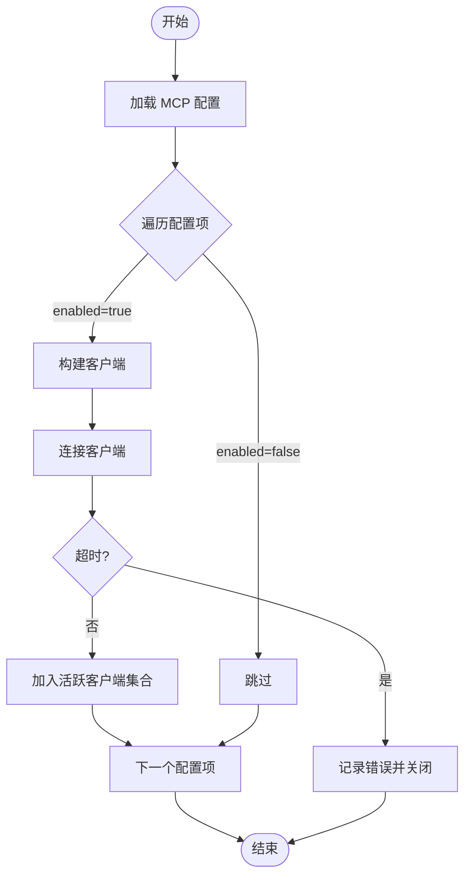
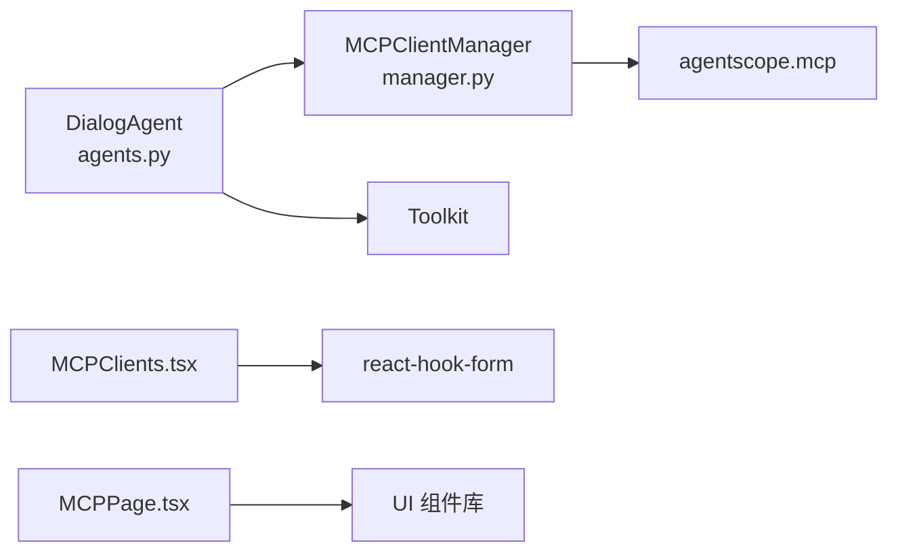

# MCPClients管理

<cite>
**本文引用的文件**
- [backend/admin/src/app/admin/mcp/page.tsx](file://backend/admin/src/app/admin/mcp/page.tsx)
- [backend/admin/src/components/admin/agents/AgentForm/Tools/MCPClients.tsx](file://backend/admin/src/components/admin/agents/AgentForm/Tools/MCPClients.tsx)
- [backend/mcp_manager/manager.py](file://backend/mcp_manager/manager.py)
- [backend/agents.py](file://backend/agents.py)
- [backend/routers/admin.py](file://backend/routers/admin.py)
- [backend/routers/agents.py](file://backend/routers/agents.py)
</cite>

## 目录
1. [简介](#简介)
2. [项目结构](#项目结构)
3. [核心组件](#核心组件)
4. [架构总览](#架构总览)
5. [详细组件分析](#详细组件分析)
6. [依赖分析](#依赖分析)
7. [性能考虑](#性能考虑)
8. [故障排除指南](#故障排除指南)
9. [结论](#结论)
10. [附录](#附录)

## 简介
本文件面向“MCPClients管理”的完整实现与使用说明，涵盖以下方面：
- Model Context Protocol (MCP) 客户端的注册、连接管理与协议通信机制
- 后端 MCP 客户端管理器（MCPClientManager）的工作原理与热重载能力
- 前端 MCP 客户端列表组件（MCPClients.tsx）与 MCP 管理页面（MCPPage）的交互
- Agent 如何动态注册 MCP 客户端以获得工具能力
- 配置示例、连接建立流程、错误恢复策略、新增客户端步骤与状态监控方法
- 实际代码路径引用与可视化图示，便于开发者快速定位与扩展

## 项目结构
围绕 MCPClients 的相关文件分布如下：
- 后端管理器：Python 实现的 MCPClientManager，负责客户端生命周期与热替换
- Agent 集成：DialogAgent 在运行时从管理器获取客户端并注册到 Toolkit
- 前端 MCP 页面：展示客户端列表、状态与操作按钮（Mock 数据）
- 前端 MCP 客户端选择器：在 Agent 表单中勾选启用的 MCP 客户端（Mock 数据）

图表来源
- [backend/admin/src/app/admin/mcp/page.tsx:1-108](file://backend/admin/src/app/admin/mcp/page.tsx#L1-L108)
- [backend/admin/src/components/admin/agents/AgentForm/Tools/MCPClients.tsx:1-97](file://backend/admin/src/components/admin/agents/AgentForm/Tools/MCPClients.tsx#L1-L97)
- [backend/mcp_manager/manager.py:1-139](file://backend/mcp_manager/manager.py#L1-L139)
- [backend/agents.py:49-84](file://backend/agents.py#L49-L84)
- [backend/routers/admin.py:1-501](file://backend/routers/admin.py#L1-L501)
- [backend/routers/agents.py:1-151](file://backend/routers/agents.py#L1-L151)

章节来源
- [backend/admin/src/app/admin/mcp/page.tsx:1-108](file://backend/admin/src/app/admin/mcp/page.tsx#L1-L108)
- [backend/admin/src/components/admin/agents/AgentForm/Tools/MCPClients.tsx:1-97](file://backend/admin/src/components/admin/agents/AgentForm/Tools/MCPClients.tsx#L1-L97)
- [backend/mcp_manager/manager.py:1-139](file://backend/mcp_manager/manager.py#L1-L139)
- [backend/agents.py:49-84](file://backend/agents.py#L49-L84)
- [backend/routers/admin.py:1-501](file://backend/routers/admin.py#L1-L501)
- [backend/routers/agents.py:1-151](file://backend/routers/agents.py#L1-L151)

## 核心组件
- MCPClientManager（后端）：负责从配置初始化客户端、运行时替换、连接超时与关闭回收；支持“双阶段锁定”最小化阻塞
- DialogAgent（后端）：在每次回复前动态拉取活跃客户端并注册到 Toolkit，支持热重载
- MCPPage（前端）：展示 MCP 客户端列表、状态与操作（Mock）
- MCPClients（前端）：在 Agent 表单中勾选启用的 MCP 客户端（Mock）

章节来源
- [backend/mcp_manager/manager.py:28-139](file://backend/mcp_manager/manager.py#L28-L139)
- [backend/agents.py:70-84](file://backend/agents.py#L70-L84)
- [backend/admin/src/app/admin/mcp/page.tsx:11-108](file://backend/admin/src/app/admin/mcp/page.tsx#L11-L108)
- [backend/admin/src/components/admin/agents/AgentForm/Tools/MCPClients.tsx:18-97](file://backend/admin/src/components/admin/agents/AgentForm/Tools/MCPClients.tsx#L18-L97)

## 架构总览
下图展示了从前端到后端的调用链路与职责分工：

图表来源
- [backend/admin/src/app/admin/mcp/page.tsx:11-108](file://backend/admin/src/app/admin/mcp/page.tsx#L11-L108)
- [backend/admin/src/components/admin/agents/AgentForm/Tools/MCPClients.tsx:18-97](file://backend/admin/src/components/admin/agents/AgentForm/Tools/MCPClients.tsx#L18-L97)
- [backend/agents.py:70-84](file://backend/agents.py#L70-L84)
- [backend/mcp_manager/manager.py:52-55](file://backend/mcp_manager/manager.py#L52-L55)

## 详细组件分析

### 后端：MCPClientManager
- 职责
  - 从配置初始化客户端
  - 运行时替换客户端（最小阻塞）
  - 连接超时控制与异常处理
  - 关闭所有客户端并回收资源
- 关键点
  - 双阶段锁定：先在锁外连接新客户端，再在锁内交换并关闭旧客户端
  - 支持两种传输方式：HTTP 与 STDIO
  - HTTP 头部支持环境变量展开
  - 提供重建信息属性以便后续热重载

图表来源
- [backend/mcp_manager/manager.py:10-27](file://backend/mcp_manager/manager.py#L10-L27)
- [backend/mcp_manager/manager.py:28-139](file://backend/mcp_manager/manager.py#L28-L139)

章节来源
- [backend/mcp_manager/manager.py:28-139](file://backend/mcp_manager/manager.py#L28-L139)

### 后端：DialogAgent 对 MCP 客户端的注册
- 职责
  - 在每次回复前动态获取活跃客户端
  - 将客户端注册到 Toolkit（若支持）
- 特性
  - 支持热重载：每次请求都重新拉取客户端列表
  - 异常安全：单个客户端注册失败不影响整体流程

图表来源
- [backend/agents.py:70-84](file://backend/agents.py#L70-L84)
- [backend/mcp_manager/manager.py:52-55](file://backend/mcp_manager/manager.py#L52-L55)

章节来源
- [backend/agents.py:70-84](file://backend/agents.py#L70-L84)

### 前端：MCPPage（MCP 管理页面）
- 功能
  - 展示客户端名称、传输方式、连接配置、状态与可用工具数量
  - 提供编辑与删除按钮（Mock）
- 状态
  - Mock 数据包含“已连接/未连接”两种状态
- 扩展建议
  - 通过 API 获取真实客户端列表与状态
  - 提供“添加客户端”“重连”等操作入口

章节来源
- [backend/admin/src/app/admin/mcp/page.tsx:11-108](file://backend/admin/src/app/admin/mcp/page.tsx#L11-L108)

### 前端：MCPClients（Agent 表单中的 MCP 客户端选择器）
- 功能
  - 在 Agent 表单中勾选启用的 MCP 客户端（Mock）
  - 加载中与无可用客户端时的提示
- 扩展建议
  - 通过 API 获取真实可用客户端列表
  - 支持禁用状态与异步加载

章节来源
- [backend/admin/src/components/admin/agents/AgentForm/Tools/MCPClients.tsx:18-97](file://backend/admin/src/components/admin/agents/AgentForm/Tools/MCPClients.tsx#L18-L97)

### 连接建立流程（后端）

图表来源
- [backend/mcp_manager/manager.py:40-51](file://backend/mcp_manager/manager.py#L40-L51)
- [backend/mcp_manager/manager.py:87-91](file://backend/mcp_manager/manager.py#L87-L91)

章节来源
- [backend/mcp_manager/manager.py:40-91](file://backend/mcp_manager/manager.py#L40-L91)

### 错误恢复策略（后端）
- 连接失败：记录错误并关闭新建客户端，抛出异常
- 替换客户端：新客户端连接失败时，不替换旧客户端
- 关闭所有客户端：逐个关闭并记录警告，避免异常中断进程
- Agent 注册失败：记录错误并继续注册其他客户端

章节来源
- [backend/mcp_manager/manager.py:66-74](file://backend/mcp_manager/manager.py#L66-L74)
- [backend/mcp_manager/manager.py:93-104](file://backend/mcp_manager/manager.py#L93-L104)
- [backend/agents.py:78-83](file://backend/agents.py#L78-L83)

## 依赖分析
- 后端依赖
  - agentscope.mcp：提供 HttpStatefulClient 与 StdIOStatefulClient
  - asyncio.Lock：用于并发安全的客户端集合更新
- 前端依赖
  - react-hook-form：表单上下文与字段绑定
  - lucide-react：图标
  - 前端组件库（未在本文展开）

图表来源
- [backend/mcp_manager/manager.py](file://backend/mcp_manager/manager.py#L6)
- [backend/agents.py](file://backend/agents.py#L22)
- [backend/admin/src/components/admin/agents/AgentForm/Tools/MCPClients.tsx:1-4](file://backend/admin/src/components/admin/agents/AgentForm/Tools/MCPClients.tsx#L1-L4)
- [backend/admin/src/app/admin/mcp/page.tsx:3-9](file://backend/admin/src/app/admin/mcp/page.tsx#L3-L9)

章节来源
- [backend/mcp_manager/manager.py](file://backend/mcp_manager/manager.py#L6)
- [backend/agents.py](file://backend/agents.py#L22)
- [backend/admin/src/components/admin/agents/AgentForm/Tools/MCPClients.tsx:1-4](file://backend/admin/src/components/admin/agents/AgentForm/Tools/MCPClients.tsx#L1-L4)
- [backend/admin/src/app/admin/mcp/page.tsx:3-9](file://backend/admin/src/app/admin/mcp/page.tsx#L3-L9)

## 性能考虑
- 并发与锁粒度
  - 使用 asyncio.Lock 保护客户端字典，减少锁持有时间
  - 双阶段锁定：连接新客户端在锁外进行，降低阻塞
- 连接超时
  - 统一的连接超时参数，避免长时间阻塞
- 热重载
  - 运行时替换客户端，无需重启服务
- 前端渲染
  - 列表采用 Mock 数据，实际接入 API 后需考虑分页与缓存

[本节为通用指导，不直接分析具体文件]

## 故障排除指南
- 客户端无法连接
  - 检查传输配置（HTTP URL 或 STDIO 命令）
  - 查看后端日志中的连接错误与超时信息
  - 确认网络可达性与认证头（HTTP）
- 客户端替换失败
  - 新客户端连接失败不会影响旧客户端
  - 检查替换流程中的异常日志
- Agent 未使用 MCP 工具
  - 确认 Agent 已注入 MCPClientManager
  - 检查 Toolkit 是否支持 register_mcp_client
- 前端 MCP 列表为空
  - 当前为 Mock 数据，需实现后端 API 并在前端发起请求

章节来源
- [backend/mcp_manager/manager.py:66-74](file://backend/mcp_manager/manager.py#L66-L74)
- [backend/agents.py:70-84](file://backend/agents.py#L70-L84)
- [backend/admin/src/app/admin/mcp/page.tsx:14-32](file://backend/admin/src/app/admin/mcp/page.tsx#L14-L32)
- [backend/admin/src/components/admin/agents/AgentForm/Tools/MCPClients.tsx:23-41](file://backend/admin/src/components/admin/agents/AgentForm/Tools/MCPClients.tsx#L23-L41)

## 结论
本实现提供了完整的 MCP 客户端生命周期管理与热重载能力，并在 Agent 层面实现了按需注册与工具可用性增强。前端提供了 MCP 管理页面与 Agent 表单中的客户端选择器，当前为 Mock 数据，后续可通过后端 API 实现真实状态与配置管理。

[本节为总结性内容，不直接分析具体文件]

## 附录

### 配置示例（后端）
- MCPClientConfig 字段说明
  - name：客户端名称
  - transport：传输方式（"stdio" 或 "http"）
  - enabled：是否启用
  - HTTP：url、headers
  - STDIO：command、args、env、cwd
- MCPConfig.clients：客户端字典

章节来源
- [backend/mcp_manager/manager.py:10-27](file://backend/mcp_manager/manager.py#L10-L27)

### 添加新的 MCP 客户端（后端）
- 步骤
  - 在配置中新增客户端条目
  - 调用 replace_client 或等待热重载生效
  - 确认客户端连接状态与工具数量
- 注意事项
  - HTTP 传输需提供 url 与可选 headers
  - STDIO 传输需提供 command 与可选参数

章节来源
- [backend/mcp_manager/manager.py:57-86](file://backend/mcp_manager/manager.py#L57-L86)
- [backend/mcp_manager/manager.py:105-139](file://backend/mcp_manager/manager.py#L105-L139)

### 监控连接状态（前端）
- 当前状态
  - MCPPage 展示“已连接/未连接”状态
- 建议
  - 实现后端状态接口，返回实时状态与工具数量
  - 前端轮询或 SSE 推送更新

章节来源
- [backend/admin/src/app/admin/mcp/page.tsx:74-91](file://backend/admin/src/app/admin/mcp/page.tsx#L74-L91)

### Agent 集成要点（后端）
- 在构造函数中注入 MCPClientManager
- 在回复前调用 _register_mcp_clients
- 确保 Toolkit 支持 register_mcp_client

章节来源
- [backend/agents.py:49-84](file://backend/agents.py#L49-L84)