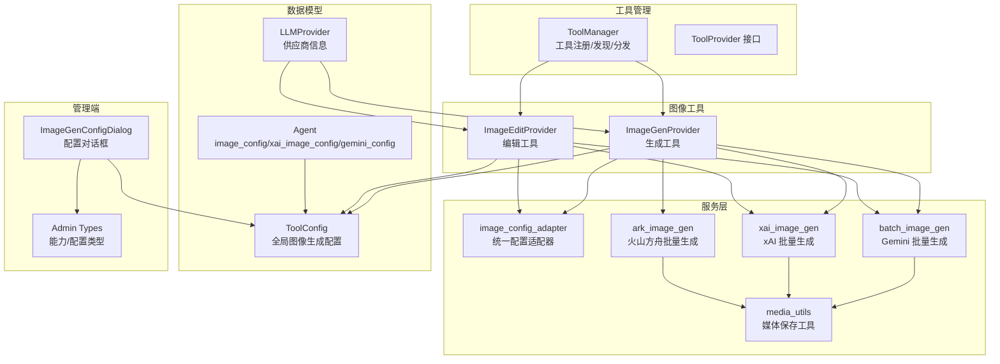
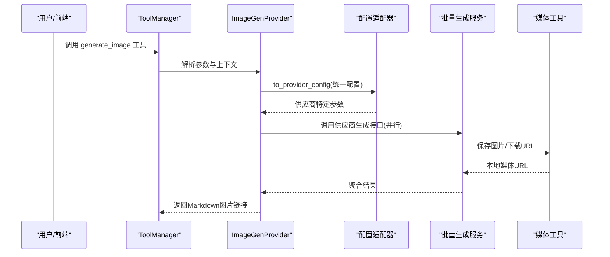
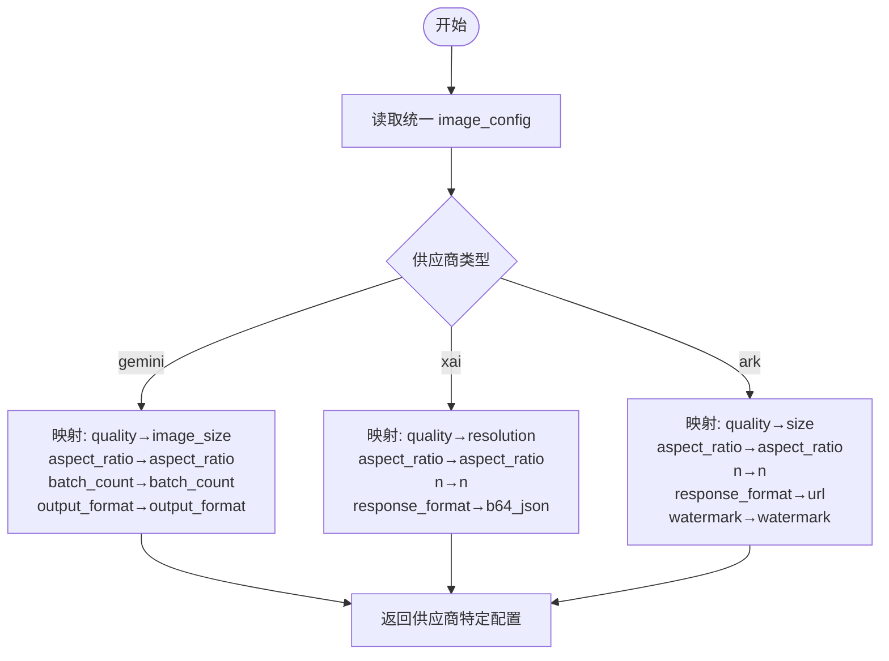
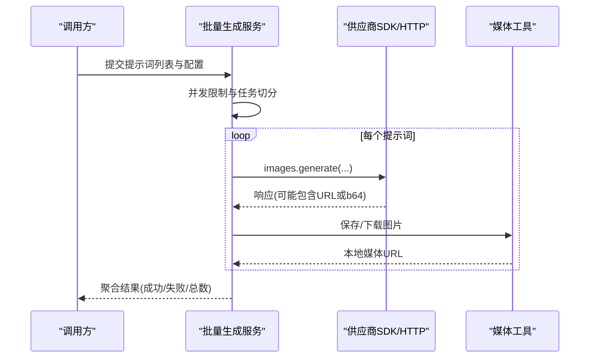
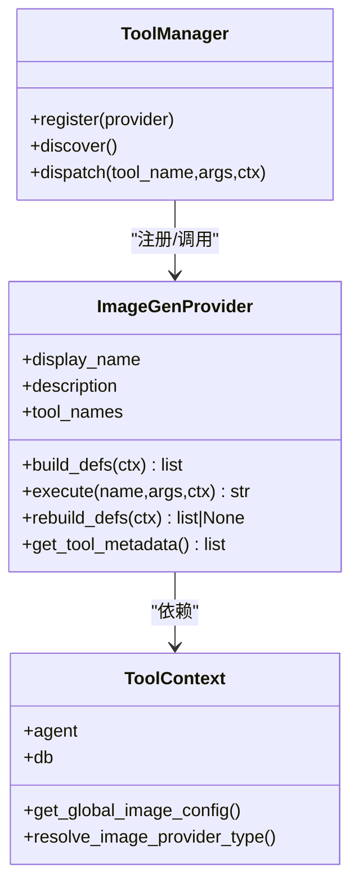
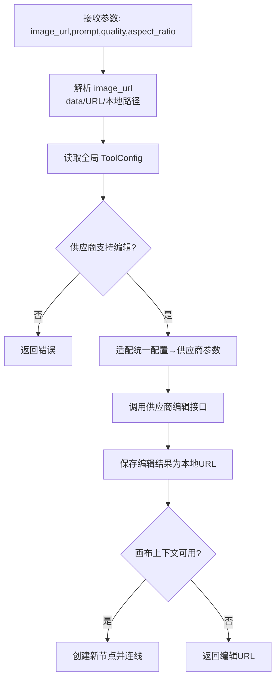
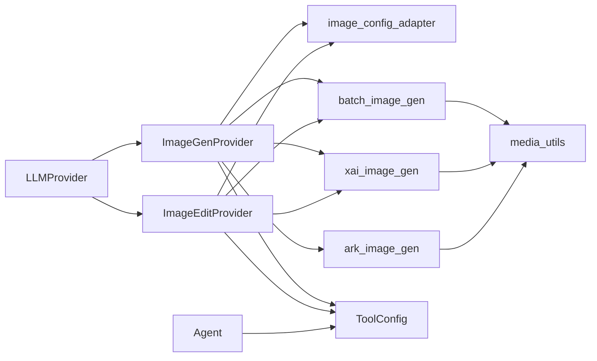

# 图像生成服务

<cite>
**本文引用的文件**
- [image_config_adapter.py](file://backend/services/image_config_adapter.py)
- [xai_image_gen.py](file://backend/services/xai_image_gen.py)
- [ark_image_gen.py](file://backend/services/ark_image_gen.py)
- [batch_image_gen.py](file://backend/services/batch_image_gen.py)
- [image_gen.py](file://backend/services/tool_manager/providers/image_gen.py)
- [image_edit.py](file://backend/services/tool_manager/providers/image_edit.py)
- [media_utils.py](file://backend/services/media_utils.py)
- [models.py](file://backend/models.py)
- [xai_provider.py](file://backend/services/video_providers/xai_provider.py)
- [ImageGenConfigDialog.tsx](file://backend/admin/src/components/admin/tools/ImageGenConfigDialog.tsx)
- [index.ts](file://backend/admin/src/types/index.ts)
- [tool_manager/__init__.py](file://backend/services/tool_manager/__init__.py)
</cite>

## 目录
1. [简介](#简介)
2. [项目结构](#项目结构)
3. [核心组件](#核心组件)
4. [架构总览](#架构总览)
5. [详细组件分析](#详细组件分析)
6. [依赖分析](#依赖分析)
7. [性能考虑](#性能考虑)
8. [故障排除指南](#故障排除指南)
9. [结论](#结论)
10. [附录](#附录)

## 简介
本文件面向“图像生成服务”的使用者与维护者，系统性阐述多供应商图像生成与编辑的统一架构与实现细节。服务覆盖以下能力：
- 统一配置适配器：将“供应商无关”的统一图像配置映射到 xAI、Gemini、火山方舟等供应商的具体参数。
- 多供应商图像生成：支持并行批量生成，统一错误处理与结果聚合。
- 图像编辑工具：基于全局配置，按供应商差异进行参数提取与调用。
- 管理端配置界面：可视化设置全局图像生成参数（供应商、模型、宽高比、质量、批量数、输出格式等）。

## 项目结构
后端采用模块化分层设计：
- 服务层：图像生成与编辑的核心逻辑（批量生成、适配器、媒体工具等）。
- 工具管理：统一的工具注册、发现与执行框架，负责将工具定义注入到智能体。
- 数据模型：Agent、LLMProvider、ToolConfig 等，承载全局配置与供应商信息。
- 管理端前端：提供图像生成工具的可视化配置对话框。

图表来源
- [tool_manager/__init__.py:1-31](file://backend/services/tool_manager/__init__.py#L1-L31)
- [image_gen.py:1-328](file://backend/services/tool_manager/providers/image_gen.py#L1-L328)
- [image_edit.py:1-581](file://backend/services/tool_manager/providers/image_edit.py#L1-L581)
- [image_config_adapter.py:1-250](file://backend/services/image_config_adapter.py#L1-L250)
- [batch_image_gen.py:1-187](file://backend/services/batch_image_gen.py#L1-L187)
- [xai_image_gen.py:1-191](file://backend/services/xai_image_gen.py#L1-L191)
- [ark_image_gen.py:1-185](file://backend/services/ark_image_gen.py#L1-L185)
- [media_utils.py:1-79](file://backend/services/media_utils.py#L1-L79)
- [models.py:210-272](file://backend/models.py#L210-L272)
- [ImageGenConfigDialog.tsx:42-152](file://backend/admin/src/components/admin/tools/ImageGenConfigDialog.tsx#L42-L152)
- [index.ts:334-362](file://backend/admin/src/types/index.ts#L334-L362)

章节来源
- [tool_manager/__init__.py:1-31](file://backend/services/tool_manager/__init__.py#L1-L31)
- [models.py:210-272](file://backend/models.py#L210-L272)

## 核心组件
- 统一配置适配器：将统一的 image_config 映射为各供应商期望的参数键名与取值范围，避免 if-else 分支。
- 批量生成服务：
  - Gemini：使用 Google GenAI SDK，支持并行与令牌统计。
  - xAI：使用 OpenAI 兼容客户端，支持并行与响应格式选择。
  - 火山方舟：使用 OpenAI 兼容客户端，支持水印与尺寸参数。
- 工具提供者：
  - ImageGenProvider：动态构建工具定义，按全局配置路由到具体供应商处理器。
  - ImageEditProvider：支持编辑现有图片，自动解析本地/远程图片 URL，按供应商提取参数。
- 媒体工具：统一保存内联图片与下载远端图片，生成可访问的本地媒体 URL。
- 数据模型：Agent 持有统一 image_config 与历史遗留配置；ToolConfig 持有全局图像生成配置。

章节来源
- [image_config_adapter.py:1-250](file://backend/services/image_config_adapter.py#L1-L250)
- [batch_image_gen.py:1-187](file://backend/services/batch_image_gen.py#L1-L187)
- [xai_image_gen.py:1-191](file://backend/services/xai_image_gen.py#L1-L191)
- [ark_image_gen.py:1-185](file://backend/services/ark_image_gen.py#L1-L185)
- [image_gen.py:1-328](file://backend/services/tool_manager/providers/image_gen.py#L1-L328)
- [image_edit.py:1-581](file://backend/services/tool_manager/providers/image_edit.py#L1-L581)
- [media_utils.py:1-79](file://backend/services/media_utils.py#L1-L79)
- [models.py:210-272](file://backend/models.py#L210-L272)

## 架构总览
统一配置适配器作为“协议转换层”，将“供应商无关”的 image_config 转换为各供应商期望的参数集合；工具提供者负责读取全局 ToolConfig，结合 Agent 级别的开关，动态构建工具定义并分发到对应的生成/编辑处理器；处理器通过 OpenAI 或 Google SDK 发起异步批量请求，并将结果统一保存为本地媒体 URL。

图表来源
- [image_gen.py:203-270](file://backend/services/tool_manager/providers/image_gen.py#L203-L270)
- [image_config_adapter.py:173-184](file://backend/services/image_config_adapter.py#L173-L184)
- [batch_image_gen.py:113-186](file://backend/services/batch_image_gen.py#L113-L186)
- [xai_image_gen.py:125-191](file://backend/services/xai_image_gen.py#L125-L191)
- [ark_image_gen.py:119-185](file://backend/services/ark_image_gen.py#L119-L185)
- [media_utils.py:20-79](file://backend/services/media_utils.py#L20-L79)

## 详细组件分析

### 统一配置适配器（image_config_adapter）
- 设计要点
  - 使用映射表与注册表替代条件分支，确保新增供应商只需扩展映射与适配函数。
  - 提供统一的能力描述（支持的宽高比、质量等级、输出格式、最大批量数）。
  - 提供“统一配置 → 供应商特定配置”的转换函数，以及“合并遗留配置”的策略。
- 关键映射
  - 质量到尺寸映射：不同供应商以不同单位表达（如 1k/2k vs 1K/2K/4K）。
  - 批量参数映射：Gemini 使用 batch_count，xAI/火山方舟使用 n。
  - 输出格式支持：xAI/火山方舟不支持用户指定输出格式，适配器会强制默认值。
- 适配流程
  - 输入统一 image_config 与供应商类型，输出供应商特定的 image_config。
  - 在工具执行阶段，允许用户参数覆盖统一配置中的 aspect_ratio 等字段。

图表来源
- [image_config_adapter.py:12-170](file://backend/services/image_config_adapter.py#L12-L170)

章节来源
- [image_config_adapter.py:1-250](file://backend/services/image_config_adapter.py#L1-L250)

### 批量生成服务（Gemini/xAI/火山方舟）
- Gemini 批量生成
  - 使用 Google GenAI SDK，支持并行与令牌统计；支持自动/固定宽高比与尺寸映射。
  - 通过异步语义化并发控制，聚合结果并记录成功/失败计数。
- xAI 批量生成
  - 使用 OpenAI 兼容客户端，支持并行与响应格式（b64_json/url）；通过 extra_body 传递 aspect_ratio 与 resolution。
  - 保存内联图片或下载远端 URL，统一返回本地媒体 URL。
- 火山方舟批量生成
  - 使用 OpenAI 兼容客户端，支持并行与水印、尺寸参数；通过 extra_body 传递 size 与 watermark。
  - 保存内联图片或下载远端 URL，统一返回本地媒体 URL。

图表来源
- [batch_image_gen.py:113-186](file://backend/services/batch_image_gen.py#L113-L186)
- [xai_image_gen.py:125-191](file://backend/services/xai_image_gen.py#L125-L191)
- [ark_image_gen.py:119-185](file://backend/services/ark_image_gen.py#L119-L185)
- [media_utils.py:20-79](file://backend/services/media_utils.py#L20-L79)

章节来源
- [batch_image_gen.py:1-187](file://backend/services/batch_image_gen.py#L1-L187)
- [xai_image_gen.py:1-191](file://backend/services/xai_image_gen.py#L1-L191)
- [ark_image_gen.py:1-185](file://backend/services/ark_image_gen.py#L1-L185)
- [media_utils.py:1-79](file://backend/services/media_utils.py#L1-L79)

### 图像生成工具（ImageGenProvider）
- 动态工具定义：根据当前全局配置与供应商能力，构建工具参数枚举（宽高比、质量等级、批量数上限）。
- 执行流程：
  - 从 ToolConfig 读取全局配置（供应商、模型、统一 image_config）。
  - 通过适配器转换为供应商特定参数，允许用户参数覆盖。
  - 调用对应处理器（Gemini/xAI/火山方舟），聚合结果并返回 Markdown 图片链接。
- 兼容性策略：
  - 优先使用统一 image_config；若未启用，则回退到 Agent 历史配置（gemini_config/xai_image_config）。
  - 对于 Gemini，n 通过复制提示词实现批量；对于 xAI/火山方舟，使用 n 参数。

图表来源
- [image_gen.py:276-328](file://backend/services/tool_manager/providers/image_gen.py#L276-L328)
- [tool_manager/__init__.py:1-31](file://backend/services/tool_manager/__init__.py#L1-L31)

章节来源
- [image_gen.py:1-328](file://backend/services/tool_manager/providers/image_gen.py#L1-L328)

### 图像编辑工具（ImageEditProvider）
- 能力范围：支持 xAI 与 Gemini 的图片编辑端点；编辑后可自动在画布上创建新节点并连线，保留原图。
- URL 解析：支持 data URL、公开 URL、/api/media 路径与纯文件名，自动转换为供应商可接受的输入。
- 参数提取：根据供应商类型从统一配置中提取供应商特定参数（如 xAI 的 resolution、Gemini 的 image_size）。
- 结果处理：将编辑后的图片保存为本地媒体 URL，优先在画布上下文中创建派生节点。

图表来源
- [image_edit.py:435-518](file://backend/services/tool_manager/providers/image_edit.py#L435-L518)

章节来源
- [image_edit.py:1-581](file://backend/services/tool_manager/providers/image_edit.py#L1-L581)

### 媒体工具（media_utils）
- 保存内联图片：根据 MIME 类型推断扩展名，写入媒体目录并返回 /api/media/{uuid}.{ext}。
- 从 URL 下载图片：通过 HTTP 客户端下载并保存，自动推断 MIME 类型。
- 保存视频：支持从远端 URL 下载视频并保存为本地媒体文件。

章节来源
- [media_utils.py:1-79](file://backend/services/media_utils.py#L1-L79)

### 数据模型与全局配置
- Agent 模型
  - image_config：统一图像生成配置（优先级最高）。
  - xai_image_config：xAI 图像生成专属配置。
  - gemini_config：Gemini 图像生成专属配置。
- ToolConfig
  - 全局图像生成工具配置（generate_image），包含供应商 ID、模型、统一 image_config 等。
- 迁移与演进
  - 新增统一 image_config 字段，逐步替代历史遗留配置。

章节来源
- [models.py:210-272](file://backend/models.py#L210-L272)
- [models.py:252-263](file://backend/models.py#L252-L263)

### 管理端配置（ImageGenConfigDialog）
- 功能概览：启用/禁用全局图像生成；选择供应商与模型；设置统一 image_config（宽高比、质量、批量数、输出格式）。
- 能力联动：根据所选供应商类型，动态展示其支持的宽高比、质量等级与批量上限。
- 保存行为：将配置写入 ToolConfig，供工具执行时读取。

章节来源
- [ImageGenConfigDialog.tsx:42-152](file://backend/admin/src/components/admin/tools/ImageGenConfigDialog.tsx#L42-L152)
- [index.ts:334-362](file://backend/admin/src/types/index.ts#L334-L362)

## 依赖分析
- 组件耦合
  - ImageGenProvider 与 ImageEditProvider 依赖 ToolContext 与 ToolConfig，解耦于具体供应商实现。
  - 配置适配器独立于供应商 SDK，便于扩展新供应商。
  - 媒体工具被各生成/编辑服务复用，职责单一。
- 外部依赖
  - Gemini：Google GenAI SDK。
  - xAI：OpenAI 兼容客户端。
  - 火山方舟：OpenAI 兼容客户端（协议兼容）。
- 循环依赖
  - 未见循环导入；工具提供者通过 ToolManager 注册，避免直接相互引用。

图表来源
- [image_gen.py:1-328](file://backend/services/tool_manager/providers/image_gen.py#L1-L328)
- [image_edit.py:1-581](file://backend/services/tool_manager/providers/image_edit.py#L1-L581)
- [image_config_adapter.py:1-250](file://backend/services/image_config_adapter.py#L1-L250)
- [batch_image_gen.py:1-187](file://backend/services/batch_image_gen.py#L1-L187)
- [xai_image_gen.py:1-191](file://backend/services/xai_image_gen.py#L1-L191)
- [ark_image_gen.py:1-185](file://backend/services/ark_image_gen.py#L1-L185)
- [media_utils.py:1-79](file://backend/services/media_utils.py#L1-L79)
- [models.py:210-272](file://backend/models.py#L210-L272)

章节来源
- [image_gen.py:1-328](file://backend/services/tool_manager/providers/image_gen.py#L1-L328)
- [image_edit.py:1-581](file://backend/services/tool_manager/providers/image_edit.py#L1-L581)
- [models.py:210-272](file://backend/models.py#L210-L272)

## 性能考虑
- 并发控制
  - 批量生成均采用信号量限制最大并发数，避免超卖与限流。
  - 建议根据供应商速率限制与网络状况调整并发度。
- 结果聚合
  - 统一记录成功/失败计数与总图片数，便于监控与重试策略。
- 媒体保存
  - 本地媒体文件按 UUID 命名，避免冲突；建议定期清理过期文件。
- 令牌与成本
  - Gemini 批量生成提供令牌统计，可用于成本估算与预算控制。

## 故障排除指南
- 常见问题
  - 供应商不可用：确认 LLMProvider 记录存在且 is_active 为真。
  - 工具未注入：检查 Agent 的 image_generation_enabled 开关与 ToolConfig 的全局开关。
  - 参数不合法：统一配置中的 aspect_ratio/quality/batch_count 必须在供应商支持范围内。
  - 编辑无结果：检查供应商内容审核策略与网络可达性。
- 定位步骤
  - 查看工具执行日志，定位失败任务索引与错误信息。
  - 核对 ToolConfig 与 Agent 的 image_config 是否正确下发至适配器。
  - 验证媒体目录权限与磁盘空间。
- 优化建议
  - 为高并发场景增加重试与指数退避。
  - 对于 xAI/Gemini，合理设置 n 与并发度以平衡吞吐与成本。
  - 对于火山方舟，关注水印与尺寸参数对输出质量的影响。

章节来源
- [image_gen.py:250-270](file://backend/services/tool_manager/providers/image_gen.py#L250-L270)
- [image_edit.py:435-518](file://backend/services/tool_manager/providers/image_edit.py#L435-L518)
- [media_utils.py:1-79](file://backend/services/media_utils.py#L1-L79)

## 结论
该图像生成服务通过“统一配置适配器 + 工具管理 + 批量生成服务”的分层设计，实现了多供应商的统一接入与参数映射，具备良好的可扩展性与可维护性。配合管理端可视化配置与工具定义动态构建，能够快速适配新的供应商与参数需求。

## 附录

### API 调用示例（路径指引）
- 生成图片（工具调用）
  - 路径：[image_gen.py:203-270](file://backend/services/tool_manager/providers/image_gen.py#L203-L270)
  - 关键步骤：读取 ToolConfig → 适配统一配置 → 调用供应商生成 → 保存媒体 → 返回 Markdown 链接
- 编辑图片（工具调用）
  - 路径：[image_edit.py:435-518](file://backend/services/tool_manager/providers/image_edit.py#L435-L518)
  - 关键步骤：解析 image_url → 读取 ToolConfig → 适配参数 → 调用供应商编辑 → 保存媒体 → 可选创建画布节点
- 批量生成（Gemini）
  - 路径：[batch_image_gen.py:113-186](file://backend/services/batch_image_gen.py#L113-L186)
- 批量生成（xAI）
  - 路径：[xai_image_gen.py:125-191](file://backend/services/xai_image_gen.py#L125-L191)
- 批量生成（火山方舟）
  - 路径：[ark_image_gen.py:119-185](file://backend/services/ark_image_gen.py#L119-L185)

### 配置项说明（全局 ToolConfig）
- image_generation_enabled：是否启用全局图像生成。
- image_provider_id：供应商 ID（关联 LLMProvider）。
- image_model：供应商模型名称。
- image_config：统一图像生成配置（包含 aspect_ratio、quality、batch_count、output_format 等）。

章节来源
- [models.py:252-263](file://backend/models.py#L252-L263)
- [ImageGenConfigDialog.tsx:106-116](file://backend/admin/src/components/admin/tools/ImageGenConfigDialog.tsx#L106-L116)