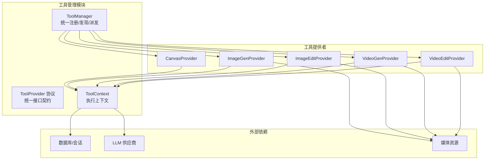
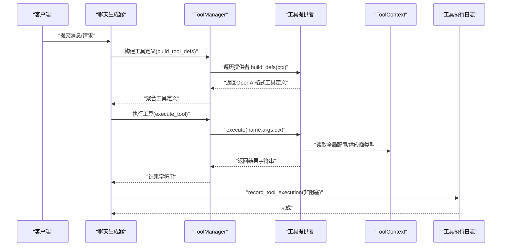
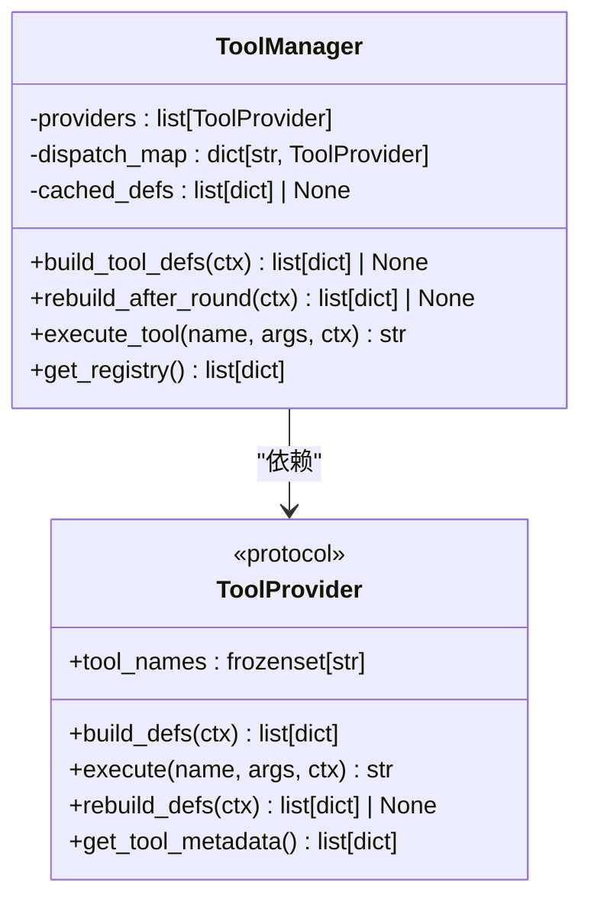
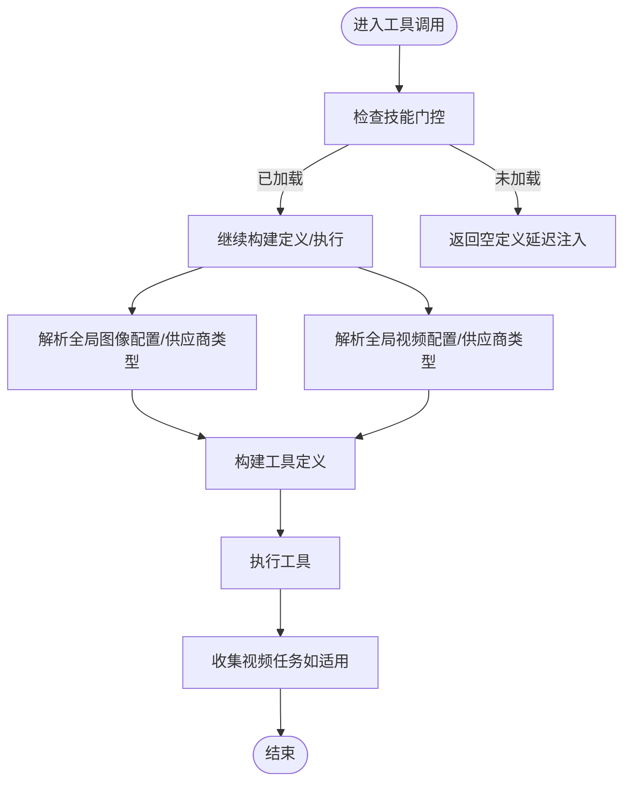
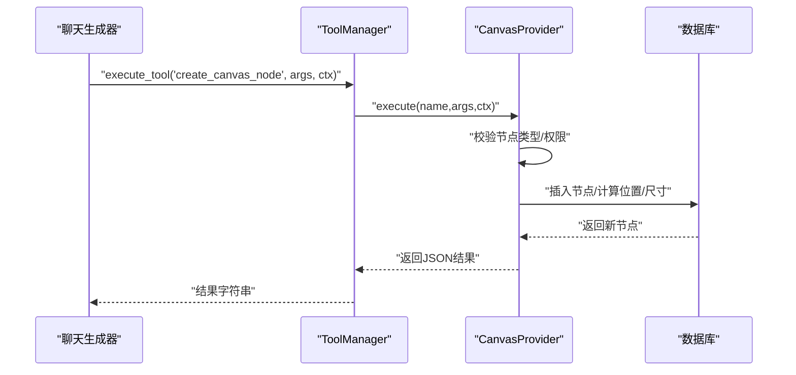
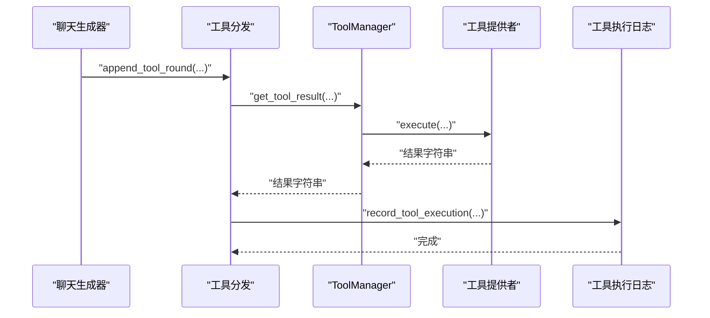
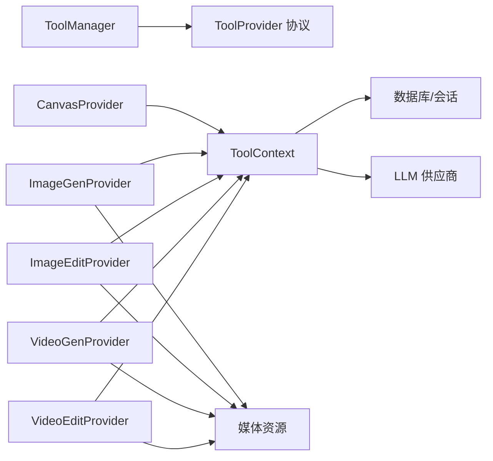

# 工具管理系统

<cite>
**本文引用的文件**
- [backend/services/tool_manager/manager.py](file://backend/services/tool_manager/manager.py)
- [backend/services/tool_manager/context.py](file://backend/services/tool_manager/context.py)
- [backend/services/tool_manager/protocol.py](file://backend/services/tool_manager/protocol.py)
- [backend/services/tool_manager/__init__.py](file://backend/services/tool_manager/__init__.py)
- [backend/services/tool_manager/providers/__init__.py](file://backend/services/tool_manager/providers/__init__.py)
- [backend/services/tool_manager/providers/canvas.py](file://backend/services/tool_manager/providers/canvas.py)
- [backend/services/tool_manager/providers/image_gen.py](file://backend/services/tool_manager/providers/image_gen.py)
- [backend/services/tool_manager/providers/image_edit.py](file://backend/services/tool_manager/providers/image_edit.py)
- [backend/services/tool_manager/providers/video_gen.py](file://backend/services/tool_manager/providers/video_gen.py)
- [backend/services/tool_manager/providers/video_edit.py](file://backend/services/tool_manager/providers/video_edit.py)
- [backend/services/chat_tool_dispatch.py](file://backend/services/chat_tool_dispatch.py)
- [backend/services/chat_generation.py](file://backend/services/chat_generation.py)
- [backend/services/tool_execution_logger.py](file://backend/services/tool_execution_logger.py)
- [backend/routers/admin_tools.py](file://backend/routers/admin_tools.py)
- [backend/models.py](file://backend/models.py)
</cite>

## 目录
1. [简介](#简介)
2. [项目结构](#项目结构)
3. [核心组件](#核心组件)
4. [架构总览](#架构总览)
5. [详细组件分析](#详细组件分析)
6. [依赖分析](#依赖分析)
7. [性能考虑](#性能考虑)
8. [故障排查指南](#故障排查指南)
9. [结论](#结论)
10. [附录](#附录)

## 简介
本文件面向“工具管理系统”，聚焦于AI工具调用系统的架构设计与实现细节，涵盖：
- 工具注册机制与协议适配层
- 执行上下文管理（ToolContext）
- ToolManager核心功能、工具执行流程与日志记录
- 工具开发示例、上下文传递机制与错误处理策略
- 如何扩展新的工具类型、配置工具参数与监控工具执行状态
- 实际代码示例路径与工具开发最佳实践

## 项目结构
工具管理子系统位于 backend/services/tool_manager，采用“协议 + 提供者 + 管理器”的分层设计：
- 协议层：定义工具提供者必须满足的接口契约
- 提供者层：具体工具类型的实现（画布、图像生成/编辑、视频生成/编辑）
- 管理器层：统一注册、发现与派发工具调用
- 上下文层：贯穿一次请求生命周期的不可变上下文对象
- 路由与日志：对外暴露管理接口、记录工具执行日志

图表来源
- [backend/services/tool_manager/manager.py:23-108](file://backend/services/tool_manager/manager.py#L23-L108)
- [backend/services/tool_manager/protocol.py:11-44](file://backend/services/tool_manager/protocol.py#L11-L44)
- [backend/services/tool_manager/context.py:35-146](file://backend/services/tool_manager/context.py#L35-L146)
- [backend/services/tool_manager/providers/__init__.py:4-26](file://backend/services/tool_manager/providers/__init__.py#L4-L26)

章节来源
- [backend/services/tool_manager/manager.py:1-108](file://backend/services/tool_manager/manager.py#L1-L108)
- [backend/services/tool_manager/context.py:1-146](file://backend/services/tool_manager/context.py#L1-L146)
- [backend/services/tool_manager/protocol.py:1-44](file://backend/services/tool_manager/protocol.py#L1-L44)
- [backend/services/tool_manager/providers/__init__.py:1-26](file://backend/services/tool_manager/providers/__init__.py#L1-L26)

## 核心组件
- ToolProvider 协议：定义工具提供者必须实现的方法（工具名集合、构建工具定义、执行、重建定义、元数据）
- ToolContext：封装一次请求的不可变上下文，包含剧场ID、智能体、数据库会话、日志溯源字段、技能门控、懒加载的全局配置与供应商类型解析
- ToolManager：集中式协调器，负责注册所有提供者、构建工具定义、按名称派发执行、重建定义与管理员注册表导出
- 各类工具提供者：Canvas、ImageGen、ImageEdit、VideoGen、VideoEdit，分别实现对应领域的工具定义与执行逻辑
- 工具执行日志：非阻塞异步写入数据库，记录工具名、提供者名、参数快照、结果摘要、状态与耗时
- 路由与监控：管理员路由提供工具注册表、使用统计、执行日志查询、能力配置与全局工具配置管理

章节来源
- [backend/services/tool_manager/protocol.py:11-44](file://backend/services/tool_manager/protocol.py#L11-L44)
- [backend/services/tool_manager/context.py:35-146](file://backend/services/tool_manager/context.py#L35-L146)
- [backend/services/tool_manager/manager.py:23-108](file://backend/services/tool_manager/manager.py#L23-L108)
- [backend/services/tool_execution_logger.py:1-89](file://backend/services/tool_execution_logger.py#L1-L89)
- [backend/routers/admin_tools.py:1-273](file://backend/routers/admin_tools.py#L1-L273)

## 架构总览
工具调用链路从聊天生成器发起，经过工具定义构建、工具调用派发、提供者执行与结果回写，最终记录到数据库。

图表来源
- [backend/services/chat_generation.py:118-125](file://backend/services/chat_generation.py#L118-L125)
- [backend/services/tool_manager/manager.py:42-91](file://backend/services/tool_manager/manager.py#L42-L91)
- [backend/services/chat_tool_dispatch.py:25-44](file://backend/services/chat_tool_dispatch.py#L25-L44)
- [backend/services/tool_execution_logger.py:77-89](file://backend/services/tool_execution_logger.py#L77-L89)

章节来源
- [backend/services/chat_generation.py:118-125](file://backend/services/chat_generation.py#L118-L125)
- [backend/services/chat_tool_dispatch.py:1-120](file://backend/services/chat_tool_dispatch.py#L1-L120)
- [backend/services/tool_execution_logger.py:1-89](file://backend/services/tool_execution_logger.py#L1-L89)

## 详细组件分析

### ToolManager：统一注册、发现与派发
- 初始化：从注册表加载全部提供者，建立名称到提供者的O(1)映射
- 工具定义构建：遍历提供者，基于上下文构建OpenAI格式工具定义，支持按技能门控与上下文条件启用
- 定义重建：在一轮工具调用结束后，按需重建变更的提供者片段，保持静态提供者缓存
- 执行派发：按名称查找提供者并执行，未知工具返回友好错误
- 管理员注册表：导出提供者与工具元数据，便于后台展示

图表来源
- [backend/services/tool_manager/manager.py:23-108](file://backend/services/tool_manager/manager.py#L23-L108)
- [backend/services/tool_manager/protocol.py:11-44](file://backend/services/tool_manager/protocol.py#L11-L44)

章节来源
- [backend/services/tool_manager/manager.py:23-108](file://backend/services/tool_manager/manager.py#L23-L108)

### ToolContext：执行上下文与技能门控
- 不可变上下文：剧场ID、智能体、数据库会话、日志溯源字段
- 技能门控：维护已加载工具技能集合，支持对画布/图像/视频工具的延迟注入
- 懒加载配置：全局图像/视频配置、图像/视频供应商类型解析（带缓存）
- 事件收集：在工具执行期间收集视频任务，供聊天生成器推送SSE

图表来源
- [backend/services/tool_manager/context.py:67-146](file://backend/services/tool_manager/context.py#L67-L146)

章节来源
- [backend/services/tool_manager/context.py:35-146](file://backend/services/tool_manager/context.py#L35-L146)

### 协议适配层：ToolProvider
- 统一接口：工具名集合、构建定义、执行、重建定义、元数据导出
- OpenAI格式：工具定义遵循function类型，参数枚举按供应商/模型能力动态生成
- 提供者注册：ALL_PROVIDERS集中注册，ToolManager按名称路由

章节来源
- [backend/services/tool_manager/protocol.py:11-44](file://backend/services/tool_manager/protocol.py#L11-L44)
- [backend/services/tool_manager/providers/__init__.py:1-26](file://backend/services/tool_manager/providers/__init__.py#L1-L26)

### 画布工具（CanvasProvider）
- 工具集：列出节点、获取节点、创建节点、更新节点、删除节点
- 节点类型：文本、图像、视频、分镜，支持字段校验与尺寸估算
- 技能门控：canvas_tools技能加载后开放全节点类型，否则按agent.target_node_types限制
- 执行流程：按名称路由到执行器，执行器进行权限校验、数据库操作与日志记录

图表来源
- [backend/services/tool_manager/providers/canvas.py:541-546](file://backend/services/tool_manager/providers/canvas.py#L541-L546)

章节来源
- [backend/services/tool_manager/providers/canvas.py:25-563](file://backend/services/tool_manager/providers/canvas.py#L25-L563)

### 图像生成（ImageGenProvider）
- 供应商适配：xAI、Gemini、Ark，按全局配置与模型能力动态生成参数枚举
- 执行流程：解析全局配置 → 选择供应商 → 参数适配 → 调用批量生成 → 返回Markdown图片链接
- 技能门控：image_tools技能未加载时延迟注入空定义

章节来源
- [backend/services/tool_manager/providers/image_gen.py:1-328](file://backend/services/tool_manager/providers/image_gen.py#L1-L328)

### 图像编辑（ImageEditProvider）
- URL解析：支持data URL、HTTP URL、/api/media路径与本地文件名，自动转换为base64 data URL
- 供应商适配：xAI、Gemini，按全局配置与模型能力动态生成参数
- 自动画布衍生：成功编辑后在画布创建新节点并连线，保留原始节点

章节来源
- [backend/services/tool_manager/providers/image_edit.py:1-581](file://backend/services/tool_manager/providers/image_edit.py#L1-L581)

### 视频生成（VideoGenProvider）
- 异步生成：提交任务即返回任务ID，创建VideoTask记录，供轮询与通知
- 供应商适配：通过视频供应商类型与模型能力动态生成参数枚举
- 本地媒体处理：将本地/api/media路径转换为data URI

章节来源
- [backend/services/tool_manager/providers/video_gen.py:1-342](file://backend/services/tool_manager/providers/video_gen.py#L1-L342)

### 视频编辑/扩展（VideoEditProvider）
- 模式映射：edit/extend映射到供应商内部video_mode
- 能力检测：根据模型能力动态生成可用模式枚举
- 任务提交：创建VideoTask并返回任务ID

章节来源
- [backend/services/tool_manager/providers/video_edit.py:1-286](file://backend/services/tool_manager/providers/video_edit.py#L1-L286)

### 工具执行流程与日志记录
- 调用入口：聊天生成器构建ToolContext与ToolManager，调用工具定义
- 执行派发：chat_tool_dispatch统一派发，记录耗时与状态
- 日志记录：非阻塞异步写入ToolExecution，屏蔽异常不影响主流程

图表来源
- [backend/services/chat_tool_dispatch.py:25-44](file://backend/services/chat_tool_dispatch.py#L25-L44)
- [backend/services/tool_execution_logger.py:77-89](file://backend/services/tool_execution_logger.py#L77-L89)

章节来源
- [backend/services/chat_tool_dispatch.py:1-120](file://backend/services/chat_tool_dispatch.py#L1-L120)
- [backend/services/tool_execution_logger.py:1-89](file://backend/services/tool_execution_logger.py#L1-L89)

## 依赖分析
- 组件耦合：ToolManager依赖ToolProvider协议；各Provider依赖ToolContext；执行日志依赖数据库会话
- 外部依赖：LLM供应商API、媒体资源、数据库ORM模型
- 循环依赖：未见循环导入；提供者通过ToolManager间接交互

图表来源
- [backend/services/tool_manager/manager.py:23-108](file://backend/services/tool_manager/manager.py#L23-L108)
- [backend/services/tool_manager/context.py:35-146](file://backend/services/tool_manager/context.py#L35-L146)
- [backend/services/tool_manager/providers/__init__.py:4-26](file://backend/services/tool_manager/providers/__init__.py#L4-L26)

章节来源
- [backend/services/tool_manager/manager.py:23-108](file://backend/services/tool_manager/manager.py#L23-L108)
- [backend/services/tool_manager/context.py:35-146](file://backend/services/tool_manager/context.py#L35-L146)
- [backend/services/tool_manager/providers/__init__.py:1-26](file://backend/services/tool_manager/providers/__init__.py#L1-L26)

## 性能考虑
- O(1)派发：ToolManager通过名称映射实现常数时间工具派发
- 懒加载：ToolContext对全局配置与供应商类型解析进行缓存，减少重复查询
- 非阻塞日志：工具执行日志使用异步任务写入，避免阻塞主流程
- 定义重建：仅在提供者返回变更时重建，静态提供者复用缓存
- 异步视频任务：视频生成/编辑采用异步提交与轮询，降低实时等待

## 故障排查指南
- 未知工具：execute_tool返回“未知工具”提示，检查工具名称与提供者注册
- 技能门控：若工具未出现，确认agent配置了对应技能且已加载
- 供应商不可用：检查全局工具配置中的供应商ID与状态
- 图像/视频编辑失败：核对图像URL格式、供应商支持能力与全局配置
- 日志缺失：确认非阻塞写入未抛出异常；可通过管理员路由查询执行日志

章节来源
- [backend/services/tool_manager/manager.py:87-91](file://backend/services/tool_manager/manager.py#L87-L91)
- [backend/services/tool_manager/context.py:67-71](file://backend/services/tool_manager/context.py#L67-L71)
- [backend/services/tool_execution_logger.py:74-75](file://backend/services/tool_execution_logger.py#L74-L75)
- [backend/routers/admin_tools.py:135-188](file://backend/routers/admin_tools.py#L135-L188)

## 结论
工具管理系统通过协议抽象、提供者注册与集中式管理器，实现了跨领域工具的统一调度与可观测性。上下文对象贯穿请求生命周期，结合技能门控与全局配置，确保工具能力按需启用。非阻塞日志与异步任务提升了整体性能与稳定性。管理员路由提供了完善的监控与配置能力，便于运维与审计。

## 附录

### 工具开发示例（步骤指引）
- 实现ToolProvider接口：定义tool_names、build_defs、execute、rebuild_defs、get_tool_metadata
- 在providers/__init__.py中注册实例
- 在chat_tool_dispatch中按需处理特殊工具（如load_skill）
- 使用ToolContext读取全局配置与供应商类型
- 记录执行日志：调用record_tool_execution，确保参数敏感信息被清理

章节来源
- [backend/services/tool_manager/protocol.py:11-44](file://backend/services/tool_manager/protocol.py#L11-L44)
- [backend/services/tool_manager/providers/__init__.py:1-26](file://backend/services/tool_manager/providers/__init__.py#L1-L26)
- [backend/services/chat_tool_dispatch.py:46-53](file://backend/services/chat_tool_dispatch.py#L46-L53)
- [backend/services/tool_execution_logger.py:39-42](file://backend/services/tool_execution_logger.py#L39-L42)

### 上下文传递机制
- ToolContext在聊天生成器中创建并传递给ToolManager与各Provider
- 包含剧场ID、智能体、数据库会话、日志溯源字段
- 通过懒加载方法解析全局配置与供应商类型，避免重复查询

章节来源
- [backend/services/chat_generation.py:118-125](file://backend/services/chat_generation.py#L118-L125)
- [backend/services/tool_manager/context.py:35-146](file://backend/services/tool_manager/context.py#L35-L146)

### 错误处理策略
- 提供者内部捕获异常并返回结构化错误信息
- ToolManager在未知工具时返回明确提示
- 工具执行日志记录状态与错误信息，便于追踪

章节来源
- [backend/services/tool_manager/providers/canvas.py:504-507](file://backend/services/tool_manager/providers/canvas.py#L504-L507)
- [backend/services/tool_manager/providers/image_gen.py:260-263](file://backend/services/tool_manager/providers/image_gen.py#L260-L263)
- [backend/services/tool_manager/manager.py:87-91](file://backend/services/tool_manager/manager.py#L87-L91)
- [backend/services/tool_execution_logger.py:74-75](file://backend/services/tool_execution_logger.py#L74-L75)

### 扩展新的工具类型
- 新建提供者类，实现ToolProvider协议
- 在ALL_PROVIDERS中注册
- 在chat_tool_dispatch中处理特殊逻辑（如技能加载）
- 通过ToolContext读取全局配置与能力，动态生成工具定义
- 使用record_tool_execution记录执行日志

章节来源
- [backend/services/tool_manager/providers/__init__.py:1-26](file://backend/services/tool_manager/providers/__init__.py#L1-L26)
- [backend/services/chat_tool_dispatch.py:46-53](file://backend/services/chat_tool_dispatch.py#L46-L53)
- [backend/services/tool_execution_logger.py:77-89](file://backend/services/tool_execution_logger.py#L77-L89)

### 配置工具参数
- 全局工具配置：ToolConfig表，按工具名存储配置字典
- 供应商能力：图像/视频供应商能力映射，动态影响参数枚举
- 管理员路由：提供配置查询与更新接口

章节来源
- [backend/routers/admin_tools.py:218-273](file://backend/routers/admin_tools.py#L218-L273)
- [backend/services/tool_manager/providers/image_gen.py:116-123](file://backend/services/tool_manager/providers/image_gen.py#L116-L123)
- [backend/services/tool_manager/providers/video_gen.py:161-168](file://backend/services/tool_manager/providers/video_gen.py#L161-L168)

### 监控工具执行状态
- 管理员路由：工具注册表、使用统计、执行日志分页查询
- 数据模型：ToolExecution记录工具调用的完整轨迹
- 能力查询：图像/视频供应商能力接口

章节来源
- [backend/routers/admin_tools.py:29-36](file://backend/routers/admin_tools.py#L29-L36)
- [backend/routers/admin_tools.py:74-129](file://backend/routers/admin_tools.py#L74-L129)
- [backend/routers/admin_tools.py:135-188](file://backend/routers/admin_tools.py#L135-L188)
- [backend/routers/admin_tools.py:194-212](file://backend/routers/admin_tools.py#L194-L212)
- [backend/models.py:1-200](file://backend/models.py#L1-L200)