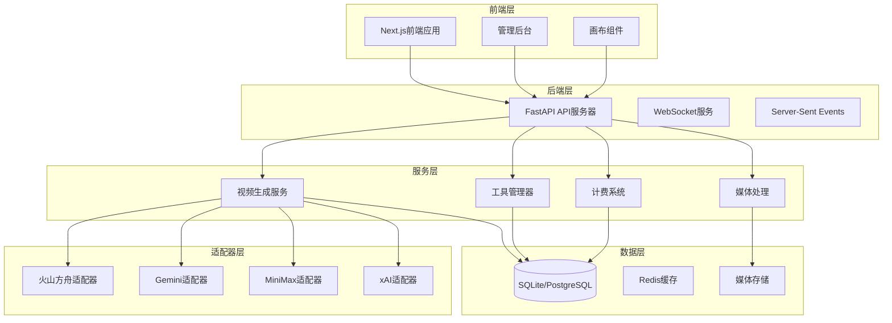
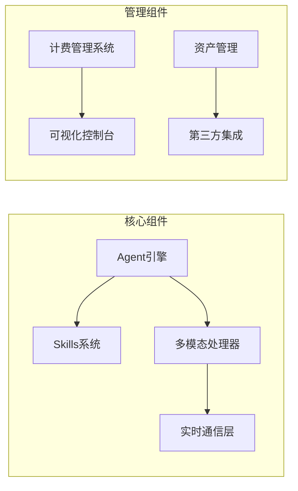
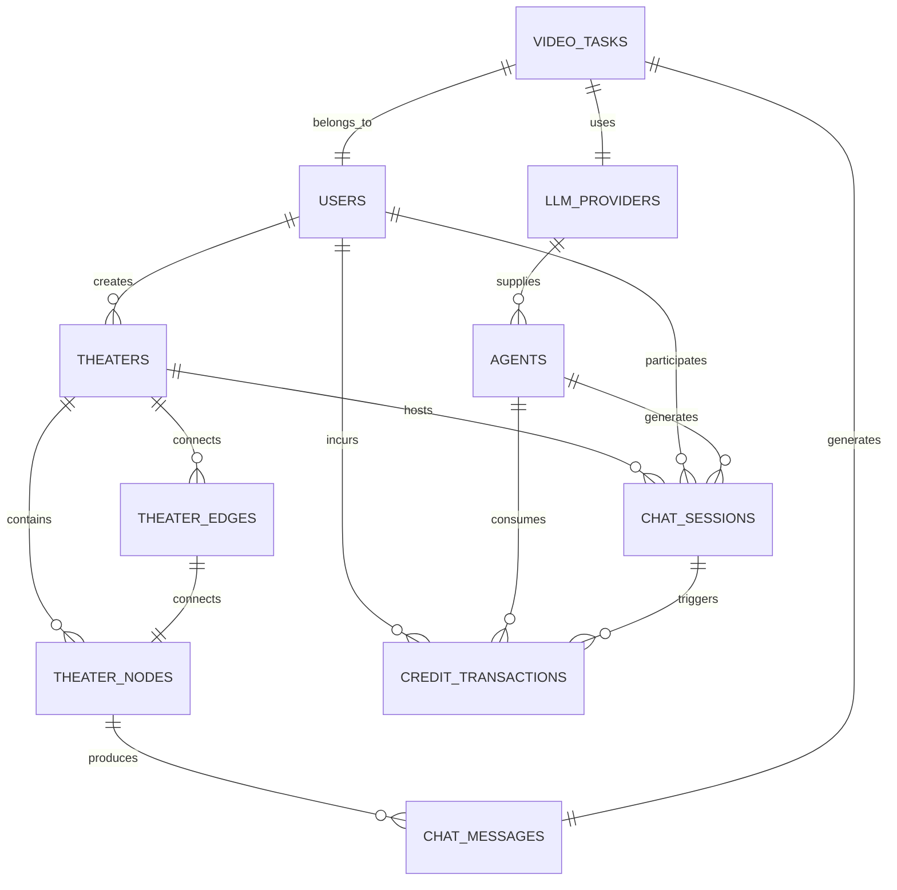
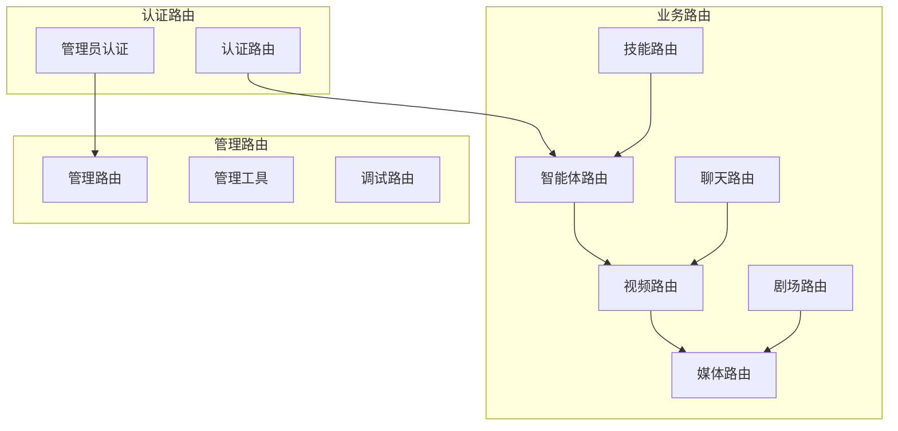
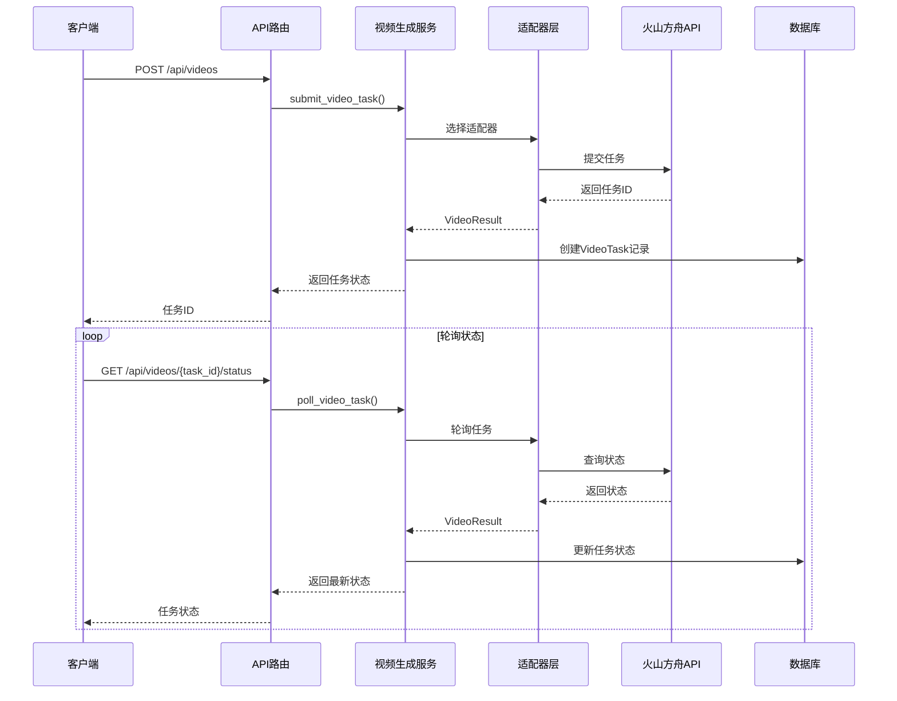
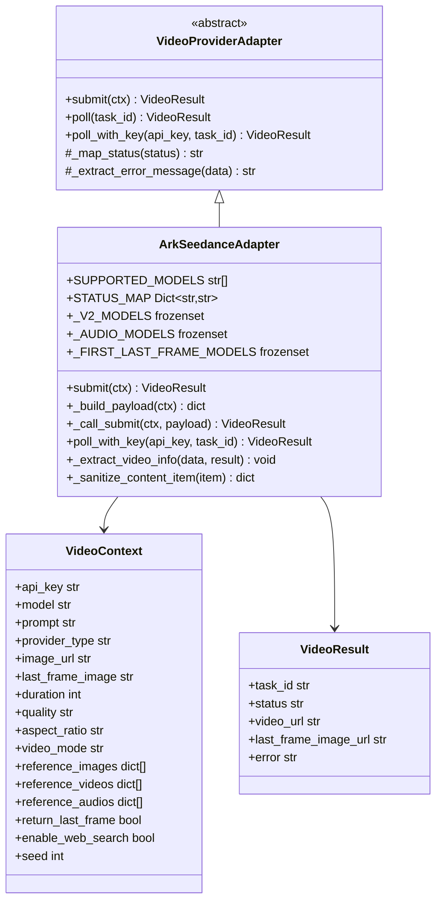
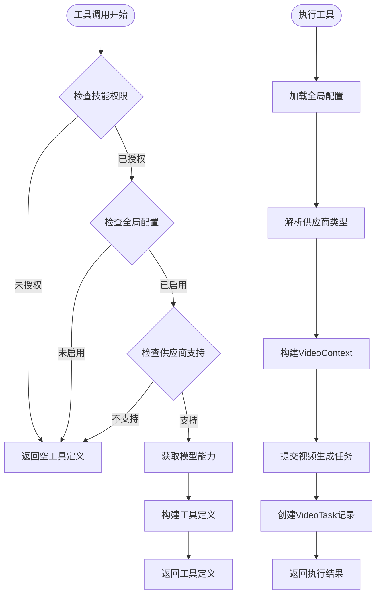
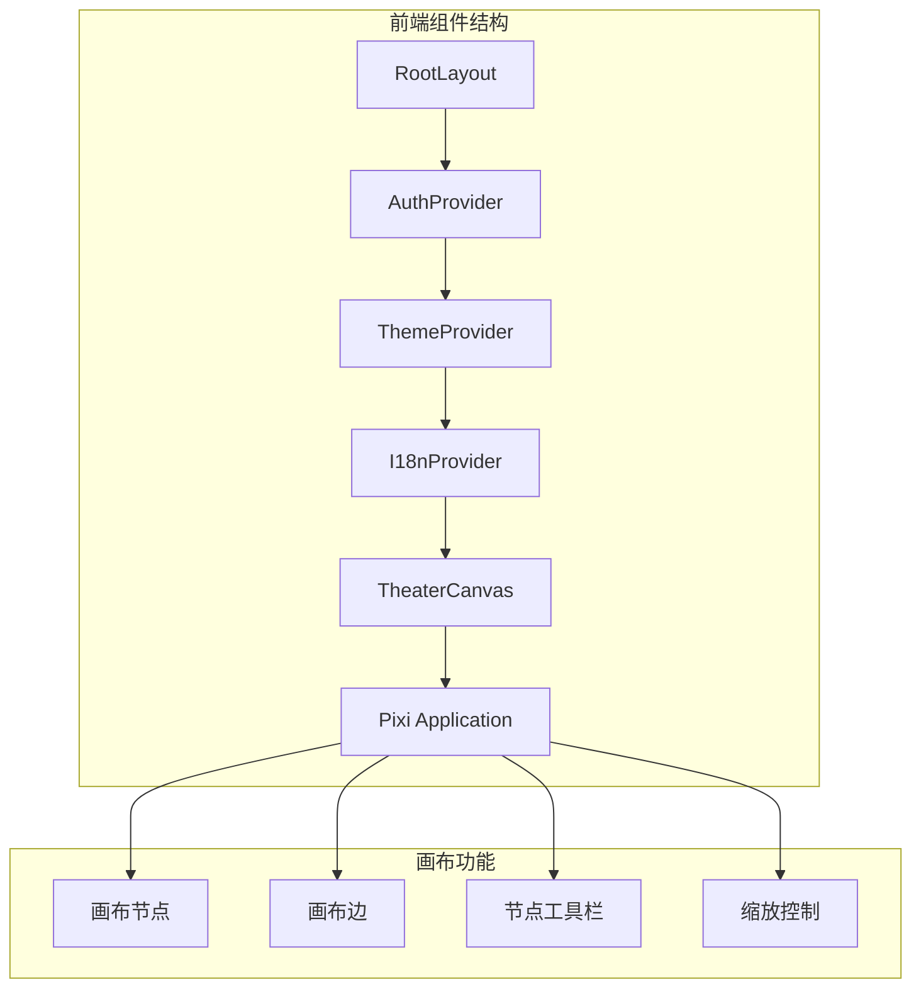
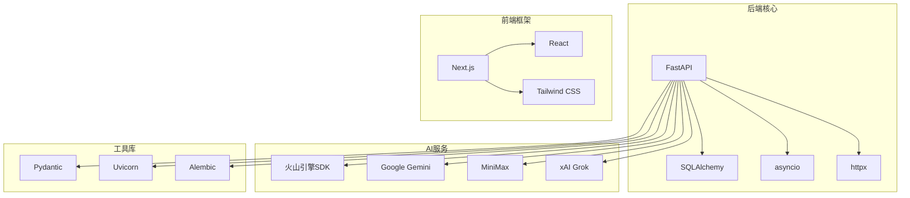
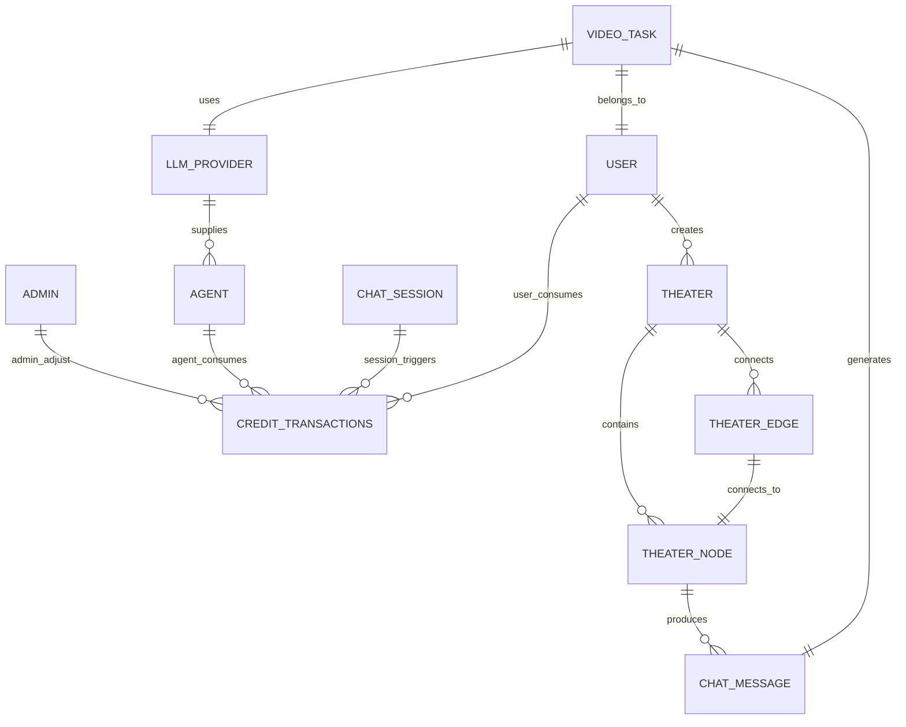

# 火山方舟Seedance 2.0系列模型教程

<cite>
**本文档引用的文件**
- [main.py](file://backend/main.py)
- [config.py](file://backend/config.py)
- [models.py](file://backend/models.py)
- [database.py](file://backend/database.py)
- [schemas.py](file://backend/schemas.py)
- [agents.py](file://backend/routers/agents.py)
- [videos.py](file://backend/routers/videos.py)
- [video_generation.py](file://backend/services/video_generation.py)
- [video_gen.py](file://backend/services/tool_manager/providers/video_gen.py)
- [model_capabilities.py](file://backend/services/video_providers/model_capabilities.py)
- [ark_provider.py](file://backend/services/video_providers/ark_provider.py)
- [README.md](file://README.md)
- [火山方舟seedance2.0官方文档.md](file://火山方舟seedance2.0官方文档.md)
- [火山方舟seedance2.0系列模型教程.md](file://火山方舟seedance2.0系列模型教程.md)
- [layout.tsx](file://frontend/src/app/layout.tsx)
- [TheaterCanvas.tsx](file://frontend/src/components/TheaterCanvas.tsx)
</cite>

## 目录
1. [项目概述](#项目概述)
2. [系统架构](#系统架构)
3. [核心组件](#核心组件)
4. [架构概览](#架构概览)
5. [详细组件分析](#详细组件分析)
6. [依赖关系分析](#依赖关系分析)
7. [性能考虑](#性能考虑)
8. [故障排除指南](#故障排除指南)
9. [结论](#结论)

## 项目概述

KunFlix是一个专注于影视广告的AI内容创作Agent平台，将剧本写作、角色设计、视音频生成、资产管理和智能剪辑全链路打通。该项目基于火山方舟Seedance 2.0系列模型，提供了强大的视频生成能力。

### 核心特性

- **无限画布**：人机协作或由智能体创作，无需人工干预
- **多Agent协作**：对话驱动的多智能体协作，复杂任务化繁为简  
- **Skills系统**：内置专用Skills，支持自定义扩展
- **全链路多模态**：剧本 → 角色 → 视音频 → 成片的无缝转化
- **智能计费**：基于积分的精细化消费，灵活定价
- **可视化管理**：完整的用户管理、Agent监控、数据分析

### 技术架构

**图表来源**
- [main.py:110-180](file://backend/main.py#L110-L180)
- [video_generation.py:1-180](file://backend/services/video_generation.py#L1-L180)
- [ark_provider.py:1-357](file://backend/services/video_providers/ark_provider.py#L1-L357)

**章节来源**
- [README.md:22-131](file://README.md#L22-L131)

## 系统架构

### 核心技术栈

- **后端框架**：Python 3.10+ + FastAPI 0.100+
- **AI编排**：AgentScope多智能体框架
- **数据库**：SQLite (开发) / PostgreSQL (生产) + SQLAlchemy
- **前端框架**：Next.js 16 + TypeScript + Tailwind CSS
- **实时通信**：WebSocket + Server-Sent Events
- **状态管理**：Zustand + React Context

### 系统组件

**图表来源**
- [README.md:121-131](file://README.md#L121-L131)

**章节来源**
- [README.md:86-119](file://README.md#L86-L119)

## 核心组件

### 数据模型架构

系统采用SQLAlchemy ORM设计，支持多种数据模型：

**图表来源**
- [models.py:1-506](file://backend/models.py#L1-L506)

### API路由架构

**图表来源**
- [main.py:143-158](file://backend/main.py#L143-L158)

**章节来源**
- [models.py:1-506](file://backend/models.py#L1-L506)
- [main.py:143-158](file://backend/main.py#L143-L158)

## 架构概览

### 视频生成系统架构

**图表来源**
- [videos.py:75-238](file://backend/routers/videos.py#L75-L238)
- [video_generation.py:90-126](file://backend/services/video_generation.py#L90-L126)
- [ark_provider.py:198-253](file://backend/services/video_providers/ark_provider.py#L198-L253)

### Seedance 2.0模型能力矩阵

| 模型能力 | Seedance 2.0 | Seedance 2.0 Fast | Seedance 1.5 Pro | Seedance 1.0 Pro |
|---------|-------------|------------------|-----------------|-----------------|
| 文生视频 | ✓ | ✓ | ✓ | ✓ |
| 图生视频-首帧 | ✓ | ✓ | ✓ | ✓ |
| 图生视频-首尾帧 | ✓ | ✓ | ✓ | ✓ |
| 多模态参考 | ✓ | ✓ | - | - |
| 编辑视频 | ✓ | ✓ | - | - |
| 延长视频 | ✓ | ✓ | - | - |
| 有声视频 | ✓ | ✓ | ✓ | - |
| 返回尾帧 | ✓ | ✓ | - | - |
| 输出分辨率 | 480p/720p | 480p/720p | 480p/720p/1080p | 480p/720p/1080p |
| 输出时长 | 4-15秒 | 4-15秒 | 4-12秒 | 2-12秒 |

**图表来源**
- [火山方舟seedance2.0官方文档.md:68-100](file://火山方舟seedance2.0官方文档.md#L68-L100)
- [model_capabilities.py:333-472](file://backend/services/video_providers/model_capabilities.py#L333-L472)

**章节来源**
- [火山方舟seedance2.0官方文档.md:1-637](file://火山方舟seedance2.0官方文档.md#L1-L637)
- [model_capabilities.py:1-491](file://backend/services/video_providers/model_capabilities.py#L1-L491)

## 详细组件分析

### 视频生成适配器

#### ArkSeedanceAdapter实现

**图表来源**
- [ark_provider.py:58-357](file://backend/services/video_providers/ark_provider.py#L58-L357)

#### 支持的输入模式

| 模式 | 描述 | 支持的模型 | 输入要求 |
|------|------|-----------|----------|
| text_to_video | 文本生成视频 | 所有模型 | 文本提示词 |
| image_to_video | 图片生成视频 | 所有模型 | 文本 + 首帧图片 |
| 首尾帧 | 首帧+尾帧生成视频 | Seedance 2.0/1.5 Pro/1.0 Pro | 文本 + 首帧 + 尾帧图片 |
| 多模态参考 | 多媒体参考生成 | Seedance 2.0 | 文本 + 0-9图片 + 0-3视频 + 0-3音频 |
| 编辑视频 | 视频编辑 | Seedance 2.0 | 文本 + 参考视频 + 图片/音频 |
| 延长视频 | 视频延长 | Seedance 2.0 | 文本 + 1-3参考视频 |

**章节来源**
- [ark_provider.py:19-26](file://backend/services/video_providers/ark_provider.py#L19-L26)

### 工具管理器集成

#### VideoGenProvider实现

**图表来源**
- [video_gen.py:379-441](file://backend/services/tool_manager/providers/video_gen.py#L379-L441)

**章节来源**
- [video_gen.py:1-441](file://backend/services/tool_manager/providers/video_gen.py#L1-L441)

### 前端集成

#### 剧场画布组件

**图表来源**
- [layout.tsx:24-44](file://frontend/src/app/layout.tsx#L24-L44)
- [TheaterCanvas.tsx:10-47](file://frontend/src/components/TheaterCanvas.tsx#L10-L47)

**章节来源**
- [layout.tsx:1-45](file://frontend/src/app/layout.tsx#L1-L45)
- [TheaterCanvas.tsx:1-50](file://frontend/src/components/TheaterCanvas.tsx#L1-L50)

## 依赖关系分析

### 核心依赖关系

**图表来源**
- [requirements.txt](file://backend/requirements.txt)

### 数据库关系图

**图表来源**
- [models.py:1-506](file://backend/models.py#L1-L506)

**章节来源**
- [models.py:1-506](file://backend/models.py#L1-L506)

## 性能考虑

### 数据库优化策略

1. **连接池配置**：SQLite WAL模式 + 增加超时时间
2. **异步操作**：使用SQLAlchemy异步引擎
3. **索引优化**：为常用查询字段建立索引
4. **连接复用**：使用连接池减少连接开销

### 视频生成性能

1. **异步处理**：视频生成任务异步执行
2. **轮询优化**：合理的轮询间隔和超时设置
3. **缓存策略**：使用Redis缓存频繁访问的数据
4. **并发控制**：限制同时进行的视频生成任务数量

### 前端性能

1. **懒加载**：动态导入大型库如pixi.js
2. **状态管理**：使用Zustand进行高效状态管理
3. **组件优化**：React.memo优化渲染性能
4. **样式优化**：Tailwind CSS按需生成样式

## 故障排除指南

### 常见问题及解决方案

#### 数据库连接问题

**问题**：数据库连接失败或迁移失败
**解决方案**：
1. 检查DATABASE_URL配置
2. 确认数据库文件权限
3. 查看迁移日志获取详细错误信息
4. 手动清理残留临时表后重试

#### 视频生成失败

**问题**：视频生成任务长时间处于pending状态
**解决方案**：
1. 检查API Key有效性
2. 验证输入素材格式和大小限制
3. 确认网络连接稳定
4. 查看供应商API响应错误信息

#### 前端组件渲染问题

**问题**：画布组件无法正常显示
**解决方案**：
1. 确认客户端环境支持WebGL
2. 检查浏览器兼容性
3. 验证依赖包安装完整性
4. 查看浏览器控制台错误信息

**章节来源**
- [main.py:49-108](file://backend/main.py#L49-L108)
- [ark_provider.py:254-300](file://backend/services/video_providers/ark_provider.py#L254-L300)

## 结论

KunFlix平台基于火山方舟Seedance 2.0系列模型，提供了完整的AI视频生成解决方案。系统采用现代化的技术栈，具有良好的扩展性和维护性。

### 主要优势

1. **强大的视频生成能力**：支持多种输入模式和输出格式
2. **灵活的架构设计**：模块化设计便于功能扩展
3. **完善的计费系统**：基于积分的精细化消费管理
4. **优秀的用户体验**：直观的前端界面和流畅的交互体验

### 未来发展方向

1. **模型能力扩展**：持续集成新的AI模型和服务
2. **性能优化**：进一步提升视频生成效率和质量
3. **功能完善**：增加更多创意工具和编辑功能
4. **生态建设**：构建开放的第三方插件生态系统

通过合理利用火山方舟Seedance 2.0系列模型的强大能力，KunFlix平台能够为用户提供从创意到成品的完整视频创作解决方案。