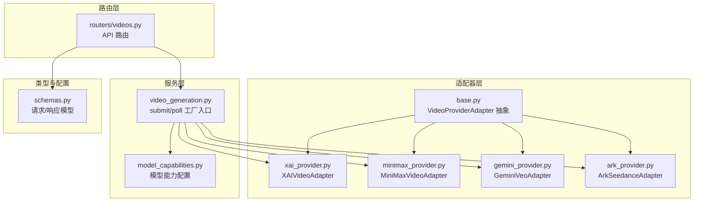
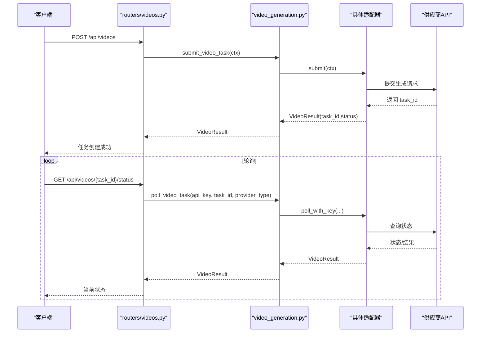
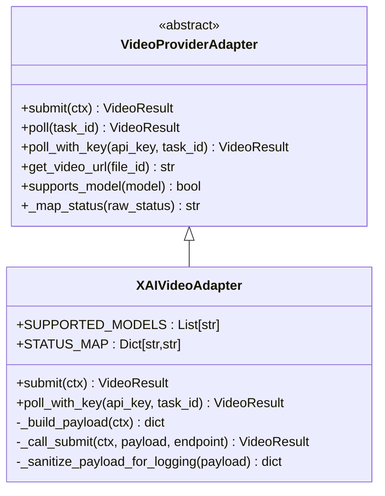
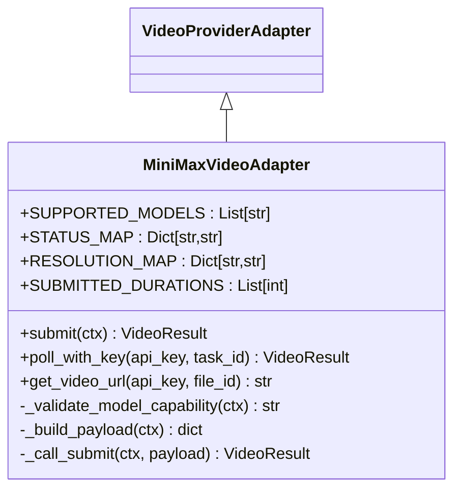
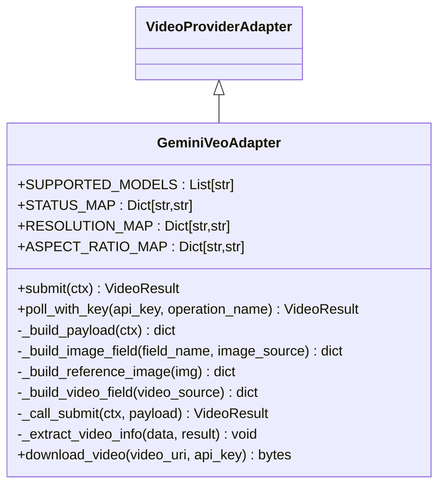
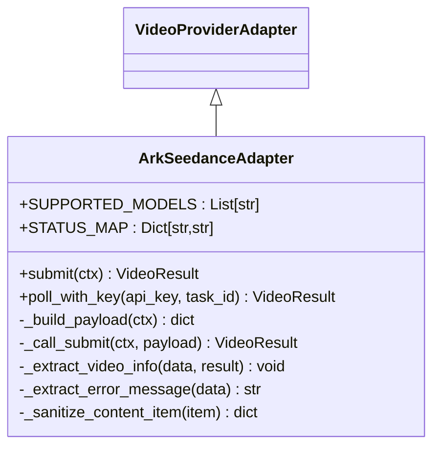
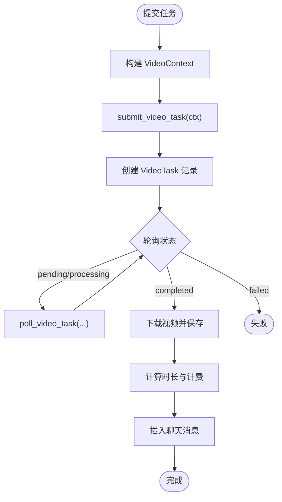
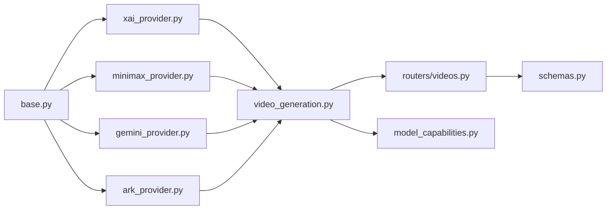

# 视频生成服务

<cite>
**本文引用的文件**
- [backend/services/video_providers/base.py](file://backend/services/video_providers/base.py)
- [backend/services/video_providers/xai_provider.py](file://backend/services/video_providers/xai_provider.py)
- [backend/services/video_providers/minimax_provider.py](file://backend/services/video_providers/minimax_provider.py)
- [backend/services/video_providers/gemini_provider.py](file://backend/services/video_providers/gemini_provider.py)
- [backend/services/video_providers/ark_provider.py](file://backend/services/video_providers/ark_provider.py)
- [backend/services/video_providers/__init__.py](file://backend/services/video_providers/__init__.py)
- [backend/services/video_providers/model_capabilities.py](file://backend/services/video_providers/model_capabilities.py)
- [backend/services/video_generation.py](file://backend/services/video_generation.py)
- [backend/routers/videos.py](file://backend/routers/videos.py)
- [backend/schemas.py](file://backend/schemas.py)
- [README_ZH.md](file://README_ZH.md)
- [Grok视频生成模型文档.md](file://Grok视频生成模型文档.md)
- [GeminiVeo3.1视频生成模型文档.md](file://GeminiVeo3.1视频生成模型文档.md)
- [火山方舟SDK集成官方文档.md](file://火山方舟SDK集成官方文档.md)
</cite>

## 目录
1. [简介](#简介)
2. [项目结构](#项目结构)
3. [核心组件](#核心组件)
4. [架构总览](#架构总览)
5. [详细组件分析](#详细组件分析)
6. [依赖分析](#依赖分析)
7. [性能考虑](#性能考虑)
8. [故障排查指南](#故障排查指南)
9. [结论](#结论)
10. [附录](#附录)

## 简介
本文件系统性阐述多供应商视频生成服务的集成架构与实现细节，覆盖 xAI Grok Video、MiniMax 海络、Gemini Veo、火山方舟等视频生成服务的统一适配器设计。文档重点说明 VideoProviderAdapter 基类、VideoContext/VideoResult 数据结构、视频生成上下文管理与结果处理流程；并给出 API 调用示例、进度跟踪机制与质量控制策略，解释如何配置不同视频生成参数、处理生成队列与优化生成性能，最后提供常见问题解决方案。

## 项目结构
视频生成服务位于后端目录 backend，采用“适配器 + 工厂 + 路由”的分层架构：
- 适配器层：video_providers 目录下提供统一抽象 VideoProviderAdapter 及各供应商适配器（xAI、MiniMax、Gemini、火山方舟）
- 服务层：video_generation.py 提供统一入口与轮询逻辑
- 路由层：routers/videos.py 提供 REST API，对接数据库与计费
- 能力配置：model_capabilities.py 定义各模型能力矩阵
- 类型与配置：schemas.py 定义请求/响应模型与 LLMProvider 配置

图表来源
- [backend/services/video_providers/base.py:56-121](file://backend/services/video_providers/base.py#L56-L121)
- [backend/services/video_providers/xai_provider.py:43-199](file://backend/services/video_providers/xai_provider.py#L43-L199)
- [backend/services/video_providers/minimax_provider.py:30-318](file://backend/services/video_providers/minimax_provider.py#L30-L318)
- [backend/services/video_providers/gemini_provider.py:42-357](file://backend/services/video_providers/gemini_provider.py#L42-L357)
- [backend/services/video_providers/ark_provider.py:55-300](file://backend/services/video_providers/ark_provider.py#L55-L300)
- [backend/services/video_generation.py:29-180](file://backend/services/video_generation.py#L29-L180)
- [backend/services/video_providers/model_capabilities.py:27-477](file://backend/services/video_providers/model_capabilities.py#L27-L477)
- [backend/routers/videos.py:1-344](file://backend/routers/videos.py#L1-L344)
- [backend/schemas.py:124-200](file://backend/schemas.py#L124-L200)

章节来源
- [backend/services/video_providers/base.py:15-121](file://backend/services/video_providers/base.py#L15-L121)
- [backend/services/video_generation.py:23-180](file://backend/services/video_generation.py#L23-L180)
- [backend/routers/videos.py:1-344](file://backend/routers/videos.py#L1-L344)
- [backend/services/video_providers/model_capabilities.py:27-477](file://backend/services/video_providers/model_capabilities.py#L27-L477)
- [backend/schemas.py:124-200](file://backend/schemas.py#L124-L200)

## 核心组件
- VideoProviderAdapter 抽象基类：定义统一接口 submit/poll/get_video_url 与状态映射 STATUS_MAP/SUPPORTED_MODELS
- VideoContext：视频生成请求上下文（包含 api_key、model、prompt、provider_type、图像/视频输入、时长、分辨率、宽高比、模式、参考图、扩展视频 URL、供应商特有参数等）
- VideoResult：视频生成结果（包含 task_id、status、video_url、file_id、时长、尺寸、错误信息）

章节来源
- [backend/services/video_providers/base.py:15-121](file://backend/services/video_providers/base.py#L15-L121)

## 架构总览
统一入口 video_generation.py 通过 _PROVIDER_REGISTRY 将 VideoContext.provider_type 映射到具体适配器，分别调用 submit/poll_with_key。路由层 routers/videos.py 负责接收前端请求、构建 VideoContext、调用统一入口、持久化任务、轮询状态、下载视频并计费。

图表来源
- [backend/services/video_generation.py:90-126](file://backend/services/video_generation.py#L90-L126)
- [backend/routers/videos.py:75-234](file://backend/routers/videos.py#L75-L234)
- [backend/services/video_providers/xai_provider.py:62-199](file://backend/services/video_providers/xai_provider.py#L62-L199)
- [backend/services/video_providers/minimax_provider.py:90-287](file://backend/services/video_providers/minimax_provider.py#L90-L287)
- [backend/services/video_providers/gemini_provider.py:100-321](file://backend/services/video_providers/gemini_provider.py#L100-L321)
- [backend/services/video_providers/ark_provider.py:94-250](file://backend/services/video_providers/ark_provider.py#L94-L250)

## 详细组件分析

### VideoProviderAdapter 抽象基类与数据结构
- VideoContext：统一承载供应商无关的生成参数，如分辨率、时长、宽高比、参考图、扩展视频 URL 等
- VideoResult：统一承载任务状态、结果 URL、文件 ID、时长与尺寸、错误信息
- 状态映射：STATUS_MAP 将供应商原始状态映射为内部统一状态 pending/processing/completed/failed
- get_video_url：部分供应商（如 MiniMax）需要额外调用以获取下载链接

章节来源
- [backend/services/video_providers/base.py:15-121](file://backend/services/video_providers/base.py#L15-L121)

### xAI Grok Video 适配器
- 支持模式：text_to_video、image_to_video、reference_images、edit、video_extension
- 提交端点：/v1/videos/generations（生成/参考图）、/v1/videos/edits（编辑）、/v1/videos/extensions（扩展）
- 轮询端点：/v1/videos/{request_id}
- 关键特性：支持内容审核拒绝映射为 failed；日志脱敏；payload 构建按模式差异化

图表来源
- [backend/services/video_providers/base.py:56-121](file://backend/services/video_providers/base.py#L56-L121)
- [backend/services/video_providers/xai_provider.py:43-199](file://backend/services/video_providers/xai_provider.py#L43-L199)

章节来源
- [backend/services/video_providers/xai_provider.py:1-199](file://backend/services/video_providers/xai_provider.py#L1-L199)
- [Grok视频生成模型文档.md:1-909](file://Grok视频生成模型文档.md#L1-L909)

### MiniMax 海络适配器
- 支持模型：Hailuo-2.3/2.3-Fast/02、T2V-01、I2V-01、S2V-01 等
- 提交端点：/v1/video_generation；轮询：/v1/query/video_generation；下载：/v1/files/retrieve
- 关键特性：I2V 模型必须提供首帧图片；S2V-01 支持主题参考；支持 prompt_optimizer/fast_pretreatment；MiniMax 需额外 get_video_url 获取下载链接

图表来源
- [backend/services/video_providers/base.py:56-121](file://backend/services/video_providers/base.py#L56-L121)
- [backend/services/video_providers/minimax_provider.py:30-318](file://backend/services/video_providers/minimax_provider.py#L30-L318)

章节来源
- [backend/services/video_providers/minimax_provider.py:1-318](file://backend/services/video_providers/minimax_provider.py#L1-L318)

### Gemini Veo 适配器
- 支持模型：veo-3.1-generate-preview、veo-3.1-fast-generate-preview、veo-3.1-lite-generate-preview、veo-3.0、veo-2.0
- 提交端点：/v1beta/models/{model}:predictLongRunning；轮询：/v1beta/{operation_name}
- 关键特性：支持首尾帧插值、参考图片、视频扩展；支持 personGeneration、seed 参数；完成时从 response.extract 视频 URI；下载需 API Key

图表来源
- [backend/services/video_providers/base.py:56-121](file://backend/services/video_providers/base.py#L56-L121)
- [backend/services/video_providers/gemini_provider.py:42-357](file://backend/services/video_providers/gemini_provider.py#L42-L357)

章节来源
- [backend/services/video_providers/gemini_provider.py:1-357](file://backend/services/video_providers/gemini_provider.py#L1-L357)
- [GeminiVeo3.1视频生成模型文档.md:1-1847](file://GeminiVeo3.1视频生成模型文档.md#L1-L1847)

### 火山方舟 Seedance 适配器
- 支持模型：doubao-seedance-2-0、1-5、1-0 系列
- 提交端点：/api/v3/contents/generations/tasks；轮询：/api/v3/contents/generations/tasks/{task_id}
- 关键特性：支持首尾帧、参考图片（最多 9 张）、视频扩展/编辑（2.0 系列）；支持 generate_audio（2.0/1.5 系列）；错误消息格式多样，统一提取

图表来源
- [backend/services/video_providers/base.py:56-121](file://backend/services/video_providers/base.py#L56-L121)
- [backend/services/video_providers/ark_provider.py:55-300](file://backend/services/video_providers/ark_provider.py#L55-L300)

章节来源
- [backend/services/video_providers/ark_provider.py:1-300](file://backend/services/video_providers/ark_provider.py#L1-L300)
- [火山方舟SDK集成官方文档.md:1-250](file://火山方舟SDK集成官方文档.md#L1-L250)

### 统一入口与工厂
- _PROVIDER_REGISTRY：将 "xai"/"minimax"/"gemini"/"ark" 映射到具体适配器类
- get_provider_adapter：按 provider_type 获取适配器实例
- submit_video_task：根据 ctx.provider_type 自动选择适配器提交任务
- poll_video_task：统一轮询，MiniMax 需额外调用 get_video_url 获取下载链接

章节来源
- [backend/services/video_generation.py:29-180](file://backend/services/video_generation.py#L29-L180)

### 路由与任务生命周期
- POST /api/videos：接收 VideoGenerateRequest，构建 VideoContext，调用 submit_video_task，创建 VideoTask 记录
- GET /api/videos/{task_id}/status：轮询适配器状态，处理超时与失败，完成后下载视频、计算时长与计费、插入聊天消息
- GET /api/videos/session/{session_id}：查询会话内视频任务
- DELETE /api/videos/{task_id}：删除终态任务并清理本地媒体文件

图表来源
- [backend/routers/videos.py:75-234](file://backend/routers/videos.py#L75-L234)

章节来源
- [backend/routers/videos.py:1-344](file://backend/routers/videos.py#L1-L344)

### 模型能力配置
- model_capabilities.py 定义各模型支持的模式、时长、分辨率、宽高比、参考图数量、是否支持音频、是否支持首/尾帧等
- get_model_capabilities：按模型名查询能力
- get_supported_models / get_models_by_provider：查询支持的模型列表

章节来源
- [backend/services/video_providers/model_capabilities.py:27-477](file://backend/services/video_providers/model_capabilities.py#L27-L477)

## 依赖分析
- 适配器层依赖 base.py 的抽象接口，各自实现 submit/poll_with_key
- video_generation.py 依赖适配器模块并通过注册表选择适配器
- routers/videos.py 依赖 video_generation.py 与数据库模型、计费模块
- schemas.py 定义请求/响应模型，供路由层使用

图表来源
- [backend/services/video_providers/base.py:56-121](file://backend/services/video_providers/base.py#L56-L121)
- [backend/services/video_providers/xai_provider.py:27-199](file://backend/services/video_providers/xai_provider.py#L27-L199)
- [backend/services/video_providers/minimax_provider.py:23-318](file://backend/services/video_providers/minimax_provider.py#L23-L318)
- [backend/services/video_providers/gemini_provider.py:35-357](file://backend/services/video_providers/gemini_provider.py#L35-L357)
- [backend/services/video_providers/ark_provider.py:30-300](file://backend/services/video_providers/ark_provider.py#L30-L300)
- [backend/services/video_generation.py:29-180](file://backend/services/video_generation.py#L29-L180)
- [backend/routers/videos.py:14-344](file://backend/routers/videos.py#L14-L344)
- [backend/schemas.py:124-200](file://backend/schemas.py#L124-L200)
- [backend/services/video_providers/model_capabilities.py:27-477](file://backend/services/video_providers/model_capabilities.py#L27-L477)

章节来源
- [backend/services/video_providers/__init__.py:10-56](file://backend/services/video_providers/__init__.py#L10-L56)

## 性能考虑
- 轮询间隔与超时：统一入口 MAX_POLL_FAILURES 控制轮询失败阈值；路由层对 pending 且带错误超过 5 分钟判定失败，避免长时间占用
- 资源映射：MiniMax 分辨率映射、Gemini 宽高比/分辨率映射、火山方舟分辨率/比例映射，减少供应商不支持参数导致的重试
- I/O 优化：MiniMax 完成后立即调用 get_video_url 获取下载链接；Gemini 完成后使用 API Key 直接下载
- 模型能力预检：通过 model_capabilities 预先校验模型能力，避免无效请求

章节来源
- [backend/services/video_generation.py:87-126](file://backend/services/video_generation.py#L87-L126)
- [backend/routers/videos.py:180-234](file://backend/routers/videos.py#L180-L234)
- [backend/services/video_providers/minimax_provider.py:53-64](file://backend/services/video_providers/minimax_provider.py#L53-L64)
- [backend/services/video_providers/gemini_provider.py:59-71](file://backend/services/video_providers/gemini_provider.py#L59-L71)
- [backend/services/video_providers/ark_provider.py:36-52](file://backend/services/video_providers/ark_provider.py#L36-L52)
- [backend/services/video_providers/model_capabilities.py:27-477](file://backend/services/video_providers/model_capabilities.py#L27-L477)

## 故障排查指南
- 提交失败：统一入口返回 status=failed 时，路由层抛出 502 并携带错误信息
- 轮询失败：MAX_POLL_FAILURES 控制失败次数；路由层对 pending 且带错误超过 5 分钟判定失败
- MiniMax 下载：完成状态需调用 get_video_url 获取下载链接；若为空，检查 file_id 与 API Key
- 内容审核：xAI 审核拒绝映射为 failed；检查 moderation_ok 字段
- 错误消息提取：火山方舟错误消息格式多样，统一通过 _extract_error_message 提取
- 模型能力不匹配：通过 model_capabilities 校验模型支持的模式与时长/分辨率等

章节来源
- [backend/services/video_generation.py:115-126](file://backend/services/video_generation.py#L115-L126)
- [backend/routers/videos.py:119-123](file://backend/routers/videos.py#L119-L123)
- [backend/routers/videos.py:180-234](file://backend/routers/videos.py#L180-L234)
- [backend/services/video_providers/minimax_provider.py:288-318](file://backend/services/video_providers/minimax_provider.py#L288-L318)
- [backend/services/video_providers/xai_provider.py:174-194](file://backend/services/video_providers/xai_provider.py#L174-L194)
- [backend/services/video_providers/ark_provider.py:264-290](file://backend/services/video_providers/ark_provider.py#L264-L290)
- [backend/services/video_providers/model_capabilities.py:461-477](file://backend/services/video_providers/model_capabilities.py#L461-L477)

## 结论
该视频生成服务通过统一适配器抽象与工厂入口，实现了多供应商的无缝集成。借助 VideoContext/VideoResult 的标准化与模型能力配置，系统在参数映射、状态管理、下载与计费等方面具备良好的一致性与可扩展性。结合路由层的任务生命周期管理与质量控制策略，能够稳定支撑从文本到视频的多模态生成工作流。

## 附录

### API 调用示例（路径与要点）
- xAI 生成/扩展/编辑
  - 提交：POST /v1/videos/generations（生成/参考图）或 /v1/videos/edits（编辑）或 /v1/videos/extensions（扩展）
  - 轮询：GET /v1/videos/{request_id}
  - 参考：[Grok视频生成模型文档.md:1-909](file://Grok视频生成模型文档.md#L1-L909)
- MiniMax
  - 提交：POST /v1/video_generation；轮询：GET /v1/query/video_generation?task_id=xxx；下载：GET /v1/files/retrieve?file_id=xxx
  - 参考：[backend/services/video_providers/minimax_provider.py:182-318](file://backend/services/video_providers/minimax_provider.py#L182-L318)
- Gemini Veo
  - 提交：POST /v1beta/models/{model}:predictLongRunning；轮询：GET /v1beta/{operation_name}；下载：使用 API Key 访问 video.uri
  - 参考：[GeminiVeo3.1视频生成模型文档.md:1-1847](file://GeminiVeo3.1视频生成模型文档.md#L1-L1847)
- 火山方舟
  - 提交：POST /api/v3/contents/generations/tasks；轮询：GET /api/v3/contents/generations/tasks/{task_id}
  - 参考：[火山方舟SDK集成官方文档.md:1-250](file://火山方舟SDK集成官方文档.md#L1-L250)

### 视频生成参数配置要点
- 时长：各供应商支持范围不同（如 xAI 1-15s；MiniMax 6/10s；Gemini 4/5/6/8；火山方舟 4-15s）
- 分辨率：MiniMax 映射到 512P/720P/1080P；Gemini 支持 720p/1080p/4k；火山方舟 480p/720p/1080p
- 宽高比：Gemini 支持 16:9/9:16；火山方舟支持更多比例
- 参考图：xAI/Gemini 支持最多 3 张；火山方舟 2.0 系列支持最多 9 张
- 音频：Gemini Veo 3.1 系列与火山方舟 2.0/1.5 系列支持原生音频

章节来源
- [backend/services/video_providers/model_capabilities.py:27-477](file://backend/services/video_providers/model_capabilities.py#L27-L477)
- [backend/services/video_providers/xai_provider.py:70-104](file://backend/services/video_providers/xai_provider.py#L70-L104)
- [backend/services/video_providers/minimax_provider.py:135-180](file://backend/services/video_providers/minimax_provider.py#L135-L180)
- [backend/services/video_providers/gemini_provider.py:105-166](file://backend/services/video_providers/gemini_provider.py#L105-L166)
- [backend/services/video_providers/ark_provider.py:99-159](file://backend/services/video_providers/ark_provider.py#L99-L159)

### 进度跟踪与质量控制
- 进度跟踪：统一轮询，xAI/Gemini 使用 request_id/operation_name；MiniMax 使用 task_id；火山方舟使用 task_id
- 超时保护：路由层对 pending 且带错误超过 5 分钟判定失败
- 质量控制：内容审核（xAI）、分辨率/时长约束（供应商侧）、参考图数量限制（供应商侧）

章节来源
- [backend/services/video_generation.py:87-126](file://backend/services/video_generation.py#L87-L126)
- [backend/routers/videos.py:180-234](file://backend/routers/videos.py#L180-L234)
- [backend/services/video_providers/xai_provider.py:174-194](file://backend/services/video_providers/xai_provider.py#L174-L194)
- [backend/services/video_providers/gemini_provider.py:277-321](file://backend/services/video_providers/gemini_provider.py#L277-L321)
- [backend/services/video_providers/minimax_provider.py:239-287](file://backend/services/video_providers/minimax_provider.py#L239-L287)
- [backend/services/video_providers/ark_provider.py:204-250](file://backend/services/video_providers/ark_provider.py#L204-L250)