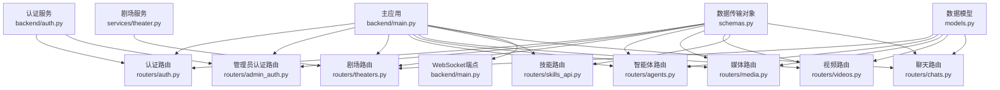
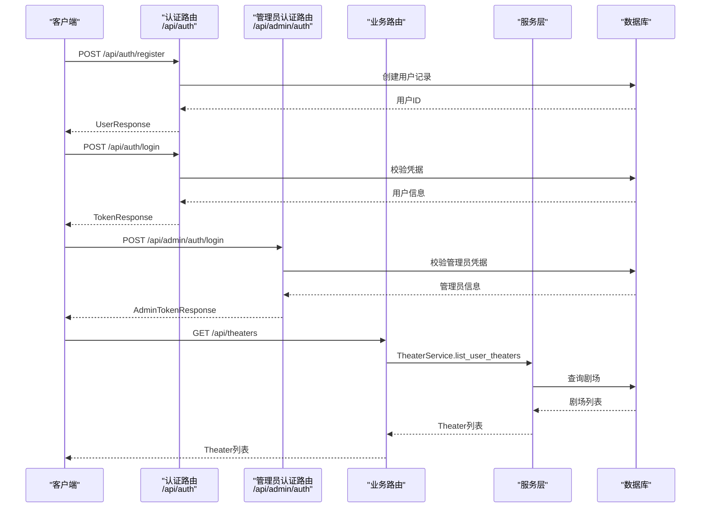
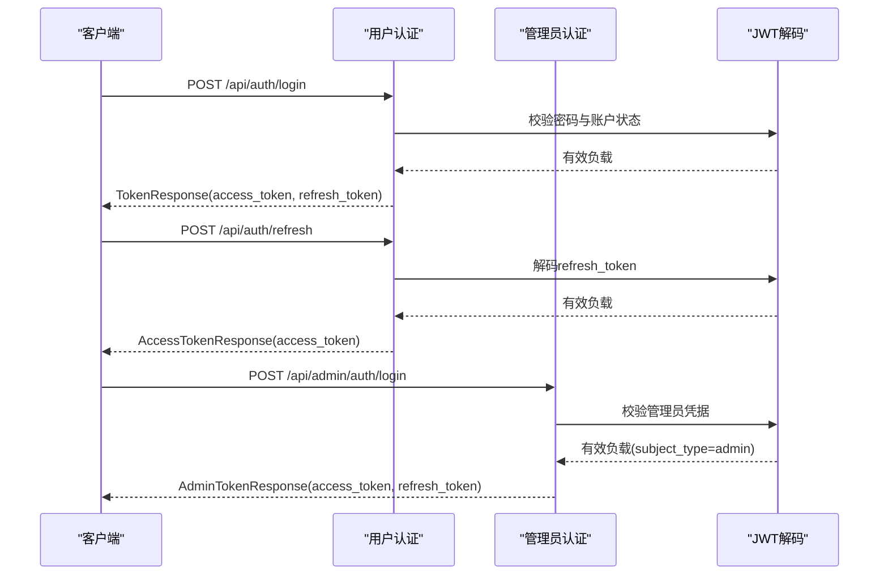
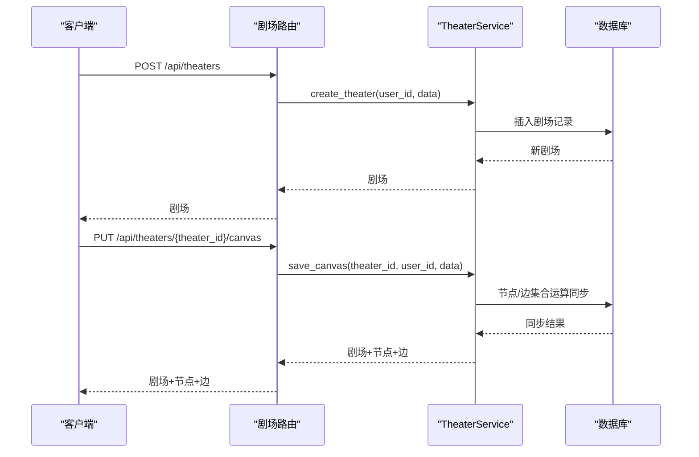
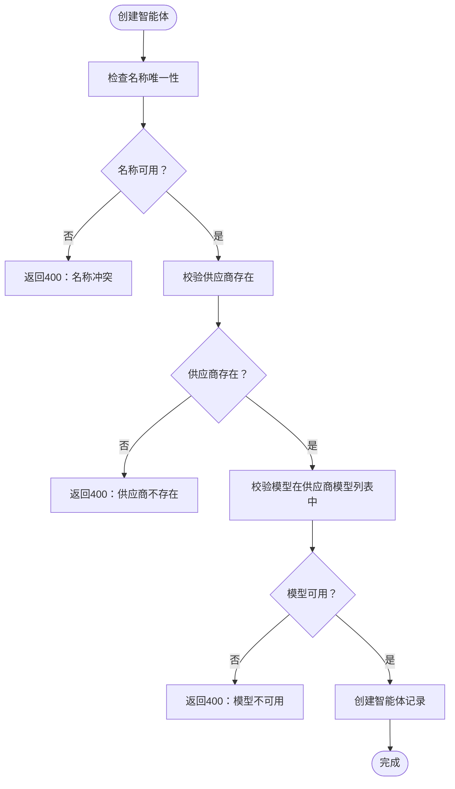
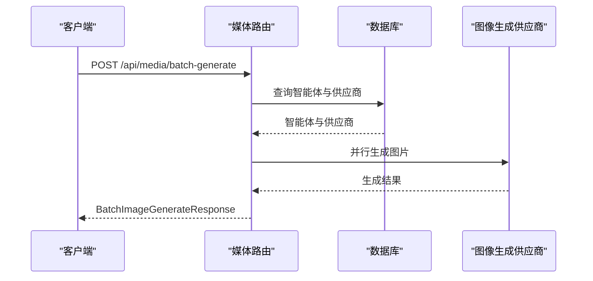
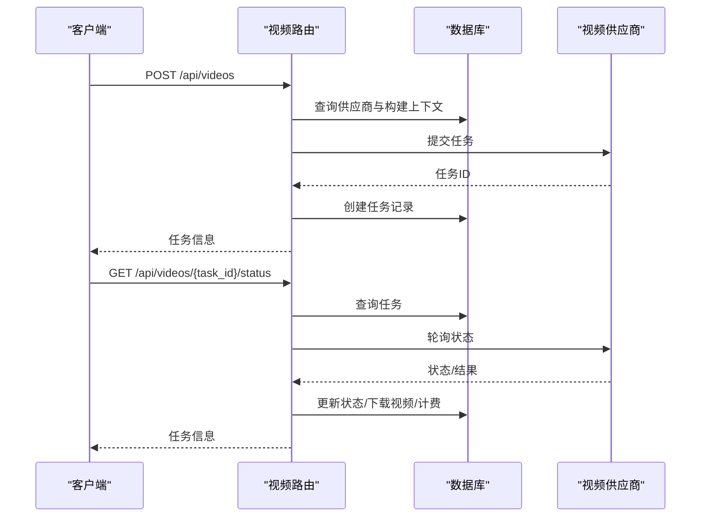
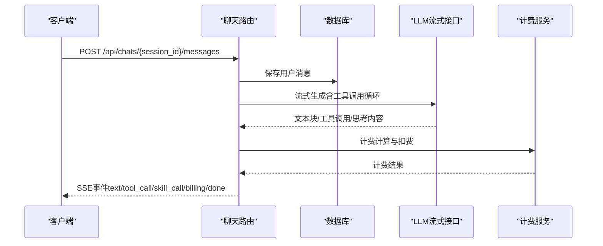
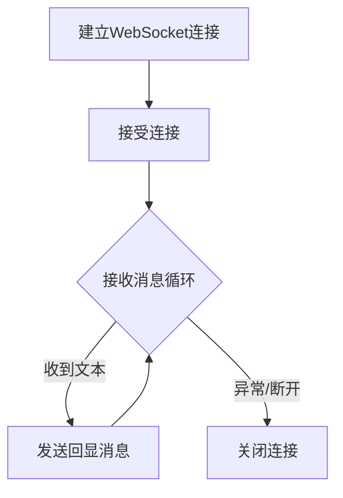
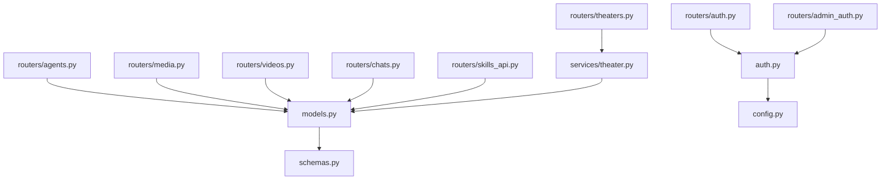

# API参考文档

<cite>
**本文档引用的文件**
- [backend/main.py](file://backend/main.py)
- [backend/routers/auth.py](file://backend/routers/auth.py)
- [backend/routers/admin_auth.py](file://backend/routers/admin_auth.py)
- [backend/routers/theaters.py](file://backend/routers/theaters.py)
- [backend/routers/agents.py](file://backend/routers/agents.py)
- [backend/routers/media.py](file://backend/routers/media.py)
- [backend/routers/videos.py](file://backend/routers/videos.py)
- [backend/routers/skills_api.py](file://backend/routers/skills_api.py)
- [backend/routers/chats.py](file://backend/routers/chats.py)
- [backend/models.py](file://backend/models.py)
- [backend/schemas.py](file://backend/schemas.py)
- [backend/auth.py](file://backend/auth.py)
- [backend/config.py](file://backend/config.py)
- [backend/services/theater.py](file://backend/services/theater.py)
</cite>

## 目录
1. [简介](#简介)
2. [项目结构](#项目结构)
3. [核心组件](#核心组件)
4. [架构总览](#架构总览)
5. [详细组件分析](#详细组件分析)
6. [依赖分析](#依赖分析)
7. [性能考虑](#性能考虑)
8. [故障排查指南](#故障排查指南)
9. [结论](#结论)

## 简介
本参考文档面向Infinite Game后端API，覆盖认证与授权、剧场管理、智能体管理、媒体与视频生成、聊天与流式交互以及WebSocket实时通信。文档提供REST API端点清单、请求/响应模式、认证要求、错误处理策略与调试建议，帮助开发者快速集成与排障。

## 项目结构
后端采用FastAPI框架，按功能模块划分路由层（routers）、服务层（services）、数据模型（models）与数据传输对象（schemas）。主入口注册各路由并配置CORS与中间件；WebSocket端点提供实时通信能力。

**图表来源**
- [backend/main.py:110-152](file://backend/main.py#L110-L152)
- [backend/routers/auth.py:30-33](file://backend/routers/auth.py#L30-L33)
- [backend/routers/admin_auth.py:29-33](file://backend/routers/admin_auth.py#L29-L33)
- [backend/routers/theaters.py:14-17](file://backend/routers/theaters.py#L14-L17)
- [backend/routers/agents.py:10-14](file://backend/routers/agents.py#L10-L14)
- [backend/routers/media.py:24](file://backend/routers/media.py#L24)
- [backend/routers/videos.py:23](file://backend/routers/videos.py#L23)
- [backend/routers/skills_api.py:13-17](file://backend/routers/skills_api.py#L13-L17)
- [backend/routers/chats.py:93-97](file://backend/routers/chats.py#L93-L97)

**章节来源**
- [backend/main.py:110-174](file://backend/main.py#L110-L174)

## 核心组件
- 认证与授权：用户JWT与管理员认证，支持令牌刷新与权限校验。
- 剧场系统：剧场CRUD、节点与边管理、画布状态同步。
- 智能体系统：智能体生命周期管理、配置与工具集。
- 媒体与视频：批量图像生成、视频任务提交与轮询、文件上传下载。
- 聊天与流式：SSE流式响应、工具调用、计费与画布桥接。
- WebSocket：通用WebSocket端点，用于实时交互。

**章节来源**
- [backend/routers/auth.py:36-136](file://backend/routers/auth.py#L36-L136)
- [backend/routers/admin_auth.py:36-136](file://backend/routers/admin_auth.py#L36-L136)
- [backend/routers/theaters.py:20-110](file://backend/routers/theaters.py#L20-L110)
- [backend/routers/agents.py:16-151](file://backend/routers/agents.py#L16-L151)
- [backend/routers/media.py:54-244](file://backend/routers/media.py#L54-L244)
- [backend/routers/videos.py:26-343](file://backend/routers/videos.py#L26-L343)
- [backend/routers/chats.py:100-800](file://backend/routers/chats.py#L100-L800)
- [backend/main.py:160-171](file://backend/main.py#L160-L171)

## 架构总览
系统采用分层架构：路由层负责HTTP端点与鉴权依赖注入；服务层封装业务逻辑；模型层定义数据库结构；Schema层定义请求/响应数据结构。认证中间件统一处理Authorization头调试；CORS允许前端开发环境访问。

**图表来源**
- [backend/routers/auth.py:36-136](file://backend/routers/auth.py#L36-L136)
- [backend/routers/admin_auth.py:36-136](file://backend/routers/admin_auth.py#L36-L136)
- [backend/routers/theaters.py:31-42](file://backend/routers/theaters.py#L31-L42)
- [backend/services/theater.py:62-89](file://backend/services/theater.py#L62-L89)

## 详细组件分析

### 认证API
- 用户认证
  - POST /api/auth/register：注册新用户，返回用户信息。
  - POST /api/auth/login：邮箱+密码登录，返回访问令牌、刷新令牌与用户信息。
  - POST /api/auth/refresh：使用刷新令牌换取新的访问令牌。
  - GET /api/auth/me：获取当前登录用户信息。
- 管理员认证
  - POST /api/admin/auth/login：管理员登录，返回管理员令牌与信息。
  - POST /api/admin/auth/refresh：管理员刷新令牌。
  - GET /api/admin/auth/me：获取当前登录管理员信息。

认证要求
- 用户端点使用Bearer令牌，令牌类型为access。
- 管理员端点使用独立的admin主体类型，令牌类型为access。
- 刷新令牌区分用户与管理员，类型为refresh。

**图表来源**
- [backend/routers/auth.py:63-136](file://backend/routers/auth.py#L63-L136)
- [backend/routers/admin_auth.py:36-136](file://backend/routers/admin_auth.py#L36-L136)
- [backend/auth.py:65-106](file://backend/auth.py#L65-L106)

**章节来源**
- [backend/routers/auth.py:36-136](file://backend/routers/auth.py#L36-L136)
- [backend/routers/admin_auth.py:36-136](file://backend/routers/admin_auth.py#L36-L136)
- [backend/auth.py:30-75](file://backend/auth.py#L30-L75)

### 剧场API
- 剧场CRUD
  - POST /api/theaters：创建剧场。
  - GET /api/theaters：分页列出当前用户的剧场。
  - GET /api/theaters/{theater_id}：获取剧场详情（含节点与边）。
  - PUT /api/theaters/{theater_id}：更新剧场元信息。
  - DELETE /api/theaters/{theater_id}：删除剧场（级联删除节点与边）。
- 画布管理
  - PUT /api/theaters/{theater_id}/canvas：全量同步节点与边（集合运算分类增删改）。
  - POST /api/theaters/{theater_id}/duplicate：复制剧场（含节点与边）。

权限控制
- 除列表与详情外，其余端点均需当前活跃用户作为拥有者校验。

**图表来源**
- [backend/routers/theaters.py:20-110](file://backend/routers/theaters.py#L20-L110)
- [backend/services/theater.py:17-101](file://backend/services/theater.py#L17-L101)
- [backend/services/theater.py:108-200](file://backend/services/theater.py#L108-L200)

**章节来源**
- [backend/routers/theaters.py:20-110](file://backend/routers/theaters.py#L20-L110)
- [backend/services/theater.py:13-200](file://backend/services/theater.py#L13-L200)

### 智能体API
- 智能体管理
  - POST /api/agents：创建智能体（管理员权限）。
  - GET /api/agents：分页列出智能体（支持搜索）。
  - GET /api/agents/{agent_id}：获取智能体详情。
  - PUT /api/agents/{agent_id}：更新智能体（管理员权限）。
  - DELETE /api/agents/{agent_id}：删除智能体（管理员权限）。

权限控制
- 创建、更新、删除需管理员权限；查询可对用户或管理员开放。

**图表来源**
- [backend/routers/agents.py:16-65](file://backend/routers/agents.py#L16-L65)

**章节来源**
- [backend/routers/agents.py:16-151](file://backend/routers/agents.py#L16-L151)

### 媒体API
- 文件下载
  - GET /api/media/{filename}：安全提供媒体文件，支持UUID回退查找。
- 文件上传
  - POST /api/media/upload：上传媒体文件，返回URL。
- 批量图片生成
  - POST /api/media/batch-generate：基于智能体配置并行生成多张图片，支持Gemini与xAI。

**图表来源**
- [backend/routers/media.py:108-244](file://backend/routers/media.py#L108-L244)

**章节来源**
- [backend/routers/media.py:54-244](file://backend/routers/media.py#L54-L244)

### 视频API
- 任务管理
  - GET /api/videos：分页查询视频任务列表（行级隔离）。
  - POST /api/videos：提交视频生成任务。
  - GET /api/videos/{task_id}/status：轮询任务状态，完成后下载视频并计费。
  - GET /api/videos/session/{session_id}：获取会话的视频任务列表。
  - GET /api/videos/model-capabilities/{model_name}：获取模型能力配置。
  - DELETE /api/videos/{task_id}：删除已完成或失败的任务（含本地文件与聊天消息）。

计费与权限
- 仅任务发起人或管理员可见；失败或超时处理；完成时插入聊天消息并扣费。

**图表来源**
- [backend/routers/videos.py:74-233](file://backend/routers/videos.py#L74-L233)

**章节来源**
- [backend/routers/videos.py:26-343](file://backend/routers/videos.py#L26-L343)

### 技能API（管理端）
- 技能管理
  - GET /api/admin/skills：列出所有技能与状态。
  - GET /api/admin/skills/{skill_name}：获取技能详情（含Markdown正文）。
  - POST /api/admin/skills：创建自定义技能（可自动启用）。
  - PUT /api/admin/skills/{skill_name}：更新技能内容（可重同步至激活状态）。
  - DELETE /api/admin/skills/{skill_name}：删除自定义技能（内置技能不可删除）。
  - POST /api/admin/skills/{skill_name}/toggle：切换技能激活状态。

权限控制
- 仅管理员可访问。

**章节来源**
- [backend/routers/skills_api.py:123-207](file://backend/routers/skills_api.py#L123-L207)

### 聊天与流式交互API
- 会话管理
  - POST /api/chats：创建会话。
  - GET /api/chats：分页列出会话（支持按agent_id与theater_id筛选）。
  - GET /api/chats/{session_id}：获取会话详情。
  - GET /api/chats/{session_id}/messages：获取会话消息列表（反序列化多模态内容）。
  - DELETE /api/chats/{session_id}/messages：清空会话消息。
  - DELETE /api/chats/{session_id}：删除会话。
- 消息发送与流式响应
  - POST /api/chats/{session_id}/messages：发送消息，返回SSE流式响应，包含文本块、工具/技能调用事件、计费信息与画布更新事件。

**图表来源**
- [backend/routers/chats.py:202-763](file://backend/routers/chats.py#L202-L763)

**章节来源**
- [backend/routers/chats.py:100-800](file://backend/routers/chats.py#L100-L800)

### WebSocket API
- 端点：GET /ws/{user_id}
- 功能：接受WebSocket连接，接收文本消息并回显，异常处理与关闭流程。

**图表来源**
- [backend/main.py:160-171](file://backend/main.py#L160-L171)

**章节来源**
- [backend/main.py:160-171](file://backend/main.py#L160-L171)

## 依赖分析
- 路由依赖：各路由通过依赖注入获取数据库会话与认证主体，实现权限控制与数据访问。
- 服务依赖：服务层封装复杂业务逻辑，如剧场的节点/边集合运算同步。
- 模型与Schema：模型定义数据库结构，Schema定义请求/响应数据结构与校验。
- 认证依赖：JWT工具提供令牌创建、解码与依赖注入，支持用户与管理员双路径。

**图表来源**
- [backend/routers/auth.py:18-26](file://backend/routers/auth.py#L18-L26)
- [backend/routers/admin_auth.py:18-25](file://backend/routers/admin_auth.py#L18-L25)
- [backend/routers/theaters.py:8](file://backend/routers/theaters.py#L8)
- [backend/services/theater.py:6](file://backend/services/theater.py#L6)
- [backend/models.py:10-200](file://backend/models.py#L10-L200)
- [backend/schemas.py:1-200](file://backend/schemas.py#L1-L200)
- [backend/auth.py:11-25](file://backend/auth.py#L11-L25)
- [backend/config.py:7-43](file://backend/config.py#L7-L43)

**章节来源**
- [backend/routers/auth.py:18-26](file://backend/routers/auth.py#L18-L26)
- [backend/routers/admin_auth.py:18-25](file://backend/routers/admin_auth.py#L18-L25)
- [backend/routers/theaters.py:8](file://backend/routers/theaters.py#L8)
- [backend/services/theater.py:6](file://backend/services/theater.py#L6)
- [backend/models.py:10-200](file://backend/models.py#L10-L200)
- [backend/schemas.py:1-200](file://backend/schemas.py#L1-L200)
- [backend/auth.py:11-25](file://backend/auth.py#L11-L25)
- [backend/config.py:7-43](file://backend/config.py#L7-L43)

## 性能考虑
- 数据库连接与迁移：启动阶段进行连接重试与迁移，SQLite默认配置便于本地开发。
- SSE与流式：聊天端点采用Server-Sent Events，避免长轮询，降低延迟。
- 并发生成：媒体批量生成支持最大并发配置，合理设置以平衡吞吐与资源。
- 计费原子性：视频与聊天计费采用原子扣费，减少竞态风险。
- CORS与中间件：统一CORS配置与调试中间件，便于开发与调试。

[本节为通用指导，无需特定文件来源]

## 故障排查指南
- 认证失败
  - 用户/管理员凭据错误或账户禁用：检查登录请求与账户状态。
  - 令牌过期或类型不符：确认使用正确的access/refresh令牌与subject_type。
- 数据访问
  - 404未找到：确认资源ID与所属关系（如剧场归属）。
  - 权限不足：确保具备管理员权限或资源拥有者身份。
- 媒体与视频
  - 文件名非法：确保使用UUID或受支持扩展名。
  - 供应商错误：检查供应商类型与API密钥配置。
- 聊天与计费
  - 余额不足：检查用户/管理员积分余额与冻结状态。
  - 工具调用异常：查看SSE事件中的错误信息与工具调用结果。
- WebSocket
  - 连接异常：检查端点与客户端实现，关注异常日志与关闭流程。

**章节来源**
- [backend/routers/auth.py:72-83](file://backend/routers/auth.py#L72-L83)
- [backend/routers/admin_auth.py:50-71](file://backend/routers/admin_auth.py#L50-L71)
- [backend/routers/media.py:56-80](file://backend/routers/media.py#L56-L80)
- [backend/routers/videos.py:119-121](file://backend/routers/videos.py#L119-L121)
- [backend/routers/chats.py:715-721](file://backend/routers/chats.py#L715-L721)
- [backend/main.py:167-169](file://backend/main.py#L167-L169)

## 结论
本文档系统梳理了Infinite Game后端API的端点、认证机制、权限控制与数据模型，结合服务层与Schema定义，为集成与运维提供清晰指引。建议在生产环境中强化令牌安全、完善监控与日志，并根据业务需求优化并发与计费策略。