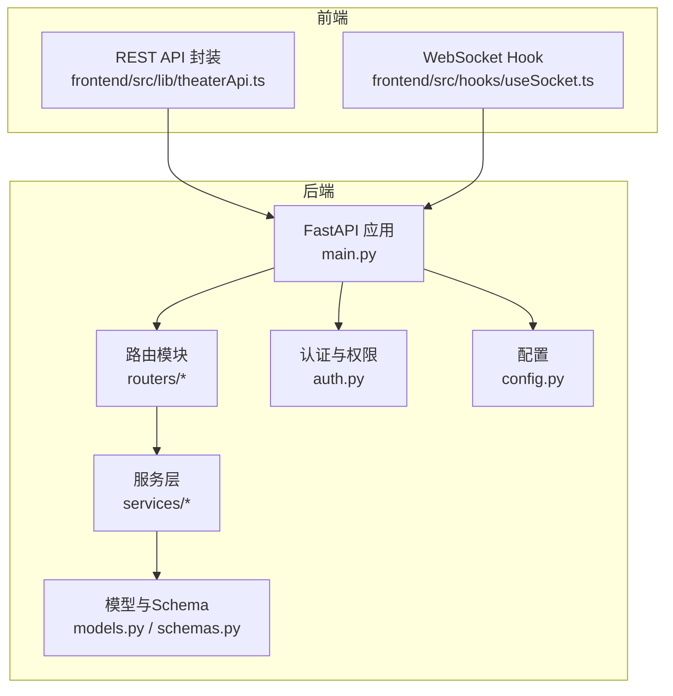
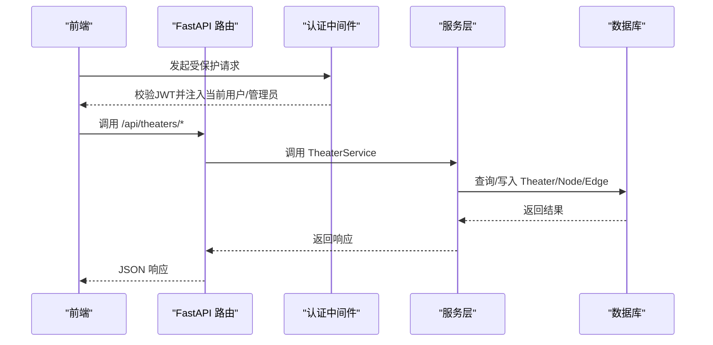
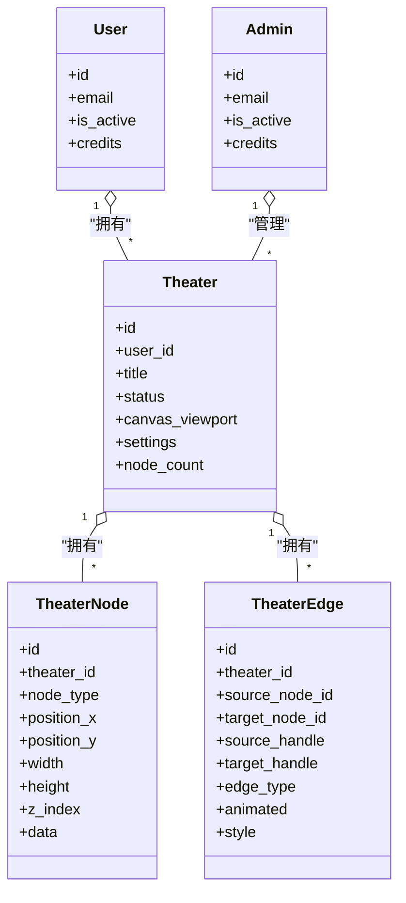

# 剧场API

<cite>
**本文引用的文件**
- [backend/main.py](file://backend/main.py)
- [backend/routers/theaters.py](file://backend/routers/theaters.py)
- [backend/routers/chats.py](file://backend/routers/chats.py)
- [backend/routers/admin.py](file://backend/routers/admin.py)
- [backend/models.py](file://backend/models.py)
- [backend/schemas.py](file://backend/schemas.py)
- [backend/services/theater.py](file://backend/services/theater.py)
- [backend/services/billing.py](file://backend/services/billing.py)
- [backend/auth.py](file://backend/auth.py)
- [backend/config.py](file://backend/config.py)
- [frontend/src/lib/theaterApi.ts](file://frontend/src/lib/theaterApi.ts)
- [frontend/src/hooks/useSocket.ts](file://frontend/src/hooks/useSocket.ts)
</cite>

## 目录
1. [简介](#简介)
2. [项目结构](#项目结构)
3. [核心组件](#核心组件)
4. [架构总览](#架构总览)
5. [详细组件分析](#详细组件分析)
6. [依赖关系分析](#依赖关系分析)
7. [性能考量](#性能考量)
8. [故障排查指南](#故障排查指南)
9. [结论](#结论)
10. [附录](#附录)

## 简介
本文件为“剧场API”的完整技术文档，涵盖以下主题：
- 剧场的CRUD端点：创建、读取、更新、删除剧场，以及画布状态保存与复制。
- 节点与边管理：节点创建/更新/删除/位置调整，边的创建/修改/删除。
- 权限控制：基于JWT的用户/管理员认证与授权；资源级访问控制（用户仅能访问自身剧场）。
- 实时聊天API：基于Server-Sent Events（SSE）的流式对话，以及WebSocket连接说明。
- 请求/响应示例与错误处理指南。

## 项目结构
后端采用FastAPI + SQLAlchemy异步ORM，数据库为SQLite（默认），支持PostgreSQL配置。前端通过Axios封装REST API，React Hooks封装WebSocket。

图表来源
- [backend/main.py:110-174](file://backend/main.py#L110-L174)
- [backend/routers/theaters.py:1-110](file://backend/routers/theaters.py#L1-L110)
- [backend/routers/chats.py:1-807](file://backend/routers/chats.py#L1-L807)
- [backend/models.py:1-447](file://backend/models.py#L1-L447)
- [backend/schemas.py:1-859](file://backend/schemas.py#L1-L859)
- [backend/auth.py:1-229](file://backend/auth.py#L1-L229)
- [backend/config.py:1-43](file://backend/config.py#L1-L43)
- [frontend/src/lib/theaterApi.ts:1-159](file://frontend/src/lib/theaterApi.ts#L1-L159)
- [frontend/src/hooks/useSocket.ts:1-43](file://frontend/src/hooks/useSocket.ts#L1-L43)

章节来源
- [backend/main.py:110-174](file://backend/main.py#L110-L174)
- [backend/routers/theaters.py:1-110](file://backend/routers/theaters.py#L1-L110)
- [backend/routers/chats.py:1-807](file://backend/routers/chats.py#L1-L807)
- [backend/models.py:1-447](file://backend/models.py#L1-L447)
- [backend/schemas.py:1-859](file://backend/schemas.py#L1-L859)
- [backend/auth.py:1-229](file://backend/auth.py#L1-L229)
- [backend/config.py:1-43](file://backend/config.py#L1-L43)
- [frontend/src/lib/theaterApi.ts:1-159](file://frontend/src/lib/theaterApi.ts#L1-L159)
- [frontend/src/hooks/useSocket.ts:1-43](file://frontend/src/hooks/useSocket.ts#L1-L43)

## 核心组件
- 剧场（Theater）：用户创建的创意项目容器，包含标题、描述、状态、画布视口与设置。
- 节点（TheaterNode）：画布上的元素，如脚本、角色、故事板、视频等，支持位置、尺寸、层级与业务数据。
- 边（TheaterEdge）：节点间的连接，支持手柄、动画与样式。
- 认证与权限：JWT访问令牌，区分用户与管理员；资源级访问控制（scoped_query）。
- 实时聊天：SSE流式响应；WebSocket用于通用消息推送。

章节来源
- [backend/models.py:75-130](file://backend/models.py#L75-L130)
- [backend/schemas.py:693-820](file://backend/schemas.py#L693-L820)
- [backend/auth.py:215-229](file://backend/auth.py#L215-L229)
- [backend/routers/chats.py:29-32](file://backend/routers/chats.py#L29-L32)

## 架构总览
后端通过FastAPI注册路由，路由依赖认证中间件与数据库会话；服务层封装业务逻辑；模型与Schema定义数据结构；前端通过REST与WebSocket与后端交互。

图表来源
- [backend/main.py:138-152](file://backend/main.py#L138-L152)
- [backend/routers/theaters.py:19-81](file://backend/routers/theaters.py#L19-L81)
- [backend/services/theater.py:13-31](file://backend/services/theater.py#L13-L31)
- [backend/auth.py:83-113](file://backend/auth.py#L83-L113)

## 详细组件分析

### 剧场CRUD与画布管理
- 端点概览
  - POST /api/theaters：创建剧场
  - GET /api/theaters：分页列出当前用户剧场（支持status筛选）
  - GET /api/theaters/{id}：获取剧场详情（含节点与边）
  - PUT /api/theaters/{id}：更新剧场元信息
  - DELETE /api/theaters/{id}：删除剧场（级联删除节点与边）
  - PUT /api/theaters/{id}/canvas：全量同步画布（节点与边）
  - POST /api/theaters/{id}/duplicate：复制剧场（含节点与边）

- 权限与访问控制
  - 所有剧场相关端点均依赖 get_current_active_user，确保登录且账户激活。
  - 服务层通过 _get_owned_theater 限定用户仅能操作自身剧场，否则返回404。

- 画布保存策略
  - 服务层对传入节点/边进行集合运算，分别计算新增、更新、删除集合，执行批量操作，最后更新剧场node_count与canvas_viewport。

- 请求/响应示例（路径）
  - 创建剧场：POST /api/theaters
    - 请求体：参见 [TheaterCreate:764-772](file://backend/schemas.py#L764-L772)
    - 成功响应：[TheaterResponse:784-798](file://backend/schemas.py#L784-L798)
  - 获取剧场详情：GET /api/theaters/{id}
    - 成功响应：[TheaterDetailResponse:801-804](file://backend/schemas.py#L801-L804)
  - 更新剧场：PUT /api/theaters/{id}
    - 请求体：参见 [TheaterUpdate:774-782](file://backend/schemas.py#L774-L782)
    - 成功响应：[TheaterResponse:784-798](file://backend/schemas.py#L784-L798)
  - 删除剧场：DELETE /api/theaters/{id}
    - 成功响应：{"detail": "Theater deleted"}
  - 保存画布：PUT /api/theaters/{id}/canvas
    - 请求体：参见 [TheaterSaveRequest:815-819](file://backend/schemas.py#L815-L819)
    - 成功响应：[TheaterDetailResponse:801-804](file://backend/schemas.py#L801-L804)
  - 复制剧场：POST /api/theaters/{id}/duplicate
    - 成功响应：[TheaterResponse:784-798](file://backend/schemas.py#L784-L798)

- 错误处理
  - 未找到剧场：404（服务层抛出HTTPException）
  - 未登录/令牌无效：401（OAuth2PasswordBearer）
  - 账户禁用：403（get_current_active_user）

章节来源
- [backend/routers/theaters.py:19-110](file://backend/routers/theaters.py#L19-L110)
- [backend/services/theater.py:13-285](file://backend/services/theater.py#L13-L285)
- [backend/schemas.py:764-820](file://backend/schemas.py#L764-L820)
- [backend/auth.py:83-113](file://backend/auth.py#L83-L113)

### 节点与边管理API
- 节点
  - 创建/更新/删除：通过保存画布接口一次性同步；也可在前端直接维护节点列表后调用保存画布。
  - 字段：node_type、position_x/y、width/height、z_index、data。
  - 参考：[TheaterNodeCreate:695-705](file://backend/schemas.py#L695-L705)、[TheaterNodeUpdate:707-716](file://backend/schemas.py#L707-L716)、[TheaterNodeResponse:718-733](file://backend/schemas.py#L718-L733)

- 边
  - 创建/更新/删除：通过保存画布接口一次性同步；也可在前端直接维护边列表后调用保存画布。
  - 字段：source_node_id、target_node_id、source_handle、target_handle、edge_type、animated、style。
  - 参考：[TheaterEdgeCreate:736-746](file://backend/schemas.py#L736-L746)、[TheaterEdgeResponse:748-761](file://backend/schemas.py#L748-L761)

- 位置调整
  - 通过更新节点的 position_x/y 或保存画布实现。

章节来源
- [backend/schemas.py:695-761](file://backend/schemas.py#L695-L761)
- [backend/services/theater.py:108-228](file://backend/services/theater.py#L108-L228)

### 连接管理API（边）
- 边的创建/修改/删除
  - 通过保存画布接口一次性同步边集合，内部按ID进行集合运算，自动区分新增/更新/删除。
  - 参考：[TheaterSaveRequest:815-819](file://backend/schemas.py#L815-L819)

- 边样式与动画
  - 支持 animated 与 style 字段，便于前端渲染。

章节来源
- [backend/schemas.py:736-761](file://backend/schemas.py#L736-L761)
- [backend/services/theater.py:168-218](file://backend/services/theater.py#L168-L218)

### 权限控制系统
- 认证
  - JWT访问令牌：create_access_token、decode_token。
  - OAuth2PasswordBearer：/api/auth/login（后端未在上述文件中显式列出，但依赖OAuth2密码流）。
  - 参考：[auth.py:30-75](file://backend/auth.py#L30-L75)

- 授权
  - 用户/管理员双栈：get_current_user_or_admin，根据subject_type决定查询User/Admin表。
  - 资源级访问控制：scoped_query，用户仅可见自身数据，管理员可见全部。
  - 参考：[auth.py:162-229](file://backend/auth.py#L162-L229)

- 管理员端点示例
  - 管理员仪表盘统计：GET /api/admin/stats
  - 用户管理：GET /api/admin/users、GET /api/admin/users/{user_id}、DELETE /api/admin/users/{user_id}
  - 积分调整：POST /api/admin/users/{user_id}/credits/adjust
  - 参考：[routers/admin.py:29-135](file://backend/routers/admin.py#L29-L135)

- 剧场权限
  - 服务层 _get_owned_theater 限定用户仅能操作自身剧场，否则404。
  - 参考：[services/theater.py:33-41](file://backend/services/theater.py#L33-L41)

章节来源
- [backend/auth.py:30-229](file://backend/auth.py#L30-L229)
- [backend/routers/admin.py:29-135](file://backend/routers/admin.py#L29-L135)
- [backend/services/theater.py:33-41](file://backend/services/theater.py#L33-L41)

### 实时聊天API（SSE）
- 端点
  - POST /api/chats：创建会话
  - GET /api/chats：列出会话（支持agent_id、theater_id过滤）
  - GET /api/chats/{session_id}：获取会话
  - GET /api/chats/{session_id}/messages：获取会话消息（反序列化多模态内容）
  - POST /api/chats/{session_id}/messages：发送消息（SSE流式响应）
  - DELETE /api/chats/{session_id}/messages：清空会话消息
  - DELETE /api/chats/{session_id}：删除会话

- SSE事件
  - 文本增量：event: text
  - 工具调用开始/结束：event: tool_call / tool_result
  - 技能加载开始/结束：event: skill_call / skill_loaded
  - 画布更新：event: canvas_updated
  - 计费信息：event: billing
  - 结束：event: done

- 多智能体协作
  - 当Agent为leader且有成员Agent时，进入多智能体编排模式，动态调度子任务。

- 积分与计费
  - calculate_credit_cost 与 deduct_credits_atomic 原子扣费，支持文本、图像、搜索、视频等维度计费。
  - 参考：[services/billing.py:12-200](file://backend/services/billing.py#L12-L200)

- 请求/响应示例（路径）
  - 创建会话：POST /api/chats
    - 请求体：[ChatSessionCreate:354-361](file://backend/schemas.py#L354-L361)
    - 成功响应：[ChatSessionResponse:364-371](file://backend/schemas.py#L364-L371)
  - 发送消息：POST /api/chats/{session_id}/messages
    - 请求体：[ChatMessageCreate:379-384](file://backend/schemas.py#L379-L384)
    - 响应：SSE流（事件类型见上）
  - 获取消息：GET /api/chats/{session_id}/messages
    - 成功响应：消息数组（含反序列化内容）

章节来源
- [backend/routers/chats.py:100-807](file://backend/routers/chats.py#L100-L807)
- [backend/schemas.py:354-391](file://backend/schemas.py#L354-L391)
- [backend/services/billing.py:12-200](file://backend/services/billing.py#L12-L200)

### WebSocket连接说明
- 端点
  - GET ws://localhost:8000/ws/{user_id}
  - 前端Hook：useSocket(userId) 自动建立连接、接收消息、发送消息、断开清理。

- 使用建议
  - 适用于通用消息推送、心跳检测、实时通知等场景。
  - 注意生产环境需配置CORS与安全策略。

章节来源
- [backend/main.py:160-171](file://backend/main.py#L160-L171)
- [frontend/src/hooks/useSocket.ts:1-43](file://frontend/src/hooks/useSocket.ts#L1-L43)

### 前端集成要点
- REST API封装
  - 剧场API封装：[frontend/src/lib/theaterApi.ts:107-158](file://frontend/src/lib/theaterApi.ts#L107-L158)
  - 支持创建、列表、详情、更新、删除、保存画布、复制剧场。

- WebSocket
  - Hook：[frontend/src/hooks/useSocket.ts:1-43](file://frontend/src/hooks/useSocket.ts#L1-L43)

章节来源
- [frontend/src/lib/theaterApi.ts:107-158](file://frontend/src/lib/theaterApi.ts#L107-L158)
- [frontend/src/hooks/useSocket.ts:1-43](file://frontend/src/hooks/useSocket.ts#L1-L43)

## 依赖关系分析

图表来源
- [backend/models.py:75-130](file://backend/models.py#L75-L130)

章节来源
- [backend/models.py:75-130](file://backend/models.py#L75-L130)

## 性能考量
- 数据库连接与迁移
  - 启动时自动重试数据库连接与迁移，SQLite默认开启，可通过配置切换PostgreSQL。
  - 参考：[backend/main.py:49-108](file://backend/main.py#L49-L108)、[backend/config.py:11-17](file://backend/config.py#L11-L17)

- 批量操作
  - 画布保存采用集合运算与批量插入/更新/删除，减少往返次数，提升同步效率。
  - 参考：[backend/services/theater.py:108-228](file://backend/services/theater.py#L108-L228)

- SSE与WebSocket
  - SSE适合长连接流式输出；WebSocket适合双向消息推送。注意Nginx/反向代理配置以支持长连接。
  - 参考：[backend/routers/chats.py:250-258](file://backend/routers/chats.py#L250-L258)、[backend/main.py:160-171](file://backend/main.py#L160-L171)

## 故障排查指南
- 认证相关
  - 401 无效或过期令牌：检查JWT密钥、算法与过期时间配置。
    - 参考：[backend/auth.py:65-75](file://backend/auth.py#L65-L75)、[backend/config.py:26-30](file://backend/config.py#L26-L30)
  - 403 账户禁用：确认用户is_active状态。
    - 参考：[backend/auth.py:109-113](file://backend/auth.py#L109-L113)

- 剧场访问
  - 404 未找到剧场：确认theater_id与当前用户匹配。
    - 参考：[backend/services/theater.py:33-41](file://backend/services/theater.py#L33-L41)

- SSE/聊天
  - 402 余额不足：检查用户credits与Agent费率配置。
    - 参考：[backend/routers/chats.py:236-238](file://backend/routers/chats.py#L236-L238)、[backend/services/billing.py:37-84](file://backend/services/billing.py#L37-L84)

- WebSocket
  - 连接失败：检查CORS配置与反向代理设置。
    - 参考：[backend/main.py:130-136](file://backend/main.py#L130-L136)

章节来源
- [backend/auth.py:65-113](file://backend/auth.py#L65-L113)
- [backend/services/theater.py:33-41](file://backend/services/theater.py#L33-L41)
- [backend/routers/chats.py:236-238](file://backend/routers/chats.py#L236-L238)
- [backend/services/billing.py:37-84](file://backend/services/billing.py#L37-L84)
- [backend/main.py:130-136](file://backend/main.py#L130-L136)

## 结论
剧场API围绕“剧场-节点-边”三元组提供完整的CRUD与同步能力，结合JWT认证与资源级访问控制，确保数据安全与隔离。SSE与WebSocket为实时交互提供基础能力。通过批量同步与原子计费，系统在易用性与性能之间取得平衡。建议在生产环境中完善CORS、反向代理与监控告警配置。

## 附录
- 配置项
  - 数据库URL、Redis、AI模型密钥、JWT密钥与过期时间、是否运行迁移等。
  - 参考：[backend/config.py:7-43](file://backend/config.py#L7-L43)

- 前端API封装
  - 剧场REST封装与WebSocket Hook。
  - 参考：[frontend/src/lib/theaterApi.ts:107-158](file://frontend/src/lib/theaterApi.ts#L107-L158)、[frontend/src/hooks/useSocket.ts:1-43](file://frontend/src/hooks/useSocket.ts#L1-L43)