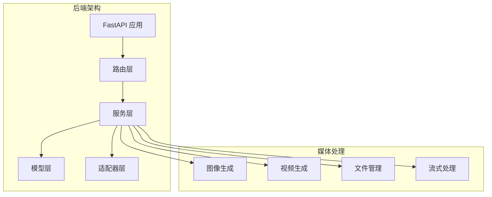
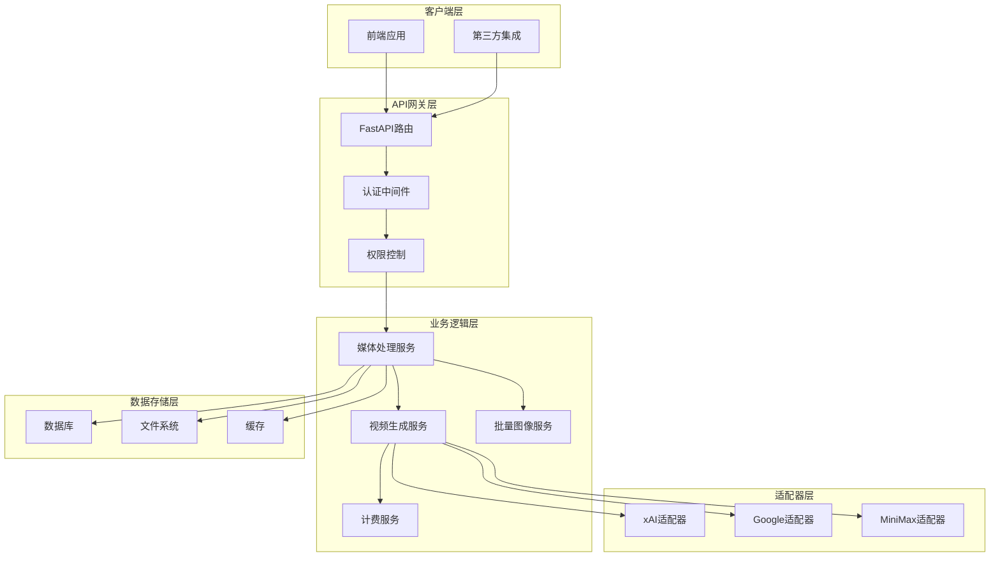
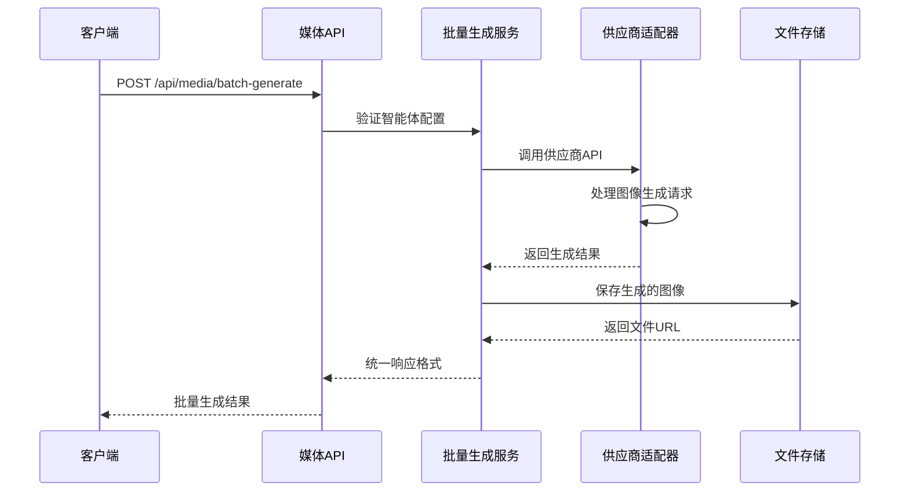
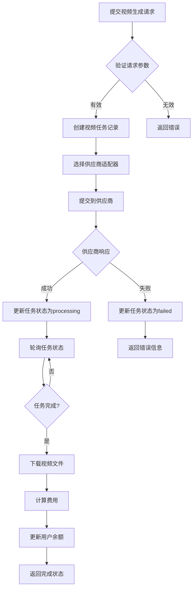
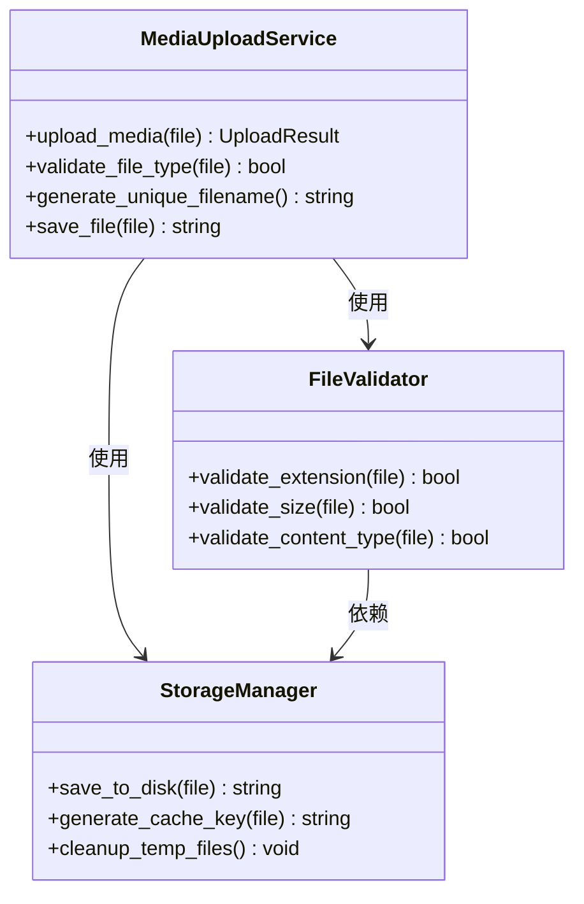
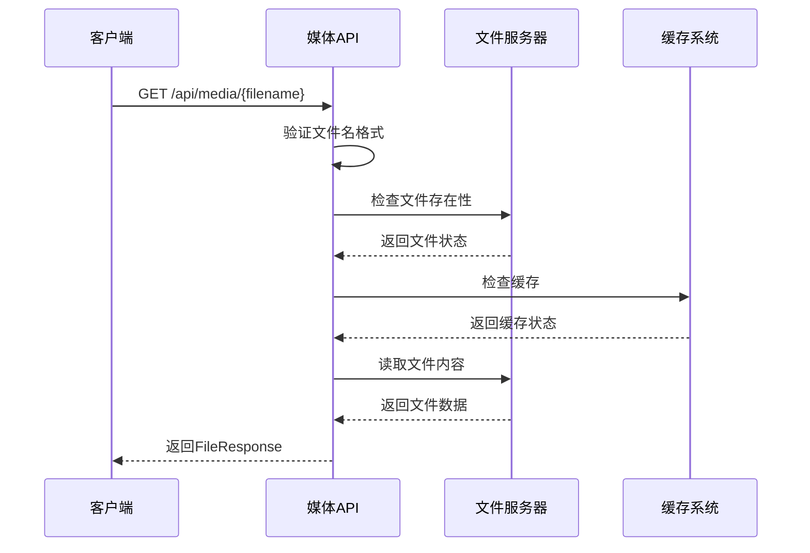
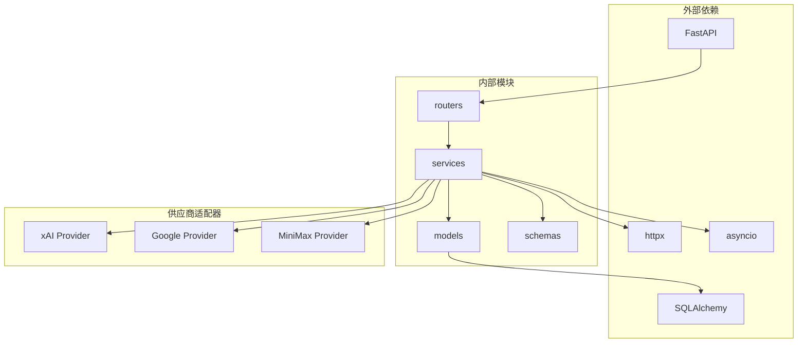
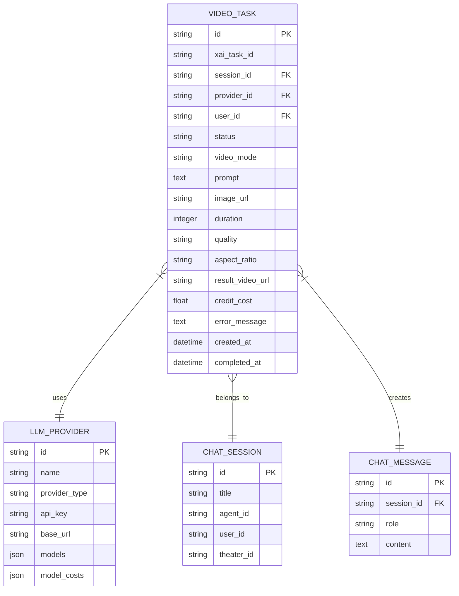

# 媒体API

<cite>
**本文档引用的文件**
- [backend/routers/media.py](file://backend/routers/media.py)
- [backend/services/media_utils.py](file://backend/services/media_utils.py)
- [backend/routers/videos.py](file://backend/routers/videos.py)
- [backend/services/video_generation.py](file://backend/services/video_generation.py)
- [backend/services/batch_image_gen.py](file://backend/services/batch_image_gen.py)
- [backend/services/xai_image_gen.py](file://backend/services/xai_image_gen.py)
- [backend/schemas.py](file://backend/schemas.py)
- [backend/models.py](file://backend/models.py)
</cite>

## 目录
1. [简介](#简介)
2. [项目结构](#项目结构)
3. [核心组件](#核心组件)
4. [架构概览](#架构概览)
5. [详细组件分析](#详细组件分析)
6. [依赖关系分析](#依赖关系分析)
7. [性能考虑](#性能考虑)
8. [故障排除指南](#故障排除指南)
9. [结论](#结论)

## 简介
本项目是一个基于FastAPI的媒体处理平台，提供了完整的媒体API解决方案，包括：
- **图像生成API**：支持文本到图像、图像到图像和批量生成接口
- **视频生成API**：支持视频创建、状态查询和进度跟踪
- **文件上传API**：支持媒体文件上传、临时存储和永久保存
- **文件下载API**：支持预览链接生成、直接下载和批量下载
- **媒体文件管理API**：支持删除、重命名和分类管理

系统采用模块化设计，通过适配器模式支持多个AI供应商（xAI、Google Gemini、MiniMax），并实现了完善的错误处理和性能优化机制。

## 项目结构
媒体API主要分布在以下目录结构中：

**图表来源**
- [backend/routers/media.py:1-244](file://backend/routers/media.py#L1-L244)
- [backend/routers/videos.py:1-343](file://backend/routers/videos.py#L1-L343)

**章节来源**
- [backend/routers/media.py:1-244](file://backend/routers/media.py#L1-L244)
- [backend/routers/videos.py:1-343](file://backend/routers/videos.py#L1-L343)

## 核心组件
媒体API的核心组件包括：

### 1. 媒体路由层
负责处理HTTP请求和响应，提供RESTful API接口。

### 2. 媒体工具服务
提供文件保存、下载和转换功能。

### 3. 批量图像生成服务
支持并行处理多个图像生成请求。

### 4. 视频生成服务
统一的视频生成入口，支持多供应商适配。

### 5. 数据模型
定义数据库表结构和关系。

**章节来源**
- [backend/services/media_utils.py:1-79](file://backend/services/media_utils.py#L1-L79)
- [backend/services/batch_image_gen.py:1-187](file://backend/services/batch_image_gen.py#L1-L187)
- [backend/services/video_generation.py:1-160](file://backend/services/video_generation.py#L1-L160)

## 架构概览
系统采用分层架构设计，通过适配器模式实现多供应商支持：

**图表来源**
- [backend/services/video_generation.py:47-75](file://backend/services/video_generation.py#L47-L75)
- [backend/routers/media.py:24-244](file://backend/routers/media.py#L24-L244)

## 详细组件分析

### 图像生成API

#### 文本到图像接口
系统支持通过智能体配置进行图像生成，支持多种供应商：

**图表来源**
- [backend/routers/media.py:108-139](file://backend/routers/media.py#L108-L139)
- [backend/services/batch_image_gen.py:113-187](file://backend/services/batch_image_gen.py#L113-L187)

#### 图像到图像接口
支持基于现有图像进行编辑和风格转换：

**章节来源**
- [backend/services/xai_image_gen.py:80-123](file://backend/services/xai_image_gen.py#L80-L123)
- [backend/schemas.py:199-215](file://backend/schemas.py#L199-L215)

#### 批量生成接口
支持并发处理多个图像生成请求：

**章节来源**
- [backend/services/batch_image_gen.py:113-187](file://backend/services/batch_image_gen.py#L113-L187)
- [backend/services/xai_image_gen.py:125-191](file://backend/services/xai_image_gen.py#L125-L191)

### 视频生成API

#### 视频创建流程
视频生成采用异步处理模式，支持多种视频模式：

**图表来源**
- [backend/routers/videos.py:74-147](file://backend/routers/videos.py#L74-L147)
- [backend/services/video_generation.py:84-124](file://backend/services/video_generation.py#L84-L124)

#### 状态查询和进度跟踪
系统提供完整的任务状态管理和进度跟踪机制：

**章节来源**
- [backend/routers/videos.py:149-233](file://backend/routers/videos.py#L149-L233)
- [backend/models.py:391-422](file://backend/models.py#L391-L422)

### 文件上传API

#### 媒体文件上传
支持多种媒体格式的安全上传：

**图表来源**
- [backend/routers/media.py:83-106](file://backend/routers/media.py#L83-L106)
- [backend/services/media_utils.py:20-29](file://backend/services/media_utils.py#L20-L29)

#### 临时存储和永久保存
系统支持临时文件存储和永久文件管理：

**章节来源**
- [backend/routers/media.py:83-106](file://backend/routers/media.py#L83-L106)
- [backend/services/media_utils.py:31-51](file://backend/services/media_utils.py#L31-L51)

### 文件下载API

#### 预览链接生成
支持安全的文件访问和预览功能：

**图表来源**
- [backend/routers/media.py:54-81](file://backend/routers/media.py#L54-L81)

#### 直接下载和批量下载
支持单文件和批量文件的下载功能：

**章节来源**
- [backend/routers/media.py:54-81](file://backend/routers/media.py#L54-L81)
- [backend/routers/videos.py:266-297](file://backend/routers/videos.py#L266-L297)

### 媒体文件管理API

#### 删除、重命名和分类
提供完整的文件管理功能：

**章节来源**
- [backend/routers/videos.py:266-297](file://backend/routers/videos.py#L266-L297)
- [backend/models.py:391-422](file://backend/models.py#L391-L422)

## 依赖关系分析

### 核心依赖关系
系统采用清晰的依赖层次结构：

**图表来源**
- [backend/routers/media.py:1-24](file://backend/routers/media.py#L1-L24)
- [backend/services/video_generation.py:25-34](file://backend/services/video_generation.py#L25-L34)

### 数据模型关系
媒体系统的数据模型具有清晰的关系结构：

**图表来源**
- [backend/models.py:391-422](file://backend/models.py#L391-L422)
- [backend/models.py:146-170](file://backend/models.py#L146-L170)
- [backend/models.py:172-195](file://backend/models.py#L172-L195)

**章节来源**
- [backend/models.py:391-422](file://backend/models.py#L391-L422)
- [backend/schemas.py:629-690](file://backend/schemas.py#L629-L690)

## 性能考虑

### 并发处理优化
系统采用多种并发处理策略：

1. **批量图像生成并发控制**
   - 使用信号量限制最大并发数（1-8）
   - 异常处理确保单个任务失败不影响整体进程

2. **视频生成异步处理**
   - 异步轮询供应商状态
   - 超时保护机制防止长时间挂起

3. **文件操作优化**
   - 异步文件下载和保存
   - 内存映射减少IO开销

### 缓存策略
系统实现多层次缓存机制：

1. **文件缓存**
   - HTTP缓存控制头设置
   - 文件系统缓存优化

2. **数据库缓存**
   - 任务状态缓存
   - 供应商配置缓存

### 错误恢复机制
系统具备完善的错误处理和恢复能力：

1. **重试机制**
   - 供应商API调用重试
   - 文件操作异常重试

2. **降级策略**
   - 供应商不可用时的降级处理
   - 部分功能降级保证系统稳定性

## 故障排除指南

### 常见问题诊断

#### 图像生成失败
1. **检查智能体配置**
   - 确认API密钥有效性
   - 验证模型名称正确性

2. **监控并发限制**
   - 检查max_concurrent参数设置
   - 监控系统资源使用情况

#### 视频生成超时
1. **检查网络连接**
   - 验证供应商API可达性
   - 检查防火墙设置

2. **调整超时参数**
   - 增加请求超时时间
   - 优化轮询间隔

#### 文件上传失败
1. **验证文件大小**
   - 检查文件大小限制
   - 确认磁盘空间充足

2. **检查文件类型**
   - 验证支持的文件格式
   - 确认MIME类型正确

### 日志分析
系统提供详细的日志记录用于问题诊断：

1. **请求日志**
   - 记录所有API调用
   - 包含请求参数和响应状态

2. **错误日志**
   - 详细记录异常信息
   - 包含堆栈跟踪

3. **性能日志**
   - 记录处理时间和资源使用
   - 监控系统性能指标

**章节来源**
- [backend/routers/media.py:101-103](file://backend/routers/media.py#L101-L103)
- [backend/routers/videos.py:179-183](file://backend/routers/videos.py#L179-L183)

## 结论
本媒体API系统提供了完整的媒体处理解决方案，具有以下特点：

1. **模块化设计**：清晰的分层架构便于维护和扩展
2. **多供应商支持**：通过适配器模式支持多个AI供应商
3. **高性能处理**：并发处理和缓存优化确保系统性能
4. **完善的安全机制**：文件验证和访问控制保障系统安全
5. **全面的错误处理**：健壮的错误恢复机制提高系统可靠性

系统支持从基础的文件上传下载到复杂的AI图像和视频生成，为企业级应用提供了强大的媒体处理能力。通过合理的架构设计和优化策略，系统能够在高并发场景下保持稳定高效的运行。