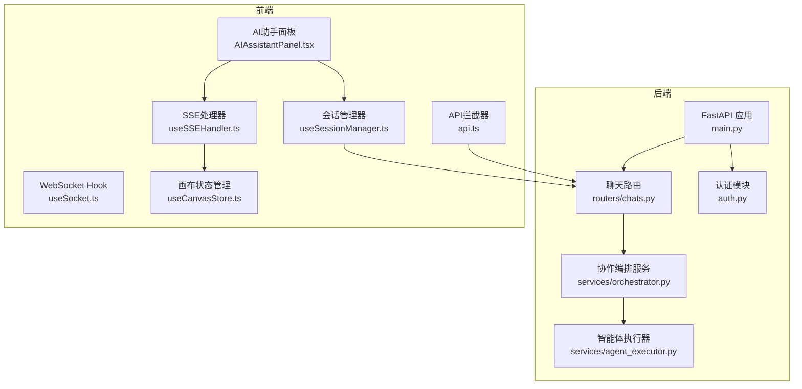
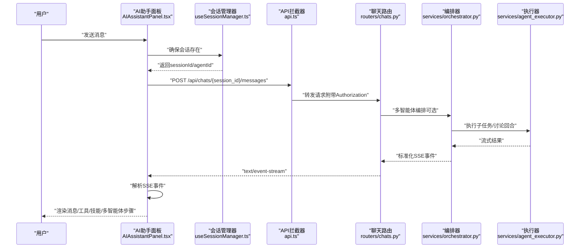
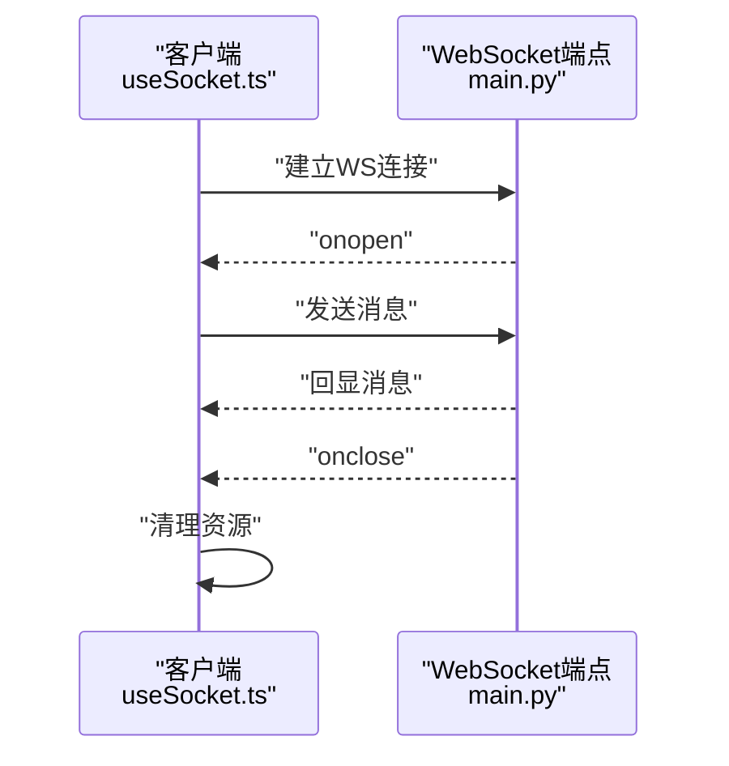
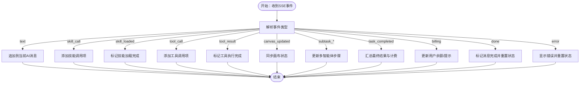
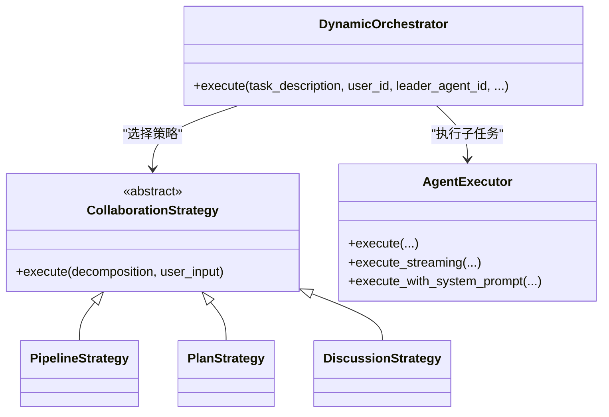
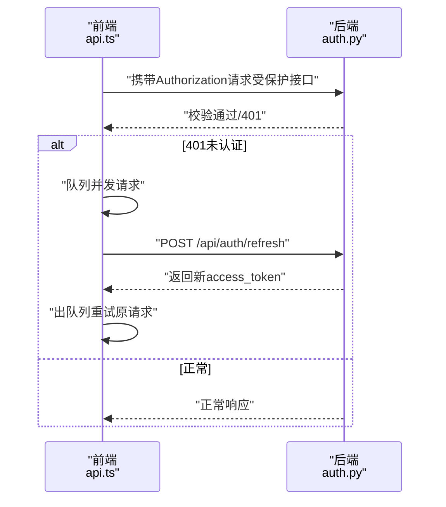
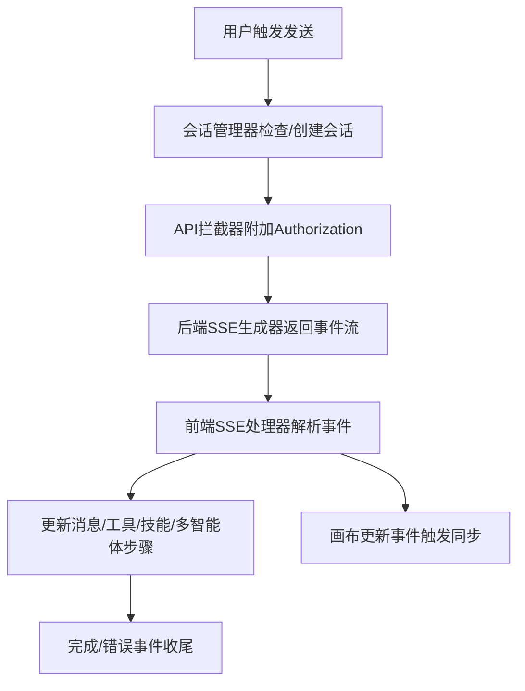
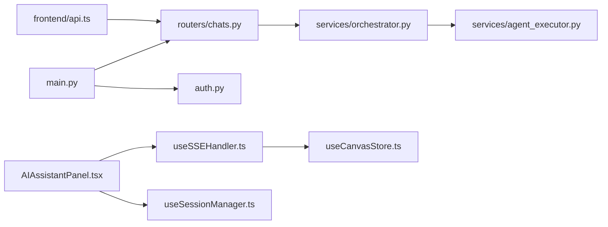

# 实时通信API

<cite>
**本文档引用的文件**
- [main.py](file://backend/main.py)
- [chats.py](file://backend/routers/chats.py)
- [useSocket.ts](file://frontend/src/hooks/useSocket.ts)
- [useSSEHandler.ts](file://frontend/src/components/ai-assistant/hooks/useSSEHandler.ts)
- [AIAssistantPanel.tsx](file://frontend/src/components/canvas/AIAssistantPanel.tsx)
- [useSessionManager.ts](file://frontend/src/components/ai-assistant/hooks/useSessionManager.ts)
- [api.ts](file://frontend/src/lib/api.ts)
- [orchestrator.py](file://backend/services/orchestrator.py)
- [agent_executor.py](file://backend/services/agent_executor.py)
- [useCanvasStore.ts](file://frontend/src/store/useCanvasStore.ts)
- [auth.py](file://backend/auth.py)
</cite>

## 目录
1. [简介](#简介)
2. [项目结构](#项目结构)
3. [核心组件](#核心组件)
4. [架构总览](#架构总览)
5. [详细组件分析](#详细组件分析)
6. [依赖关系分析](#依赖关系分析)
7. [性能考虑](#性能考虑)
8. [故障排查指南](#故障排查指南)
9. [结论](#结论)

## 简介
本文件面向实时通信API的技术与非技术读者，系统性梳理基于FastAPI + React的前后端实时通信能力，涵盖：
- WebSocket连接建立与管理（当前示例为最小可用实现）
- Server-Sent Events（SSE）流式响应与事件推送
- 实时协作（多智能体）的事件模型、并发控制与状态同步
- 认证与授权、断线重连、心跳与超时处理建议
- 客户端连接管理与消息队列处理最佳实践

## 项目结构
后端采用FastAPI框架，路由集中在routers目录；前端使用React Hooks与自定义Axios拦截器实现认证、SSE解析与会话管理。

**图表来源**
- [main.py:160-171](file://backend/main.py#L160-L171)
- [chats.py:202-258](file://backend/routers/chats.py#L202-L258)
- [orchestrator.py:560-673](file://backend/services/orchestrator.py#L560-L673)
- [agent_executor.py:63-208](file://backend/services/agent_executor.py#L63-L208)
- [useSSEHandler.ts:24-334](file://frontend/src/components/ai-assistant/hooks/useSSEHandler.ts#L24-L334)
- [AIAssistantPanel.tsx:14-179](file://frontend/src/components/canvas/AIAssistantPanel.tsx#L14-L179)
- [useSessionManager.ts:12-179](file://frontend/src/components/ai-assistant/hooks/useSessionManager.ts#L12-L179)
- [api.ts:1-83](file://frontend/src/lib/api.ts#L1-L83)
- [useCanvasStore.ts:185-539](file://frontend/src/store/useCanvasStore.ts#L185-L539)

**章节来源**
- [main.py:160-171](file://backend/main.py#L160-L171)
- [chats.py:202-258](file://backend/routers/chats.py#L202-L258)

## 核心组件
- WebSocket端点：提供基础双向通信通道，当前实现为回显消息，便于演示连接生命周期。
- SSE端点：/api/chats/{session_id}/messages，返回text/event-stream，按事件类型推送多智能体协作与单智能体交互过程。
- SSE事件处理器：前端解析SSE事件，维护流式状态，渲染消息、工具/技能调用、多智能体步骤与计费信息。
- 会话管理：负责创建/切换/清空会话，绑定theater上下文，确保消息历史与UI状态一致。
- 认证与授权：JWT访问令牌校验，支持刷新令牌队列化处理，保障实时接口的鉴权一致性。
- 协作编排：动态Orchestrator根据Leader配置选择策略（流水线/计划/讨论），并产出标准化SSE事件。

**章节来源**
- [main.py:160-171](file://backend/main.py#L160-L171)
- [chats.py:29-31](file://backend/routers/chats.py#L29-L31)
- [useSSEHandler.ts:63-327](file://frontend/src/components/ai-assistant/hooks/useSSEHandler.ts#L63-L327)
- [useSessionManager.ts:48-108](file://frontend/src/components/ai-assistant/hooks/useSessionManager.ts#L48-L108)
- [api.ts:9-17](file://frontend/src/lib/api.ts#L9-L17)
- [auth.py:83-110](file://backend/auth.py#L83-L110)

## 架构总览
下图展示从用户触发到SSE事件消费的完整链路，以及多智能体协作的事件流。

**图表来源**
- [AIAssistantPanel.tsx:86-179](file://frontend/src/components/canvas/AIAssistantPanel.tsx#L86-L179)
- [useSessionManager.ts:48-108](file://frontend/src/components/ai-assistant/hooks/useSessionManager.ts#L48-L108)
- [api.ts:31-81](file://frontend/src/lib/api.ts#L31-L81)
- [chats.py:202-258](file://backend/routers/chats.py#L202-L258)
- [orchestrator.py:560-673](file://backend/services/orchestrator.py#L560-L673)
- [agent_executor.py:127-162](file://backend/services/agent_executor.py#L127-L162)

## 详细组件分析

### WebSocket连接管理（最小可用实现）
- 端点：/ws/{user_id}
- 行为：接受连接，循环接收文本消息并回显，异常时关闭连接。
- 适用场景：演示连接生命周期、断线重连基础流程。

**图表来源**
- [useSocket.ts:3-42](file://frontend/src/hooks/useSocket.ts#L3-L42)
- [main.py:160-171](file://backend/main.py#L160-L171)

**章节来源**
- [useSocket.ts:3-42](file://frontend/src/hooks/useSocket.ts#L3-L42)
- [main.py:160-171](file://backend/main.py#L160-L171)

### SSE流式响应与事件推送
- 端点：/api/chats/{session_id}/messages（POST），返回text/event-stream
- 事件类型（示例）：
  - text：单智能体流式文本片段
  - skill_call/skill_loaded：技能调用开始与加载完成
  - tool_call/tool_result：工具调用开始与执行完成
  - canvas_updated：画布节点变更事件
  - subtask_created/subtask_started/subtask_completed/subtask_failed：多智能体子任务生命周期
  - task_completed/task_failed：多智能体任务完成/失败
  - billing：计费信息（剩余积分、是否余额不足、账户冻结等）
  - done/error：结束与错误
- 前端解析：逐行解析event/data，按事件类型更新消息、工具/技能状态、多智能体步骤与画布同步。

**图表来源**
- [useSSEHandler.ts:52-327](file://frontend/src/components/ai-assistant/hooks/useSSEHandler.ts#L52-L327)
- [chats.py:29-31](file://backend/routers/chats.py#L29-L31)

**章节来源**
- [useSSEHandler.ts:63-327](file://frontend/src/components/ai-assistant/hooks/useSSEHandler.ts#L63-L327)
- [chats.py:29-31](file://backend/routers/chats.py#L29-L31)

### 实时协作（多智能体）API
- 策略选择：Pipeline（流水线）、Plan（计划）、Discussion（讨论）
- 事件流：task_start → task_decomposed → 子任务事件（创建/开始/片段/完成/失败）→ review（可选）→ task_completed/task_failed
- 并发控制：流水线串行或并行（由策略决定），计划策略按依赖拓扑执行，讨论策略按回合进行。
- 冲突解决：通过子任务粒度与令牌统计，结合计费与审核环节，避免重复工作与资源浪费。
- 状态同步：canvas_updated事件用于画布节点的实时更新。

**图表来源**
- [orchestrator.py:560-673](file://backend/services/orchestrator.py#L560-L673)
- [orchestrator.py:82-108](file://backend/services/orchestrator.py#L82-L108)
- [orchestrator.py:254-307](file://backend/services/orchestrator.py#L254-L307)
- [orchestrator.py:325-407](file://backend/services/orchestrator.py#L325-L407)
- [orchestrator.py:413-530](file://backend/services/orchestrator.py#L413-L530)
- [agent_executor.py:74-126](file://backend/services/agent_executor.py#L74-L126)
- [agent_executor.py:127-162](file://backend/services/agent_executor.py#L127-L162)
- [agent_executor.py:164-208](file://backend/services/agent_executor.py#L164-L208)

**章节来源**
- [orchestrator.py:560-673](file://backend/services/orchestrator.py#L560-L673)
- [agent_executor.py:74-126](file://backend/services/agent_executor.py#L74-L126)

### 认证与授权
- 访问令牌：JWT，OAuth2密码流，依赖OAuth2PasswordBearer
- 刷新令牌：拦截器在401时排队并发请求，使用refresh_token换取新的access_token
- 作用域：/api/chats路由依赖当前活跃用户，确保资源可见性

**图表来源**
- [api.ts:31-81](file://frontend/src/lib/api.ts#L31-L81)
- [auth.py:83-110](file://backend/auth.py#L83-L110)

**章节来源**
- [api.ts:9-17](file://frontend/src/lib/api.ts#L9-L17)
- [api.ts:31-81](file://frontend/src/lib/api.ts#L31-L81)
- [auth.py:83-110](file://backend/auth.py#L83-L110)

### 客户端连接管理与消息队列
- 连接生命周期：useSocket封装连接建立、消息接收、关闭清理
- SSE解析：useSSEHandler集中处理事件解析、状态机与UI更新
- 会话管理：useSessionManager负责会话创建/切换/清空，绑定theater上下文
- 画布同步：canvas_updated事件触发useCanvasStore同步画布状态

**图表来源**
- [useSocket.ts:3-42](file://frontend/src/hooks/useSocket.ts#L3-L42)
- [useSSEHandler.ts:24-334](file://frontend/src/components/ai-assistant/hooks/useSSEHandler.ts#L24-L334)
- [useSessionManager.ts:48-108](file://frontend/src/components/ai-assistant/hooks/useSessionManager.ts#L48-L108)
- [useCanvasStore.ts:439-476](file://frontend/src/store/useCanvasStore.ts#L439-L476)

**章节来源**
- [useSocket.ts:3-42](file://frontend/src/hooks/useSocket.ts#L3-L42)
- [useSSEHandler.ts:24-334](file://frontend/src/components/ai-assistant/hooks/useSSEHandler.ts#L24-L334)
- [useSessionManager.ts:48-108](file://frontend/src/components/ai-assistant/hooks/useSessionManager.ts#L48-L108)
- [useCanvasStore.ts:439-476](file://frontend/src/store/useCanvasStore.ts#L439-L476)

## 依赖关系分析
- 后端：FastAPI应用注册路由，聊天路由依赖编排服务与执行器；认证模块提供依赖注入。
- 前端：AI助手面板依赖会话管理器与SSE处理器；API拦截器统一处理鉴权与刷新；画布状态管理用于接收SSE事件后的UI同步。

**图表来源**
- [main.py:138-152](file://backend/main.py#L138-L152)
- [chats.py:16-26](file://backend/routers/chats.py#L16-L26)
- [orchestrator.py:560-673](file://backend/services/orchestrator.py#L560-L673)
- [agent_executor.py:63-208](file://backend/services/agent_executor.py#L63-L208)
- [api.ts:1-83](file://frontend/src/lib/api.ts#L1-L83)
- [AIAssistantPanel.tsx:14-44](file://frontend/src/components/canvas/AIAssistantPanel.tsx#L14-L44)
- [useSSEHandler.ts:24-334](file://frontend/src/components/ai-assistant/hooks/useSSEHandler.ts#L24-L334)
- [useSessionManager.ts:12-179](file://frontend/src/components/ai-assistant/hooks/useSessionManager.ts#L12-L179)
- [useCanvasStore.ts:185-539](file://frontend/src/store/useCanvasStore.ts#L185-L539)

**章节来源**
- [main.py:138-152](file://backend/main.py#L138-L152)
- [chats.py:16-26](file://backend/routers/chats.py#L16-L26)

## 性能考虑
- SSE事件聚合：后端按需生成事件，前端按事件类型增量更新，避免全量重绘。
- 工具/技能调用：采用“开始/完成”事件对齐UI状态，减少不必要的渲染。
- 多智能体：流水线串行可降低并发压力，计划策略按依赖拓扑执行，减少无效计算。
- 令牌统计与计费：在任务完成后一次性写入数据库，避免频繁IO。
- 前端缓存：AgentExecutor与模型实例缓存减少初始化开销。

[本节为通用指导，无需特定文件引用]

## 故障排查指南
- SSE解析失败：确认事件行格式为“event: …”和“data: …”，并正确处理缓冲区与JSON解析。
- 401未认证：检查localStorage中的access_token与refresh_token，确认刷新流程未被阻塞。
- 画布不同步：确认canvas_updated事件携带正确的theater_id，且前端store.theaterId匹配。
- 多智能体异常：关注task_failed与subtask_failed事件，定位具体子任务与错误信息。
- WebSocket无法连接：检查端点URL、CORS配置与后端日志。

**章节来源**
- [useSSEHandler.ts:52-61](file://frontend/src/components/ai-assistant/hooks/useSSEHandler.ts#L52-L61)
- [api.ts:31-81](file://frontend/src/lib/api.ts#L31-L81)
- [useCanvasStore.ts:300-307](file://frontend/src/store/useCanvasStore.ts#L300-L307)
- [chats.py:632-641](file://backend/routers/chats.py#L632-L641)

## 结论
本项目提供了从WebSocket到SSE的完整实时通信能力，配合多智能体协作编排与前端事件处理器，实现了消息流、工具/技能调用、画布同步与计费反馈的闭环。建议在生产环境中补充断线重连、心跳检测、超时与重试策略，并持续优化事件粒度与前端渲染性能。