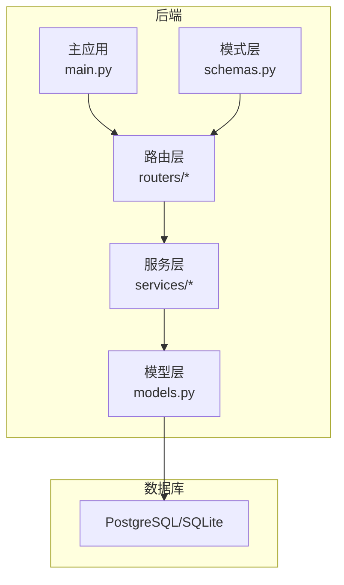
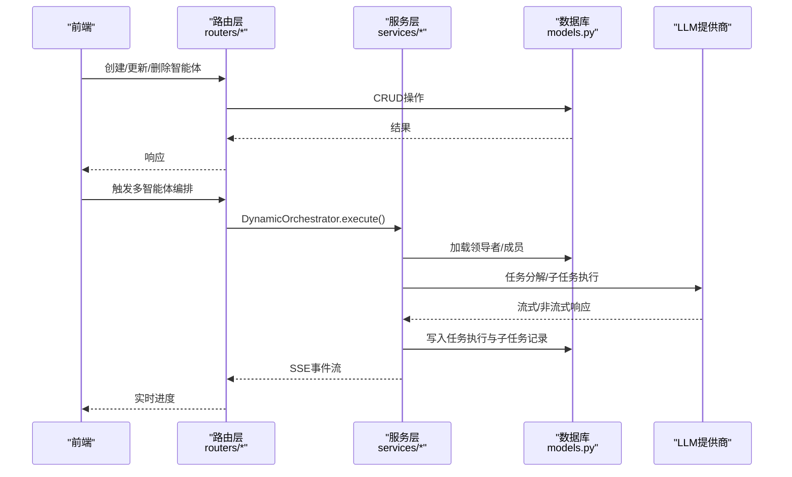
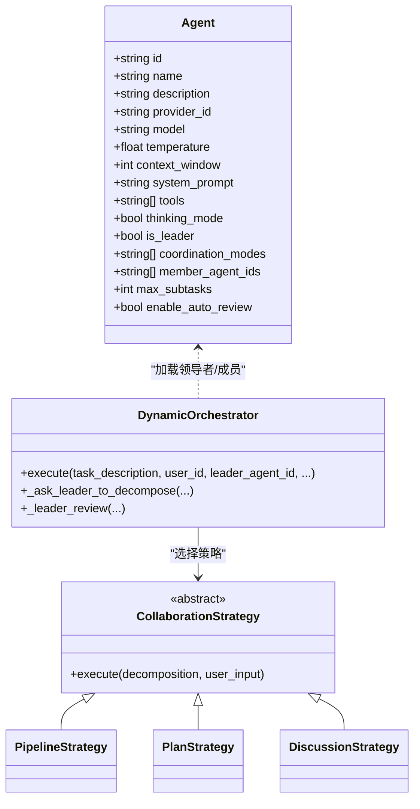
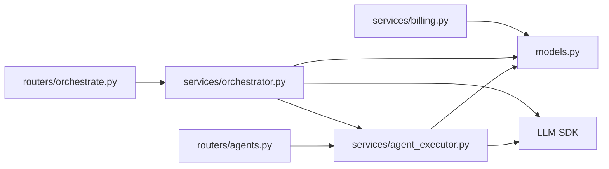

# 智能体API

<cite>
**本文档引用的文件**
- [agents.py](file://backend/agents.py)
- [orchestrator.py](file://backend/services/orchestrator.py)
- [agent_executor.py](file://backend/services/agent_executor.py)
- [agents.py](file://backend/routers/agents.py)
- [orchestrate.py](file://backend/routers/orchestrate.py)
- [models.py](file://backend/models.py)
- [schemas.py](file://backend/schemas.py)
- [main.py](file://backend/main.py)
- [billing.py](file://backend/services/billing.py)
- [admin.py](file://backend/routers/admin.py)
</cite>

## 目录
1. [简介](#简介)
2. [项目结构](#项目结构)
3. [核心组件](#核心组件)
4. [架构总览](#架构总览)
5. [详细组件分析](#详细组件分析)
6. [依赖关系分析](#依赖关系分析)
7. [性能考虑](#性能考虑)
8. [故障排查指南](#故障排查指南)
9. [结论](#结论)
10. [附录](#附录)

## 简介
本文件面向“智能体API”的使用者与维护者，系统性梳理智能体的创建、配置、更新与删除接口；智能体参数管理API（系统提示、工具配置、执行参数）；智能体执行控制API（手动触发、自动执行、状态查询）；多智能体协作API（领导者选择、任务分配与结果聚合）；以及配置验证、执行历史查询与性能监控接口。同时提供智能体生命周期管理与故障恢复的API说明，帮助读者快速理解并正确使用该系统的智能体能力。

## 项目结构
后端采用FastAPI框架，路由层负责对外暴露REST接口，服务层封装业务逻辑（如编排、计费），模型层定义数据库结构，模式层定义请求/响应数据结构。前端通过Axios调用后端接口，后端通过SQLAlchemy进行数据库交互。

图表来源
- [main.py:110-153](file://backend/main.py#L110-L153)
- [routers/agents.py:10-14](file://backend/routers/agents.py#L10-L14)
- [services/orchestrator.py:1-22](file://backend/services/orchestrator.py#L1-L22)
- [models.py:1-447](file://backend/models.py#L1-L447)
- [schemas.py:1-859](file://backend/schemas.py#L1-L859)

章节来源
- [main.py:110-153](file://backend/main.py#L110-L153)

## 核心组件
- 智能体模型与参数：Agent模型包含名称、描述、提供商、模型、温度、上下文窗口、系统提示、工具、思维模式、计费参数、领导者配置、目标节点类型等字段。
- 编排引擎：DynamicOrchestrator负责加载领导者与成员、任务分解、策略执行（流水线/计划/讨论）、事件流输出、最终审核与收尾。
- 执行器：AgentExecutor封装对话式智能体执行，支持非流式与流式两种执行方式，统一统计token与字符用量。
- 计费模块：基于维度映射表计算积分消耗，支持文本输出、图像输出、搜索、图像生成、视频等多维计费。
- 路由层：提供智能体CRUD、编排执行、历史查询、取消任务等API。

章节来源
- [models.py:196-253](file://backend/models.py#L196-L253)
- [schemas.py:239-350](file://backend/schemas.py#L239-L350)
- [orchestrator.py:560-673](file://backend/services/orchestrator.py#L560-L673)
- [agent_executor.py:63-208](file://backend/services/agent_executor.py#L63-L208)
- [billing.py:12-350](file://backend/services/billing.py#L12-L350)

## 架构总览
智能体API围绕“智能体配置—执行—编排—计费—查询”闭环展开。前端通过路由层发起请求，后端服务层完成业务处理，数据库持久化状态与历史。

图表来源
- [routers/agents.py:16-150](file://backend/routers/agents.py#L16-L150)
- [routers/orchestrate.py:26-184](file://backend/routers/orchestrate.py#L26-L184)
- [orchestrator.py:560-673](file://backend/services/orchestrator.py#L560-L673)
- [agent_executor.py:74-208](file://backend/services/agent_executor.py#L74-L208)

## 详细组件分析

### 智能体创建、配置、更新与删除API
- 创建智能体
  - 方法与路径：POST /api/agents
  - 请求体：AgentCreate（名称、描述、提供商ID、模型、智能体类型、温度、上下文窗口、系统提示、工具、思维模式、计费参数、领导者配置、图像配置、目标节点类型等）
  - 校验逻辑：
    - 名称唯一性校验
    - 提供商存在性校验
    - 模型在提供商可用模型列表内校验
  - 响应：AgentResponse
- 列表与搜索
  - GET /api/agents?skip=&limit=&search=
  - 响应：AgentResponse数组
- 获取单个智能体
  - GET /api/agents/{agent_id}
  - 响应：AgentResponse
- 更新智能体
  - PUT /api/agents/{agent_id}
  - 请求体：AgentUpdate（可选字段）
  - 校验逻辑：名称唯一性、提供商与模型有效性
  - 响应：AgentResponse
- 删除智能体
  - DELETE /api/agents/{agent_id}
  - 响应：成功消息

章节来源
- [routers/agents.py:16-150](file://backend/routers/agents.py#L16-L150)
- [schemas.py:284-350](file://backend/schemas.py#L284-L350)
- [models.py:196-253](file://backend/models.py#L196-L253)

### 智能体参数管理API
- 系统提示与工具配置
  - 系统提示：Agent.system_prompt
  - 工具配置：Agent.tools（启用的工具名称列表）
  - 执行参数：temperature、context_window、thinking_mode
- 图像生成配置（供应商无关）
  - 统一图像生成配置：Agent.image_config（包含宽高比、质量、批次数、输出格式等）
  - 供应商特定配置：GeminiConfig、XAIImageGenConfig
- 多模态与节点类型控制
  - Agent.target_node_types：可控制的画布节点类型集合
- 参数验证
  - 节点类型枚举校验
  - 数值范围校验（温度、上下文窗口、计费参数等）

章节来源
- [schemas.py:239-350](file://backend/schemas.py#L239-L350)
- [models.py:196-253](file://backend/models.py#L196-L253)

### 智能体执行控制API
- 手动触发与自动执行
  - POST /api/orchestrate：提交任务描述、领导者智能体ID、会话ID、剧场ID、编排模式（auto/pipeline/plan/discussion）、选项（迭代次数、是否自动审核）
  - 返回Server-Sent Events流，实时推送任务开始、子任务创建/运行/完成、讨论轮次、最终审核等事件
- 状态查询
  - GET /api/orchestrate/{task_execution_id}：获取单个任务执行详情及子任务列表
  - GET /api/orchestrate?status=&skip=&limit=：分页查询当前用户的任务执行历史
- 取消任务
  - DELETE /api/orchestrate/{task_execution_id}：仅允许取消pending/running状态的任务

章节来源
- [routers/orchestrate.py:26-184](file://backend/routers/orchestrate.py#L26-L184)
- [schemas.py:428-476](file://backend/schemas.py#L428-L476)
- [orchestrator.py:560-673](file://backend/services/orchestrator.py#L560-L673)

### 多智能体协作API
- 领导者选择
  - Agent.is_leader：标记为领导者
  - Agent.coordination_modes：支持的协作模式（pipeline/plan/discussion）
  - Agent.member_agent_ids：可编排的成员智能体ID列表
  - Agent.max_subtasks：最大子任务数
  - Agent.enable_auto_review：是否启用自动审核
- 任务分配与执行
  - DynamicOrchestrator根据领导者系统提示进行任务分解，生成子任务规范（agent_id、描述、依赖、索引）
  - 策略执行：
    - 流水线（pipeline）：顺序或并行执行
    - 计划（plan）：基于依赖图的拓扑执行
    - 讨论（discussion）：多轮讨论，领导者评估是否继续
- 结果聚合
  - 子任务完成后汇总token统计、输出内容与错误信息
  - 可选领导者自动审核，输出最终摘要

图表来源
- [models.py:196-253](file://backend/models.py#L196-L253)
- [orchestrator.py:560-673](file://backend/services/orchestrator.py#L560-L673)
- [orchestrator.py:254-530](file://backend/services/orchestrator.py#L254-L530)

章节来源
- [models.py:196-253](file://backend/models.py#L196-L253)
- [orchestrator.py:560-673](file://backend/services/orchestrator.py#L560-L673)

### 智能体配置验证
- 名称唯一性：创建/更新时检查重复
- 提供商与模型：校验提供商存在且模型在提供商可用列表内
- 节点类型：限定于脚本、角色、故事板、视频等集合
- 数值范围：温度[0,1]、上下文窗口≥4096、计费参数≥0等

章节来源
- [routers/agents.py:16-150](file://backend/routers/agents.py#L16-L150)
- [schemas.py:275-331](file://backend/schemas.py#L275-L331)

### 执行历史查询与性能监控
- 任务执行历史
  - GET /api/orchestrate?status=&skip=&limit=：分页查询
  - GET /api/orchestrate/{task_execution_id}：获取详情与子任务
- 性能监控
  - 令牌统计：input_tokens、output_tokens
  - 字符统计：input_chars、output_chars
  - 计费统计：总积分消耗、维度明细（文本输入/输出、图像输出、搜索、图像生成等）

章节来源
- [routers/orchestrate.py:74-147](file://backend/routers/orchestrate.py#L74-L147)
- [agent_executor.py:113-125](file://backend/services/agent_executor.py#L113-L125)
- [billing.py:310-350](file://backend/services/billing.py#L310-L350)

### 生命周期管理与故障恢复
- 生命周期
  - 创建：写入Agent表
  - 运行：通过编排引擎执行，记录TaskExecution/SubTask
  - 完成/失败：更新状态与元数据
  - 删除：软/硬删除（路由层打印审计日志）
- 故障恢复
  - 任务取消：仅允许pending/running状态取消
  - 余额与冻结：检查余额充足与未冻结，失败抛出对应异常
  - 退款：原子化退还积分并记录交易

章节来源
- [routers/agents.py:138-150](file://backend/routers/agents.py#L138-L150)
- [routers/orchestrate.py:149-184](file://backend/routers/orchestrate.py#L149-L184)
- [billing.py:45-84](file://backend/services/billing.py#L45-L84)
- [billing.py:178-308](file://backend/services/billing.py#L178-L308)

## 依赖关系分析
- 路由层依赖服务层与模式层，服务层依赖模型层与第三方LLM SDK。
- 编排引擎依赖执行器与计费模块，执行器依赖模型层与LLM SDK。
- 计费模块独立，通过映射表驱动维度计费，兼容不同结果对象。

图表来源
- [routers/agents.py:1-151](file://backend/routers/agents.py#L1-L151)
- [routers/orchestrate.py:1-184](file://backend/routers/orchestrate.py#L1-L184)
- [agent_executor.py:1-287](file://backend/services/agent_executor.py#L1-L287)
- [orchestrator.py:1-800](file://backend/services/orchestrator.py#L1-L800)
- [billing.py:1-388](file://backend/services/billing.py#L1-L388)
- [models.py:1-447](file://backend/models.py#L1-L447)

章节来源
- [routers/agents.py:1-151](file://backend/routers/agents.py#L1-L151)
- [routers/orchestrate.py:1-184](file://backend/routers/orchestrate.py#L1-L184)
- [agent_executor.py:1-287](file://backend/services/agent_executor.py#L1-L287)
- [orchestrator.py:1-800](file://backend/services/orchestrator.py#L1-L800)
- [billing.py:1-388](file://backend/services/billing.py#L1-L388)
- [models.py:1-447](file://backend/models.py#L1-L447)

## 性能考虑
- 流式执行：AgentExecutor.execute_streaming提供实时分块输出，降低首屏延迟。
- 缓存复用：AgentExecutor缓存模型与对话式智能体实例，减少重复初始化开销。
- 并行执行：PipelineStrategy并行执行子任务，提升吞吐。
- 令牌统计：统一在对话式智能体回复中提取input_tokens/output_tokens，便于精确计费与性能分析。
- 数据库事务：编排过程中的子任务记录与计费均在事务中完成，保证一致性。

章节来源
- [agent_executor.py:127-163](file://backend/services/agent_executor.py#L127-L163)
- [agent_executor.py:273-277](file://backend/services/agent_executor.py#L273-L277)
- [orchestrator.py:308-319](file://backend/services/orchestrator.py#L308-L319)
- [agents.py:114-174](file://backend/agents.py#L114-L174)

## 故障排查指南
- 402 余额不足：编排接口在执行前检查用户积分，不足时拒绝请求
- 400 参数错误：提供商不存在、模型不在可用列表、名称重复等
- 404 未找到：智能体/任务执行记录不存在
- 400 状态不可取消：仅pending/running可取消
- 余额冻结：检查用户冻结状态
- 退款与计费：使用原子化扣费/退款，失败时抛出相应异常

章节来源
- [routers/orchestrate.py:37-42](file://backend/routers/orchestrate.py#L37-L42)
- [routers/agents.py:16-64](file://backend/routers/agents.py#L16-L64)
- [routers/orchestrate.py:169-173](file://backend/routers/orchestrate.py#L169-L173)
- [billing.py:37-43](file://backend/services/billing.py#L37-L43)
- [billing.py:178-308](file://backend/services/billing.py#L178-L308)

## 结论
本智能体API体系以清晰的路由层、稳健的服务层与严谨的模型层为基础，提供了从智能体配置到多智能体协作、从执行控制到计费与历史查询的完整能力。通过标准化的参数管理、严格的配置验证、灵活的编排策略与完善的故障处理机制，能够满足复杂场景下的智能体应用需求。

## 附录

### API一览（按功能分组）
- 智能体管理
  - POST /api/agents：创建智能体
  - GET /api/agents：列表与搜索
  - GET /api/agents/{agent_id}：获取智能体
  - PUT /api/agents/{agent_id}：更新智能体
  - DELETE /api/agents/{agent_id}：删除智能体
- 多智能体编排
  - POST /api/orchestrate：触发编排（SSE）
  - GET /api/orchestrate/{task_execution_id}：查询任务详情
  - GET /api/orchestrate：查询任务历史
  - DELETE /api/orchestrate/{task_execution_id}：取消任务
- 管理员与计费
  - 管理员积分调整、订阅管理、用户统计等（见管理员路由）

章节来源
- [routers/agents.py:16-150](file://backend/routers/agents.py#L16-L150)
- [routers/orchestrate.py:26-184](file://backend/routers/orchestrate.py#L26-L184)
- [admin.py:1-501](file://backend/routers/admin.py#L1-L501)