# 管理员API

<cite>
**本文档引用的文件**
- [admin.py](file://backend/routers/admin.py)
- [admin_auth.py](file://backend/routers/admin_auth.py)
- [admin_debug.py](file://backend/routers/admin_debug.py)
- [llm_config.py](file://backend/routers/llm_config.py)
- [prompt_templates.py](file://backend/routers/prompt_templates.py)
- [skills_api.py](file://backend/routers/skills_api.py)
- [users_page.tsx](file://backend/admin/src/app/admin/users/page.tsx)
- [llm_page.tsx](file://backend/admin/src/app/admin/llm/page.tsx)
- [prompt_templates_page.tsx](file://backend/admin/src/app/admin/prompt-templates/page.tsx)
- [skills_page.tsx](file://backend/admin/src/app/admin/skills/page.tsx)
- [subscriptions_page.tsx](file://backend/admin/src/app/admin/subscriptions/page.tsx)
- [videos_page.tsx](file://backend/admin/src/app/admin/videos/page.tsx)
- [mcp_page.tsx](file://backend/admin/src/app/admin/mcp/page.tsx)
- [agent_detail_page.tsx](file://backend/admin/src/app/admin/agents/[id]/page.tsx)
</cite>

## 目录
1. [简介](#简介)
2. [项目结构](#项目结构)
3. [核心组件](#核心组件)
4. [架构总览](#架构总览)
5. [详细组件分析](#详细组件分析)
6. [依赖关系分析](#依赖关系分析)
7. [性能考虑](#性能考虑)
8. [故障排除指南](#故障排除指南)
9. [结论](#结论)

## 简介
本文件为无限游戏项目的管理员API完整文档，涵盖以下领域：
- 用户管理API：用户查询、权限修改、账户冻结、订阅管理、积分管理
- 内容审核API：违规内容检测、举报处理、封禁管理（概念性说明）
- 系统监控API：性能指标、日志查询、错误报告（概念性说明）
- LLM提供商管理API：配置更新、费用调整、状态监控
- 提示词模板管理API：模板创建、更新、删除、AI生成
- 系统配置API：全局设置、功能开关、维护模式（概念性说明）
- 统计数据API：用户活跃度、收入报表、使用分析（概念性说明）

本项目采用FastAPI后端与Next.js前端分离架构，管理员端提供RESTful API与可视化界面。

## 项目结构
后端采用模块化路由组织，管理员相关功能集中在`/api/admin`前缀下；前端管理员界面位于`backend/admin/src/app/admin`目录，按功能模块划分页面组件。

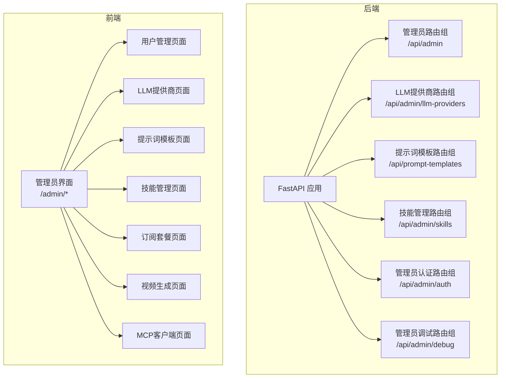

**图表来源**
- [admin.py:1-501](file://backend/routers/admin.py#L1-L501)
- [llm_config.py:1-233](file://backend/routers/llm_config.py#L1-L233)
- [prompt_templates.py:1-320](file://backend/routers/prompt_templates.py#L1-L320)
- [skills_api.py:1-207](file://backend/routers/skills_api.py#L1-L207)
- [admin_auth.py:1-136](file://backend/routers/admin_auth.py#L1-L136)
- [admin_debug.py:1-713](file://backend/routers/admin_debug.py#L1-L713)

**章节来源**
- [admin.py:1-501](file://backend/routers/admin.py#L1-L501)
- [llm_config.py:1-233](file://backend/routers/llm_config.py#L1-L233)
- [prompt_templates.py:1-320](file://backend/routers/prompt_templates.py#L1-L320)
- [skills_api.py:1-207](file://backend/routers/skills_api.py#L1-L207)
- [admin_auth.py:1-136](file://backend/routers/admin_auth.py#L1-L136)
- [admin_debug.py:1-713](file://backend/routers/admin_debug.py#L1-L713)

## 核心组件
- 管理员认证与授权：提供登录、刷新令牌、获取当前管理员信息等接口
- 用户管理：用户列表查询、详情查询、删除、积分调整、订阅管理
- LLM提供商管理：提供商创建、查询、更新、删除、连接测试
- 提示词模板管理：模板CRUD、AI生成、类型枚举
- 技能管理：技能CRUD、启用/禁用、版本控制
- 管理员调试：独立的调试会话与消息流式响应
- 订阅套餐管理：套餐CRUD、定价策略、利润分析
- 视频生成管理：任务列表、状态监控、预览与删除
- MCP客户端管理：客户端连接状态、工具数量展示（前端占位）

**章节来源**
- [admin_auth.py:36-136](file://backend/routers/admin_auth.py#L36-L136)
- [admin.py:29-501](file://backend/routers/admin.py#L29-L501)
- [llm_config.py:101-233](file://backend/routers/llm_config.py#L101-L233)
- [prompt_templates.py:32-320](file://backend/routers/prompt_templates.py#L32-L320)
- [skills_api.py:123-207](file://backend/routers/skills_api.py#L123-L207)
- [admin_debug.py:113-713](file://backend/routers/admin_debug.py#L113-L713)

## 架构总览
管理员API采用分层设计：
- 路由层：定义REST端点与HTTP方法
- 业务层：实现权限校验、数据校验、业务规则
- 数据访问层：SQLAlchemy异步会话、ORM模型
- 前端界面：Next.js页面组件，使用SWR进行数据拉取与缓存

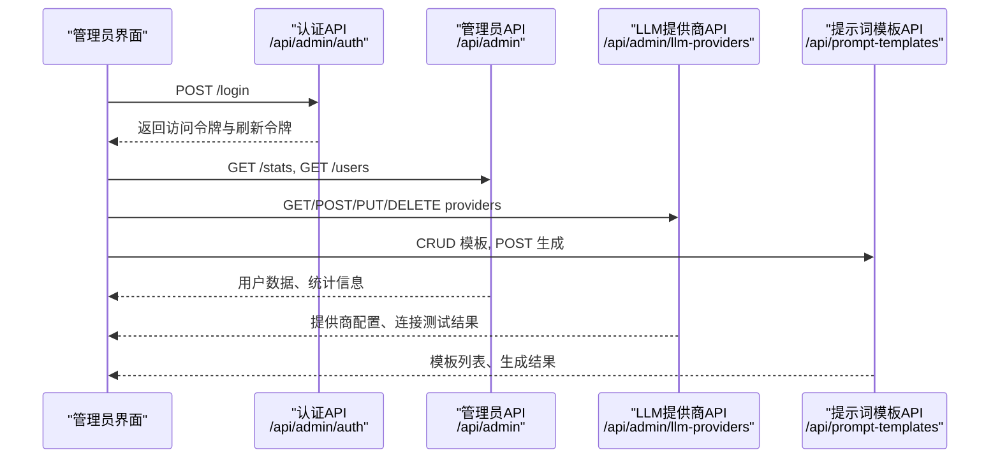

**图表来源**
- [admin_auth.py:36-91](file://backend/routers/admin_auth.py#L36-L91)
- [admin.py:29-136](file://backend/routers/admin.py#L29-L136)
- [llm_config.py:137-233](file://backend/routers/llm_config.py#L137-L233)
- [prompt_templates.py:32-292](file://backend/routers/prompt_templates.py#L32-L292)

## 详细组件分析

### 管理员认证与授权
- 登录：邮箱+密码校验，生成访问令牌与刷新令牌，记录登录IP与时间
- 刷新：校验刷新令牌有效性，重新签发访问令牌
- 当前管理员：获取已登录管理员信息

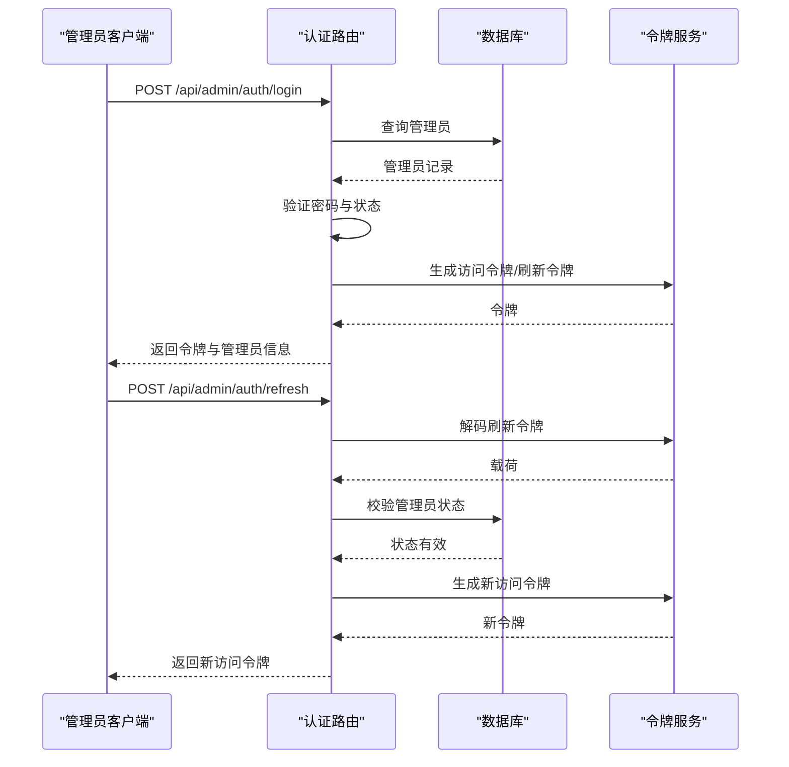

**图表来源**
- [admin_auth.py:36-127](file://backend/routers/admin_auth.py#L36-L127)

**章节来源**
- [admin_auth.py:36-136](file://backend/routers/admin_auth.py#L36-L136)

### 用户管理API
- 统计信息：用户数、剧场数、资产数、提供商数、管理员数
- 用户列表：分页查询用户基本信息
- 用户详情：按ID查询用户详细信息
- 删除用户：级联删除用户相关数据
- 积分管理：手动调整用户积分，记录交易流水
- 订阅管理：设置/取消用户订阅，自动发放积分

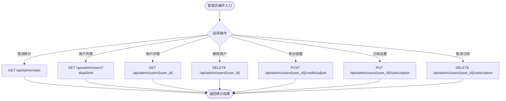

**图表来源**
- [admin.py:29-302](file://backend/routers/admin.py#L29-L302)

**章节来源**
- [admin.py:29-302](file://backend/routers/admin.py#L29-L302)
- [users_page.tsx:87-449](file://backend/admin/src/app/admin/users/page.tsx#L87-L449)

### LLM提供商管理API
- 连接测试：支持多种提供商，视频模型使用特殊测试流程
- 创建提供商：唯一性校验，可设置默认提供商
- 查询提供商：分页查询
- 更新提供商：可切换默认状态
- 删除提供商：删除提供商

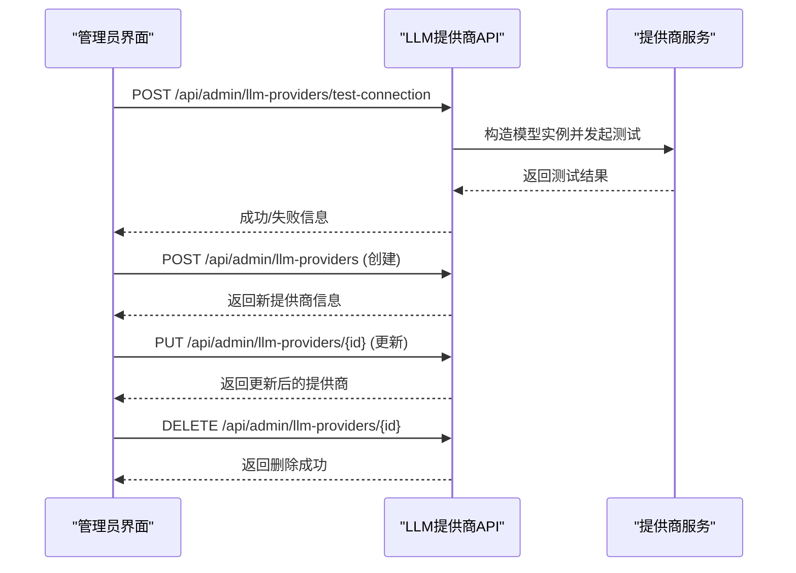

**图表来源**
- [llm_config.py:101-233](file://backend/routers/llm_config.py#L101-L233)

**章节来源**
- [llm_config.py:101-233](file://backend/routers/llm_config.py#L101-L233)
- [llm_page.tsx:10-31](file://backend/admin/src/app/admin/llm/page.tsx#L10-L31)

### 提示词模板管理API
- 模板CRUD：创建、查询列表、详情、更新、删除
- 类型枚举：获取模板类型列表
- AI生成：使用模板渲染变量，调用LLM生成内容，解析JSON并扣费

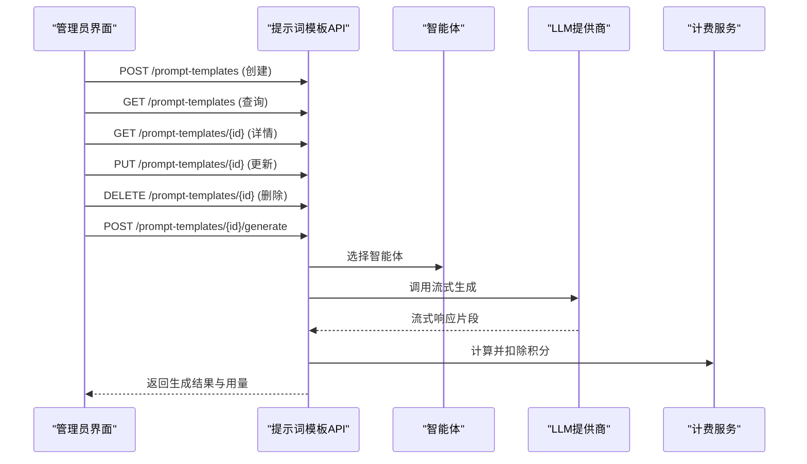

**图表来源**
- [prompt_templates.py:32-292](file://backend/routers/prompt_templates.py#L32-L292)

**章节来源**
- [prompt_templates.py:32-320](file://backend/routers/prompt_templates.py#L32-L320)
- [prompt_templates_page.tsx:53-268](file://backend/admin/src/app/admin/prompt-templates/page.tsx#L53-L268)

### 技能管理API
- 技能CRUD：创建、更新、删除（内置技能不可删除）、启用/禁用
- 列表与详情：获取技能列表与详细内容（含Markdown正文）
- 版本控制：从frontmatter提取版本号

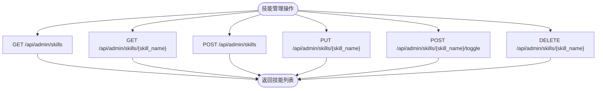

**图表来源**
- [skills_api.py:123-207](file://backend/routers/skills_api.py#L123-L207)

**章节来源**
- [skills_api.py:123-207](file://backend/routers/skills_api.py#L123-L207)
- [skills_page.tsx:37-185](file://backend/admin/src/app/admin/skills/page.tsx#L37-L185)

### 管理员调试API
- 调试会话：创建、查询、删除
- 会话消息：查询消息列表（支持多模态内容反序列化）
- 流式响应：发送消息并接收SSE流，支持单智能体与多智能体模式
- 计费统计：记录管理员使用统计与积分扣减

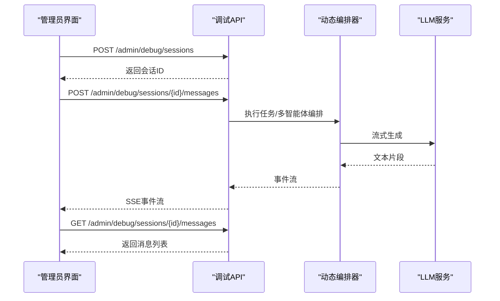

**图表来源**
- [admin_debug.py:113-713](file://backend/routers/admin_debug.py#L113-L713)

**章节来源**
- [admin_debug.py:113-713](file://backend/routers/admin_debug.py#L113-L713)

### 订阅套餐管理API
- 套餐CRUD：创建、更新、删除
- 列表展示：支持排序、计费周期、价格、积分、单价、利润率计算
- 前端交互：表单校验、特性列表增删、自动计算指标

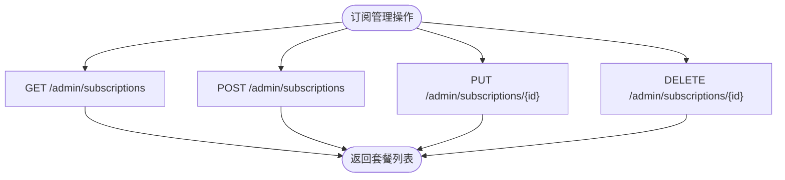

**图表来源**
- [subscriptions_page.tsx:87-522](file://backend/admin/src/app/admin/subscriptions/page.tsx#L87-L522)

**章节来源**
- [subscriptions_page.tsx:87-522](file://backend/admin/src/app/admin/subscriptions/page.tsx#L87-L522)

### 视频生成管理API
- 任务列表：分页查询视频任务，支持自动轮询
- 状态监控：排队中、生成中、已完成、失败
- 预览与删除：完成或失败的任务可删除

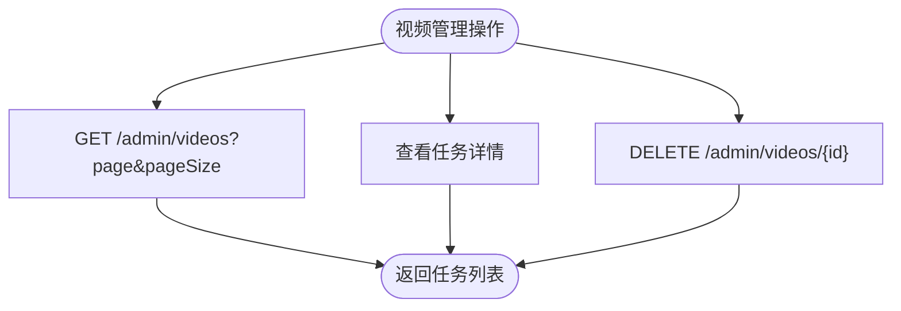

**图表来源**
- [videos_page.tsx:50-270](file://backend/admin/src/app/admin/videos/page.tsx#L50-L270)

**章节来源**
- [videos_page.tsx:50-270](file://backend/admin/src/app/admin/videos/page.tsx#L50-L270)

### MCP客户端管理API
- 客户端展示：协议、连接状态、工具数量
- 前端占位：提供客户端管理UI，支持添加、编辑、删除（功能待实现）

**章节来源**
- [mcp_page.tsx:11-108](file://backend/admin/src/app/admin/mcp/page.tsx#L11-L108)

### 智能体详情页面
- 新建/编辑智能体：配置基础信息、模型参数、系统提示词
- 实时聊天预览：集成聊天界面组件

**章节来源**
- [agent_detail_page.tsx:19-149](file://backend/admin/src/app/admin/agents/[id]/page.tsx#L19-L149)

## 依赖关系分析
- 路由依赖：各API路由相互独立，通过权限装饰器require_admin进行鉴权
- 数据库依赖：使用SQLAlchemy异步会话，模型间存在外键关系（如用户与订阅、会话与用户）
- 前后端依赖：前端页面通过axios调用后端API，使用SWR进行数据缓存与刷新

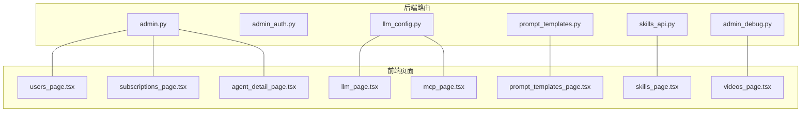

**图表来源**
- [admin.py:1-501](file://backend/routers/admin.py#L1-L501)
- [llm_config.py:1-233](file://backend/routers/llm_config.py#L1-L233)
- [prompt_templates.py:1-320](file://backend/routers/prompt_templates.py#L1-L320)
- [skills_api.py:1-207](file://backend/routers/skills_api.py#L1-L207)
- [admin_debug.py:1-713](file://backend/routers/admin_debug.py#L1-L713)
- [users_page.tsx:1-450](file://backend/admin/src/app/admin/users/page.tsx#L1-L450)
- [llm_page.tsx:1-31](file://backend/admin/src/app/admin/llm/page.tsx#L1-L31)
- [prompt_templates_page.tsx:1-268](file://backend/admin/src/app/admin/prompt-templates/page.tsx#L1-L268)
- [skills_page.tsx:1-185](file://backend/admin/src/app/admin/skills/page.tsx#L1-L185)
- [subscriptions_page.tsx:1-522](file://backend/admin/src/app/admin/subscriptions/page.tsx#L1-L522)
- [videos_page.tsx:1-270](file://backend/admin/src/app/admin/videos/page.tsx#L1-L270)
- [mcp_page.tsx:1-108](file://backend/admin/src/app/admin/mcp/page.tsx#L1-L108)
- [agent_detail_page.tsx:1-149](file://backend/admin/src/app/admin/agents/[id]/page.tsx#L1-L149)

## 性能考虑
- 异步数据库访问：使用SQLAlchemy异步会话，减少阻塞
- 分页查询：用户列表、模板列表、视频任务均支持skip/limit
- SSE流式响应：调试与提示词生成采用流式传输，降低延迟
- 缓存策略：前端使用SWR进行数据缓存与自动刷新
- 连接测试：LLM提供商连接测试使用超时控制，避免长时间阻塞

## 故障排除指南
- 认证失败：检查邮箱/密码、账户状态、IP记录
- 权限不足：确认管理员权限级别与激活状态
- 数据不存在：检查ID有效性，注意软删除与级联删除
- LLM连接异常：检查API Key、Base URL、模型名称与提供商类型
- 提示词模板渲染错误：检查模板变量与Jinja2语法
- 技能管理错误：内置技能不可删除，启用/禁用需正确路径

**章节来源**
- [admin_auth.py:50-72](file://backend/routers/admin_auth.py#L50-L72)
- [llm_config.py:132-136](file://backend/routers/llm_config.py#L132-L136)
- [prompt_templates.py:214-216](file://backend/routers/prompt_templates.py#L214-L216)
- [skills_api.py:176-180](file://backend/routers/skills_api.py#L176-L180)

## 结论
管理员API提供了完善的后台管理能力，覆盖用户管理、LLM提供商配置、提示词模板与技能管理、调试与监控等功能。前后端分离架构保证了良好的可维护性与扩展性。建议在生产环境中加强安全审计、日志监控与性能优化，持续完善内容审核与系统监控能力。