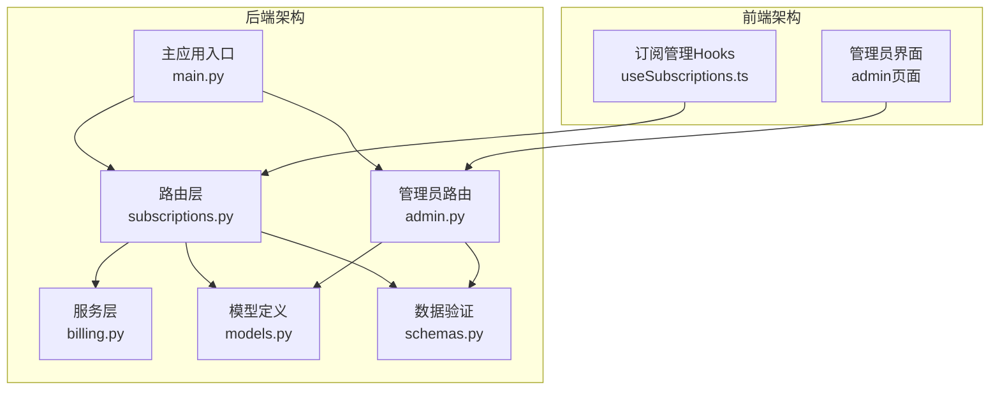
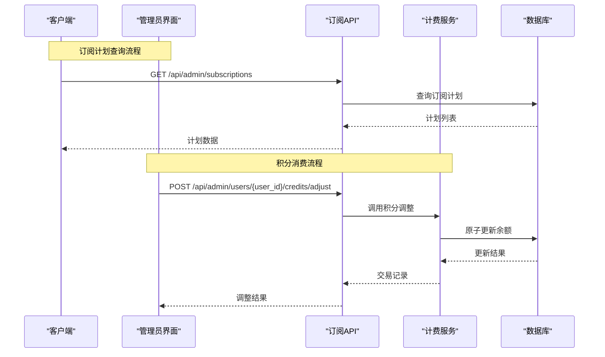
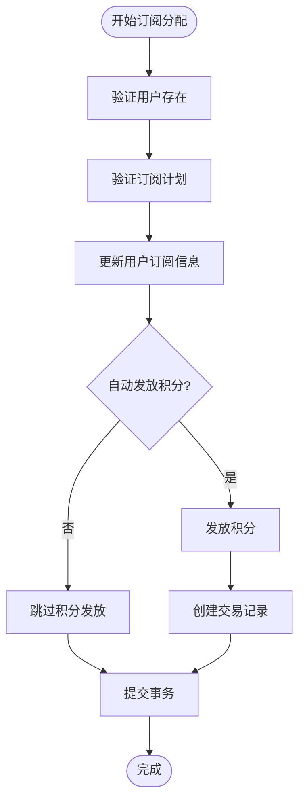
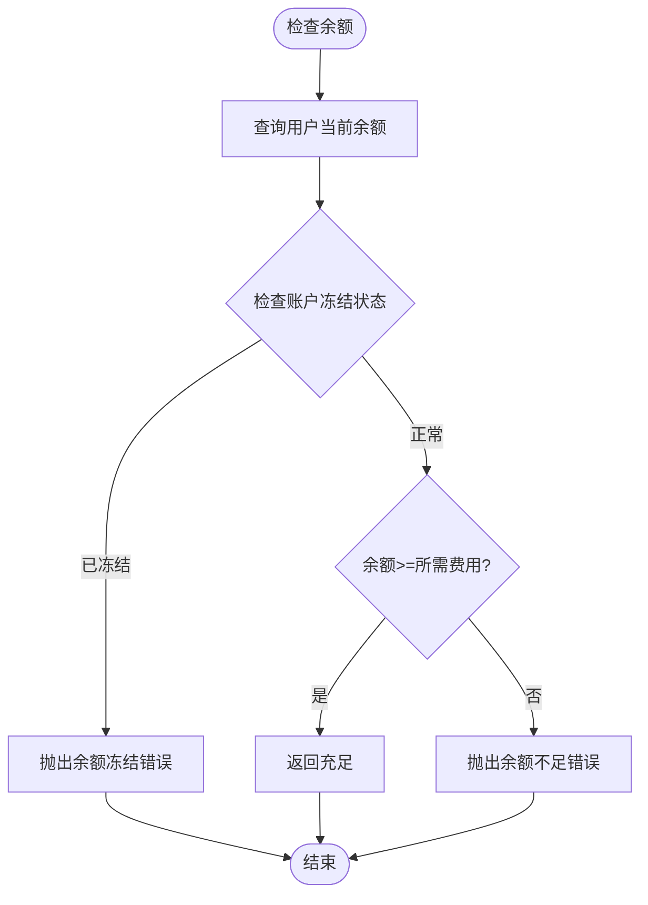
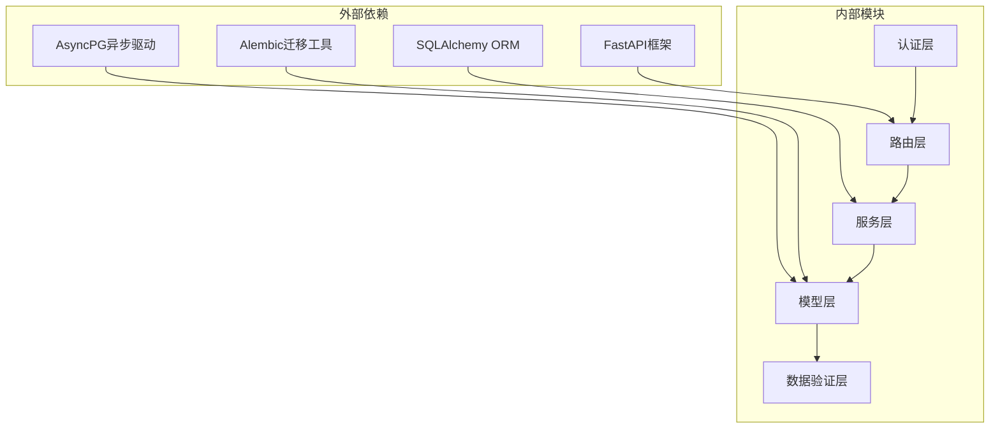

# 订阅API

<cite>
**本文档引用的文件**
- [subscriptions.py](file://backend/routers/subscriptions.py)
- [billing.py](file://backend/services/billing.py)
- [models.py](file://backend/models.py)
- [schemas.py](file://backend/schemas.py)
- [admin.py](file://backend/routers/admin.py)
- [useSubscriptions.ts](file://backend/admin/src/hooks/useSubscriptions.ts)
- [BILLING_REVIEW.md](file://backend/docs/BILLING_REVIEW.md)
- [main.py](file://backend/main.py)
- [c74e516c6d87_add_credit_billing_system.py](file://backend/migrations/versions/c74e516c6d87_add_credit_billing_system.py)
- [h4i5j6k7l8m9_add_model_costs_and_subscriptions.py](file://backend/migrations/versions/h4i5j6k7l8m9_add_model_costs_and_subscriptions.py)
</cite>

## 目录
1. [简介](#简介)
2. [项目结构](#项目结构)
3. [核心组件](#核心组件)
4. [架构概览](#架构概览)
5. [详细组件分析](#详细组件分析)
6. [依赖关系分析](#依赖关系分析)
7. [性能考虑](#性能考虑)
8. [故障排除指南](#故障排除指南)
9. [结论](#结论)
10. [附录](#附录)

## 简介
本文档详细记录了无限叙事剧院项目的订阅API系统，涵盖订阅计划查询、订阅购买、订阅状态管理、积分消费以及计费历史等功能。系统基于FastAPI构建，采用异步数据库访问和严格的权限控制，支持管理员后台管理和前端用户交互。

## 项目结构
订阅API系统主要分布在以下模块中：



**图表来源**
- [main.py:138-152](file://backend/main.py#L138-L152)
- [subscriptions.py:14-18](file://backend/routers/subscriptions.py#L14-L18)

**章节来源**
- [main.py:138-152](file://backend/main.py#L138-L152)
- [subscriptions.py:14-18](file://backend/routers/subscriptions.py#L14-L18)

## 核心组件
订阅API系统由以下核心组件构成：

### 订阅计划管理
- **计划创建/更新/删除**：管理员权限控制的CRUD操作
- **计划查询**：支持分页和排序的计划列表查询
- **计划详情**：单个计划的详细信息获取

### 积分消费系统
- **余额检查**：原子性的余额充足性验证
- **积分扣除**：并发安全的原子扣费操作
- **积分充值**：管理员手动调整用户积分
- **消费记录**：完整的积分交易历史追踪

### 订阅状态管理
- **订阅分配**：管理员为用户设置订阅计划
- **订阅取消**：取消用户的订阅状态
- **状态同步**：与外部支付系统的状态同步

**章节来源**
- [subscriptions.py:21-119](file://backend/routers/subscriptions.py#L21-L119)
- [billing.py:45-308](file://backend/services/billing.py#L45-L308)
- [admin.py:220-301](file://backend/routers/admin.py#L220-L301)

## 架构概览



**图表来源**
- [subscriptions.py:40-51](file://backend/routers/subscriptions.py#L40-L51)
- [admin.py:141-187](file://backend/routers/admin.py#L141-L187)
- [billing.py:178-308](file://backend/services/billing.py#L178-L308)

## 详细组件分析

### 订阅计划查询API

#### API定义
| 方法 | 路径 | 权限 | 功能 |
|------|------|------|------|
| GET | `/api/admin/subscriptions` | 管理员 | 获取所有订阅计划列表 |
| GET | `/api/admin/subscriptions/{plan_id}` | 管理员 | 获取单个订阅计划详情 |
| POST | `/api/admin/subscriptions` | 管理员 | 创建新的订阅计划 |
| PUT | `/api/admin/subscriptions/{plan_id}` | 管理员 | 更新现有订阅计划 |
| DELETE | `/api/admin/subscriptions/{plan_id}` | 管理员 | 删除订阅计划 |

#### 数据模型
订阅计划包含以下关键字段：
- **基础信息**：名称、描述、激活状态
- **定价信息**：价格(USD)、包含积分、计费周期
- **展示配置**：特性列表、排序权重
- **时间戳**：创建和更新时间

**章节来源**
- [subscriptions.py:40-119](file://backend/routers/subscriptions.py#L40-L119)
- [models.py:369-389](file://backend/models.py#L369-L389)

### 订阅购买API

#### 管理员订阅分配
管理员可以通过以下API为用户分配订阅：



**图表来源**
- [admin.py:220-279](file://backend/routers/admin.py#L220-L279)

#### 订阅取消API
管理员可以取消用户的订阅状态：
- 设置订阅状态为"inactive"
- 清空订阅开始/结束时间
- 保持其他用户信息不变

**章节来源**
- [admin.py:220-301](file://backend/routers/admin.py#L220-L301)

### 积分消费API

#### 余额检查机制
系统提供原子性的余额检查功能，确保并发安全：



**图表来源**
- [billing.py:45-84](file://backend/services/billing.py#L45-L84)

#### 原子扣费机制
积分扣除采用原子更新确保并发安全：

| 参数 | 类型 | 描述 |
|------|------|------|
| user_id | string | 用户标识符 |
| cost | float | 扣除金额 |
| session | AsyncSession | 数据库会话 |
| metadata | dict | 交易元数据 |
| transaction_type | string | 交易类型 |

**章节来源**
- [billing.py:178-308](file://backend/services/billing.py#L178-L308)

### 计费历史查询API

#### 交易记录结构
每个积分交易包含以下信息：
- **用户信息**：user_id或admin_id
- **交易详情**：amount、balance_before、balance_after
- **元数据**：transaction_type、metadata_json
- **时间戳**：created_at

#### 历史查询接口
管理员可以通过以下API查询用户积分历史：
- 支持分页查询（skip、limit参数）
- 按时间倒序排列
- 返回标准化的交易记录

**章节来源**
- [admin.py:190-214](file://backend/routers/admin.py#L190-L214)
- [models.py:261-281](file://backend/models.py#L261-L281)

### 订阅状态管理API

#### 状态流转
订阅状态支持以下转换：
- **inactive → active**：激活订阅
- **active → expired**：订阅到期
- **active/inactive → canceled**：取消订阅

#### 状态同步机制
系统支持与外部支付平台的状态同步，包括：
- 自动续费状态检查
- 到期提醒通知
- 状态变更事件处理

**章节来源**
- [models.py:54-59](file://backend/models.py#L54-L59)
- [admin.py:220-301](file://backend/routers/admin.py#L220-L301)

## 依赖关系分析



**图表来源**
- [main.py:38-44](file://backend/main.py#L38-L44)
- [subscriptions.py:1-12](file://backend/routers/subscriptions.py#L1-L12)

### 核心依赖关系
- **路由层**依赖**认证层**进行权限验证
- **服务层**依赖**模型层**进行数据持久化
- **数据验证层**为所有API提供输入校验
- **数据库层**通过**迁移工具**维护Schema一致性

**章节来源**
- [main.py:38-44](file://backend/main.py#L38-L44)
- [subscriptions.py:1-12](file://backend/routers/subscriptions.py#L1-L12)

## 性能考虑

### 数据库优化
- **索引策略**：为常用查询字段建立索引
- **批量操作**：支持批量查询和更新操作
- **连接池**：配置合适的数据库连接池大小

### 缓存策略
- **计划列表缓存**：热门计划列表可缓存
- **用户状态缓存**：订阅状态可短期缓存
- **计费规则缓存**：费率配置可缓存

### 并发处理
- **原子操作**：积分扣费采用原子更新
- **锁机制**：高并发场景下的资源竞争处理
- **事务管理**：确保数据一致性

## 故障排除指南

### 常见错误及解决方案

#### 认证失败
- **症状**：401 Unauthorized响应
- **原因**：缺少有效令牌或令牌过期
- **解决**：重新登录获取新令牌

#### 权限不足
- **症状**：403 Forbidden响应
- **原因**：非管理员用户尝试访问管理API
- **解决**：使用管理员账户登录

#### 数据库连接问题
- **症状**：500 Internal Server Error
- **原因**：数据库连接超时或配置错误
- **解决**：检查数据库配置和网络连接

#### 并发冲突
- **症状**：积分扣费失败
- **原因**：高并发场景下的竞态条件
- **解决**：系统已采用原子更新，如仍失败请重试

**章节来源**
- [billing.py:258-287](file://backend/services/billing.py#L258-L287)

### 监控和日志
- **API调用日志**：记录所有API请求和响应
- **错误日志**：捕获和记录系统异常
- **性能监控**：跟踪数据库查询和响应时间

## 结论
订阅API系统提供了完整的订阅管理和积分消费功能，具有以下特点：

1. **安全性**：严格的权限控制和原子操作确保数据安全
2. **可扩展性**：模块化设计支持功能扩展和性能优化
3. **易用性**：清晰的API设计和完善的错误处理
4. **可靠性**：并发安全的数据库操作和事务管理

系统目前支持管理员后台管理和基本的订阅功能，后续可扩展自动续费、发票生成等高级功能。

## 附录

### API使用示例

#### 订阅计划查询
```bash
# 获取所有订阅计划
curl -X GET "http://localhost:8000/api/admin/subscriptions" \
  -H "Authorization: Bearer YOUR_TOKEN"

# 获取特定订阅计划
curl -X GET "http://localhost:8000/api/admin/subscriptions/{plan_id}" \
  -H "Authorization: Bearer YOUR_TOKEN"
```

#### 积分调整
```bash
# 为用户充值积分
curl -X POST "http://localhost:8000/api/admin/users/{user_id}/credits/adjust" \
  -H "Authorization: Bearer YOUR_TOKEN" \
  -H "Content-Type: application/json" \
  -d '{"amount": 100, "description": "充值说明"}'
```

### 数据库迁移
系统通过Alembic迁移工具管理数据库Schema变化，包括：
- 订阅计划表创建
- 积分交易表创建
- 费率字段添加

**章节来源**
- [c74e516c6d87_add_credit_billing_system.py:21-67](file://backend/migrations/versions/c74e516c6d87_add_credit_billing_system.py#L21-L67)
- [h4i5j6k7l8m9_add_model_costs_and_subscriptions.py:21-54](file://backend/migrations/versions/h4i5j6k7l8m9_add_model_costs_and_subscriptions.py#L21-L54)