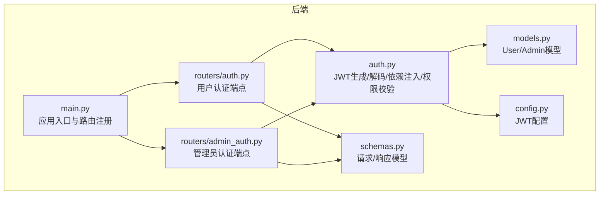
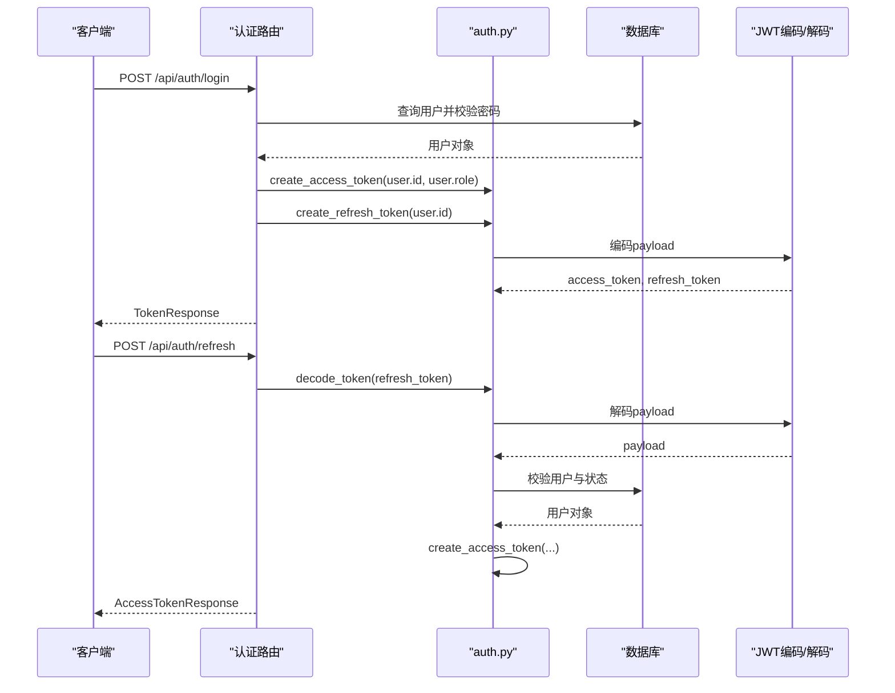
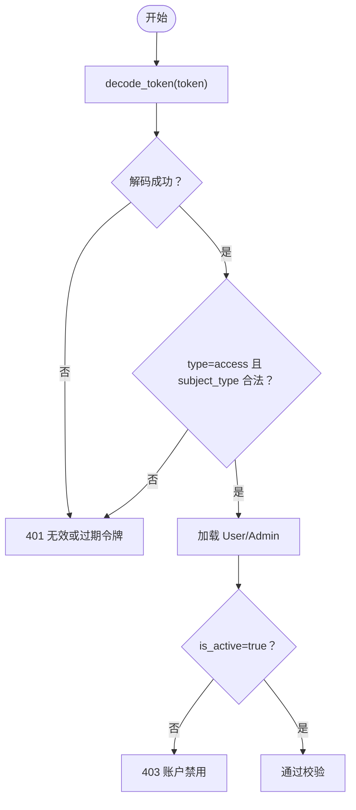
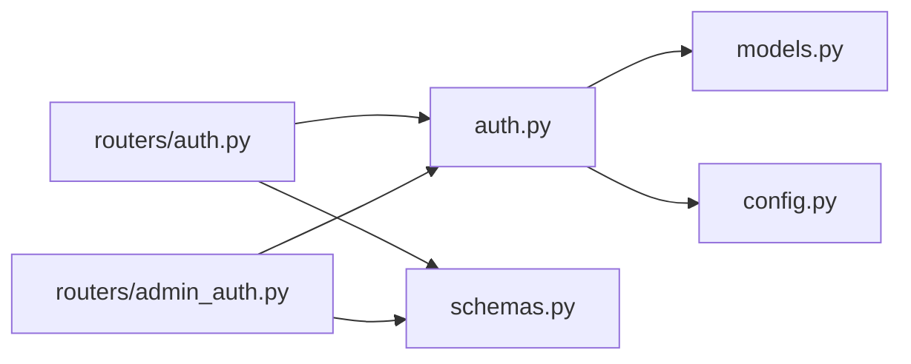

# 认证API

<cite>
**本文档引用的文件**
- [backend/auth.py](file://backend/auth.py)
- [backend/routers/auth.py](file://backend/routers/auth.py)
- [backend/routers/admin_auth.py](file://backend/routers/admin_auth.py)
- [backend/main.py](file://backend/main.py)
- [backend/models.py](file://backend/models.py)
- [backend/config.py](file://backend/config.py)
- [backend/schemas.py](file://backend/schemas.py)
- [backend/admin/src/app/admin/login/page.tsx](file://backend/admin/src/app/admin/login/page.tsx)
- [frontend/src/app/login/page.tsx](file://frontend/src/app/login/page.tsx)
</cite>

## 目录
1. [简介](#简介)
2. [项目结构](#项目结构)
3. [核心组件](#核心组件)
4. [架构总览](#架构总览)
5. [详细组件分析](#详细组件分析)
6. [依赖关系分析](#依赖关系分析)
7. [性能考虑](#性能考虑)
8. [故障排除指南](#故障排除指南)
9. [结论](#结论)
10. [附录](#附录)

## 简介
本文件面向“认证API”的完整技术文档，涵盖用户登录、管理员登录、令牌刷新与权限验证的全部端点与流程。文档详细说明：
- JWT令牌生成与验证机制
- 请求参数、响应格式、状态码与错误处理
- curl示例与前端调用方式
- 不同用户角色的权限差异与访问控制规则

## 项目结构
认证相关的核心文件分布如下：
- 后端认证核心：backend/auth.py（令牌生成/解码、依赖注入、权限校验）
- 用户认证路由：backend/routers/auth.py（注册、登录、刷新、个人信息）
- 管理员认证路由：backend/routers/admin_auth.py（登录、刷新、个人信息）
- 应用入口与路由注册：backend/main.py
- 数据模型：backend/models.py（User/Admin）
- 配置：backend/config.py（JWT密钥、算法、过期时间）
- 数据模型与序列化：backend/schemas.py（请求/响应模型）

图表来源
- [backend/main.py:139-152](file://backend/main.py#L139-L152)
- [backend/routers/auth.py:30-33](file://backend/routers/auth.py#L30-L33)
- [backend/routers/admin_auth.py:29-33](file://backend/routers/admin_auth.py#L29-L33)

章节来源
- [backend/main.py:139-152](file://backend/main.py#L139-L152)
- [backend/routers/auth.py:30-33](file://backend/routers/auth.py#L30-L33)
- [backend/routers/admin_auth.py:29-33](file://backend/routers/admin_auth.py#L29-L33)

## 核心组件
- JWT令牌生成与刷新
  - 用户令牌：access_token（30分钟）、refresh_token（7天）
  - 管理员令牌：access_token（30分钟）、refresh_token（7天），subject_type为admin
- 令牌验证与依赖注入
  - OAuth2PasswordBearer用于提取Authorization头中的Bearer令牌
  - 解码失败或过期返回401；非活跃账户返回403
- 权限校验
  - 用户：get_current_active_user
  - 管理员：get_current_active_admin
  - 通用：get_current_user_or_admin（根据subject_type自动选择User/Admin）
- 数据模型
  - User/Admin均包含is_active字段，用于账户状态校验

章节来源
- [backend/auth.py:30-62](file://backend/auth.py#L30-L62)
- [backend/auth.py:83-113](file://backend/auth.py#L83-L113)
- [backend/auth.py:119-156](file://backend/auth.py#L119-L156)
- [backend/auth.py:162-210](file://backend/auth.py#L162-L210)
- [backend/models.py:10-33](file://backend/models.py#L10-L33)
- [backend/models.py:35-73](file://backend/models.py#L35-L73)

## 架构总览
认证API采用FastAPI + SQLAlchemy + JWT的典型架构：
- 路由层：用户认证与管理员认证分别提供独立端点
- 服务层：auth.py封装JWT生成/解码与依赖注入
- 数据层：models.py定义User/Admin模型，配合数据库查询
- 安全层：OAuth2PasswordBearer + 依赖注入自动完成令牌校验与权限检查

图表来源
- [backend/routers/auth.py:63-99](file://backend/routers/auth.py#L63-L99)
- [backend/routers/auth.py:102-129](file://backend/routers/auth.py#L102-L129)
- [backend/auth.py:30-62](file://backend/auth.py#L30-L62)
- [backend/auth.py:65-74](file://backend/auth.py#L65-L74)

## 详细组件分析

### 用户认证端点
- 注册
  - 方法：POST /api/auth/register
  - 请求体：UserRegister（邮箱、昵称、密码）
  - 响应：UserResponse（用户信息）
  - 状态码：201 Created；409 Conflict（邮箱已存在）
- 登录
  - 方法：POST /api/auth/login
  - 请求体：UserLogin（邮箱、密码）
  - 响应：TokenResponse（access_token、refresh_token、expires_in、user）
  - 状态码：200 OK；401 Unauthorized（凭据错误）；403 Forbidden（账户禁用）
- 刷新令牌
  - 方法：POST /api/auth/refresh
  - 请求体：TokenRefresh（refresh_token）
  - 响应：AccessTokenResponse（access_token、expires_in）
  - 状态码：200 OK；401 Unauthorized（无效令牌类型/用户不存在或禁用）
- 获取当前用户
  - 方法：GET /api/auth/me
  - 依赖：get_current_active_user
  - 响应：UserResponse
  - 状态码：200 OK；401 Unauthorized；403 Forbidden

章节来源
- [backend/routers/auth.py:36-60](file://backend/routers/auth.py#L36-L60)
- [backend/routers/auth.py:63-99](file://backend/routers/auth.py#L63-L99)
- [backend/routers/auth.py:102-129](file://backend/routers/auth.py#L102-L129)
- [backend/routers/auth.py:132-135](file://backend/routers/auth.py#L132-L135)

### 管理员认证端点
- 管理员登录
  - 方法：POST /api/admin/auth/login
  - 请求体：AdminLogin（邮箱、密码）
  - 响应：AdminTokenResponse（access_token、refresh_token、expires_in、admin）
  - 状态码：200 OK；401 Unauthorized（凭据错误）；403 Forbidden（账户禁用）
- 管理员刷新令牌
  - 方法：POST /api/admin/auth/refresh
  - 请求体：TokenRefresh（refresh_token）
  - 响应：AccessTokenResponse（access_token、expires_in）
  - 状态码：200 OK；401 Unauthorized（无效刷新令牌/管理员不存在或禁用）
- 获取当前管理员
  - 方法：GET /api/admin/auth/me
  - 依赖：get_current_active_admin
  - 响应：AdminResponse
  - 状态码：200 OK；401 Unauthorized；403 Forbidden

章节来源
- [backend/routers/admin_auth.py:36-90](file://backend/routers/admin_auth.py#L36-L90)
- [backend/routers/admin_auth.py:93-127](file://backend/routers/admin_auth.py#L93-L127)
- [backend/routers/admin_auth.py:130-135](file://backend/routers/admin_auth.py#L130-L135)

### JWT令牌生成与验证机制
- 令牌生成
  - 用户令牌：payload包含sub（用户ID）、role（用户角色）、subject_type（user）、type（access）、exp（过期时间）
  - 管理员令牌：payload包含sub（管理员ID）、subject_type（admin）、type（access）、exp（过期时间）
  - 刷新令牌：payload包含sub、subject_type、type（refresh）、exp
- 令牌验证
  - 解码失败或过期：抛出401 Unauthorized
  - 访问令牌必须type=access；刷新令牌必须type=refresh且subject_type匹配
  - 用户/管理员必须is_active=true
- 依赖注入
  - OAuth2PasswordBearer绑定到用户登录端点
  - get_current_user/get_current_active_user用于用户端点
  - get_current_admin/get_current_active_admin用于管理员端点
  - get_current_user_or_admin用于通用端点（根据subject_type自动选择User/Admin）

图表来源
- [backend/auth.py:65-74](file://backend/auth.py#L65-L74)
- [backend/auth.py:83-113](file://backend/auth.py#L83-L113)
- [backend/auth.py:119-156](file://backend/auth.py#L119-L156)
- [backend/auth.py:162-210](file://backend/auth.py#L162-L210)

章节来源
- [backend/auth.py:30-62](file://backend/auth.py#L30-L62)
- [backend/auth.py:65-74](file://backend/auth.py#L65-L74)
- [backend/auth.py:83-113](file://backend/auth.py#L83-L113)
- [backend/auth.py:119-156](file://backend/auth.py#L119-L156)
- [backend/auth.py:162-210](file://backend/auth.py#L162-L210)

### 权限检查与访问控制
- 用户端点
  - get_current_active_user：要求用户存在且is_active=true
- 管理员端点
  - get_current_active_admin：要求管理员存在且is_active=true
  - require_admin：用于需要管理员权限的管理端点（如管理员管理、LLM配置等）
- 通用端点
  - get_current_user_or_admin：根据subject_type自动选择User/Admin，允许管理员访问需要用户认证的端点
- 数据行级隔离
  - scoped_query：管理员可查看所有数据，普通用户仅能查看自己的数据（通过user_id过滤）

章节来源
- [backend/auth.py:109-113](file://backend/auth.py#L109-L113)
- [backend/auth.py:147-151](file://backend/auth.py#L147-L151)
- [backend/auth.py:154-156](file://backend/auth.py#L154-L156)
- [backend/auth.py:162-210](file://backend/auth.py#L162-L210)
- [backend/auth.py:221-228](file://backend/auth.py#L221-L228)

### 数据模型与序列化
- User/Admin模型
  - 共同字段：id、email、nickname、password_hash、is_active、last_login_at、last_login_ip、created_at、updated_at
  - User特有：role（已废弃）、credits、subscription_*等
  - Admin特有：permission_level（admin/super_admin）、credits
- Pydantic模型
  - 用户：UserRegister、UserLogin、TokenRefresh、UserResponse、TokenResponse、AccessTokenResponse
  - 管理员：AdminLogin、AdminCreate、AdminUpdate、AdminResponse、AdminTokenResponse

章节来源
- [backend/models.py:10-33](file://backend/models.py#L10-L33)
- [backend/models.py:35-73](file://backend/models.py#L35-L73)
- [backend/schemas.py:13-63](file://backend/schemas.py#L13-L63)
- [backend/schemas.py:68-111](file://backend/schemas.py#L68-L111)

### 前端集成与示例
- 用户登录（前端）
  - 路由：/login
  - 调用：POST /auth/login
  - 成功后：login(access_token, refresh_token, user)
- 管理员登录（前端）
  - 路由：/admin/login
  - 调用：POST /admin/auth/login
  - 成功后：login(access_token, refresh_token, admin)

章节来源
- [frontend/src/app/login/page.tsx:18-29](file://frontend/src/app/login/page.tsx#L18-L29)
- [backend/admin/src/app/admin/login/page.tsx:76-95](file://backend/admin/src/app/admin/login/page.tsx#L76-L95)

### curl示例
- 用户注册
  - curl -X POST http://localhost:8000/api/auth/register -H "Content-Type: application/json" -d '{"email":"user@example.com","nickname":"User","password":"Password123"}'
- 用户登录
  - curl -X POST http://localhost:8000/api/auth/login -H "Content-Type: application/json" -d '{"email":"user@example.com","password":"Password123"}'
- 用户刷新令牌
  - curl -X POST http://localhost:8000/api/auth/refresh -H "Content-Type: application/json" -d '{"refresh_token":"<REFRESH_TOKEN>"}'
- 获取当前用户
  - curl -X GET http://localhost:8000/api/auth/me -H "Authorization: Bearer <ACCESS_TOKEN>"
- 管理员登录
  - curl -X POST http://localhost:8000/api/admin/auth/login -H "Content-Type: application/json" -d '{"email":"admin@example.com","password":"Password123"}'
- 管理员刷新令牌
  - curl -X POST http://localhost:8000/api/admin/auth/refresh -H "Content-Type: application/json" -d '{"refresh_token":"<ADMIN_REFRESH_TOKEN>"}'
- 获取当前管理员
  - curl -X GET http://localhost:8000/api/admin/auth/me -H "Authorization: Bearer <ADMIN_ACCESS_TOKEN>"

## 依赖关系分析
- 路由依赖
  - /api/auth/* 依赖 auth.py 的依赖注入与令牌生成
  - /api/admin/auth/* 依赖 auth.py 的管理员依赖注入与令牌生成
- 配置依赖
  - JWT密钥、算法、过期时间来自config.py
- 数据模型依赖
  - User/Admin模型用于查询与状态校验

图表来源
- [backend/routers/auth.py:8-26](file://backend/routers/auth.py#L8-L26)
- [backend/routers/admin_auth.py:9-24](file://backend/routers/admin_auth.py#L9-L24)
- [backend/auth.py:11-12](file://backend/auth.py#L11-L12)

章节来源
- [backend/routers/auth.py:8-26](file://backend/routers/auth.py#L8-L26)
- [backend/routers/admin_auth.py:9-24](file://backend/routers/admin_auth.py#L9-L24)
- [backend/auth.py:11-12](file://backend/auth.py#L11-L12)

## 性能考虑
- 令牌过期时间
  - ACCESS_TOKEN_EXPIRE_MINUTES=30（建议生产环境根据安全策略调整）
  - REFRESH_TOKEN_EXPIRE_DAYS=7（建议生产环境开启黑名单/撤销机制）
- 密码哈希
  - bcrypt轮数=12，平衡安全性与性能
- 数据库查询
  - 令牌解码后按ID查询用户/管理员，建议在id上建立索引
- 并发与缓存
  - 建议对频繁访问的用户信息进行缓存（Redis）

## 故障排除指南
- 401 无效或过期令牌
  - 检查Authorization头格式是否为Bearer <TOKEN>
  - 检查JWT_SECRET_KEY与JWT_ALGORITHM是否正确
  - 检查令牌是否过期
- 401 无效凭据
  - 用户登录：邮箱或密码错误
  - 管理员登录：邮箱或密码错误
- 403 账户被禁用
  - 用户/管理员is_active=false
- 404 管理员不存在
  - 刷新令牌时管理员ID不存在或被删除
- 409 邮箱已注册
  - 注册时邮箱重复

章节来源
- [backend/auth.py:65-74](file://backend/auth.py#L65-L74)
- [backend/routers/auth.py:72-83](file://backend/routers/auth.py#L72-L83)
- [backend/routers/admin_auth.py:51-71](file://backend/routers/admin_auth.py#L51-L71)
- [backend/routers/auth.py:43-49](file://backend/routers/auth.py#L43-L49)

## 结论
本认证API提供了完整的用户与管理员认证能力，包括注册、登录、刷新与权限校验。JWT令牌生成与验证机制清晰，依赖注入简化了权限控制。通过明确的状态码与错误处理，便于前后端协作与排错。建议在生产环境中强化令牌撤销、速率限制与审计日志，并根据业务需求调整令牌有效期与安全策略。

## 附录
- 配置项
  - JWT_SECRET_KEY：JWT密钥（生产环境必须随机且保密）
  - JWT_ALGORITHM：JWT算法（默认HS256）
  - ACCESS_TOKEN_EXPIRE_MINUTES：访问令牌过期时间（分钟）
  - REFRESH_TOKEN_EXPIRE_DAYS：刷新令牌过期时间（天）
- 前端注意事项
  - 登录成功后需持久化access_token与refresh_token
  - 刷新令牌失败时引导用户重新登录
  - 管理员端与用户端的令牌不可混用

章节来源
- [backend/config.py:26-30](file://backend/config.py#L26-L30)