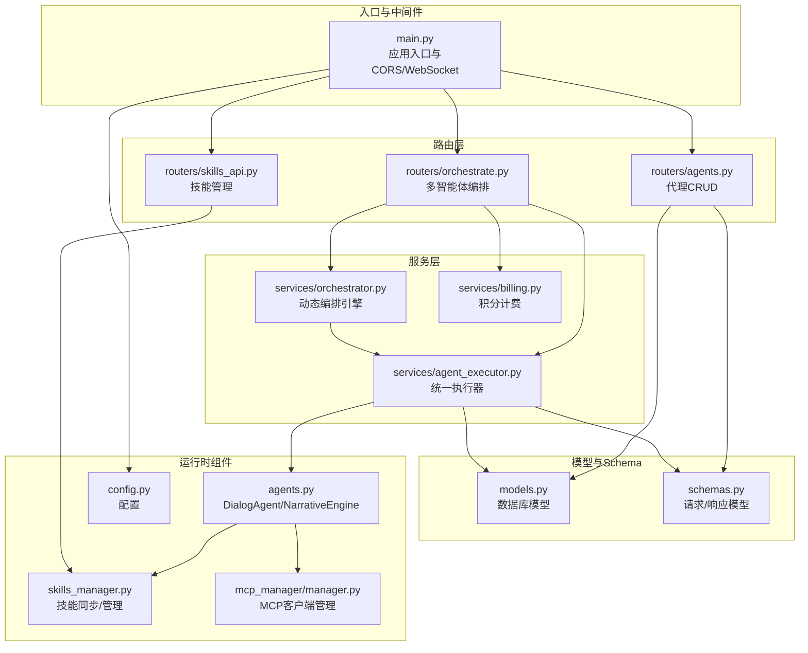
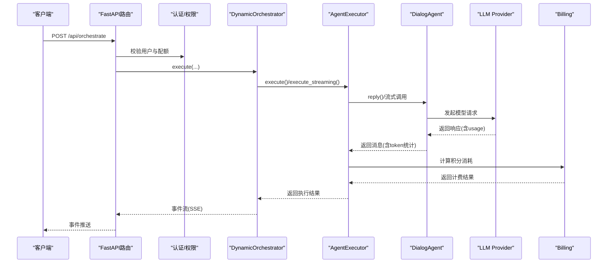
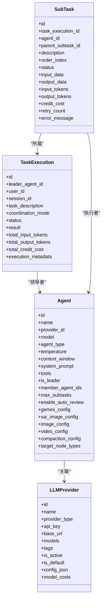

# AI代理接口

<cite>
**本文档引用的文件**
- [main.py](file://backend/main.py)
- [agents.py](file://backend/agents.py)
- [routers/agents.py](file://backend/routers/agents.py)
- [routers/orchestrate.py](file://backend/routers/orchestrate.py)
- [routers/skills_api.py](file://backend/routers/skills_api.py)
- [services/agent_executor.py](file://backend/services/agent_executor.py)
- [services/orchestrator.py](file://backend/services/orchestrator.py)
- [services/billing.py](file://backend/services/billing.py)
- [schemas.py](file://backend/schemas.py)
- [models.py](file://backend/models.py)
- [skills_manager.py](file://backend/skills_manager.py)
- [mcp_manager/manager.py](file://backend/mcp_manager/manager.py)
- [config.py](file://backend/config.py)
</cite>

## 目录
1. [简介](#简介)
2. [项目结构](#项目结构)
3. [核心组件](#核心组件)
4. [架构总览](#架构总览)
5. [详细组件分析](#详细组件分析)
6. [依赖关系分析](#依赖关系分析)
7. [性能考虑](#性能考虑)
8. [故障排查指南](#故障排查指南)
9. [结论](#结论)
10. [附录](#附录)

## 简介
本文件为KunFlix的AI代理系统提供详细的API文档，涵盖代理的创建、配置、启动、停止与删除；代理参数设置、技能绑定、协作配置与状态管理；代理执行历史查询、性能监控与故障诊断接口；以及代理模板、批量部署与动态扩缩容的API说明。同时解释代理间通信协议与数据交换格式，帮助开发者与运维人员高效集成与维护系统。

## 项目结构
后端采用FastAPI框架，路由层负责对外暴露REST接口，服务层封装业务逻辑（编排、计费、执行器等），模型层定义数据库实体，路由器与服务通过SQLAlchemy进行数据持久化。

图表来源
- [main.py:110-175](file://backend/main.py#L110-L175)
- [routers/agents.py:1-151](file://backend/routers/agents.py#L1-L151)
- [routers/orchestrate.py:1-183](file://backend/routers/orchestrate.py#L1-L183)
- [routers/skills_api.py:1-207](file://backend/routers/skills_api.py#L1-L207)
- [services/agent_executor.py:1-287](file://backend/services/agent_executor.py#L1-L287)
- [services/orchestrator.py:1-914](file://backend/services/orchestrator.py#L1-L914)
- [services/billing.py:1-388](file://backend/services/billing.py#L1-L388)
- [models.py:1-503](file://backend/models.py#L1-L503)
- [schemas.py:1-931](file://backend/schemas.py#L1-L931)
- [agents.py:1-388](file://backend/agents.py#L1-L388)
- [skills_manager.py:1-408](file://backend/skills_manager.py#L1-L408)
- [mcp_manager/manager.py:1-139](file://backend/mcp_manager/manager.py#L1-L139)
- [config.py:1-43](file://backend/config.py#L1-L43)

章节来源
- [main.py:110-175](file://backend/main.py#L110-L175)
- [routers/agents.py:1-151](file://backend/routers/agents.py#L1-L151)
- [routers/orchestrate.py:1-183](file://backend/routers/orchestrate.py#L1-L183)
- [routers/skills_api.py:1-207](file://backend/routers/skills_api.py#L1-L207)
- [services/agent_executor.py:1-287](file://backend/services/agent_executor.py#L1-L287)
- [services/orchestrator.py:1-914](file://backend/services/orchestrator.py#L1-L914)
- [services/billing.py:1-388](file://backend/services/billing.py#L1-L388)
- [models.py:1-503](file://backend/models.py#L1-L503)
- [schemas.py:1-931](file://backend/schemas.py#L1-L931)
- [agents.py:1-388](file://backend/agents.py#L1-L388)
- [skills_manager.py:1-408](file://backend/skills_manager.py#L1-L408)
- [mcp_manager/manager.py:1-139](file://backend/mcp_manager/manager.py#L1-L139)
- [config.py:1-43](file://backend/config.py#L1-L43)

## 核心组件
- 代理执行器（AgentExecutor）：封装统一的对话代理调用，支持非流式与流式两种执行方式，自动缓存模型与代理实例，提取token用量并计算积分消耗。
- 动态编排引擎（DynamicOrchestrator）：基于领导者代理的任务分析与子任务分解，支持依赖图调度、并行/串行执行、实时事件流（SSE）、可选的领导者复核。
- 技能管理（SkillService）：提供技能的创建、启用/禁用、同步与文件读取能力，支持内置与定制化技能目录。
- 计费模块（Billing）：基于维度映射表的积分计算与原子扣费/退款，支持文本、图像、搜索、视频等多种计费维度。
- MCP客户端管理：支持HTTP与STDIO传输的MCP客户端生命周期管理，热替换与最小阻塞。
- 代理模型与Schema：定义代理、聊天会话、任务执行、子任务、提示词模板等数据结构与校验规则。

章节来源
- [services/agent_executor.py:63-287](file://backend/services/agent_executor.py#L63-L287)
- [services/orchestrator.py:418-914](file://backend/services/orchestrator.py#L418-L914)
- [services/billing.py:12-388](file://backend/services/billing.py#L12-L388)
- [skills_manager.py:263-408](file://backend/skills_manager.py#L263-L408)
- [mcp_manager/manager.py:28-139](file://backend/mcp_manager/manager.py#L28-L139)
- [schemas.py:237-485](file://backend/schemas.py#L237-L485)
- [models.py:210-350](file://backend/models.py#L210-L350)

## 架构总览
系统通过FastAPI路由接收请求，经由认证与权限校验后，调用服务层完成业务处理。编排引擎负责任务分析与子任务调度，执行器负责具体代理调用与计费，计费模块确保消费的原子性与一致性。MCP与技能系统作为扩展能力接入代理。

图表来源
- [routers/orchestrate.py:26-70](file://backend/routers/orchestrate.py#L26-L70)
- [services/orchestrator.py:437-534](file://backend/services/orchestrator.py#L437-L534)
- [services/agent_executor.py:74-208](file://backend/services/agent_executor.py#L74-L208)
- [services/billing.py:310-350](file://backend/services/billing.py#L310-L350)

## 详细组件分析

### 代理管理API
- 创建代理
  - 方法与路径：POST /api/agents
  - 请求体：AgentCreate（包含名称、描述、提供商ID、模型、代理类型、温度、上下文窗口、系统提示、工具列表、思考模式、定价参数、领导者配置、Gemini/xAI/统一图像配置、视频配置、上下文压缩配置、目标节点类型等）
  - 响应：AgentResponse
  - 校验：名称唯一；提供商存在；模型在提供商可用模型列表内
- 查询代理列表
  - 方法与路径：GET /api/agents
  - 查询参数：skip、limit、search
  - 响应：列表[AgentResponse]
- 获取单个代理
  - 方法与路径：GET /api/agents/{agent_id}
  - 响应：AgentResponse
- 更新代理
  - 方法与路径：PUT /api/agents/{agent_id}
  - 请求体：AgentUpdate
  - 校验：名称唯一；提供商存在；模型在提供商可用模型列表内
- 删除代理
  - 方法与路径：DELETE /api/agents/{agent_id}
  - 响应：成功消息

章节来源
- [routers/agents.py:16-151](file://backend/routers/agents.py#L16-L151)
- [schemas.py:237-357](file://backend/schemas.py#L237-L357)
- [models.py:210-273](file://backend/models.py#L210-L273)

### 代理参数设置
- 基础参数：名称、描述、提供商ID、模型、代理类型（text/image/multimodal/video）、温度、上下文窗口
- 系统提示与工具：system_prompt、tools（技能名称列表）
- 思考模式：thinking_mode（影响Gemini思考等级）
- 定价参数：input_credit_per_1m、output_credit_per_1m、image_output_credit_per_1m、search_credit_per_query、视频相关计费字段
- 领导者配置：is_leader、coordination_modes、member_agent_ids、max_subtasks、enable_auto_review
- 多媒体配置：gemini_config、xai_image_config、image_config（统一图像配置）、video_config
- 上下文压缩：compaction_config
- 目标节点类型：target_node_types（script/character/storyboard/video）

章节来源
- [schemas.py:237-278](file://backend/schemas.py#L237-L278)
- [models.py:224-269](file://backend/models.py#L224-L269)

### 技能绑定与管理
- 技能目录结构：builtin_skills、customized_skills、active_skills
- 同步策略：内置技能优先，定制化覆盖；支持强制同步与差异检测
- 管理接口：
  - 列表：GET /api/admin/skills
  - 获取详情：GET /api/admin/skills/{skill_name}
  - 创建：POST /api/admin/skills（可自动启用）
  - 更新：PUT /api/admin/skills/{skill_name}
  - 删除：DELETE /api/admin/skills/{skill_name}（禁止删除内置技能）
  - 切换：POST /api/admin/skills/{skill_name}/toggle

章节来源
- [skills_manager.py:180-257](file://backend/skills_manager.py#L180-L257)
- [routers/skills_api.py:123-207](file://backend/routers/skills_api.py#L123-L207)

### 协作配置与状态管理
- 领导者代理：is_leader=true，配置成员代理集合、最大子任务数、自动复核开关
- 协作模式：coordination_modes（pipeline/plan/discussion）
- 任务状态：TaskExecution.status（pending/running/completed/failed）
- 子任务：SubTask记录每个子任务的描述、顺序、状态、token用量、错误信息

章节来源
- [schemas.py:432-485](file://backend/schemas.py#L432-L485)
- [models.py:303-350](file://backend/models.py#L303-L350)

### 代理执行历史查询
- 查询单次执行：GET /api/orchestrate/{task_execution_id}
- 列表查询：GET /api/orchestrate?status=&skip=&limit=
- 取消执行：DELETE /api/orchestrate/{task_execution_id}

章节来源
- [routers/orchestrate.py:73-183](file://backend/routers/orchestrate.py#L73-L183)
- [schemas.py:467-485](file://backend/schemas.py#L467-L485)
- [models.py:303-350](file://backend/models.py#L303-L350)

### 性能监控与故障诊断
- SSE事件流：任务执行过程中的事件（task_start、task_analyzed、subtask_*、task_result、task_completed、error等）
- 实时进度：text事件（分块文本）、subtask_chunk事件（子任务分块）
- 计费统计：total_input_tokens、total_output_tokens、total_credit_cost、context_usage
- 错误处理：task_failed事件、内部异常捕获与错误事件

章节来源
- [services/orchestrator.py:448-534](file://backend/services/orchestrator.py#L448-L534)
- [routers/orchestrate.py:26-70](file://backend/routers/orchestrate.py#L26-L70)

### 代理模板、批量部署与动态扩缩容
- 代理模板：通过提示词模板（PromptTemplate）与AIGenerate接口实现模板化生成，支持变量schema与默认代理绑定
- 批量部署：通过技能管理与代理配置的组合，批量启用/禁用技能，统一配置代理参数
- 动态扩缩容：编排引擎支持并行执行与依赖图调度，可根据任务复杂度动态调整子任务并行度

章节来源
- [schemas.py:566-635](file://backend/schemas.py#L566-L635)
- [routers/skills_api.py:123-207](file://backend/routers/skills_api.py#L123-L207)
- [services/orchestrator.py:231-366](file://backend/services/orchestrator.py#L231-L366)

### 代理间通信协议与数据交换格式
- 通信协议：HTTP REST + Server-Sent Events（SSE）用于实时事件流
- 数据交换格式：JSON
  - 请求体：Pydantic模型（AgentCreate/AgentUpdate/OrchestrationRequest等）
  - 响应体：Pydantic模型（AgentResponse/TaskExecutionResponse/SubTaskResponse等）
  - 事件格式：OrchestrationEvent.to_sse()，包含event与data字段

章节来源
- [schemas.py:237-485](file://backend/schemas.py#L237-L485)
- [services/orchestrator.py:49-58](file://backend/services/orchestrator.py#L49-L58)

## 依赖关系分析

图表来源
- [models.py:210-350](file://backend/models.py#L210-L350)

章节来源
- [models.py:210-350](file://backend/models.py#L210-L350)

## 性能考虑
- 缓存策略：AgentExecutor对模型与代理实例进行缓存，减少重复初始化开销
- 并行执行：统一策略在同层无依赖子任务上并行执行，提升吞吐
- 流式输出：子任务流式执行，实时返回chunk，降低首字节延迟
- 计费原子性：扣费与退款使用UPDATE ... WHERE保证并发安全，避免竞态

章节来源
- [services/agent_executor.py:69-73](file://backend/services/agent_executor.py#L69-L73)
- [services/orchestrator.py:306-366](file://backend/services/orchestrator.py#L306-L366)
- [services/billing.py:178-308](file://backend/services/billing.py#L178-L308)

## 故障排查指南
- 代理创建失败
  - 检查提供商是否存在且模型在可用列表内
  - 确认代理名称唯一
- 代理更新失败
  - 更新提供商或模型时需满足可用性校验
- 编排执行失败
  - 查看task_failed事件与错误信息
  - 检查子任务状态与错误消息
- 积分不足
  - 使用check_balance_sufficient检查余额与冻结状态
  - 扣费失败抛出InsufficientCreditsError或BalanceFrozenError
- MCP客户端异常
  - 检查transport配置与连接超时
  - 使用replace_client进行热替换

章节来源
- [routers/agents.py:16-64](file://backend/routers/agents.py#L16-L64)
- [services/orchestrator.py:521-534](file://backend/services/orchestrator.py#L521-L534)
- [services/billing.py:37-43](file://backend/services/billing.py#L37-L43)
- [mcp_manager/manager.py:57-92](file://backend/mcp_manager/manager.py#L57-L92)

## 结论
本API文档系统性地梳理了KunFlix AI代理系统的接口与架构，覆盖代理全生命周期管理、协作编排、计费与监控、技能与MCP扩展机制。通过SSE事件流与多维计费模型，系统实现了高并发、可观测与可扩展的多智能体协作平台。

## 附录
- 应用入口与中间件：CORS、WebSocket、数据库迁移与媒体目录初始化
- 配置项：数据库URL、Redis、JWT密钥、默认模型、迁移开关

章节来源
- [main.py:49-175](file://backend/main.py#L49-L175)
- [config.py:7-43](file://backend/config.py#L7-L43)