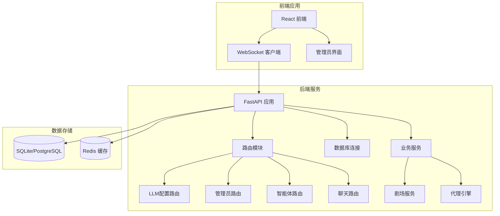
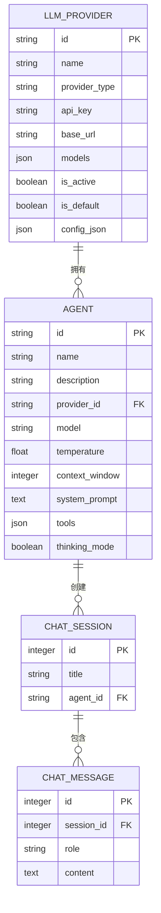
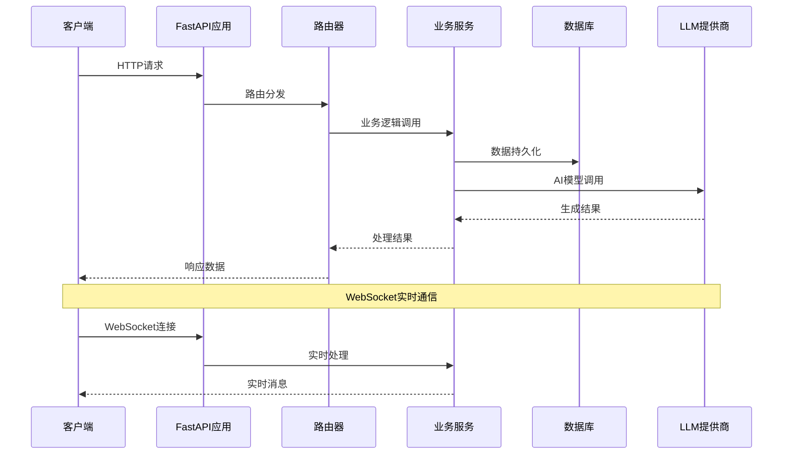
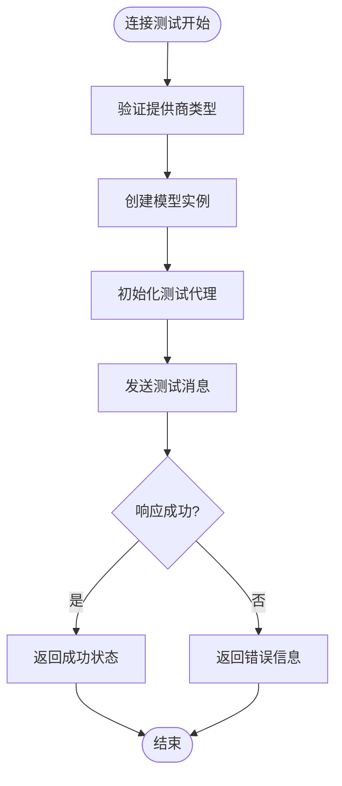
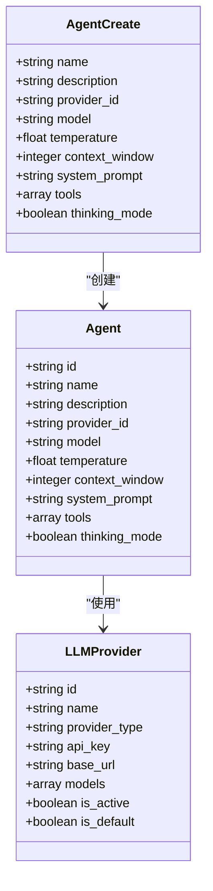
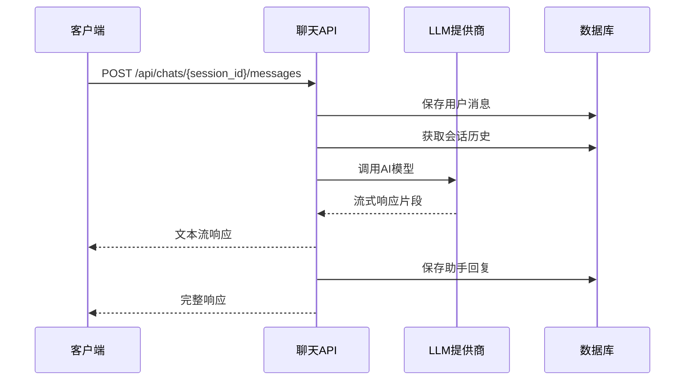
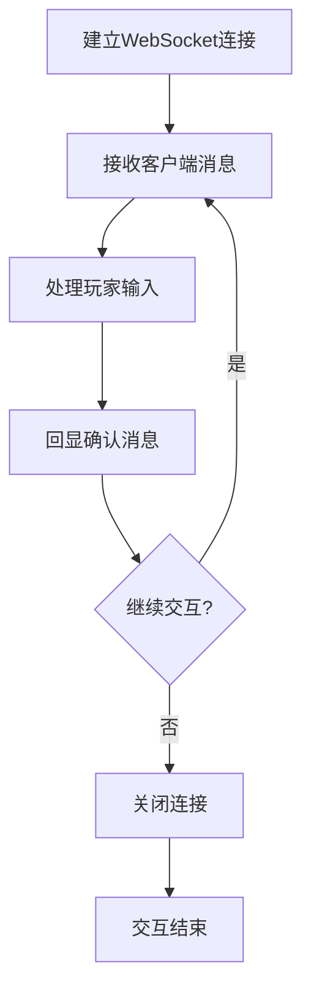
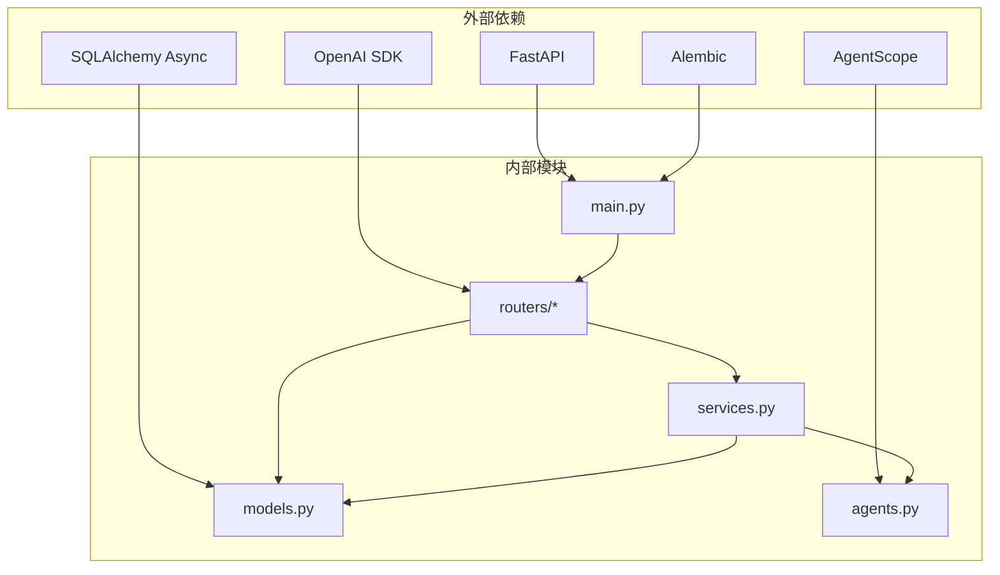
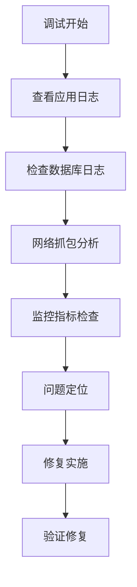

# API接口文档

<cite>
**本文档引用的文件**
- [backend/main.py](file://backend/main.py)
- [backend/routers/llm_config.py](file://backend/routers/llm_config.py)
- [backend/routers/admin.py](file://backend/routers/admin.py)
- [backend/routers/agents.py](file://backend/routers/agents.py)
- [backend/routers/chats.py](file://backend/routers/chats.py)
- [backend/schemas.py](file://backend/schemas.py)
- [backend/models.py](file://backend/models.py)
- [backend/services.py](file://backend/services.py)
- [backend/agents.py](file://backend/agents.py)
- [backend/database.py](file://backend/database.py)
- [backend/config.py](file://backend/config.py)
- [frontend/src/hooks/useSocket.ts](file://frontend/src/hooks/useSocket.ts)
</cite>

## 目录
1. [简介](#简介)
2. [项目结构](#项目结构)
3. [核心组件](#核心组件)
4. [架构概览](#架构概览)
5. [详细组件分析](#详细组件分析)
6. [依赖关系分析](#依赖关系分析)
7. [性能考虑](#性能考虑)
8. [故障排除指南](#故障排除指南)
9. [结论](#结论)
10. [附录](#附录)

## 简介

Infinite Narrative Theater 是一个基于FastAPI构建的叙事剧场平台，提供LLM配置管理、智能体管理和聊天交互功能。该系统支持多种AI模型提供商，包括OpenAI、Azure、DashScope等，并通过WebSocket实现实时交互。

## 项目结构

**图表来源**
- [backend/main.py](file://backend/main.py#L83-L97)
- [backend/routers/llm_config.py](file://backend/routers/llm_config.py#L14-L18)
- [backend/routers/admin.py](file://backend/routers/admin.py#L10-L14)

**章节来源**
- [backend/main.py](file://backend/main.py#L1-L173)
- [backend/config.py](file://backend/config.py#L1-L34)

## 核心组件

### API路由器架构

系统采用模块化路由设计，每个功能域都有独立的路由器：

- **LLM配置路由器**: `/api/admin/llm-providers` - 管理AI模型提供商
- **管理员路由器**: `/api/admin` - 系统管理功能
- **智能体路由器**: `/api/agents` - 智能体生命周期管理
- **聊天路由器**: `/api/chats` - 实时聊天会话管理

### 数据模型关系

**图表来源**
- [backend/models.py](file://backend/models.py#L58-L122)

**章节来源**
- [backend/models.py](file://backend/models.py#L1-L122)
- [backend/schemas.py](file://backend/schemas.py#L1-L102)

## 架构概览

**图表来源**
- [backend/main.py](file://backend/main.py#L157-L169)
- [backend/routers/chats.py](file://backend/routers/chats.py#L72-L258)

## 详细组件分析

### LLM配置API

#### 测试连接接口
- **HTTP方法**: POST
- **URL模式**: `/api/admin/llm-providers/test-connection`
- **请求体**: TestConnectionRequest
- **响应**: JSON对象包含连接状态和测试响应
- **认证**: 无（用于测试目的）

**图表来源**
- [backend/routers/llm_config.py](file://backend/routers/llm_config.py#L20-L111)

#### 提供商管理接口

| 接口 | 方法 | URL | 功能描述 |
|------|------|-----|----------|
| 创建提供商 | POST | `/api/admin/llm-providers/` | 创建新的AI模型提供商 |
| 获取提供商列表 | GET | `/api/admin/llm-providers/` | 分页获取提供商列表 |
| 获取单个提供商 | GET | `/api/admin/llm-providers/{provider_id}` | 获取指定提供商详情 |
| 更新提供商 | PUT | `/api/admin/llm-providers/{provider_id}` | 更新提供商配置 |
| 删除提供商 | DELETE | `/api/admin/llm-providers/{provider_id}` | 删除提供商 |

**章节来源**
- [backend/routers/llm_config.py](file://backend/routers/llm_config.py#L112-L203)
- [backend/schemas.py](file://backend/schemas.py#L4-L42)

### 管理员API

#### 统计信息接口
- **HTTP方法**: GET
- **URL模式**: `/api/admin/stats`
- **响应**: 包含玩家数量、故事数量、资源数量、提供商数量的JSON对象

#### 玩家管理接口

| 接口 | 方法 | URL | 功能描述 |
|------|------|-----|----------|
| 获取玩家列表 | GET | `/api/admin/players` | 分页获取玩家列表 |
| 删除玩家 | DELETE | `/api/admin/players/{player_id}` | 删除指定玩家及其关联数据 |

#### 故事管理接口

| 接口 | 方法 | URL | 功能描述 |
|------|------|-----|----------|
| 获取故事列表 | GET | `/api/admin/stories` | 分页获取故事列表 |
| 获取故事详情 | GET | `/api/admin/stories/{story_id}` | 获取指定故事详情 |

**章节来源**
- [backend/routers/admin.py](file://backend/routers/admin.py#L16-L112)

### 智能体API

#### 智能体生命周期管理

| 接口 | 方法 | URL | 功能描述 |
|------|------|-----|----------|
| 创建智能体 | POST | `/api/agents/` | 创建新智能体 |
| 获取智能体列表 | GET | `/api/agents/` | 分页获取智能体列表 |
| 获取智能体详情 | GET | `/api/agents/{agent_id}` | 获取指定智能体详情 |
| 更新智能体 | PUT | `/api/agents/{agent_id}` | 更新智能体配置 |
| 删除智能体 | DELETE | `/api/agents/{agent_id}` | 删除智能体 |

**图表来源**
- [backend/models.py](file://backend/models.py#L100-L122)
- [backend/schemas.py](file://backend/schemas.py#L43-L74)

**章节来源**
- [backend/routers/agents.py](file://backend/routers/agents.py#L15-L141)
- [backend/schemas.py](file://backend/schemas.py#L43-L74)

### 聊天API

#### 会话管理接口

| 接口 | 方法 | URL | 功能描述 |
|------|------|-----|----------|
| 创建会话 | POST | `/api/chats/` | 创建新的聊天会话 |
| 获取会话列表 | GET | `/api/chats/` | 分页获取会话列表 |
| 获取会话详情 | GET | `/api/chats/{session_id}` | 获取指定会话详情 |
| 获取会话消息 | GET | `/api/chats/{session_id}/messages` | 获取会话历史消息 |
| 发送消息 | POST | `/api/chats/{session_id}/messages` | 发送用户消息（流式响应） |
| 删除会话 | DELETE | `/api/chats/{session_id}` | 删除会话及其消息 |

#### 流式响应机制

**图表来源**
- [backend/routers/chats.py](file://backend/routers/chats.py#L72-L258)

**章节来源**
- [backend/routers/chats.py](file://backend/routers/chats.py#L22-L275)
- [backend/schemas.py](file://backend/schemas.py#L75-L102)

### WebSocket API

#### 连接处理

- **URL模式**: `/ws/{player_id}`
- **协议**: WebSocket
- **认证**: 无（可扩展添加JWT令牌）
- **消息格式**: 文本消息

#### 实时交互模式

**图表来源**
- [backend/main.py](file://backend/main.py#L157-L169)

**章节来源**
- [backend/main.py](file://backend/main.py#L157-L169)
- [frontend/src/hooks/useSocket.ts](file://frontend/src/hooks/useSocket.ts#L1-L43)

## 依赖关系分析

**图表来源**
- [backend/main.py](file://backend/main.py#L30-L42)
- [backend/routers/llm_config.py](file://backend/routers/llm_config.py#L9-L12)

**章节来源**
- [backend/database.py](file://backend/database.py#L1-L31)
- [backend/agents.py](file://backend/agents.py#L1-L10)

## 性能考虑

### 数据库优化

- **连接池配置**: 使用异步连接池，支持最大20个溢出连接
- **预连接检查**: 启用pool_pre_ping自动重连机制
- **索引优化**: 关键字段如username、player_id、session_id建立索引

### API性能特性

- **异步处理**: 所有数据库操作使用async/await
- **流式响应**: 聊天API支持流式文本响应
- **缓存策略**: Redis作为可选缓存层

### WebSocket优化

- **消息队列**: 支持多客户端并发连接
- **心跳机制**: 可扩展的心跳检测
- **消息压缩**: 支持消息压缩传输

## 故障排除指南

### 常见错误处理

| 错误类型 | HTTP状态码 | 描述 | 解决方案 |
|----------|------------|------|----------|
| 数据库连接失败 | 500 | 数据库无法连接 | 检查DATABASE_URL配置 |
| 提供商不存在 | 404 | LLM提供商未找到 | 验证提供商ID |
| 模型不可用 | 400 | 模型不在提供商列表中 | 检查提供商模型配置 |
| 会话不存在 | 404 | 聊天会话未找到 | 验证会话ID |

### 调试工具

**章节来源**
- [backend/main.py](file://backend/main.py#L14-L28)
- [backend/routers/chats.py](file://backend/routers/chats.py#L211-L215)

## 结论

Infinite Narrative Theater提供了一个完整的AI叙事剧场API生态系统，支持多种AI提供商、智能体管理和实时聊天功能。系统采用模块化设计，具有良好的扩展性和维护性。通过WebSocket实现实时交互，通过流式响应提升用户体验。

## 附录

### 版本信息

- **项目名称**: Infinite Narrative Theater
- **当前版本**: 1.0.0
- **数据库版本**: 1.0.0

### 安全考虑

- **CORS配置**: 仅允许本地开发域名访问
- **API密钥管理**: 建议使用环境变量存储敏感信息
- **输入验证**: 所有API端点都包含输入验证和错误处理

### 客户端实现建议

1. **基础设置**: 设置正确的API基础URL和超时参数
2. **错误处理**: 实现统一的错误处理和重试机制
3. **状态管理**: 使用状态管理模式管理聊天会话状态
4. **离线支持**: 实现消息队列和离线消息同步

### 性能优化技巧

1. **连接池优化**: 根据负载调整连接池大小
2. **缓存策略**: 对频繁查询结果使用Redis缓存
3. **批量操作**: 支持批量API调用减少网络开销
4. **资源清理**: 及时清理不再使用的会话和资源