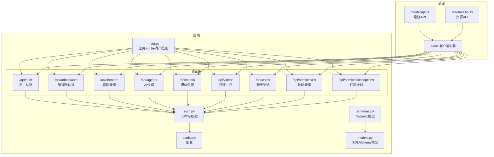
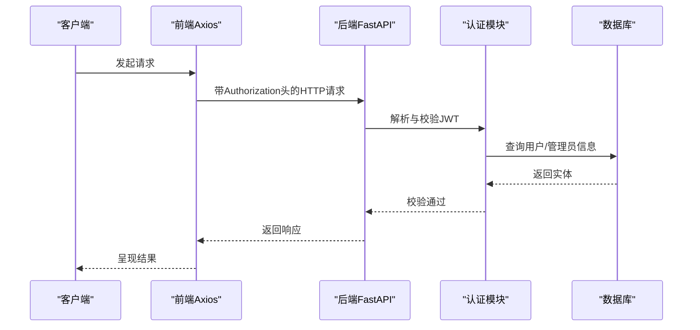
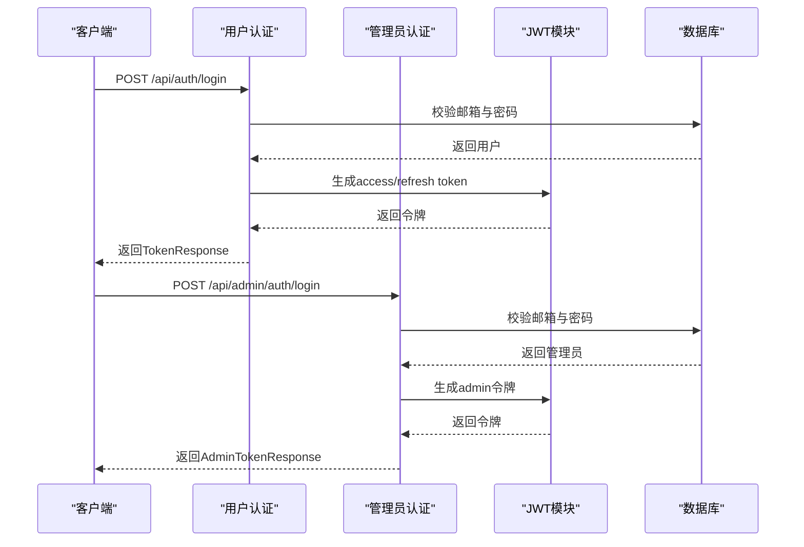
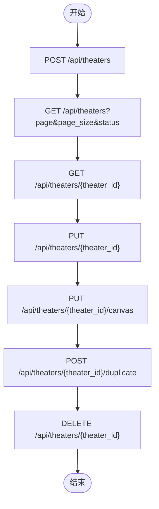
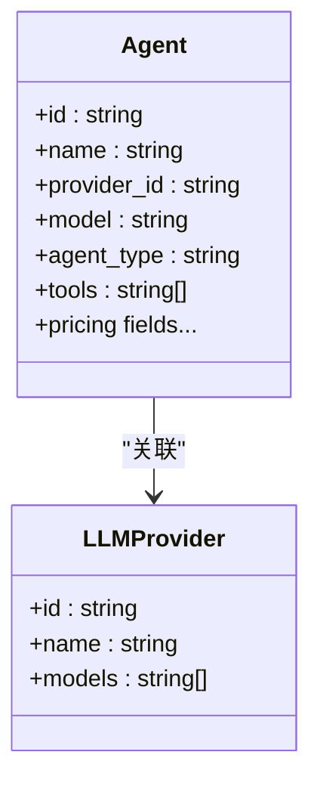
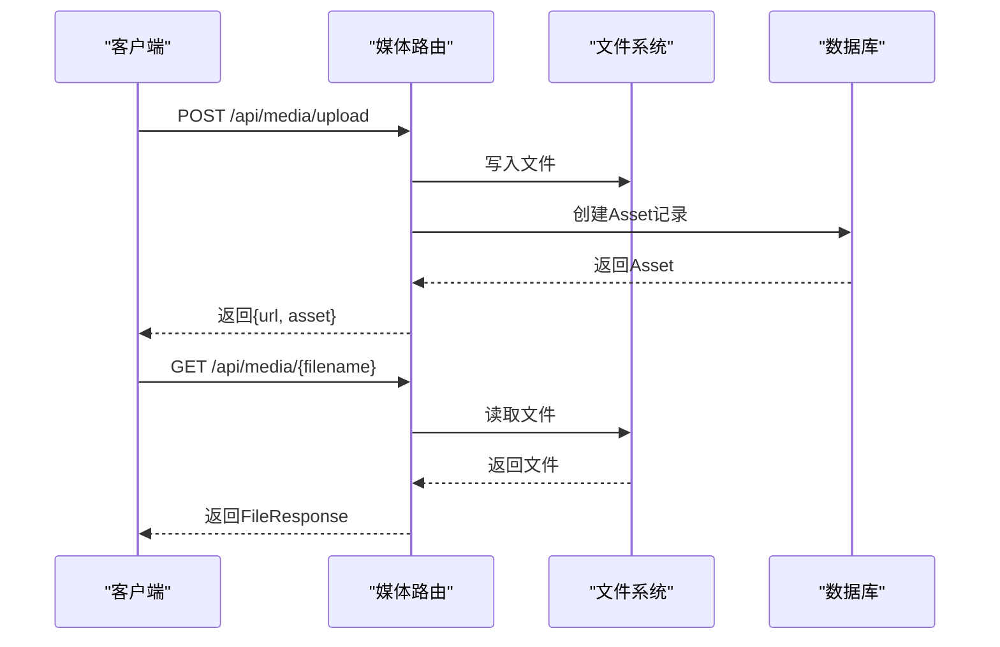
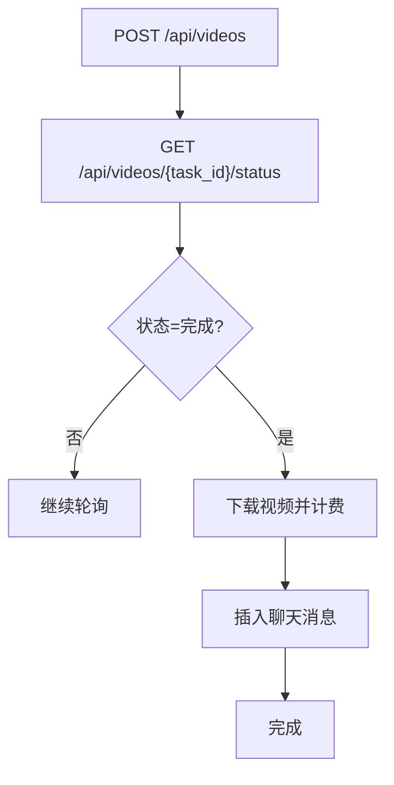
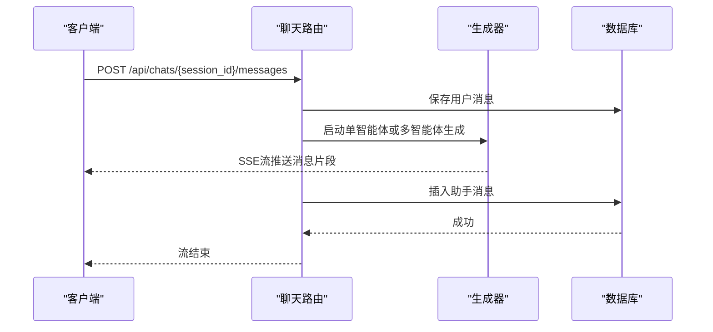
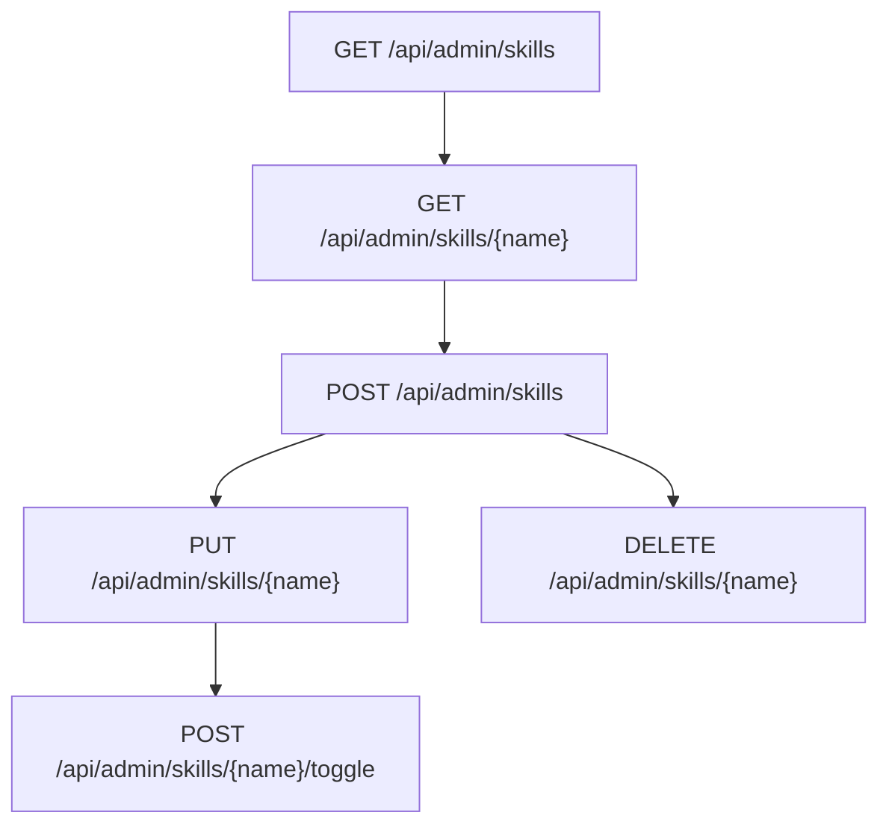
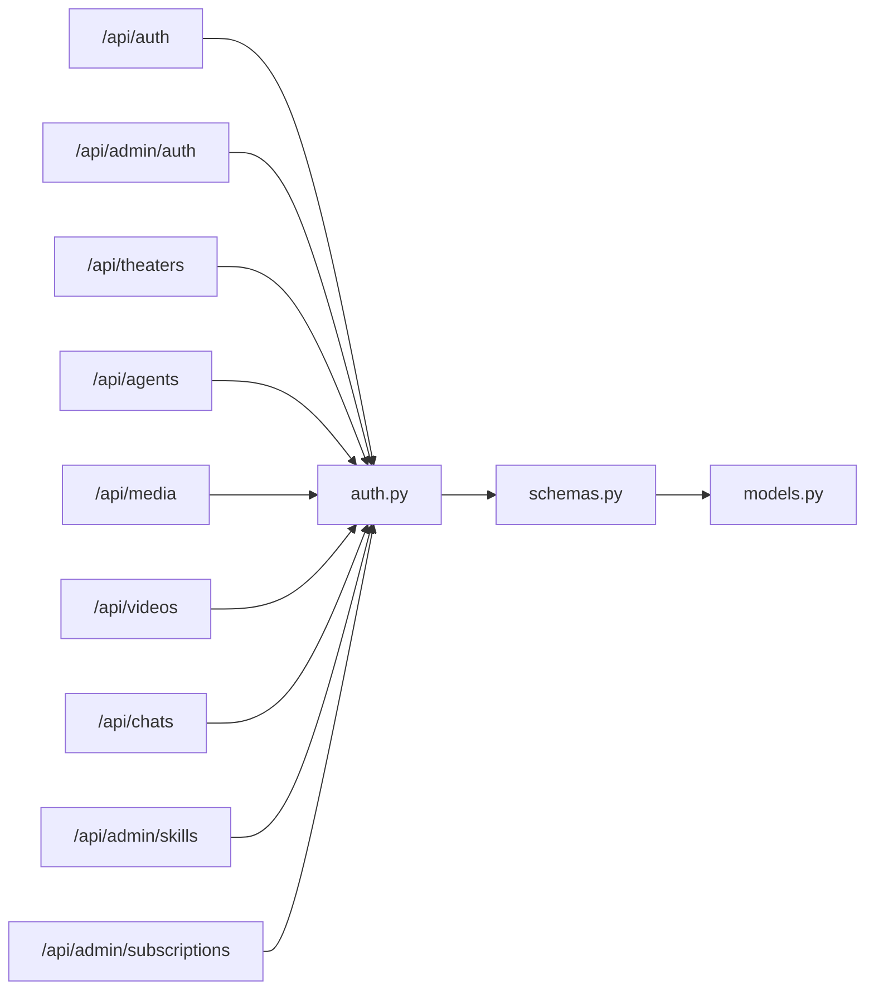

# API接口文档

<cite>
**本文档引用的文件**
- [backend/main.py](file://backend/main.py)
- [backend/routers/admin_auth.py](file://backend/routers/admin_auth.py)
- [backend/routers/auth.py](file://backend/routers/auth.py)
- [backend/routers/theaters.py](file://backend/routers/theaters.py)
- [backend/routers/agents.py](file://backend/routers/agents.py)
- [backend/routers/media.py](file://backend/routers/media.py)
- [backend/routers/videos.py](file://backend/routers/videos.py)
- [backend/routers/subscriptions.py](file://backend/routers/subscriptions.py)
- [backend/routers/chats.py](file://backend/routers/chats.py)
- [backend/routers/skills_api.py](file://backend/routers/skills_api.py)
- [backend/auth.py](file://backend/auth.py)
- [backend/config.py](file://backend/config.py)
- [backend/schemas.py](file://backend/schemas.py)
- [backend/models.py](file://backend/models.py)
- [frontend/src/lib/api.ts](file://frontend/src/lib/api.ts)
- [frontend/src/lib/theaterApi.ts](file://frontend/src/lib/theaterApi.ts)
- [frontend/src/lib/resourceApi.ts](file://frontend/src/lib/resourceApi.ts)
</cite>

## 目录
1. [简介](#简介)
2. [项目结构](#项目结构)
3. [核心组件](#核心组件)
4. [架构总览](#架构总览)
5. [详细组件分析](#详细组件分析)
6. [依赖分析](#依赖分析)
7. [性能考虑](#性能考虑)
8. [故障排除指南](#故障排除指南)
9. [结论](#结论)
10. [附录](#附录)

## 简介
本文件为 KunFlix 的完整 RESTful API 文档，涵盖认证授权、剧院管理、AI 代理、媒体管理、视频生成、聊天对话、技能管理与计费订阅等模块。文档详细说明了各端点的 HTTP 方法、URL 模式、请求/响应结构、认证方式、错误码与使用示例，并解释版本控制、速率限制与安全注意事项。同时提供常见使用场景、客户端实现指南与性能优化建议，以及 API 测试工具与调试技巧。

## 项目结构
后端采用 FastAPI 构建，通过路由器模块化组织各功能域；前端使用 Axios 封装统一的 API 客户端，自动注入认证头与刷新令牌流程。数据库模型与 Pydantic 模型共同定义数据结构与约束。

**图表来源**
- [backend/main.py:138-153](file://backend/main.py#L138-L153)
- [backend/routers/auth.py:30-33](file://backend/routers/auth.py#L30-L33)
- [backend/routers/admin_auth.py:29-33](file://backend/routers/admin_auth.py#L29-L33)
- [backend/routers/theaters.py:14-17](file://backend/routers/theaters.py#L14-L17)
- [backend/routers/agents.py:10-14](file://backend/routers/agents.py#L10-L14)
- [backend/routers/media.py:30](file://backend/routers/media.py#L30)
- [backend/routers/videos.py:24](file://backend/routers/videos.py#L24)
- [backend/routers/chats.py:18-22](file://backend/routers/chats.py#L18-L22)
- [backend/routers/skills_api.py:13-17](file://backend/routers/skills_api.py#L13-L17)
- [backend/routers/subscriptions.py:14-18](file://backend/routers/subscriptions.py#L14-L18)
- [frontend/src/lib/api.ts:3-17](file://frontend/src/lib/api.ts#L3-L17)

**章节来源**
- [backend/main.py:138-153](file://backend/main.py#L138-L153)
- [backend/routers/auth.py:30-33](file://backend/routers/auth.py#L30-L33)
- [backend/routers/admin_auth.py:29-33](file://backend/routers/admin_auth.py#L29-L33)
- [backend/routers/theaters.py:14-17](file://backend/routers/theaters.py#L14-L17)
- [backend/routers/agents.py:10-14](file://backend/routers/agents.py#L10-L14)
- [backend/routers/media.py:30](file://backend/routers/media.py#L30)
- [backend/routers/videos.py:24](file://backend/routers/videos.py#L24)
- [backend/routers/chats.py:18-22](file://backend/routers/chats.py#L18-L22)
- [backend/routers/skills_api.py:13-17](file://backend/routers/skills_api.py#L13-L17)
- [backend/routers/subscriptions.py:14-18](file://backend/routers/subscriptions.py#L14-L18)
- [frontend/src/lib/api.ts:3-17](file://frontend/src/lib/api.ts#L3-L17)

## 核心组件
- 应用入口与路由注册：集中注册所有业务路由，配置 CORS 与中间件。
- 认证与权限：支持用户与管理员双通道，JWT 令牌签发与校验，行级隔离。
- 数据模型与验证：Pydantic 模型定义请求/响应结构，SQLAlchemy 模型映射数据库表。
- 前端客户端：Axios 封装，自动注入 Authorization 头与刷新令牌流程。

**章节来源**
- [backend/main.py:110-128](file://backend/main.py#L110-L128)
- [backend/auth.py:30-75](file://backend/auth.py#L30-L75)
- [backend/schemas.py:13-57](file://backend/schemas.py#L13-L57)
- [backend/models.py:10-73](file://backend/models.py#L10-L73)
- [frontend/src/lib/api.ts:3-17](file://frontend/src/lib/api.ts#L3-L17)

## 架构总览
系统采用前后端分离架构，后端以 FastAPI 提供 RESTful API，前端通过 Axios 统一访问。认证采用 Bearer Token（JWT），管理员与用户分别使用独立的认证流与权限模型。

**图表来源**
- [backend/auth.py:83-113](file://backend/auth.py#L83-L113)
- [backend/routers/auth.py:63-99](file://backend/routers/auth.py#L63-L99)
- [frontend/src/lib/api.ts:9-17](file://frontend/src/lib/api.ts#L9-L17)

## 详细组件分析

### 认证授权接口
- 用户认证
  - 登录：POST /api/auth/login，请求体包含邮箱与密码，成功返回 access_token、refresh_token 与用户信息。
  - 注册：POST /api/auth/register，请求体包含邮箱、昵称与密码，返回新建用户信息。
  - 刷新：POST /api/auth/refresh，使用 refresh_token 获取新的 access_token。
  - 当前用户：GET /api/auth/me，返回当前用户资料。
- 管理员认证
  - 登录：POST /api/admin/auth/login，请求体包含邮箱与密码，返回管理员令牌与信息。
  - 刷新：POST /api/admin/auth/refresh，使用管理员 refresh_token 获取新的 access_token。
  - 当前管理员：GET /api/admin/auth/me，返回管理员资料。
- 权限与行级隔离
  - 通过依赖注入获取当前用户或管理员，非管理员仅能访问自身数据。
  - 管理员可绕过行级隔离，访问全量数据。

**图表来源**
- [backend/routers/auth.py:63-99](file://backend/routers/auth.py#L63-L99)
- [backend/routers/admin_auth.py:36-90](file://backend/routers/admin_auth.py#L36-L90)
- [backend/auth.py:30-75](file://backend/auth.py#L30-L75)

**章节来源**
- [backend/routers/auth.py:36-135](file://backend/routers/auth.py#L36-L135)
- [backend/routers/admin_auth.py:36-135](file://backend/routers/admin_auth.py#L36-L135)
- [backend/auth.py:83-229](file://backend/auth.py#L83-L229)
- [backend/schemas.py:13-111](file://backend/schemas.py#L13-L111)

### 剧院管理接口
- 创建剧场：POST /api/theaters，请求体包含标题、描述、状态与画布视口等，返回剧场信息。
- 列表：GET /api/theaters，支持分页与状态过滤，返回剧场列表。
- 详情：GET /api/theaters/{theater_id}，返回剧场基础信息与节点、边详情。
- 更新：PUT /api/theaters/{theater_id}，更新剧场元信息。
- 删除：DELETE /api/theaters/{theater_id}，级联删除节点与边。
- 保存画布：PUT /api/theaters/{theater_id}/canvas，全量同步节点与边。
- 复制剧场：POST /api/theaters/{theater_id}/duplicate，复制剧场（含节点与边）。

**图表来源**
- [backend/routers/theaters.py:20-110](file://backend/routers/theaters.py#L20-L110)

**章节来源**
- [backend/routers/theaters.py:20-110](file://backend/routers/theaters.py#L20-L110)
- [backend/schemas.py:704-800](file://backend/schemas.py#L704-L800)
- [backend/models.py:75-130](file://backend/models.py#L75-L130)

### AI代理接口
- 创建代理：POST /api/agents，请求体包含名称、描述、提供商、模型、工具与定价等，返回代理信息。
- 列表：GET /api/agents，支持分页与搜索，返回代理列表。
- 详情：GET /api/agents/{agent_id}，返回代理信息。
- 更新：PUT /api/agents/{agent_id}，更新代理配置（名称唯一性与提供商模型校验）。
- 删除：DELETE /api/agents/{agent_id}，删除代理并记录审计日志。

**图表来源**
- [backend/routers/agents.py:16-150](file://backend/routers/agents.py#L16-L150)
- [backend/models.py:210-273](file://backend/models.py#L210-L273)

**章节来源**
- [backend/routers/agents.py:16-150](file://backend/routers/agents.py#L16-L150)
- [backend/schemas.py:237-357](file://backend/schemas.py#L237-L357)
- [backend/models.py:210-273](file://backend/models.py#L210-L273)

### 媒体管理接口
- 上传媒体：POST /api/media/upload，支持图片、视频、音频，按类型限制大小，返回文件 URL 与资产信息。
- 资产列表：GET /api/media/assets，分页与类型筛选，返回资产列表。
- 更新资产：PUT /api/media/assets/{asset_id}，支持重命名与替换文件。
- 删除资产：DELETE /api/media/assets/{asset_id}，硬删除数据库记录与文件系统文件。
- 提供媒体：GET /api/media/{filename}，安全提供媒体文件，支持无扩展名回退查找。
- 批量图片生成：POST /api/media/batch-generate，支持 Gemini 与 xAI，返回批量生成结果。

**图表来源**
- [backend/routers/media.py:95-149](file://backend/routers/media.py#L95-L149)
- [backend/routers/media.py:272-299](file://backend/routers/media.py#L272-L299)
- [backend/routers/media.py:301-444](file://backend/routers/media.py#L301-L444)

**章节来源**
- [backend/routers/media.py:95-444](file://backend/routers/media.py#L95-L444)
- [backend/schemas.py:525-563](file://backend/schemas.py#L525-L563)
- [backend/models.py:131-149](file://backend/models.py#L131-L149)

### 视频生成接口
- 任务列表：GET /api/videos，分页与多条件筛选，返回视频任务列表。
- 创建任务：POST /api/videos，提交视频生成任务，返回任务信息。
- 状态轮询：GET /api/videos/{task_id}/status，轮询供应商状态，完成后下载视频并计费。
- 会话任务：GET /api/videos/session/{session_id}，获取会话内视频任务列表。
- 模型能力：GET /api/videos/model-capabilities/{model_name}，获取指定模型能力配置。
- 删除任务：DELETE /api/videos/{task_id}，仅允许删除终态任务，清理本地文件与关联消息。

**图表来源**
- [backend/routers/videos.py:75-234](file://backend/routers/videos.py#L75-L234)

**章节来源**
- [backend/routers/videos.py:27-344](file://backend/routers/videos.py#L27-L344)
- [backend/schemas.py:638-701](file://backend/schemas.py#L638-L701)
- [backend/models.py:411-442](file://backend/models.py#L411-L442)

### 聊天对话接口
- 创建会话：POST /api/chats，请求体包含标题、智能体ID与剧场ID，返回会话信息。
- 列表：GET /api/chats，支持按智能体与剧场过滤，返回会话列表。
- 详情：GET /api/chats/{session_id}，返回会话信息。
- 消息列表：GET /api/chats/{session_id}/messages，返回消息列表（反序列化多模态内容）。
- 发送消息：POST /api/chats/{session_id}/messages，保存用户消息并启动生成器，返回 SSE 流。
- 清空消息：DELETE /api/chats/{session_id}/messages，清空会话消息并重置累计 token 使用量。
- 删除会话：DELETE /api/chats/{session_id}，删除会话与消息。

**图表来源**
- [backend/routers/chats.py:127-183](file://backend/routers/chats.py#L127-L183)

**章节来源**
- [backend/routers/chats.py:25-232](file://backend/routers/chats.py#L25-L232)
- [backend/schemas.py:360-401](file://backend/schemas.py#L360-L401)
- [backend/models.py:178-208](file://backend/models.py#L178-L208)

### 技能管理接口
- 列表：GET /api/admin/skills，返回技能清单与状态。
- 详情：GET /api/admin/skills/{skill_name}，返回技能内容（Markdown正文）。
- 创建：POST /api/admin/skills，创建自定义技能并可自动启用。
- 更新：PUT /api/admin/skills/{skill_name}，更新技能内容并保持启用状态。
- 删除：DELETE /api/admin/skills/{skill_name}，删除自定义技能（内置不可删除）。
- 切换：POST /api/admin/skills/{skill_name}/toggle，启用或禁用技能。

**图表来源**
- [backend/routers/skills_api.py:123-207](file://backend/routers/skills_api.py#L123-L207)

**章节来源**
- [backend/routers/skills_api.py:123-207](file://backend/routers/skills_api.py#L123-L207)

### 订阅计划接口
- 创建：POST /api/admin/subscriptions，请求体包含套餐名称、价格、积分、周期与特性，返回订阅计划。
- 列表：GET /api/admin/subscriptions，按排序与创建时间返回订阅计划列表。
- 详情：GET /api/admin/subscriptions/{plan_id}，返回订阅计划信息。
- 更新：PUT /api/admin/subscriptions/{plan_id}，更新计划并校验名称唯一性。
- 删除：DELETE /api/admin/subscriptions/{plan_id}，删除订阅计划。

**章节来源**
- [backend/routers/subscriptions.py:21-119](file://backend/routers/subscriptions.py#L21-L119)
- [backend/schemas.py:488-522](file://backend/schemas.py#L488-L522)
- [backend/models.py:389-409](file://backend/models.py#L389-L409)

## 依赖分析
- 路由器依赖认证模块进行权限校验，使用数据库依赖注入获取会话。
- Pydantic 模型与 SQLAlchemy 模型共同约束数据结构与约束。
- 前端 Axios 客户端统一处理认证头与刷新令牌，简化客户端实现。

**图表来源**
- [backend/routers/auth.py:30-33](file://backend/routers/auth.py#L30-L33)
- [backend/routers/admin_auth.py:29-33](file://backend/routers/admin_auth.py#L29-L33)
- [backend/routers/theaters.py:14-17](file://backend/routers/theaters.py#L14-L17)
- [backend/routers/agents.py:10-14](file://backend/routers/agents.py#L10-L14)
- [backend/routers/media.py:30](file://backend/routers/media.py#L30)
- [backend/routers/videos.py:24](file://backend/routers/videos.py#L24)
- [backend/routers/chats.py:18-22](file://backend/routers/chats.py#L18-L22)
- [backend/routers/skills_api.py:13-17](file://backend/routers/skills_api.py#L13-L17)
- [backend/routers/subscriptions.py:14-18](file://backend/routers/subscriptions.py#L14-L18)
- [backend/auth.py:83-229](file://backend/auth.py#L83-L229)
- [backend/schemas.py:1-800](file://backend/schemas.py#L1-L800)
- [backend/models.py:1-503](file://backend/models.py#L1-L503)

**章节来源**
- [backend/routers/auth.py:30-33](file://backend/routers/auth.py#L30-L33)
- [backend/routers/admin_auth.py:29-33](file://backend/routers/admin_auth.py#L29-L33)
- [backend/routers/theaters.py:14-17](file://backend/routers/theaters.py#L14-L17)
- [backend/routers/agents.py:10-14](file://backend/routers/agents.py#L10-L14)
- [backend/routers/media.py:30](file://backend/routers/media.py#L30)
- [backend/routers/videos.py:24](file://backend/routers/videos.py#L24)
- [backend/routers/chats.py:18-22](file://backend/routers/chats.py#L18-L22)
- [backend/routers/skills_api.py:13-17](file://backend/routers/skills_api.py#L13-L17)
- [backend/routers/subscriptions.py:14-18](file://backend/routers/subscriptions.py#L14-L18)
- [backend/auth.py:83-229](file://backend/auth.py#L83-L229)
- [backend/schemas.py:1-800](file://backend/schemas.py#L1-L800)
- [backend/models.py:1-503](file://backend/models.py#L1-L503)

## 性能考虑
- SSE 流式响应：聊天消息采用 Server-Sent Events，降低延迟并提升交互体验。
- 批量生成：媒体批量图片生成支持并发控制，避免超卖与资源争用。
- 任务轮询：视频任务状态轮询加入超时保护与错误判定，减少无效请求。
- 缓存控制：媒体文件提供缓存头，减少重复请求。
- 数据库连接：应用启动时进行数据库连接与迁移，确保服务可用性。

[本节为通用指导，无需特定文件分析]

## 故障排除指南
- 401 未授权：检查 Authorization 头是否正确携带 Bearer 令牌；若令牌过期，使用刷新接口获取新令牌。
- 403 禁止访问：账户被禁用或权限不足，确认账户状态与角色。
- 404 未找到：资源不存在或路径错误，核对 ID 与路径。
- 413 请求实体过大：上传文件超过类型限制，调整文件大小或格式。
- 422 参数校验失败：请求体不符合 Pydantic 校验规则，检查字段类型与范围。
- 500 服务器内部错误：查看后端日志定位异常，必要时重启服务。

**章节来源**
- [backend/routers/media.py:117-123](file://backend/routers/media.py#L117-L123)
- [backend/routers/auth.py:72-83](file://backend/routers/auth.py#L72-L83)
- [backend/routers/admin_auth.py:50-71](file://backend/routers/admin_auth.py#L50-L71)

## 结论
本 API 文档系统性梳理了 KunFlix 的核心接口，覆盖认证授权、剧院管理、AI 代理、媒体与视频生成、聊天对话、技能管理与订阅计划等模块。通过统一的认证机制、清晰的请求/响应模型与完善的错误处理，为前端与第三方客户端提供了稳定可靠的集成基础。建议在生产环境中强化速率限制、监控告警与安全审计，持续优化性能与用户体验。

[本节为总结性内容，无需特定文件分析]

## 附录

### API 版本控制
- 项目配置包含版本号，可用于前端与后端的版本对齐与兼容性检查。
- 建议在后续迭代中引入语义化版本与 API 路径版本前缀，确保向后兼容。

**章节来源**
- [backend/config.py:8-10](file://backend/config.py#L8-L10)

### 速率限制与安全
- 速率限制：当前代码未内置速率限制中间件，建议在网关或中间件层添加限流策略。
- CORS：已配置允许本地开发环境的前端域名，生产环境需收紧白名单。
- 安全：JWT 密钥需妥善保管，生产环境必须使用强密钥；敏感字段避免泄露。

**章节来源**
- [backend/main.py:130-136](file://backend/main.py#L130-L136)
- [backend/config.py:26-30](file://backend/config.py#L26-L30)

### 常见使用场景
- 用户注册与登录后，创建剧场并配置智能体，上传媒体资源，发起视频生成任务，通过聊天界面与智能体交互。
- 管理员登录后，管理订阅计划、技能与代理配置，监控视频任务与计费情况。

[本节为概念性内容，无需特定文件分析]

### 客户端实现指南
- Axios 封装：自动注入 Authorization 头与刷新令牌流程，建议在全局拦截器中处理 401 与重试。
- 剧院 API：提供创建、列表、详情、更新、删除、保存画布与复制剧场的方法。
- 资源 API：提供分页列表、上传、更新与删除资源的方法，支持进度回调。

**章节来源**
- [frontend/src/lib/api.ts:3-84](file://frontend/src/lib/api.ts#L3-L84)
- [frontend/src/lib/theaterApi.ts:107-159](file://frontend/src/lib/theaterApi.ts#L107-L159)
- [frontend/src/lib/resourceApi.ts:40-109](file://frontend/src/lib/resourceApi.ts#L40-L109)

### 性能优化建议
- 合理分页：列表接口使用分页参数，避免一次性加载大量数据。
- 并发控制：批量生成与视频任务轮询设置合理并发上限。
- 缓存策略：静态媒体文件设置长期缓存，动态接口避免不必要的重复请求。
- 数据库索引：为常用查询字段建立索引，如用户 ID、会话 ID、任务状态等。

[本节为通用指导，无需特定文件分析]

### API 测试工具与调试技巧
- 测试工具：推荐使用 curl 或 Postman 进行接口测试，注意携带 Authorization 头。
- 调试技巧：利用后端日志中间件查看请求与响应，关注认证头与 Origin 信息；在前端控制台查看网络请求与 SSE 流。
- 常见问题：令牌过期导致 401，需先刷新再重试；路径拼写错误导致 404，需核对 URL 与参数。

**章节来源**
- [backend/main.py:115-127](file://backend/main.py#L115-L127)
- [frontend/src/lib/api.ts:31-81](file://frontend/src/lib/api.ts#L31-L81)