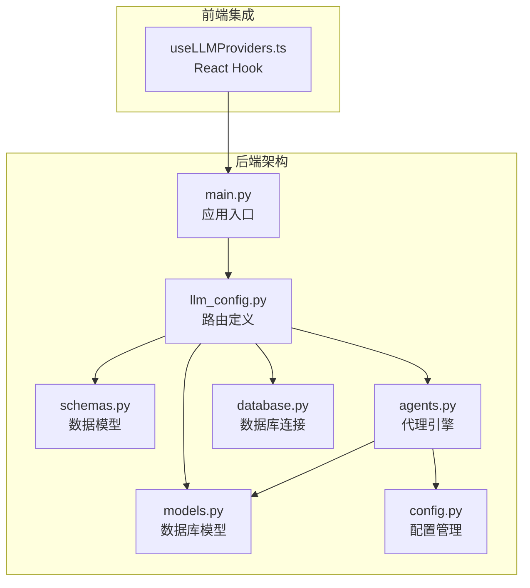
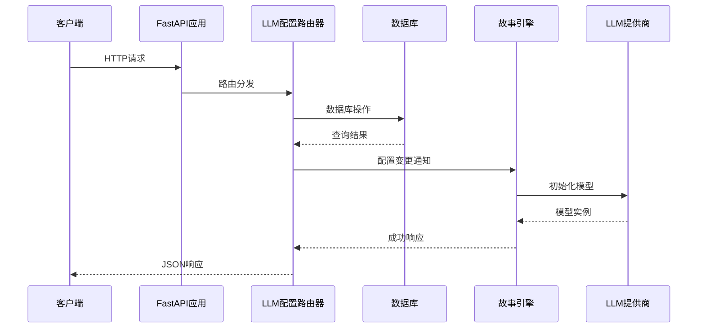
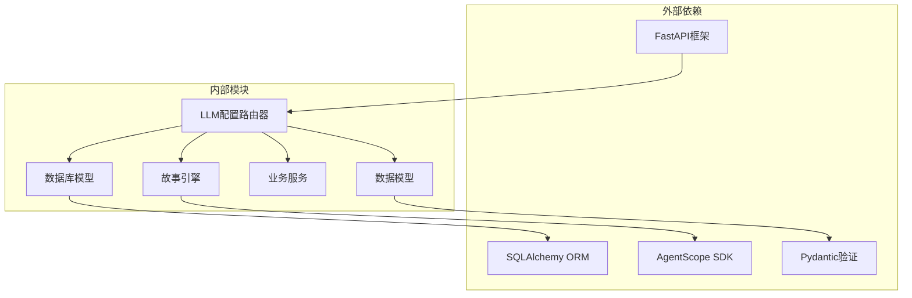
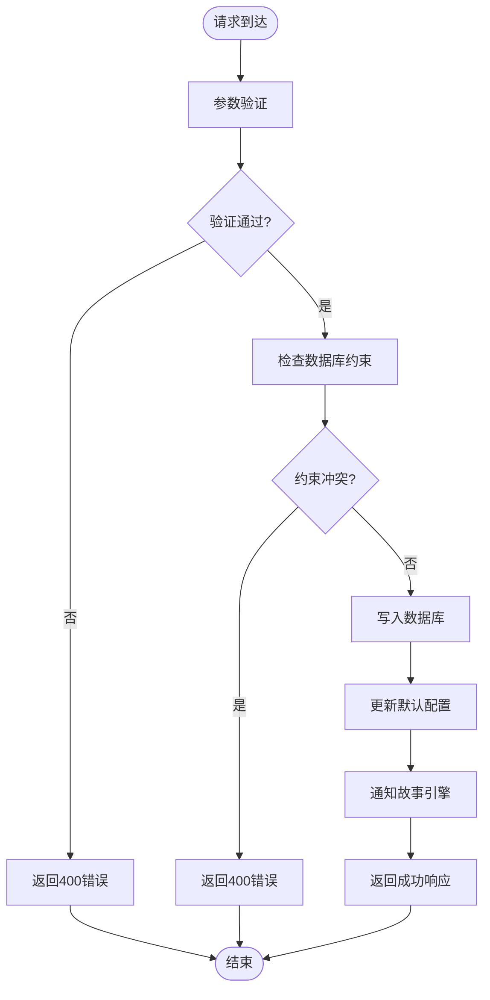

# LLM配置API

<cite>
**本文档引用的文件**
- [backend/routers/llm_config.py](file://backend/routers/llm_config.py)
- [backend/schemas.py](file://backend/schemas.py)
- [backend/models.py](file://backend/models.py)
- [backend/agents.py](file://backend/agents.py)
- [backend/main.py](file://backend/main.py)
- [backend/config.py](file://backend/config.py)
- [backend/database.py](file://backend/database.py)
- [backend/admin/src/hooks/useLLMProviders.ts](file://backend/admin/src/hooks/useLLMProviders.ts)
</cite>

## 目录
1. [简介](#简介)
2. [项目结构](#项目结构)
3. [核心组件](#核心组件)
4. [架构概览](#架构概览)
5. [详细组件分析](#详细组件分析)
6. [依赖关系分析](#依赖关系分析)
7. [性能考虑](#性能考虑)
8. [故障排除指南](#故障排除指南)
9. [结论](#结论)
10. [附录](#附录)

## 简介
本文件为LLM配置API的详细技术文档，涵盖LLM提供商管理相关的HTTP接口。该系统基于FastAPI构建，支持多种LLM提供商（OpenAI、DashScope、Anthropic、Gemini），提供完整的CRUD操作、连接测试功能，并与故事生成引擎深度集成。

## 项目结构
LLM配置API位于后端服务的路由层，采用模块化设计，主要包含以下核心模块：



**图表来源**
- [backend/main.py](file://backend/main.py#L83-L98)
- [backend/routers/llm_config.py](file://backend/routers/llm_config.py#L14-L18)

**章节来源**
- [backend/main.py](file://backend/main.py#L83-L98)
- [backend/routers/llm_config.py](file://backend/routers/llm_config.py#L1-L203)

## 核心组件
LLM配置API由多个核心组件构成，每个组件承担特定职责：

### 路由器组件
- **LLM配置路由器**：提供完整的LLM提供商管理接口
- **管理员路由器**：提供系统管理和统计功能
- **代理路由器**：管理AI代理配置

### 数据模型组件
- **LLMProvider模型**：存储LLM提供商配置信息
- **Pydantic模型**：定义请求和响应数据结构
- **Agent模型**：关联LLM提供商的AI代理配置

### 引擎组件
- **NarrativeEngine**：故事生成引擎，负责加载和使用LLM配置
- **DialogAgent**：对话代理基类，实现消息处理逻辑

**章节来源**
- [backend/routers/llm_config.py](file://backend/routers/llm_config.py#L14-L18)
- [backend/models.py](file://backend/models.py#L58-L79)
- [backend/schemas.py](file://backend/schemas.py#L4-L34)

## 架构概览
系统采用分层架构设计，确保关注点分离和可维护性：



**图表来源**
- [backend/main.py](file://backend/main.py#L94-L97)
- [backend/routers/llm_config.py](file://backend/routers/llm_config.py#L112-L138)

## 详细组件分析

### LLM配置管理接口

#### 获取所有LLM提供商
**HTTP方法**: GET  
**URL路径**: `/api/admin/llm-providers/`  
**查询参数**:
- `skip`: int, 默认0, 分页偏移量
- `limit`: int, 默认100, 分页限制

**响应格式**: JSON数组，包含所有LLMProvider对象

**状态码**:
- 200: 成功获取提供商列表
- 500: 服务器内部错误

#### 获取指定LLM提供商
**HTTP方法**: GET  
**URL路径**: `/api/admin/llm-providers/{provider_id}`  
**路径参数**:
- `provider_id`: str, 提供商唯一标识符

**响应格式**: 单个LLMProvider对象

**状态码**:
- 200: 成功获取提供商
- 404: 提供商不存在

#### 创建LLM提供商
**HTTP方法**: POST  
**URL路径**: `/api/admin/llm-providers/`  
**请求体**: LLMProviderCreate对象

**请求验证规则**:
- `name`: 必填，字符串，必须唯一
- `provider_type`: 必填，字符串，支持类型：
  - "openai_chat" 或 "azure_chat"
  - "dashscope_chat"
  - "anthropic_chat"
  - "gemini_chat"
- `api_key`: 必填，字符串
- `base_url`: 可选，字符串，URL格式
- `models`: 可选，字符串数组，默认空数组
- `tags`: 可选，字符串数组，默认空数组
- `is_active`: 可选，布尔值，默认True
- `is_default`: 可选，布尔值，默认False
- `config_json`: 可选，JSON对象，默认空对象

**响应格式**: LLMProviderResponse对象

**状态码**:
- 201: 成功创建提供商
- 400: 请求参数无效或名称已存在
- 500: 服务器内部错误

#### 更新LLM提供商
**HTTP方法**: PUT  
**URL路径**: `/api/admin/llm-providers/{provider_id}`  
**路径参数**:
- `provider_id`: str, 提供商唯一标识符

**请求体**: LLMProviderUpdate对象（支持部分更新）

**状态码**:
- 200: 成功更新提供商
- 404: 提供商不存在
- 500: 服务器内部错误

#### 删除LLM提供商
**HTTP方法**: DELETE  
**URL路径**: `/api/admin/llm-providers/{provider_id}`  
**路径参数**:
- `provider_id`: str, 提供商唯一标识符

**响应格式**: `{ "ok": true }`

**状态码**:
- 200: 成功删除提供商
- 404: 提供商不存在
- 500: 服务器内部错误

#### 测试LLM连接
**HTTP方法**: POST  
**URL路径**: `/api/admin/llm-providers/test-connection`  
**请求体**: TestConnectionRequest对象

**请求参数**:
- `provider_type`: 必填，字符串，支持类型："openai"、"dashscope"、"anthropic"、"gemini"
- `api_key`: 必填，字符串
- `base_url`: 可选，字符串
- `model`: 必填，字符串，模型名称
- `config_json`: 可选，JSON对象

**响应格式**:
```json
{
  "success": boolean,
  "message": string,
  "response": string
}
```

**状态码**:
- 200: 连接测试完成
- 500: 服务器内部错误

**章节来源**
- [backend/routers/llm_config.py](file://backend/routers/llm_config.py#L140-L202)
- [backend/schemas.py](file://backend/schemas.py#L15-L42)

### 数据模型详细说明

#### LLMProvider模型字段
| 字段名 | 类型 | 描述 | 约束条件 | 默认值 |
|--------|------|------|----------|--------|
| id | String(36) | 唯一标识符 | 主键，UUID | 自动生成 |
| name | String | 提供商名称 | 唯一索引 | 必填 |
| provider_type | String | 提供商类型 | 无 | 必填 |
| api_key | String | API密钥 | 无 | 必填 |
| base_url | String | 基础URL | 可选 | null |
| models | JSON | 支持的模型列表 | JSON数组 | [] |
| tags | JSON | 标签列表 | JSON数组 | [] |
| is_active | Boolean | 是否激活 | 无 | True |
| is_default | Boolean | 是否默认 | 无 | False |
| config_json | JSON | 额外配置 | JSON对象 | {} |
| created_at | DateTime | 创建时间 | 只读 | 自动设置 |
| updated_at | DateTime | 更新时间 | 只读 | 自动更新 |

#### Pydantic模型验证规则
**LLMProviderCreate**: 继承自LLMProviderBase，无额外验证

**LLMProviderUpdate**: 支持部分字段更新，所有字段均为可选

**TestConnectionRequest**: 
- `provider_type`: 必填，枚举值："openai"、"dashscope"、"anthropic"、"gemini"
- `api_key`: 必填，字符串
- `model`: 必填，字符串
- `config_json`: 可选，字典类型

**章节来源**
- [backend/models.py](file://backend/models.py#L58-L79)
- [backend/schemas.py](file://backend/schemas.py#L4-L42)

### 错误处理策略

#### HTTP异常处理
- **400 Bad Request**: 请求参数无效或业务逻辑错误
- **404 Not Found**: 资源不存在
- **500 Internal Server Error**: 服务器内部错误

#### 连接测试错误处理
- 捕获所有异常并返回统一格式的错误响应
- 包含详细的错误信息用于调试

#### 数据库事务处理
- 使用异步会话管理数据库连接
- 自动处理事务提交和回滚
- 支持连接池和自动重连

**章节来源**
- [backend/routers/llm_config.py](file://backend/routers/llm_config.py#L117-L120)
- [backend/routers/llm_config.py](file://backend/routers/llm_config.py#L196-L198)

### 配置参数详解

#### OpenAI配置示例
```json
{
  "name": "OpenAI",
  "provider_type": "openai_chat",
  "api_key": "sk-...your-api-key...",
  "base_url": "https://api.openai.com/v1",
  "models": ["gpt-4", "gpt-3.5-turbo"],
  "is_active": true,
  "is_default": false,
  "config_json": {
    "temperature": 0.7,
    "max_tokens": 2048
  }
}
```

#### DashScope配置示例
```json
{
  "name": "DashScope",
  "provider_type": "dashscope_chat",
  "api_key": "sk-...your-api-key...",
  "models": ["qwen-plus", "qwen-turbo"],
  "is_active": true,
  "is_default": false,
  "config_json": {
    "top_p": 0.8,
    "temperature": 0.7
  }
}
```

#### Anthropic配置示例
```json
{
  "name": "Anthropic",
  "provider_type": "anthropic_chat",
  "api_key": "sk-ant-...your-api-key...",
  "base_url": "https://api.anthropic.com",
  "models": ["claude-3-opus", "claude-3-sonnet"],
  "is_active": true,
  "is_default": false,
  "config_json": {
    "max_tokens": 4096,
    "temperature": 0.7
  }
}
```

#### Gemini配置示例
```json
{
  "name": "Gemini",
  "provider_type": "gemini_chat",
  "api_key": "AIza...your-api-key...",
  "models": ["gemini-pro", "gemini-pro-vision"],
  "is_active": true,
  "is_default": false,
  "config_json": {
    "temperature": 0.7,
    "max_output_tokens": 2048
  }
}
```

**章节来源**
- [backend/routers/llm_config.py](file://backend/routers/llm_config.py#L32-L87)

## 依赖关系分析

### 组件依赖图


**图表来源**
- [backend/routers/llm_config.py](file://backend/routers/llm_config.py#L1-L12)
- [backend/agents.py](file://backend/agents.py#L1-L10)

### 数据流图


**图表来源**
- [backend/routers/llm_config.py](file://backend/routers/llm_config.py#L117-L138)

**章节来源**
- [backend/routers/llm_config.py](file://backend/routers/llm_config.py#L1-L12)
- [backend/agents.py](file://backend/agents.py#L43-L153)

## 性能考虑

### 数据库优化
- **连接池配置**: 使用异步连接池，支持最大20个溢出连接
- **索引优化**: 为常用查询字段建立索引
- **批量操作**: 支持分页查询，避免一次性加载大量数据

### 缓存策略
- **配置缓存**: 故事引擎缓存当前激活的LLM配置
- **连接复用**: 复用AgentScope模型实例
- **响应缓存**: 对于只读查询可考虑适当的缓存策略

### 并发处理
- **异步I/O**: 全面使用异步编程模型
- **事件循环**: 优化Windows平台的事件循环配置
- **资源管理**: 自动管理数据库连接生命周期

### 最佳实践建议
1. **配置管理**: 使用环境变量管理敏感配置
2. **错误监控**: 实现全面的错误日志记录
3. **性能监控**: 添加请求耗时和数据库查询统计
4. **安全防护**: 实施适当的速率限制和输入验证

**章节来源**
- [backend/database.py](file://backend/database.py#L8-L23)
- [backend/main.py](file://backend/main.py#L7-L11)

## 故障排除指南

### 常见问题诊断

#### 连接失败
**症状**: 测试连接返回失败
**可能原因**:
- API密钥无效或过期
- 网络连接问题
- 基础URL配置错误
- 模型名称不正确

**解决步骤**:
1. 验证API密钥的有效性
2. 检查网络连通性
3. 确认基础URL格式正确
4. 验证模型名称在提供商处可用

#### 数据库连接问题
**症状**: CRUD操作失败
**可能原因**:
- 数据库服务不可用
- 连接池耗尽
- 迁移未执行

**解决步骤**:
1. 检查数据库服务状态
2. 查看连接池使用情况
3. 执行数据库迁移
4. 重启应用服务

#### 配置冲突
**症状**: 设置默认提供商失败
**可能原因**:
- 同时设置多个默认提供商
- 数据库约束冲突

**解决步骤**:
1. 确保只有一个默认提供商
2. 清理重复的默认标记
3. 重新设置默认提供商

### 调试工具
- **日志级别**: INFO级别输出关键信息
- **SQL日志**: 可选开启SQL语句日志
- **错误追踪**: 完整的异常堆栈跟踪

**章节来源**
- [backend/routers/llm_config.py](file://backend/routers/llm_config.py#L107-L110)
- [backend/main.py](file://backend/main.py#L14-L28)

## 结论
LLM配置API提供了完整、健壮的LLM提供商管理解决方案。系统采用现代化的架构设计，支持多种主流LLM提供商，具备良好的扩展性和可维护性。通过完善的错误处理、性能优化和安全措施，确保了系统的稳定运行。

## 附录

### API使用示例

#### 创建OpenAI提供商
```bash
curl -X POST "http://localhost:8000/api/admin/llm-providers/" \
  -H "Content-Type: application/json" \
  -d '{
    "name": "OpenAI",
    "provider_type": "openai_chat",
    "api_key": "sk-...your-api-key...",
    "base_url": "https://api.openai.com/v1",
    "models": ["gpt-4", "gpt-3.5-turbo"],
    "is_active": true,
    "is_default": false
  }'
```

#### 测试连接
```bash
curl -X POST "http://localhost:8000/api/admin/llm-providers/test-connection" \
  -H "Content-Type: application/json" \
  -d '{
    "provider_type": "openai",
    "api_key": "sk-...your-api-key...",
    "model": "gpt-4",
    "config_json": {}
  }'
```

### 前端集成
React Hook提供简单的数据获取和状态管理：

```typescript
const { providers, activeProviders, isLoading, isError } = useLLMProviders();
```

**章节来源**
- [backend/admin/src/hooks/useLLMProviders.ts](file://backend/admin/src/hooks/useLLMProviders.ts#L5-L16)