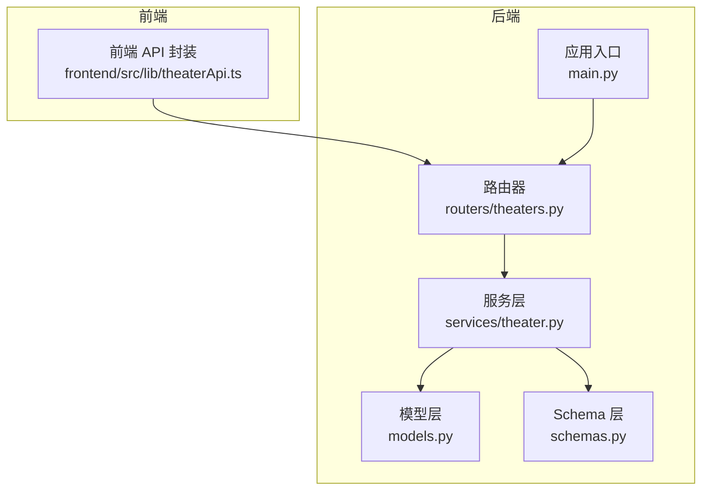
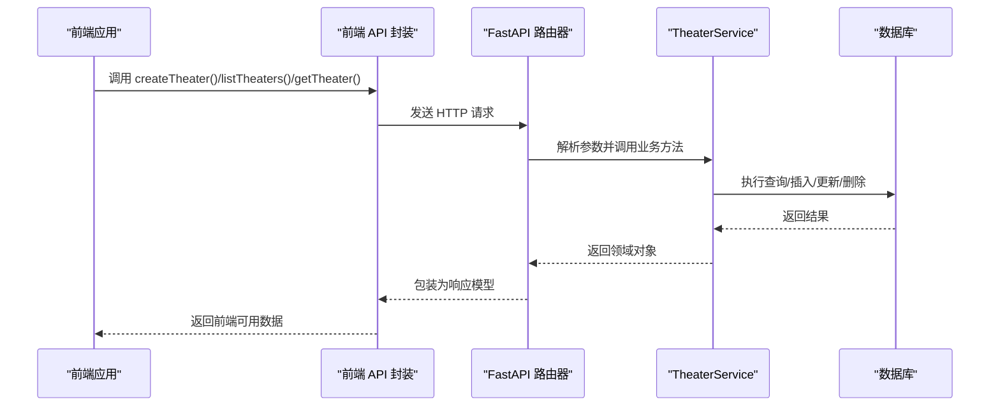
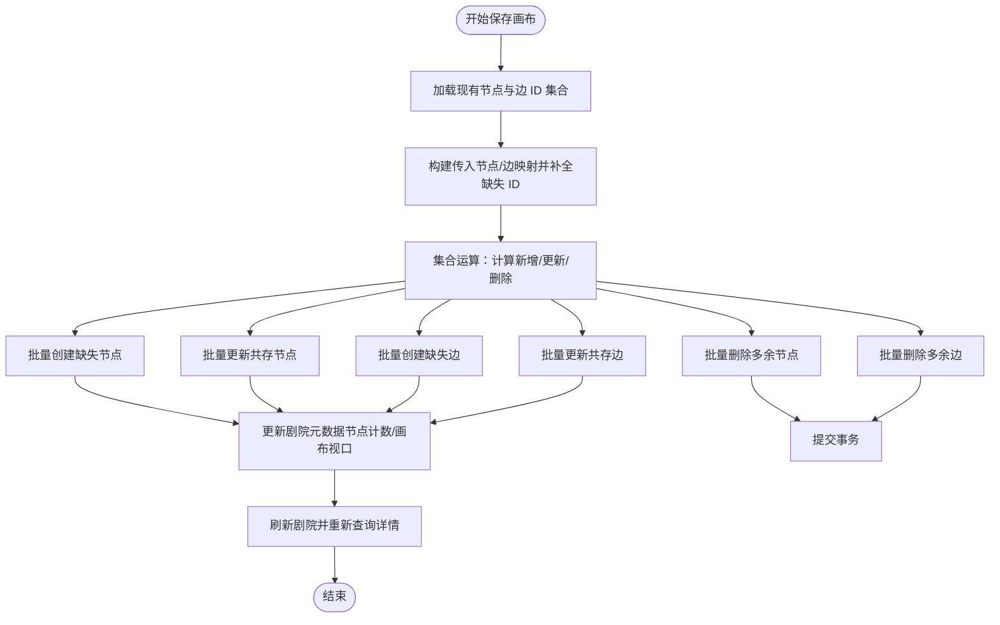
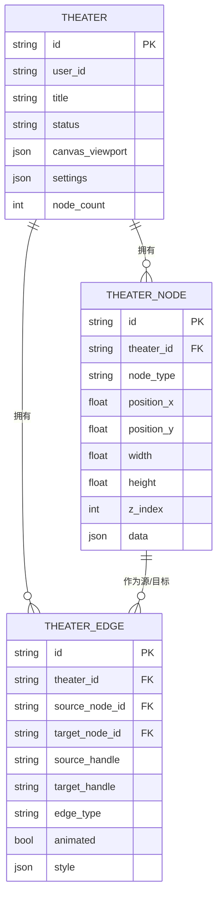
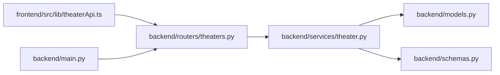

# 剧院管理接口

<cite>
**本文引用的文件**
- [backend/routers/theaters.py](file://backend/routers/theaters.py)
- [backend/services/theater.py](file://backend/services/theater.py)
- [backend/schemas.py](file://backend/schemas.py)
- [backend/models.py](file://backend/models.py)
- [frontend/src/lib/theaterApi.ts](file://frontend/src/lib/theaterApi.ts)
- [backend/main.py](file://backend/main.py)
</cite>

## 目录
1. [简介](#简介)
2. [项目结构](#项目结构)
3. [核心组件](#核心组件)
4. [架构总览](#架构总览)
5. [详细组件分析](#详细组件分析)
6. [依赖分析](#依赖分析)
7. [性能考虑](#性能考虑)
8. [故障排除指南](#故障排除指南)
9. [结论](#结论)
10. [附录](#附录)

## 简介
本文件为 KunFlix 剧院管理系统的完整 API 文档，覆盖以下能力：
- 剧院的 CRUD 操作接口（创建、读取、更新、删除）
- 剧院节点与边的管理接口（脚本、角色、故事板、视频等节点类型的增删改查）
- 画布状态全量同步与复制剧场
- 权限与鉴权约束（基于当前用户）
- 剧院模板、批量操作与导入导出的建议性实现思路

本系统采用前后端分离架构：后端使用 FastAPI + SQLAlchemy 异步 ORM，前端通过独立的 API 客户端封装调用。

## 项目结构
后端核心模块与文件职责概览：
- 路由层：集中定义剧院相关 API，负责请求解析与响应包装
- 服务层：封装业务逻辑，执行数据库事务与集合运算
- 模型层：定义数据库表结构（剧院、节点、边）
- Schema 层：定义请求/响应的数据结构与校验规则
- 前端 API 封装：提供类型安全的调用方法

图表来源
- [backend/routers/theaters.py:1-110](file://backend/routers/theaters.py#L1-L110)
- [backend/services/theater.py:1-285](file://backend/services/theater.py#L1-L285)
- [backend/models.py:75-130](file://backend/models.py#L75-L130)
- [backend/schemas.py:705-831](file://backend/schemas.py#L705-L831)
- [frontend/src/lib/theaterApi.ts:107-158](file://frontend/src/lib/theaterApi.ts#L107-L158)
- [backend/main.py:138-153](file://backend/main.py#L138-L153)

章节来源
- [backend/routers/theaters.py:1-110](file://backend/routers/theaters.py#L1-L110)
- [backend/main.py:138-153](file://backend/main.py#L138-L153)

## 核心组件
- 路由器（FastAPI）：定义 /api/theaters 前缀下的所有接口，包含剧院 CRUD、画布保存、复制剧场等
- 服务层（TheaterService）：实现剧院、节点、边的业务逻辑，包括集合运算的全量同步与复制
- 模型层（SQLAlchemy）：剧院、节点、边三张表，节点与边对剧院执行级联删除
- Schema 层：定义剧院、节点、边的请求/响应结构，含节点类型枚举与校验
- 前端 API 封装：提供类型安全的调用函数，便于在前端组件中直接使用

章节来源
- [backend/routers/theaters.py:14-110](file://backend/routers/theaters.py#L14-L110)
- [backend/services/theater.py:13-285](file://backend/services/theater.py#L13-L285)
- [backend/schemas.py:705-831](file://backend/schemas.py#L705-L831)
- [backend/models.py:75-130](file://backend/models.py#L75-L130)
- [frontend/src/lib/theaterApi.ts:107-158](file://frontend/src/lib/theaterApi.ts#L107-L158)

## 架构总览
后端通过主应用注册路由，前端通过封装好的 API 函数调用后端接口。鉴权中间件确保每个请求均绑定到当前活跃用户。

图表来源
- [backend/routers/theaters.py:20-110](file://backend/routers/theaters.py#L20-L110)
- [backend/services/theater.py:17-285](file://backend/services/theater.py#L17-L285)
- [frontend/src/lib/theaterApi.ts:107-158](file://frontend/src/lib/theaterApi.ts#L107-L158)
- [backend/main.py:138-153](file://backend/main.py#L138-L153)

## 详细组件分析

### 剧院 CRUD 接口
- 创建剧院
  - 方法与路径：POST /api/theaters
  - 请求体：剧院创建结构（标题、描述、缩略图、状态、画布视口、设置）
  - 响应体：剧院响应结构
  - 权限：需要当前活跃用户
  - 实现要点：服务层创建剧院并持久化，返回新建对象
- 列出剧院
  - 方法与路径：GET /api/theaters
  - 查询参数：page、page_size、status（draft/published/archived）
  - 响应体：剧院分页列表响应
  - 权限：需要当前活跃用户
  - 实现要点：按用户过滤、支持按状态筛选、分页排序
- 获取剧院详情
  - 方法与路径：GET /api/theaters/{theater_id}
  - 路径参数：剧院 ID
  - 响应体：剧院详情响应（含节点与边列表）
  - 权限：需要当前活跃用户且剧院归属该用户
  - 实现要点：联合查询剧院、节点、边，组装详情
- 更新剧院
  - 方法与路径：PUT /api/theaters/{theater_id}
  - 路径参数：剧院 ID
  - 请求体：剧院更新结构（所有字段可选）
  - 响应体：剧院响应结构
  - 权限：需要当前活跃用户且剧院归属该用户
  - 实现要点：仅更新传入字段，保持未传字段不变
- 删除剧院
  - 方法与路径：DELETE /api/theaters/{theater_id}
  - 路径参数：剧院 ID
  - 响应体：标准成功消息
  - 权限：需要当前活跃用户且剧院归属该用户
  - 实现要点：删除剧院，节点与边因外键级联删除

章节来源
- [backend/routers/theaters.py:20-82](file://backend/routers/theaters.py#L20-L82)
- [backend/services/theater.py:17-106](file://backend/services/theater.py#L17-L106)
- [backend/schemas.py:775-824](file://backend/schemas.py#L775-L824)

### 画布状态同步与复制剧场
- 保存画布状态（全量同步）
  - 方法与路径：PUT /api/theaters/{theater_id}/canvas
  - 请求体：画布保存请求（节点数组、边数组、可选画布视口）
  - 响应体：剧院详情响应
  - 权限：需要当前活跃用户且剧院归属该用户
  - 实现要点：对节点与边分别进行集合运算，计算新增/更新/删除，批量处理；更新剧院节点计数与画布视口
- 复制剧场
  - 方法与路径：POST /api/theaters/{theater_id}/duplicate
  - 路径参数：剧院 ID
  - 响应体：新剧院响应（标题带“副本”后缀）
  - 权限：需要当前活跃用户且剧院归属该用户
  - 实现要点：克隆剧院元数据，生成新节点 ID 并重映射边的源/目标节点，批量插入节点与边

图表来源
- [backend/services/theater.py:108-228](file://backend/services/theater.py#L108-L228)

章节来源
- [backend/routers/theaters.py:84-110](file://backend/routers/theaters.py#L84-L110)
- [backend/services/theater.py:108-284](file://backend/services/theater.py#L108-L284)

### 节点与边管理（节点类型：脚本、角色、故事板、视频）
- 节点类型枚举
  - 节点类型集合：{"script", "character", "storyboard", "video"}
  - 服务层在接收节点数据时进行校验，确保类型合法
- 节点与边的请求/响应结构
  - 节点：包含类型、位置、尺寸、层级、业务数据等
  - 边：包含源/目标节点 ID、句柄、类型、动画与样式等
- 节点与边的生命周期
  - 节点与边均属于某个剧院，剧院删除时级联删除其节点与边
  - 画布保存接口以全量同步方式维护节点与边集合

图表来源
- [backend/models.py:75-130](file://backend/models.py#L75-L130)
- [backend/schemas.py:705-831](file://backend/schemas.py#L705-L831)

章节来源
- [backend/schemas.py:6-8](file://backend/schemas.py#L6-L8)
- [backend/schemas.py:705-831](file://backend/schemas.py#L705-L831)
- [backend/models.py:93-130](file://backend/models.py#L93-L130)
- [backend/services/theater.py:108-228](file://backend/services/theater.py#L108-L228)

### 权限与鉴权
- 当前实现
  - 所有剧院相关接口均依赖当前活跃用户（依赖注入），未显式检查剧院归属
  - 服务层通过“剧院归属当前用户”的查询失败来触发 404
- 建议增强
  - 在路由层增加更明确的权限校验与错误提示
  - 对于敏感操作（如删除），可引入更细粒度的角色/权限模型

章节来源
- [backend/routers/theaters.py:21-81](file://backend/routers/theaters.py#L21-L81)
- [backend/services/theater.py:33-44](file://backend/services/theater.py#L33-L44)

### 剧院模板、批量操作与导入导出（建议实现）
- 剧院模板
  - 建议在剧院模型中增加 template_id 字段，支持从模板创建剧院
- 批量操作
  - 节点/边批量创建/更新/删除：在服务层封装批量 SQL，减少往返次数
- 导入/导出
  - 导出：将剧院详情（含节点与边）序列化为结构化文件（JSON/ZIP）
  - 导入：解析文件并调用画布保存接口进行全量同步
  - 注意：导入需处理节点 ID 冲突与边源/目标重映射

章节来源
- [backend/schemas.py:775-831](file://backend/schemas.py#L775-L831)
- [backend/services/theater.py:108-284](file://backend/services/theater.py#L108-L284)

## 依赖分析
- 组件耦合
  - 路由器依赖服务层；服务层依赖模型层与 Schema 层；前端 API 封装依赖后端路由
- 外部依赖
  - FastAPI、SQLAlchemy 异步 ORM、Alembic 迁移、CORS 中间件
- 循环依赖
  - 未发现循环依赖迹象

图表来源
- [frontend/src/lib/theaterApi.ts:107-158](file://frontend/src/lib/theaterApi.ts#L107-L158)
- [backend/routers/theaters.py:1-110](file://backend/routers/theaters.py#L1-L110)
- [backend/services/theater.py:1-285](file://backend/services/theater.py#L1-L285)
- [backend/models.py:1-503](file://backend/models.py#L1-L503)
- [backend/schemas.py:1-931](file://backend/schemas.py#L1-L931)
- [backend/main.py:138-153](file://backend/main.py#L138-L153)

章节来源
- [backend/main.py:138-153](file://backend/main.py#L138-L153)

## 性能考虑
- 批量操作
  - 画布保存采用集合运算与批量 SQL，降低网络往返与事务开销
- 分页与筛选
  - 列表接口支持分页与状态筛选，避免一次性加载过多数据
- 级联删除
  - 节点与边的级联删除简化了删除流程，但需注意大剧场删除的性能影响
- 建议优化
  - 对节点/边数量较多的剧院，可在前端实现增量同步策略
  - 对频繁查询的字段（如剧院状态）建立索引

章节来源
- [backend/services/theater.py:62-89](file://backend/services/theater.py#L62-L89)
- [backend/services/theater.py:108-228](file://backend/services/theater.py#L108-L228)
- [backend/models.py:75-130](file://backend/models.py#L75-L130)

## 故障排除指南
- 404 未找到
  - 场景：访问不存在的剧院或非本人剧院
  - 处理：服务层通过查询失败抛出 404，前端应提示用户重新选择剧院
- 画布保存异常
  - 场景：节点/边 ID 不一致导致更新失败
  - 处理：确认传入节点/边是否包含 ID；若为空则由后端生成并返回
- 权限不足
  - 场景：尝试操作他人剧院
  - 处理：确保登录状态正确，检查鉴权头是否有效

章节来源
- [backend/services/theater.py:33-44](file://backend/services/theater.py#L33-L44)
- [backend/routers/theaters.py:21-81](file://backend/routers/theaters.py#L21-L81)

## 结论
本剧院管理系统提供了完善的剧院 CRUD、节点/边管理与画布全量同步能力，并通过服务层的集合运算实现了高效的批量维护。建议后续增强权限校验、引入模板与导入导出机制，并针对大规模数据场景优化同步策略与索引设计。

## 附录

### API 定义总览
- 创建剧院
  - 方法：POST
  - 路径：/api/theaters
  - 请求体：剧院创建结构
  - 响应体：剧院响应结构
- 列出剧院
  - 方法：GET
  - 路径：/api/theaters
  - 查询参数：page、page_size、status
  - 响应体：剧院分页列表响应
- 获取剧院详情
  - 方法：GET
  - 路径：/api/theaters/{theater_id}
  - 响应体：剧院详情响应（含节点与边）
- 更新剧院
  - 方法：PUT
  - 路径：/api/theaters/{theater_id}
  - 请求体：剧院更新结构（可选字段）
  - 响应体：剧院响应结构
- 删除剧院
  - 方法：DELETE
  - 路径：/api/theaters/{theater_id}
  - 响应体：标准成功消息
- 保存画布状态
  - 方法：PUT
  - 路径：/api/theaters/{theater_id}/canvas
  - 请求体：画布保存请求（节点数组、边数组、可选画布视口）
  - 响应体：剧院详情响应
- 复制剧场
  - 方法：POST
  - 路径：/api/theaters/{theater_id}/duplicate
  - 响应体：新剧院响应

章节来源
- [backend/routers/theaters.py:20-110](file://backend/routers/theaters.py#L20-L110)
- [frontend/src/lib/theaterApi.ts:107-158](file://frontend/src/lib/theaterApi.ts#L107-L158)