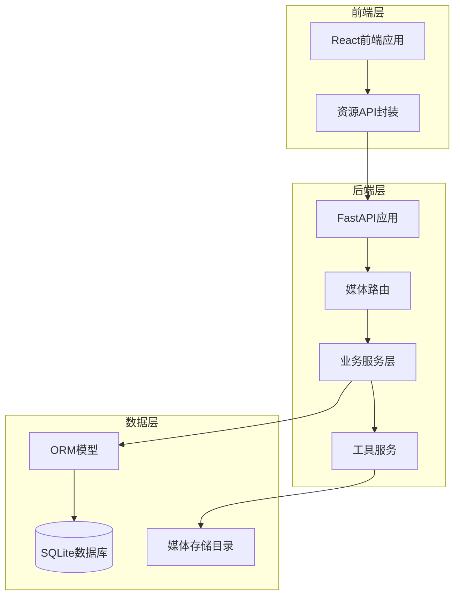
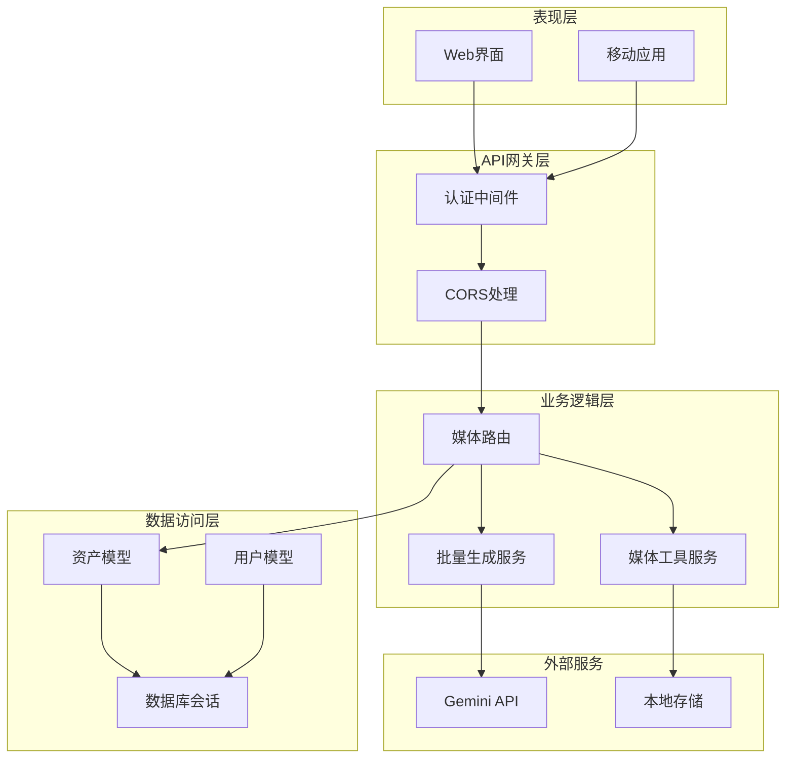
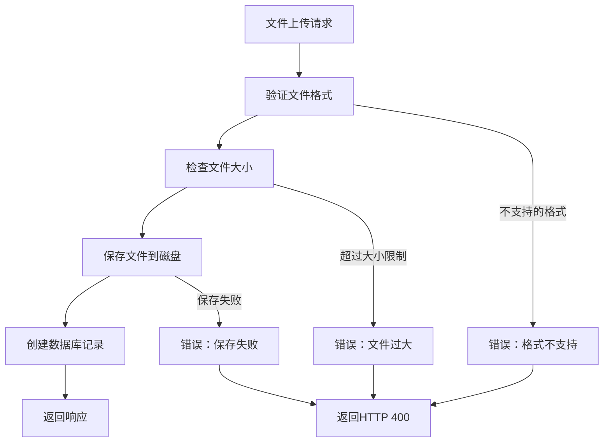
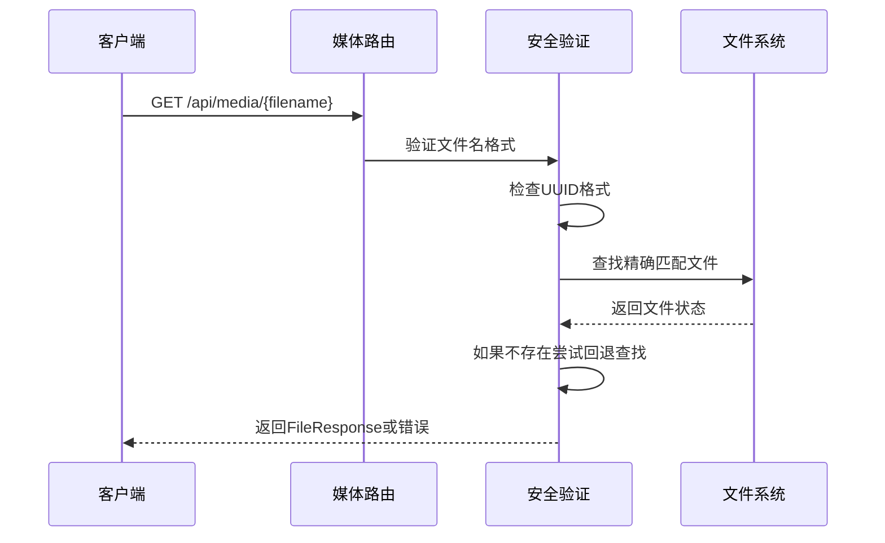
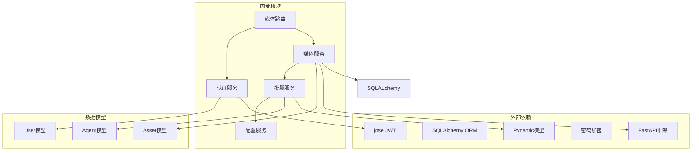

# 媒体资源接口

<cite>
**本文档引用的文件**
- [backend/routers/media.py](file://backend/routers/media.py)
- [backend/services/media_utils.py](file://backend/services/media_utils.py)
- [backend/services/batch_image_gen.py](file://backend/services/batch_image_gen.py)
- [backend/models.py](file://backend/models.py)
- [backend/schemas.py](file://backend/schemas.py)
- [backend/auth.py](file://backend/auth.py)
- [backend/main.py](file://backend/main.py)
- [backend/config.py](file://backend/config.py)
- [frontend/src/lib/resourceApi.ts](file://frontend/src/lib/resourceApi.ts)
</cite>

## 目录
1. [简介](#简介)
2. [项目结构](#项目结构)
3. [核心组件](#核心组件)
4. [架构概览](#架构概览)
5. [详细组件分析](#详细组件分析)
6. [依赖关系分析](#依赖关系分析)
7. [性能考虑](#性能考虑)
8. [故障排除指南](#故障排除指南)
9. [结论](#结论)

## 简介

KunFlix媒体资源管理系统是一个基于FastAPI构建的现代化多媒体资产管理平台。该系统提供了完整的媒体文件上传、下载、管理和批量处理功能，支持图片、视频、音频等多种多媒体格式。

本系统的核心特点包括：
- **多格式支持**：全面支持图片（PNG、JPG、WEBP、GIF）、视频（MP4、WEBM、MOV）和音频（MP3、WAV、OGG）格式
- **安全存储**：采用UUID命名策略和严格的文件类型验证
- **权限控制**：基于JWT的用户认证和资源级权限管理
- **批量处理**：支持并行图片生成和批量文件操作
- **灵活扩展**：模块化设计，易于集成新的媒体处理服务

## 项目结构

系统采用前后端分离的架构设计，主要分为以下层次：

**图表来源**
- [backend/main.py:110-153](file://backend/main.py#L110-L153)
- [backend/routers/media.py:30](file://backend/routers/media.py#L30)

**章节来源**
- [backend/main.py:110-153](file://backend/main.py#L110-L153)
- [backend/routers/media.py:30](file://backend/routers/media.py#L30)

## 核心组件

### 媒体路由模块

媒体路由模块是整个系统的入口点，负责处理所有媒体相关的HTTP请求。该模块实现了RESTful API设计原则，提供了完整的CRUD操作。

**主要功能特性：**
- **文件上传**：支持单文件和批量文件上传
- **资源管理**：提供资源的增删改查操作
- **文件服务**：安全的文件下载和访问控制
- **批量生成**：集成AI驱动的批量图片生成

### 业务服务层

业务服务层包含了具体的业务逻辑实现，包括文件处理、媒体转换和第三方服务集成。

**核心服务：**
- **媒体工具服务**：提供文件保存、URL下载等基础功能
- **批量图片生成服务**：基于Google Gemini API的并行图片生成
- **配置适配器**：统一不同供应商的配置格式

### 数据模型层

系统使用SQLAlchemy ORM进行数据持久化，建立了完整的媒体资源管理模型。

**关键模型：**
- **Asset模型**：媒体资源的核心数据模型
- **User模型**：用户身份认证和权限管理
- **Agent模型**：智能体配置和AI服务集成

**章节来源**
- [backend/routers/media.py:95-299](file://backend/routers/media.py#L95-L299)
- [backend/services/media_utils.py:20-79](file://backend/services/media_utils.py#L20-L79)
- [backend/models.py:131-149](file://backend/models.py#L131-L149)

## 架构概览

系统采用分层架构设计，确保了良好的可维护性和扩展性：

**图表来源**
- [backend/main.py:130-153](file://backend/main.py#L130-L153)
- [backend/routers/media.py:30](file://backend/routers/media.py#L30)

**章节来源**
- [backend/main.py:130-153](file://backend/main.py#L130-L153)
- [backend/routers/media.py:30](file://backend/routers/media.py#L30)

## 详细组件分析

### 媒体文件上传接口

#### 接口定义

系统提供了完整的文件上传功能，支持多种媒体格式的安全上传。

**接口规范：**
- **方法**：POST
- **路径**：`/api/media/upload`
- **认证**：需要有效的JWT访问令牌
- **内容类型**：multipart/form-data

#### 支持的文件格式

系统严格验证上传文件的格式和大小：

| 文件类型 | 支持格式 | 最大大小 |
|---------|---------|---------|
| 图片 | PNG, JPG, JPEG, WEBP, GIF | 50MB |
| 视频 | MP4, WEBM, MOV | 500MB |
| 音频 | MP3, WAV, OGG | 100MB |

#### 安全机制

系统实施了多层次的安全保护措施：

**图表来源**
- [backend/routers/media.py:95-149](file://backend/routers/media.py#L95-L149)

**章节来源**
- [backend/routers/media.py:95-149](file://backend/routers/media.py#L95-L149)

### 媒体资源管理接口

#### 资源列表查询

系统提供了灵活的资源查询功能，支持分页和类型过滤。

**接口规范：**
- **方法**：GET
- **路径**：`/api/media/assets`
- **查询参数**：
  - `page`：页码（默认1）
  - `page_size`：每页数量（1-100）
  - `file_type`：文件类型（image/video/audio/all）

#### 资源更新功能

支持对现有资源进行重命名和文件替换：

**接口规范：**
- **方法**：PUT
- **路径**：`/api/media/assets/{asset_id}`
- **支持的操作**：
  - 重命名资源（original_name参数）
  - 替换文件（file参数）

#### 资源删除功能

系统提供硬删除功能，同时清理数据库记录和物理文件：

**接口规范：**
- **方法**：DELETE
- **路径**：`/api/media/assets/{asset_id}`

**章节来源**
- [backend/routers/media.py:155-266](file://backend/routers/media.py#L155-L266)

### 文件下载服务

#### 安全文件服务

系统提供了安全的文件下载服务，支持精确匹配和回退查找：

**图表来源**
- [backend/routers/media.py:272-299](file://backend/routers/media.py#L272-L299)

#### 缓存机制

系统实现了高效的缓存策略：

- **缓存控制**：设置Cache-Control头为public, max-age=31536000
- **静态资源优化**：长期缓存策略减少服务器负载
- **CDN友好**：生成的URL适合CDN缓存

**章节来源**
- [backend/routers/media.py:272-299](file://backend/routers/media.py#L272-L299)

### 批量图片生成接口

#### AI驱动的批量处理

系统集成了Google Gemini和xAI的批量图片生成功能：

**接口规范：**
- **方法**：POST
- **路径**：`/api/media/batch-generate`
- **请求体**：BatchImageGenerateRequest
- **并发控制**：1-8个并发任务

#### 配置选项

系统支持丰富的配置选项：

| 配置项 | 可选值 | 默认值 | 描述 |
|-------|-------|-------|------|
| aspect_ratio | 1:1, 16:9, 4:3, 3:4, 9:16 | 1:1 | 图片宽高比 |
| image_size | 512, 1K, 2K, 4K, auto | 2K | 图片尺寸 |
| output_format | png, jpeg, webp | png | 输出格式 |
| max_concurrent | 1-8 | 4 | 最大并发数 |

**章节来源**
- [backend/routers/media.py:301-444](file://backend/routers/media.py#L301-L444)
- [backend/services/batch_image_gen.py:113-187](file://backend/services/batch_image_gen.py#L113-L187)

### 媒体工具服务

#### 文件保存功能

系统提供了多种文件保存方式：

**内联图片保存：**
- 支持从base64数据保存图片
- 自动推断MIME类型
- 生成UUID文件名

**远程文件下载：**
- 支持从URL下载图片和视频
- 异步HTTP客户端处理
- 自动内容类型检测

**章节来源**
- [backend/services/media_utils.py:20-79](file://backend/services/media_utils.py#L20-L79)

## 依赖关系分析

系统采用了清晰的依赖关系设计，确保了模块间的松耦合：

**图表来源**
- [backend/routers/media.py:1-28](file://backend/routers/media.py#L1-L28)
- [backend/auth.py:1-25](file://backend/auth.py#L1-L25)

**章节来源**
- [backend/routers/media.py:1-28](file://backend/routers/media.py#L1-L28)
- [backend/auth.py:1-25](file://backend/auth.py#L1-L25)

## 性能考虑

### 并发处理

系统采用了异步编程模型来提高性能：

- **异步IO**：使用async/await模式处理文件操作
- **并发限制**：通过信号量控制批量操作的并发数
- **内存管理**：流式处理大文件，避免内存溢出

### 缓存策略

系统实现了多层次的缓存机制：

- **文件级缓存**：长期缓存静态媒体文件
- **数据库查询缓存**：缓存常用的查询结果
- **会话缓存**：Redis支持（配置中预留）

### 存储优化

- **UUID命名**：避免文件名冲突和安全问题
- **目录结构**：扁平化存储结构，便于文件管理
- **清理机制**：定期清理无效文件和临时数据

## 故障排除指南

### 常见问题及解决方案

#### 文件上传失败

**可能原因：**
- 文件格式不受支持
- 文件大小超过限制
- 磁盘空间不足

**解决步骤：**
1. 检查文件格式是否在支持列表中
2. 验证文件大小是否超过限制
3. 确认磁盘空间充足
4. 查看服务器日志获取详细错误信息

#### 权限访问错误

**可能原因：**
- JWT令牌过期
- 用户账户被禁用
- 资源所有权验证失败

**解决步骤：**
1. 刷新JWT访问令牌
2. 确认用户账户状态正常
3. 验证资源归属关系
4. 检查CORS配置

#### 批量生成异常

**可能原因：**
- 第三方API调用失败
- 并发数设置过高
- 配置参数不正确

**解决步骤：**
1. 检查第三方API密钥有效性
2. 降低并发数设置
3. 验证配置参数格式
4. 查看详细的错误日志

**章节来源**
- [backend/routers/media.py:102-131](file://backend/routers/media.py#L102-L131)
- [backend/auth.py:95-113](file://backend/auth.py#L95-L113)

## 结论

KunFlix媒体资源管理系统是一个功能完整、安全可靠的多媒体资产管理平台。系统通过模块化的架构设计、严格的安全控制和高效的性能优化，为用户提供了优质的媒体资源管理体验。

**主要优势：**
- **安全性**：多重安全验证和权限控制
- **可扩展性**：模块化设计支持功能扩展
- **性能**：异步处理和缓存优化
- **易用性**：直观的API设计和错误处理

**未来发展方向：**
- 集成CDN服务提升全球访问性能
- 添加更多媒体格式支持
- 实现更精细的权限控制
- 增强批量处理能力