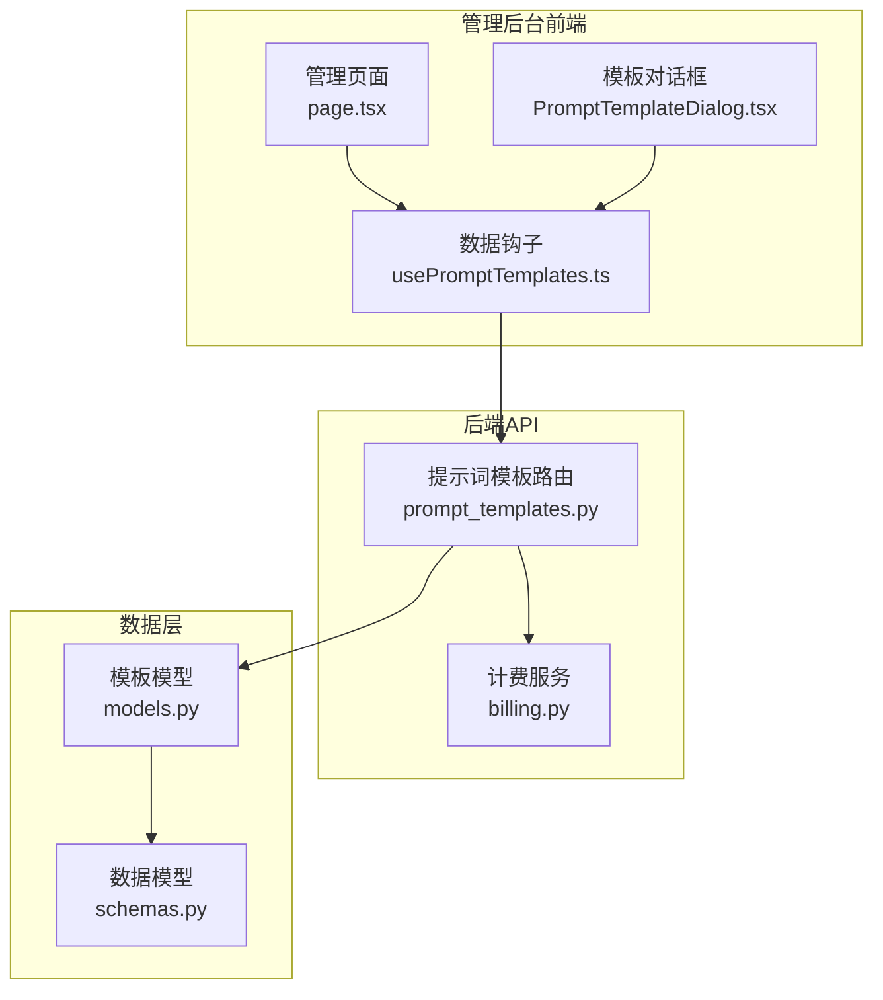
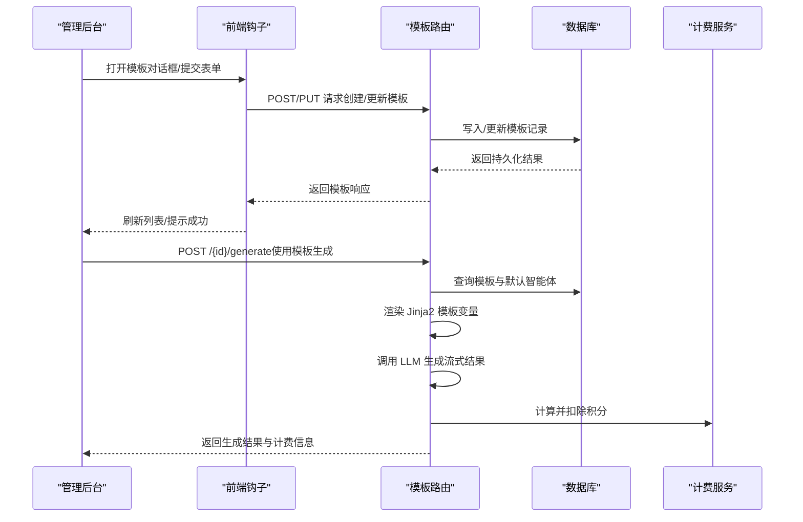
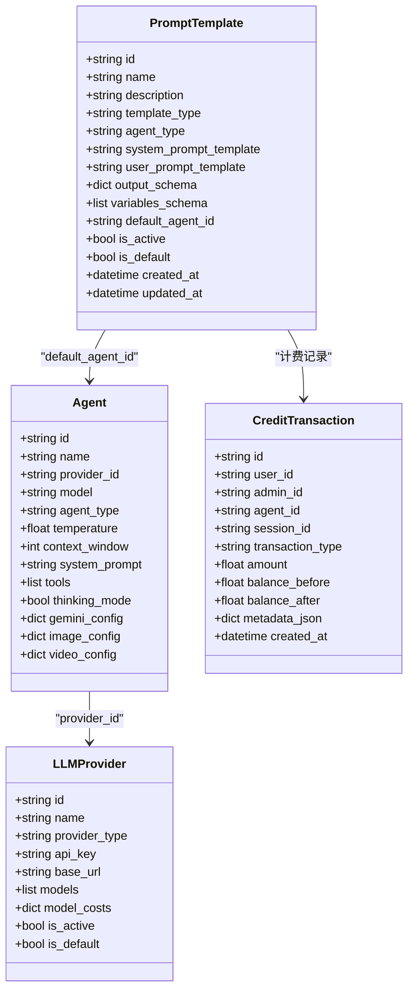

# 提示词模板接口

<cite>
**本文引用的文件**
- [prompt_templates.py](file://backend/routers/prompt_templates.py)
- [schemas.py](file://backend/schemas.py)
- [models.py](file://backend/models.py)
- [usePromptTemplates.ts](file://backend/admin/src/hooks/usePromptTemplates.ts)
- [PromptTemplateDialog.tsx](file://backend/admin/src/app/admin/prompt-templates/PromptTemplateDialog.tsx)
- [page.tsx](file://backend/admin/src/app/admin/prompt-templates/page.tsx)
- [billing.py](file://backend/services/billing.py)
- [README.md](file://README.md)
</cite>

## 目录
1. [简介](#简介)
2. [项目结构](#项目结构)
3. [核心组件](#核心组件)
4. [架构概览](#架构概览)
5. [详细组件分析](#详细组件分析)
6. [依赖关系分析](#依赖关系分析)
7. [性能考虑](#性能考虑)
8. [故障排除指南](#故障排除指南)
9. [结论](#结论)
10. [附录](#附录)

## 简介
本文件为 KunFlix 提示词模板系统的详细 API 文档。系统围绕提示词模板的创建、编辑、删除、查询、变量替换、条件渲染、动态生成、分类管理、权限控制、版本管理、导入导出、批量操作、预览等功能展开，旨在为剧场创建等场景提供标准化的 AI 生成提示词模板管理能力。

## 项目结构
提示词模板系统主要由后端 FastAPI 路由、数据库模型、Pydantic 数据模型与前端管理界面组成，形成“管理后台 + 后端 API + 数据库”的三层架构。

图表来源
- [prompt_templates.py:25-320](file://backend/routers/prompt_templates.py#L25-L320)
- [models.py:352-387](file://backend/models.py#L352-L387)
- [schemas.py:566-636](file://backend/schemas.py#L566-L636)
- [usePromptTemplates.ts:1-53](file://backend/admin/src/hooks/usePromptTemplates.ts#L1-L53)
- [PromptTemplateDialog.tsx:1-417](file://backend/admin/src/app/admin/prompt-templates/PromptTemplateDialog.tsx#L1-L417)
- [page.tsx:1-268](file://backend/admin/src/app/admin/prompt-templates/page.tsx#L1-L268)

章节来源
- [README.md:22-131](file://README.md#L22-L131)

## 核心组件
- 后端路由：提供模板 CRUD、列表查询、类型枚举、AI 生成调用等接口
- Pydantic 模型：定义模板请求/响应结构、变量定义、生成请求/响应
- 数据库模型：定义模板表结构及字段约束
- 前端管理界面：提供模板列表、筛选、创建/编辑、删除、状态切换等交互
- 计费服务：与模板生成流程结合，计算并扣除积分

章节来源
- [prompt_templates.py:32-320](file://backend/routers/prompt_templates.py#L32-L320)
- [schemas.py:566-636](file://backend/schemas.py#L566-L636)
- [models.py:352-387](file://backend/models.py#L352-L387)
- [usePromptTemplates.ts:1-53](file://backend/admin/src/hooks/usePromptTemplates.ts#L1-L53)
- [PromptTemplateDialog.tsx:1-417](file://backend/admin/src/app/admin/prompt-templates/PromptTemplateDialog.tsx#L1-L417)
- [page.tsx:1-268](file://backend/admin/src/app/admin/prompt-templates/page.tsx#L1-L268)
- [billing.py:1-388](file://backend/services/billing.py#L1-L388)

## 架构概览
提示词模板系统通过 FastAPI 路由暴露 REST 接口，前端通过 SWR 钩子与后端交互，数据库采用 SQLAlchemy ORM 映射。模板生成流程包含模板变量渲染、智能体选择、LLM 调用、JSON 结果解析与计费扣减。

图表来源
- [prompt_templates.py:32-320](file://backend/routers/prompt_templates.py#L32-L320)
- [usePromptTemplates.ts:33-52](file://backend/admin/src/hooks/usePromptTemplates.ts#L33-L52)
- [billing.py:178-308](file://backend/services/billing.py#L178-L308)

## 详细组件分析

### 后端路由与接口
- 创建模板
  - 方法：POST /api/prompt-templates
  - 权限：管理员
  - 功能：校验名称唯一性；若设置为默认则取消同类型其他模板默认标记；创建新模板并返回
- 列表查询
  - 方法：GET /api/prompt-templates
  - 权限：当前用户或管理员
  - 参数：template_type、agent_type、is_active、skip、limit
  - 返回：模板列表（按创建时间倒序）
- 获取详情
  - 方法：GET /api/prompt-templates/{template_id}
  - 权限：当前用户或管理员
  - 返回：单个模板详情
- 更新模板
  - 方法：PUT /api/prompt-templates/{template_id}
  - 权限：管理员
  - 功能：名称冲突检查；默认模板切换逻辑；逐字段更新
- 删除模板
  - 方法：DELETE /api/prompt-templates/{template_id}
  - 权限：管理员
  - 返回：删除成功消息
- 模板生成
  - 方法：POST /api/prompt-templates/{template_id}/generate
  - 权限：当前用户或管理员
  - 功能：选择智能体 → 渲染模板变量（Jinja2）→ 构造消息 → 调用 LLM → 解析 JSON → 计费扣减
- 模板类型枚举
  - 方法：GET /api/prompt-templates/types/list
  - 权限：当前用户或管理员
  - 返回：模板类型列表（含中文标签）

章节来源
- [prompt_templates.py:32-320](file://backend/routers/prompt_templates.py#L32-L320)

### Pydantic 数据模型
- PromptTemplateVariable：模板变量定义（名称、标签、类型、是否必填、选项、默认值、描述）
- PromptTemplateBase/Create/Update/Response：模板基础字段、变量定义、输出模式、默认智能体、激活/默认状态
- AIGenerateRequest/Response：生成请求（模板ID、变量、可选智能体ID）、生成响应（成功标志、数据、token使用、积分消耗）

章节来源
- [schemas.py:566-636](file://backend/schemas.py#L566-L636)

### 数据库模型
- PromptTemplate：模板表，包含名称、描述、模板类型、智能体类型、系统/用户提示词模板、输出模式、变量定义、默认智能体关联、激活/默认状态、时间戳
- Agent/LLMProvider：用于模板生成时选择智能体与供应商配置
- CreditTransaction：用于记录计费交易

章节来源
- [models.py:352-387](file://backend/models.py#L352-L387)
- [models.py:210-273](file://backend/models.py#L210-L273)
- [models.py:152-176](file://backend/models.py#L152-L176)
- [models.py:281-301](file://backend/models.py#L281-L301)

### 前端管理界面
- 页面组件：提供模板列表、搜索、筛选（智能体类型、模板分类）、状态显示、删除确认
- 对话框组件：支持创建/编辑模板，定义变量、系统/用户提示词、模板分类、状态开关
- 钩子：封装模板列表、详情、创建、更新、删除的 API 调用，支持过滤参数

章节来源
- [page.tsx:1-268](file://backend/admin/src/app/admin/prompt-templates/page.tsx#L1-L268)
- [PromptTemplateDialog.tsx:1-417](file://backend/admin/src/app/admin/prompt-templates/PromptTemplateDialog.tsx#L1-L417)
- [usePromptTemplates.ts:1-53](file://backend/admin/src/hooks/usePromptTemplates.ts#L1-L53)

### 计费与扣减
- calculate_credit_cost：根据 StreamResult 的 token 统计与 Agent 费率计算总积分消耗
- deduct_credits_atomic：原子性扣除用户/管理员积分，支持冻结检查与异常处理
- 在模板生成流程中，生成完成后根据 token 统计与智能体配置计算并扣除积分

章节来源
- [billing.py:310-350](file://backend/services/billing.py#L310-L350)
- [billing.py:178-308](file://backend/services/billing.py#L178-L308)
- [prompt_templates.py:264-283](file://backend/routers/prompt_templates.py#L264-L283)

### 模板变量替换与条件渲染
- 变量替换：使用 Jinja2 模板引擎对 system_prompt_template 与 user_prompt_template 进行变量渲染
- 条件渲染：当 user_prompt_template 为空时，自动追加默认用户提示
- 变量定义：前端对话框支持定义变量类型（字符串、多行文本、数字、布尔、下拉）、是否必填、默认值、选项等

章节来源
- [prompt_templates.py:209-222](file://backend/routers/prompt_templates.py#L209-L222)
- [PromptTemplateDialog.tsx:303-379](file://backend/admin/src/app/admin/prompt-templates/PromptTemplateDialog.tsx#L303-L379)
- [schemas.py:568-577](file://backend/schemas.py#L568-L577)

### 模板分类管理与权限控制
- 分类管理：模板类型包括 story_basic、character、scene、storyboard、custom；支持自定义分类
- 权限控制：模板 CRUD 与生成接口均需要管理员或当前用户身份验证；默认模板切换仅管理员可操作
- 状态管理：支持启用/禁用模板；默认模板在同一类型内互斥

章节来源
- [prompt_templates.py:295-320](file://backend/routers/prompt_templates.py#L295-L320)
- [prompt_templates.py:44-53](file://backend/routers/prompt_templates.py#L44-L53)
- [prompt_templates.py:119-130](file://backend/routers/prompt_templates.py#L119-L130)

### 版本管理与动态生成机制
- 版本管理：模板记录包含 created_at/updated_at 时间戳，便于审计与回溯
- 动态生成：模板生成接口支持传入 agent_id 覆盖模板默认智能体；智能体选择逻辑包含默认智能体查找与可用性校验
- JSON 解析：对 LLM 返回的 JSON 进行解析，支持去除代码块标记

章节来源
- [models.py:385-386](file://backend/models.py#L385-L386)
- [prompt_templates.py:182-200](file://backend/routers/prompt_templates.py#L182-L200)
- [prompt_templates.py:247-261](file://backend/routers/prompt_templates.py#L247-L261)

### 导入导出、批量操作与预览
- 导入导出：当前后端未提供专门的模板导入导出接口；可通过模板创建/更新接口实现批量导入（建议前端封装批量上传 JSON 的功能）
- 批量操作：前端提供筛选与状态切换，后端未提供专门的批量删除/启用接口
- 预览：前端对话框支持实时预览模板变量与提示词内容；后端未提供独立的模板预览接口

章节来源
- [PromptTemplateDialog.tsx:263-300](file://backend/admin/src/app/admin/prompt-templates/PromptTemplateDialog.tsx#L263-L300)
- [usePromptTemplates.ts:1-23](file://backend/admin/src/hooks/usePromptTemplates.ts#L1-L23)

### 模板继承、复用与最佳实践
- 继承与复用：模板通过 variables_schema 定义变量，不同模板可复用相同变量名；模板类型字段用于分类复用
- 最佳实践：
  - 为每个模板定义清晰的 variables_schema，明确变量类型与默认值
  - 使用 Jinja2 变量语法 {{ var }}，并在 user_prompt_template 中补充上下文提示
  - 为常用场景创建默认模板，减少用户选择成本
  - 保持模板简洁，必要时拆分为多个子模板组合使用

章节来源
- [schemas.py:568-577](file://backend/schemas.py#L568-L577)
- [prompt_templates.py:209-222](file://backend/routers/prompt_templates.py#L209-L222)

## 依赖关系分析

图表来源
- [models.py:352-387](file://backend/models.py#L352-L387)
- [models.py:210-273](file://backend/models.py#L210-L273)
- [models.py:152-176](file://backend/models.py#L152-L176)
- [models.py:281-301](file://backend/models.py#L281-L301)

## 性能考虑
- 模板查询：列表接口支持分页与筛选，建议合理设置 limit 与索引字段
- 模板生成：Jinja2 渲染与 LLM 调用为 IO 密集型，建议在上游缓存常用变量与智能体配置
- 计费扣减：原子性更新与事务保证，避免并发问题；建议在高并发场景下增加重试与幂等处理
- 前端交互：SWR 缓存与增量刷新，减少重复请求

## 故障排除指南
- 模板名称冲突：创建/更新时若名称已存在，返回 400 错误
- 模板不存在：查询/更新/删除时若模板不存在，返回 404 错误
- 模板渲染错误：Jinja2 渲染失败时返回 400 错误，检查变量名与数据类型
- 智能体不可用：智能体或供应商不可用时返回 400 错误
- JSON 解析失败：LLM 返回非有效 JSON 时返回 500 错误，检查模板输出约束
- 积分不足：扣费失败抛出余额不足异常，前端提示用户充值

章节来源
- [prompt_templates.py:39-42](file://backend/routers/prompt_templates.py#L39-L42)
- [prompt_templates.py:94-96](file://backend/routers/prompt_templates.py#L94-L96)
- [prompt_templates.py:214-215](file://backend/routers/prompt_templates.py#L214-L215)
- [prompt_templates.py:193-196](file://backend/routers/prompt_templates.py#L193-L196)
- [prompt_templates.py:257-261](file://backend/routers/prompt_templates.py#L257-L261)
- [billing.py:37-43](file://backend/services/billing.py#L37-L43)

## 结论
提示词模板系统提供了完善的模板生命周期管理与生成能力，结合前端可视化界面与后端原子计费机制，能够满足剧场创建等场景的标准化与自动化需求。建议后续增强导入导出、批量操作与模板预览能力，进一步提升模板复用效率与管理体验。

## 附录

### API 定义总览
- 创建模板
  - 方法：POST /api/prompt-templates
  - 权限：管理员
  - 请求体：PromptTemplateCreate
  - 响应体：PromptTemplateResponse
- 列表模板
  - 方法：GET /api/prompt-templates
  - 权限：当前用户或管理员
  - 查询参数：template_type、agent_type、is_active、skip、limit
  - 响应体：List[PromptTemplateResponse]
- 获取模板
  - 方法：GET /api/prompt-templates/{template_id}
  - 权限：当前用户或管理员
  - 响应体：PromptTemplateResponse
- 更新模板
  - 方法：PUT /api/prompt-templates/{template_id}
  - 权限：管理员
  - 请求体：PromptTemplateUpdate
  - 响应体：PromptTemplateResponse
- 删除模板
  - 方法：DELETE /api/prompt-templates/{template_id}
  - 权限：管理员
  - 响应体：{"message": "Template deleted successfully"}
- 模板生成
  - 方法：POST /api/prompt-templates/{template_id}/generate
  - 权限：当前用户或管理员
  - 请求体：AIGenerateRequest
  - 响应体：AIGenerateResponse
- 模板类型枚举
  - 方法：GET /api/prompt-templates/types/list
  - 权限：当前用户或管理员
  - 响应体：List[{value: string, label: string}]

章节来源
- [prompt_templates.py:32-320](file://backend/routers/prompt_templates.py#L32-L320)
- [schemas.py:622-636](file://backend/schemas.py#L622-L636)