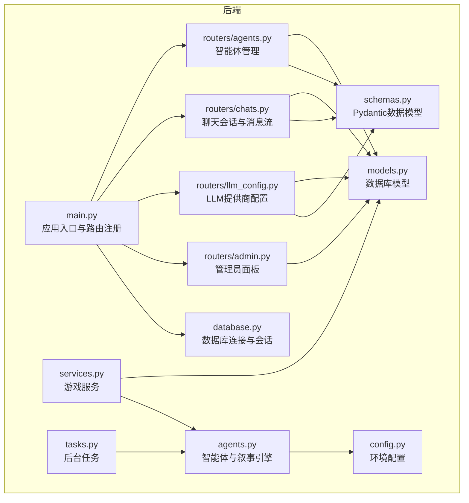
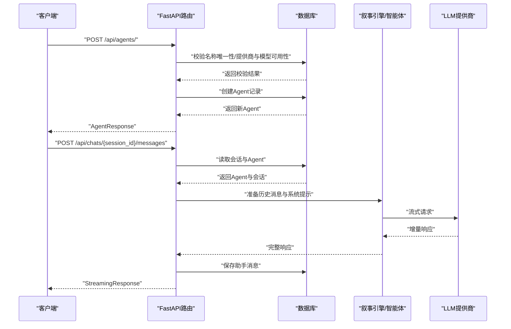
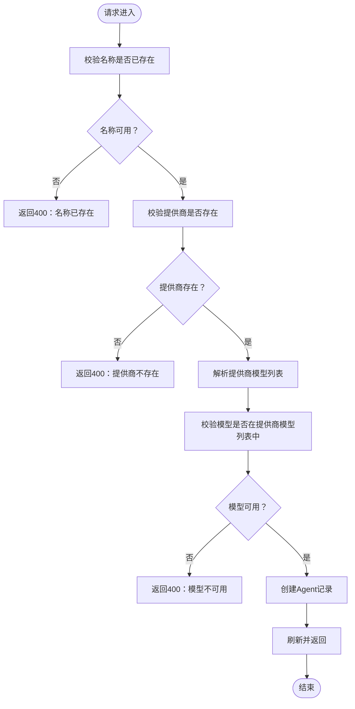
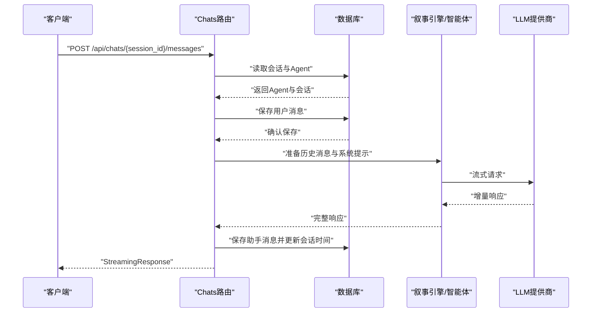
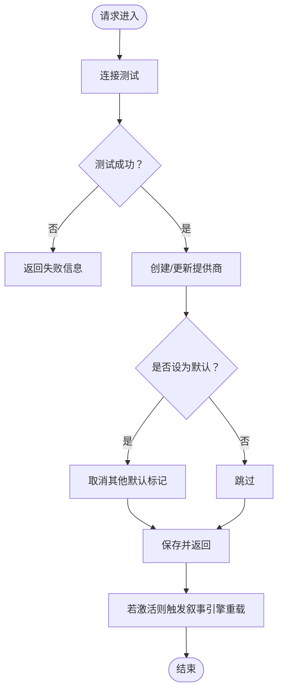
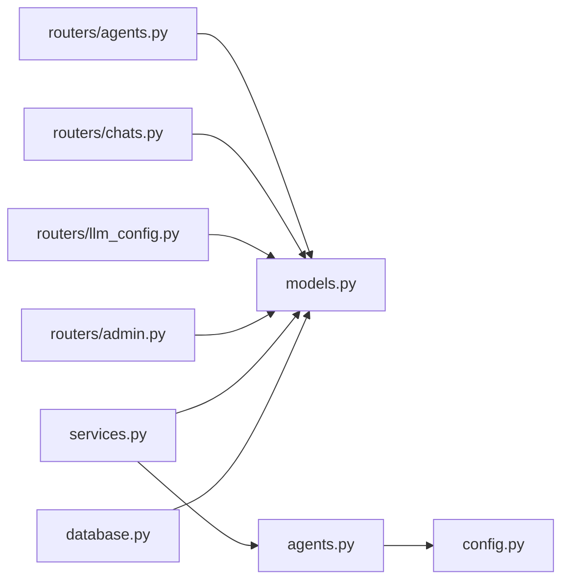

# 智能体API

<cite>
**本文引用的文件**
- [backend/main.py](file://backend/main.py)
- [backend/routers/agents.py](file://backend/routers/agents.py)
- [backend/routers/chats.py](file://backend/routers/chats.py)
- [backend/routers/llm_config.py](file://backend/routers/llm_config.py)
- [backend/routers/admin.py](file://backend/routers/admin.py)
- [backend/models.py](file://backend/models.py)
- [backend/schemas.py](file://backend/schemas.py)
- [backend/database.py](file://backend/database.py)
- [backend/agents.py](file://backend/agents.py)
- [backend/services.py](file://backend/services.py)
- [backend/config.py](file://backend/config.py)
- [backend/tasks.py](file://backend/tasks.py)
- [README.md](file://README.md)
</cite>

## 目录
1. [简介](#简介)
2. [项目结构](#项目结构)
3. [核心组件](#核心组件)
4. [架构总览](#架构总览)
5. [详细组件分析](#详细组件分析)
6. [依赖关系分析](#依赖关系分析)
7. [性能考虑](#性能考虑)
8. [故障排查指南](#故障排查指南)
9. [结论](#结论)
10. [附录](#附录)

## 简介
本文件为“无限剧情游戏”后端的智能体API文档，聚焦于多智能体系统的管理接口，覆盖智能体的创建、配置、启动、停止与监控；同时记录智能体间通信接口、任务分配与协调机制；并提供智能体配置参数的详细说明，包括角色定义、行为模式、交互规则等。文档还包含部署与扩展指导，以及实际API调用示例与响应数据格式说明。

## 项目结构
后端采用FastAPI + SQLAlchemy异步ORM + AgentScope多智能体框架，主要模块如下：
- 路由层：agents（智能体）、chats（聊天会话与消息）、llm_config（LLM提供商配置）、admin（管理员面板）
- 业务层：services（游戏服务）
- 模型层：models（数据库模型）
- 配置层：config（环境配置）
- 代理层：agents（智能体与叙事引擎）

图表来源
- [backend/main.py](file://backend/main.py#L94-L97)
- [backend/routers/agents.py](file://backend/routers/agents.py#L9-L13)
- [backend/routers/chats.py](file://backend/routers/chats.py#L16-L20)
- [backend/routers/llm_config.py](file://backend/routers/llm_config.py#L14-L18)
- [backend/routers/admin.py](file://backend/routers/admin.py#L10-L14)
- [backend/models.py](file://backend/models.py#L1-L122)
- [backend/schemas.py](file://backend/schemas.py#L1-L102)
- [backend/database.py](file://backend/database.py#L1-L31)
- [backend/agents.py](file://backend/agents.py#L1-L196)
- [backend/services.py](file://backend/services.py#L1-L66)
- [backend/config.py](file://backend/config.py#L1-L34)
- [backend/tasks.py](file://backend/tasks.py#L1-L62)

章节来源
- [backend/main.py](file://backend/main.py#L94-L97)
- [README.md](file://README.md#L34-L51)

## 核心组件
- 智能体管理（agents）：提供智能体的增删改查、名称唯一性校验、提供商与模型可用性校验。
- 聊天会话与消息（chats）：支持创建会话、列出会话、按会话读取消息、发送消息并流式返回响应，同时保存助手回复。
- LLM提供商配置（llm_config）：提供提供商的增删改查、默认提供商切换、连接测试、动态加载到叙事引擎。
- 管理员面板（admin）：提供统计、玩家列表、删除玩家、故事列表等管理接口。
- 数据模型（models）：定义Player、StoryChapter、Asset、LLMProvider、ChatSession、ChatMessage、Agent等。
- 数据验证（schemas）：定义LLMProvider与Agent的创建、更新、响应模型。
- 数据库连接（database）：异步引擎与会话工厂。
- 智能体与叙事引擎（agents）：定义对话智能体与叙事引擎，负责加载配置、生成章节、管理角色。
- 游戏服务（services）：封装玩家创建、世界初始化、选择处理等业务逻辑。
- 环境配置（config）：数据库URL、Redis、API Key、模型名称等。
- 后台任务（tasks）：预生成下一章、触发资产生成等。

章节来源
- [backend/routers/agents.py](file://backend/routers/agents.py#L15-L141)
- [backend/routers/chats.py](file://backend/routers/chats.py#L22-L275)
- [backend/routers/llm_config.py](file://backend/routers/llm_config.py#L20-L203)
- [backend/routers/admin.py](file://backend/routers/admin.py#L16-L112)
- [backend/models.py](file://backend/models.py#L9-L122)
- [backend/schemas.py](file://backend/schemas.py#L4-L102)
- [backend/database.py](file://backend/database.py#L1-L31)
- [backend/agents.py](file://backend/agents.py#L43-L196)
- [backend/services.py](file://backend/services.py#L8-L66)
- [backend/config.py](file://backend/config.py#L7-L34)
- [backend/tasks.py](file://backend/tasks.py#L7-L62)

## 架构总览
后端通过FastAPI提供REST接口，使用SQLAlchemy异步ORM访问数据库；AgentScope作为多智能体编排框架，驱动叙事引擎完成世界构建与章节生成；聊天接口支持OpenAI/DashScope等提供商的流式响应；管理员接口用于系统监控与配置管理。

图表来源
- [backend/routers/agents.py](file://backend/routers/agents.py#L15-L55)
- [backend/routers/chats.py](file://backend/routers/chats.py#L72-L258)
- [backend/agents.py](file://backend/agents.py#L43-L196)

## 详细组件分析

### 智能体管理接口（/api/agents）
- 路径前缀：/api/agents
- 功能：智能体的创建、列表、详情、更新、删除
- 关键校验：
  - 名称唯一性
  - 提供商存在性
  - 模型必须在提供商模型列表中（兼容JSON字符串或数组）
- 更新策略：
  - 更改名称时再次校验唯一性
  - 更改提供商或模型时重新校验可用性
- 响应模型：AgentResponse

图表来源
- [backend/routers/agents.py](file://backend/routers/agents.py#L17-L55)

章节来源
- [backend/routers/agents.py](file://backend/routers/agents.py#L15-L141)
- [backend/schemas.py](file://backend/schemas.py#L43-L74)
- [backend/models.py](file://backend/models.py#L100-L122)

### 聊天会话与消息接口（/api/chats）
- 路径前缀：/api/chats
- 功能：创建会话、列出会话、读取会话、读取消息、发送消息并流式返回
- 流式响应：
  - 支持OpenAI/Azure与DashScope的增量输出
  - 记录输入/输出字符数与Token使用情况
- 保存策略：
  - 用户消息即时保存
  - 助手消息在生成完成后保存，并更新会话时间戳
- 关键校验：
  - 会话与Agent存在性
  - Agent提供商处于激活状态

图表来源
- [backend/routers/chats.py](file://backend/routers/chats.py#L72-L258)
- [backend/agents.py](file://backend/agents.py#L43-L196)

章节来源
- [backend/routers/chats.py](file://backend/routers/chats.py#L22-L275)
- [backend/models.py](file://backend/models.py#L80-L99)
- [backend/schemas.py](file://backend/schemas.py#L75-L102)

### LLM提供商配置接口（/api/admin/llm-providers）
- 路径前缀：/api/admin/llm-providers
- 功能：提供商的创建、列表、详情、更新、删除；连接测试；默认提供商切换
- 连接测试：
  - 支持OpenAI、Azure、DashScope、Anthropic、Gemini
  - 使用AgentScope模型实例进行简单对话测试
- 默认提供商：
  - 设置为默认时，自动将其他提供商的默认标记置为False
- 动态加载：
  - 当提供商处于激活状态时，触发叙事引擎重新加载配置

图表来源
- [backend/routers/llm_config.py](file://backend/routers/llm_config.py#L20-L138)
- [backend/agents.py](file://backend/agents.py#L49-L153)

章节来源
- [backend/routers/llm_config.py](file://backend/routers/llm_config.py#L112-L203)
- [backend/schemas.py](file://backend/schemas.py#L4-L34)
- [backend/models.py](file://backend/models.py#L58-L79)

### 管理员面板接口（/api/admin）
- 路径前缀：/api/admin
- 功能：系统统计、玩家列表、删除玩家、故事列表
- 统计字段：玩家数、故事数、资产数、提供商数
- 列表分页：支持skip/limit参数

章节来源
- [backend/routers/admin.py](file://backend/routers/admin.py#L16-L112)

### 数据模型与配置
- 数据模型（部分关键字段）：
  - Agent：id、name、description、provider_id、model、temperature、context_window、system_prompt、tools、thinking_mode
  - LLMProvider：id、name、provider_type、api_key、base_url、models、tags、is_active、is_default、config_json
  - ChatSession：id、title、agent_id
  - ChatMessage：id、session_id、role、content
- 配置项：
  - 数据库URL（SQLite/PostgreSQL）
  - Redis URL
  - 各类API Key
  - 故事/图像生成模型名称

章节来源
- [backend/models.py](file://backend/models.py#L58-L122)
- [backend/config.py](file://backend/config.py#L7-L34)

## 依赖关系分析
- 路由依赖：各路由模块依赖数据库会话工厂与模型/Schema定义
- 业务依赖：GameService依赖AgentScope叙事引擎与数据库
- 智能体依赖：NarrativeEngine依赖LLMProvider配置与AgentScope模型
- 配置依赖：数据库引擎依赖环境配置

图表来源
- [backend/routers/agents.py](file://backend/routers/agents.py#L1-L8)
- [backend/routers/chats.py](file://backend/routers/chats.py#L1-L12)
- [backend/routers/llm_config.py](file://backend/routers/llm_config.py#L1-L8)
- [backend/routers/admin.py](file://backend/routers/admin.py#L1-L8)
- [backend/services.py](file://backend/services.py#L1-L6)
- [backend/agents.py](file://backend/agents.py#L1-L8)
- [backend/database.py](file://backend/database.py#L1-L31)

章节来源
- [backend/database.py](file://backend/database.py#L1-L31)
- [backend/agents.py](file://backend/agents.py#L1-L196)

## 性能考虑
- 异步I/O：数据库操作与LLM调用均采用异步，提升并发能力
- 连接池：SQLAlchemy异步连接池配置，减少连接开销
- 流式响应：聊天接口支持增量输出，降低首字节延迟
- 缓存与预生成：后台任务预生成下一章，减少实时计算压力
- 日志级别：关闭SQLAlchemy与Uvicorn访问日志，降低IO开销

章节来源
- [backend/database.py](file://backend/database.py#L8-L23)
- [backend/routers/chats.py](file://backend/routers/chats.py#L144-L209)
- [backend/tasks.py](file://backend/tasks.py#L7-L62)
- [backend/main.py](file://backend/main.py#L13-L28)

## 故障排查指南
- 数据库连接失败：启动时自动重试并执行迁移，检查环境变量与数据库可达性
- LLM提供商不可用：确认提供商处于激活状态且模型在可用列表中
- 智能体创建失败：检查名称唯一性、提供商存在性与模型可用性
- 聊天流式响应异常：检查提供商类型与API Key配置，查看日志中的Token统计
- 叙事引擎未初始化：确保至少有一个激活的提供商，或在启动时从数据库加载配置

章节来源
- [backend/main.py](file://backend/main.py#L45-L81)
- [backend/routers/llm_config.py](file://backend/routers/llm_config.py#L133-L137)
- [backend/routers/agents.py](file://backend/routers/agents.py#L17-L55)
- [backend/routers/chats.py](file://backend/routers/chats.py#L109-L111)

## 结论
该智能体API围绕AgentScope多智能体框架与FastAPI实现了完整的智能体生命周期管理与聊天交互能力，支持动态LLM提供商配置与流式响应，具备良好的扩展性与运维友好性。通过完善的校验与日志体系，能够稳定支撑无限剧情游戏的动态叙事需求。

## 附录

### API端点一览
- 智能体管理
  - POST /api/agents/：创建智能体
  - GET /api/agents/：分页列出智能体
  - GET /api/agents/{agent_id}：获取智能体详情
  - PUT /api/agents/{agent_id}：更新智能体
  - DELETE /api/agents/{agent_id}：删除智能体
- 聊天会话与消息
  - POST /api/chats/：创建会话
  - GET /api/chats/：分页列出会话
  - GET /api/chats/{session_id}：获取会话详情
  - GET /api/chats/{session_id}/messages：获取会话消息
  - POST /api/chats/{session_id}/messages：发送消息并流式返回
  - DELETE /api/chats/{session_id}：删除会话
- LLM提供商配置
  - POST /api/admin/llm-providers/test-connection：测试连接
  - POST /api/admin/llm-providers/：创建提供商
  - GET /api/admin/llm-providers/：分页列出提供商
  - GET /api/admin/llm-providers/{provider_id}：获取提供商详情
  - PUT /api/admin/llm-providers/{provider_id}：更新提供商
  - DELETE /api/admin/llm-providers/{provider_id}：删除提供商
- 管理员面板
  - GET /api/admin/stats：系统统计
  - GET /api/admin/players：分页列出玩家
  - DELETE /api/admin/players/{player_id}：删除玩家
  - GET /api/admin/stories：分页列出故事

章节来源
- [backend/routers/agents.py](file://backend/routers/agents.py#L15-L141)
- [backend/routers/chats.py](file://backend/routers/chats.py#L22-L275)
- [backend/routers/llm_config.py](file://backend/routers/llm_config.py#L20-L203)
- [backend/routers/admin.py](file://backend/routers/admin.py#L16-L112)

### 智能体配置参数说明
- 角色定义
  - 导演（Director）：负责剧情大纲与一致性把控
  - 编剧（Narrator）：根据大纲生成沉浸式文本
  - NPC管理（NPC_Manager）：维护NPC关系与反应
- 行为模式
  - temperature：采样温度，范围0.0~1.0
  - context_window：上下文窗口大小，范围4096~256000
  - thinking_mode：思考模式开关
  - tools：启用工具列表
  - system_prompt：系统提示词
- 交互规则
  - 消息角色：user、assistant、system
  - 历史消息按时间顺序拼接
  - 流式响应支持增量输出与Token统计

章节来源
- [backend/schemas.py](file://backend/schemas.py#L43-L74)
- [backend/models.py](file://backend/models.py#L100-L122)
- [backend/agents.py](file://backend/agents.py#L131-L148)

### 部署与扩展指导
- 环境准备：Python 3.10+、PostgreSQL/SQLite、Redis
- 启动步骤：安装依赖、配置.env、启动后端服务
- 扩展建议：
  - 新增LLM提供商：在llm_config中添加对应分支并接入AgentScope模型
  - 新增智能体角色：在agents.py中扩展NarrativeEngine的角色列表
  - 聊天扩展：在chats路由中增加新的消息处理逻辑
  - 监控与告警：结合日志与统计接口完善运维体系

章节来源
- [README.md](file://README.md#L53-L127)
- [backend/routers/llm_config.py](file://backend/routers/llm_config.py#L32-L87)
- [backend/agents.py](file://backend/agents.py#L131-L148)