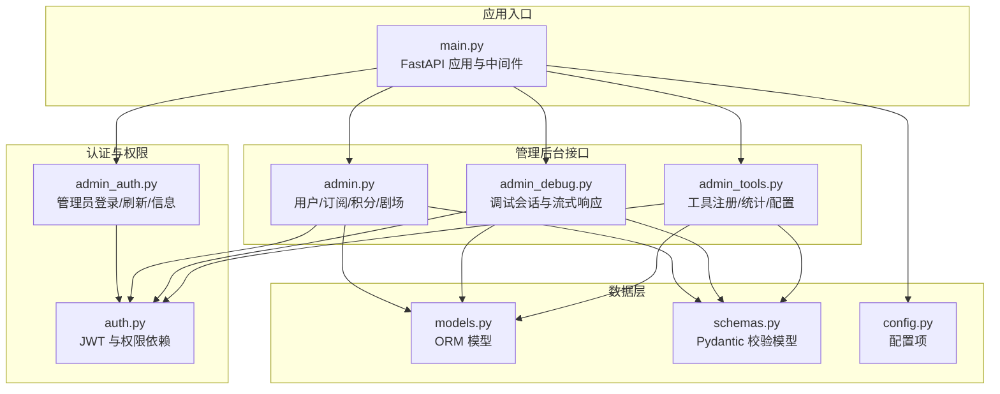
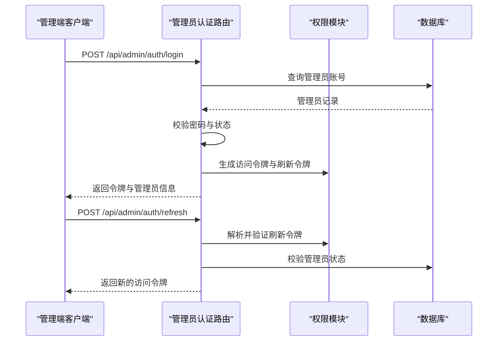
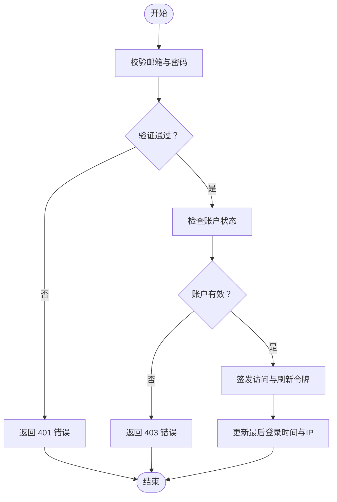
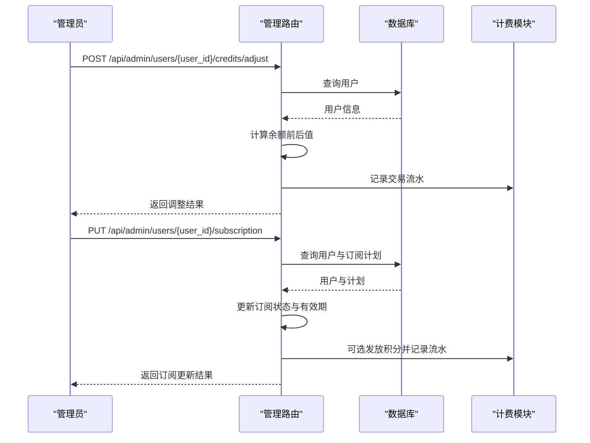
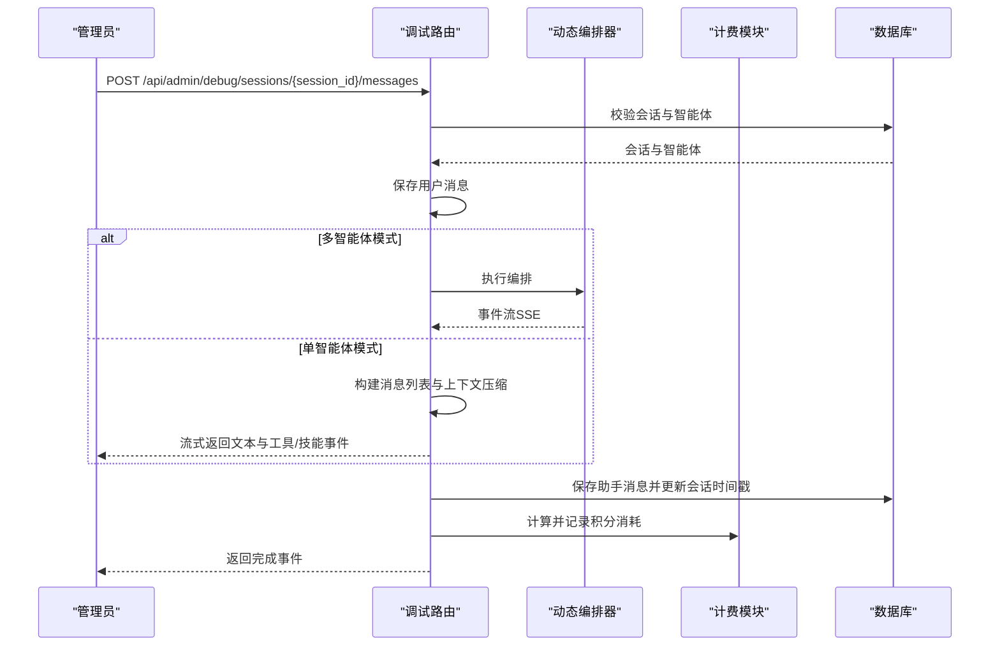
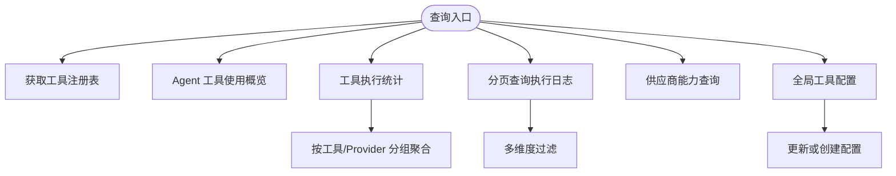
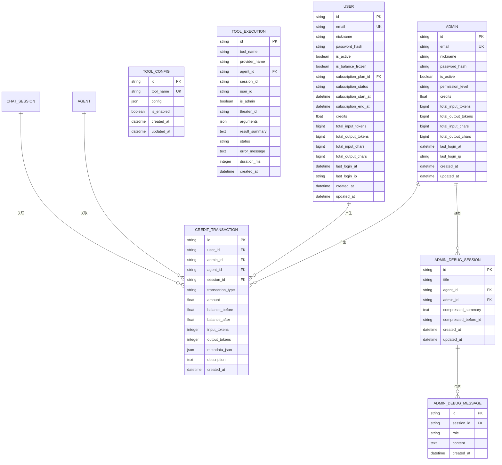
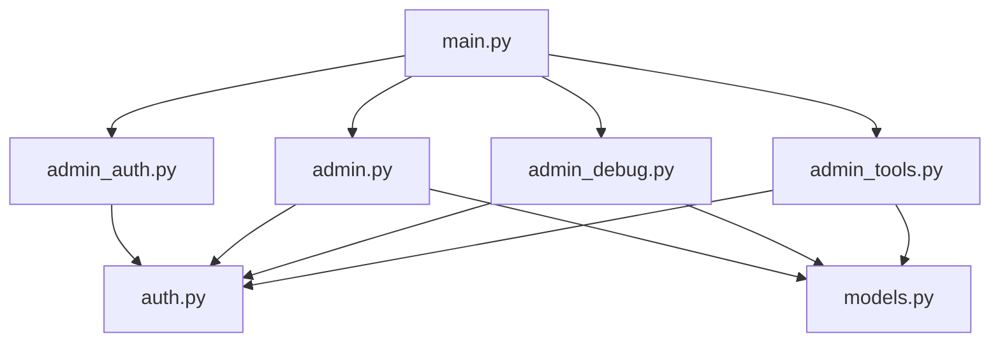

# 管理后台接口

<cite>
**本文档引用的文件**
- [main.py](file://backend/main.py)
- [admin.py](file://backend/routers/admin.py)
- [admin_auth.py](file://backend/routers/admin_auth.py)
- [admin_debug.py](file://backend/routers/admin_debug.py)
- [admin_tools.py](file://backend/routers/admin_tools.py)
- [auth.py](file://backend/auth.py)
- [models.py](file://backend/models.py)
- [schemas.py](file://backend/schemas.py)
- [config.py](file://backend/config.py)
</cite>

## 目录
1. [简介](#简介)
2. [项目结构](#项目结构)
3. [核心组件](#核心组件)
4. [架构总览](#架构总览)
5. [详细组件分析](#详细组件分析)
6. [依赖分析](#依赖分析)
7. [性能考虑](#性能考虑)
8. [故障排除指南](#故障排除指南)
9. [结论](#结论)

## 简介
本文件为 KunFlix 管理后台系统的完整 API 文档，涵盖管理员登录、权限验证、操作审计、用户管理、内容审核、系统监控、配置管理、调试接口、性能监控、日志查询、批量操作、数据统计与报表导出等功能。文档同时解释管理权限分级、操作日志与安全防护措施，帮助开发者与运维人员快速理解并正确使用管理后台接口。

## 项目结构
管理后台基于 FastAPI 构建，采用模块化路由组织方式，将不同功能域拆分为独立的路由器模块，并通过主应用入口集中注册。核心模块包括：
- 管理员认证与权限：admin_auth.py、auth.py
- 管理员通用接口：admin.py（用户、订阅、积分、剧场等）
- 调试会话：admin_debug.py
- 工具管理与统计：admin_tools.py
- 数据模型与校验：models.py、schemas.py
- 应用启动与中间件：main.py、config.py

**图表来源**
- [main.py:110-153](file://backend/main.py#L110-L153)
- [admin_auth.py:29-90](file://backend/routers/admin_auth.py#L29-L90)
- [admin.py:19-47](file://backend/routers/admin.py#L19-L47)
- [admin_debug.py:43-70](file://backend/routers/admin_debug.py#L43-L70)
- [admin_tools.py:18-35](file://backend/routers/admin_tools.py#L18-L35)

**章节来源**
- [main.py:110-153](file://backend/main.py#L110-L153)
- [admin_auth.py:29-90](file://backend/routers/admin_auth.py#L29-L90)
- [admin.py:19-47](file://backend/routers/admin.py#L19-L47)
- [admin_debug.py:43-70](file://backend/routers/admin_debug.py#L43-L70)
- [admin_tools.py:18-35](file://backend/routers/admin_tools.py#L18-L35)

## 核心组件
- FastAPI 应用与生命周期：负责数据库连接重试、迁移、Narrative 引擎初始化、静态文件与 CORS 配置。
- 管理员认证与权限：独立的 admins 表，支持管理员登录、刷新令牌、当前管理员信息查询；提供 require_admin 依赖实现权限拦截。
- 管理员通用接口：提供仪表盘统计、用户管理、订阅管理、积分调整与历史、管理员自身积分管理、剧场列表等。
- 调试会话：管理员专用的调试会话与消息管理，支持单智能体与多智能体模式，提供 SSE 流式响应。
- 工具管理：工具注册表、Agent 工具使用概览、工具执行统计、执行日志查询、图像/视频供应商能力、全局工具配置管理。
- 数据模型与校验：Admin、User、ChatSession、CreditTransaction、ToolExecution、ToolConfig 等模型与 Pydantic 校验模型。
- 配置：JWT 密钥、算法、过期时间、数据库与 Redis 连接、AI 模型默认值等。

**章节来源**
- [main.py:49-108](file://backend/main.py#L49-L108)
- [auth.py:119-156](file://backend/auth.py#L119-L156)
- [models.py:10-32](file://backend/models.py#L10-L32)
- [schemas.py:68-111](file://backend/schemas.py#L68-L111)
- [config.py:7-42](file://backend/config.py#L7-L42)

## 架构总览
管理后台采用“独立管理员表 + JWT”的权限体系，所有管理端接口均通过 require_admin 依赖进行鉴权。应用启动时自动执行数据库迁移与叙事引擎初始化，确保服务可用性。调试会话与普通用户会话完全隔离，避免数据交叉污染。

**图表来源**
- [admin_auth.py:36-90](file://backend/routers/admin_auth.py#L36-L90)
- [auth.py:30-74](file://backend/auth.py#L30-L74)

**章节来源**
- [admin_auth.py:36-136](file://backend/routers/admin_auth.py#L36-L136)
- [auth.py:119-156](file://backend/auth.py#L119-L156)

## 详细组件分析

### 管理员认证与权限
- 登录接口：校验邮箱与密码，更新最后登录时间与 IP，签发访问与刷新令牌。
- 刷新接口：验证刷新令牌类型与主体类型，重新签发访问令牌。
- 当前管理员信息：获取当前登录管理员信息。
- 权限依赖：require_admin 实现管理员权限拦截，get_current_active_admin 确保账户有效。

**图表来源**
- [admin_auth.py:36-90](file://backend/routers/admin_auth.py#L36-L90)
- [auth.py:119-156](file://backend/auth.py#L119-L156)

**章节来源**
- [admin_auth.py:36-136](file://backend/routers/admin_auth.py#L36-L136)
- [auth.py:119-156](file://backend/auth.py#L119-L156)

### 管理员通用接口（用户、订阅、积分、剧场）
- 仪表盘统计：返回用户、剧场、资产、LLM 提供商、管理员数量。
- 用户管理：分页列出用户基础信息，按 ID 查询详情，删除用户及关联数据。
- 积分管理：管理员手动调整用户积分，记录交易流水；查询用户积分历史。
- 订阅管理：为用户分配订阅计划，自动发放积分；取消用户订阅。
- 管理员管理：分页列出管理员，创建/更新/删除管理员，查询管理员详情。
- 管理员自身积分：管理员可调整其他管理员积分，记录交易流水。
- 剧场管理：分页列出剧场，支持按用户过滤。

**图表来源**
- [admin.py:141-280](file://backend/routers/admin.py#L141-L280)

**章节来源**
- [admin.py:29-47](file://backend/routers/admin.py#L29-L47)
- [admin.py:53-136](file://backend/routers/admin.py#L53-L136)
- [admin.py:141-280](file://backend/routers/admin.py#L141-L280)
- [admin.py:307-416](file://backend/routers/admin.py#L307-L416)
- [admin.py:470-501](file://backend/routers/admin.py#L470-L501)

### 调试会话接口（管理员专用）
- 创建调试会话：绑定管理员与智能体，生成会话。
- 列出调试会话：按管理员与可选智能体过滤，支持分页。
- 获取会话详情：按 ID 与管理员身份验证。
- 获取会话消息：反序列化多模态内容，返回文本与工具/技能调用信息。
- 发送调试消息：单智能体与多智能体两种模式，流式返回 SSE 事件，保存最终助手消息并更新统计与计费。
- 删除调试会话：级联删除消息与会话。

**图表来源**
- [admin_debug.py:156-276](file://backend/routers/admin_debug.py#L156-L276)
- [admin_debug.py:278-571](file://backend/routers/admin_debug.py#L278-L571)

**章节来源**
- [admin_debug.py:50-92](file://backend/routers/admin_debug.py#L50-L92)
- [admin_debug.py:111-154](file://backend/routers/admin_debug.py#L111-L154)
- [admin_debug.py:156-276](file://backend/routers/admin_debug.py#L156-L276)
- [admin_debug.py:278-571](file://backend/routers/admin_debug.py#L278-L571)
- [admin_debug.py:573-594](file://backend/routers/admin_debug.py#L573-L594)

### 工具管理与统计接口
- 工具注册表：返回系统中所有注册的工具 Provider 及其工具元信息。
- Agent 工具使用：返回每个 Agent 的工具配置概览（技能、画布节点类型、图像/视频生成开关）。
- 工具统计：总执行次数、错误数、平均耗时、按工具与 Provider 分组统计。
- 执行日志：分页查询工具执行记录，支持多维度过滤（工具名、Provider、状态、Agent ID）。
- 供应商能力：图像与视频模型的能力描述（参数选项与限制）。
- 工具配置：获取/更新全局工具配置（如图像生成开关、参数限制等）。

**图表来源**
- [admin_tools.py:29-35](file://backend/routers/admin_tools.py#L29-L35)
- [admin_tools.py:42-67](file://backend/routers/admin_tools.py#L42-L67)
- [admin_tools.py:74-128](file://backend/routers/admin_tools.py#L74-L128)
- [admin_tools.py:135-187](file://backend/routers/admin_tools.py#L135-L187)
- [admin_tools.py:194-211](file://backend/routers/admin_tools.py#L194-L211)
- [admin_tools.py:218-272](file://backend/routers/admin_tools.py#L218-L272)

**章节来源**
- [admin_tools.py:29-35](file://backend/routers/admin_tools.py#L29-L35)
- [admin_tools.py:42-67](file://backend/routers/admin_tools.py#L42-L67)
- [admin_tools.py:74-128](file://backend/routers/admin_tools.py#L74-L128)
- [admin_tools.py:135-187](file://backend/routers/admin_tools.py#L135-L187)
- [admin_tools.py:194-211](file://backend/routers/admin_tools.py#L194-L211)
- [admin_tools.py:218-272](file://backend/routers/admin_tools.py#L218-L272)

### 数据模型与校验
- 管理员模型：包含邮箱、昵称、密码哈希、权限等级、积分余额、登录统计等。
- 用户模型：包含订阅状态、积分余额、登录统计、资金冻结状态等。
- 会话与消息：ChatSession、ChatMessage，支持上下文压缩与摘要。
- 积分交易：CreditTransaction，支持用户与管理员维度的交易记录。
- 工具与执行：ToolConfig、ToolExecution，记录工具调用详情与统计。
- 调试会话：AdminDebugSession、AdminDebugMessage，与普通会话隔离。

**图表来源**
- [models.py:10-32](file://backend/models.py#L10-L32)
- [models.py:281-301](file://backend/models.py#L281-L301)
- [models.py:473-482](file://backend/models.py#L473-L482)
- [models.py:485-503](file://backend/models.py#L485-L503)
- [models.py:444-471](file://backend/models.py#L444-L471)

**章节来源**
- [models.py:10-32](file://backend/models.py#L10-L32)
- [models.py:281-301](file://backend/models.py#L281-L301)
- [models.py:473-482](file://backend/models.py#L473-L482)
- [models.py:485-503](file://backend/models.py#L485-L503)
- [models.py:444-471](file://backend/models.py#L444-L471)

### 配置与安全
- JWT 配置：密钥、算法、访问令牌过期时间、刷新令牌过期天数。
- 数据库与 Redis：SQLite/PostgreSQL 选择、Redis 连接。
- AI 模型默认值：故事生成、图像生成模型。
- 安全中间件：CORS 允许本地开发环境访问；调试中间件记录授权头与来源信息。
- 权限分级：管理员表独立，权限等级包含 admin 与 super_admin；删除管理员时禁止自我删除。

**章节来源**
- [config.py:7-42](file://backend/config.py#L7-L42)
- [main.py:130-136](file://backend/main.py#L130-L136)
- [main.py:119-128](file://backend/main.py#L119-L128)
- [admin.py:396-415](file://backend/routers/admin.py#L396-L415)

## 依赖分析
- 组件耦合：各路由器模块通过依赖注入获取数据库会话与权限依赖，保持低耦合高内聚。
- 外部依赖：SQLAlchemy 异步 ORM、FastAPI、bcrypt、JWTPy、Alembic 迁移。
- 循环依赖：权限模块延迟导入模型以避免循环导入。

**图表来源**
- [admin_auth.py:18-24](file://backend/routers/admin_auth.py#L18-L24)
- [auth.py:83-106](file://backend/auth.py#L83-L106)
- [admin.py:8-9](file://backend/routers/admin.py#L8-L9)
- [admin_debug.py:16-20](file://backend/routers/admin_debug.py#L16-L20)
- [admin_tools.py:10-16](file://backend/routers/admin_tools.py#L10-L16)

**章节来源**
- [admin_auth.py:18-24](file://backend/routers/admin_auth.py#L18-L24)
- [auth.py:83-106](file://backend/auth.py#L83-L106)
- [admin.py:8-9](file://backend/routers/admin.py#L8-L9)
- [admin_debug.py:16-20](file://backend/routers/admin_debug.py#L16-L20)
- [admin_tools.py:10-16](file://backend/routers/admin_tools.py#L10-L16)

## 性能考虑
- 数据库连接重试与迁移：应用启动时自动尝试连接与迁移，失败时重试并清理残留临时表，提升启动稳定性。
- 上下文压缩：调试会话支持上下文压缩，减少历史消息长度，降低 Token 使用与延迟。
- 流式响应：调试消息采用 SSE 流式返回，提升交互体验与实时性。
- 分页查询：用户、订阅、积分历史、工具执行日志均支持分页与过滤，避免一次性加载大量数据。
- 缓存与会话：Redis 作为缓存与会话存储，建议在生产环境启用并合理配置。

[本节为通用指导，无需具体文件分析]

## 故障排除指南
- 登录失败：检查邮箱是否存在、密码是否正确、账户是否被禁用；查看日志中的登录尝试与失败原因。
- 刷新令牌无效：确认令牌类型为 refresh 且主体类型为 admin；检查管理员是否存在且状态有效。
- 权限不足：确保调用接口使用管理员访问令牌；避免自我删除管理员账户。
- 调试会话异常：确认会话与智能体存在；检查 Provider 是否激活；查看工具调用错误与耗时统计。
- 数据库迁移失败：查看启动日志中的迁移错误与残留临时表清理过程；必要时手动清理后重试。

**章节来源**
- [admin_auth.py:50-71](file://backend/routers/admin_auth.py#L50-L71)
- [admin_auth.py:106-120](file://backend/routers/admin_auth.py#L106-L120)
- [admin.py:396-415](file://backend/routers/admin.py#L396-L415)
- [admin_debug.py:295-300](file://backend/routers/admin_debug.py#L295-L300)
- [main.py:60-86](file://backend/main.py#L60-L86)

## 结论
本管理后台接口文档覆盖了管理员登录、权限验证、用户与订阅管理、积分与计费、剧场管理、调试会话、工具管理与统计、全局配置等核心功能。通过独立管理员表与 JWT 机制实现强权限控制，配合调试会话隔离与上下文压缩等技术手段，保障系统安全性与性能。建议在生产环境中启用 Redis、强化安全配置，并定期审查工具与供应商能力配置，确保系统稳定运行与合规运营。