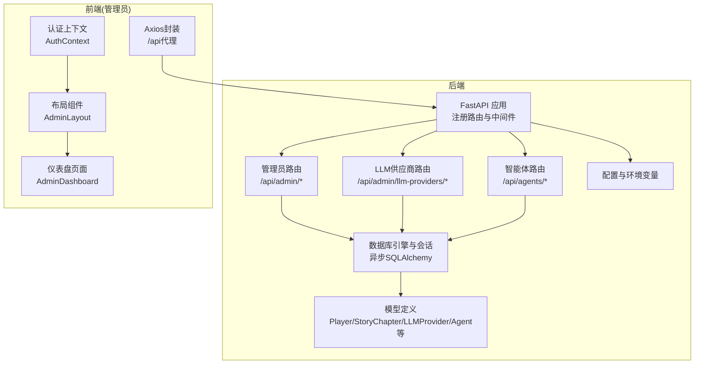
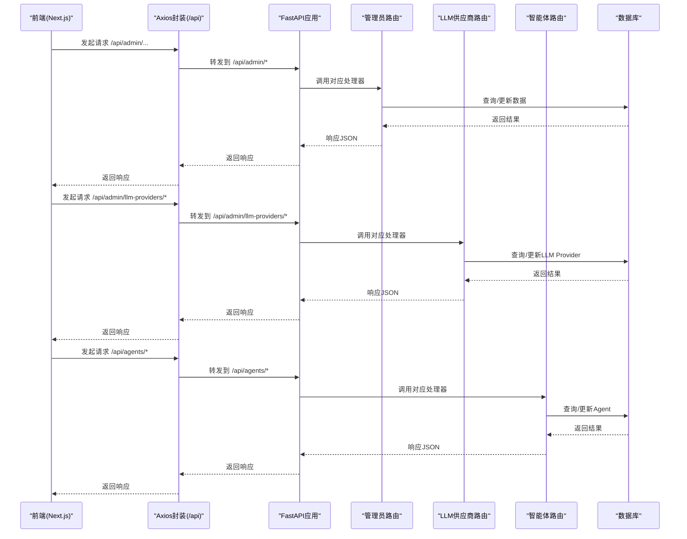
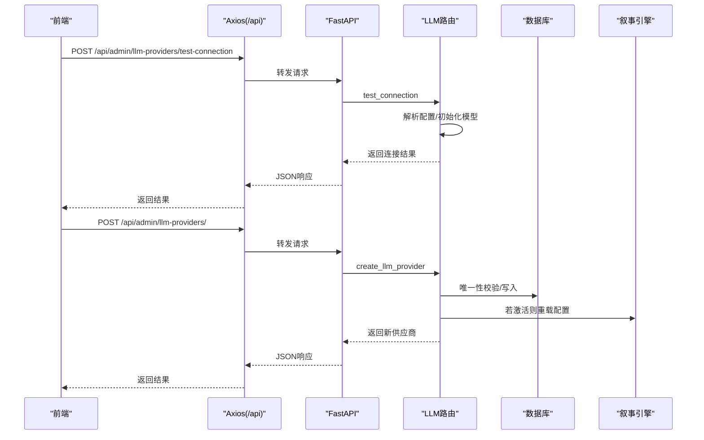
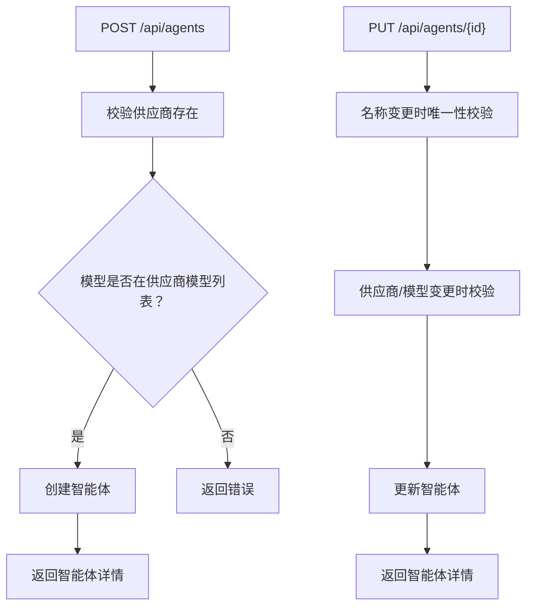
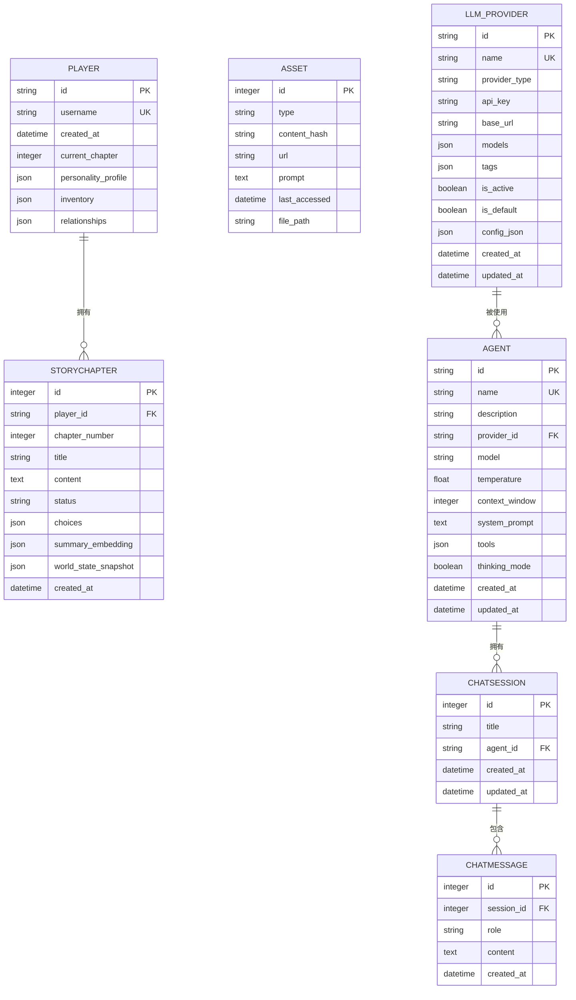
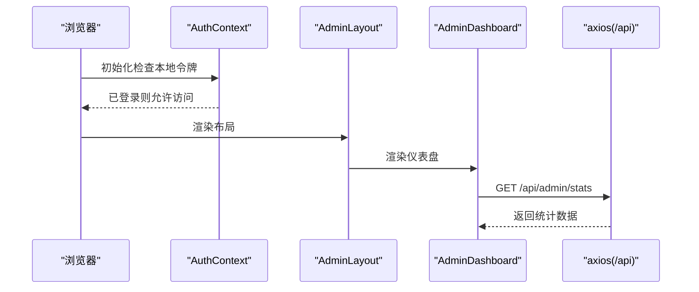
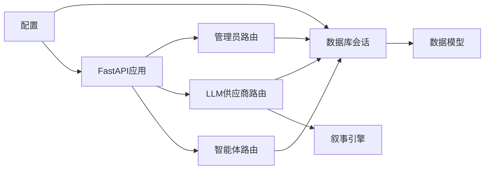

# 管理员API

<cite>
**本文引用的文件**
- [backend/main.py](file://backend/main.py)
- [backend/routers/admin.py](file://backend/routers/admin.py)
- [backend/routers/llm_config.py](file://backend/routers/llm_config.py)
- [backend/routers/agents.py](file://backend/routers/agents.py)
- [backend/models.py](file://backend/models.py)
- [backend/schemas.py](file://backend/schemas.py)
- [backend/database.py](file://backend/database.py)
- [backend/config.py](file://backend/config.py)
- [backend/admin/src/context/AuthContext.tsx](file://backend/admin/src/context/AuthContext.tsx)
- [backend/admin/src/components/admin/AdminLayout.tsx](file://backend/admin/src/components/admin/AdminLayout.tsx)
- [backend/admin/src/app/admin/page.tsx](file://backend/admin/src/app/admin/page.tsx)
- [backend/admin/src/lib/axios.ts](file://backend/admin/src/lib/axios.ts)
</cite>

## 目录
1. [简介](#简介)
2. [项目结构](#项目结构)
3. [核心组件](#核心组件)
4. [架构总览](#架构总览)
5. [详细组件分析](#详细组件分析)
6. [依赖关系分析](#依赖关系分析)
7. [性能考量](#性能考量)
8. [故障排查指南](#故障排查指南)
9. [结论](#结论)
10. [附录](#附录)

## 简介
本文件为后台管理系统相关的管理员API文档，覆盖用户管理、系统监控、配置管理等能力。文档详细说明管理员认证流程、权限控制机制与访问限制，并给出接口规范、请求参数校验、响应数据结构、错误码说明、最佳实践与安全注意事项，以及具体调用示例与响应格式。

## 项目结构
后端采用FastAPI + SQLAlchemy异步ORM，数据库通过Alembic迁移管理；管理员前端基于Next.js构建，使用本地存储令牌实现会话保持。



图表来源
- [backend/main.py](file://backend/main.py#L94-L97)
- [backend/routers/admin.py](file://backend/routers/admin.py#L10-L14)
- [backend/routers/llm_config.py](file://backend/routers/llm_config.py#L14-L18)
- [backend/routers/agents.py](file://backend/routers/agents.py#L1-L20)
- [backend/database.py](file://backend/database.py#L1-L31)
- [backend/models.py](file://backend/models.py#L9-L122)
- [backend/config.py](file://backend/config.py#L7-L34)
- [backend/admin/src/context/AuthContext.tsx](file://backend/admin/src/context/AuthContext.tsx#L1-L54)
- [backend/admin/src/components/admin/AdminLayout.tsx](file://backend/admin/src/components/admin/AdminLayout.tsx#L34-L156)
- [backend/admin/src/app/admin/page.tsx](file://backend/admin/src/app/admin/page.tsx#L1-L109)
- [backend/admin/src/lib/axios.ts](file://backend/admin/src/lib/axios.ts#L1-L19)

章节来源
- [backend/main.py](file://backend/main.py#L94-L97)
- [backend/routers/admin.py](file://backend/routers/admin.py#L10-L14)
- [backend/routers/llm_config.py](file://backend/routers/llm_config.py#L14-L18)
- [backend/routers/agents.py](file://backend/routers/agents.py#L1-L20)
- [backend/database.py](file://backend/database.py#L1-L31)
- [backend/models.py](file://backend/models.py#L9-L122)
- [backend/config.py](file://backend/config.py#L7-L34)
- [backend/admin/src/context/AuthContext.tsx](file://backend/admin/src/context/AuthContext.tsx#L1-L54)
- [backend/admin/src/components/admin/AdminLayout.tsx](file://backend/admin/src/components/admin/AdminLayout.tsx#L34-L156)
- [backend/admin/src/app/admin/page.tsx](file://backend/admin/src/app/admin/page.tsx#L1-L109)
- [backend/admin/src/lib/axios.ts](file://backend/admin/src/lib/axios.ts#L1-L19)

## 核心组件
- 管理员路由模块：提供统计、玩家列表、删除玩家、故事列表等接口。
- LLM供应商路由模块：提供LLM供应商的增删改查、连接测试、默认供应商切换等。
- 智能体路由模块：提供智能体的增删改查、模型可用性校验等。
- 数据模型：Player、StoryChapter、LLMProvider、Agent、ChatSession、ChatMessage等。
- 前端认证与布局：基于本地存储令牌的认证上下文、侧边栏导航与仪表盘页面。
- 数据库与配置：异步引擎、会话工厂、SQLite/PostgreSQL配置、Redis等。

章节来源
- [backend/routers/admin.py](file://backend/routers/admin.py#L16-L112)
- [backend/routers/llm_config.py](file://backend/routers/llm_config.py#L112-L203)
- [backend/routers/agents.py](file://backend/routers/agents.py#L22-L140)
- [backend/models.py](file://backend/models.py#L9-L122)
- [backend/admin/src/context/AuthContext.tsx](file://backend/admin/src/context/AuthContext.tsx#L20-L54)
- [backend/admin/src/components/admin/AdminLayout.tsx](file://backend/admin/src/components/admin/AdminLayout.tsx#L44-L70)
- [backend/admin/src/app/admin/page.tsx](file://backend/admin/src/app/admin/page.tsx#L12-L23)
- [backend/admin/src/lib/axios.ts](file://backend/admin/src/lib/axios.ts#L3-L8)
- [backend/database.py](file://backend/database.py#L8-L31)
- [backend/config.py](file://backend/config.py#L15-L29)

## 架构总览
管理员API采用分层设计：路由层负责HTTP请求处理与参数校验，服务层负责业务逻辑，数据层负责数据库交互。前端通过Axios代理到后端的/api前缀，管理员页面在进入受保护路径时检查本地令牌。



图表来源
- [backend/admin/src/lib/axios.ts](file://backend/admin/src/lib/axios.ts#L3-L8)
- [backend/main.py](file://backend/main.py#L94-L97)
- [backend/routers/admin.py](file://backend/routers/admin.py#L10-L14)
- [backend/routers/llm_config.py](file://backend/routers/llm_config.py#L14-L18)
- [backend/routers/agents.py](file://backend/routers/agents.py#L1-L20)

## 详细组件分析

### 管理员路由模块
- 统计接口：获取玩家数、故事数、资产数、供应商数。
- 玩家列表：支持分页与排序，返回基础信息。
- 删除玩家：删除指定玩家及其关联数据。
- 故事列表：支持按玩家过滤与分页。

```mermaid
flowchart TD
Start(["请求进入 /api/admin"]) --> Route{"匹配子路由"}
Route --> |/stats| Stats["统计接口<br/>返回计数"]
Route --> |/players| Players["玩家列表<br/>分页+排序"]
Route --> |/players/{id}| Delete["删除玩家"]
Route --> |/stories| Stories["故事列表<br/>可按玩家过滤"]
Stats --> End(["响应JSON"])
Players --> End
Delete --> End
Stories --> End
```

图表来源
- [backend/routers/admin.py](file://backend/routers/admin.py#L16-L112)

章节来源
- [backend/routers/admin.py](file://backend/routers/admin.py#L16-L112)

### LLM供应商路由模块
- 连接测试：根据提供商类型动态初始化模型实例并发送测试消息。
- 创建供应商：名称唯一性校验，若设为默认则取消其他默认项。
- 读取列表/详情：分页查询与单条查询。
- 更新供应商：字段选择性更新，若设为默认则取消其他默认项。
- 删除供应商：存在性校验后删除。



图表来源
- [backend/routers/llm_config.py](file://backend/routers/llm_config.py#L20-L138)
- [backend/routers/llm_config.py](file://backend/routers/llm_config.py#L140-L203)

章节来源
- [backend/routers/llm_config.py](file://backend/routers/llm_config.py#L20-L203)

### 智能体路由模块
- 创建智能体：校验所属供应商存在性与模型可用性（从供应商模型列表中匹配）。
- 更新智能体：名称唯一性校验、供应商与模型变更校验。
- 删除智能体：存在性校验后删除。



图表来源
- [backend/routers/agents.py](file://backend/routers/agents.py#L22-L54)
- [backend/routers/agents.py](file://backend/routers/agents.py#L81-L140)

章节来源
- [backend/routers/agents.py](file://backend/routers/agents.py#L22-L140)

### 数据模型与关系


图表来源
- [backend/models.py](file://backend/models.py#L9-L122)

章节来源
- [backend/models.py](file://backend/models.py#L9-L122)

### 前端认证与访问控制
- 认证上下文：在本地存储中保存管理员令牌，未登录访问/admin路径将跳转至登录页。
- 布局组件：提供侧边栏导航与登出入口。
- 仪表盘页面：通过SWR拉取统计信息。
- Axios封装：统一设置基础URL为/api，便于代理到后端。



图表来源
- [backend/admin/src/context/AuthContext.tsx](file://backend/admin/src/context/AuthContext.tsx#L20-L54)
- [backend/admin/src/components/admin/AdminLayout.tsx](file://backend/admin/src/components/admin/AdminLayout.tsx#L44-L70)
- [backend/admin/src/app/admin/page.tsx](file://backend/admin/src/app/admin/page.tsx#L12-L23)
- [backend/admin/src/lib/axios.ts](file://backend/admin/src/lib/axios.ts#L3-L8)

章节来源
- [backend/admin/src/context/AuthContext.tsx](file://backend/admin/src/context/AuthContext.tsx#L20-L54)
- [backend/admin/src/components/admin/AdminLayout.tsx](file://backend/admin/src/components/admin/AdminLayout.tsx#L44-L70)
- [backend/admin/src/app/admin/page.tsx](file://backend/admin/src/app/admin/page.tsx#L12-L23)
- [backend/admin/src/lib/axios.ts](file://backend/admin/src/lib/axios.ts#L3-L8)

## 依赖关系分析
- 路由依赖：管理员路由依赖数据库会话；LLM供应商路由依赖数据库与叙事引擎；智能体路由依赖数据库与LLM供应商模型列表。
- 数据库依赖：所有路由均通过异步会话访问数据库；模型定义位于models.py。
- 配置依赖：数据库URL、Redis、AI密钥等通过配置类注入。



图表来源
- [backend/routers/admin.py](file://backend/routers/admin.py#L7-L8)
- [backend/routers/llm_config.py](file://backend/routers/llm_config.py#L6-L9)
- [backend/routers/agents.py](file://backend/routers/agents.py#L1-L4)
- [backend/database.py](file://backend/database.py#L28-L31)
- [backend/models.py](file://backend/models.py#L9-L122)
- [backend/config.py](file://backend/config.py#L15-L29)
- [backend/main.py](file://backend/main.py#L94-L97)

章节来源
- [backend/routers/admin.py](file://backend/routers/admin.py#L7-L8)
- [backend/routers/llm_config.py](file://backend/routers/llm_config.py#L6-L9)
- [backend/routers/agents.py](file://backend/routers/agents.py#L1-L4)
- [backend/database.py](file://backend/database.py#L28-L31)
- [backend/models.py](file://backend/models.py#L9-L122)
- [backend/config.py](file://backend/config.py#L15-L29)
- [backend/main.py](file://backend/main.py#L94-L97)

## 性能考量
- 异步I/O：使用异步SQLAlchemy与异步会话，避免阻塞。
- 连接池：配置连接池大小与预检，提升并发性能。
- 分页查询：列表接口支持skip/limit，避免一次性加载大量数据。
- 缓存与索引：模型中已为常用字段建立索引，建议在高频查询场景下进一步评估索引策略。
- 前端缓存：前端使用SWR进行轻量缓存，减少重复请求。

章节来源
- [backend/database.py](file://backend/database.py#L8-L23)
- [backend/routers/admin.py](file://backend/routers/admin.py#L33-L57)
- [backend/routers/admin.py](file://backend/routers/admin.py#L83-L111)

## 故障排查指南
- 数据库连接失败：启动时执行迁移与连接重试，检查DATABASE_URL与网络可达性。
- LLM连接测试失败：确认提供商类型、API密钥、基础URL与模型名称正确，查看异常堆栈。
- 供应商默认项冲突：创建或更新时若设为默认，需确保其他默认项被自动取消。
- 智能体模型不可用：确保所选模型存在于供应商的模型列表中。
- 前端无响应：检查Axios基础URL与CORS配置，确认后端已注册相应路由。

章节来源
- [backend/main.py](file://backend/main.py#L45-L81)
- [backend/routers/llm_config.py](file://backend/routers/llm_config.py#L117-L127)
- [backend/routers/llm_config.py](file://backend/routers/llm_config.py#L173-L177)
- [backend/routers/agents.py](file://backend/routers/agents.py#L41-L49)
- [backend/admin/src/lib/axios.ts](file://backend/admin/src/lib/axios.ts#L3-L8)

## 结论
管理员API围绕统计、用户与故事管理、LLM供应商与智能体配置提供了完整的REST接口，结合前端认证与布局，形成一套可扩展的后台管理方案。通过异步数据库访问、严格的参数校验与默认项一致性控制，保障了系统的稳定性与安全性。

## 附录

### 接口规范与示例

- 获取系统统计
  - 方法与路径：GET /api/admin/stats
  - 请求参数：无
  - 响应字段：
    - players: 玩家总数
    - stories: 故事总数
    - assets: 资产总数
    - providers: 供应商总数
  - 示例响应：{"players": 120, "stories": 340, "assets": 560, "providers": 3}

- 列出玩家
  - 方法与路径：GET /api/admin/players
  - 查询参数：
    - skip: 偏移量，默认0
    - limit: 每页数量，默认50
  - 响应字段数组：
    - id: 用户ID
    - username: 用户名
    - created_at: 注册时间
    - current_chapter: 当前章节
    - inventory_count: 物品数量
  - 示例响应：[{"id":"...","username":"...","created_at":"...","current_chapter":1,"inventory_count":0}, ...]

- 删除玩家
  - 方法与路径：DELETE /api/admin/players/{player_id}
  - 路径参数：
    - player_id: 用户ID
  - 响应字段：{"ok": true}
  - 错误：当用户不存在时返回404

- 列出故事
  - 方法与路径：GET /api/admin/stories
  - 查询参数：
    - skip: 偏移量，默认0
    - limit: 每页数量，默认50
    - player_id: 可选，按玩家过滤
  - 响应字段数组：
    - id: 故事ID
    - player_id: 所属玩家ID
    - chapter_number: 章节号
    - title: 标题
    - status: 状态
    - created_at: 创建时间
  - 示例响应：[{"id":1,"player_id":"...","chapter_number":1,"title":"...","status":"pending","created_at":"..."}, ...]

- LLM供应商：连接测试
  - 方法与路径：POST /api/admin/llm-providers/test-connection
  - 请求体字段：
    - provider_type: 供应商类型（如 openai、azure、dashscope、anthropic、gemini）
    - api_key: API密钥
    - base_url: 可选，基础URL
    - model: 模型名称
    - config_json: 可选，额外配置
  - 响应字段：
    - success: 是否成功
    - message: 描述
    - response: 测试响应内容

- LLM供应商：创建
  - 方法与路径：POST /api/admin/llm-providers/
  - 请求体字段：同LLMProviderCreate
  - 响应字段：LLMProviderResponse
  - 重要行为：若设置为默认，则自动取消其他默认项

- LLM供应商：读取列表/详情/更新/删除
  - GET /api/admin/llm-providers/（分页）
  - GET /api/admin/llm-providers/{provider_id}
  - PUT /api/admin/llm-providers/{provider_id}
  - DELETE /api/admin/llm-providers/{provider_id}
  - 行为要点：更新时若设为默认则取消其他默认项；删除时存在性校验

- 智能体：创建/更新/删除
  - POST /api/agents/（创建）
  - PUT /api/agents/{agent_id}（更新）
  - DELETE /api/agents/{agent_id}（删除）
  - 行为要点：创建时校验供应商存在与模型可用；更新时校验名称唯一与供应商/模型变更合法性

章节来源
- [backend/routers/admin.py](file://backend/routers/admin.py#L16-L112)
- [backend/routers/llm_config.py](file://backend/routers/llm_config.py#L20-L203)
- [backend/routers/agents.py](file://backend/routers/agents.py#L22-L140)
- [backend/schemas.py](file://backend/schemas.py#L4-L34)
- [backend/schemas.py](file://backend/schemas.py#L43-L73)

### 参数校验与约束
- LLMProviderCreate/Update/Response：名称唯一、模型列表为字符串或JSON数组、默认项互斥、激活状态变化触发配置重载。
- AgentCreate/Update/Response：名称唯一、供应商存在、模型必须在供应商模型列表中、温度与上下文窗口范围校验。
- 管理员路由：分页参数skip/limit默认值与边界控制。

章节来源
- [backend/schemas.py](file://backend/schemas.py#L4-L34)
- [backend/schemas.py](file://backend/schemas.py#L43-L73)
- [backend/routers/llm_config.py](file://backend/routers/llm_config.py#L117-L127)
- [backend/routers/llm_config.py](file://backend/routers/llm_config.py#L173-L177)
- [backend/routers/agents.py](file://backend/routers/agents.py#L22-L54)
- [backend/routers/agents.py](file://backend/routers/agents.py#L81-L140)

### 错误码说明
- 400：参数错误/业务校验失败（如名称重复、模型不可用、供应商不存在）
- 404：资源不存在（如玩家、故事、供应商、智能体）
- 500：服务器内部错误（如连接测试异常）

章节来源
- [backend/routers/llm_config.py](file://backend/routers/llm_config.py#L117-L120)
- [backend/routers/llm_config.py](file://backend/routers/llm_config.py#L154-L157)
- [backend/routers/agents.py](file://backend/routers/agents.py#L90-L94)
- [backend/routers/agents.py](file://backend/routers/agents.py#L130-L133)

### 最佳实践与安全注意事项
- 令牌管理：前端使用本地存储保存管理员令牌，建议仅在HTTPS环境下使用，并定期轮换。
- CORS配置：生产环境限制allow_origins白名单，避免通配符。
- 密钥安全：LLM供应商API密钥不应明文存储于客户端，建议后端集中管理与加密存储。
- 默认项一致性：默认供应商变更时自动取消其他默认项，避免配置冲突。
- 输入校验：严格遵循Pydantic模型字段约束，防止越界与注入风险。
- 审计日志：删除智能体等高危操作建议记录审计日志（当前示例打印到控制台，可扩展为持久化）。

章节来源
- [backend/admin/src/context/AuthContext.tsx](file://backend/admin/src/context/AuthContext.tsx#L26-L47)
- [backend/main.py](file://backend/main.py#L85-L91)
- [backend/routers/llm_config.py](file://backend/routers/llm_config.py#L122-L127)
- [backend/routers/agents.py](file://backend/routers/agents.py#L135-L136)