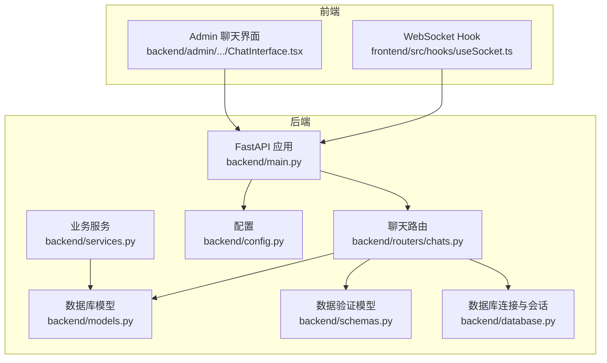
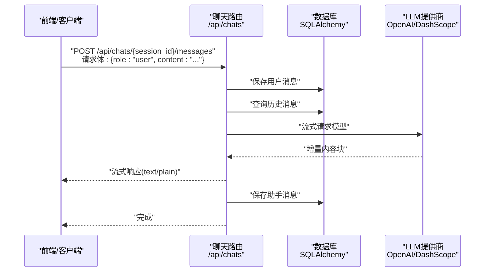
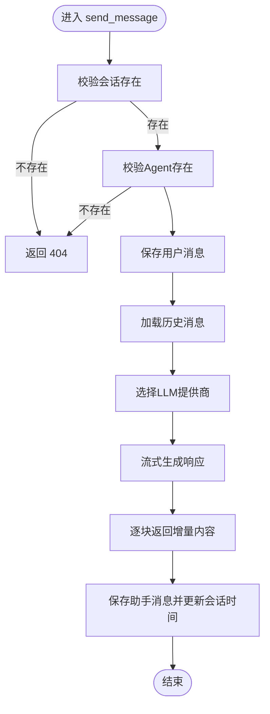
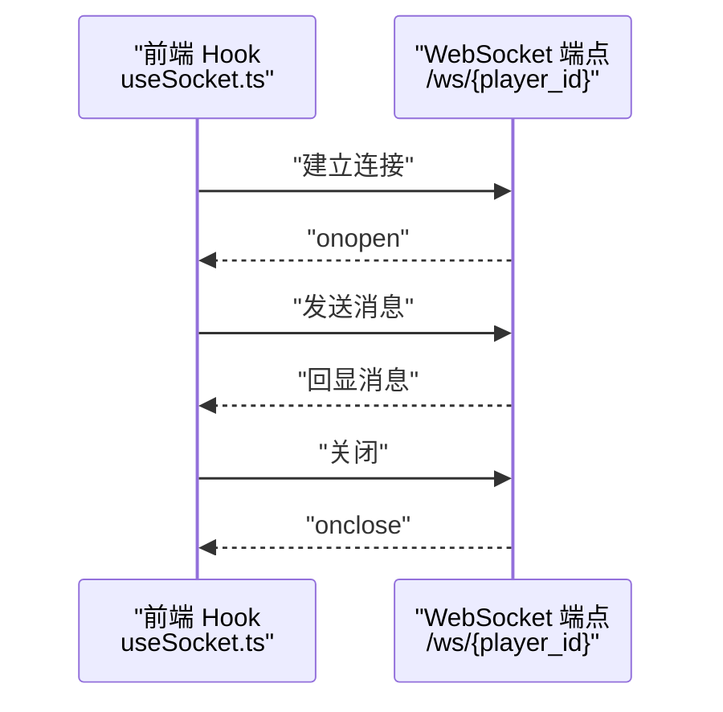
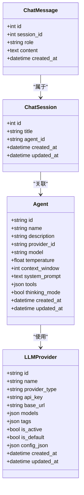
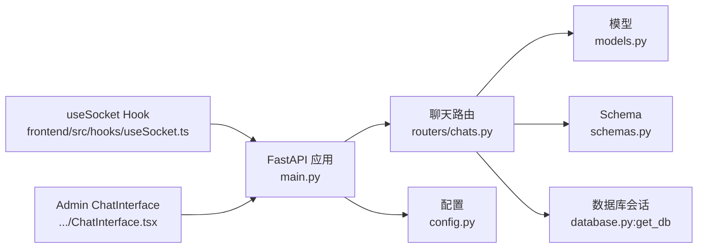

# 聊天API

<cite>
**本文引用的文件**
- [backend/main.py](file://backend/main.py)
- [backend/routers/chats.py](file://backend/routers/chats.py)
- [backend/models.py](file://backend/models.py)
- [backend/schemas.py](file://backend/schemas.py)
- [backend/database.py](file://backend/database.py)
- [backend/config.py](file://backend/config.py)
- [backend/services.py](file://backend/services.py)
- [frontend/src/hooks/useSocket.ts](file://frontend/src/hooks/useSocket.ts)
- [backend/admin/src/components/admin/agents/ChatInterface.tsx](file://backend/admin/src/components/admin/agents/ChatInterface.tsx)
- [backend/requirements.txt](file://backend/requirements.txt)
</cite>

## 目录
1. [简介](#简介)
2. [项目结构](#项目结构)
3. [核心组件](#核心组件)
4. [架构总览](#架构总览)
5. [详细组件分析](#详细组件分析)
6. [依赖关系分析](#依赖关系分析)
7. [性能考量](#性能考量)
8. [故障排查指南](#故障排查指南)
9. [结论](#结论)
10. [附录](#附录)

## 简介
本文件为“聊天API”的完整技术文档，覆盖实时聊天与对话管理相关接口，包括聊天会话创建、消息发送、历史记录查询、WebSocket连接、消息格式与事件处理机制、消息类型分类、内容验证与安全检查、以及与聊天机器人的集成指导与最佳实践。文档同时提供具体API调用示例路径，涵盖文本消息与流式响应的处理流程。

## 项目结构
后端采用FastAPI + SQLAlchemy异步ORM + Alembic迁移，数据库模型包含玩家、故事章节、资产、LLM提供商、聊天会话与消息等；前端包含React Hook用于WebSocket连接，以及Admin侧的聊天界面组件用于演示API调用与流式接收。

图表来源
- [backend/main.py](file://backend/main.py#L83-L98)
- [backend/routers/chats.py](file://backend/routers/chats.py#L16-L20)
- [backend/models.py](file://backend/models.py#L80-L122)
- [backend/schemas.py](file://backend/schemas.py#L75-L102)
- [backend/database.py](file://backend/database.py#L1-L31)
- [backend/config.py](file://backend/config.py#L7-L34)
- [frontend/src/hooks/useSocket.ts](file://frontend/src/hooks/useSocket.ts#L1-L43)
- [backend/admin/src/components/admin/agents/ChatInterface.tsx](file://backend/admin/src/components/admin/agents/ChatInterface.tsx#L1-L123)

章节来源
- [backend/main.py](file://backend/main.py#L83-L98)
- [backend/routers/chats.py](file://backend/routers/chats.py#L16-L20)
- [backend/models.py](file://backend/models.py#L80-L122)
- [backend/schemas.py](file://backend/schemas.py#L75-L102)
- [backend/database.py](file://backend/database.py#L1-L31)
- [backend/config.py](file://backend/config.py#L7-L34)
- [frontend/src/hooks/useSocket.ts](file://frontend/src/hooks/useSocket.ts#L1-L43)
- [backend/admin/src/components/admin/agents/ChatInterface.tsx](file://backend/admin/src/components/admin/agents/ChatInterface.tsx#L1-L123)

## 核心组件
- 聊天会话管理：创建、列出、查询、删除会话；查询会话内历史消息。
- 消息发送与流式响应：保存用户消息，准备上下文，调用LLM提供商（OpenAI/Azure OpenAI、DashScope），流式返回助手回复，并保存助手消息。
- WebSocket实时聊天：提供/ws/{player_id}端点，用于实时消息推送与接收。
- 数据模型与验证：ChatSession、ChatMessage、Agent、LLMProvider等模型与Pydantic验证模型。
- 前端集成：React Hook负责WebSocket连接与消息收发；Admin界面演示REST API调用与流式读取。

章节来源
- [backend/routers/chats.py](file://backend/routers/chats.py#L22-L71)
- [backend/routers/chats.py](file://backend/routers/chats.py#L72-L258)
- [backend/main.py](file://backend/main.py#L157-L169)
- [backend/models.py](file://backend/models.py#L80-L122)
- [backend/schemas.py](file://backend/schemas.py#L75-L102)
- [frontend/src/hooks/useSocket.ts](file://frontend/src/hooks/useSocket.ts#L1-L43)
- [backend/admin/src/components/admin/agents/ChatInterface.tsx](file://backend/admin/src/components/admin/agents/ChatInterface.tsx#L99-L156)

## 架构总览
聊天API围绕“会话-消息”模型展开，消息发送流程通过REST接口触发，内部完成上下文拼接、LLM调用与流式返回，并在完成后持久化助手消息。WebSocket端点用于实时推送（当前示例中仅回显消息，未实现广播/房间机制）。

图表来源
- [backend/routers/chats.py](file://backend/routers/chats.py#L72-L258)
- [backend/models.py](file://backend/models.py#L90-L98)
- [backend/database.py](file://backend/database.py#L28-L31)

## 详细组件分析

### 聊天会话管理
- 创建会话
  - 方法与路径：POST /api/chats/
  - 请求体：ChatSessionCreate（title, agent_id）
  - 响应体：ChatSessionResponse（含id、created_at、updated_at）
  - 行为：校验Agent存在性，创建会话并返回
- 列出会话
  - 方法与路径：GET /api/chats/
  - 查询参数：agent_id（可选）、skip、limit
  - 响应体：会话列表（按updated_at倒序）
- 查询会话
  - 方法与路径：GET /api/chats/{session_id}
  - 响应体：单个会话
- 删除会话
  - 方法与路径：DELETE /api/chats/{session_id}
  - 行为：级联删除消息（当前实现中手动删除消息再删除会话）

章节来源
- [backend/routers/chats.py](file://backend/routers/chats.py#L22-L37)
- [backend/routers/chats.py](file://backend/routers/chats.py#L39-L53)
- [backend/routers/chats.py](file://backend/routers/chats.py#L55-L61)
- [backend/routers/chats.py](file://backend/routers/chats.py#L260-L274)
- [backend/schemas.py](file://backend/schemas.py#L75-L87)

### 历史记录查询
- 方法与路径：GET /api/chats/{session_id}/messages
- 排序：按created_at升序
- 响应体：消息列表（包含id、session_id、role、content、created_at）

章节来源
- [backend/routers/chats.py](file://backend/routers/chats.py#L63-L70)
- [backend/schemas.py](file://backend/schemas.py#L96-L101)

### 消息发送与流式响应
- 方法与路径：POST /api/chats/{session_id}/messages
- 请求体：ChatMessageCreate（role, content）
- 流程要点：
  - 校验会话与Agent存在性
  - 保存用户消息
  - 准备历史消息作为上下文
  - 选择LLM提供商（OpenAI/Azure OpenAI、DashScope），流式生成
  - 将生成内容以text/plain流式返回
  - 在完成后保存助手消息并更新会话时间戳
- 支持的提供商与模型：
  - OpenAI/Azure OpenAI：通过AsyncOpenAI/AsyncAzureOpenAI调用
  - DashScope：通过dashscope.Generation.call调用
- 错误处理：捕获异常并返回错误信息；记录日志

图表来源
- [backend/routers/chats.py](file://backend/routers/chats.py#L72-L258)

章节来源
- [backend/routers/chats.py](file://backend/routers/chats.py#L72-L258)

### WebSocket连接与事件处理
- 端点：/ws/{player_id}
- 行为：接受连接后循环读取文本消息并回显，最终关闭连接
- 前端Hook：useSocket封装了WebSocket连接、消息收发与连接状态

图表来源
- [frontend/src/hooks/useSocket.ts](file://frontend/src/hooks/useSocket.ts#L8-L33)
- [backend/main.py](file://backend/main.py#L157-L169)

章节来源
- [backend/main.py](file://backend/main.py#L157-L169)
- [frontend/src/hooks/useSocket.ts](file://frontend/src/hooks/useSocket.ts#L1-L43)

### 数据模型与消息类型
- ChatSession：会话基本信息（标题、关联Agent、时间戳）
- ChatMessage：消息实体（角色、内容、所属会话、时间戳）
- Agent：智能体配置（关联LLM提供商、模型、温度、上下文窗口、系统提示等）
- LLMProvider：LLM提供商配置（名称、类型、密钥、基础URL、可用模型、标签、启用状态等）

图表来源
- [backend/models.py](file://backend/models.py#L80-L122)

章节来源
- [backend/models.py](file://backend/models.py#L80-L122)

### 消息类型与内容格式
- 角色（role）：user、assistant、system
- 内容（content）：字符串形式的文本消息
- 历史消息按created_at升序排列，作为上下文传入LLM
- 流式响应媒体类型：text/plain，逐块返回增量内容

章节来源
- [backend/routers/chats.py](file://backend/routers/chats.py#L118-L127)
- [backend/routers/chats.py](file://backend/routers/chats.py#L169-L173)
- [backend/schemas.py](file://backend/schemas.py#L89-L92)

### 安全与验证
- 输入验证：Pydantic模型用于请求体与响应体的数据校验
- 资源存在性校验：会话、Agent、提供商均进行存在性检查
- 提供商可用性：检查LLMProvider.is_active
- 错误处理：HTTP异常与日志记录，保证接口健壮性
- 当前未发现内置敏感词过滤或内容审核逻辑，建议在上游或下游增加内容安全策略

章节来源
- [backend/schemas.py](file://backend/schemas.py#L43-L73)
- [backend/routers/chats.py](file://backend/routers/chats.py#L24-L28)
- [backend/routers/chats.py](file://backend/routers/chats.py#L109-L110)
- [backend/routers/chats.py](file://backend/routers/chats.py#L211-L215)

### 聊天机器人集成与最佳实践
- 选择合适的LLM提供商与模型，配置temperature与context_window
- 使用system_prompt引导模型行为，避免歧义
- 对外暴露统一的会话与消息接口，便于前端与Admin集成
- 流式响应提升用户体验，注意前端Reader解析与UI渲染
- 建议在生产环境增加：
  - 敏感词过滤与内容审核
  - 速率限制与配额控制
  - 会话超时与清理策略
  - 日志审计与错误追踪

章节来源
- [backend/routers/chats.py](file://backend/routers/chats.py#L145-L209)
- [backend/admin/src/components/admin/agents/ChatInterface.tsx](file://backend/admin/src/components/admin/agents/ChatInterface.tsx#L99-L156)

## 依赖关系分析

图表来源
- [backend/routers/chats.py](file://backend/routers/chats.py#L10-L12)
- [backend/models.py](file://backend/models.py#L80-L122)
- [backend/schemas.py](file://backend/schemas.py#L75-L102)
- [backend/database.py](file://backend/database.py#L28-L31)
- [backend/main.py](file://backend/main.py#L83-L98)
- [backend/config.py](file://backend/config.py#L7-L34)
- [frontend/src/hooks/useSocket.ts](file://frontend/src/hooks/useSocket.ts#L1-L43)
- [backend/admin/src/components/admin/agents/ChatInterface.tsx](file://backend/admin/src/components/admin/agents/ChatInterface.tsx#L1-L123)

章节来源
- [backend/routers/chats.py](file://backend/routers/chats.py#L10-L12)
- [backend/database.py](file://backend/database.py#L28-L31)
- [backend/main.py](file://backend/main.py#L83-L98)
- [frontend/src/hooks/useSocket.ts](file://frontend/src/hooks/useSocket.ts#L1-L43)
- [backend/admin/src/components/admin/agents/ChatInterface.tsx](file://backend/admin/src/components/admin/agents/ChatInterface.tsx#L1-L123)

## 性能考量
- 异步I/O：使用SQLAlchemy异步引擎与FastAPI异步路由，降低阻塞
- 连接池：数据库连接池配置，减少连接开销
- 流式响应：使用StreamingResponse减少等待时间，提升交互体验
- 上下文长度控制：通过context_window与temperature控制生成成本与质量
- 日志级别：精简SQLAlchemy与Uvicorn访问日志，降低IO开销

章节来源
- [backend/database.py](file://backend/database.py#L8-L23)
- [backend/main.py](file://backend/main.py#L14-L28)
- [backend/routers/chats.py](file://backend/routers/chats.py#L145-L209)

## 故障排查指南
- 会话不存在：检查session_id是否正确，或先创建会话
- Agent不可用：确认Agent关联的LLMProvider.is_active为True
- LLM调用失败：检查提供商类型、API Key、基础URL与模型名称
- WebSocket无法连接：确认端口与CORS配置，浏览器控制台查看网络错误
- 流式响应中断：检查后端日志与提供商限流/配额

章节来源
- [backend/routers/chats.py](file://backend/routers/chats.py#L81-L87)
- [backend/routers/chats.py](file://backend/routers/chats.py#L109-L110)
- [backend/main.py](file://backend/main.py#L85-L91)
- [frontend/src/hooks/useSocket.ts](file://frontend/src/hooks/useSocket.ts#L8-L33)

## 结论
本聊天API提供了完整的会话与消息管理能力，支持多提供商流式响应与WebSocket实时交互。通过清晰的模型与验证层、异步数据库与流式响应机制，能够满足动态叙事与多模态生成场景下的实时交互需求。建议在生产环境中补充内容安全与限流策略，以保障稳定性与合规性。

## 附录

### API清单与示例路径
- 创建会话
  - 方法：POST
  - 路径：/api/chats/
  - 请求体：ChatSessionCreate
  - 示例路径：[创建会话示例](file://backend/admin/src/components/admin/agents/ChatInterface.tsx#L71-L83)
- 列出会话
  - 方法：GET
  - 路径：/api/chats/
  - 查询参数：agent_id、skip、limit
  - 示例路径：[列会话示例](file://backend/admin/src/components/admin/agents/ChatInterface.tsx#L44-L47)
- 查询会话
  - 方法：GET
  - 路径：/api/chats/{session_id}
- 删除会话
  - 方法：DELETE
  - 路径：/api/chats/{session_id}
- 查询历史消息
  - 方法：GET
  - 路径：/api/chats/{session_id}/messages
- 发送消息并流式获取响应
  - 方法：POST
  - 路径：/api/chats/{session_id}/messages
  - 请求体：ChatMessageCreate
  - 响应：text/plain 流式
  - 示例路径：[发送消息示例](file://backend/admin/src/components/admin/agents/ChatInterface.tsx#L99-L156)
- WebSocket实时聊天
  - 方法：WebSocket
  - 路径：/ws/{player_id}
  - 示例路径：[WebSocket Hook](file://frontend/src/hooks/useSocket.ts#L8-L33)

章节来源
- [backend/routers/chats.py](file://backend/routers/chats.py#L22-L70)
- [backend/routers/chats.py](file://backend/routers/chats.py#L72-L258)
- [backend/admin/src/components/admin/agents/ChatInterface.tsx](file://backend/admin/src/components/admin/agents/ChatInterface.tsx#L44-L156)
- [frontend/src/hooks/useSocket.ts](file://frontend/src/hooks/useSocket.ts#L8-L33)