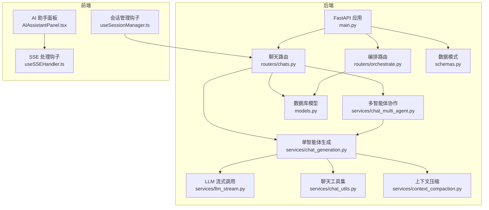
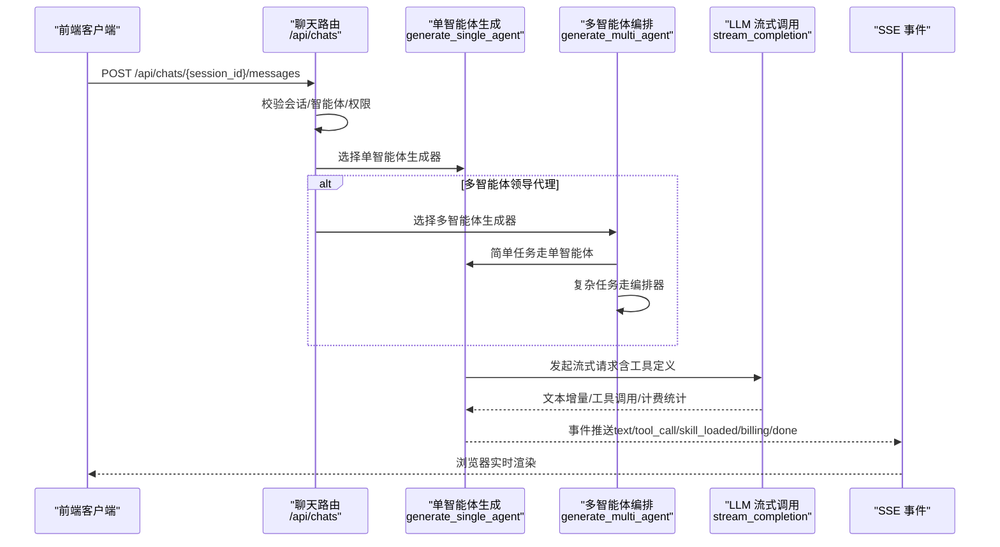
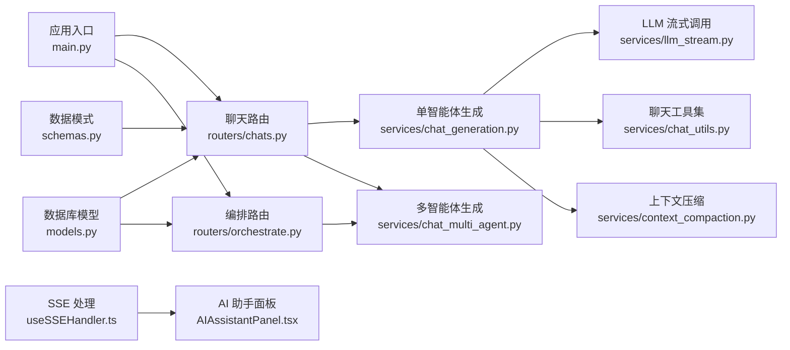

# 聊天对话接口

<cite>
**本文档引用的文件**
- [backend/routers/chats.py](file://backend/routers/chats.py)
- [backend/services/chat_generation.py](file://backend/services/chat_generation.py)
- [backend/services/chat_multi_agent.py](file://backend/services/chat_multi_agent.py)
- [backend/services/llm_stream.py](file://backend/services/llm_stream.py)
- [backend/services/chat_utils.py](file://backend/services/chat_utils.py)
- [backend/models.py](file://backend/models.py)
- [backend/schemas.py](file://backend/schemas.py)
- [backend/main.py](file://backend/main.py)
- [frontend/src/components/ai-assistant/hooks/useSSEHandler.ts](file://frontend/src/components/ai-assistant/hooks/useSSEHandler.ts)
- [frontend/src/components/ai-assistant/hooks/useSessionManager.ts](file://frontend/src/components/ai-assistant/hooks/useSessionManager.ts)
- [frontend/src/components/canvas/AIAssistantPanel.tsx](file://frontend/src/components/canvas/AIAssistantPanel.tsx)
- [backend/routers/orchestrate.py](file://backend/routers/orchestrate.py)
- [backend/services/context_compaction.py](file://backend/services/context_compaction.py)
</cite>

## 目录
1. [简介](#简介)
2. [项目结构](#项目结构)
3. [核心组件](#核心组件)
4. [架构总览](#架构总览)
5. [详细组件分析](#详细组件分析)
6. [依赖关系分析](#依赖关系分析)
7. [性能考虑](#性能考虑)
8. [故障排查指南](#故障排查指南)
9. [结论](#结论)

## 简介
本文件为 KunFlix 聊天对话系统的详细 API 文档，覆盖以下能力：
- 单轮对话与多轮对话接口
- 流式响应与非流式响应模式
- 消息发送、接收、历史查询与上下文管理
- AI 代理协作对话、角色扮演与场景模拟
- 对话状态管理、会话持久化与并发控制
- 实时通信协议（Server-Sent Events）与错误处理机制

## 项目结构
后端采用 FastAPI + SQLAlchemy 异步 ORM，前端基于 Next.js，通过 SSE 实时渲染对话流。核心模块包括：
- 路由层：/api/chats 提供会话与消息管理；/api/orchestrate 提供多智能体编排
- 服务层：单智能体生成、多智能体协作、LLM 流式调用、上下文压缩、工具调度、计费与媒体处理
- 模型与模式：ChatSession、ChatMessage、Agent、TaskExecution 等
- 前端：SSE 解析、会话管理、画布联动

图表来源
- [backend/main.py:110-175](file://backend/main.py#L110-L175)
- [backend/routers/chats.py:18-232](file://backend/routers/chats.py#L18-L232)
- [backend/routers/orchestrate.py:19-183](file://backend/routers/orchestrate.py#L19-L183)
- [backend/services/chat_generation.py:29-449](file://backend/services/chat_generation.py#L29-L449)
- [backend/services/chat_multi_agent.py:22-190](file://backend/services/chat_multi_agent.py#L22-L190)
- [backend/services/llm_stream.py:12-800](file://backend/services/llm_stream.py#L12-L800)
- [backend/services/chat_utils.py:16-94](file://backend/services/chat_utils.py#L16-L94)
- [backend/services/context_compaction.py:324-347](file://backend/services/context_compaction.py#L324-L347)
- [backend/models.py:178-208](file://backend/models.py#L178-L208)
- [backend/schemas.py:360-401](file://backend/schemas.py#L360-L401)
- [frontend/src/components/ai-assistant/hooks/useSSEHandler.ts:25-391](file://frontend/src/components/ai-assistant/hooks/useSSEHandler.ts#L25-L391)
- [frontend/src/components/ai-assistant/hooks/useSessionManager.ts:12-226](file://frontend/src/components/ai-assistant/hooks/useSessionManager.ts#L12-L226)
- [frontend/src/components/canvas/AIAssistantPanel.tsx:208-271](file://frontend/src/components/canvas/AIAssistantPanel.tsx#L208-L271)

章节来源
- [backend/main.py:110-175](file://backend/main.py#L110-L175)
- [backend/routers/chats.py:18-232](file://backend/routers/chats.py#L18-L232)
- [backend/routers/orchestrate.py:19-183](file://backend/routers/orchestrate.py#L19-L183)

## 核心组件
- 聊天会话与消息
  - 会话：标题、关联智能体、用户/管理员、剧场上下文、累计 token 使用量、上下文压缩摘要与指针
  - 消息：角色（user/assistant/system）、多模态内容（文本/图片/工具调用等）
- 智能体（Agent）
  - 提供商与模型、温度、上下文窗口、系统提示、工具列表、思维模式、计费参数、多智能体编排配置、目标节点类型、图像/视频配置
- 编排（TaskExecution/SubTask）
  - 多智能体协作的任务执行记录与子任务链路
- SSE 事件
  - 文本增量、工具调用开始/完成、技能加载、视频任务创建、计费信息、上下文压缩、画布更新、完成/错误

章节来源
- [backend/models.py:178-208](file://backend/models.py#L178-L208)
- [backend/models.py:210-273](file://backend/models.py#L210-L273)
- [backend/models.py:303-350](file://backend/models.py#L303-L350)
- [backend/schemas.py:360-401](file://backend/schemas.py#L360-L401)
- [backend/schemas.py:239-286](file://backend/schemas.py#L239-L286)
- [backend/schemas.py:437-484](file://backend/schemas.py#L437-L484)

## 架构总览
后端通过 FastAPI 路由暴露聊天与编排接口，前端通过 fetch + ReadableStream 接收 SSE。生成流程分为单智能体与多智能体两种路径，均通过 LLM 流式调用与工具调度实现。

图表来源
- [backend/routers/chats.py:127-183](file://backend/routers/chats.py#L127-L183)
- [backend/services/chat_generation.py:29-449](file://backend/services/chat_generation.py#L29-L449)
- [backend/services/chat_multi_agent.py:22-190](file://backend/services/chat_multi_agent.py#L22-L190)
- [backend/services/llm_stream.py:12-800](file://backend/services/llm_stream.py#L12-L800)

## 详细组件分析

### 1) 单轮对话与多轮对话接口
- 单轮对话
  - 请求：POST /api/chats/{session_id}/messages
  - 行为：保存用户消息 → 预检查计费 → 选择单智能体生成器 → 流式返回 SSE 事件
  - 响应：text（文本增量）、tool_call/tool_result（工具调用）、skill_call/skill_loaded（技能加载）、billing（计费）、done/error
- 多轮对话
  - 历史：GET /api/chats/{session_id}/messages
  - 行为：按创建时间升序返回消息，反序列化多模态内容与工具/技能调用
- 会话管理
  - 创建：POST /api/chats/
  - 列表：GET /api/chats/?agent_id=&theater_id=&skip=&limit=
  - 查询：GET /api/chats/{session_id}
  - 清空：DELETE /api/chats/{session_id}/messages
  - 删除：DELETE /api/chats/{session_id}

章节来源
- [backend/routers/chats.py:25-46](file://backend/routers/chats.py#L25-L46)
- [backend/routers/chats.py:48-68](file://backend/routers/chats.py#L48-L68)
- [backend/routers/chats.py:71-82](file://backend/routers/chats.py#L71-L82)
- [backend/routers/chats.py:85-124](file://backend/routers/chats.py#L85-L124)
- [backend/routers/chats.py:127-183](file://backend/routers/chats.py#L127-L183)
- [backend/routers/chats.py:186-232](file://backend/routers/chats.py#L186-L232)

### 2) 流式响应与非流式响应
- 流式响应（推荐）
  - 服务器返回 StreamingResponse，媒体类型 text/event-stream
  - 前端使用 ReadableStream + SSE 解析器逐行处理事件
- 非流式响应
  - 当前聊天接口以流式为主；如需非流式，可在客户端聚合事件后一次性展示

章节来源
- [backend/routers/chats.py:175-183](file://backend/routers/chats.py#L175-L183)
- [frontend/src/components/ai-assistant/hooks/useSSEHandler.ts:25-391](file://frontend/src/components/ai-assistant/hooks/useSSEHandler.ts#L25-L391)
- [frontend/src/components/canvas/AIAssistantPanel.tsx:208-271](file://frontend/src/components/canvas/AIAssistantPanel.tsx#L208-L271)

### 3) 消息发送、接收、历史查询与上下文管理
- 发送消息
  - 保存用户消息（多模态内容序列化为 JSON）
  - 预检查付费智能体余额
  - 选择单/多智能体生成器
- 接收消息
  - SSE 事件：text、tool_call、tool_result、skill_call、skill_loaded、video_task_created、billing、context_compacted、canvas_updated、done、error
- 历史查询
  - 按时间升序返回，反序列化 assistant 的多模态内容与技能/工具调用
- 上下文管理
  - 历史消息截断与摘要：压缩旧消息，保留最近有效片段
  - 计费统计：输入/输出 token、图像生成数量、搜索查询次数
  - 画布联动：图像生成后自动更新画布节点

章节来源
- [backend/routers/chats.py:146-183](file://backend/routers/chats.py#L146-L183)
- [backend/routers/chats.py:85-124](file://backend/routers/chats.py#L85-L124)
- [backend/services/chat_utils.py:16-94](file://backend/services/chat_utils.py#L16-L94)
- [backend/services/context_compaction.py:324-347](file://backend/services/context_compaction.py#L324-L347)
- [backend/services/chat_generation.py:338-449](file://backend/services/chat_generation.py#L338-L449)

### 4) AI 代理协作对话、角色扮演与场景模拟
- 多智能体协作
  - 简单任务：自动路由到单智能体生成器（完整工具/画布/技能支持）
  - 复杂任务：动态编排器分析任务，执行子任务链路，实时推送子任务事件
- 角色扮演与场景模拟
  - 通过智能体系统提示与工具/技能组合实现角色与场景的可控输出
  - 剧场上下文（theater_id）启用画布工具与节点联动

章节来源
- [backend/services/chat_multi_agent.py:22-190](file://backend/services/chat_multi_agent.py#L22-L190)
- [backend/routers/orchestrate.py:26-70](file://backend/routers/orchestrate.py#L26-L70)
- [backend/schemas.py:239-286](file://backend/schemas.py#L239-L286)

### 5) 对话状态管理、会话持久化与并发控制
- 会话持久化
  - ChatSession：标题、关联智能体、用户/管理员、剧场、累计 token、上下文压缩摘要与指针
  - ChatMessage：角色、内容（多模态 JSON）、时间戳
- 并发控制
  - 会话内消息写入与生成器并发：生成器以流式事件推送，前端逐条渲染
  - 计费与上下文压缩在生成完成后统一落库，保证一致性
- 前端状态
  - useSessionManager：创建/恢复会话、切换智能体、清空会话、恢复上下文使用统计
  - useSSEHandler：解析 SSE 事件，维护流式状态（技能/工具/视频任务/步骤）

章节来源
- [backend/models.py:178-208](file://backend/models.py#L178-L208)
- [backend/models.py:210-273](file://backend/models.py#L210-L273)
- [frontend/src/components/ai-assistant/hooks/useSessionManager.ts:12-226](file://frontend/src/components/ai-assistant/hooks/useSessionManager.ts#L12-L226)
- [frontend/src/components/ai-assistant/hooks/useSSEHandler.ts:25-391](file://frontend/src/components/ai-assistant/hooks/useSSEHandler.ts#L25-L391)

### 6) 实时通信协议与错误处理
- 实时通信协议（SSE）
  - 事件类型：text、tool_call、tool_result、skill_call、skill_loaded、video_task_created、billing、context_compacted、canvas_updated、done、error
  - 前端解析：逐行解析 event/data，聚合到消息流
- 错误处理
  - HTTP 状态码：401（登录过期，前端触发重新登录）、402（余额不足）、403（无权限）、429（请求频繁）
  - SSE error 事件：统一展示“错误: …”消息

章节来源
- [frontend/src/components/canvas/AIAssistantPanel.tsx:240-252](file://frontend/src/components/canvas/AIAssistantPanel.tsx#L240-L252)
- [frontend/src/components/ai-assistant/hooks/useSSEHandler.ts:374-380](file://frontend/src/components/ai-assistant/hooks/useSSEHandler.ts#L374-L380)
- [backend/routers/chats.py:161-163](file://backend/routers/chats.py#L161-L163)

## 依赖关系分析

图表来源
- [backend/routers/chats.py:18-232](file://backend/routers/chats.py#L18-L232)
- [backend/services/chat_generation.py:29-449](file://backend/services/chat_generation.py#L29-L449)
- [backend/services/chat_multi_agent.py:22-190](file://backend/services/chat_multi_agent.py#L22-L190)
- [backend/services/llm_stream.py:12-800](file://backend/services/llm_stream.py#L12-L800)
- [backend/services/chat_utils.py:16-94](file://backend/services/chat_utils.py#L16-L94)
- [backend/services/context_compaction.py:324-347](file://backend/services/context_compaction.py#L324-L347)
- [backend/routers/orchestrate.py:19-183](file://backend/routers/orchestrate.py#L19-L183)
- [backend/main.py:110-175](file://backend/main.py#L110-L175)
- [backend/models.py:178-208](file://backend/models.py#L178-L208)
- [backend/schemas.py:360-401](file://backend/schemas.py#L360-L401)
- [frontend/src/components/ai-assistant/hooks/useSSEHandler.ts:25-391](file://frontend/src/components/ai-assistant/hooks/useSSEHandler.ts#L25-L391)
- [frontend/src/components/canvas/AIAssistantPanel.tsx:208-271](file://frontend/src/components/canvas/AIAssistantPanel.tsx#L208-L271)

## 性能考虑
- 上下文压缩
  - 基于摘要与指针跳过旧消息，降低 token 使用与延迟
- 工具调用循环
  - 最大轮次限制，避免无限工具调用导致超时
- 计费与余额检查
  - 生成前预检查余额，避免无效调用
- SSE 缓冲与前端渲染
  - 逐事件渲染，避免一次性渲染大量 DOM

[本节为通用指导，无需特定文件来源]

## 故障排查指南
- 余额不足
  - 现象：HTTP 402 或 billing 事件标记 insufficient
  - 处理：前端提示充值后重试
- 登录过期
  - 现象：HTTP 401，前端触发重新登录
- 请求频繁
  - 现象：HTTP 429
  - 处理：前端提示稍后再试
- 生成失败
  - 现象：SSE error 事件
  - 处理：前端展示错误消息并重置流式状态
- 画布未更新
  - 现象：canvas_updated 事件缺失
  - 处理：确认 theater_id 与当前画布匹配，前端同步画布

章节来源
- [frontend/src/components/canvas/AIAssistantPanel.tsx:240-252](file://frontend/src/components/canvas/AIAssistantPanel.tsx#L240-L252)
- [frontend/src/components/ai-assistant/hooks/useSSEHandler.ts:330-340](file://frontend/src/components/ai-assistant/hooks/useSSEHandler.ts#L330-L340)
- [frontend/src/components/ai-assistant/hooks/useSSEHandler.ts:374-380](file://frontend/src/components/ai-assistant/hooks/useSSEHandler.ts#L374-L380)

## 结论
本聊天对话系统以 SSE 实现实时流式交互，结合单/多智能体生成与上下文压缩，提供高效、可扩展的对话体验。通过剧场上下文与画布联动，支持角色扮演与场景模拟。前端通过统一的 SSE 解析与会话管理，确保良好的用户体验与稳定性。