# 视频生成API文档

<cite>
**本文档中引用的文件**
- [videos.py](file://backend/routers/videos.py)
- [video_generation.py](file://backend/services/video_generation.py)
- [models.py](file://backend/models.py)
- [schemas.py](file://backend/schemas.py)
- [billing.py](file://backend/services/billing.py)
- [media_utils.py](file://backend/services/media_utils.py)
- [auth.py](file://backend/auth.py)
- [database.py](file://backend/database.py)
- [config.py](file://backend/config.py)
- [page.tsx](file://backend/admin/src/app/admin/videos/page.tsx)
- [useVideoTasks.ts](file://backend/admin/src/hooks/useVideoTasks.ts)
- [VideoPreviewModal.tsx](file://backend/admin/src/app/admin/videos/VideoPreviewModal.tsx)
- [new_page.tsx](file://backend/admin/src/app/admin/videos/new/page.tsx)
- [base.py](file://backend/services/video_providers/base.py)
- [xai_provider.py](file://backend/services/video_providers/xai_provider.py)
- [minimax_provider.py](file://backend/services/video_providers/minimax_provider.py)
- [model_capabilities.py](file://backend/services/video_providers/model_capabilities.py)
</cite>

## 更新摘要
**变更内容**
- 新增provider/model架构替代agent架构，包括API路由重构和计费系统更新
- 新增视频任务删除功能，支持已完成和失败任务的清理
- 后台管理界面增强，包括实时状态轮询和任务删除功能
- 计费系统更新，支持基于provider/model的成本计算
- 供应商适配器重构，支持xAI和MiniMax多供应商架构
- 模型能力配置系统，提供动态参数验证和表单控制

## 目录
1. [简介](#简介)
2. [项目结构](#项目结构)
3. [核心组件](#核心组件)
4. [架构概览](#架构概览)
5. [详细组件分析](#详细组件分析)
6. [API规范](#api规范)
7. [后台管理界面](#后台管理界面)
8. [依赖分析](#依赖分析)
9. [性能考虑](#性能考虑)
10. [故障排除指南](#故障排除指南)
11. [结论](#结论)

## 简介

视频生成API是Infinite Narrative Game项目的核心功能模块之一，提供基于多供应商平台的视频生成服务。该API支持多种视频生成模式，包括文本到视频、图片到视频和视频编辑，并集成了完整的计费系统、任务管理和状态轮询机制。

**更新** 本API现已采用新的provider/model架构替代原有的agent架构，提供更灵活的供应商管理和模型选择功能。同时新增了视频任务删除功能，支持管理员清理已完成和失败的任务记录。系统现在支持xAI和MiniMax两个视频生成供应商，通过统一的适配器接口实现供应商无关的视频生成服务。

本API文档详细介绍了视频生成服务的架构设计、接口规范、数据模型和实现细节，帮助开发者快速理解和集成视频生成功能。

## 项目结构

视频生成API位于后端项目的`backend`目录中，主要包含以下核心组件：

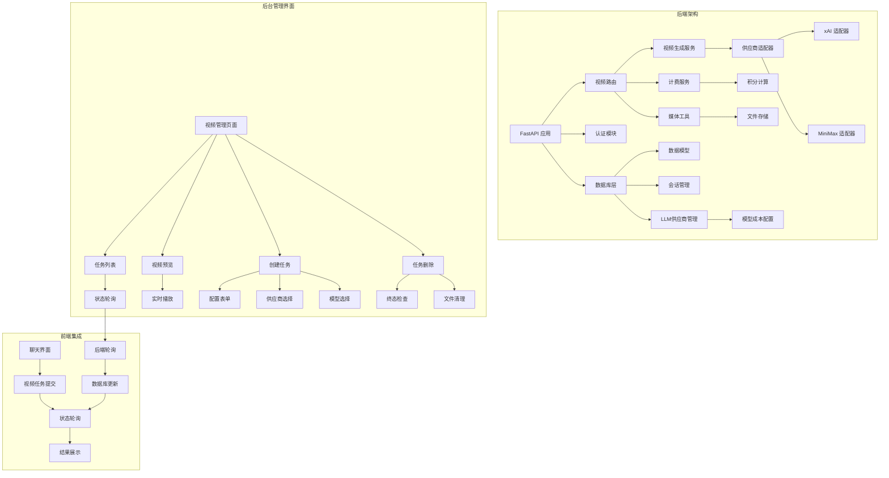

**图表来源**
- [main.py:84-105](file://backend/main.py#L84-L105)
- [videos.py:20-20](file://backend/routers/videos.py#L20-L20)
- [page.tsx:55-209](file://backend/admin/src/app/admin/videos/page.tsx#L55-L209)
- [useVideoTasks.ts:17-66](file://backend/admin/src/hooks/useVideoTasks.ts#L17-L66)

**章节来源**
- [main.py:1-127](file://backend/main.py#L1-L127)
- [config.py:1-40](file://backend/config.py#L1-L40)

## 核心组件

视频生成API由多个相互协作的组件构成，每个组件都有明确的职责分工：

### 主要组件概述

1. **FastAPI 应用层** - 提供Web服务和路由管理
2. **视频路由模块** - 处理视频相关的HTTP请求，支持分页查询和过滤
3. **视频生成服务** - 封装供应商适配器调用和任务管理
4. **计费服务** - 实现积分扣费和余额管理，支持基于provider/model的成本计算
5. **媒体工具** - 处理文件下载和存储
6. **认证模块** - 管理用户身份验证和授权，支持管理员访问
7. **数据库层** - 提供数据持久化和查询，支持视频任务追踪
8. **LLM供应商管理** - 管理供应商配置和模型成本
9. **供应商适配器** - 提供xAI和MiniMax的统一接口
10. **后台管理界面** - 提供可视化任务管理、状态监控和视频预览

**更新** 新增供应商适配器组件，支持多供应商和多模型的灵活配置。新增模型能力配置系统，提供动态参数验证和表单控制。

**章节来源**
- [videos.py:1-338](file://backend/routers/videos.py#L1-L338)
- [video_generation.py:1-151](file://backend/services/video_generation.py#L1-L151)
- [page.tsx:1-268](file://backend/admin/src/app/admin/videos/page.tsx#L1-L268)

## 架构概览

视频生成API采用分层架构设计，实现了清晰的关注点分离，并集成了实时状态轮询机制：

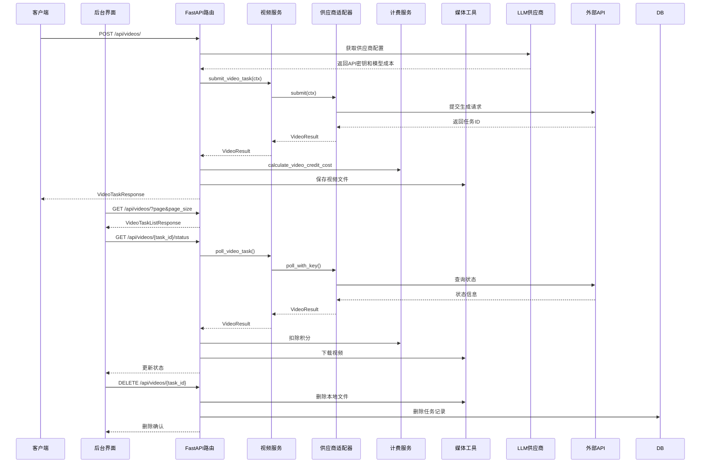

**图表来源**
- [videos.py:23-338](file://backend/routers/videos.py#L23-L338)
- [video_generation.py:80-151](file://backend/services/video_generation.py#L80-L151)
- [useVideoTasks.ts:34-48](file://backend/admin/src/hooks/useVideoTasks.ts#L34-L48)

**更新** 新增供应商适配器调用流程，支持基于provider/model的成本计算和任务删除功能。

## 详细组件分析

### 视频生成服务

视频生成服务是整个API的核心，负责与供应商平台进行交互并管理视频生成任务。

#### 核心数据结构

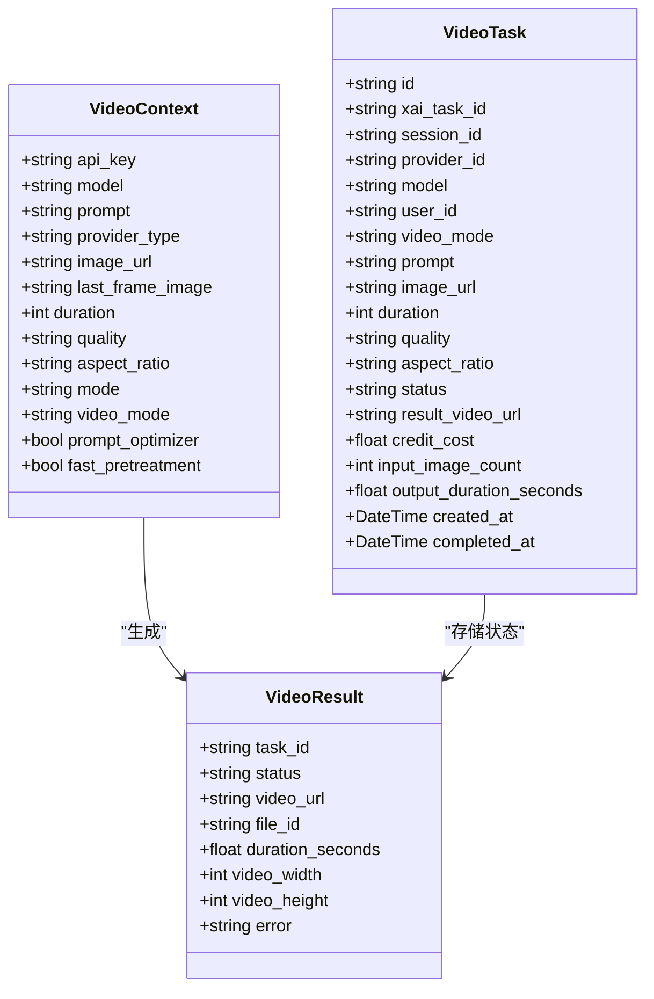

**图表来源**
- [video_generation.py:15-47](file://backend/services/video_generation.py#L15-L47)
- [models.py:352-382](file://backend/models.py#L352-L382)

#### 视频模式注册表

系统支持三种视频生成模式，通过注册表模式实现灵活扩展：

| 模式 | 描述 | 请求参数 |
|------|------|----------|
| text_to_video | 文本生成视频 | prompt, duration, quality, aspect_ratio |
| image_to_video | 图片生成视频 | prompt, image_url, duration, quality, aspect_ratio |
| edit | 视频编辑 | prompt, image_url, duration, quality, aspect_ratio |

**更新** 新增供应商适配器模式，支持xAI和MiniMax的不同参数要求。

**章节来源**
- [video_generation.py:42-72](file://backend/services/video_generation.py#L42-L72)
- [schemas.py:550-568](file://backend/schemas.py#L550-L568)

### 供应商适配器系统

系统采用适配器模式支持多个视频生成供应商：

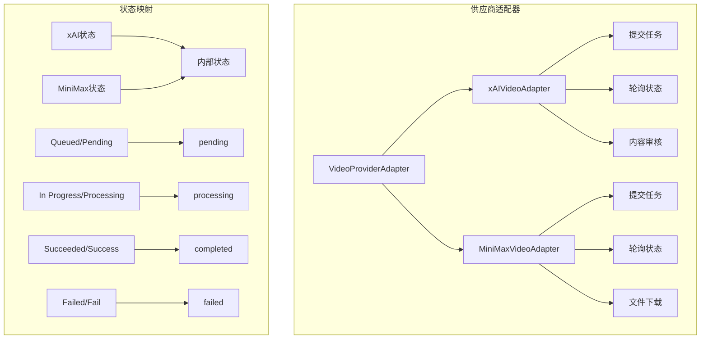

**图表来源**
- [base.py:49-114](file://backend/services/video_providers/base.py#L49-L114)
- [xai_provider.py:22-164](file://backend/services/video_providers/xai_provider.py#L22-L164)
- [minimax_provider.py:30-318](file://backend/services/video_providers/minimax_provider.py#L30-L318)

**更新** 新增供应商适配器系统，支持xAI和MiniMax的统一接口。

**章节来源**
- [base.py:1-114](file://backend/services/video_providers/base.py#L1-L114)
- [xai_provider.py:1-164](file://backend/services/video_providers/xai_provider.py#L1-L164)
- [minimax_provider.py:1-318](file://backend/services/video_providers/minimax_provider.py#L1-L318)

### 计费系统

计费系统采用映射表驱动的设计，支持基于provider/model的成本计算：

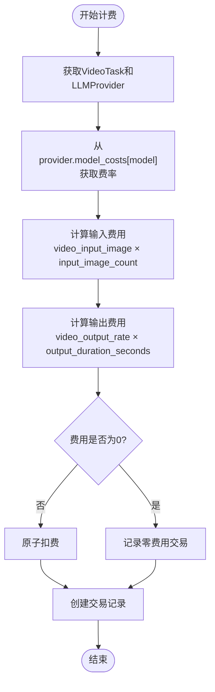

**图表来源**
- [billing.py:379-414](file://backend/services/billing.py#L379-L414)

**更新** 计费系统现在支持基于provider/model的成本计算，通过provider.model_costs[model]字典获取各维度费率。

**章节来源**
- [billing.py:1-414](file://backend/services/billing.py#L1-L414)
- [models.py:137-141](file://backend/models.py#L137-L141)

### 状态轮询机制

系统实现了智能的状态轮询机制，确保任务状态的实时更新：

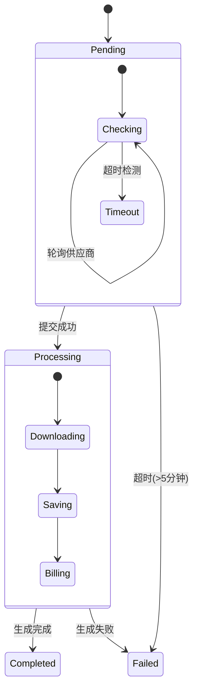

**图表来源**
- [videos.py:149-228](file://backend/routers/videos.py#L149-L228)
- [useVideoTasks.ts:34-48](file://backend/admin/src/hooks/useVideoTasks.ts#L34-L48)

**更新** 新增供应商适配器轮询和任务删除功能，支持管理员清理终态任务。

**章节来源**
- [videos.py:149-228](file://backend/routers/videos.py#L149-L228)
- [useVideoTasks.ts:17-66](file://backend/admin/src/hooks/useVideoTasks.ts#L17-L66)

### 模型能力配置系统

系统提供动态的模型能力配置，支持不同供应商和模型的参数验证：


**图表来源**
- [model_capabilities.py:22-180](file://backend/services/video_providers/model_capabilities.py#L22-L180)
- [new_page.tsx:66-89](file://backend/admin/src/app/admin/videos/new/page.tsx#L66-L89)

**更新** 新增模型能力配置系统，提供动态参数验证和表单控制。

**章节来源**
- [model_capabilities.py:1-180](file://backend/services/video_providers/model_capabilities.py#L1-L180)
- [new_page.tsx:1-420](file://backend/admin/src/app/admin/videos/new/page.tsx#L1-L420)

## API规范

### 基础信息

- **基础URL**: `/api/videos`
- **认证**: 需要有效的JWT令牌，管理员可访问所有任务
- **内容类型**: `application/json`
- **响应格式**: JSON

### 视频生成任务

#### 提交视频生成任务

**请求方法**: `POST /api/videos/`

**请求体参数**:

| 参数 | 类型 | 必需 | 默认值 | 描述 |
|------|------|------|--------|------|
| provider_id | string | 是 | - | LLM供应商ID |
| model | string | 是 | - | 模型名称 |
| session_id | string | 否 | null | 聊天会话ID |
| video_mode | string | 否 | "text_to_video" | 视频模式 |
| prompt | string | 是 | - | 生成提示词 |
| image_url | string | 否 | null | 输入图片URL |
| last_frame_image | string | 否 | null | 尾帧图片URL |
| config | object | 否 | null | 视频配置 |

**配置参数**:

| 参数 | 类型 | 必需 | 默认值 | 描述 |
|------|------|------|--------|------|
| duration | integer | 否 | 6 | 视频时长(1-15秒) |
| quality | string | 否 | "720p" | 视频质量(480p/720p/768p/1080p) |
| aspect_ratio | string | 否 | "16:9" | 宽高比 |
| mode | string | 否 | "normal" | 模式(保留字段) |
| prompt_optimizer | boolean | 否 | true | 提示词优化 |
| fast_pretreatment | boolean | 否 | false | 快速预处理 |

**响应体**:

| 字段 | 类型 | 描述 |
|------|------|------|
| id | string | 任务ID |
| xai_task_id | string | 外部任务ID |
| status | string | 任务状态 |
| video_mode | string | 视频模式 |
| prompt | string | 提示词 |
| duration | integer | 视频时长 |
| quality | string | 视频质量 |
| aspect_ratio | string | 宽高比 |
| video_url | string | 视频URL |
| credit_cost | number | 积分费用 |
| error_message | string | 错误信息 |
| provider_id | string | 供应商ID |
| provider_name | string | 供应商名称 |
| model | string | 模型名称 |
| user_id | string | 用户ID |
| created_at | string | 创建时间 |
| completed_at | string | 完成时间 |

**更新** 新增last_frame_image参数，支持MiniMax的首尾帧生成功能。

**章节来源**
- [videos.py:74-147](file://backend/routers/videos.py#L74-L147)
- [schemas.py:563-596](file://backend/schemas.py#L563-L596)

#### 获取任务状态

**请求方法**: `GET /api/videos/{task_id}/status`

**路径参数**:

| 参数 | 类型 | 必需 | 描述 |
|------|------|------|------|
| task_id | string | 是 | 视频任务ID |

**响应体**: 同上

**更新** 新增状态轮询端点，支持实时获取任务状态。

**章节来源**
- [videos.py:149-228](file://backend/routers/videos.py#L149-L228)

#### 获取会话任务列表

**请求方法**: `GET /api/videos/session/{session_id}`

**路径参数**:

| 参数 | 类型 | 必需 | 描述 |
|------|------|------|------|
| session_id | string | 是 | 聊天会话ID |

**响应体**: 数组，包含多个VideoTaskResponse对象

**章节来源**
- [videos.py:230-244](file://backend/routers/videos.py#L230-L244)

#### 分页查询视频任务

**请求方法**: `GET /api/videos/`

**查询参数**:

| 参数 | 类型 | 必需 | 默认值 | 描述 |
|------|------|------|--------|------|
| page | integer | 否 | 1 | 页码(>=1) |
| page_size | integer | 否 | 20 | 页面大小(1-100) |
| status | string | 否 | null | 任务状态过滤 |
| video_mode | string | 否 | null | 视频模式过滤 |
| provider_id | string | 否 | null | 供应商ID过滤 |

**响应体**: VideoTaskListResponse对象，包含items数组和分页信息

**更新** 新增分页查询功能，支持管理员对所有任务进行管理。

**章节来源**
- [videos.py:26-71](file://backend/routers/videos.py#L26-L71)

#### 删除视频任务

**请求方法**: `DELETE /api/videos/{task_id}`

**路径参数**:

| 参数 | 类型 | 必需 | 描述 |
|------|------|------|------|
| task_id | string | 是 | 视频任务ID |

**请求体**: 无

**响应体**: 
```json
{
  "detail": "ok"
}
```

**删除规则**:
- 仅允许删除已完成(completed)或失败(failed)的任务
- 删除时会清理本地视频文件和关联的聊天消息
- 任务记录将从数据库中永久删除

**章节来源**
- [videos.py:261-292](file://backend/routers/videos.py#L261-L292)

#### 获取模型能力配置

**请求方法**: `GET /api/videos/model-capabilities/{model_name}`

**路径参数**:

| 参数 | 类型 | 必需 | 描述 |
|------|------|------|------|
| model_name | string | 是 | 模型名称 |

**响应体**:

| 字段 | 类型 | 描述 |
|------|------|------|
| provider | string | 供应商名称 |
| modes | array | 支持的生成模式 |
| durations | array | 支持的时长列表 |
| resolutions | array | 支持的分辨率列表 |
| supports_first_frame | boolean | 是否支持首帧图片 |
| supports_last_frame | boolean | 是否支持尾帧图片 |
| supports_prompt_optimizer | boolean | 是否支持提示词优化 |
| supports_fast_pretreatment | boolean | 是否支持快速预处理 |
| aspect_ratios | array | 支持的宽高比列表 |

**章节来源**
- [videos.py:246-254](file://backend/routers/videos.py#L246-L254)

### 错误处理

系统提供了完善的错误处理机制：

| HTTP状态码 | 错误类型 | 描述 |
|------------|----------|------|
| 400 | Bad Request | 请求参数无效 |
| 401 | Unauthorized | 未认证或令牌无效 |
| 403 | Forbidden | 账户被禁用或权限不足 |
| 404 | Not Found | 任务或资源不存在 |
| 429 | Too Many Requests | 请求过于频繁 |
| 500 | Internal Server Error | 服务器内部错误 |
| 502 | Bad Gateway | 第三方服务错误 |
| 503 | Service Unavailable | 服务不可用 |

**章节来源**
- [videos.py:35-40](file://backend/routers/videos.py#L35-L40)
- [videos.py:175-177](file://backend/routers/videos.py#L175-L177)

## 后台管理界面

### 视频管理页面

后台管理界面提供了完整的视频任务管理功能：

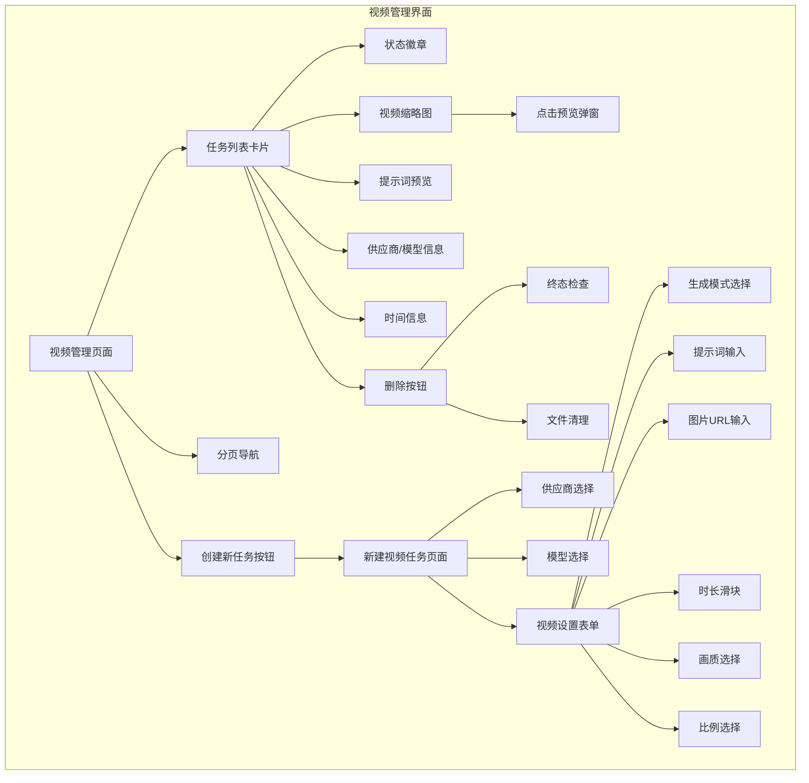

**图表来源**
- [page.tsx:55-268](file://backend/admin/src/app/admin/videos/page.tsx#L55-L268)
- [new_page.tsx:42-258](file://backend/admin/src/app/admin/videos/new/page.tsx#L42-L258)

### 实时状态轮询

后台管理界面实现了智能的状态轮询机制：

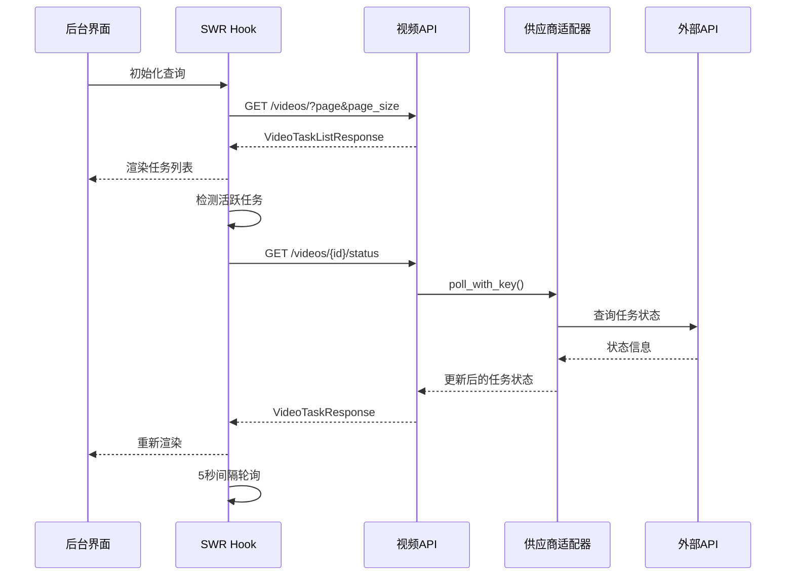

**图表来源**
- [useVideoTasks.ts:34-48](file://backend/admin/src/hooks/useVideoTasks.ts#L34-L48)

**更新** 新增任务删除功能，支持管理员清理终态任务。

**章节来源**
- [page.tsx:55-268](file://backend/admin/src/app/admin/videos/page.tsx#L55-L268)
- [useVideoTasks.ts:17-66](file://backend/admin/src/hooks/useVideoTasks.ts#L17-L66)

### 视频预览功能

后台管理界面提供了完整的视频预览功能：

| 功能特性 | 描述 | 实现方式 |
|----------|------|----------|
| 视频播放 | 支持MP4格式视频播放 | HTML5 video元素 |
| 状态显示 | 显示任务状态和错误信息 | 状态徽章和错误提示 |
| 任务详情 | 显示视频配置和计费信息 | 详情表格 |
| 提示词查看 | 显示原始提示词内容 | 文本区域 |
| 时间信息 | 显示创建和完成时间 | 本地化时间格式 |
| 删除功能 | 支持删除已完成或失败任务 | 删除按钮和确认对话框 |

**更新** 新增任务删除功能，支持管理员清理终态任务。

**章节来源**
- [VideoPreviewModal.tsx:20-116](file://backend/admin/src/app/admin/videos/VideoPreviewModal.tsx#L20-L116)

### 模型能力表单控制

后台管理界面提供了智能的表单控制功能：

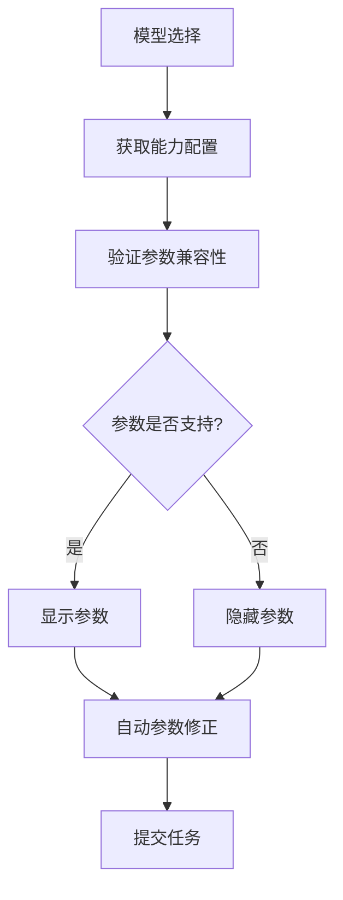

**图表来源**
- [new_page.tsx:66-89](file://backend/admin/src/app/admin/videos/new/page.tsx#L66-L89)

**更新** 新增模型能力配置系统，提供动态参数验证和表单控制。

**章节来源**
- [new_page.tsx:1-420](file://backend/admin/src/app/admin/videos/new/page.tsx#L1-L420)

## 依赖分析

视频生成API的依赖关系体现了清晰的分层架构：

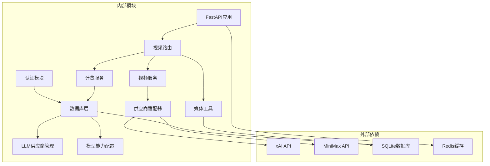

**图表来源**
- [main.py:32-46](file://backend/main.py#L32-L46)
- [database.py:1-31](file://backend/database.py#L1-L31)

### 关键依赖关系

1. **供应商API集成**: 通过HTTP客户端与xAI和MiniMax服务通信
2. **数据库连接**: 使用SQLAlchemy ORM进行数据持久化
3. **认证系统**: 基于JWT的用户身份验证
4. **异步处理**: 使用async/await实现非阻塞操作
5. **后台管理界面**: 基于Next.js的React应用，使用SWR进行数据同步
6. **LLM供应商管理**: 支持多供应商和多模型的灵活配置
7. **适配器模式**: 统一供应商接口，支持扩展新供应商

**更新** 新增供应商适配器依赖，支持基于provider/model的成本计算和多供应商架构。

**章节来源**
- [video_generation.py:18-32](file://backend/services/video_generation.py#L18-L32)
- [auth.py:1-229](file://backend/auth.py#L1-L229)

## 性能考虑

### 异步架构优势

视频生成API采用了完全的异步架构设计，具有以下性能优势：

1. **非阻塞I/O**: 使用async/await避免线程阻塞
2. **连接池管理**: 数据库连接池自动管理连接复用
3. **超时控制**: 合理的超时设置防止资源泄露
4. **内存优化**: 流式处理大型文件下载

### 缓存策略

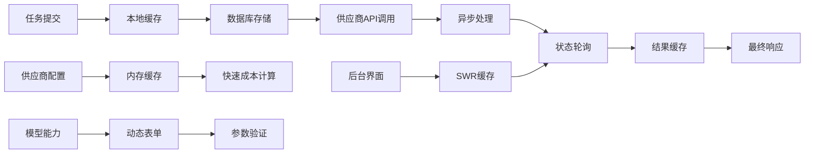

**图表来源**
- [videos.py:121-124](file://backend/routers/videos.py#L121-L124)
- [useVideoTasks.ts:30-32](file://backend/admin/src/hooks/useVideoTasks.ts#L30-L32)

**更新** 新增供应商配置缓存、任务删除优化和模型能力动态控制机制。

### 并发处理

系统通过以下机制保证并发安全性：

1. **原子操作**: 使用数据库原子更新确保计费安全
2. **连接池**: 限制最大连接数防止资源耗尽
3. **超时保护**: 防止长时间占用连接
4. **错误恢复**: 自动重试机制提高可靠性
5. **状态轮询优化**: 智能轮询策略减少不必要的API调用
6. **任务删除保护**: 终态检查确保数据一致性
7. **适配器并发**: 供应商适配器独立处理，互不影响

**更新** 新增任务删除的终态检查和文件清理保护机制，以及适配器并发处理能力。

## 故障排除指南

### 常见问题及解决方案

#### 1. 任务状态长时间保持Pending

**可能原因**:
- 供应商API服务延迟
- 网络连接问题
- 任务队列拥堵
- 供应商限流

**解决步骤**:
1. 检查供应商API服务状态
2. 验证网络连接稳定性
3. 查看服务器负载情况
4. 等待系统自动重试
5. 检查供应商配额限制

#### 2. 积分扣费失败

**可能原因**:
- 余额不足
- 账户被冻结
- 数据库事务冲突
- 供应商计费错误

**解决步骤**:
1. 检查用户余额
2. 验证账户状态
3. 查看数据库日志
4. 重试操作
5. 检查供应商计费配置

#### 3. 视频文件下载失败

**可能原因**:
- 远程URL失效
- 网络超时
- 文件格式不支持
- 供应商文件过期

**解决步骤**:
1. 验证视频URL有效性
2. 检查网络连接
3. 查看文件格式
4. 重新生成视频
5. 检查供应商文件有效期

#### 4. 后台界面状态不同步

**可能原因**:
- SWR缓存问题
- 轮询间隔设置不当
- 网络连接不稳定
- 适配器轮询失败

**解决步骤**:
1. 刷新页面清除缓存
2. 检查网络连接
3. 调整轮询间隔
4. 查看浏览器控制台错误
5. 检查供应商适配器状态

#### 5. 任务删除失败

**可能原因**:
- 任务状态不是终态
- 文件删除权限问题
- 数据库事务冲突
- 适配器异常

**解决步骤**:
1. 验证任务状态为completed或failed
2. 检查文件系统权限
3. 查看数据库日志
4. 重试操作
5. 检查供应商适配器状态

#### 6. 供应商适配器错误

**可能原因**:
- API密钥配置错误
- 模型不支持
- 参数验证失败
- 供应商服务异常

**解决步骤**:
1. 验证API密钥配置
2. 检查模型支持情况
3. 查看参数验证错误
4. 检查供应商服务状态
5. 查看适配器日志

**章节来源**
- [videos.py:138-145](file://backend/routers/videos.py#L138-L145)
- [billing.py:197-214](file://backend/services/billing.py#L197-L214)

### 日志监控

系统提供了详细的日志记录机制：

| 日志级别 | 用途 | 示例 |
|----------|------|------|
| INFO | 操作记录 | 任务创建、状态更新、供应商配置 |
| WARNING | 警告信息 | 超时警告、余额不足、权限问题 |
| ERROR | 错误信息 | API调用失败、数据库错误、文件删除失败 |
| DEBUG | 调试信息 | 详细流程跟踪、供应商成本计算、适配器调用 |

**更新** 新增供应商适配器和模型能力配置的日志监控。

**章节来源**
- [video_generation.py:109-131](file://backend/services/video_generation.py#L109-L131)
- [videos.py:175-177](file://backend/routers/videos.py#L175-L177)

## 结论

视频生成API是一个设计精良、功能完整的异步服务，具有以下特点：

1. **架构清晰**: 分层设计确保了良好的可维护性
2. **功能完整**: 支持多种视频生成模式和完整的生命周期管理
3. **性能优秀**: 异步架构和缓存策略提供了高效的处理能力
4. **安全可靠**: 完善的认证、授权和错误处理机制
5. **易于扩展**: 适配器模式和模块化设计便于功能扩展
6. **管理友好**: 完整的后台管理界面，支持实时状态监控
7. **用户体验佳**: 智能轮询机制确保状态更新的实时性
8. **供应商灵活**: 基于provider/model的架构支持多供应商配置
9. **成本透明**: 基于provider/model的成本计算清晰明了
10. **数据管理**: 支持任务删除和文件清理，维护数据整洁
11. **多供应商支持**: 同时支持xAI和MiniMax两个视频生成供应商
12. **智能表单控制**: 基于模型能力的动态参数验证和表单控制

**更新** 新增供应商适配器架构、任务删除功能、模型能力配置系统和多供应商支持能力，显著提升了系统的灵活性和可管理性。

该API为Infinite Narrative Game项目提供了强大的视频生成功能，为用户创造沉浸式的互动体验奠定了坚实的技术基础。新的供应商管理架构、后台管理界面和模型能力配置系统使得视频生成服务更加灵活和可控，为系统管理员提供了强大的管理工具，为用户提供了一致的视频生成体验。