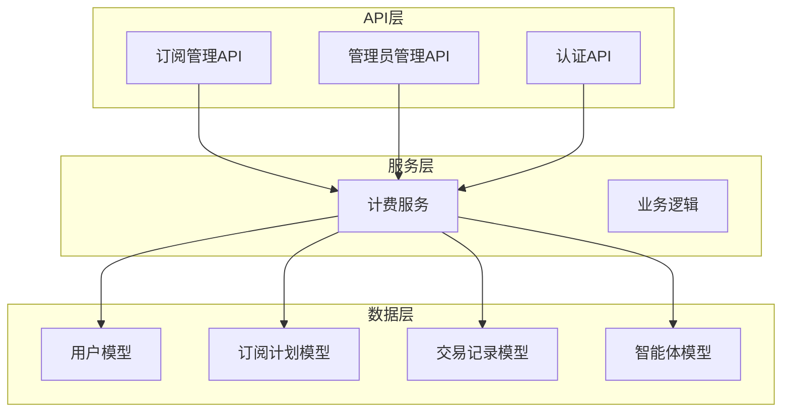
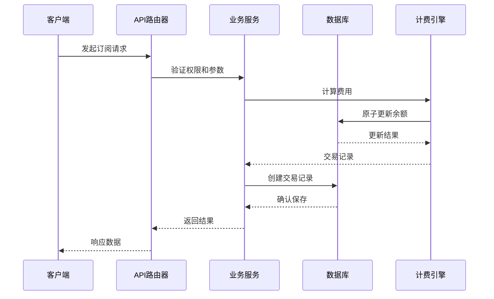
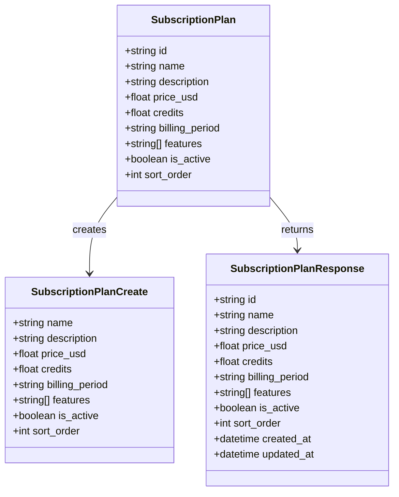
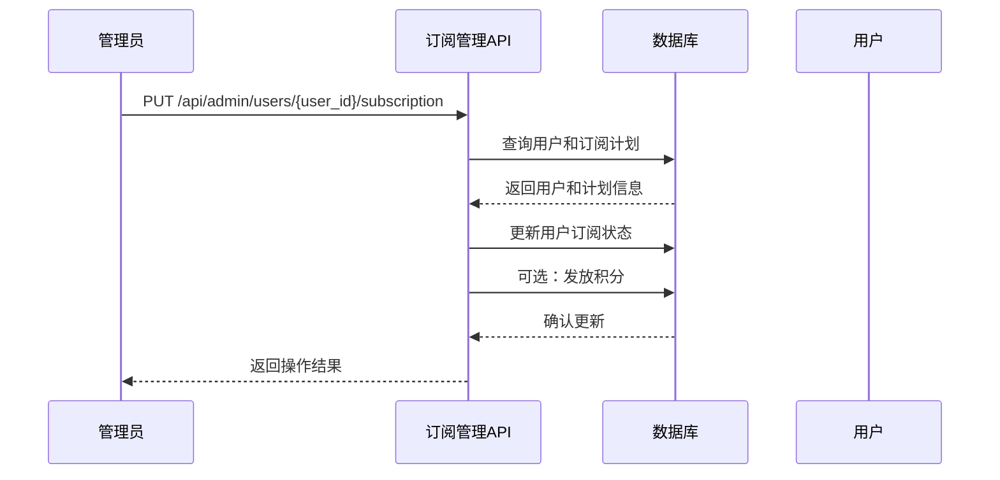
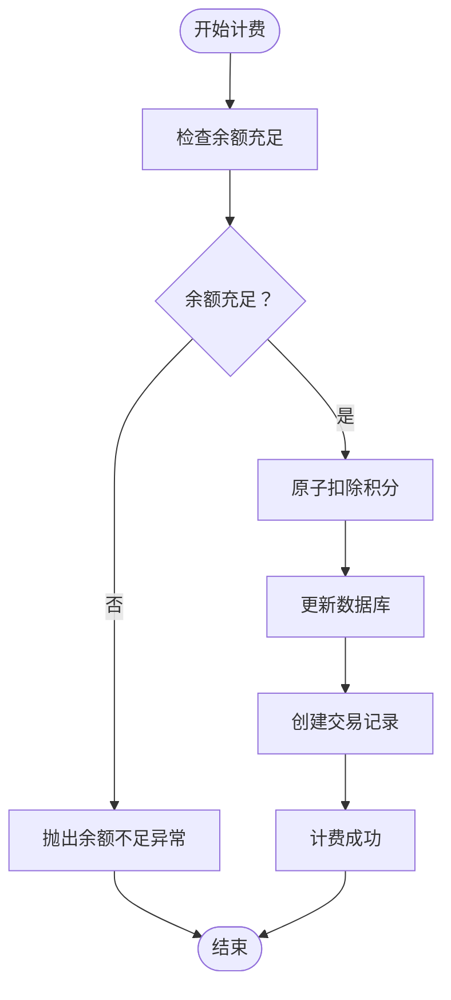
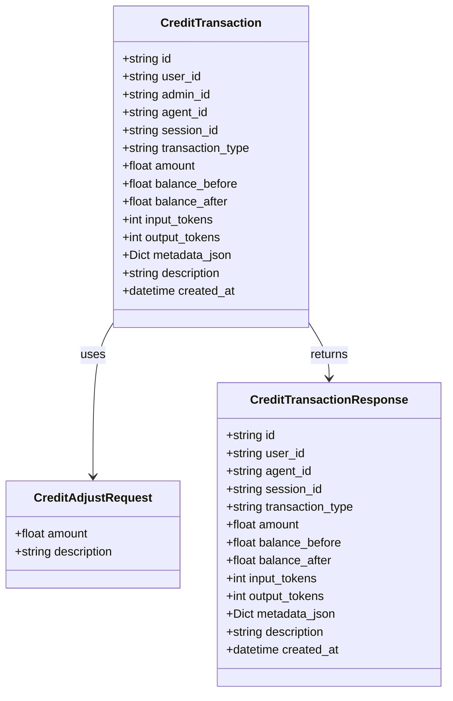
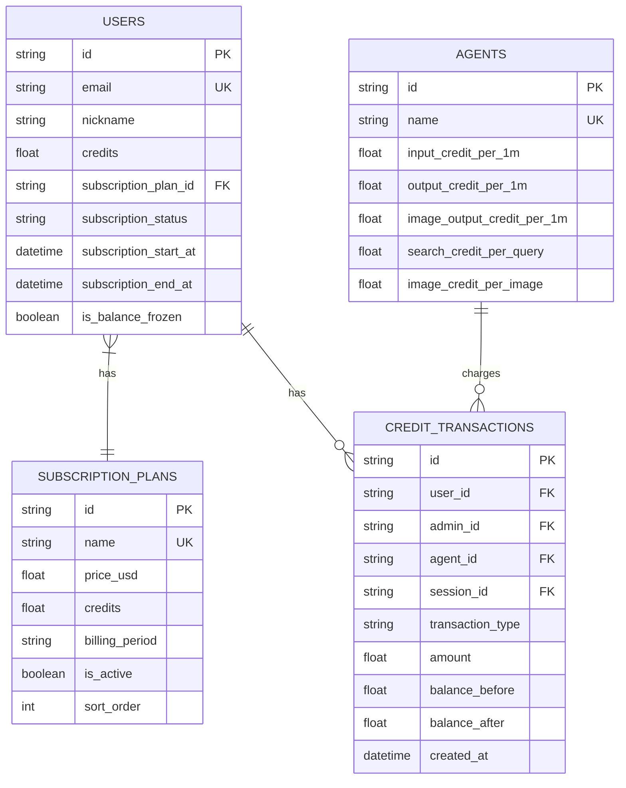
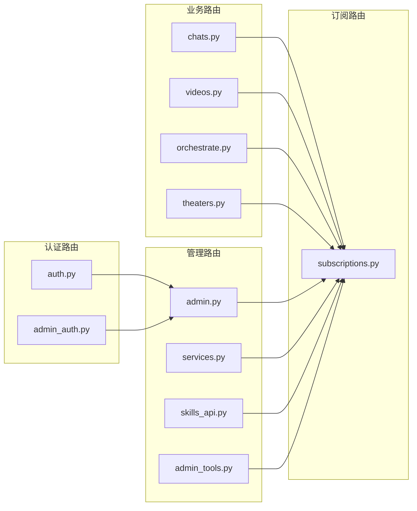
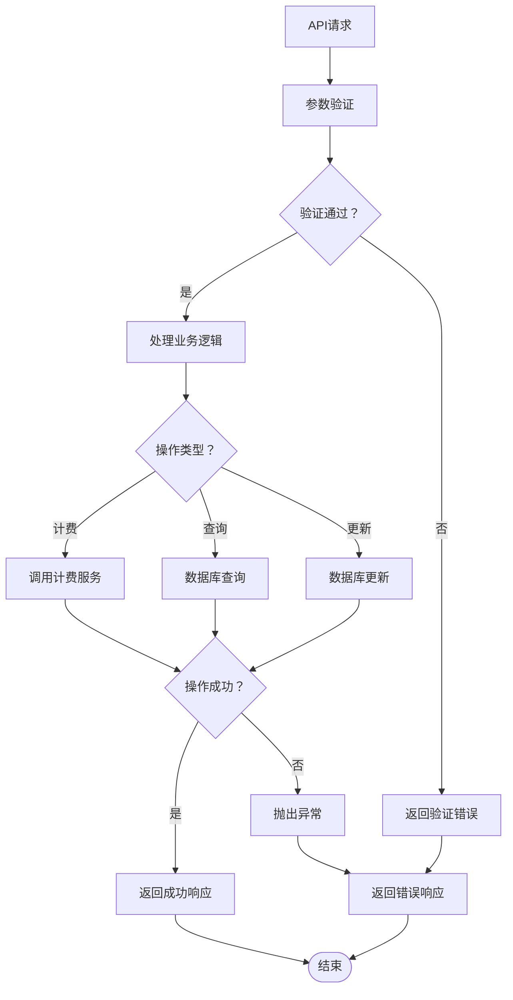

# 订阅计费接口

<cite>
**本文档引用的文件**
- [subscriptions.py](file://backend/routers/subscriptions.py)
- [admin.py](file://backend/routers/admin.py)
- [billing.py](file://backend/services/billing.py)
- [models.py](file://backend/models.py)
- [schemas.py](file://backend/schemas.py)
- [main.py](file://backend/main.py)
- [BILLING_REVIEW.md](file://backend/docs/BILLING_REVIEW.md)
- [h4i5j6k7l8m9_add_model_costs_and_subscriptions.py](file://backend/migrations/versions/h4i5j6k7l8m9_add_model_costs_and_subscriptions.py)
</cite>

## 目录
1. [简介](#简介)
2. [项目结构](#项目结构)
3. [核心组件](#核心组件)
4. [架构概览](#架构概览)
5. [详细组件分析](#详细组件分析)
6. [依赖关系分析](#依赖关系分析)
7. [性能考虑](#性能考虑)
8. [故障排除指南](#故障排除指南)
9. [结论](#结论)

## 简介
本文档为KunFlix的订阅计费系统提供完整的API文档。系统基于FastAPI构建，采用异步数据库访问，实现了完整的订阅管理、积分计费、消费记录管理和账单处理功能。系统支持多种计费维度，包括文本生成、图像生成、搜索查询和视频生成等。

## 项目结构
订阅计费系统主要由以下几个核心模块组成：

**图表来源**
- [main.py:138-153](file://backend/main.py#L138-L153)
- [models.py:35-442](file://backend/models.py#L35-L442)

**章节来源**
- [main.py:138-153](file://backend/main.py#L138-L153)
- [models.py:35-442](file://backend/models.py#L35-L442)

## 核心组件
订阅计费系统的核心组件包括：

### 订阅管理组件
- 订阅计划创建、查询、更新和删除
- 用户订阅分配和取消
- 订阅状态管理

### 计费组件
- 多维度积分计算（文本、图像、搜索、视频）
- 原子化积分扣除和退还
- 余额检查和冻结管理

### 管理员组件
- 用户积分调整
- 订阅计划管理
- 消费记录查询

**章节来源**
- [subscriptions.py:21-118](file://backend/routers/subscriptions.py#L21-L118)
- [admin.py:141-301](file://backend/routers/admin.py#L141-L301)
- [billing.py:45-387](file://backend/services/billing.py#L45-L387)

## 架构概览
系统采用分层架构设计，确保职责分离和可维护性：

**图表来源**
- [billing.py:178-308](file://backend/services/billing.py#L178-L308)
- [admin.py:141-187](file://backend/routers/admin.py#L141-L187)

系统架构特点：
- **异步数据库访问**：使用SQLAlchemy异步引擎
- **原子操作**：确保积分交易的线程安全
- **权限控制**：严格的管理员权限验证
- **数据一致性**：通过事务保证操作的原子性

## 详细组件分析

### 订阅计划管理API

#### 订阅计划查询接口
- **GET /api/admin/subscriptions/**：获取所有订阅计划列表
- **GET /api/admin/subscriptions/{plan_id}**：获取特定订阅计划详情
- **响应数据**：包含计划名称、描述、价格、包含积分、计费周期等信息

#### 订阅计划管理接口
- **POST /api/admin/subscriptions/**：创建新的订阅计划
- **PUT /api/admin/subscriptions/{plan_id}**：更新现有订阅计划
- **DELETE /api/admin/subscriptions/{plan_id}**：删除订阅计划

**图表来源**
- [models.py:389-409](file://backend/models.py#L389-L409)
- [schemas.py:490-522](file://backend/schemas.py#L490-L522)

**章节来源**
- [subscriptions.py:21-118](file://backend/routers/subscriptions.py#L21-L118)
- [models.py:389-409](file://backend/models.py#L389-L409)
- [schemas.py:490-522](file://backend/schemas.py#L490-L522)

### 用户订阅管理API

#### 订阅分配接口
- **PUT /api/admin/users/{user_id}/subscription**：为用户分配订阅计划
- **请求参数**：plan_id、start_at、end_at、auto_grant_credits
- **功能**：激活用户订阅状态，可选择自动发放积分

#### 订阅取消接口
- **DELETE /api/admin/users/{user_id}/subscription**：取消用户订阅
- **功能**：重置用户订阅状态为非活跃

**图表来源**
- [admin.py:220-279](file://backend/routers/admin.py#L220-L279)

**章节来源**
- [admin.py:220-301](file://backend/routers/admin.py#L220-L301)

### 积分计费系统

#### 计费维度定义
系统支持多种计费维度，每种维度都有对应的费率字段：

| 计费维度 | 费率字段 | 计费单位 | 说明 |
|---------|---------|---------|------|
| 输入令牌 | input_credit_per_1m | 每100万令牌 | 文本输入计费 |
| 输出令牌 | output_credit_per_1m | 每100万令牌 | 文本输出计费 |
| 图像输出令牌 | image_output_credit_per_1m | 每100万令牌 | 图像生成计费 |
| 搜索查询 | search_credit_per_query | 每次查询 | 搜索功能计费 |
| 图像生成 | image_credit_per_image | 每张图片 | xAI图像生成计费 |

#### 视频计费维度
视频生成采用不同的计费方式：

| 计费维度 | 计费单位 | 说明 |
|---------|---------|------|
| 视频输入图片 | 每张图片 | 输入参考图片计费 |
| 视频输入秒 | 每秒 | 视频编辑输入计费 |
| 视频输出480p | 每秒 | 480p输出视频计费 |
| 视频输出720p | 每秒 | 720p输出视频计费 |

#### 原子化计费流程
系统采用原子操作确保计费的准确性：

**图表来源**
- [billing.py:178-308](file://backend/services/billing.py#L178-L308)

**章节来源**
- [billing.py:12-387](file://backend/services/billing.py#L12-L387)

### 管理员积分管理

#### 积分调整接口
- **POST /api/admin/users/{user_id}/credits/adjust**：手动调整用户积分
- **POST /api/admin/admins/{admin_id}/credits/adjust**：调整管理员积分
- **功能**：支持充值和扣除操作

#### 积分历史查询
- **GET /api/admin/users/{user_id}/credits/history**：获取用户积分变动历史
- **响应**：包含交易类型、金额、余额变化、描述等信息

**图表来源**
- [models.py:281-301](file://backend/models.py#L281-L301)
- [schemas.py:406-422](file://backend/schemas.py#L406-L422)

**章节来源**
- [admin.py:141-301](file://backend/routers/admin.py#L141-L301)
- [models.py:281-301](file://backend/models.py#L281-L301)
- [schemas.py:406-422](file://backend/schemas.py#L406-L422)

## 依赖关系分析

### 数据模型依赖关系
系统的核心数据模型之间存在清晰的依赖关系：

**图表来源**
- [models.py:35-442](file://backend/models.py#L35-L442)

### API路由依赖
系统API路由按照功能模块进行组织：

**图表来源**
- [main.py:138-153](file://backend/main.py#L138-L153)

**章节来源**
- [models.py:35-442](file://backend/models.py#L35-L442)
- [main.py:138-153](file://backend/main.py#L138-L153)

## 性能考虑
基于系统的设计和实现，以下是关键的性能考量：

### 数据库性能优化
- **索引策略**：用户表、订阅计划表、交易记录表都建立了适当的索引
- **异步访问**：使用SQLAlchemy异步引擎提高并发性能
- **批量操作**：支持分页查询和批量数据处理

### 计费性能优化
- **原子操作**：使用数据库原生UPDATE语句确保并发安全
- **预估检查**：在执行前检查余额，避免不必要的数据库操作
- **缓存策略**：智能体费率配置可以考虑缓存以减少数据库查询

### 内存和CPU优化
- **流式处理**：支持大文件上传和处理的流式操作
- **连接池**：合理配置数据库连接池大小
- **资源管理**：及时释放WebSocket连接和临时资源

## 故障排除指南

### 常见错误类型

#### 余额不足错误
当用户尝试进行超出余额的操作时，系统会抛出`InsufficientCreditsError`异常。解决方法：
- 检查用户当前余额
- 确认计费预估是否正确
- 提示用户充值积分

#### 账户冻结错误
当用户账户被冻结时，系统会抛出`BalanceFrozenError`异常。解决方法：
- 检查用户状态
- 确认管理员权限
- 解冻账户后重试操作

#### 数据库并发冲突
在高并发场景下可能出现数据竞争。系统通过原子操作解决此问题，但开发人员需要注意：
- 确保使用提供的计费函数
- 避免绕过原子操作的直接数据库更新
- 实现适当的重试机制

### 调试和监控
系统提供了完善的日志记录和错误处理机制：

**图表来源**
- [billing.py:37-43](file://backend/services/billing.py#L37-L43)

**章节来源**
- [billing.py:37-43](file://backend/services/billing.py#L37-L43)

## 结论
KunFlix的订阅计费系统是一个设计完善、功能完整的计费解决方案。系统具有以下优势：

### 技术优势
- **模块化设计**：清晰的分层架构便于维护和扩展
- **异步处理**：高效的异步数据库访问提升性能
- **原子操作**：确保计费操作的准确性和一致性
- **权限控制**：严格的管理员权限管理

### 功能完整性
- **多维度计费**：支持文本、图像、搜索、视频等多种计费场景
- **灵活的订阅管理**：支持多种订阅周期和自动续费
- **完善的审计功能**：详细的交易记录和历史查询
- **管理员工具**：提供全面的用户和订阅管理功能

### 改进建议
根据[BILLING_REVIEW.md](file://backend/docs/BILLING_REVIEW.md)文档的分析，系统还有以下改进空间：
- 实现积分过期机制
- 添加每日配额功能
- 增强退款处理能力
- 优化浮点数精度问题

总体而言，该系统为KunFlix提供了坚实的技术基础，能够满足当前和未来的业务需求。