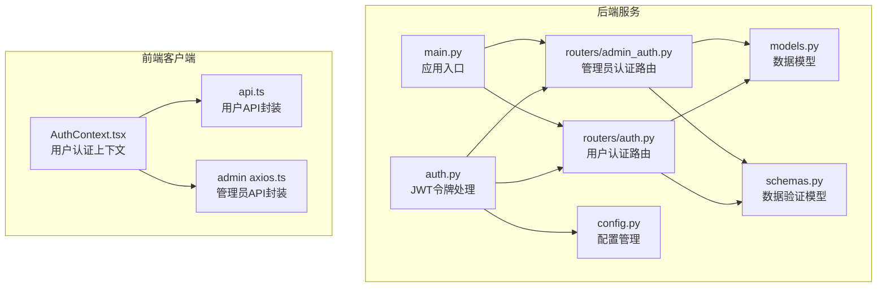
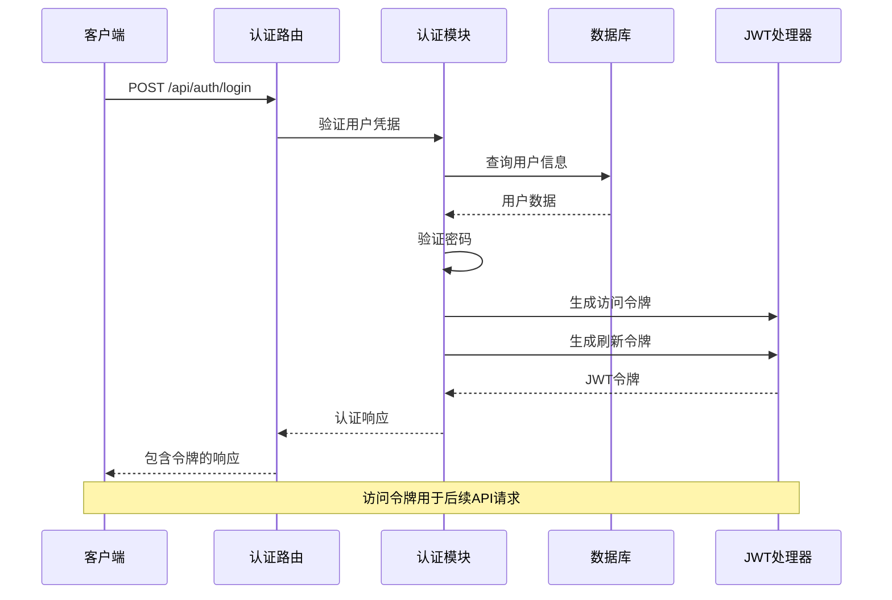
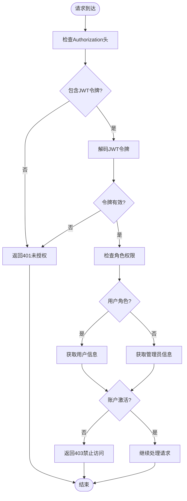
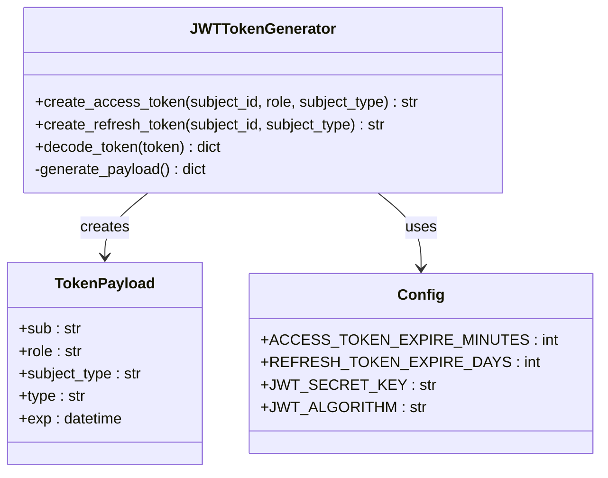
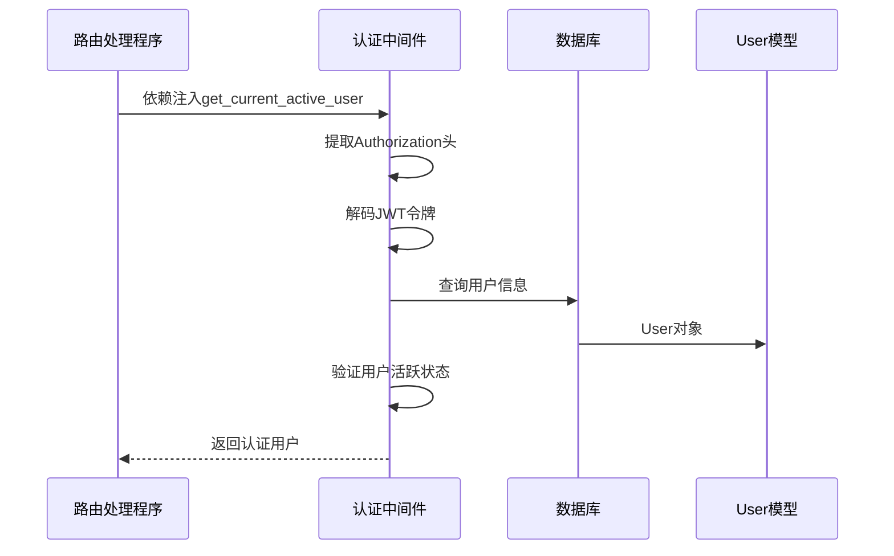
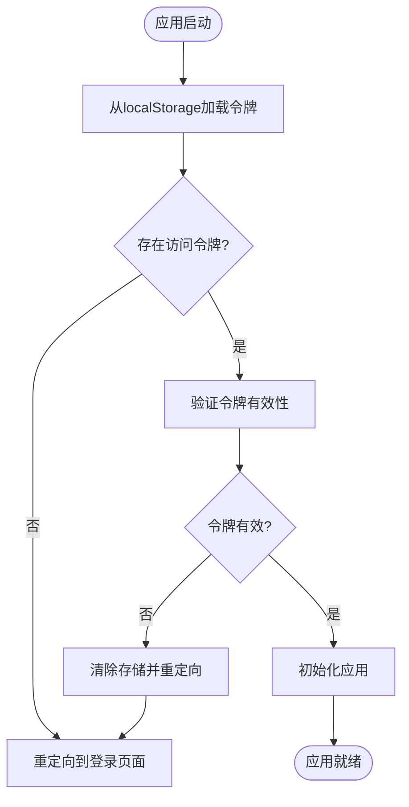
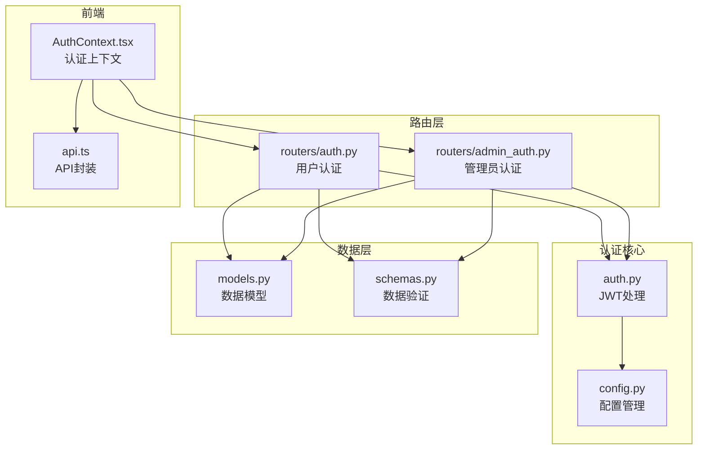

# 认证授权接口

<cite>
**本文档引用的文件**
- [backend/auth.py](file://backend/auth.py)
- [backend/routers/auth.py](file://backend/routers/auth.py)
- [backend/routers/admin_auth.py](file://backend/routers/admin_auth.py)
- [backend/models.py](file://backend/models.py)
- [backend/schemas.py](file://backend/schemas.py)
- [backend/config.py](file://backend/config.py)
- [backend/main.py](file://backend/main.py)
- [frontend/src/context/AuthContext.tsx](file://frontend/src/context/AuthContext.tsx)
- [frontend/src/lib/api.ts](file://frontend/src/lib/api.ts)
- [backend/admin/src/lib/axios.ts](file://backend/admin/src/lib/axios.ts)
</cite>

## 目录
1. [简介](#简介)
2. [项目结构](#项目结构)
3. [核心组件](#核心组件)
4. [架构概览](#架构概览)
5. [详细组件分析](#详细组件分析)
6. [依赖关系分析](#依赖关系分析)
7. [性能考虑](#性能考虑)
8. [故障排除指南](#故障排除指南)
9. [结论](#结论)

## 简介

KunFlix认证授权系统是一个基于JWT的现代化认证解决方案，支持用户认证和管理员认证两种模式。系统采用分离式设计，用户表和管理员表分别存储在不同的数据库表中，通过独立的认证流程实现细粒度的权限控制。

本系统提供了完整的认证生命周期管理，包括用户注册、登录、登出、密码重置等功能，以及基于角色的访问控制（RBAC）机制。JWT令牌采用HS256算法进行签名，支持访问令牌和刷新令牌的双重机制，确保系统的安全性和可用性。

## 项目结构

认证授权系统主要分布在以下模块中：

**图表来源**
- [backend/auth.py:1-229](file://backend/auth.py#L1-L229)
- [backend/routers/auth.py:1-136](file://backend/routers/auth.py#L1-L136)
- [backend/routers/admin_auth.py:1-136](file://backend/routers/admin_auth.py#L1-L136)

**章节来源**
- [backend/auth.py:1-229](file://backend/auth.py#L1-L229)
- [backend/routers/auth.py:1-136](file://backend/routers/auth.py#L1-L136)
- [backend/routers/admin_auth.py:1-136](file://backend/routers/admin_auth.py#L1-L136)

## 核心组件

### JWT令牌管理系统

系统采用JWT（JSON Web Token）作为认证载体，支持两种令牌类型：

**访问令牌（Access Token）**
- 有效期：30分钟（可配置）
- 用途：API请求的身份验证
- 结构：包含用户ID、角色、主体类型、令牌类型等声明

**刷新令牌（Refresh Token）**
- 有效期：7天（可配置）
- 用途：获取新的访问令牌
- 安全机制：独立的刷新流程，防止令牌泄露

### 认证中间件

系统实现了多层认证中间件：

1. **OAuth2PasswordBearer**：标准的OAuth2密码流
2. **get_current_user**：提取用户信息的依赖注入
3. **get_current_active_user**：确保用户账户激活状态
4. **get_current_admin**：管理员认证中间件
5. **get_current_active_admin**：管理员活跃状态验证

### 数据模型

系统采用分离式用户模型设计：

**用户表（users）**
- 基础用户信息：邮箱、昵称、密码哈希
- 状态管理：活跃状态、余额冻结
- 订阅管理：订阅计划、状态、时间范围
- 统计信息：令牌使用量、积分余额

**管理员表（admins）**
- 管理员专用信息：权限级别、积分余额
- 操作统计：令牌使用量统计
- 登录追踪：最后登录时间和IP地址

**章节来源**
- [backend/auth.py:30-156](file://backend/auth.py#L30-L156)
- [backend/models.py:10-73](file://backend/models.py#L10-L73)

## 架构概览

认证系统的整体架构采用分层设计，确保职责分离和安全性：

**图表来源**
- [backend/routers/auth.py:63-99](file://backend/routers/auth.py#L63-L99)
- [backend/auth.py:30-62](file://backend/auth.py#L30-L62)

### 权限验证流程

系统实现了基于角色的访问控制（RBAC）机制：

**图表来源**
- [backend/auth.py:83-156](file://backend/auth.py#L83-L156)

**章节来源**
- [backend/auth.py:83-156](file://backend/auth.py#L83-L156)
- [backend/routers/auth.py:132-135](file://backend/routers/auth.py#L132-L135)

## 详细组件分析

### 用户认证接口

#### 注册接口

**接口定义**
- 方法：POST
- 路径：`/api/auth/register`
- 请求体：UserRegister
- 响应体：UserResponse
- 状态码：201 Created

**请求参数**
- email: 邮箱地址（唯一约束）
- nickname: 昵称（1-100字符）
- password: 密码（至少6字符）

**响应格式**
- 包含用户基本信息和认证状态
- 密码字段不返回明文

**错误码**
- 409 Conflict：邮箱已被注册

**章节来源**
- [backend/routers/auth.py:36-60](file://backend/routers/auth.py#L36-L60)
- [backend/schemas.py:13-17](file://backend/schemas.py#L13-L17)

#### 登录接口

**接口定义**
- 方法：POST
- 路径：`/api/auth/login`
- 请求体：UserLogin
- 响应体：TokenResponse
- 状态码：200 OK

**请求参数**
- email: 用户邮箱
- password: 用户密码

**响应格式**
- access_token: JWT访问令牌
- refresh_token: JWT刷新令牌
- expires_in: 过期时间（秒）
- user: 用户信息

**错误码**
- 401 Unauthorized：邮箱或密码错误
- 403 Forbidden：账户被禁用

**章节来源**
- [backend/routers/auth.py:63-99](file://backend/routers/auth.py#L63-L99)
- [backend/schemas.py:19-22](file://backend/schemas.py#L19-L22)

#### 刷新令牌接口

**接口定义**
- 方法：POST
- 路径：`/api/auth/refresh`
- 请求体：TokenRefresh
- 响应体：AccessTokenResponse

**请求参数**
- refresh_token: 刷新令牌

**响应格式**
- access_token: 新的访问令牌
- expires_in: 过期时间

**错误码**
- 401 Unauthorized：无效的刷新令牌或用户不存在

**章节来源**
- [backend/routers/auth.py:102-129](file://backend/routers/auth.py#L102-L129)
- [backend/schemas.py:24-26](file://backend/schemas.py#L24-L26)

#### 获取当前用户信息

**接口定义**
- 方法：GET
- 路径：`/api/auth/me`
- 响应体：UserResponse

**权限要求**
- 需要有效的访问令牌

**章节来源**
- [backend/routers/auth.py:132-135](file://backend/routers/auth.py#L132-L135)

### 管理员认证接口

#### 管理员登录

**接口定义**
- 方法：POST
- 路径：`/api/admin/auth/login`
- 请求体：AdminLogin
- 响应体：AdminTokenResponse

**请求参数**
- email: 管理员邮箱
- password: 管理员密码

**响应格式**
- 包含管理员信息和JWT令牌
- subject_type设置为"admin"

**错误码**
- 401 Unauthorized：邮箱或密码错误
- 403 Forbidden：管理员账户被禁用

**章节来源**
- [backend/routers/admin_auth.py:36-90](file://backend/routers/admin_auth.py#L36-L90)
- [backend/schemas.py:68-71](file://backend/schemas.py#L68-L71)

#### 管理员令牌刷新

**接口定义**
- 方法：POST
- 路径：`/api/admin/auth/refresh`
- 请求体：TokenRefresh
- 响应体：AccessTokenResponse

**特殊验证**
- 验证令牌类型必须为"refresh"
- 验证subject_type必须为"admin"

**章节来源**
- [backend/routers/admin_auth.py:93-127](file://backend/routers/admin_auth.py#L93-L127)

#### 获取当前管理员信息

**接口定义**
- 方法：GET
- 路径：`/api/admin/auth/me`
- 响应体：AdminResponse

**权限要求**
- 需要有效的管理员访问令牌

**章节来源**
- [backend/routers/admin_auth.py:130-135](file://backend/routers/admin_auth.py#L130-L135)

### JWT令牌生成机制

系统实现了灵活的JWT令牌生成机制：

**图表来源**
- [backend/auth.py:30-75](file://backend/auth.py#L30-L75)
- [backend/config.py:26-30](file://backend/config.py#L26-L30)

**章节来源**
- [backend/auth.py:30-75](file://backend/auth.py#L30-L75)
- [backend/config.py:26-30](file://backend/config.py#L26-L30)

### 认证中间件使用

系统提供了多种认证中间件供不同场景使用：

#### 用户认证中间件

**图表来源**
- [backend/auth.py:83-113](file://backend/auth.py#L83-L113)

#### 管理员认证中间件

管理员认证中间件具有额外的安全验证：

**章节来源**
- [backend/auth.py:119-156](file://backend/auth.py#L119-L156)

### 前端认证集成

前端实现了完整的认证流程，包括令牌管理和自动刷新：

**图表来源**
- [frontend/src/context/AuthContext.tsx:127-140](file://frontend/src/context/AuthContext.tsx#L127-L140)

**章节来源**
- [frontend/src/context/AuthContext.tsx:127-140](file://frontend/src/context/AuthContext.tsx#L127-L140)
- [frontend/src/lib/api.ts:31-81](file://frontend/src/lib/api.ts#L31-L81)

## 依赖关系分析

认证系统的依赖关系清晰明确，遵循单一职责原则：

**图表来源**
- [backend/auth.py:1-229](file://backend/auth.py#L1-L229)
- [backend/routers/auth.py:1-136](file://backend/routers/auth.py#L1-L136)
- [backend/routers/admin_auth.py:1-136](file://backend/routers/admin_auth.py#L1-L136)

**章节来源**
- [backend/auth.py:1-229](file://backend/auth.py#L1-L229)
- [backend/routers/auth.py:1-136](file://backend/routers/auth.py#L1-L136)
- [backend/routers/admin_auth.py:1-136](file://backend/routers/admin_auth.py#L1-L136)

## 性能考虑

### 令牌过期策略

系统采用合理的令牌过期策略平衡安全性和用户体验：

- **访问令牌**：30分钟过期，减少令牌泄露风险
- **刷新令牌**：7天过期，提供较长的会话保持能力
- **自动刷新**：前端实现并发请求排队，避免重复刷新

### 数据库查询优化

认证流程中的数据库查询经过优化：

- 使用异步查询避免阻塞
- 合理的索引设计（邮箱、ID等）
- 最小化查询字段数量

### 缓存策略

建议在生产环境中实施缓存策略：

- 用户信息缓存（短时间）
- 权限检查结果缓存
- 频繁访问的配置信息缓存

## 故障排除指南

### 常见认证问题

**问题1：401未授权错误**
- 检查Authorization头格式是否正确
- 验证JWT令牌是否过期
- 确认用户账户是否激活

**问题2：403禁止访问**
- 验证用户权限级别
- 检查管理员账户状态
- 确认访问的资源权限

**问题3：令牌刷新失败**
- 验证刷新令牌格式
- 检查令牌类型是否正确
- 确认用户是否存在且激活

### 调试技巧

**后端调试**
- 启用详细日志记录
- 检查JWT密钥配置
- 验证数据库连接

**前端调试**
- 检查localStorage存储
- 验证API拦截器配置
- 监控网络请求

**章节来源**
- [backend/auth.py:65-75](file://backend/auth.py#L65-L75)
- [frontend/src/lib/api.ts:31-81](file://frontend/src/lib/api.ts#L31-L81)

## 结论

KunFlix认证授权系统提供了一个完整、安全、易用的认证解决方案。系统采用现代的JWT技术，结合分离式用户模型和RBAC权限控制，能够满足不同场景下的认证需求。

**主要优势**
- 分离式设计确保用户和管理员权限的清晰边界
- 完整的令牌生命周期管理
- 前后端一体化的认证体验
- 灵活的配置选项适应不同部署环境

**安全特性**
- HS256算法保证令牌完整性
- 双令牌机制提升安全性
- 细粒度的权限控制
- 完善的错误处理和日志记录

该系统为KunFlix平台提供了坚实的基础，支持未来的功能扩展和安全增强。