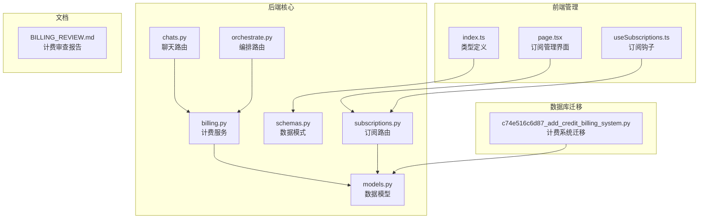
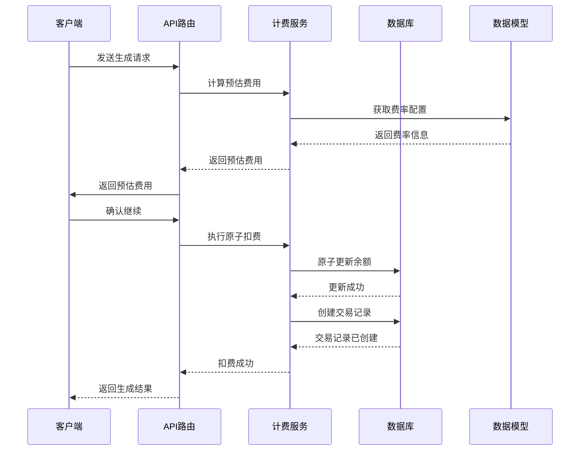
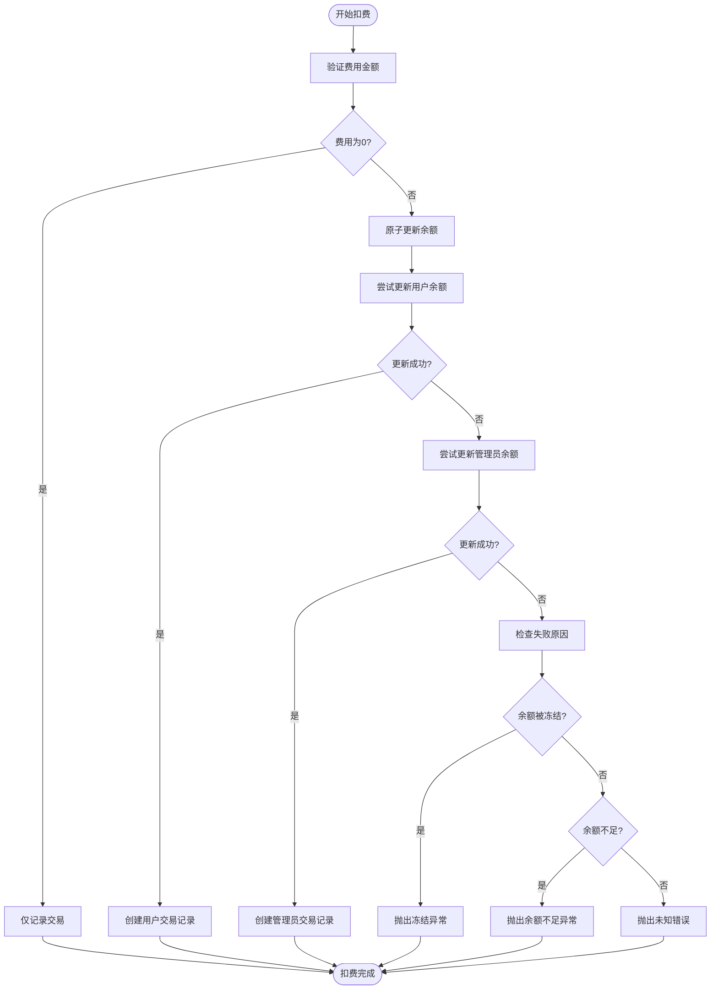
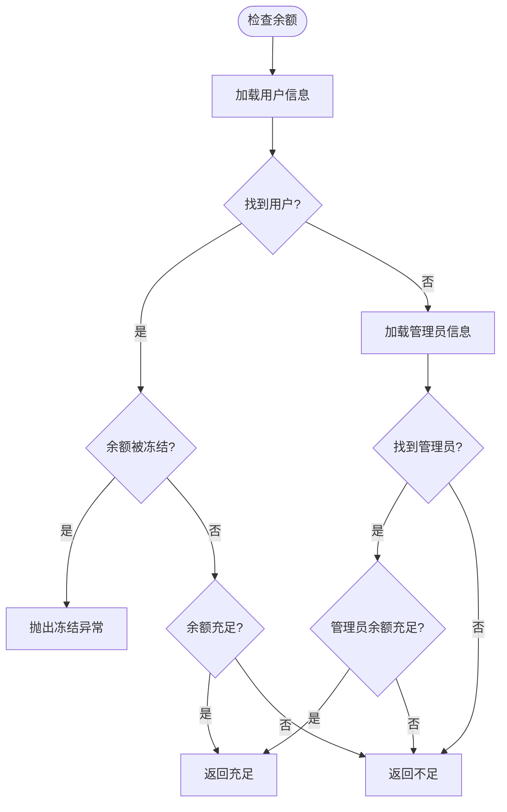
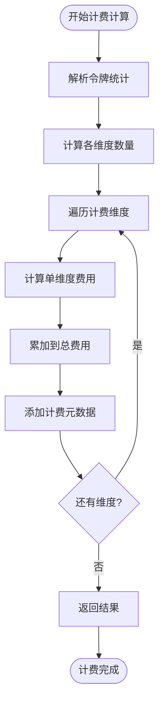
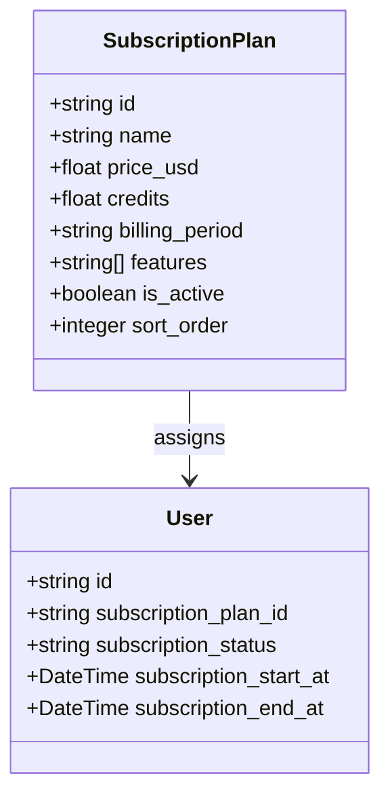
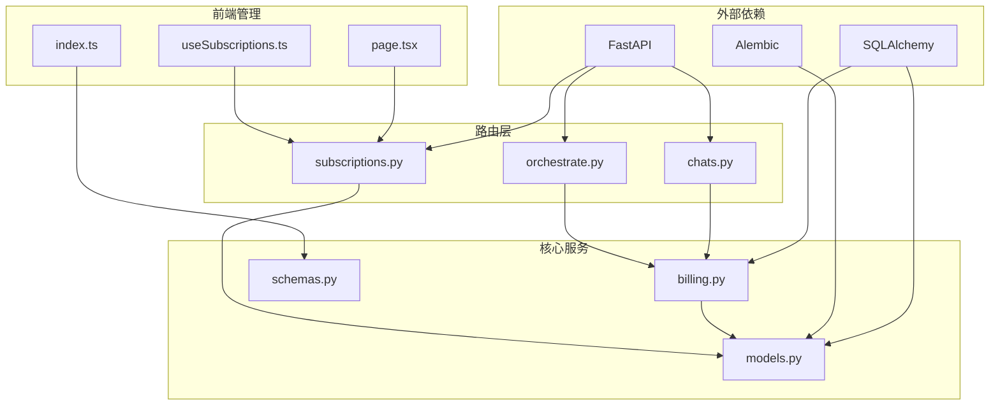

# 计费系统增强

<cite>
**本文档引用的文件**
- [billing.py](file://backend/services/billing.py)
- [models.py](file://backend/models.py)
- [c74e516c6d87_add_credit_billing_system.py](file://backend/migrations/versions/c74e516c6d87_add_credit_billing_system.py)
- [schemas.py](file://backend/schemas.py)
- [chats.py](file://backend/routers/chats.py)
- [orchestrate.py](file://backend/routers/orchestrate.py)
- [subscriptions.py](file://backend/routers/subscriptions.py)
- [BILLING_REVIEW.md](file://backend/docs/BILLING_REVIEW.md)
- [page.tsx](file://backend/admin/src/app/admin/subscriptions/page.tsx)
- [useSubscriptions.ts](file://backend/admin/src/hooks/useSubscriptions.ts)
- [index.ts](file://backend/admin/src/types/index.ts)
- [main.py](file://backend/main.py)
- [video_generation.py](file://backend/services/video_generation.py)
</cite>

## 目录
1. [简介](#简介)
2. [项目结构](#项目结构)
3. [核心组件](#核心组件)
4. [架构概览](#架构概览)
5. [详细组件分析](#详细组件分析)
6. [依赖关系分析](#依赖关系分析)
7. [性能考虑](#性能考虑)
8. [故障排除指南](#故障排除指南)
9. [结论](#结论)
10. [附录](#附录)

## 简介

Infinite Game 项目的计费系统增强是一个全面的积分计费解决方案，旨在为多模态 AI 生成服务提供精确、安全和可扩展的计费机制。该系统支持文本、图像、视频等多种模态的计费，具备原子性扣费、余额检查、交易记录等功能。

系统的核心特点包括：
- 多维度计费模型（输入、输出、图像、搜索）
- 原子性数据库操作防止并发问题
- 完整的交易记录和审计跟踪
- 支持管理员和用户双重账户体系
- 可扩展的视频生成计费
- 前后端一体化的订阅管理

## 项目结构

计费系统主要分布在以下关键目录中：



**图表来源**
- [billing.py:1-386](file://backend/services/billing.py#L1-L386)
- [models.py:1-440](file://backend/models.py#L1-L440)
- [c74e516c6d87_add_credit_billing_system.py:1-67](file://backend/migrations/versions/c74e516c6d87_add_credit_billing_system.py#L1-L67)

**章节来源**
- [main.py:138-152](file://backend/main.py#L138-L152)
- [models.py:1-440](file://backend/models.py#L1-L440)

## 核心组件

### 计费维度映射表

系统采用映射表驱动的设计模式，定义了清晰的计费维度：

| 维度名称 | 字段映射 | 缩放因子 | 用途 |
|---------|---------|---------|------|
| input | input_credit_per_1m | 1,000,000 | 输入令牌计费 |
| text_output | output_credit_per_1m | 1,000,000 | 文本输出令牌计费 |
| image_output | image_output_credit_per_1m | 1,000,000 | 图像输出令牌计费 |
| search | search_credit_per_query | 1 | 搜索查询计费 |

### 视频计费维度

视频生成服务具有专门的计费维度：

| 维度名称 | 缩放因子 | 用途 |
|---------|---------|------|
| video_input_image | 1 | 每张输入图片 |
| video_input_second | 1 | 每秒输入视频 |
| video_output_480p | 1 | 每秒480p输出 |
| video_output_720p | 1 | 每秒720p输出 |

**章节来源**
- [billing.py:12-34](file://backend/services/billing.py#L12-L34)
- [billing.py:21-34](file://backend/services/billing.py#L21-L34)

### 数据模型架构

计费系统涉及多个核心数据模型：

```mermaid
classDiagram
class User {
+string id
+float credits
+boolean is_balance_frozen
+BigInteger total_input_tokens
+BigInteger total_output_tokens
}
class Admin {
+string id
+string email
+float credits
+BigInteger total_input_tokens
+BigInteger total_output_tokens
}
class Agent {
+string id
+string name
+float input_credit_per_1m
+float output_credit_per_1m
+float image_output_credit_per_1m
+float search_credit_per_query
}
class CreditTransaction {
+string id
+string user_id
+string agent_id
+string session_id
+string transaction_type
+float amount
+float balance_before
+float balance_after
+integer input_tokens
+integer output_tokens
}
User ||--o{ CreditTransaction : creates
Admin ||--o{ CreditTransaction : creates
Agent ||--o{ CreditTransaction : charges
```

**图表来源**
- [models.py:35-73](file://backend/models.py#L35-L73)
- [models.py:10-33](file://backend/models.py#L10-L33)
- [models.py:196-246](file://backend/models.py#L196-L246)
- [models.py:254-274](file://backend/models.py#L254-L274)

**章节来源**
- [models.py:35-73](file://backend/models.py#L35-L73)
- [models.py:196-246](file://backend/models.py#L196-L246)
- [models.py:254-274](file://backend/models.py#L254-L274)

## 架构概览

计费系统的整体架构采用分层设计，确保了系统的可维护性和扩展性：



**图表来源**
- [billing.py:177-307](file://backend/services/billing.py#L177-L307)
- [chats.py:667-697](file://backend/routers/chats.py#L667-L697)

## 详细组件分析

### 原子扣费服务

原子扣费是计费系统的核心安全机制，通过数据库层面的原子操作防止并发问题：



**图表来源**
- [billing.py:177-286](file://backend/services/billing.py#L177-L286)

#### 关键特性

1. **原子性保证**：使用数据库的 UPDATE 语句确保扣费操作的原子性
2. **并发安全**：通过数据库层面的锁机制防止竞态条件
3. **双账户支持**：同时支持用户和管理员账户的扣费
4. **异常处理**：详细的异常分类和错误信息

**章节来源**
- [billing.py:177-307](file://backend/services/billing.py#L177-L307)

### 余额检查机制

余额检查是防止透支的重要安全机制：



**图表来源**
- [billing.py:44-83](file://backend/services/billing.py#L44-L83)

**章节来源**
- [billing.py:44-83](file://backend/services/billing.py#L44-L83)

### 计费计算引擎

计费计算引擎采用映射表驱动的设计，支持多种模态的灵活计费：



**图表来源**
- [billing.py:309-348](file://backend/services/billing.py#L309-L348)

#### 多模态支持

系统支持以下模态的计费：

1. **文本模态**：输入令牌和输出令牌分别计费
2. **图像模态**：基于图像输出令牌计费
3. **搜索模态**：基于搜索查询次数计费
4. **视频模态**：基于输入图片数量和输出时长计费

**章节来源**
- [billing.py:309-385](file://backend/services/billing.py#L309-L385)

### 交易记录系统

完整的交易记录系统提供了审计和追溯能力：

| 字段名称 | 数据类型 | 描述 | 索引 |
|---------|---------|------|------|
| id | String | 交易ID | 主键 |
| user_id | String | 用户ID | 外键 |
| agent_id | String | 智能体ID | 外键 |
| session_id | String | 会话ID | 外键 |
| transaction_type | String | 交易类型 | - |
| amount | Float | 金额 | - |
| balance_before | Float | 余额前值 | - |
| balance_after | Float | 余额后值 | - |
| input_tokens | Integer | 输入令牌数 | - |
| output_tokens | Integer | 输出令牌数 | - |
| metadata_json | JSON | 元数据 | - |
| description | Text | 描述 | - |
| created_at | DateTime | 创建时间 | - |

**章节来源**
- [models.py:254-274](file://backend/models.py#L254-L274)

### 订阅管理系统

订阅管理提供了灵活的套餐管理和计费策略：



**图表来源**
- [models.py:362-382](file://backend/models.py#L362-L382)
- [models.py:35-73](file://backend/models.py#L35-L73)

**章节来源**
- [subscriptions.py:1-119](file://backend/routers/subscriptions.py#L1-L119)
- [BILLING_REVIEW.md:88-127](file://backend/docs/BILLING_REVIEW.md#L88-L127)

## 依赖关系分析

计费系统的依赖关系体现了清晰的分层架构：



**图表来源**
- [main.py:138-152](file://backend/main.py#L138-L152)
- [billing.py:1-10](file://backend/services/billing.py#L1-L10)

**章节来源**
- [main.py:138-152](file://backend/main.py#L138-L152)

## 性能考虑

### 并发性能优化

1. **原子操作**：使用数据库原子更新避免锁竞争
2. **批量操作**：支持批量扣费减少数据库往返
3. **缓存策略**：费率配置可缓存减少查询开销

### 数据库性能

1. **索引优化**：为常用查询字段建立索引
2. **连接池**：使用异步连接池提高并发性能
3. **查询优化**：最小化查询字段减少网络开销

### 内存管理

1. **流式处理**：支持大文件的流式处理
2. **垃圾回收**：及时释放临时对象
3. **内存监控**：监控内存使用情况

## 故障排除指南

### 常见问题诊断

#### 余额不足错误
- **症状**：扣费时抛出余额不足异常
- **原因**：用户余额小于所需费用
- **解决**：检查用户充值记录和当前余额

#### 余额冻结错误
- **症状**：扣费时抛出余额冻结异常
- **原因**：用户账户被管理员冻结
- **解决**：检查账户状态和管理员操作记录

#### 并发冲突
- **症状**：扣费操作失败但余额看起来正确
- **原因**：多个进程同时扣费导致竞态条件
- **解决**：检查原子扣费逻辑和数据库锁

### 调试工具

1. **日志分析**：查看详细的计费日志
2. **数据库监控**：监控数据库查询性能
3. **API测试**：使用测试工具验证计费逻辑

**章节来源**
- [billing.py:36-42](file://backend/services/billing.py#L36-L42)
- [billing.py:257-286](file://backend/services/billing.py#L257-L286)

## 结论

Infinite Game 的计费系统增强项目实现了以下目标：

### 技术成就

1. **原子性保证**：通过数据库层面的操作确保计费安全
2. **多模态支持**：支持文本、图像、视频等多种生成服务
3. **扩展性设计**：模块化的架构便于功能扩展
4. **审计能力**：完整的交易记录提供完整的审计跟踪

### 商业价值

1. **成本控制**：精确的计费帮助控制运营成本
2. **用户体验**：透明的计费机制提升用户信任
3. **收入增长**：灵活的定价策略支持业务发展
4. **合规保障**：完善的记录系统满足合规要求

### 未来发展方向

1. **实时计费**：实现更精细的实时计费机制
2. **预测计费**：基于历史数据预测费用
3. **智能定价**：动态调整价格策略
4. **多币种支持**：支持国际化业务需求

## 附录

### API 接口规范

#### 计费相关接口

| 接口 | 方法 | 描述 |
|------|------|------|
| `/api/chats/stream` | POST | 流式聊天生成 |
| `/api/orchestrate/` | POST | 多智能体编排 |
| `/api/admin/subscriptions/` | GET/POST/PUT/DELETE | 订阅管理 |

#### 计费事件格式

```json
{
  "credit_cost": 10.5,
  "insufficient": false,
  "frozen": false,
  "remaining_credits": 989.5,
  "transaction_id": "txn_123456"
}
```

### 配置参数

#### 计费参数

| 参数 | 类型 | 默认值 | 描述 |
|------|------|--------|------|
| input_credit_per_1m | float | 0.0 | 每百万输入令牌费用 |
| output_credit_per_1m | float | 0.0 | 每百万输出令牌费用 |
| credits | float | 0.0 | 初始积分余额 |

### 最佳实践

1. **预估费用**：在执行昂贵操作前先估算费用
2. **异常处理**：妥善处理各种计费异常情况
3. **日志记录**：详细记录所有计费操作
4. **定期审计**：定期检查计费准确性