# 画布拖拽增强功能文档

<cite>
**本文档引用的文件**
- [useCanvasDragDrop.ts](file://frontend/src/app/theater/[id]/hooks/useCanvasDragDrop.ts)
- [useNodeDragToAI.ts](file://frontend/src/app/theater/[id]/hooks/useNodeDragToAI.ts)
- [useCanvasStore.ts](file://frontend/src/store/useCanvasStore.ts)
- [useAIAssistantStore.ts](file://frontend/src/store/useAIAssistantStore.ts)
- [TheaterCanvas.tsx](file://frontend/src/components/TheaterCanvas.tsx)
- [AIAssistantPanel.tsx](file://frontend/src/components/canvas/AIAssistantPanel.tsx)
- [NodePreviewCard.tsx](file://frontend/src/components/ai-assistant/NodePreviewCard.tsx)
- [nodeAttachmentUtils.ts](file://frontend/src/lib/nodeAttachmentUtils.ts)
- [CharacterNode.tsx](file://frontend/src/components/canvas/CharacterNode.tsx)
- [ScriptNode.tsx](file://frontend/src/components/canvas/ScriptNode.tsx)
- [StoryboardNode.tsx](file://frontend/src/components/canvas/StoryboardNode.tsx)
- [VideoNode.tsx](file://frontend/src/components/canvas/VideoNode.tsx)
- [graphUtils.ts](file://frontend/src/lib/graphUtils.ts)
- [page.tsx](file://frontend/src/app/theater/[id]/page.tsx)
- [CustomEdge.tsx](file://frontend/src/components/canvas/CustomEdge.tsx)
- [Sidebar.tsx](file://frontend/src/components/canvas/Sidebar.tsx)
- [useCanvasSnapping.ts](file://frontend/src/app/theater/[id]/hooks/useCanvasSnapping.ts)
- [theaterApi.ts](file://frontend/src/lib/theaterApi.ts)
- [package.json](file://frontend/package.json)
</cite>

## 更新摘要
**所做更改**
- 新增多图片拖拽到AI面板的完整实现分析
- 更新useNodeDragToAI钩子为支持多选节点拖拽功能
- 新增NodePreviewList组件分析，支持多图横向排列
- 更新节点附件存储为支持多附件管理（最多5个）
- 扩展AI拖拽增强功能的架构说明
- 更新故障排除指南，包含多图片拖拽相关问题

## 目录
1. [项目概述](#项目概述)
2. [项目结构](#项目结构)
3. [核心组件](#核心组件)
4. [架构概览](#架构概览)
5. [详细组件分析](#详细组件分析)
6. [新增AI拖拽增强功能](#新增ai拖拽增强功能)
7. [多图片拖拽到AI面板实现](#多图片拖拽到ai面板实现)
8. [依赖关系分析](#依赖关系分析)
9. [性能考虑](#性能考虑)
10. [故障排除指南](#故障排除指南)
11. [结论](#结论)

## 项目概述

Canvas Drag Drop Enhancements 是一个基于 React 和 Next.js 构建的无限叙事剧场应用，专注于提供强大的画布拖拽和节点管理功能。该系统集成了 React Flow 进行可视化布局，并提供了完整的节点拖拽、连接、对齐和同步功能。

**更新** 新增了AI拖拽增强功能，允许用户将画布节点直接拖拽到AI助手面板进行智能创作和编辑。**新增** 多图片拖拽功能支持一次拖拽多个图片节点到AI面板，最多支持5个附件。

主要特性包括：
- 支持多种节点类型的拖拽添加（文本、图片、视频、故事板）
- 实时文件拖拽导入功能
- 智能对齐和吸附功能
- 节点连接和关系管理
- 自动保存和版本控制
- 响应式设计和高性能渲染
- **新增** AI助手拖拽集成，支持节点到AI的直接交互
- **新增** 节点预览和附件管理功能
- **新增** 多图片拖拽到AI面板功能，支持最多5个附件
- **新增** 智能附件提取和管理机制

## 项目结构

前端项目采用模块化架构，主要分为以下几个核心部分：

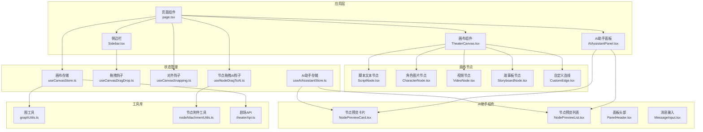

**图表来源**
- [page.tsx:1-905](file://frontend/src/app/theater/[id]/page.tsx#L1-L905)
- [useCanvasStore.ts:1-540](file://frontend/src/store/useCanvasStore.ts#L1-L540)
- [useAIAssistantStore.ts:1-369](file://frontend/src/store/useAIAssistantStore.ts#L1-L369)
- [AIAssistantPanel.tsx:1-587](file://frontend/src/components/canvas/AIAssistantPanel.tsx#L1-L587)

**章节来源**
- [page.tsx:1-905](file://frontend/src/app/theater/[id]/page.tsx#L1-L905)
- [package.json:1-94](file://frontend/package.json#L1-L94)

## 核心组件

### 画布拖拽钩子系统

`useCanvasDragDrop` 钩子提供了完整的拖拽功能实现：

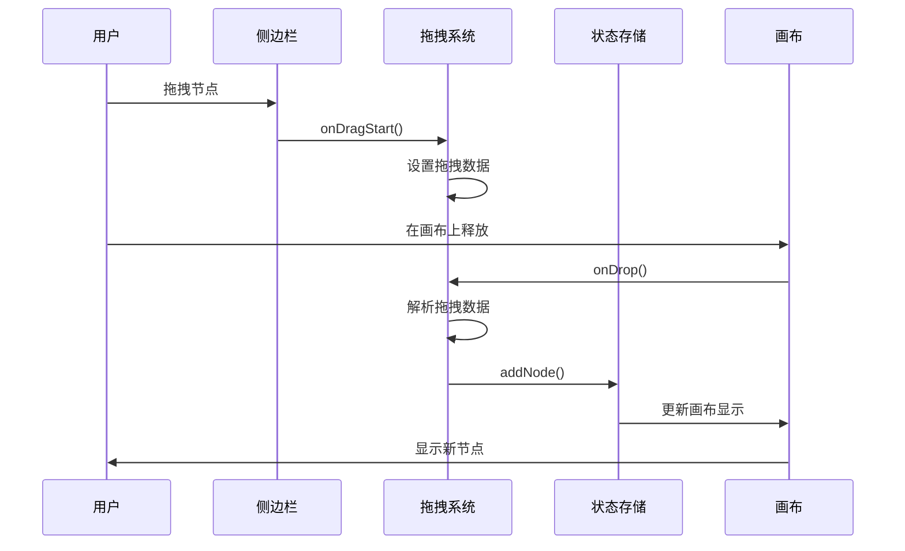

**图表来源**
- [useCanvasDragDrop.ts:1-74](file://frontend/src/app/theater/[id]/hooks/useCanvasDragDrop.ts#L1-L74)
- [Sidebar.tsx:88-118](file://frontend/src/components/canvas/Sidebar.tsx#L88-L118)

### 画布存储管理系统

`useCanvasStore` 提供了集中式的状态管理，包含以下核心功能：

- **节点管理**：添加、删除、更新节点
- **连接管理**：创建、删除、验证连接关系
- **历史记录**：撤销/重做功能
- **同步机制**：与后端数据库实时同步
- **设置管理**：网格吸附、对齐指南等

**章节来源**
- [useCanvasStore.ts:1-540](file://frontend/src/store/useCanvasStore.ts#L1-L540)

## 架构概览

系统采用分层架构设计，确保各组件职责清晰且可维护。**更新** 新增了AI拖拽增强功能的架构集成：

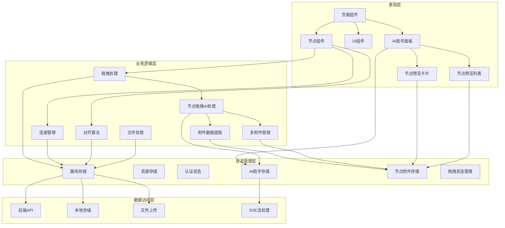

**图表来源**
- [page.tsx:54-92](file://frontend/src/app/theater/[id]/page.tsx#L54-L92)
- [useCanvasStore.ts:185-540](file://frontend/src/store/useCanvasStore.ts#L185-L540)
- [useNodeDragToAI.ts:1-123](file://frontend/src/app/theater/[id]/hooks/useNodeDragToAI.ts#L1-L123)
- [useAIAssistantStore.ts:76-181](file://frontend/src/store/useAIAssistantStore.ts#L76-L181)

## 详细组件分析

### 拖拽系统实现

#### 拖拽数据格式规范

系统使用标准化的数据传输格式来确保跨组件的兼容性：

| 数据类型 | 键名 | 描述 | 示例值 |
|---------|------|------|--------|
| 节点类型 | `application/reactflow` | 节点类型标识 | `"text"`, `"image"` |
| 节点数据 | `application/reactflow-data` | 节点初始数据 | `{title: "新文本卡"}` |
| 节点尺寸 | `application/reactflow-dimensions` | 节点默认尺寸 | `{"width": 400, "height": 300}` |

#### 文件拖拽处理流程

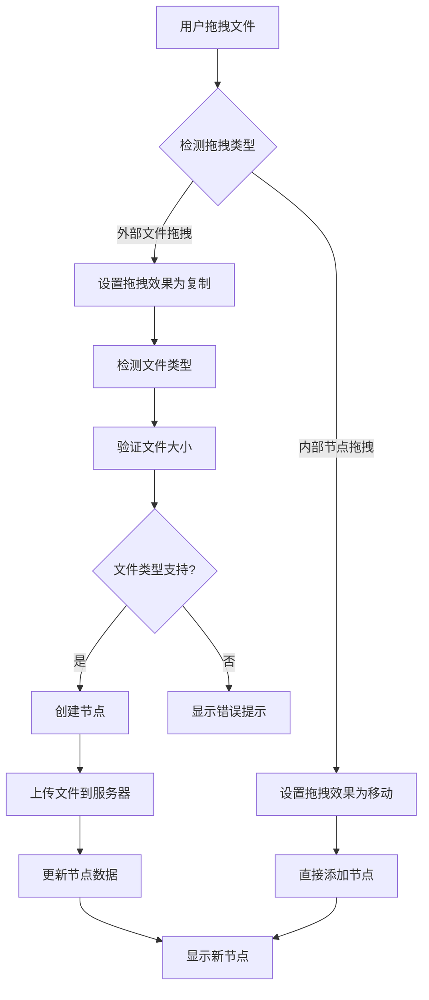

**图表来源**
- [page.tsx:512-653](file://frontend/src/app/theater/[id]/page.tsx#L512-L653)
- [Sidebar.tsx:88-118](file://frontend/src/components/canvas/Sidebar.tsx#L88-L118)

**章节来源**
- [page.tsx:277-510](file://frontend/src/app/theater/[id]/page.tsx#L277-L510)
- [useCanvasDragDrop.ts:10-70](file://frontend/src/app/theater/[id]/hooks/useCanvasDragDrop.ts#L10-L70)

### 节点类型系统

#### 文本节点（ScriptNode）

文本节点支持富文本编辑和标签管理：

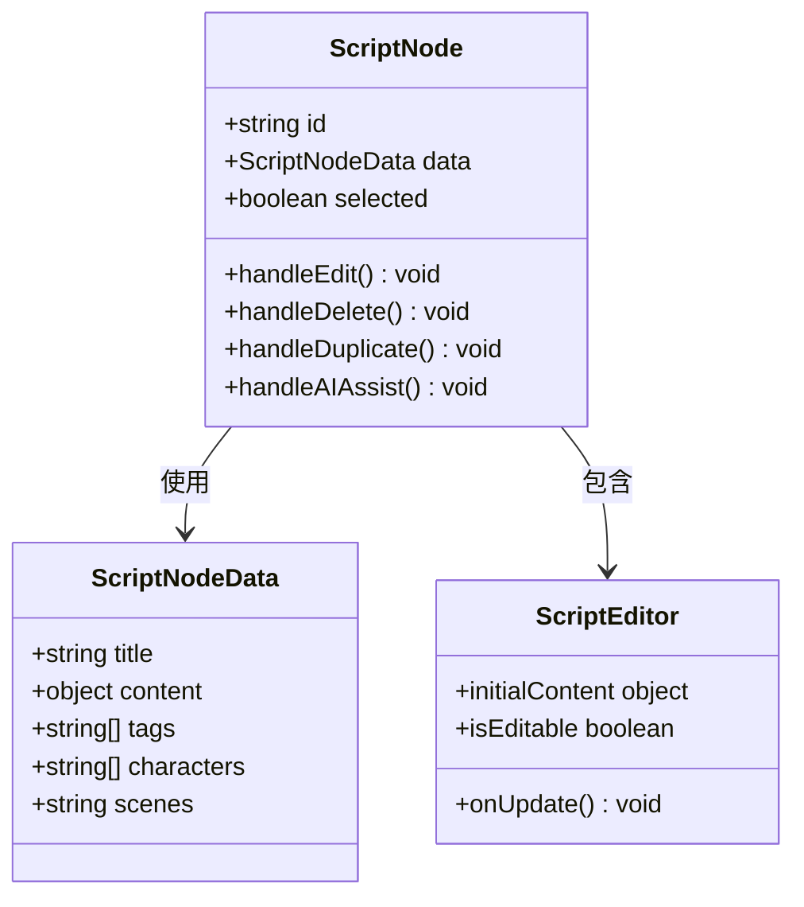

**图表来源**
- [ScriptNode.tsx:11-261](file://frontend/src/components/canvas/ScriptNode.tsx#L11-L261)
- [useCanvasStore.ts:27-33](file://frontend/src/store/useCanvasStore.ts#L27-L33)

#### 图片节点（CharacterNode）

图片节点提供完整的图片管理和编辑功能：

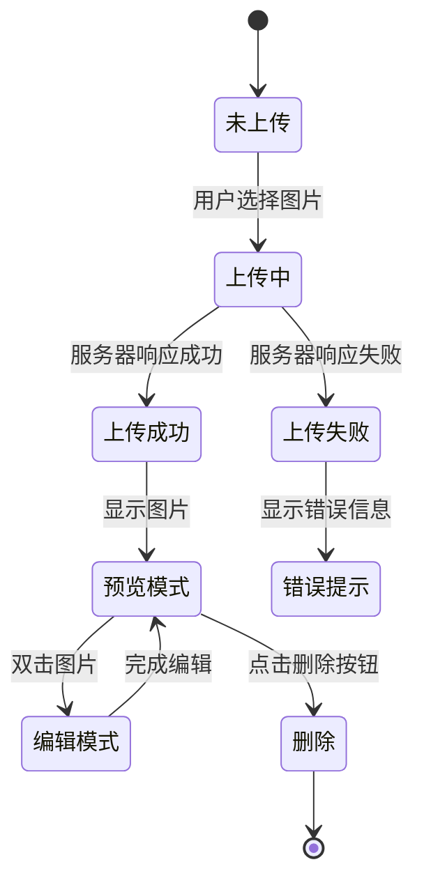

**图表来源**
- [CharacterNode.tsx:13-596](file://frontend/src/components/canvas/CharacterNode.tsx#L13-L596)

**章节来源**
- [CharacterNode.tsx:105-204](file://frontend/src/components/canvas/CharacterNode.tsx#L105-L204)
- [VideoNode.tsx:107-185](file://frontend/src/components/canvas/VideoNode.tsx#L107-L185)

### 对齐和吸附系统

#### 智能对齐算法

对齐系统通过计算节点边缘距离来实现精确的对齐效果：

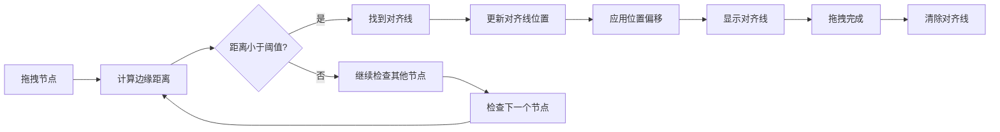

**图表来源**
- [useCanvasSnapping.ts:12-90](file://frontend/src/app/theater/[id]/hooks/useCanvasSnapping.ts#L12-L90)

**章节来源**
- [useCanvasSnapping.ts:1-98](file://frontend/src/app/theater/[id]/hooks/useCanvasSnapping.ts#L1-L98)

### 连接管理系统

#### 循环检测算法

系统内置循环检测机制，防止创建无效的循环连接：

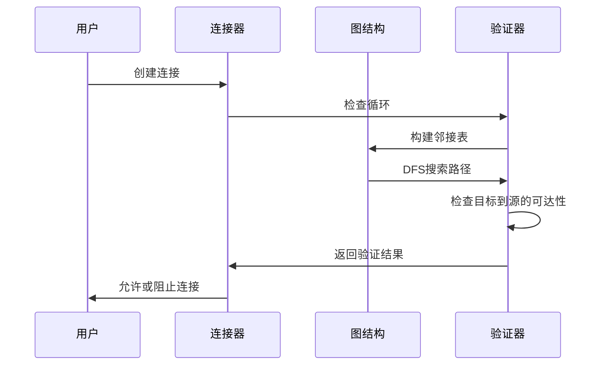

**图表来源**
- [graphUtils.ts:4-38](file://frontend/src/lib/graphUtils.ts#L4-L38)

**章节来源**
- [useCanvasStore.ts:238-254](file://frontend/src/store/useCanvasStore.ts#L238-L254)
- [graphUtils.ts:1-39](file://frontend/src/lib/graphUtils.ts#L1-L39)

## 新增AI拖拽增强功能

### 节点拖拽到AI功能

**useNodeDragToAI** 钩子实现了画布节点到AI助手面板的拖拽功能，提供完整的拖拽检测和状态管理。

#### 拖拽检测流程

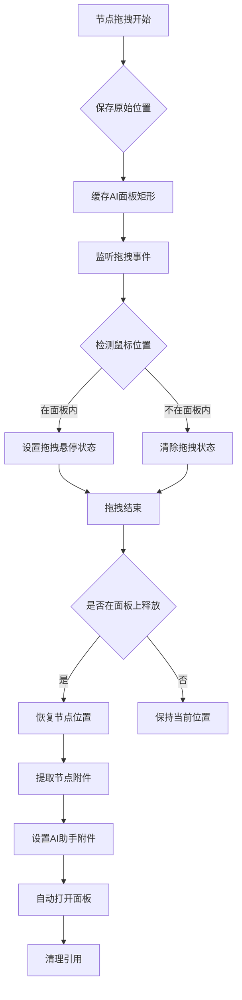

**图表来源**
- [useNodeDragToAI.ts:28-119](file://frontend/src/app/theater/[id]/hooks/useNodeDragToAI.ts#L28-L119)

#### 节点附件数据提取

`nodeAttachmentUtils` 模块提供了统一的节点数据提取机制，支持所有节点类型的附件转换：

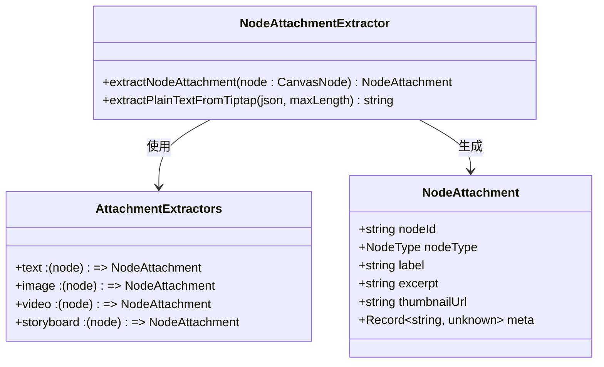

**图表来源**
- [nodeAttachmentUtils.ts:74-84](file://frontend/src/lib/nodeAttachmentUtils.ts#L74-L84)
- [useAIAssistantStore.ts:76-84](file://frontend/src/store/useAIAssistantStore.ts#L76-L84)

**章节来源**
- [useNodeDragToAI.ts:1-123](file://frontend/src/app/theater/[id]/hooks/useNodeDragToAI.ts#L1-L123)
- [nodeAttachmentUtils.ts:1-97](file://frontend/src/lib/nodeAttachmentUtils.ts#L1-L97)

### 节点预览卡片组件

**NodePreviewCard** 组件负责在AI助手面板中显示被拖拽节点的预览信息，提供直观的视觉反馈。

#### 预览卡片设计

| 节点类型 | 图标 | 颜色主题 | 缩略图显示 |
|---------|------|----------|------------|
| 文本节点 | ScrollText | 蓝色系 | 否 |
| 图片节点 | ImageIcon | 绿色系 | 是 |
| 视频节点 | Film | 黄色系 | 是 |
| 故事板节点 | Clapperboard | 紫色系 | 否 |

#### 预览卡片交互

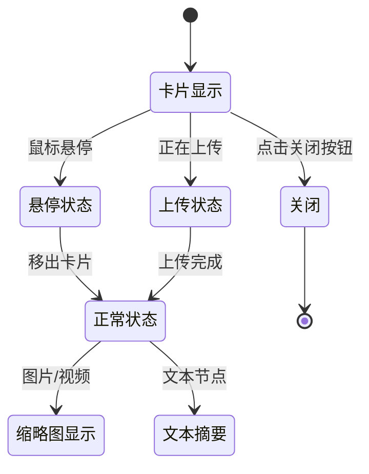

**图表来源**
- [NodePreviewCard.tsx:32-109](file://frontend/src/components/ai-assistant/NodePreviewCard.tsx#L32-L109)

**章节来源**
- [NodePreviewCard.tsx:1-213](file://frontend/src/components/ai-assistant/NodePreviewCard.tsx#L1-L213)

### AI助手存储管理

**useAIAssistantStore** 扩展了原有的存储管理，新增了节点附件和拖拽状态的管理功能。

#### 新增存储状态

| 状态名称 | 类型 | 描述 |
|---------|------|------|
| nodeAttachments | NodeAttachment[] | 当前拖拽到面板的节点附件数组 |
| isDragOverPanel | boolean | 拖拽悬停状态 |
| imageEditContext | ImageEditContext | 图像编辑上下文 |

#### 互斥状态管理

AI助手存储实现了智能的状态互斥机制，确保节点附件和图像编辑上下文不会同时存在：

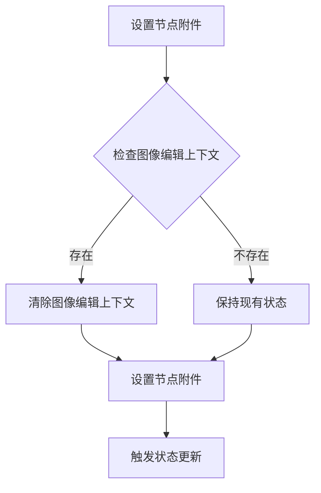

**图表来源**
- [useAIAssistantStore.ts:306-312](file://frontend/src/store/useAIAssistantStore.ts#L306-L312)

**章节来源**
- [useAIAssistantStore.ts:76-181](file://frontend/src/store/useAIAssistantStore.ts#L76-L181)
- [useAIAssistantStore.ts:306-322](file://frontend/src/store/useAIAssistantStore.ts#L306-L322)

### 页面集成实现

**页面组件** 将AI拖拽功能与现有的画布系统无缝集成，实现了组合拖拽回调的协调工作。

#### 组合拖拽回调

页面组件通过组合函数实现了多个拖拽钩子的协调工作：

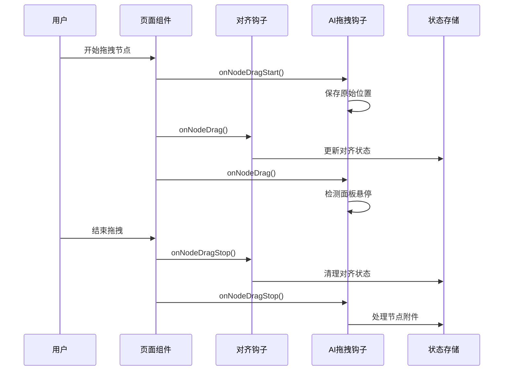

**图表来源**
- [page.tsx:95-119](file://frontend/src/app/theater/[id]/page.tsx#L95-L119)

**章节来源**
- [page.tsx:95-119](file://frontend/src/app/theater/[id]/page.tsx#L95-L119)

## 多图片拖拽到AI面板实现

### 多选拖拽功能

**useNodeDragToAI** 钩子现已支持多选节点拖拽功能，用户可以通过按住Ctrl或Meta键来选择多个节点进行拖拽。

#### 多选检测逻辑

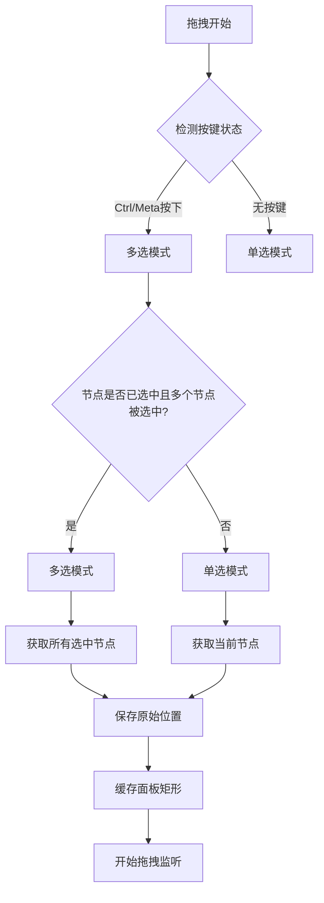

**图表来源**
- [useNodeDragToAI.ts:32-52](file://frontend/src/app/theater/[id]/hooks/useNodeDragToAI.ts#L32-L52)

#### 附件提取和管理

当节点被拖拽到AI面板时，系统会执行智能附件提取和管理：

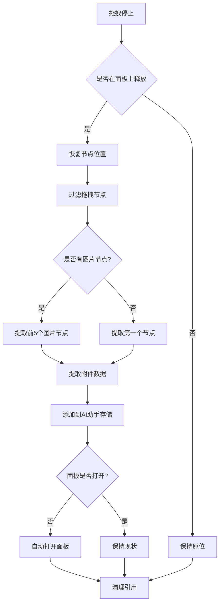

**图表来源**
- [useNodeDragToAI.ts:69-119](file://frontend/src/app/theater/[id]/hooks/useNodeDragToAI.ts#L69-L119)

#### NodePreviewList组件

**NodePreviewList** 组件负责在AI助手面板中显示多个拖拽节点的预览信息，支持横向排列和纵向排列的混合布局。

##### 多图横向排列

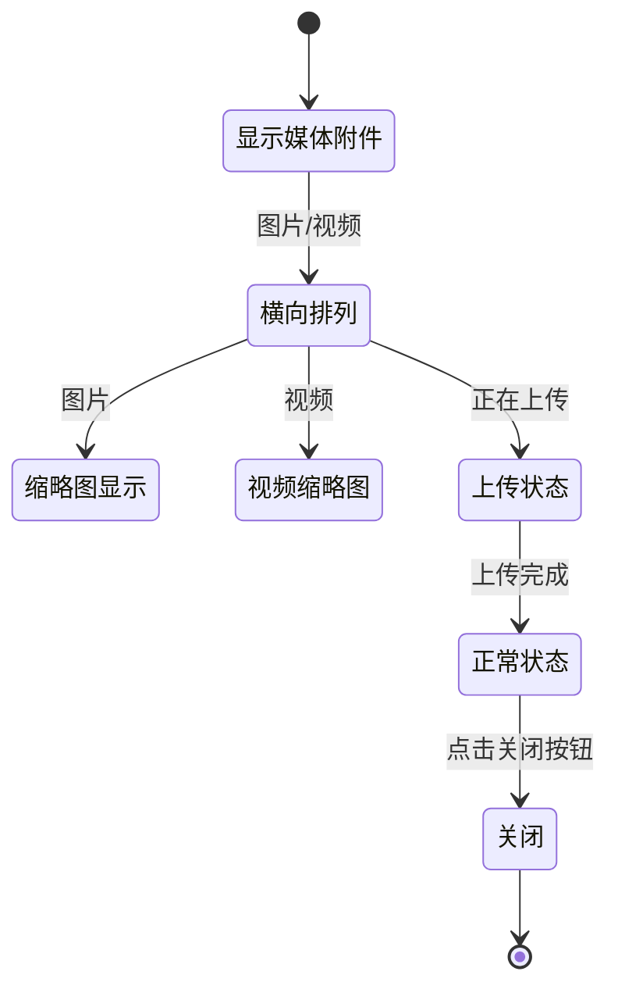

**图表来源**
- [NodePreviewCard.tsx:151-201](file://frontend/src/components/ai-assistant/NodePreviewCard.tsx#L151-L201)

##### 文本节点纵向排列

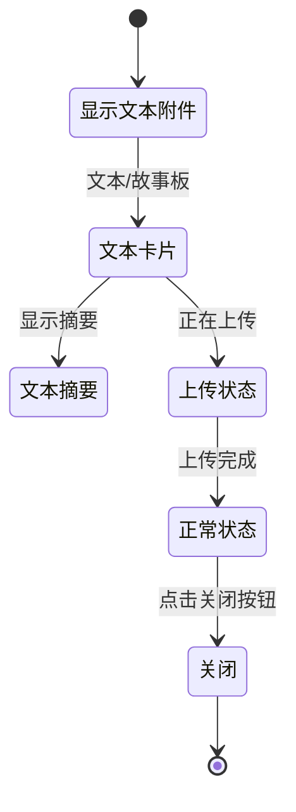

**图表来源**
- [NodePreviewCard.tsx:92-140](file://frontend/src/components/ai-assistant/NodePreviewCard.tsx#L92-L140)

**章节来源**
- [useNodeDragToAI.ts:1-123](file://frontend/src/app/theater/[id]/hooks/useNodeDragToAI.ts#L1-L123)
- [NodePreviewCard.tsx:142-213](file://frontend/src/components/ai-assistant/NodePreviewCard.tsx#L142-L213)

### AI助手存储的多附件支持

**useAIAssistantStore** 已更新为支持多附件管理，最多支持5个附件：

#### 多附件存储状态

| 状态名称 | 类型 | 描述 | 限制 |
|---------|------|------|------|
| nodeAttachments | NodeAttachment[] | 节点附件数组 | 最多5个 |
| isDragOverPanel | boolean | 拖拽悬停状态 | 互斥于图像编辑上下文 |
| imageEditContext | ImageEditContext | 图像编辑上下文 | 互斥于节点附件 |

#### 附件管理API

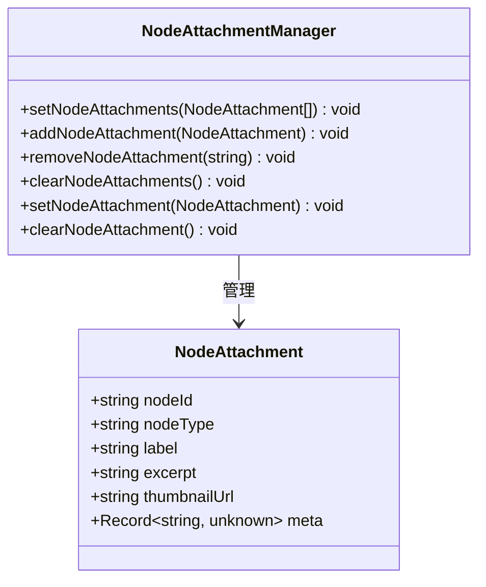

**图表来源**
- [useAIAssistantStore.ts:318-336](file://frontend/src/store/useAIAssistantStore.ts#L318-L336)

**章节来源**
- [useAIAssistantStore.ts:315-369](file://frontend/src/store/useAIAssistantStore.ts#L315-L369)

### 页面集成实现

**页面组件** 已更新为支持多图片拖拽功能的集成：

#### 组合拖拽回调

页面组件通过组合函数实现了多个拖拽钩子的协调工作：

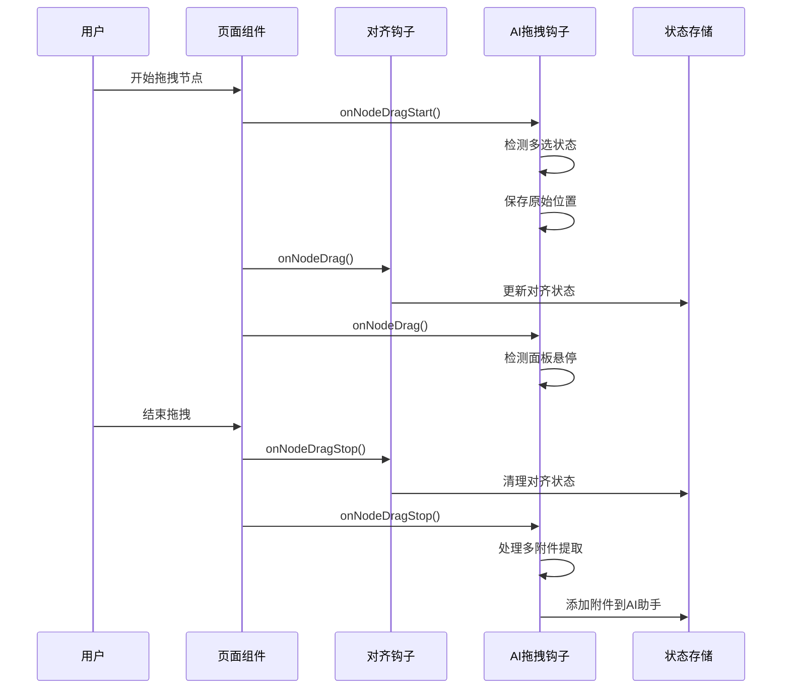

**图表来源**
- [page.tsx:95-121](file://frontend/src/app/theater/[id]/page.tsx#L95-L121)

**章节来源**
- [page.tsx:95-121](file://frontend/src/app/theater/[id]/page.tsx#L95-L121)

## 依赖关系分析

### 核心依赖关系

```mermaid
graph TB
subgraph "React Flow 生态"
A[@xyflow/react]
B[React Flow Provider]
C[Handle 组件]
end
subgraph "状态管理"
D[zustand]
E[persist middleware]
F[画布存储]
G[AI助手存储]
end
subgraph "UI 组件库"
H[lucide-react]
I[Radix UI]
J[framer-motion]
end
subgraph "工具库"
K[uuid]
L[axios]
M[tiptap]
N[nodeAttachmentUtils]
O[graphUtils]
end
A --> B
A --> C
D --> E
F --> G
G --> D
H --> I
A --> K
F --> O
G --> N
J --> H
```

**图表来源**
- [package.json:13-69](file://frontend/package.json#L13-L69)

### 组件间依赖关系

```mermaid
graph LR
A[page.tsx] --> B[useCanvasStore.ts]
A --> C[Sidebar.tsx]
A --> D[ReactFlow]
A --> E[useNodeDragToAI.ts]
C --> F[useCanvasDragDrop.ts]
B --> G[theaterApi.ts]
B --> H[graphUtils.ts]
I[ScriptNode.tsx] --> B
J[CharacterNode.tsx] --> B
K[VideoNode.tsx] --> B
L[StoryboardNode.tsx] --> B
M[CustomEdge.tsx] --> B
A --> N[AIAssistantPanel.tsx]
N --> O[NodePreviewCard.tsx]
N --> P[NodePreviewList.tsx]
N --> Q[useAIAssistantStore.ts]
E --> R[nodeAttachmentUtils.ts]
Q --> S[NodeAttachment接口]
```

**图表来源**
- [page.tsx:22-42](file://frontend/src/app/theater/[id]/page.tsx#L22-L42)
- [useCanvasStore.ts:1-25](file://frontend/src/store/useCanvasStore.ts#L1-L25)
- [useNodeDragToAI.ts:1-123](file://frontend/src/app/theater/[id]/hooks/useNodeDragToAI.ts#L1-L123)

**章节来源**
- [package.json:1-94](file://frontend/package.json#L1-L94)

## 性能考虑

### 优化策略

1. **虚拟化渲染**：大量节点时使用 React Window 进行虚拟化
2. **事件节流**：拖拽和缩放操作使用防抖和节流
3. **增量更新**：只更新变化的节点和连接
4. **内存管理**：及时清理临时对象和事件监听器
5. **懒加载**：动态导入大型依赖库
6. **状态优化**：AI拖拽状态使用引用缓存减少渲染
7. **条件渲染**：节点预览卡片按需显示
8. **多附件限制**：最多5个附件避免内存溢出
9. **智能缓存**：面板矩形缓存减少DOM查询

### 存储优化

- 使用 localStorage 进行本地持久化
- 实现智能合并策略避免重复数据
- 支持离线模式和自动同步
- **新增** AI助手存储的局部化持久化
- **新增** 多附件的批量操作优化

## 故障排除指南

### 常见问题及解决方案

#### 拖拽功能异常

**问题**：节点无法拖拽到画布
**原因**：拖拽数据格式不正确
**解决**：检查 `onDragStart` 函数中的数据设置

#### 连接创建失败

**问题**：连接线无法创建或自动删除
**原因**：循环检测阻止了连接
**解决**：检查节点间的依赖关系，避免形成循环

#### 文件上传失败

**问题**：拖拽文件后无法创建节点
**原因**：文件类型不支持或大小超限
**解决**：验证文件类型和大小限制

#### AI拖拽功能异常

**问题**：节点拖拽到AI面板无响应
**原因**：AI面板未正确初始化或DOM元素不存在
**解决**：检查AI面板的data-ai-panel-dropzone属性和初始化状态

#### 多图片拖拽问题

**问题**：多张图片拖拽后只有部分显示
**原因**：超过最大附件限制（5个）
**解决**：检查nodeAttachments数组长度，确保不超过5个

**问题**：拖拽多个节点但只有第一个节点被提取
**原因**：图片节点过滤逻辑
**解决**：确认拖拽的节点类型，图片节点会被优先提取

**问题**：节点预览列表显示异常
**原因**：媒体类型识别错误
**解决**：检查节点的nodeType属性，确保正确分类

**章节来源**
- [page.tsx:285-510](file://frontend/src/app/theater/[id]/page.tsx#L285-L510)
- [useCanvasStore.ts:238-254](file://frontend/src/store/useCanvasStore.ts#L238-L254)
- [useNodeDragToAI.ts:28-119](file://frontend/src/app/theater/[id]/hooks/useNodeDragToAI.ts#L28-L119)

## 结论

Canvas Drag Drop Enhancements 提供了一个完整、高性能的画布拖拽解决方案。**更新** 新增的AI拖拽增强功能进一步提升了用户体验，实现了画布节点与AI助手的无缝集成。

关键优势包括：
- **易用性**：直观的拖拽界面和丰富的节点类型
- **性能**：优化的渲染和状态管理
- **可靠性**：完善的错误处理和数据验证
- **扩展性**：清晰的架构便于功能扩展
- **智能化**：AI助手拖拽集成，支持智能创作和编辑
- **可视化**：节点预览卡片提供直观的拖拽反馈
- **多附件支持**：最多5个附件的智能管理
- **多图片拖拽**：支持批量图片节点拖拽到AI面板
- **向后兼容**：保持原有单附件功能的同时新增多附件支持

未来可以考虑的功能增强：
- 更多节点类型的扩展
- 批量操作支持
- 更高级的对齐和布局算法
- 实时协作功能
- AI拖拽的更多应用场景
- 多图片拖拽的更多交互方式
- 附件管理的更多筛选和排序功能