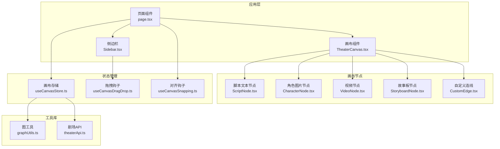
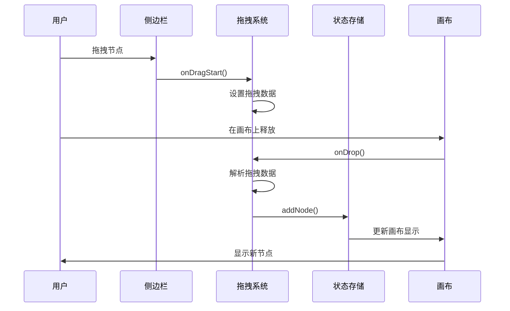
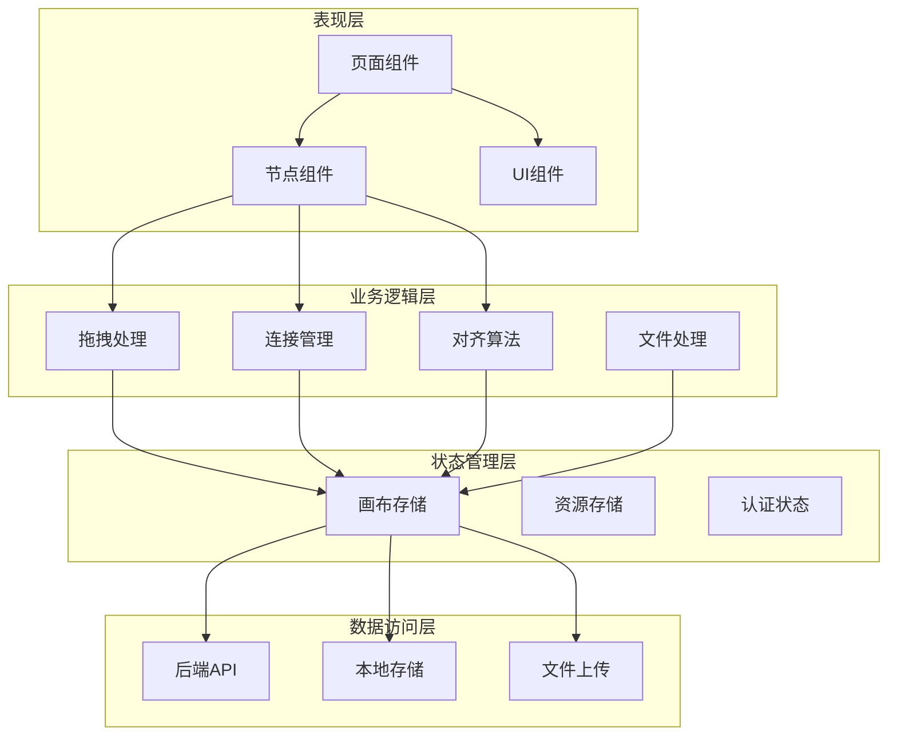
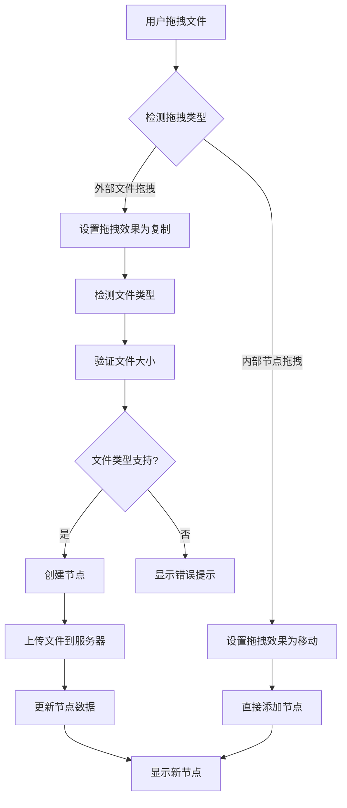
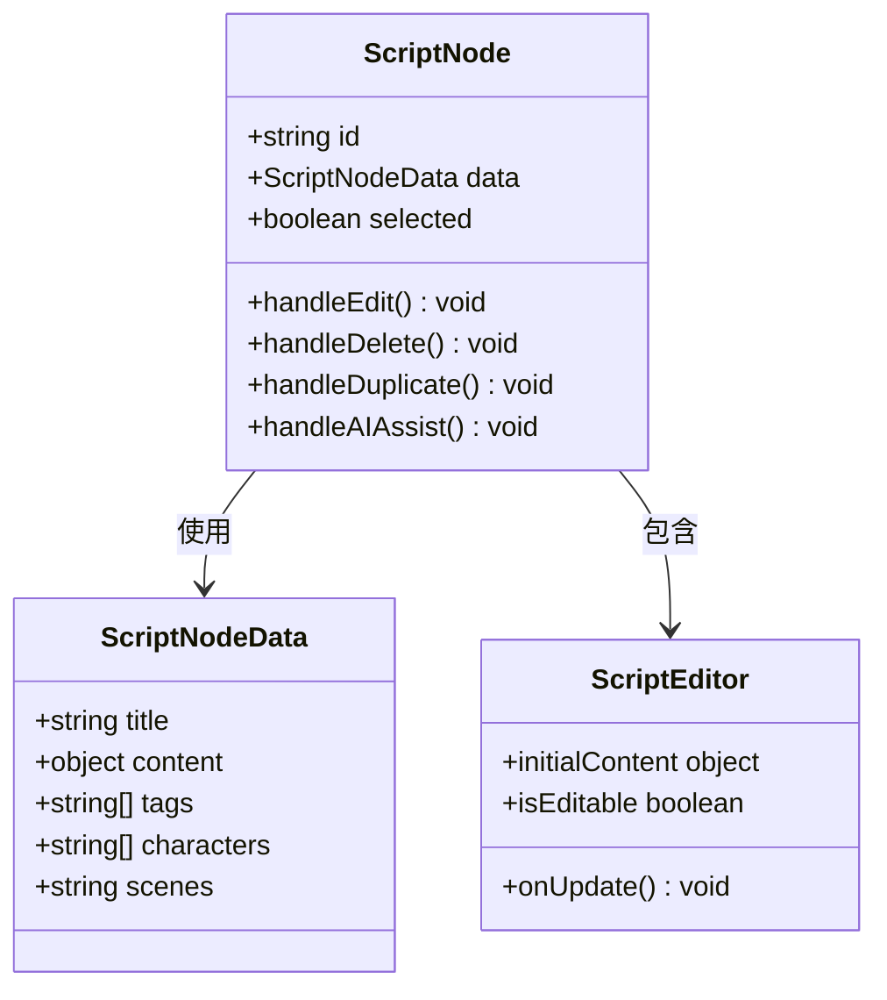
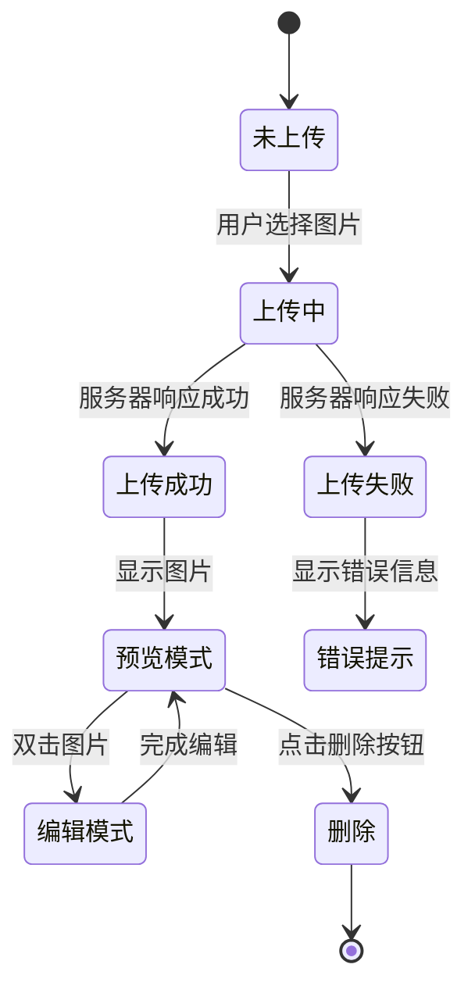
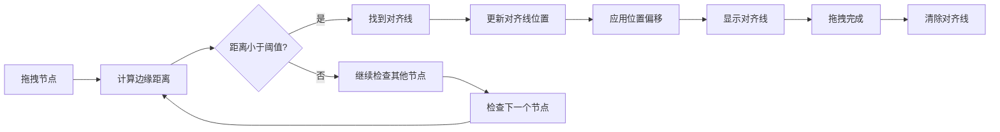
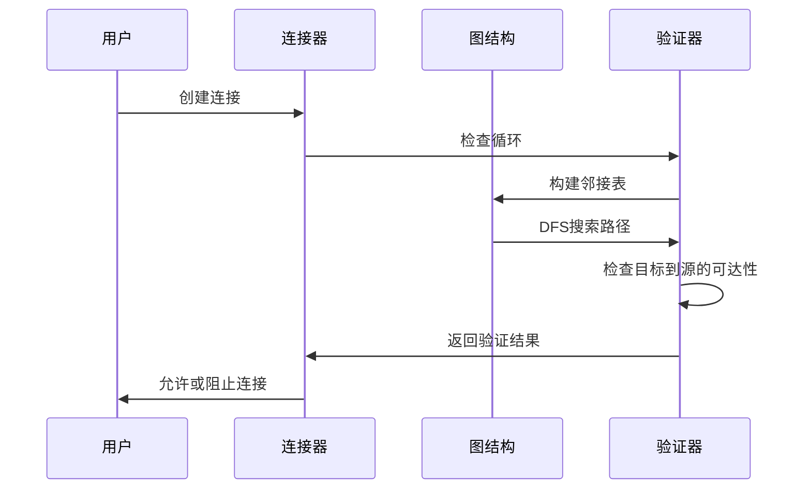
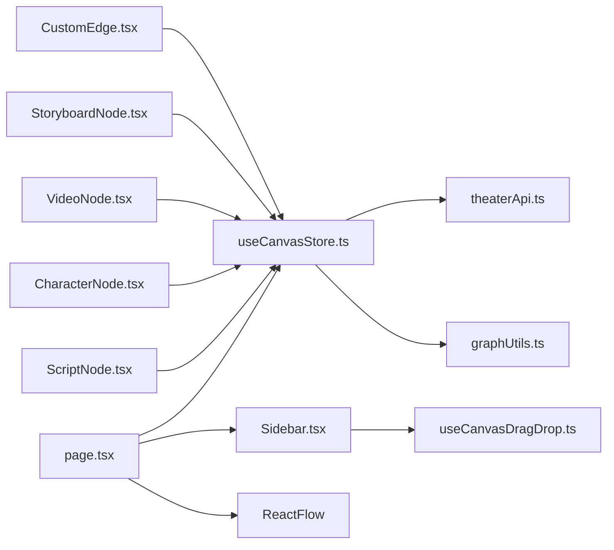

# 画布拖拽增强功能文档

<cite>
**本文档引用的文件**
- [useCanvasDragDrop.ts](file://frontend/src/app/theater/[id]/hooks/useCanvasDragDrop.ts)
- [useCanvasStore.ts](file://frontend/src/store/useCanvasStore.ts)
- [TheaterCanvas.tsx](file://frontend/src/components/TheaterCanvas.tsx)
- [CharacterNode.tsx](file://frontend/src/components/canvas/CharacterNode.tsx)
- [ScriptNode.tsx](file://frontend/src/components/canvas/ScriptNode.tsx)
- [StoryboardNode.tsx](file://frontend/src/components/canvas/StoryboardNode.tsx)
- [VideoNode.tsx](file://frontend/src/components/canvas/VideoNode.tsx)
- [graphUtils.ts](file://frontend/src/lib/graphUtils.ts)
- [page.tsx](file://frontend/src/app/theater/[id]/page.tsx)
- [CustomEdge.tsx](file://frontend/src/components/canvas/CustomEdge.tsx)
- [Sidebar.tsx](file://frontend/src/components/canvas/Sidebar.tsx)
- [useCanvasSnapping.ts](file://frontend/src/app/theater/[id]/hooks/useCanvasSnapping.ts)
- [theaterApi.ts](file://frontend/src/lib/theaterApi.ts)
- [package.json](file://frontend/package.json)
</cite>

## 目录
1. [项目概述](#项目概述)
2. [项目结构](#项目结构)
3. [核心组件](#核心组件)
4. [架构概览](#架构概览)
5. [详细组件分析](#详细组件分析)
6. [依赖关系分析](#依赖关系分析)
7. [性能考虑](#性能考虑)
8. [故障排除指南](#故障排除指南)
9. [结论](#结论)

## 项目概述

Canvas Drag Drop Enhancements 是一个基于 React 和 Next.js 构建的无限叙事剧场应用，专注于提供强大的画布拖拽和节点管理功能。该系统集成了 React Flow 进行可视化布局，并提供了完整的节点拖拽、连接、对齐和同步功能。

主要特性包括：
- 支持多种节点类型的拖拽添加（文本、图片、视频、故事板）
- 实时文件拖拽导入功能
- 智能对齐和吸附功能
- 节点连接和关系管理
- 自动保存和版本控制
- 响应式设计和高性能渲染

## 项目结构

前端项目采用模块化架构，主要分为以下几个核心部分：



**图表来源**
- [page.tsx:1-866](file://frontend/src/app/theater/[id]/page.tsx#L1-L866)
- [useCanvasStore.ts:1-540](file://frontend/src/store/useCanvasStore.ts#L1-L540)
- [Sidebar.tsx:1-341](file://frontend/src/components/canvas/Sidebar.tsx#L1-L341)

**章节来源**
- [page.tsx:1-866](file://frontend/src/app/theater/[id]/page.tsx#L1-L866)
- [package.json:1-94](file://frontend/package.json#L1-L94)

## 核心组件

### 画布拖拽钩子系统

`useCanvasDragDrop` 钩子提供了完整的拖拽功能实现：



**图表来源**
- [useCanvasDragDrop.ts:1-74](file://frontend/src/app/theater/[id]/hooks/useCanvasDragDrop.ts#L1-L74)
- [Sidebar.tsx:88-118](file://frontend/src/components/canvas/Sidebar.tsx#L88-L118)

### 画布存储管理系统

`useCanvasStore` 提供了集中式的状态管理，包含以下核心功能：

- **节点管理**：添加、删除、更新节点
- **连接管理**：创建、删除、验证连接关系
- **历史记录**：撤销/重做功能
- **同步机制**：与后端数据库实时同步
- **设置管理**：网格吸附、对齐指南等

**章节来源**
- [useCanvasStore.ts:1-540](file://frontend/src/store/useCanvasStore.ts#L1-L540)

## 架构概览

系统采用分层架构设计，确保各组件职责清晰且可维护：



**图表来源**
- [page.tsx:54-92](file://frontend/src/app/theater/[id]/page.tsx#L54-L92)
- [useCanvasStore.ts:185-540](file://frontend/src/store/useCanvasStore.ts#L185-L540)

## 详细组件分析

### 拖拽系统实现

#### 拖拽数据格式规范

系统使用标准化的数据传输格式来确保跨组件的兼容性：

| 数据类型 | 键名 | 描述 | 示例值 |
|---------|------|------|--------|
| 节点类型 | `application/reactflow` | 节点类型标识 | `"text"`, `"image"` |
| 节点数据 | `application/reactflow-data` | 节点初始数据 | `{title: "新文本卡"}` |
| 节点尺寸 | `application/reactflow-dimensions` | 节点默认尺寸 | `{"width": 400, "height": 300}` |

#### 文件拖拽处理流程



**图表来源**
- [page.tsx:512-653](file://frontend/src/app/theater/[id]/page.tsx#L512-L653)
- [Sidebar.tsx:88-118](file://frontend/src/components/canvas/Sidebar.tsx#L88-L118)

**章节来源**
- [page.tsx:277-510](file://frontend/src/app/theater/[id]/page.tsx#L277-L510)
- [useCanvasDragDrop.ts:10-70](file://frontend/src/app/theater/[id]/hooks/useCanvasDragDrop.ts#L10-L70)

### 节点类型系统

#### 文本节点（ScriptNode）

文本节点支持富文本编辑和标签管理：



**图表来源**
- [ScriptNode.tsx:11-261](file://frontend/src/components/canvas/ScriptNode.tsx#L11-L261)
- [useCanvasStore.ts:27-33](file://frontend/src/store/useCanvasStore.ts#L27-L33)

#### 图片节点（CharacterNode）

图片节点提供完整的图片管理和编辑功能：



**图表来源**
- [CharacterNode.tsx:13-596](file://frontend/src/components/canvas/CharacterNode.tsx#L13-L596)

**章节来源**
- [CharacterNode.tsx:105-204](file://frontend/src/components/canvas/CharacterNode.tsx#L105-L204)
- [VideoNode.tsx:107-185](file://frontend/src/components/canvas/VideoNode.tsx#L107-L185)

### 对齐和吸附系统

#### 智能对齐算法

对齐系统通过计算节点边缘距离来实现精确的对齐效果：



**图表来源**
- [useCanvasSnapping.ts:12-90](file://frontend/src/app/theater/[id]/hooks/useCanvasSnapping.ts#L12-L90)

**章节来源**
- [useCanvasSnapping.ts:1-98](file://frontend/src/app/theater/[id]/hooks/useCanvasSnapping.ts#L1-L98)

### 连接管理系统

#### 循环检测算法

系统内置循环检测机制，防止创建无效的循环连接：



**图表来源**
- [graphUtils.ts:4-38](file://frontend/src/lib/graphUtils.ts#L4-L38)

**章节来源**
- [useCanvasStore.ts:238-254](file://frontend/src/store/useCanvasStore.ts#L238-L254)
- [graphUtils.ts:1-39](file://frontend/src/lib/graphUtils.ts#L1-L39)

## 依赖关系分析

### 核心依赖关系

```mermaid
graph TB
subgraph "React Flow 生态"
A[@xyflow/react]
B[React Flow Provider]
C[Handle 组件]
end
subgraph "状态管理"
D[zustand]
E[persist middleware]
end
subgraph "UI 组件库"
F[lucide-react]
G[Radix UI]
end
subgraph "工具库"
H[uuid]
I[axios]
J[tiptap]
end
A --> B
A --> C
D --> E
F --> G
A --> H
D --> I
J --> A
```

**图表来源**
- [package.json:13-69](file://frontend/package.json#L13-L69)

### 组件间依赖关系



**图表来源**
- [page.tsx:22-42](file://frontend/src/app/theater/[id]/page.tsx#L22-L42)
- [useCanvasStore.ts:1-25](file://frontend/src/store/useCanvasStore.ts#L1-L25)

**章节来源**
- [package.json:1-94](file://frontend/package.json#L1-L94)

## 性能考虑

### 优化策略

1. **虚拟化渲染**：大量节点时使用 React Window 进行虚拟化
2. **事件节流**：拖拽和缩放操作使用防抖和节流
3. **增量更新**：只更新变化的节点和连接
4. **内存管理**：及时清理临时对象和事件监听器
5. **懒加载**：动态导入大型依赖库

### 存储优化

- 使用 localStorage 进行本地持久化
- 实现智能合并策略避免重复数据
- 支持离线模式和自动同步

## 故障排除指南

### 常见问题及解决方案

#### 拖拽功能异常

**问题**：节点无法拖拽到画布
**原因**：拖拽数据格式不正确
**解决**：检查 `onDragStart` 函数中的数据设置

#### 连接创建失败

**问题**：连接线无法创建或自动删除
**原因**：循环检测阻止了连接
**解决**：检查节点间的依赖关系，避免形成循环

#### 文件上传失败

**问题**：拖拽文件后无法创建节点
**原因**：文件类型不支持或大小超限
**解决**：验证文件类型和大小限制

**章节来源**
- [page.tsx:285-510](file://frontend/src/app/theater/[id]/page.tsx#L285-L510)
- [useCanvasStore.ts:238-254](file://frontend/src/store/useCanvasStore.ts#L238-L254)

## 结论

Canvas Drag Drop Enhancements 提供了一个完整、高性能的画布拖拽解决方案。通过模块化的架构设计和精心实现的功能，系统能够满足复杂的可视化编辑需求。

关键优势包括：
- **易用性**：直观的拖拽界面和丰富的节点类型
- **性能**：优化的渲染和状态管理
- **可靠性**：完善的错误处理和数据验证
- **扩展性**：清晰的架构便于功能扩展

未来可以考虑的功能增强：
- 更多节点类型的扩展
- 批量操作支持
- 更高级的对齐和布局算法
- 实时协作功能