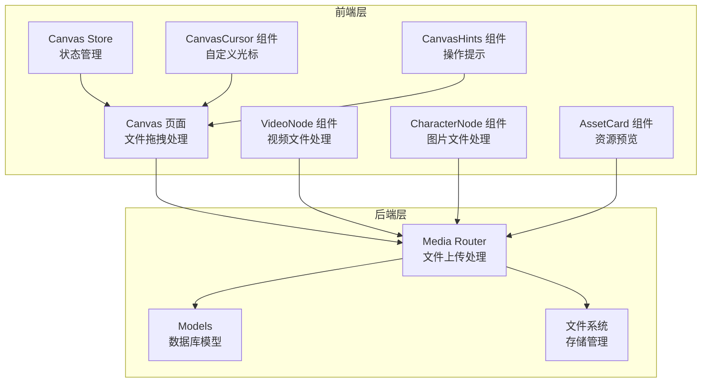
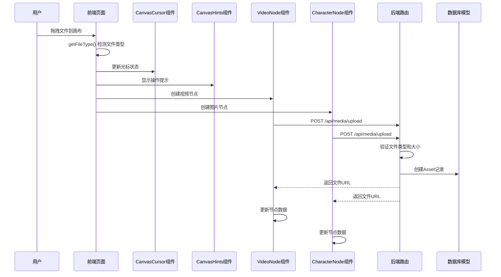
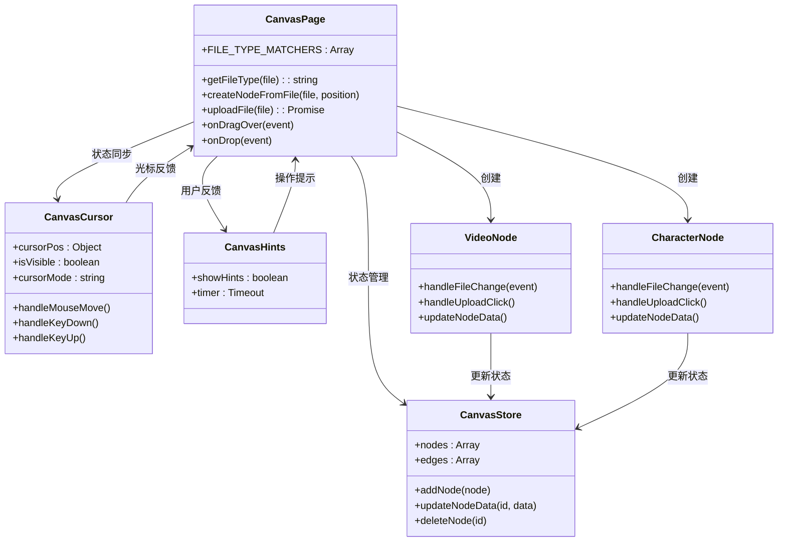
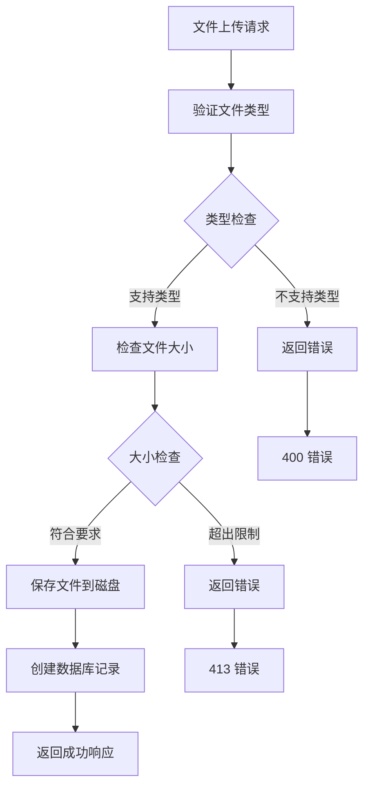
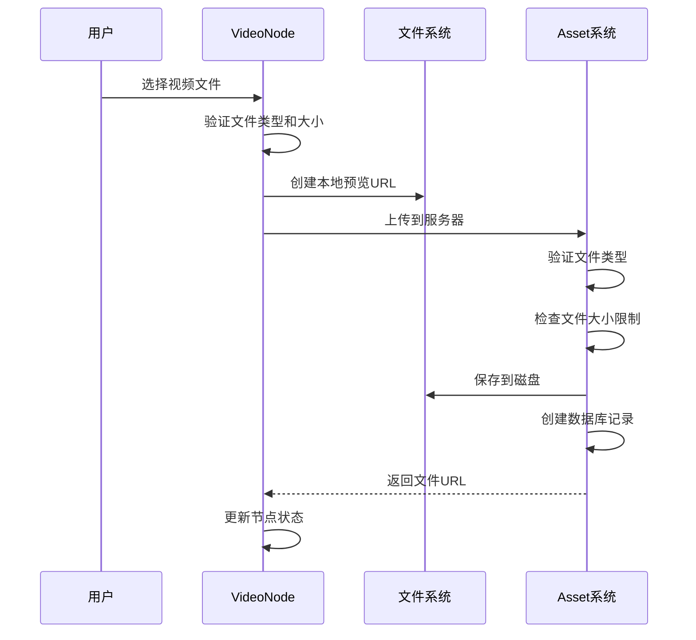
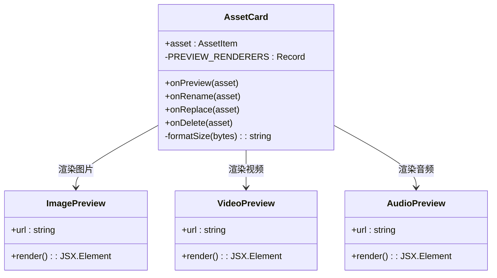
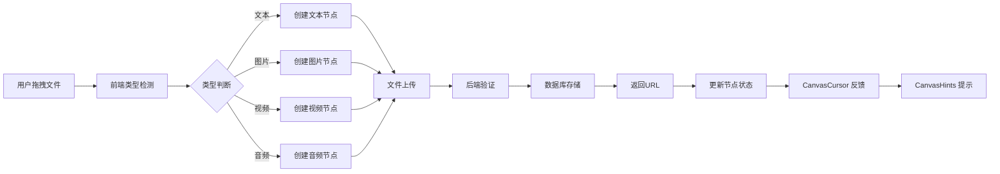

# 画布文件类型检测

<cite>
**本文档引用的文件**
- [frontend/src/app/theater/[id]/page.tsx](file://frontend/src/app/theater/[id]/page.tsx)
- [backend/routers/media.py](file://backend/routers/media.py)
- [frontend/src/components/canvas/VideoNode.tsx](file://frontend/src/components/canvas/VideoNode.tsx)
- [frontend/src/store/useCanvasStore.ts](file://frontend/src/store/useCanvasStore.ts)
- [frontend/src/components/resources/AssetCard.tsx](file://frontend/src/components/resources/AssetCard.tsx)
- [backend/models.py](file://backend/models.py)
- [frontend/src/components/canvas/CharacterNode.tsx](file://frontend/src/components/canvas/CharacterNode.tsx)
- [frontend/src/components/canvas/CanvasCursor.tsx](file://frontend/src/components/canvas/CanvasCursor.tsx)
</cite>

## 更新摘要
**所做更改**
- 新增 Canvas Cursor 和 Canvas Hints 组件的详细分析
- 更新文件类型检测流程图，包含新的光标反馈机制
- 增强用户体验相关的操作提示功能说明
- 完善文件拖拽过程中的实时类型检测和视觉反馈

## 目录
1. [简介](#简介)
2. [项目结构](#项目结构)
3. [核心组件](#核心组件)
4. [架构概览](#架构概览)
5. [详细组件分析](#详细组件分析)
6. [依赖关系分析](#依赖关系分析)
7. [性能考虑](#性能考虑)
8. [故障排除指南](#故障排除指南)
9. [结论](#结论)

## 简介

本文档详细分析了 Infinite Game 项目中的画布文件类型检测系统。该系统实现了完整的前端文件类型识别、后端文件处理和资源管理功能，支持文本、图片、视频和音频四种主要文件类型的自动检测和处理。

系统采用前后端分离的设计模式，前端负责文件类型识别和用户界面交互，后端负责文件存储、类型验证和资源管理。通过统一的文件类型检测机制，确保了文件处理的一致性和可靠性。

**更新** 新增了 Canvas Cursor 和 Canvas Hints 组件，提供更好的文件类型检测和操作提示功能，增强了用户的拖拽体验和操作反馈。

## 项目结构

画布文件类型检测功能分布在前端和后端两个主要部分：



**图表来源**
- [frontend/src/app/theater/[id]/page.tsx:1-913](file://frontend/src/app/theater/[id]/page.tsx#L1-L913)
- [backend/routers/media.py:1-436](file://backend/routers/media.py#L1-L436)
- [frontend/src/components/canvas/CanvasCursor.tsx:1-160](file://frontend/src/components/canvas/CanvasCursor.tsx#L1-L160)

**章节来源**
- [frontend/src/app/theater/[id]/page.tsx:277-293](file://frontend/src/app/theater/[id]/page.tsx#L277-L293)
- [backend/routers/media.py:29-436](file://backend/routers/media.py#L29-L436)

## 核心组件

### 文件类型检测映射表

系统使用统一的文件类型检测映射表来识别不同类型的文件：

| 文件类型 | 支持的 MIME 类型 | 支持的扩展名 |
|---------|-----------------|-------------|
| 文本 | text/plain, text/markdown, application/pdf | .txt, .md, .markdown, .pdf |
| 图片 | image/png, image/jpeg, image/jpg, image/webp, image/gif | .png, .jpg, .jpeg, .webp, .gif |
| 视频 | video/mp4, video/webm, video/ogg, video/avi, video/quicktime, video/x-ms-wmv, video/x-flv | .mp4, .webm, .avi, .mov, .wmv, .flv, .mkv |
| 音频 | audio/mpeg, audio/wav, audio/ogg, audio/mp3, audio/flac, audio/aac, audio/x-m4a | .mp3, .wav, .ogg, .flac, .aac, .m4a |

### 文件上传处理流程



**图表来源**
- [frontend/src/app/theater/[id]/page.tsx:306-327](file://frontend/src/app/theater/[id]/page.tsx#L306-L327)
- [backend/routers/media.py:94-147](file://backend/routers/media.py#L94-L147)
- [frontend/src/components/canvas/CanvasCursor.tsx:10-117](file://frontend/src/components/canvas/CanvasCursor.tsx#L10-L117)

**章节来源**
- [frontend/src/app/theater/[id]/page.tsx:277-293](file://frontend/src/app/theater/[id]/page.tsx#L277-L293)
- [backend/routers/media.py:39-76](file://backend/routers/media.py#L39-L76)

## 架构概览

### 前端架构设计

前端采用 React Hooks 和 Zustand 状态管理，实现了高效的文件类型检测和处理机制：



**图表来源**
- [frontend/src/app/theater/[id]/page.tsx:277-510](file://frontend/src/app/theater/[id]/page.tsx#L277-L510)
- [frontend/src/store/useCanvasStore.ts:60-114](file://frontend/src/store/useCanvasStore.ts#L60-L114)
- [frontend/src/components/canvas/CanvasCursor.tsx:10-160](file://frontend/src/components/canvas/CanvasCursor.tsx#L10-L160)

### 后端架构设计

后端采用 FastAPI 框架，实现了安全的文件处理和存储机制：



**图表来源**
- [backend/routers/media.py:94-147](file://backend/routers/media.py#L94-L147)
- [backend/models.py:131-149](file://backend/models.py#L131-L149)

**章节来源**
- [frontend/src/app/theater/[id]/page.tsx:512-653](file://frontend/src/app/theater/[id]/page.tsx#L512-L653)
- [backend/routers/media.py:94-147](file://backend/routers/media.py#L94-L147)

## 详细组件分析

### 文件类型检测组件

#### 前端文件类型检测

前端实现了基于映射表的文件类型检测机制，支持 MIME 类型和文件扩展名双重验证：


**图表来源**
- [frontend/src/app/theater/[id]/page.tsx:285-293](file://frontend/src/app/theater/[id]/page.tsx#L285-L293)

#### Canvas Cursor 自定义光标组件

**新增** CanvasCursor 组件提供了实时的鼠标操作状态反馈：

- **十字准星模式**：默认状态下显示精确的十字定位光标
- **手型拖拽模式**：当按下空格键或拖拽时显示移动光标
- **实时位置跟踪**：跟随鼠标移动，提供精确的拖拽定位
- **透明度和缩放效果**：根据操作模式调整光标的视觉反馈

**章节来源**
- [frontend/src/app/theater/[id]/page.tsx:277-293](file://frontend/src/app/theater/[id]/page.tsx#L277-L293)
- [backend/routers/media.py:41-64](file://backend/routers/media.py#L41-L64)
- [frontend/src/components/canvas/CanvasCursor.tsx:10-117](file://frontend/src/components/canvas/CanvasCursor.tsx#L10-L117)

#### Canvas Hints 操作提示组件

**新增** CanvasHints 组件提供智能的操作指导：

- **自动隐藏机制**：5秒后自动消失，避免干扰用户操作
- **键盘快捷键提示**：显示框选、移动画布、多选等操作方法
- **视觉层次清晰**：底部居中显示，不影响主要内容区域
- **响应式布局**：使用 Flexbox 实现自适应的提示布局

**章节来源**
- [frontend/src/components/canvas/CanvasCursor.tsx:123-159](file://frontend/src/components/canvas/CanvasCursor.tsx#L123-L159)

### 文件上传处理组件

#### 视频文件处理

VideoNode 组件专门处理视频文件的上传和显示：



**图表来源**
- [frontend/src/components/canvas/VideoNode.tsx:107-185](file://frontend/src/components/canvas/VideoNode.tsx#L107-L185)
- [backend/routers/media.py:94-147](file://backend/routers/media.py#L94-L147)

#### 图片文件处理

CharacterNode 组件处理图片文件的上传和预览：

**章节来源**
- [frontend/src/components/canvas/VideoNode.tsx:107-185](file://frontend/src/components/canvas/VideoNode.tsx#L107-L185)
- [frontend/src/components/canvas/CharacterNode.tsx:126-204](file://frontend/src/components/canvas/CharacterNode.tsx#L126-L204)

### 资源管理系统

#### 资源卡片组件

AssetCard 组件提供了统一的资源预览和管理界面：



**图表来源**
- [frontend/src/components/resources/AssetCard.tsx:75-131](file://frontend/src/components/resources/AssetCard.tsx#L75-L131)

**章节来源**
- [frontend/src/components/resources/AssetCard.tsx:31-69](file://frontend/src/components/resources/AssetCard.tsx#L31-L69)
- [frontend/src/components/resources/AssetCard.tsx:83-131](file://frontend/src/components/resources/AssetCard.tsx#L83-L131)

## 依赖关系分析

### 技术栈依赖

```mermaid
graph TB
subgraph "前端依赖"
A[React 18+]
B[@xyflow/react]
C[Zustand]
D[Lucide Icons]
E[Tailwind CSS]
F[CanvasCursor 组件]
G[CanvasHints 组件]
end
subgraph "后端依赖"
H[FastAPI]
I[SQLAlchemy]
J[UUID]
K[Pydantic]
end
subgraph "数据库"
L[PostgreSQL]
M[SQLite]
end
A --> B
A --> C
A --> D
A --> F
A --> G
H --> I
H --> K
I --> L
I --> M
```

### 文件类型处理流程



**图表来源**
- [frontend/src/app/theater/[id]/page.tsx:330-510](file://frontend/src/app/theater/[id]/page.tsx#L330-L510)
- [backend/routers/media.py:94-147](file://backend/routers/media.py#L94-L147)
- [frontend/src/components/canvas/CanvasCursor.tsx:10-159](file://frontend/src/components/canvas/CanvasCursor.tsx#L10-L159)

**章节来源**
- [frontend/src/store/useCanvasStore.ts:185-540](file://frontend/src/store/useCanvasStore.ts#L185-L540)
- [backend/models.py:131-149](file://backend/models.py#L131-L149)

## 性能考虑

### 前端性能优化

1. **文件类型检测缓存**：使用映射表避免重复的字符串匹配操作
2. **本地预览**：使用 Blob URL 实现快速文件预览
3. **批量处理**：支持多文件拖拽和批量上传
4. **内存管理**：及时清理 Blob URL 和事件监听器
5. **Canvas Cursor 优化**：使用 CSS 过渡动画而非频繁重绘
6. **Canvas Hints 自动清理**：定时器自动清理避免内存泄漏

### 后端性能优化

1. **异步处理**：使用异步数据库操作避免阻塞
2. **文件大小限制**：防止大文件占用过多存储空间
3. **缓存策略**：对常用文件类型进行缓存
4. **并发控制**：限制同时上传的文件数量

## 故障排除指南

### 常见问题及解决方案

#### 文件类型识别失败

**问题描述**：文件无法正确识别为支持的类型

**可能原因**：
1. MIME 类型为空或不支持
2. 文件扩展名不在支持列表中
3. 文件头信息损坏

**解决方案**：
1. 检查浏览器是否正确设置 MIME 类型
2. 确认文件扩展名格式正确
3. 重新下载或修复文件

#### Canvas Cursor 无响应

**问题描述**：自定义光标不显示或不响应

**可能原因**：
1. 画布元素未正确加载
2. 事件监听器未绑定
3. CSS 样式冲突

**解决方案**：
1. 确认 .react-flow__pane 元素存在
2. 检查组件是否正确导入和渲染
3. 验证 z-index 层级设置

#### Canvas Hints 不显示

**问题描述**：操作提示不显示

**可能原因**：
1. 组件未正确导入
2. DOM 查询失败
3. 样式被覆盖

**解决方案**：
1. 确认组件导入路径正确
2. 检查 ReactFlow 包装器元素
3. 验证 CSS 类名和样式

#### 文件上传失败

**问题描述**：文件上传过程中出现错误

**可能原因**：
1. 文件大小超出限制
2. 文件类型不受支持
3. 网络连接问题
4. 服务器存储空间不足

**解决方案**：
1. 检查文件大小是否超过限制
2. 确认文件类型在支持范围内
3. 检查网络连接状态
4. 联系系统管理员检查存储空间

#### 资源预览问题

**问题描述**：上传的文件无法正确预览

**可能原因**：
1. 文件格式不支持
2. 文件损坏
3. 浏览器兼容性问题

**解决方案**：
1. 确认文件格式在支持列表中
2. 重新上传文件
3. 更换浏览器或更新版本

**章节来源**
- [frontend/src/app/theater/[id]/page.tsx:413-425](file://frontend/src/app/theater/[id]/page.tsx#L413-L425)
- [backend/routers/media.py:116-122](file://backend/routers/media.py#L116-L122)

## 结论

画布文件类型检测系统通过前后端协同设计，实现了高效、可靠的文件处理机制。系统的主要优势包括：

1. **统一的文件类型检测**：前后端使用一致的检测标准，确保处理逻辑的一致性
2. **灵活的扩展性**：通过映射表机制，可以轻松添加新的文件类型支持
3. **完善的错误处理**：提供了全面的错误检测和用户友好的错误提示
4. **优秀的用户体验**：新增的 Canvas Cursor 和 Canvas Hints 组件提供了直观的操作反馈
5. **良好的性能表现**：通过异步处理和缓存机制，保证了系统的响应速度

**更新** 新增的 Canvas Cursor 组件通过实时的视觉反馈增强了用户的拖拽体验，而 Canvas Hints 组件则提供了智能的操作指导，显著提升了系统的易用性和用户满意度。

该系统为 Infinite Game 项目提供了坚实的文件处理基础，支持用户在画布上创建各种类型的媒体内容，为后续的功能扩展奠定了良好的技术基础。