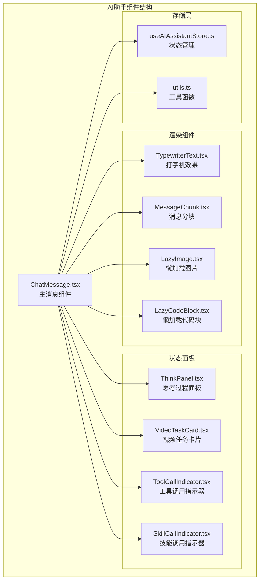
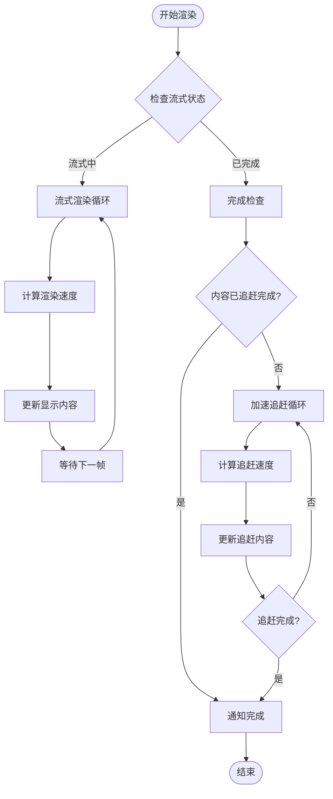
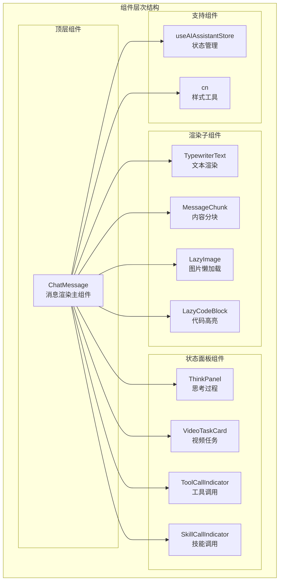
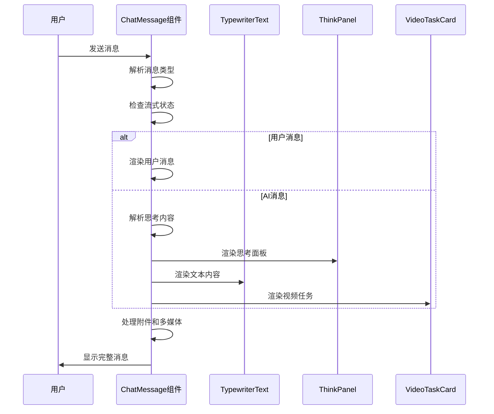
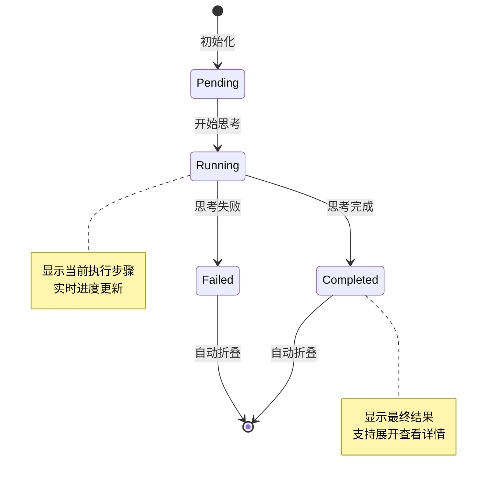
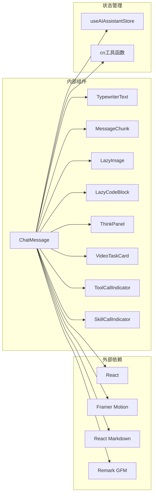

# 聊天消息组件

<cite>
**本文档引用的文件**
- [ChatMessage.tsx](file://frontend/src/components/ai-assistant/ChatMessage.tsx)
- [TypewriterText.tsx](file://frontend/src/components/ai-assistant/TypewriterText.tsx)
- [MessageChunk.tsx](file://frontend/src/components/ai-assistant/MessageChunk.tsx)
- [LazyImage.tsx](file://frontend/src/components/ai-assistant/LazyImage.tsx)
- [LazyCodeBlock.tsx](file://frontend/src/components/ai-assistant/LazyCodeBlock.tsx)
- [VideoTaskCard.tsx](file://frontend/src/components/ai-assistant/VideoTaskCard.tsx)
- [ThinkPanel.tsx](file://frontend/src/components/ai-assistant/ThinkPanel.tsx)
- [ToolCallIndicator.tsx](file://frontend/src/components/ai-assistant/ToolCallIndicator.tsx)
- [SkillCallIndicator.tsx](file://frontend/src/components/ai-assistant/SkillCallIndicator.tsx)
- [useAIAssistantStore.ts](file://frontend/src/store/useAIAssistantStore.ts)
- [index.ts](file://frontend/src/components/ai-assistant/index.ts)
- [utils.ts](file://frontend/src/lib/utils.ts)
- [globals.css](file://frontend/src/app/globals.css)
</cite>

## 目录
1. [简介](#简介)
2. [项目结构](#项目结构)
3. [核心组件](#核心组件)
4. [架构概览](#架构概览)
5. [详细组件分析](#详细组件分析)
6. [依赖关系分析](#依赖关系分析)
7. [性能考虑](#性能考虑)
8. [故障排除指南](#故障排除指南)
9. [结论](#结论)

## 简介

聊天消息组件是 Infinite Game 项目中 AI 助手系统的核心组成部分，负责渲染用户和 AI 之间的对话消息。该组件提供了丰富的功能，包括流式文本渲染、多媒体内容处理、视频任务管理、思考过程可视化以及工具调用跟踪等。

该组件采用现代化的 React 架构设计，结合了性能优化技术如虚拟滚动、懒加载和代码分割，确保在处理大量消息时仍能保持流畅的用户体验。

## 项目结构

AI 助手聊天组件位于前端项目的 `src/components/ai-assistant/` 目录下，包含多个专门的子组件，每个组件负责特定的功能领域：

**图表来源**
- [ChatMessage.tsx:1-484](file://frontend/src/components/ai-assistant/ChatMessage.tsx#L1-L484)
- [useAIAssistantStore.ts:1-480](file://frontend/src/store/useAIAssistantStore.ts#L1-L480)

**章节来源**
- [ChatMessage.tsx:1-484](file://frontend/src/components/ai-assistant/ChatMessage.tsx#L1-L484)
- [index.ts:1-38](file://frontend/src/components/ai-assistant/index.ts#L1-L38)

## 核心组件

### ChatMessage 主组件

ChatMessage 是整个聊天系统的中枢组件，负责处理不同类型的消息渲染和状态管理。它支持多种消息类型和复杂的交互场景。

#### 主要特性

1. **多消息类型支持**
   - 用户消息（user）
   - AI 消息（ai）
   - 欢迎消息（welcome）
   - 上下文压缩消息（compaction）

2. **流式渲染支持**
   - 实时文本渲染
   - 打字机效果
   - 加速追赶机制

3. **多媒体内容处理**
   - 图片懒加载
   - 代码块高亮
   - 视频任务卡片

4. **智能分析功能**
   - 思考内容解析
   - 视频标记识别
   - 附件解析

**章节来源**
- [ChatMessage.tsx:279-484](file://frontend/src/components/ai-assistant/ChatMessage.tsx#L279-L484)

### TypewriterText 打字机效果

提供流式文本渲染的视觉效果，模拟真实的人工智能响应过程。

#### 核心算法

**图表来源**
- [TypewriterText.tsx:67-135](file://frontend/src/components/ai-assistant/TypewriterText.tsx#L67-L135)

**章节来源**
- [TypewriterText.tsx:1-162](file://frontend/src/components/ai-assistant/TypewriterText.tsx#L1-L162)

### MessageChunk 内容分块

处理长文本消息的分块渲染，提高大消息的渲染性能。

#### 分块策略

1. **段落边界优先**：优先在段落换行处分割
2. **句子边界次优**：在句号处分割
3. **行边界最后选择**：在换行符处分割

**章节来源**
- [MessageChunk.tsx:18-172](file://frontend/src/components/ai-assistant/MessageChunk.tsx#L18-L172)

## 架构概览

聊天消息组件采用模块化架构设计，各组件职责明确，通过清晰的接口进行通信。

**图表来源**
- [ChatMessage.tsx:185-190](file://frontend/src/components/ai-assistant/ChatMessage.tsx#L185-L190)
- [useAIAssistantStore.ts:132-257](file://frontend/src/store/useAIAssistantStore.ts#L132-L257)

## 详细组件分析

### ChatMessage 组件深度分析

ChatMessage 组件是整个聊天系统的核心，实现了复杂的消息渲染逻辑。

#### 消息类型处理

**图表来源**
- [ChatMessage.tsx:279-484](file://frontend/src/components/ai-assistant/ChatMessage.tsx#L279-L484)

#### 内容解析机制

组件实现了多种内容解析功能：

1. **思考内容解析**：识别 `<think>` 标签中的思考过程
2. **视频标记解析**：处理视频生成任务标记
3. **附件解析**：提取用户上传的附件信息

**章节来源**
- [ChatMessage.tsx:37-127](file://frontend/src/components/ai-assistant/ChatMessage.tsx#L37-L127)

### ThinkPanel 思考过程面板

ThinkPanel 专门用于显示 AI 的思考过程，支持单智能体和多智能体两种模式。

#### 多智能体协作模式

**图表来源**
- [ThinkPanel.tsx:39-86](file://frontend/src/components/ai-assistant/ThinkPanel.tsx#L39-L86)

**章节来源**
- [ThinkPanel.tsx:1-280](file://frontend/src/components/ai-assistant/ThinkPanel.tsx#L1-L280)

### VideoTaskCard 视频任务卡片

VideoTaskCard 负责处理视频生成任务的状态管理和用户界面展示。

#### 任务状态管理

| 状态 | 描述 | 图标 | 颜色 |
|------|------|------|------|
| pending | 等待生成 | ⏱️ | 灰色 |
| processing | 正在生成 | 🔄 | 蓝色 |
| completed | 生成完成 | ✅ | 绿色 |
| failed | 生成失败 | ❌ | 红色 |

**章节来源**
- [VideoTaskCard.tsx:134-290](file://frontend/src/components/ai-assistant/VideoTaskCard.tsx#L134-L290)

### 性能优化策略

组件采用了多种性能优化技术：

1. **懒加载机制**：图片和代码块按需加载
2. **虚拟滚动**：支持大量消息的高效渲染
3. **代码分割**：动态导入重型组件
4. **内存管理**：及时清理定时器和观察者

**章节来源**
- [LazyImage.tsx:15-111](file://frontend/src/components/ai-assistant/LazyImage.tsx#L15-L111)
- [LazyCodeBlock.tsx:50-166](file://frontend/src/components/ai-assistant/LazyCodeBlock.tsx#L50-L166)

## 依赖关系分析

**图表来源**
- [ChatMessage.tsx:3-18](file://frontend/src/components/ai-assistant/ChatMessage.tsx#L3-L18)
- [useAIAssistantStore.ts:1-2](file://frontend/src/store/useAIAssistantStore.ts#L1-L2)

**章节来源**
- [index.ts:1-38](file://frontend/src/components/ai-assistant/index.ts#L1-L38)

## 性能考虑

### 渲染性能优化

1. **虚拟滚动**：使用虚拟列表渲染大量消息
2. **懒加载**：图片和代码块按需加载
3. **记忆化**：使用 useMemo 和 useCallback 优化重渲染
4. **动画优化**：使用 requestAnimationFrame 控制动画

### 内存管理

1. **定时器清理**：及时清理轮询和计时器
2. **观察者清理**：清理 IntersectionObserver
3. **事件监听器**：组件卸载时清理事件监听
4. **缓存管理**：合理管理组件缓存

### 网络优化

1. **轮询优化**：智能轮询间隔调整
2. **错误处理**：网络异常时的优雅降级
3. **状态同步**：确保前后端状态一致

## 故障排除指南

### 常见问题及解决方案

#### 消息渲染异常

**问题**：消息内容显示不完整或格式错误
**解决方案**：
1. 检查 Markdown 解析器配置
2. 验证内容编码格式
3. 确认组件依赖版本兼容性

#### 流式渲染问题

**问题**：打字机效果卡顿或不流畅
**解决方案**：
1. 检查 requestAnimationFrame 性能
2. 优化渲染频率设置
3. 减少不必要的重渲染

#### 图片加载失败

**问题**：懒加载图片无法显示
**解决方案**：
1. 检查 IntersectionObserver 支持
2. 验证图片 URL 格式
3. 确认跨域访问权限

#### 视频任务状态异常

**问题**：视频生成状态不更新
**解决方案**：
1. 检查轮询间隔设置
2. 验证 API 接口可用性
3. 确认错误处理逻辑

**章节来源**
- [ChatMessage.tsx:287-293](file://frontend/src/components/ai-assistant/ChatMessage.tsx#L287-L293)
- [VideoTaskCard.tsx:150-172](file://frontend/src/components/ai-assistant/VideoTaskCard.tsx#L150-L172)

## 结论

聊天消息组件展现了现代前端开发的最佳实践，通过精心设计的架构和多项性能优化技术，为用户提供了流畅、丰富的聊天体验。

### 主要优势

1. **模块化设计**：清晰的组件职责分离
2. **性能优化**：多层性能优化策略
3. **用户体验**：丰富的交互和视觉效果
4. **可扩展性**：良好的扩展接口设计
5. **稳定性**：完善的错误处理机制

### 技术亮点

- 流式文本渲染的精确控制
- 智能的内容解析和处理
- 高效的多媒体资源管理
- 完善的状态管理和持久化
- 优雅的错误处理和恢复机制

该组件为整个 AI 助手系统奠定了坚实的技术基础，为后续功能扩展和性能优化提供了良好的框架支撑。