# 聊天消息增强

<cite>
**本文档引用的文件**
- [main.py](file://backend/main.py)
- [chats.py](file://backend/routers/chats.py)
- [chat_generation.py](file://backend/services/chat_generation.py)
- [chat_multi_agent.py](file://backend/services/chat_multi_agent.py)
- [chat_utils.py](file://backend/services/chat_utils.py)
- [llm_stream.py](file://backend/services/llm_stream.py)
- [ChatMessage.tsx](file://frontend/src/components/ai-assistant/ChatMessage.tsx)
- [NodePreviewCard.tsx](file://frontend/src/components/ai-assistant/NodePreviewCard.tsx)
- [AIAssistantPanel.tsx](file://frontend/src/components/canvas/AIAssistantPanel.tsx)
- [useSSEHandler.ts](file://frontend/src/components/ai-assistant/hooks/useSSEHandler.ts)
- [useAIAssistantStore.ts](file://frontend/src/store/useAIAssistantStore.ts)
- [nodeAttachmentUtils.ts](file://frontend/src/lib/nodeAttachmentUtils.ts)
- [models.py](file://backend/models.py)
- [_variables.scss](file://frontend/src/styles/_variables.scss)
- [globals.css](file://frontend/src/app/globals.css)
</cite>

## 更新摘要
**所做更改**
- 新增附件解析系统和多附件支持功能
- 添加用户附件预览组件和节点附件预览列表
- 改进主题变量的使用，统一颜色系统
- 更新AI助手面板的附件上下文构建机制

## 目录
1. [简介](#简介)
2. [项目结构](#项目结构)
3. [核心组件](#核心组件)
4. [架构概览](#架构概览)
5. [详细组件分析](#详细组件分析)
6. [依赖关系分析](#依赖关系分析)
7. [性能考虑](#性能考虑)
8. [故障排除指南](#故障排除指南)
9. [结论](#结论)

## 简介

"聊天消息增强"是Infinite Game项目中的一个关键功能模块，旨在提供增强的聊天交互体验。该模块通过实时流式响应、多模态内容处理、技能调用跟踪、工具执行监控以及多智能体协作等功能，为用户提供更加丰富和交互式的AI聊天体验。

**更新** 本次更新重点增强了附件处理能力，新增了附件解析系统、用户附件预览组件和多附件支持功能，同时改进了主题变量的使用，提供更加统一和灵活的样式系统。

该项目采用前后端分离的架构设计，后端基于FastAPI构建，前端使用React和TypeScript开发。核心功能包括：

- **实时流式聊天**：支持渐进式消息输出，提供流畅的用户体验
- **多模态内容处理**：支持文本、图片、视频等多种媒体格式
- **技能和工具调用追踪**：可视化显示AI的内部思考过程和外部操作
- **多智能体协作**：支持复杂的多智能体任务协调和执行
- **画布集成**：与项目画布系统无缝集成，支持图像生成和编辑
- **附件处理增强**：支持多附件上传、预览和上下文传递

## 项目结构

项目采用清晰的分层架构，主要分为后端服务和前端界面两个部分：

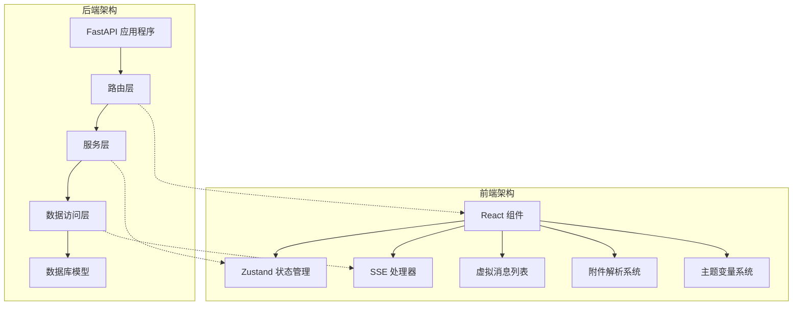

**图表来源**
- [main.py:110-175](file://backend/main.py#L110-L175)
- [chats.py:18-232](file://backend/routers/chats.py#L18-L232)

**章节来源**
- [main.py:1-175](file://backend/main.py#L1-L175)
- [chats.py:1-232](file://backend/routers/chats.py#L1-L232)

## 核心组件

### 后端核心组件

#### 聊天路由器 (Chat Router)
负责处理所有聊天相关的HTTP请求，包括会话管理、消息发送和历史记录查询。

#### 聊天生成服务 (Chat Generation Service)
实现单智能体聊天生动生成功能，支持工具调用循环、计费系统和画布桥接。

#### 多智能体聊天服务 (Multi-Agent Chat Service)
处理复杂的多智能体协作场景，提供任务分析和动态路由功能。

#### 聊天工具服务 (Chat Utils Service)
提供共享的聊天工具函数，包括SSE格式化、内容序列化和图像处理。

### 前端核心组件

#### 聊天消息组件 (ChatMessage)
负责渲染单个聊天消息，支持思考内容解析、视频任务显示、多媒体内容处理和附件解析。

#### 附件解析系统 (Attachment Parsing System)
新增的附件解析功能，支持从消息内容中提取和解析附件元数据。

#### 用户附件预览组件 (UserAttachmentPreview)
专门用于渲染用户侧的附件预览，支持图片、视频和文本附件的可视化展示。

#### 节点附件预览列表 (NodePreviewList)
支持多附件横向排列的预览组件，提供更好的视觉体验和交互功能。

#### 主题变量系统 (Theme Variable System)
改进的颜色变量系统，提供统一的主题色彩管理和响应式设计支持。

**章节来源**
- [chat_generation.py:28-372](file://backend/services/chat_generation.py#L28-L372)
- [chat_multi_agent.py:22-190](file://backend/services/chat_multi_agent.py#L22-L190)
- [ChatMessage.tsx:190-334](file://frontend/src/components/ai-assistant/ChatMessage.tsx#L190-L334)
- [NodePreviewCard.tsx:145-213](file://frontend/src/components/ai-assistant/NodePreviewCard.tsx#L145-L213)
- [useSSEHandler.ts:25-377](file://frontend/src/components/ai-assistant/hooks/useSSEHandler.ts#L25-L377)

## 架构概览

系统采用事件驱动的架构模式，通过Server-Sent Events实现前后端的实时通信，并新增了附件处理的完整流程：

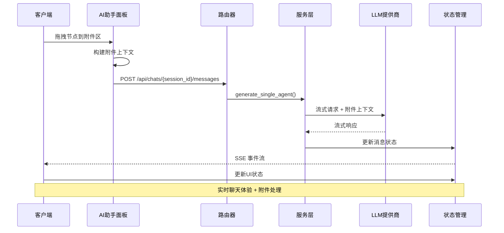

**图表来源**
- [chats.py:127-183](file://backend/routers/chats.py#L127-L183)
- [chat_generation.py:152-237](file://backend/services/chat_generation.py#L152-L237)
- [AIAssistantPanel.tsx:35-48](file://frontend/src/components/canvas/AIAssistantPanel.tsx#L35-L48)
- [useSSEHandler.ts:67-108](file://frontend/src/components/ai-assistant/hooks/useSSEHandler.ts#L67-L108)

## 详细组件分析

### 聊天消息渲染组件

ChatMessage组件是前端聊天界面的核心，提供了丰富的消息展示功能，现已增强附件处理能力：

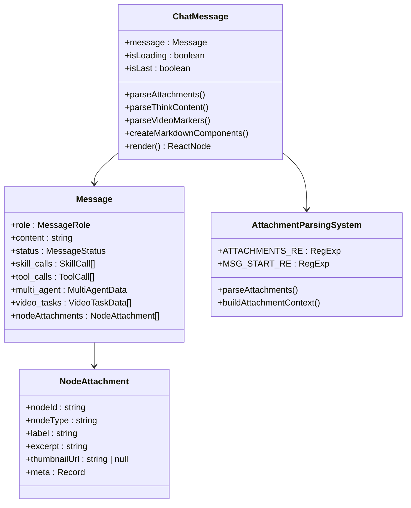

**图表来源**
- [ChatMessage.tsx:159-334](file://frontend/src/components/ai-assistant/ChatMessage.tsx#L159-L334)
- [useAIAssistantStore.ts:85-92](file://frontend/src/store/useAIAssistantStore.ts#L85-L92)

#### 附件解析机制

新增的附件解析功能支持从消息内容中提取附件元数据：

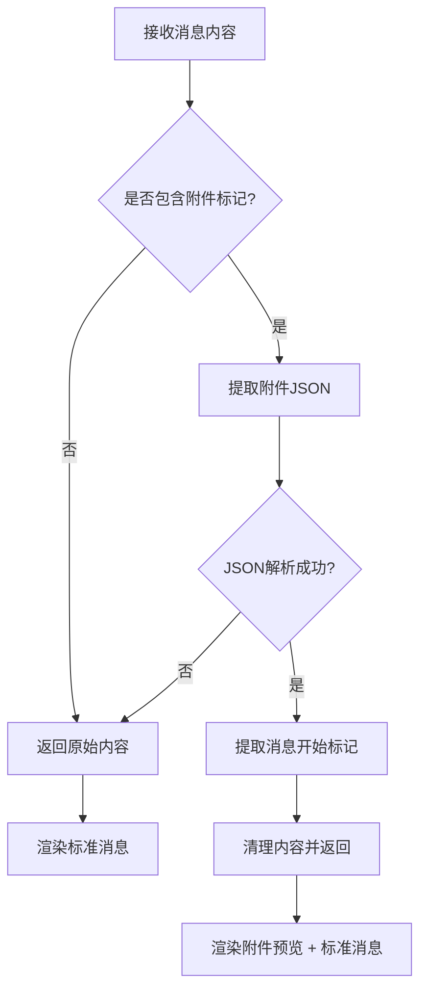

**图表来源**
- [ChatMessage.tsx:34-49](file://frontend/src/components/ai-assistant/ChatMessage.tsx#L34-L49)

#### 用户附件预览

UserAttachmentPreview组件提供直观的附件预览功能：

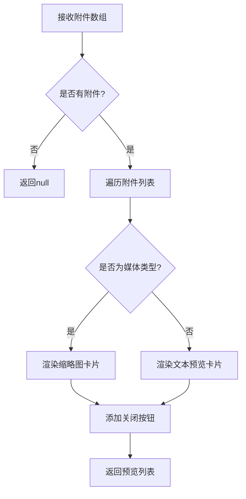

**图表来源**
- [ChatMessage.tsx:213-249](file://frontend/src/components/ai-assistant/ChatMessage.tsx#L213-L249)

**章节来源**
- [ChatMessage.tsx:1-406](file://frontend/src/components/ai-assistant/ChatMessage.tsx#L1-L406)
- [NodePreviewCard.tsx:1-213](file://frontend/src/components/ai-assistant/NodePreviewCard.tsx#L1-L213)
- [useSSEHandler.ts:1-377](file://frontend/src/components/ai-assistant/hooks/useSSEHandler.ts#L1-L377)

### AI助手面板附件系统

AIAssistantPanel集成了完整的附件处理流程：

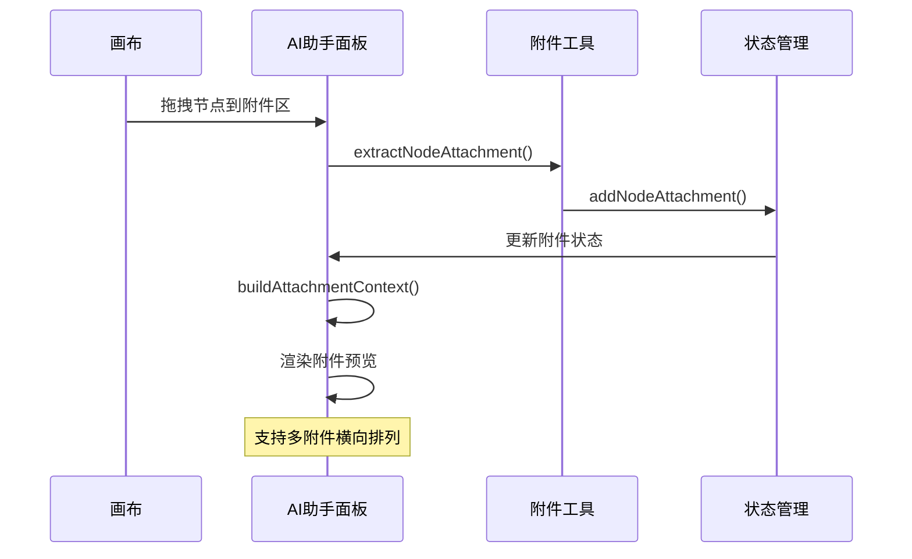

**图表来源**
- [AIAssistantPanel.tsx:50-600](file://frontend/src/components/canvas/AIAssistantPanel.tsx#L50-L600)
- [nodeAttachmentUtils.ts:86-96](file://frontend/src/lib/nodeAttachmentUtils.ts#L86-L96)

#### 附件上下文构建

AI助手面板提供智能的附件上下文构建功能：

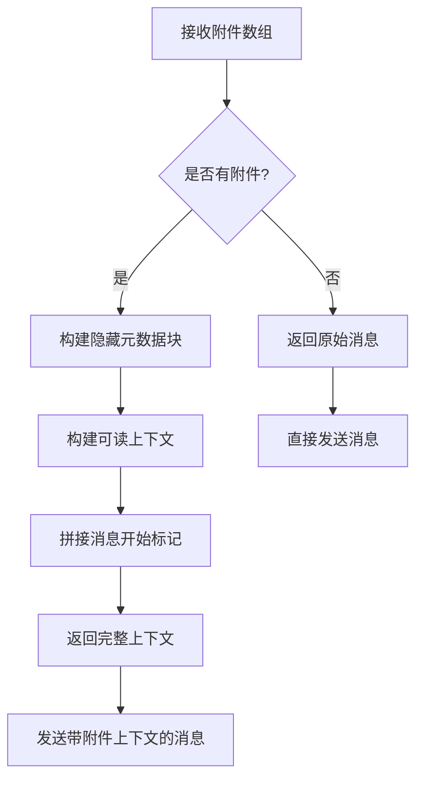

**图表来源**
- [AIAssistantPanel.tsx:35-48](file://frontend/src/components/canvas/AIAssistantPanel.tsx#L35-L48)

**章节来源**
- [AIAssistantPanel.tsx:1-600](file://frontend/src/components/canvas/AIAssistantPanel.tsx#L1-L600)
- [nodeAttachmentUtils.ts:1-97](file://frontend/src/lib/nodeAttachmentUtils.ts#L1-L97)

### 主题变量系统

改进的主题变量系统提供统一的颜色管理和响应式设计：

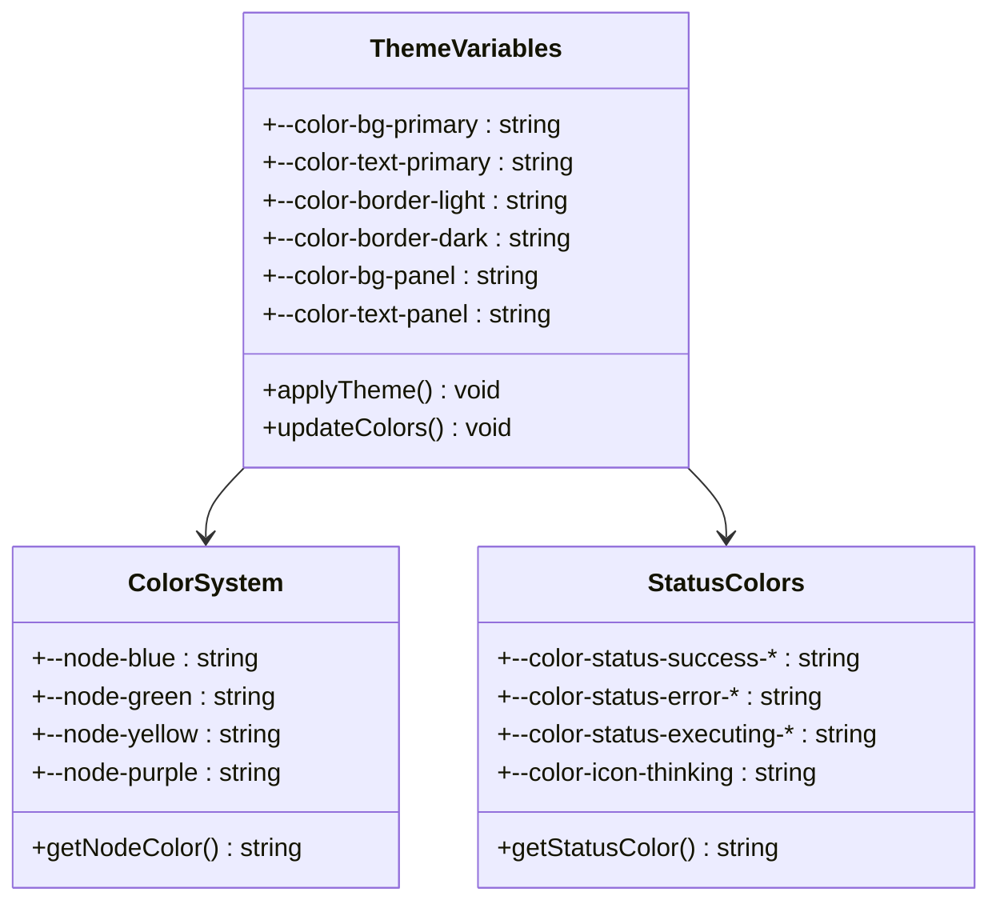

**图表来源**
- [_variables.scss:1-200](file://frontend/src/styles/_variables.scss#L1-L200)
- [globals.css:91-138](file://frontend/src/app/globals.css#L91-L138)

#### 响应式主题切换

主题变量系统支持明暗主题的自动切换：

```mermaid
stateDiagram-v2
[*] --> light-theme
light-theme --> dark-theme : prefers-color-scheme : dark
dark-theme --> light-theme : prefers-color-scheme : light
light-theme --> custom-theme : 用户选择
custom-theme --> light-theme : 恢复默认
custom-theme --> dark-theme : 切换到深色
```

**图表来源**
- [globals.css:34-62](file://frontend/src/app/globals.css#L34-L62)
- [globals.css:140-172](file://frontend/src/app/globals.css#L140-L172)

**章节来源**
- [_variables.scss:1-297](file://frontend/src/styles/_variables.scss#L1-L297)
- [globals.css:1-536](file://frontend/src/app/globals.css#L1-L536)

### 后端聊天生成服务

后端的聊天生成服务是整个系统的中枢，负责处理复杂的AI交互逻辑：

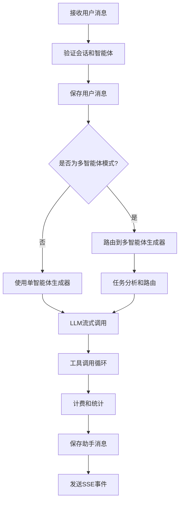

**图表来源**
- [chats.py:127-183](file://backend/routers/chats.py#L127-L183)
- [chat_generation.py:28-372](file://backend/services/chat_generation.py#L28-L372)

#### 多模态内容处理

系统支持多种内容类型的处理，特别是图像编辑功能：

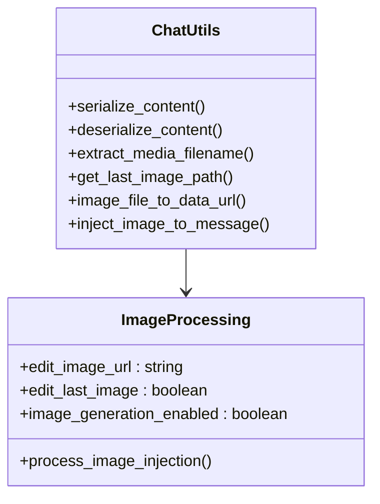

**图表来源**
- [chat_utils.py:21-94](file://backend/services/chat_utils.py#L21-L94)

**章节来源**
- [chat_generation.py:1-372](file://backend/services/chat_generation.py#L1-L372)
- [chat_utils.py:1-94](file://backend/services/chat_utils.py#L1-L94)

### SSE事件处理机制

前后端通过Server-Sent Events实现实时通信，每个事件类型都有专门的处理逻辑：

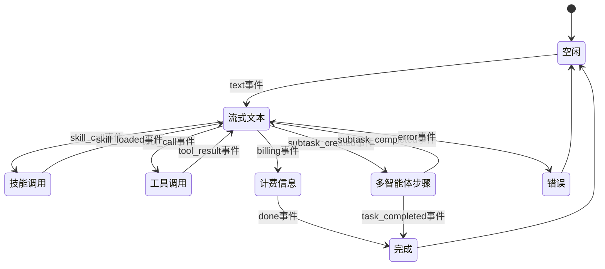

**图表来源**
- [useSSEHandler.ts:70-366](file://frontend/src/components/ai-assistant/hooks/useSSEHandler.ts#L70-L366)

**章节来源**
- [useSSEHandler.ts:1-377](file://frontend/src/components/ai-assistant/hooks/useSSEHandler.ts#L1-L377)

## 依赖关系分析

系统各组件之间存在清晰的依赖关系，遵循单一职责原则：

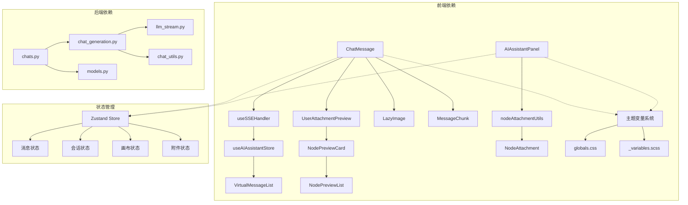

**图表来源**
- [ChatMessage.tsx:1-406](file://frontend/src/components/ai-assistant/ChatMessage.tsx#L1-L406)
- [NodePreviewCard.tsx:1-213](file://frontend/src/components/ai-assistant/NodePreviewCard.tsx#L1-L213)
- [AIAssistantPanel.tsx:1-600](file://frontend/src/components/canvas/AIAssistantPanel.tsx#L1-L600)
- [chats.py:1-232](file://backend/routers/chats.py#L1-L232)
- [chat_generation.py:1-372](file://backend/services/chat_generation.py#L1-L372)

**章节来源**
- [models.py:178-200](file://backend/models.py#L178-L200)
- [useAIAssistantStore.ts:100-196](file://frontend/src/store/useAIAssistantStore.ts#L100-L196)

## 性能考虑

### 前端性能优化

系统采用了多项性能优化策略：

1. **虚拟滚动**：使用react-window实现消息列表的虚拟化渲染
2. **懒加载**：图片和代码块采用懒加载机制
3. **消息分块**：大消息内容自动分块显示，支持展开/收起
4. **状态持久化**：使用localStorage持久化用户偏好设置
5. **附件预览优化**：媒体附件使用缩略图和适当的尺寸限制
6. **主题变量缓存**：CSS变量的计算和缓存机制

### 后端性能优化

1. **异步处理**：所有数据库操作和API调用都采用异步模式
2. **流式响应**：使用SSE实现实时流式响应
3. **连接池**：合理配置数据库连接池
4. **缓存策略**：对常用配置和静态资源进行缓存

## 故障排除指南

### 常见问题及解决方案

#### SSE连接问题
- **症状**：消息无法实时更新
- **原因**：网络连接中断或CORS配置问题
- **解决方案**：检查浏览器控制台错误，确认CORS配置正确

#### 图像加载失败
- **症状**：图片显示为占位符或加载失败
- **原因**：图片路径错误或文件不存在
- **解决方案**：验证媒体文件路径，检查文件权限

#### 多智能体任务超时
- **症状**：多智能体协作任务长时间无响应
- **原因**：智能体配置错误或外部API调用超时
- **解决方案**：检查智能体配置，增加超时时间设置

#### 附件处理异常
- **症状**：附件无法正确显示或解析
- **原因**：附件元数据格式错误或解析失败
- **解决方案**：检查附件JSON格式，验证parseAttachments函数

**章节来源**
- [useSSEHandler.ts:360-366](file://frontend/src/components/ai-assistant/hooks/useSSEHandler.ts#L360-L366)
- [ChatMessage.tsx:66-101](file://frontend/src/components/ai-assistant/ChatMessage.tsx#L66-L101)

## 结论

"聊天消息增强"功能通过精心设计的架构和实现，为用户提供了现代化的AI聊天体验。本次更新重点增强了附件处理能力，主要优势包括：

1. **实时交互**：通过SSE技术实现真正的实时聊天体验
2. **多模态支持**：全面支持文本、图片、视频等多种媒体格式
3. **可视化反馈**：清晰展示AI的思考过程和外部操作
4. **附件处理增强**：支持多附件上传、预览和上下文传递
5. **主题系统改进**：统一的颜色变量系统，支持明暗主题切换
6. **可扩展性**：模块化的架构设计便于功能扩展和维护
7. **性能优化**：采用多种前端和后端优化技术确保流畅体验

该功能模块的成功实施展示了现代Web应用的最佳实践，为类似项目的开发提供了有价值的参考。未来可以考虑进一步增强的功能包括语音交互、更丰富的多媒体支持以及更智能的上下文管理等。

**更新** 本次更新特别强化了附件处理系统，为用户提供了更加直观和高效的多附件交互体验，同时改进的主题变量系统确保了更好的视觉一致性和用户体验。