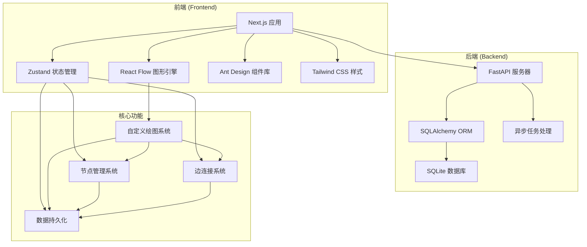
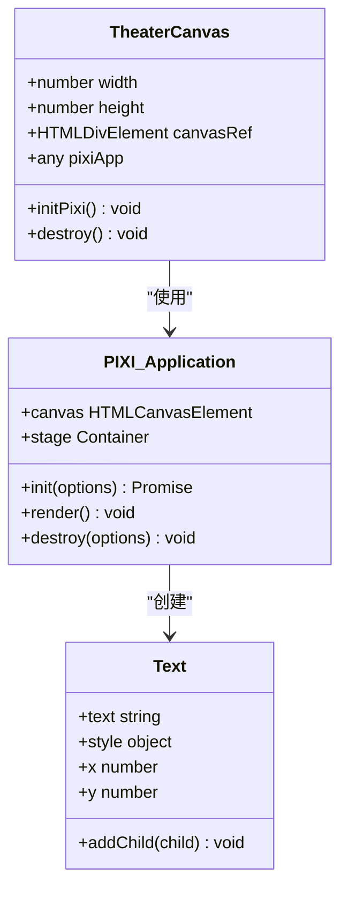
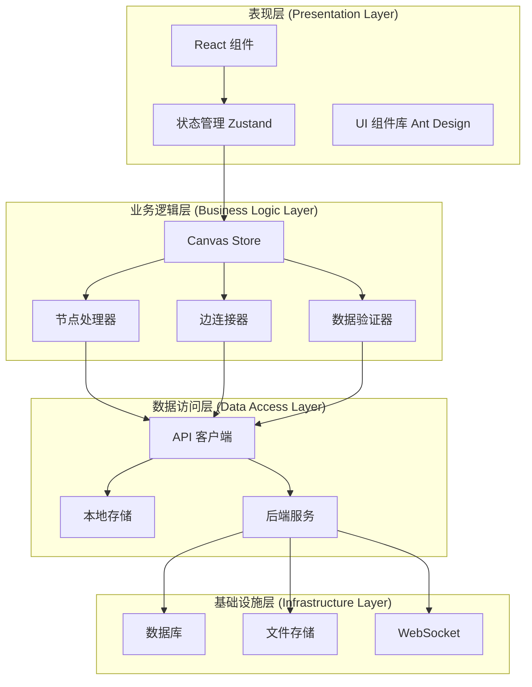
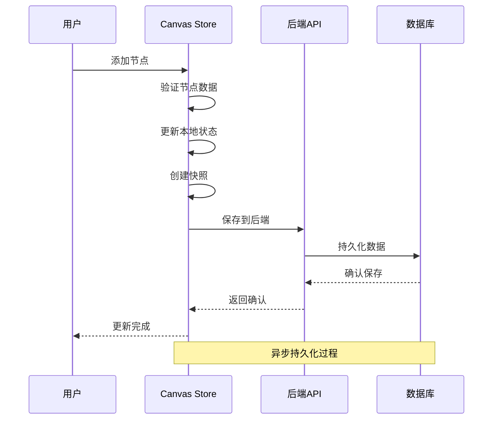
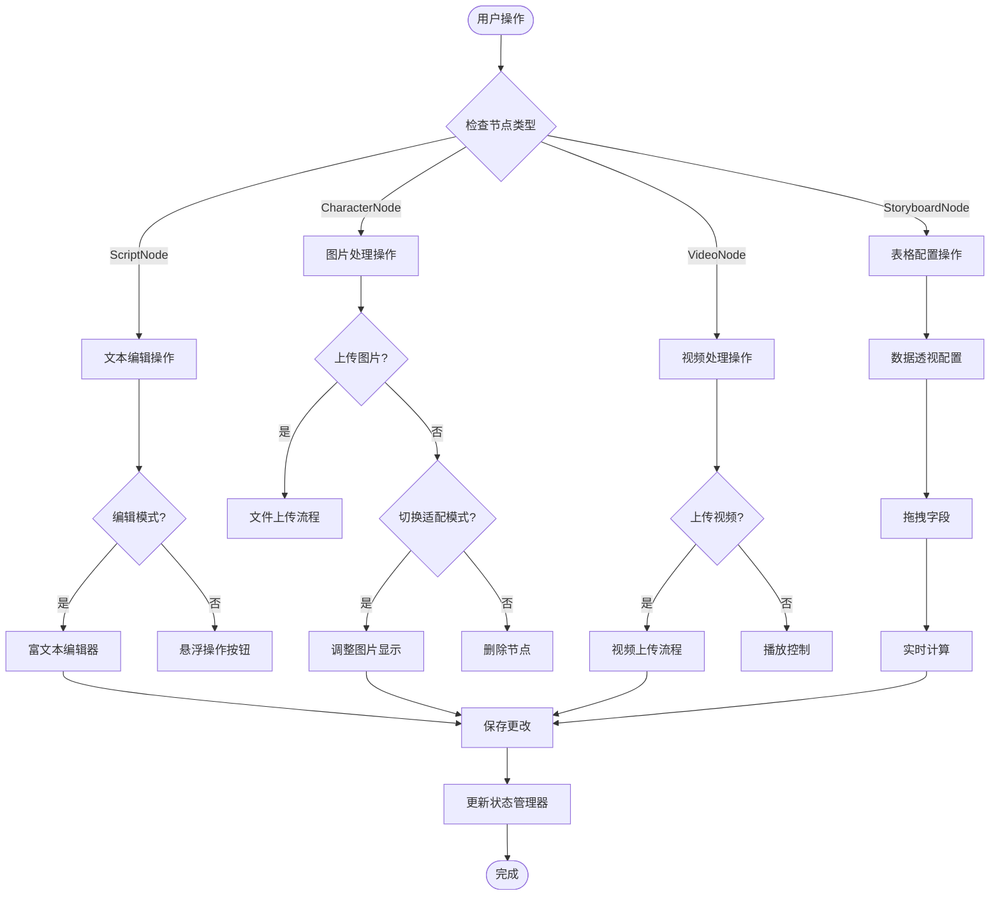
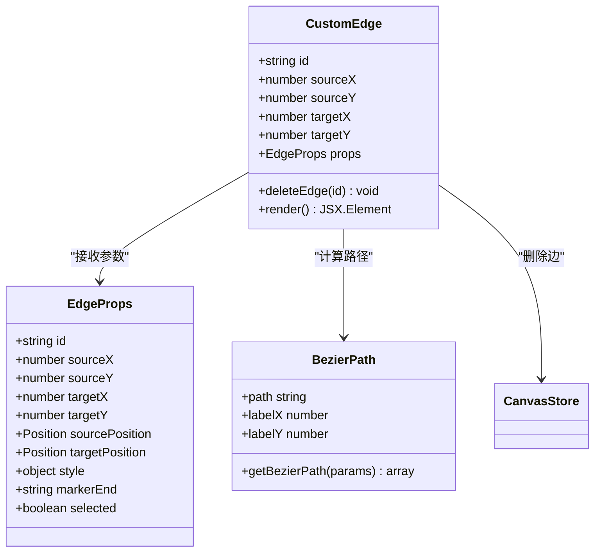
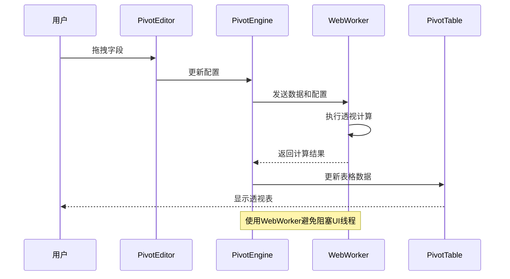

# 自定义绘图功能

<cite>
**本文档引用的文件**
- [backend/main.py](file://backend/main.py)
- [frontend/src/components/TheaterCanvas.tsx](file://frontend/src/components/TheaterCanvas.tsx)
- [frontend/src/store/useCanvasStore.ts](file://frontend/src/store/useCanvasStore.ts)
- [frontend/src/app/theater/[id]/page.tsx](file://frontend/src/app/theater/[id]/page.tsx)
- [frontend/src/components/canvas/ScriptNode.tsx](file://frontend/src/components/canvas/ScriptNode.tsx)
- [frontend/src/components/canvas/CharacterNode.tsx](file://frontend/src/components/canvas/CharacterNode.tsx)
- [frontend/src/components/canvas/StoryboardNode.tsx](file://frontend/src/components/canvas/StoryboardNode.tsx)
- [frontend/src/components/canvas/VideoNode.tsx](file://frontend/src/components/canvas/VideoNode.tsx)
- [frontend/src/components/canvas/CustomEdge.tsx](file://frontend/src/components/canvas/CustomEdge.tsx)
- [frontend/src/lib/theaterApi.ts](file://frontend/src/lib/theaterApi.ts)
- [frontend/src/components/canvas/pivot/PivotEditor.tsx](file://frontend/src/components/canvas/pivot/PivotEditor.tsx)
- [frontend/src/components/canvas/pivot/types.ts](file://frontend/src/components/canvas/pivot/types.ts)
- [frontend/src/components/canvas/pivot/usePivotEngine.ts](file://frontend/src/components/canvas/pivot/usePivotEngine.ts)
- [frontend/src/app/theater/[id]/hooks/useCanvasDragDrop.ts](file://frontend/src/app/theater/[id]/hooks/useCanvasDragDrop.ts)
- [frontend/src/app/theater/[id]/hooks/useCanvasShortcuts.ts](file://frontend/src/app/theater/[id]/hooks/useCanvasShortcuts.ts)
- [frontend/src/lib/graphUtils.ts](file://frontend/src/lib/graphUtils.ts)
- [frontend/package.json](file://frontend/package.json)
</cite>

## 目录
1. [简介](#简介)
2. [项目结构](#项目结构)
3. [核心组件](#核心组件)
4. [架构概览](#架构概览)
5. [详细组件分析](#详细组件分析)
6. [依赖关系分析](#依赖关系分析)
7. [性能考虑](#性能考虑)
8. [故障排除指南](#故障排除指南)
9. [结论](#结论)

## 简介

无限剧场（Infinite Narrative Theater）是一个基于 React 和 FastAPI 构建的可视化故事创作平台。该项目的核心功能是提供一个强大的自定义绘图系统，允许用户通过拖放操作创建和管理故事元素。该系统支持多种节点类型（文本卡、图片卡、视频卡、多维表格卡），每种节点都有独特的交互特性和数据处理能力。

系统采用现代化的技术栈，包括 React Flow 进行图形绘制、Zustand 状态管理、Ant Design 组件库以及 Tailwind CSS 样式框架。前端使用 Next.js 作为应用框架，后端采用 FastAPI 提供 RESTful API 服务。

## 项目结构

项目采用前后端分离的架构设计，主要分为以下模块：



**图表来源**
- [frontend/src/app/theater/[id]/page.tsx](file://frontend/src/app/theater/[id]/page.tsx#L1-L349)
- [backend/main.py:1-170](file://backend/main.py#L1-L170)

**章节来源**
- [frontend/src/app/theater/[id]/page.tsx](file://frontend/src/app/theater/[id]/page.tsx#L1-L349)
- [backend/main.py:1-170](file://backend/main.py#L1-L170)

## 核心组件

### 自定义绘图画布

TheaterCanvas 是系统的核心绘图组件，基于 Pixi.js 实现高性能的图形渲染。该组件提供了基础的画布功能，包括背景设置、尺寸控制和基本图形绘制。



**图表来源**
- [frontend/src/components/TheaterCanvas.tsx:1-50](file://frontend/src/components/TheaterCanvas.tsx#L1-L50)

### 节点管理系统

系统支持四种主要的节点类型，每种节点都有特定的功能和交互特性：

| 节点类型 | 功能描述 | 主要特性 |
|---------|----------|----------|
| ScriptNode | 文本内容节点 | 富文本编辑、字数统计、AI辅助 |
| CharacterNode | 图片展示节点 | 图片上传、缩放模式、预览功能 |
| VideoNode | 视频播放节点 | 视频上传、播放控制、缩放模式 |
| StoryboardNode | 多维表格节点 | 数据透视、拖拽配置、实时计算 |

**章节来源**
- [frontend/src/store/useCanvasStore.ts:26-61](file://frontend/src/store/useCanvasStore.ts#L26-L61)
- [frontend/src/components/canvas/ScriptNode.tsx:1-341](file://frontend/src/components/canvas/ScriptNode.tsx#L1-L341)
- [frontend/src/components/canvas/CharacterNode.tsx:1-660](file://frontend/src/components/canvas/CharacterNode.tsx#L1-L660)
- [frontend/src/components/canvas/VideoNode.tsx:1-524](file://frontend/src/components/canvas/VideoNode.tsx#L1-L524)
- [frontend/src/components/canvas/StoryboardNode.tsx:1-308](file://frontend/src/components/canvas/StoryboardNode.tsx#L1-L308)

## 架构概览

系统采用分层架构设计，确保前后端分离和模块化开发：



**图表来源**
- [frontend/src/store/useCanvasStore.ts:178-421](file://frontend/src/store/useCanvasStore.ts#L178-L421)
- [frontend/src/lib/theaterApi.ts:107-159](file://frontend/src/lib/theaterApi.ts#L107-L159)

## 详细组件分析

### Canvas Store 状态管理

Canvas Store 是整个绘图系统的核心状态管理器，负责协调所有节点和边的状态变化：



**图表来源**
- [frontend/src/store/useCanvasStore.ts:359-386](file://frontend/src/store/useCanvasStore.ts#L359-L386)

Canvas Store 提供了完整的 CRUD 操作、历史记录管理和自动保存机制：

**章节来源**
- [frontend/src/store/useCanvasStore.ts:178-421](file://frontend/src/store/useCanvasStore.ts#L178-L421)

### 节点交互系统

每个节点都实现了复杂的交互逻辑，包括拖拽、编辑、删除和复制功能：



**图表来源**
- [frontend/src/components/canvas/ScriptNode.tsx:67-110](file://frontend/src/components/canvas/ScriptNode.tsx#L67-L110)
- [frontend/src/components/canvas/CharacterNode.tsx:115-194](file://frontend/src/components/canvas/CharacterNode.tsx#L115-L194)
- [frontend/src/components/canvas/VideoNode.tsx:107-186](file://frontend/src/components/canvas/VideoNode.tsx#L107-L186)

**章节来源**
- [frontend/src/components/canvas/ScriptNode.tsx:1-341](file://frontend/src/components/canvas/ScriptNode.tsx#L1-L341)
- [frontend/src/components/canvas/CharacterNode.tsx:1-660](file://frontend/src/components/canvas/CharacterNode.tsx#L1-L660)
- [frontend/src/components/canvas/VideoNode.tsx:1-524](file://frontend/src/components/canvas/VideoNode.tsx#L1-L524)
- [frontend/src/components/canvas/StoryboardNode.tsx:1-308](file://frontend/src/components/canvas/StoryboardNode.tsx#L1-L308)

### 边连接系统

自定义边连接器提供了灵活的连接管理和可视化反馈：



**图表来源**
- [frontend/src/components/canvas/CustomEdge.tsx:5-92](file://frontend/src/components/canvas/CustomEdge.tsx#L5-L92)

**章节来源**
- [frontend/src/components/canvas/CustomEdge.tsx:1-92](file://frontend/src/components/canvas/CustomEdge.tsx#L1-L92)

### 数据透视引擎

StoryboardNode 内置了强大的数据透视功能，支持复杂的数据分析和可视化：



**图表来源**
- [frontend/src/components/canvas/pivot/PivotEditor.tsx:48-56](file://frontend/src/components/canvas/pivot/PivotEditor.tsx#L48-L56)
- [frontend/src/components/canvas/pivot/usePivotEngine.ts:8-177](file://frontend/src/components/canvas/pivot/usePivotEngine.ts#L8-L177)

**章节来源**
- [frontend/src/components/canvas/pivot/PivotEditor.tsx:1-229](file://frontend/src/components/canvas/pivot/PivotEditor.tsx#L1-L229)
- [frontend/src/components/canvas/pivot/usePivotEngine.ts:1-188](file://frontend/src/components/canvas/pivot/usePivotEngine.ts#L1-L188)
- [frontend/src/components/canvas/pivot/types.ts:1-28](file://frontend/src/components/canvas/pivot/types.ts#L1-L28)

## 依赖关系分析

系统的技术栈和依赖关系如下：

```mermaid
graph TB
subgraph "前端依赖"
A[React 19.2.3]
B[Next.js 16.1.6]
C[@xyflow/react 12.10.1]
D[Zustand 5.0.12]
E[Ant Design 6.3.0]
F[Tailwind CSS 4]
G[Pixi.js 8.16.0]
end
subgraph "后端依赖"
H[FastAPI]
I[SQLAlchemy]
J[Asyncpg]
K[Uvicorn]
end
subgraph "开发工具"
L[Jest]
M[ESLint]
N[Tailwind CSS]
O[TypeScript]
end
A --> C
A --> D
C --> F
D --> G
B --> H
H --> I
I --> J
H --> K
```

**图表来源**
- [frontend/package.json:13-66](file://frontend/package.json#L13-L66)

**章节来源**
- [frontend/package.json:1-90](file://frontend/package.json#L1-L90)

## 性能考虑

系统在多个层面进行了性能优化：

### 1. 渲染性能优化
- 使用 Pixi.js 进行硬件加速渲染
- React.memo 优化组件重渲染
- WebWorker 处理重型计算任务
- 懒加载第三方库

### 2. 状态管理优化
- Zustand 替代 Redux，减少样板代码
- 局部状态更新，避免全量重渲染
- 智能缓存策略

### 3. 网络性能优化
- Debounce 机制减少 API 调用频率
- 批量保存操作
- 连接池管理

### 4. 存储优化
- 本地存储与云端同步
- 增量更新策略
- 数据压缩和序列化

## 故障排除指南

### 常见问题及解决方案

#### 1. 节点无法拖拽
**症状**: 节点无法从侧边栏拖拽到画布
**解决方案**:
- 检查 React Flow 版本兼容性
- 确认 `useCanvasDragDrop` hook 正常工作
- 验证 `snapToGrid` 设置

#### 2. 图片上传失败
**症状**: CharacterNode 中图片上传显示错误
**解决方案**:
- 检查文件格式和大小限制
- 验证后端文件上传接口
- 确认 CORS 配置正确

#### 3. 数据透视计算缓慢
**症状**: PivotEditor 计算时间过长
**解决方案**:
- 检查 WebWorker 是否正常初始化
- 优化数据源大小
- 调整聚合函数复杂度

#### 4. 状态不同步
**症状**: 本地状态与服务器状态不一致
**解决方案**:
- 检查自动保存机制
- 验证 WebSocket 连接
- 确认冲突解决策略

**章节来源**
- [frontend/src/app/theater/[id]/hooks/useCanvasDragDrop.ts](file://frontend/src/app/theater/[id]/hooks/useCanvasDragDrop.ts#L1-L72)
- [frontend/src/components/canvas/CharacterNode.tsx:115-194](file://frontend/src/components/canvas/CharacterNode.tsx#L115-L194)
- [frontend/src/components/canvas/pivot/usePivotEngine.ts:1-188](file://frontend/src/components/canvas/pivot/usePivotEngine.ts#L1-L188)

## 结论

无限剧场的自定义绘图功能展现了现代 Web 应用的强大能力。通过精心设计的架构和丰富的功能特性，系统为用户提供了直观、高效的可视化创作体验。

### 主要优势

1. **模块化设计**: 清晰的组件分离和职责划分
2. **高性能渲染**: 基于 Pixi.js 和 React Flow 的优化渲染
3. **丰富的交互**: 多种节点类型和复杂的用户交互
4. **数据驱动**: 完善的数据管理和持久化机制
5. **可扩展性**: 良好的架构设计支持功能扩展

### 技术亮点

- **状态管理**: Zustand 提供轻量级但功能强大的状态管理
- **图形渲染**: Pixi.js 实现高性能的 2D 图形渲染
- **数据处理**: WebWorker 处理复杂的数据透视计算
- **用户体验**: 流畅的拖拽、编辑和保存体验

该系统为类似的故事创作和可视化应用提供了优秀的参考实现，展示了如何在现代 Web 技术栈下构建复杂的应用程序。