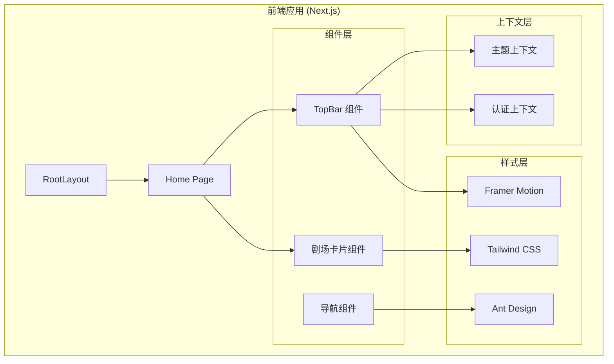
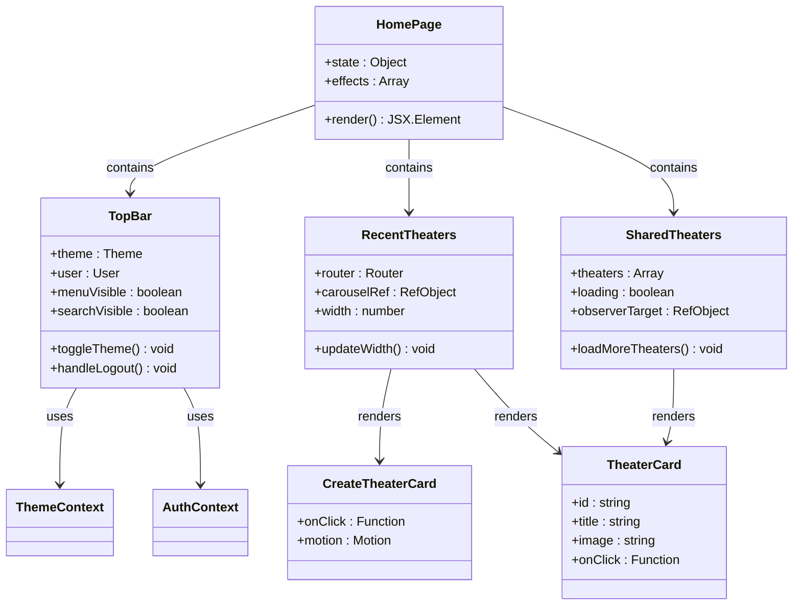
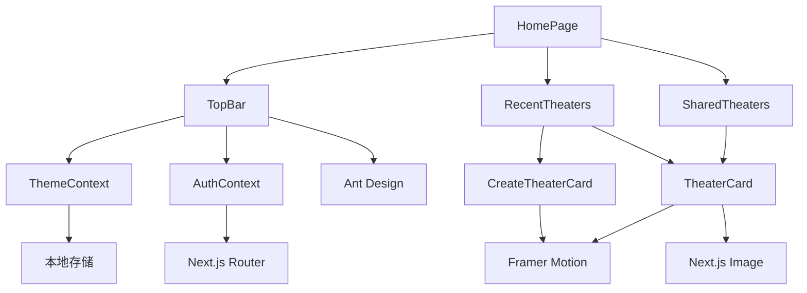
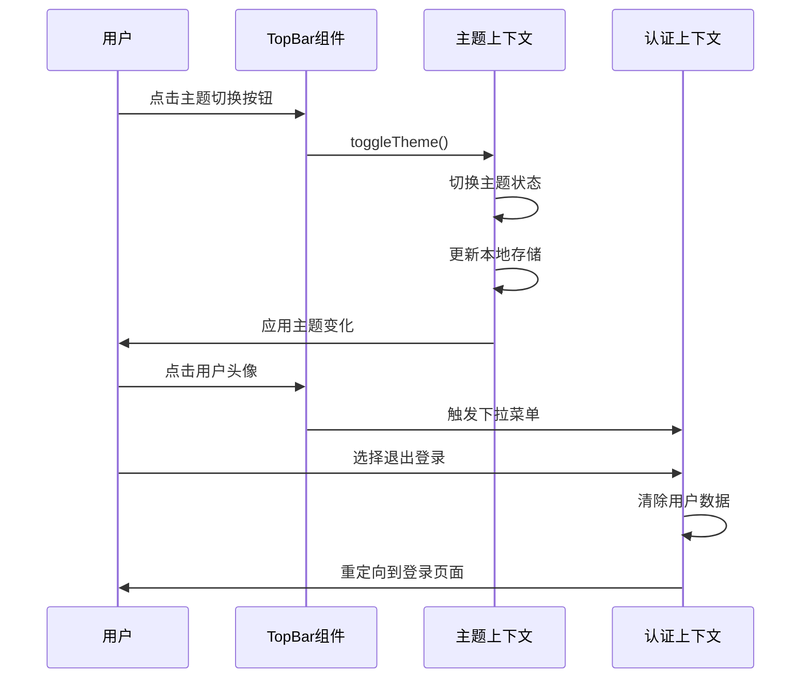
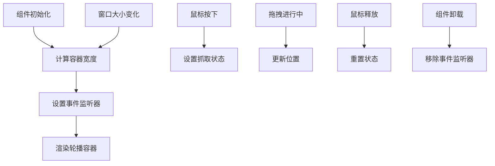
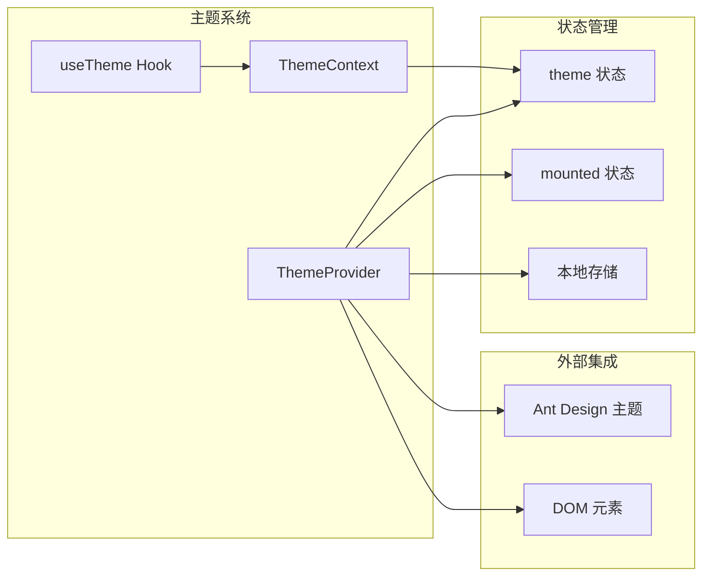
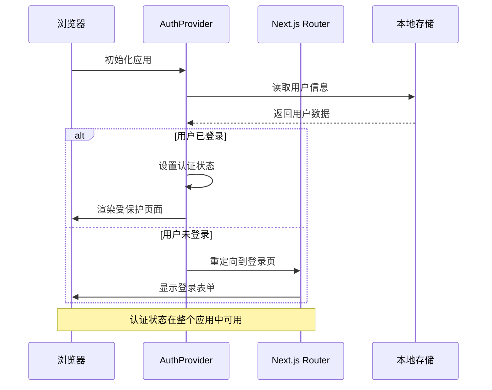
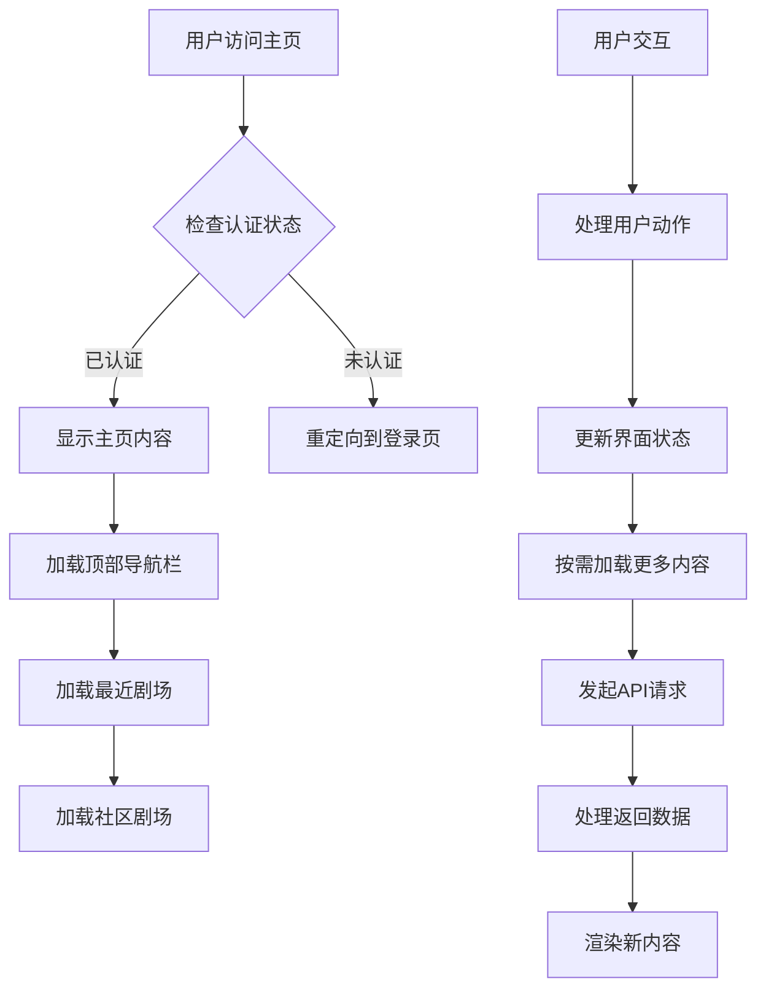
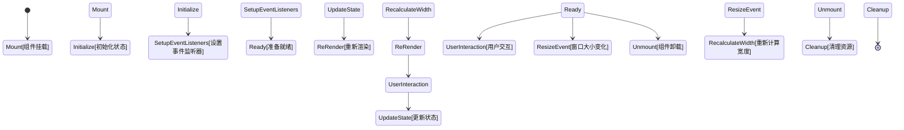

# 主页组件文档

<cite>
**本文档中引用的文件**
- [frontend/src/app/page.tsx](file://frontend/src/app/page.tsx)
- [frontend/src/components/home/TopBar.tsx](file://frontend/src/components/home/TopBar.tsx)
- [frontend/src/components/home/RecentTheaters.tsx](file://frontend/src/components/home/RecentTheaters.tsx)
- [frontend/src/components/home/SharedTheaters.tsx](file://frontend/src/components/home/SharedTheaters.tsx)
- [frontend/src/components/home/TheaterCard.tsx](file://frontend/src/components/home/TheaterCard.tsx)
- [frontend/src/components/home/CreateTheaterCard.tsx](file://frontend/src/components/home/CreateTheaterCard.tsx)
- [frontend/src/context/ThemeContext.tsx](file://frontend/src/context/ThemeContext.tsx)
- [frontend/src/context/AuthContext.tsx](file://frontend/src/context/AuthContext.tsx)
- [frontend/src/app/layout.tsx](file://frontend/src/app/layout.tsx)
- [frontend/src/lib/utils.ts](file://frontend/src/lib/utils.ts)
- [frontend/src/components/ui/button.tsx](file://frontend/src/components/ui/button.tsx)
</cite>

## 目录
1. [简介](#简介)
2. [项目结构概览](#项目结构概览)
3. [核心组件架构](#核心组件架构)
4. [主页组件详细分析](#主页组件详细分析)
5. [主题与认证系统](#主题与认证系统)
6. [交互流程分析](#交互流程分析)
7. [性能优化考虑](#性能优化考虑)
8. [故障排除指南](#故障排除指南)
9. [总结](#总结)

## 简介

Infinite Narrative Theater 是一个基于 Next.js 构建的 AI 驱动无限叙事剧院平台。本文档深入分析了主页组件的架构设计、实现细节和交互逻辑，涵盖了从顶层布局到具体功能组件的完整实现。

该平台允许用户创建、浏览和共享叙事剧场内容，提供了现代化的用户体验和丰富的交互功能。主页作为用户访问应用时的主要界面，集成了导航、搜索、主题切换、用户认证等核心功能。

## 项目结构概览

项目采用模块化架构设计，主要分为三个核心部分：



**图表来源**
- [frontend/src/app/layout.tsx:23-41](file://frontend/src/app/layout.tsx#L23-L41)
- [frontend/src/app/page.tsx:7-18](file://frontend/src/app/page.tsx#L7-L18)

**章节来源**
- [frontend/src/app/layout.tsx:1-42](file://frontend/src/app/layout.tsx#L1-L42)
- [frontend/src/app/page.tsx:1-19](file://frontend/src/app/page.tsx#L1-L19)

## 核心组件架构

### 主页组件层次结构



**图表来源**
- [frontend/src/app/page.tsx:7-18](file://frontend/src/app/page.tsx#L7-L18)
- [frontend/src/components/home/TopBar.tsx:10-109](file://frontend/src/components/home/TopBar.tsx#L10-L109)
- [frontend/src/components/home/RecentTheaters.tsx:9-50](file://frontend/src/components/home/RecentTheaters.tsx#L9-L50)
- [frontend/src/components/home/SharedTheaters.tsx:7-78](file://frontend/src/components/home/SharedTheaters.tsx#L7-L78)

### 组件依赖关系图



**图表来源**
- [frontend/src/components/home/TopBar.tsx:10-109](file://frontend/src/components/home/TopBar.tsx#L10-L109)
- [frontend/src/components/home/RecentTheaters.tsx:9-50](file://frontend/src/components/home/RecentTheaters.tsx#L9-L50)
- [frontend/src/components/home/SharedTheaters.tsx:7-78](file://frontend/src/components/home/SharedTheaters.tsx#L7-L78)

## 主页组件详细分析

### TopBar 组件分析

TopBar 是主页顶部的导航栏组件，集成了多种用户交互功能：

#### 核心功能特性

1. **动态主题切换**：支持明暗主题模式切换
2. **用户认证状态管理**：显示用户信息和提供登出功能
3. **搜索功能**：可展开的搜索输入框
4. **移动端菜单**：响应式侧边栏抽屉

#### 组件实现要点



**图表来源**
- [frontend/src/components/home/TopBar.tsx:10-109](file://frontend/src/components/home/TopBar.tsx#L10-L109)
- [frontend/src/context/ThemeContext.tsx:38-40](file://frontend/src/context/ThemeContext.tsx#L38-L40)
- [frontend/src/context/AuthContext.tsx:85-92](file://frontend/src/context/AuthContext.tsx#L85-L92)

**章节来源**
- [frontend/src/components/home/TopBar.tsx:1-109](file://frontend/src/components/home/TopBar.tsx#L1-L109)

### RecentTheaters 组件分析

RecentTheaters 实现了轮播式的剧场展示功能，支持拖拽操作和响应式设计。

#### 关键技术实现

1. **拖拽轮播效果**：使用 Framer Motion 实现流畅的拖拽体验
2. **自适应宽度计算**：根据容器尺寸动态计算可拖拽范围
3. **事件监听管理**：正确处理窗口大小变化事件

#### 性能优化策略



**图表来源**
- [frontend/src/components/home/RecentTheaters.tsx:14-24](file://frontend/src/components/home/RecentTheaters.tsx#L14-L24)

**章节来源**
- [frontend/src/components/home/RecentTheaters.tsx:1-50](file://frontend/src/components/home/RecentTheaters.tsx#L1-L50)

### SharedTheaters 组件分析

SharedTheaters 负责展示社区剧场内容，实现了虚拟滚动和懒加载功能。

#### 功能特性

1. **Intersection Observer**：实现无限滚动加载
2. **防重复请求**：通过 loadingRef 防止重复触发
3. **占位符加载**：提供良好的用户体验

#### 数据流处理

```mermaid
stateDiagram-v2
[*] --> 初始化
初始化 --> 检查数据长度
检查数据长度 --> 长度为0 : 加载初始数据
检查数据长度 --> 长度>0 : 已有数据
加载初始数据 --> 设置加载状态
设置加载状态 --> 触发API调用
触发API调用 --> 获取数据成功
触发API调用 --> 获取数据失败
获取数据成功 --> 更新状态
获取数据失败 --> 错误处理
更新状态 --> 渲染组件
渲染组件 --> 等待滚动触发
等待滚动触发 --> 进入视口
进入视口 --> 检查是否需要加载
检查是否需要加载 --> 需要加载 --> 设置加载状态
检查是否需要加载 --> 不需要加载 --> [*]
```

**图表来源**
- [frontend/src/components/home/SharedTheaters.tsx:13-25](file://frontend/src/components/home/SharedTheaters.tsx#L13-L25)

**章节来源**
- [frontend/src/components/home/SharedTheaters.tsx:1-78](file://frontend/src/components/home/SharedTheaters.tsx#L1-L78)

### 剧场卡片组件分析

#### TheaterCard 组件

TheaterCard 提供了精美的卡片式展示效果：

1. **渐变背景动画**：支持纯色渐变背景
2. **悬停效果**：包含缩放和透明度变化
3. **内容覆盖层**：提供半透明遮罩和文字展示
4. **立即播放按钮**：悬停时显示的操作按钮

#### CreateTheaterCard 组件

CreateTheaterCard 专门用于创建新剧场的入口：

1. **加号图标**：直观的创建指示
2. **悬停动画**：scale 变换效果
3. **点击交互**：导航到创建页面

**章节来源**
- [frontend/src/components/home/TheaterCard.tsx:1-55](file://frontend/src/components/home/TheaterCard.tsx#L1-L55)
- [frontend/src/components/home/CreateTheaterCard.tsx:1-27](file://frontend/src/components/home/CreateTheaterCard.tsx#L1-L27)

## 主题与认证系统

### 主题管理系统

主题系统采用 Context API 实现，支持本地存储和系统偏好检测：



**图表来源**
- [frontend/src/context/ThemeContext.tsx:16-64](file://frontend/src/context/ThemeContext.tsx#L16-L64)

### 认证系统架构

认证系统提供了完整的用户状态管理和路由保护机制：



**图表来源**
- [frontend/src/context/AuthContext.tsx:58-71](file://frontend/src/context/AuthContext.tsx#L58-L71)

**章节来源**
- [frontend/src/context/ThemeContext.tsx:1-74](file://frontend/src/context/ThemeContext.tsx#L1-L74)
- [frontend/src/context/AuthContext.tsx:1-100](file://frontend/src/context/AuthContext.tsx#L1-L100)

## 交互流程分析

### 用户导航流程



**图表来源**
- [frontend/src/app/page.tsx:7-18](file://frontend/src/app/page.tsx#L7-L18)
- [frontend/src/components/home/RecentTheaters.tsx:42-42](file://frontend/src/components/home/RecentTheaters.tsx#L42-L42)

### 组件生命周期管理



**图表来源**
- [frontend/src/components/home/RecentTheaters.tsx:14-24](file://frontend/src/components/home/RecentTheaters.tsx#L14-L24)

## 性能优化考虑

### 渲染优化策略

1. **React.memo 使用**：避免不必要的组件重渲染
2. **useCallback 优化**：稳定函数引用，减少子组件重渲染
3. **Intersection Observer**：延迟加载非首屏内容
4. **事件节流**：控制 resize 事件的处理频率

### 内存管理

1. **清理事件监听器**：在组件卸载时移除所有监听器
2. **防抖处理**：对高频操作进行防抖
3. **状态最小化**：只存储必要的组件状态

### 图片优化

1. **Next.js Image 组件**：自动优化图片加载
2. **渐进式加载**：先显示低质量版本再加载高质量版本
3. **懒加载策略**：非可见区域的图片延迟加载

## 故障排除指南

### 常见问题及解决方案

#### 主题切换不生效

**问题描述**：用户切换主题后界面没有变化

**可能原因**：
1. 本地存储中的主题状态异常
2. DOM 类名更新失败
3. Ant Design 主题配置错误

**解决步骤**：
1. 检查本地存储中的主题值
2. 验证 DOM 元素的类名变化
3. 确认 Ant Design 主题算法配置

#### 认证状态不同步

**问题描述**：用户登录后仍显示未登录状态

**可能原因**：
1. 本地存储中的令牌过期
2. 路由守卫逻辑错误
3. 用户信息格式不正确

**解决步骤**：
1. 检查访问令牌和刷新令牌
2. 验证用户信息的 JSON 格式
3. 确认路由守卫的判断逻辑

#### 轮播组件拖拽失效

**问题描述**：RecentTheaters 组件无法正常拖拽

**可能原因**：
1. 容器宽度计算错误
2. 事件监听器未正确绑定
3. Framer Motion 配置问题

**解决步骤**：
1. 验证容器的 scrollWidth 和 offsetWidth
2. 检查事件监听器的添加和移除
3. 确认拖拽约束配置

**章节来源**
- [frontend/src/context/ThemeContext.tsx:20-36](file://frontend/src/context/ThemeContext.tsx#L20-L36)
- [frontend/src/context/AuthContext.tsx:58-71](file://frontend/src/context/AuthContext.tsx#L58-L71)
- [frontend/src/components/home/RecentTheaters.tsx:14-24](file://frontend/src/components/home/RecentTheaters.tsx#L14-L24)

## 总结

Infinite Narrative Theater 的主页组件展现了现代前端开发的最佳实践，通过精心设计的组件架构、完善的上下文管理和优化的用户体验，为用户提供了流畅的交互体验。

### 主要成就

1. **模块化设计**：清晰的组件分层和职责分离
2. **响应式交互**：流畅的动画效果和用户反馈
3. **性能优化**：合理的状态管理和资源优化
4. **可扩展性**：良好的架构为未来功能扩展奠定基础

### 技术亮点

- **Framer Motion**：提供自然的动画过渡效果
- **Ant Design**：统一的 UI 设计语言
- **Next.js Image**：优化的图片加载机制
- **Context API**：简洁的状态管理模式

该主页组件为整个应用奠定了坚实的基础，通过持续的优化和改进，能够为用户提供更加优质的叙事体验。