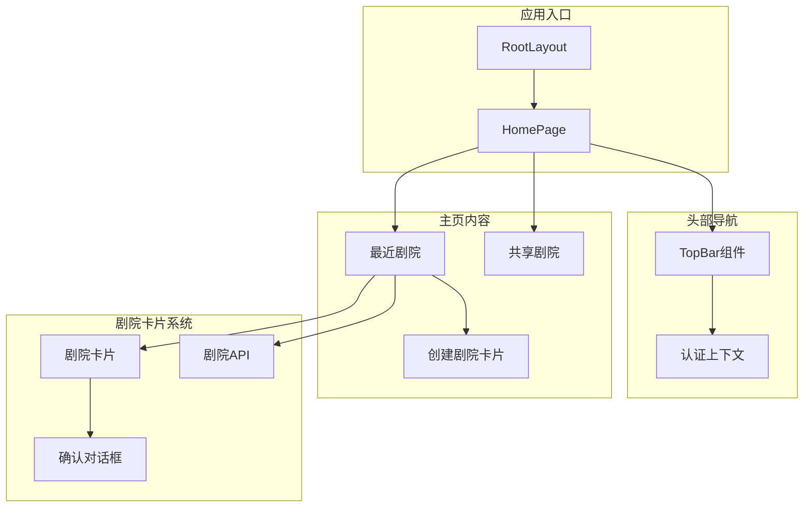
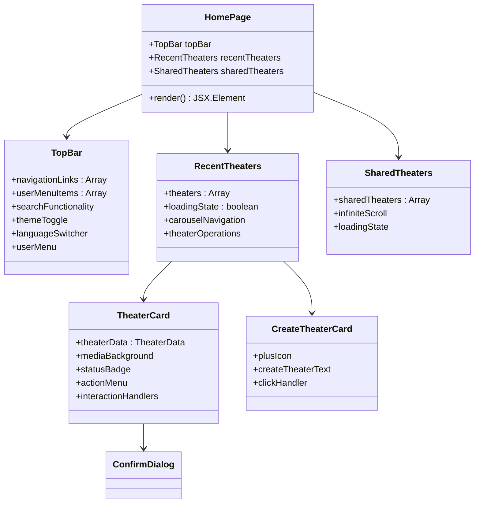
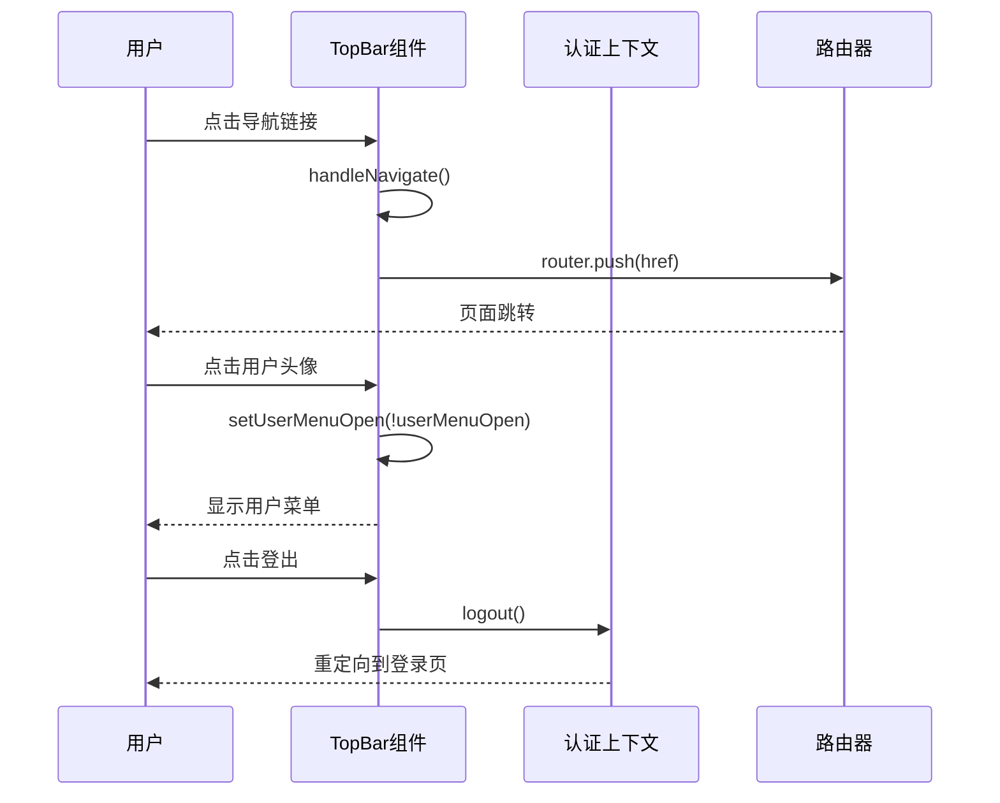
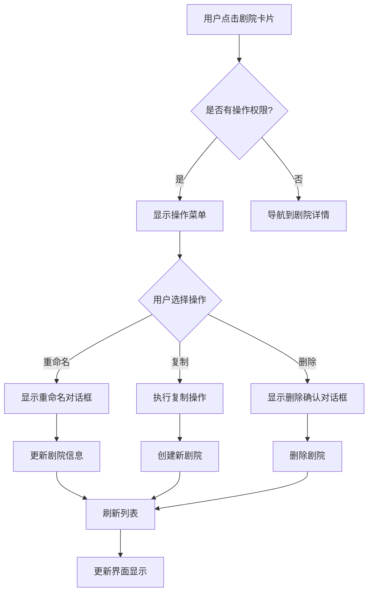
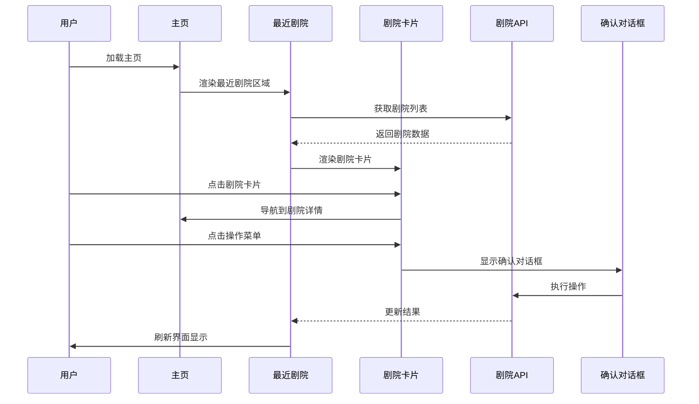
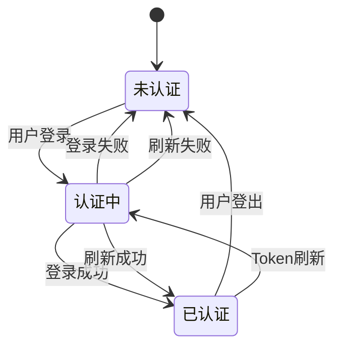
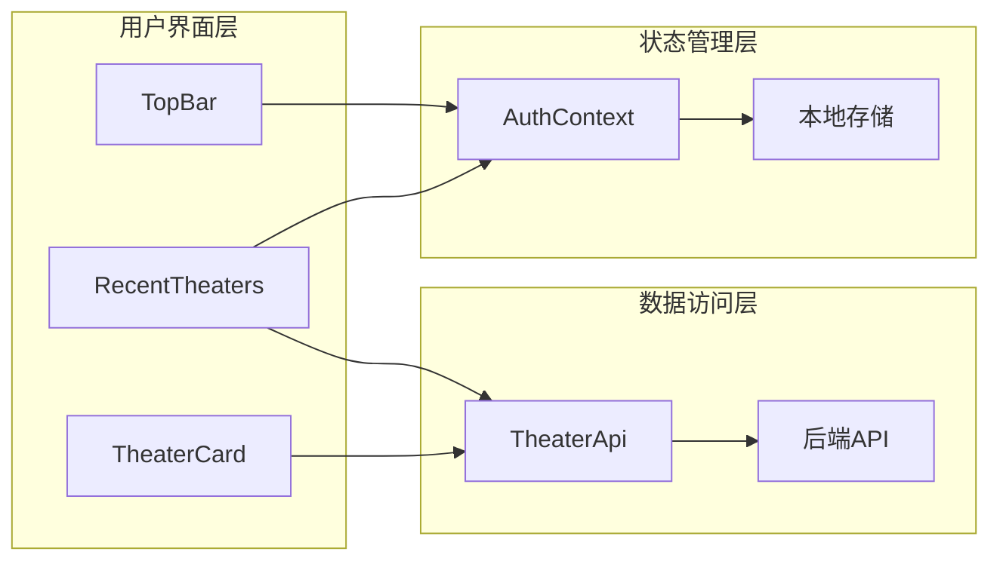
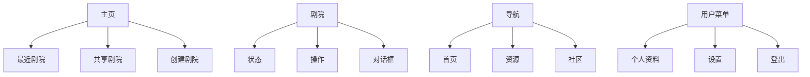
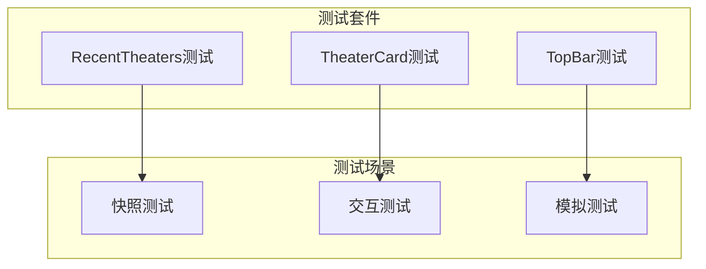

# 主页组件文档

<cite>
**本文档引用的文件**
- [frontend/src/app/page.tsx](file://frontend/src/app/page.tsx)
- [frontend/src/components/home/TheaterCard.tsx](file://frontend/src/components/home/TheaterCard.tsx)
- [frontend/src/components/home/RecentTheaters.tsx](file://frontend/src/components/home/RecentTheaters.tsx)
- [frontend/src/components/home/CreateTheaterCard.tsx](file://frontend/src/components/home/CreateTheaterCard.tsx)
- [frontend/src/components/home/SharedTheaters.tsx](file://frontend/src/components/home/SharedTheaters.tsx)
- [frontend/src/components/home/TopBar.tsx](file://frontend/src/components/home/TopBar.tsx)
- [frontend/src/lib/theaterApi.ts](file://frontend/src/lib/theaterApi.ts)
- [frontend/src/context/AuthContext.tsx](file://frontend/src/context/AuthContext.tsx)
- [frontend/src/components/ui/confirm-dialog.tsx](file://frontend/src/components/ui/confirm-dialog.tsx)
- [frontend/src/lib/utils.ts](file://frontend/src/lib/utils.ts)
- [frontend/src/i18n/locales/en-US.json](file://frontend/src/i18n/locales/en-US.json)
- [frontend/src/app/layout.tsx](file://frontend/src/app/layout.tsx)
- [frontend/src/components/ui/button.tsx](file://frontend/src/components/ui/button.tsx)
- [frontend/src/components/ui/card.tsx](file://frontend/src/components/ui/card.tsx)
- [frontend/src/components/home/__tests__/RecentTheaters.test.tsx](file://frontend/src/components/home/__tests__/RecentTheaters.test.tsx)
- [frontend/src/components/home/__tests__/TheaterCard.test.tsx](file://frontend/src/components/home/__tests__/TheaterCard.test.tsx)
</cite>

## 目录
1. [简介](#简介)
2. [项目结构概览](#项目结构概览)
3. [核心组件架构](#核心组件架构)
4. [主页组件详细分析](#主页组件详细分析)
5. [交互流程图](#交互流程图)
6. [状态管理与数据流](#状态管理与数据流)
7. [国际化支持](#国际化支持)
8. [性能优化策略](#性能优化策略)
9. [测试覆盖](#测试覆盖)
10. [总结](#总结)

## 简介

本文件详细分析了无限游戏项目前端主页的组件架构和实现细节。该主页采用现代化的React + Next.js技术栈构建，提供了剧院（Theater）管理、用户交互和内容展示的核心功能。系统支持多语言国际化、主题切换、响应式设计，并集成了丰富的UI组件库。

## 项目结构概览

**图表来源**
- [frontend/src/app/layout.tsx:24-44](file://frontend/src/app/layout.tsx#L24-L44)
- [frontend/src/app/page.tsx:7-18](file://frontend/src/app/page.tsx#L7-L18)

## 核心组件架构

### 组件层次结构

**图表来源**
- [frontend/src/app/page.tsx:7-18](file://frontend/src/app/page.tsx#L7-L18)
- [frontend/src/components/home/TopBar.tsx:35-374](file://frontend/src/components/home/TopBar.tsx#L35-L374)
- [frontend/src/components/home/RecentTheaters.tsx:18-163](file://frontend/src/components/home/RecentTheaters.tsx#L18-L163)

## 主页组件详细分析

### TopBar - 顶部导航栏

TopBar组件实现了完整的导航栏功能，包括品牌标识、主导航链接、搜索功能、主题切换、语言切换和用户菜单。

#### 核心功能特性

- **响应式设计**: 支持桌面端和移动端的不同布局
- **导航高亮**: 使用动画效果显示当前激活的导航项
- **搜索集成**: 内置搜索功能，支持展开/收起动画
- **用户认证**: 集成认证状态管理和登出功能
- **主题切换**: 支持明暗主题模式切换

#### 交互流程

**图表来源**
- [frontend/src/components/home/TopBar.tsx:71-94](file://frontend/src/components/home/TopBar.tsx#L71-L94)
- [frontend/src/context/AuthContext.tsx:154-161](file://frontend/src/context/AuthContext.tsx#L154-L161)

**章节来源**
- [frontend/src/components/home/TopBar.tsx:35-374](file://frontend/src/components/home/TopBar.tsx#L35-L374)
- [frontend/src/context/AuthContext.tsx:119-207](file://frontend/src/context/AuthContext.tsx#L119-L207)

### RecentTheaters - 最近剧院

RecentTheaters组件负责展示用户的最近剧院作品，提供轮播浏览和剧院操作功能。

#### 数据加载机制

组件采用智能的数据加载策略：

1. **懒加载**: 仅在用户认证后才加载剧院数据
2. **缓存策略**: 首次加载后缓存剧院列表
3. **节点信息**: 对于没有缩略图的剧院，动态获取完整节点信息
4. **轮播效果**: 使用Framer Motion实现流畅的拖拽轮播

#### 剧院操作功能

- **重命名**: 通过输入对话框实现剧院名称修改
- **复制**: 创建剧院的完整副本
- **删除**: 安全删除剧院及其关联数据
- **导航**: 点击进入剧院编辑页面

**章节来源**
- [frontend/src/components/home/RecentTheaters.tsx:18-163](file://frontend/src/components/home/RecentTheaters.tsx#L18-L163)
- [frontend/src/lib/theaterApi.ts:107-158](file://frontend/src/lib/theaterApi.ts#L107-L158)

### TheaterCard - 剧院卡片

TheaterCard是单个剧院的可视化表示，提供了丰富的交互功能和视觉效果。

#### 视觉设计特性

- **媒体背景**: 自动从剧院节点中提取图片或视频作为背景
- **状态指示**: 不同状态（草稿、发布、归档）显示对应图标和颜色
- **悬停效果**: 使用Framer Motion实现平滑的缩放和过渡动画
- **渐变遮罩**: 底部渐变遮罩提升文字可读性

#### 交互功能

**图表来源**
- [frontend/src/components/home/TheaterCard.tsx:126-184](file://frontend/src/components/home/TheaterCard.tsx#L126-L184)
- [frontend/src/components/home/RecentTheaters.tsx:71-99](file://frontend/src/components/home/RecentTheaters.tsx#L71-L99)

**章节来源**
- [frontend/src/components/home/TheaterCard.tsx:63-320](file://frontend/src/components/home/TheaterCard.tsx#L63-L320)

### CreateTheaterCard - 创建剧院卡片

CreateTheaterCard提供直观的创建新剧院入口，采用独特的视觉设计来引导用户创建内容。

#### 设计特点

- **占位符样式**: 虚线边框和径向渐变背景
- **图标动画**: 中心加号图标具有悬停缩放效果
- **文本提示**: 清晰的创建引导文字
- **响应式布局**: 在轮播中始终作为第一个元素显示

**章节来源**
- [frontend/src/components/home/CreateTheaterCard.tsx:12-60](file://frontend/src/components/home/CreateTheaterCard.tsx#L12-L60)

### SharedTheaters - 共享剧院

SharedTheaters组件展示了社区共享的剧院作品，目前处于开发阶段，预留了完整的扩展接口。

#### 当前状态

- **骨架实现**: 提供完整的组件结构和样式
- **占位符内容**: 显示"暂无内容"的状态提示
- **滚动加载**: 预留了Intersection Observer的懒加载实现
- **网格布局**: 支持响应式的剧院网格显示

**章节来源**
- [frontend/src/components/home/SharedTheaters.tsx:9-96](file://frontend/src/components/home/SharedTheaters.tsx#L9-L96)

## 交互流程图

### 主页整体交互流程

**图表来源**
- [frontend/src/app/page.tsx:7-18](file://frontend/src/app/page.tsx#L7-L18)
- [frontend/src/components/home/RecentTheaters.tsx:40-69](file://frontend/src/components/home/RecentTheaters.tsx#L40-L69)

## 状态管理与数据流

### 认证状态管理

系统采用React Context模式管理全局状态：

**图表来源**
- [frontend/src/context/AuthContext.tsx:127-140](file://frontend/src/context/AuthContext.tsx#L127-L140)

### 数据流架构

**图表来源**
- [frontend/src/context/AuthContext.tsx:201-207](file://frontend/src/context/AuthContext.tsx#L201-L207)
- [frontend/src/lib/theaterApi.ts:107-158](file://frontend/src/lib/theaterApi.ts#L107-L158)

**章节来源**
- [frontend/src/context/AuthContext.tsx:1-207](file://frontend/src/context/AuthContext.tsx#L1-L207)
- [frontend/src/lib/theaterApi.ts:1-159](file://frontend/src/lib/theaterApi.ts#L1-L159)

## 国际化支持

系统实现了完整的多语言支持，主要体现在以下方面：

### 语言切换机制

- **动态加载**: 支持运行时切换语言而不刷新页面
- **资源管理**: 按模块组织翻译资源，便于维护
- **回退机制**: 语言缺失时自动回退到默认语言

### 翻译键值结构

**图表来源**
- [frontend/src/i18n/locales/en-US.json:52-93](file://frontend/src/i18n/locales/en-US.json#L52-L93)

**章节来源**
- [frontend/src/i18n/locales/en-US.json:1-200](file://frontend/src/i18n/locales/en-US.json#L1-L200)

## 性能优化策略

### 渲染优化

1. **组件懒加载**: 使用React.lazy和Suspense实现按需加载
2. **虚拟滚动**: 对大量剧院数据使用虚拟化渲染
3. **记忆化**: 使用useMemo和useCallback避免不必要的重渲染
4. **代码分割**: 将大组件拆分为独立的chunk

### 网络优化

1. **请求缓存**: API响应结果缓存，减少重复请求
2. **批量操作**: 合并多个API调用为批量请求
3. **防抖节流**: 搜索和滚动事件使用防抖优化
4. **连接复用**: 复用HTTP连接，减少握手开销

### 资源优化

1. **图片优化**: 使用Next.js Image组件自动优化图片
2. **字体优化**: 使用可变字体减少字体包大小
3. **CSS优化**: Tailwind CSS按需生成，移除未使用样式
4. **动画优化**: 使用transform替代position属性进行动画

## 测试覆盖

### 单元测试策略

系统实现了全面的单元测试覆盖：

#### 组件测试

**图表来源**
- [frontend/src/components/home/__tests__/RecentTheaters.test.tsx:32-72](file://frontend/src/components/home/__tests__/RecentTheaters.test.tsx#L32-L72)
- [frontend/src/components/home/__tests__/TheaterCard.test.tsx:13-42](file://frontend/src/components/home/__tests__/TheaterCard.test.tsx#L13-L42)

#### 测试实现要点

- **Mock依赖**: 使用Jest mock隔离外部依赖
- **异步测试**: 正确处理Promise和异步操作
- **快照测试**: 确保UI组件稳定性
- **交互验证**: 测试用户交互行为

**章节来源**
- [frontend/src/components/home/__tests__/RecentTheaters.test.tsx:1-72](file://frontend/src/components/home/__tests__/RecentTheaters.test.tsx#L1-L72)
- [frontend/src/components/home/__tests__/TheaterCard.test.tsx:1-42](file://frontend/src/components/home/__tests__/TheaterCard.test.tsx#L1-L42)

## 总结

无限游戏项目的主页组件展现了现代Web应用的最佳实践：

### 技术亮点

1. **架构清晰**: 组件层次分明，职责单一
2. **用户体验**: 流畅的动画效果和响应式设计
3. **可扩展性**: 模块化设计便于功能扩展
4. **国际化**: 完整的多语言支持
5. **测试完善**: 全面的单元测试覆盖

### 架构优势

- **松耦合**: 组件间通信通过props和context实现
- **高内聚**: 每个组件专注于特定功能
- **可维护性**: 清晰的代码结构和注释
- **性能优化**: 多层次的性能优化策略

该主页组件为整个无限游戏平台提供了坚实的基础，为后续的功能扩展和性能优化奠定了良好的技术基础。