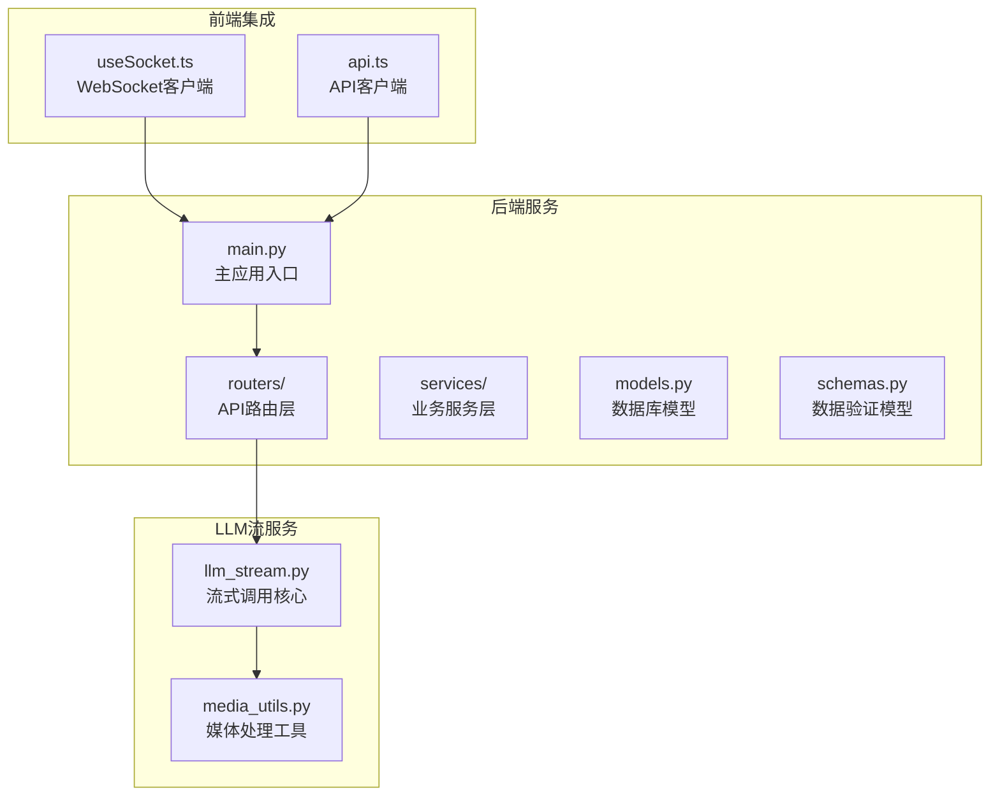
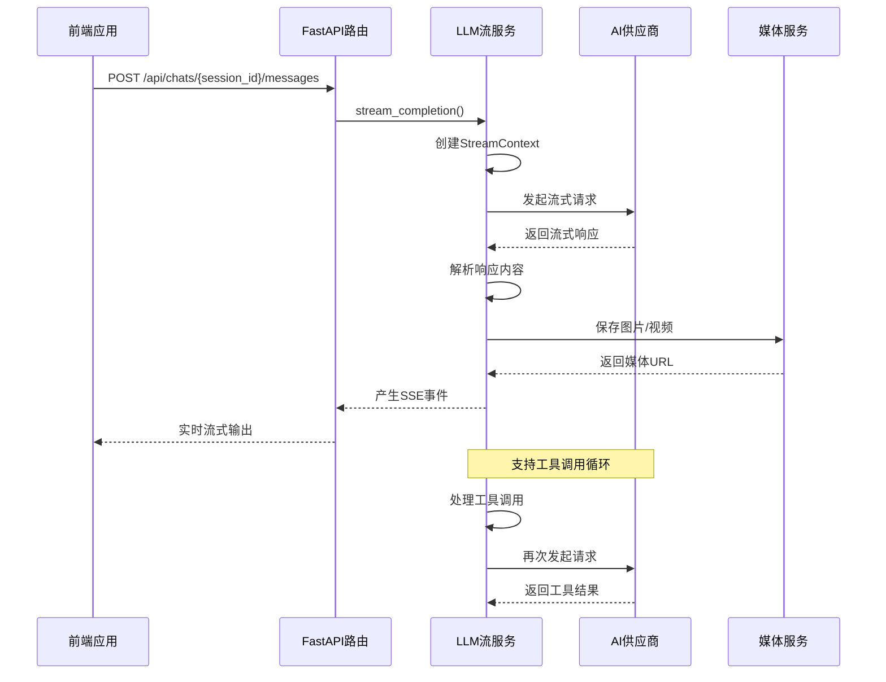
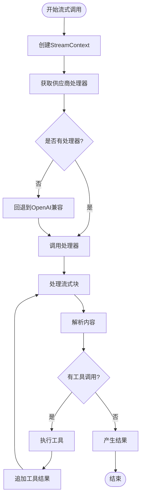
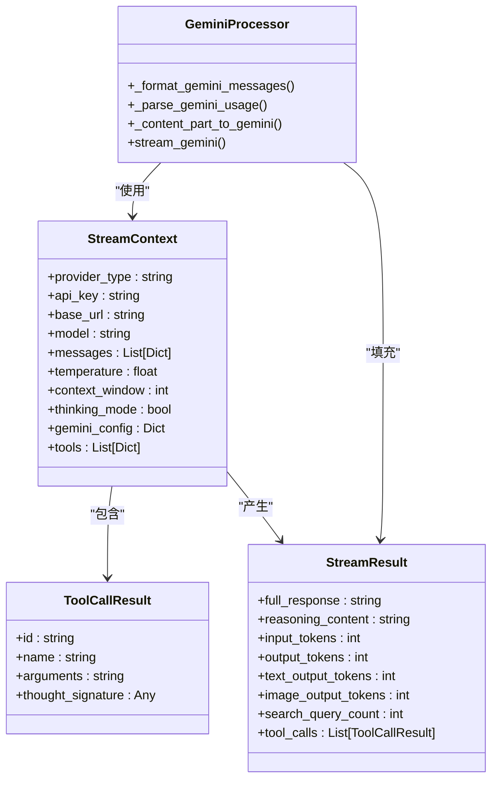
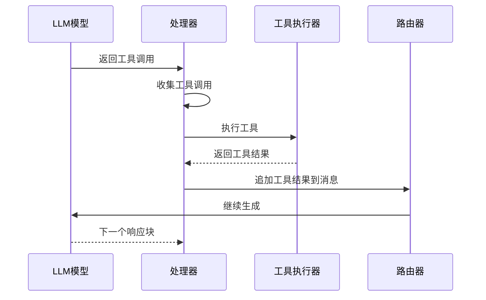
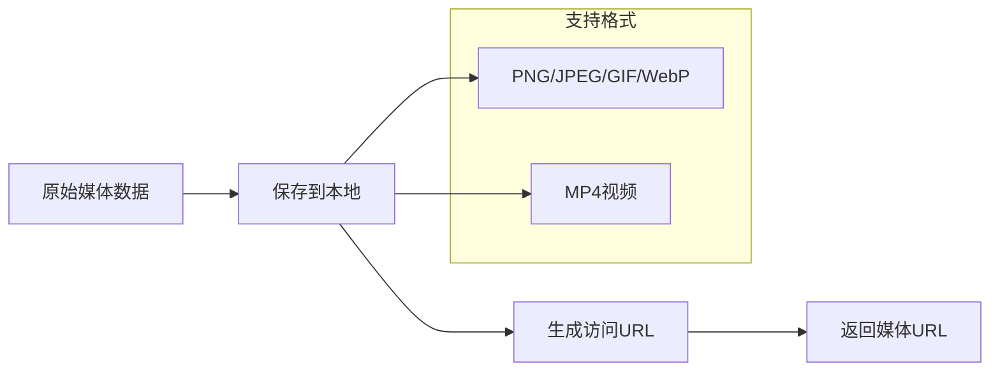
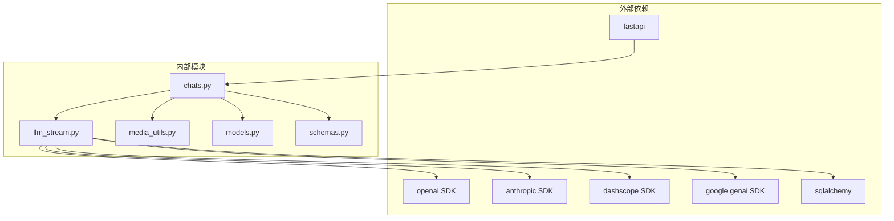

# Llm Stream Service

<cite>
**本文档引用的文件**
- [llm_stream.py](file://backend/services/llm_stream.py)
- [chats.py](file://backend/routers/chats.py)
- [llm_config.py](file://backend/routers/llm_config.py)
- [media_utils.py](file://backend/services/media_utils.py)
- [main.py](file://backend/main.py)
- [models.py](file://backend/models.py)
- [schemas.py](file://backend/schemas.py)
- [useSocket.ts](file://frontend/src/hooks/useSocket.ts)
- [api.ts](file://frontend/src/lib/api.ts)
</cite>

## 目录
1. [简介](#简介)
2. [项目结构](#项目结构)
3. [核心组件](#核心组件)
4. [架构概览](#架构概览)
5. [详细组件分析](#详细组件分析)
6. [依赖关系分析](#依赖关系分析)
7. [性能考虑](#性能考虑)
8. [故障排除指南](#故障排除指南)
9. [结论](#结论)

## 简介

Llm Stream Service 是一个高度模块化的流式语言模型服务，支持多种AI供应商（OpenAI、Anthropic、Gemini等），提供统一的流式API接口。该服务采用注册表模式实现供应商解耦，支持工具调用、思维模式、多模态内容处理等功能。

该服务主要服务于无限叙事剧院（Infinite Narrative Theater）项目，为前端提供实时的AI对话体验，支持多智能体协作、工具调用、图片生成等多种高级功能。

## 项目结构

**图表来源**
- [main.py:1-170](file://backend/main.py#L1-L170)
- [llm_stream.py:1-701](file://backend/services/llm_stream.py#L1-L701)

**章节来源**
- [main.py:1-170](file://backend/main.py#L1-L170)
- [llm_stream.py:1-701](file://backend/services/llm_stream.py#L1-L701)

## 核心组件

### 流式调用上下文
StreamContext封装了所有LLM调用所需的上下文信息，包括：
- 供应商类型和认证信息
- 模型配置和温度参数
- 消息历史和工具定义
- 思维模式和Gemini特定配置

### 结果聚合器
StreamResult负责收集和统计LLM调用的各种指标：
- 文本响应内容
- 推理内容（思维模式）
- Token使用统计（文本、图像模态分离）
- 工具调用结果
- 搜索查询次数

### 供应商注册表
采用装饰器模式实现供应商处理器注册，支持：
- OpenAI兼容供应商（openai、deepseek、xai、azure）
- Anthropic兼容供应商（anthropic、minimax）
- DashScope供应商
- Gemini供应商

**章节来源**
- [llm_stream.py:12-47](file://backend/services/llm_stream.py#L12-L47)
- [llm_stream.py:56-66](file://backend/services/llm_stream.py#L56-L66)
- [llm_stream.py:646-701](file://backend/services/llm_stream.py#L646-L701)

## 架构概览

**图表来源**
- [chats.py:465-520](file://backend/routers/chats.py#L465-L520)
- [llm_stream.py:646-701](file://backend/services/llm_stream.py#L646-L701)

## 详细组件分析

### 流式调用核心流程

**图表来源**
- [llm_stream.py:646-701](file://backend/services/llm_stream.py#L646-L701)
- [chats.py:465-520](file://backend/routers/chats.py#L465-L520)

### 多模态内容处理

Gemini供应商实现了复杂的多模态内容转换：

**图表来源**
- [llm_stream.py:12-47](file://backend/services/llm_stream.py#L12-L47)
- [llm_stream.py:286-641](file://backend/services/llm_stream.py#L286-L641)

**章节来源**
- [llm_stream.py:286-641](file://backend/services/llm_stream.py#L286-L641)

### 工具调用机制

服务支持多种工具调用格式的统一处理：

**图表来源**
- [chats.py:304-363](file://backend/routers/chats.py#L304-L363)
- [llm_stream.py:121-143](file://backend/services/llm_stream.py#L121-L143)

**章节来源**
- [chats.py:304-363](file://backend/routers/chats.py#L304-L363)
- [llm_stream.py:121-143](file://backend/services/llm_stream.py#L121-L143)

### 媒体处理服务

**图表来源**
- [media_utils.py:20-51](file://backend/services/media_utils.py#L20-L51)

**章节来源**
- [media_utils.py:20-51](file://backend/services/media_utils.py#L20-L51)

## 依赖关系分析

**图表来源**
- [llm_stream.py:80-85](file://backend/services/llm_stream.py#L80-L85)
- [chats.py:16-21](file://backend/routers/chats.py#L16-L21)

**章节来源**
- [llm_stream.py:80-85](file://backend/services/llm_stream.py#L80-L85)
- [chats.py:16-21](file://backend/routers/chats.py#L16-L21)

## 性能考虑

### Token统计优化
- 分模态Token统计（文本/图像）避免重复计算
- 使用映射表替代条件判断提升性能
- 流式处理减少内存占用

### 并发处理
- 异步生成器模式支持高并发流式响应
- 工具调用循环限制（默认5轮）防止无限循环
- 连接池管理优化第三方API调用

### 缓存策略
- 媒体文件本地缓存避免重复下载
- UUID命名确保唯一性和缓存友好性

## 故障排除指南

### 常见问题诊断

**连接问题**
- 检查API密钥有效性
- 验证base_url配置正确性
- 确认网络连通性

**工具调用失败**
- 验证工具定义格式正确
- 检查工具权限配置
- 确认工具执行环境

**媒体处理错误**
- 检查媒体目录写权限
- 验证MIME类型映射
- 确认文件大小限制

**章节来源**
- [llm_stream.py:686-701](file://backend/services/llm_stream.py#L686-L701)
- [chats.py:520-528](file://backend/routers/chats.py#L520-L528)

## 结论

Llm Stream Service通过模块化设计和注册表模式实现了高度可扩展的多供应商LLM服务。其核心优势包括：

1. **统一接口**：支持多种供应商的统一API
2. **流式处理**：实时响应和低延迟用户体验
3. **工具调用**：完整的工具执行生命周期管理
4. **多模态支持**：文本、图像、视频的统一处理
5. **性能优化**：异步流式处理和智能缓存策略

该服务为无限叙事剧院项目提供了强大的AI能力基础，支持复杂的多智能体协作和丰富的交互体验。